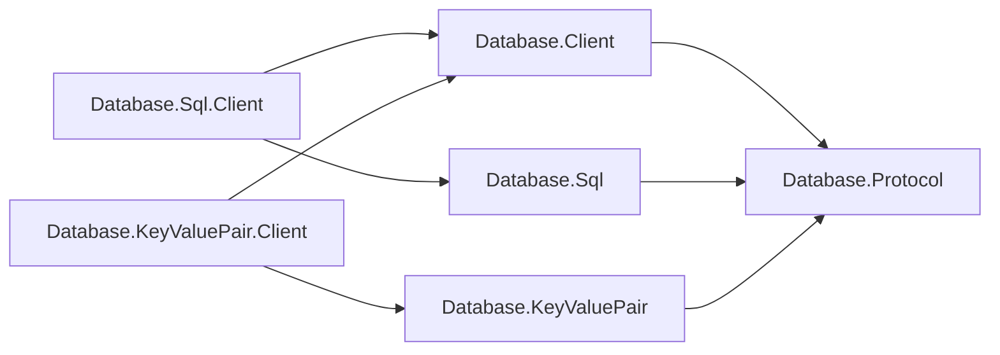

# Assimalign.Cohesion.Database.Client — Design

The shared client owns transport dialing, startup/authentication, framing, pooling,
and connection health. Model clients own request encoding, response validation, and
result materialization. The shared client references no model package and imposes
no result shape.

## Family boundary

Clients depend on shared mechanism and their own model's wire codecs:

| Package | Responsibility |
| --- | --- |
| Database.Client | Dial, handshake, bounded pooling, framed exchange lifetime |
| Database.Protocol | Framing, shared messages, immutable family binding |
| Database.Sql.Client | SQL parameter encoding, decoding, and materialization |
| Database.KeyValuePair.Client | Key-value encoding, decoding, and materialization |
| Model packages | Model identifiers and payload codecs |

`DatabaseClientOptions.Family` is mandatory. The pool captures the exact immutable
`ProtocolMessageFamily` instance before dialing. Every connection uses a
`ProtocolChannel` bound to that family throughout its lifetime. An
`IDatabaseProtocolExchange<TResult>` supplies its required family and consumes one
exchange through the channel reader and writer. A different family instance is
rejected before execution, including a family that reuses the same identifier bytes.

The operation returns only after consuming the complete response and must not
retain or dispose the borrowed reader/writer. SQL and Key-Value materialize;
a future Blob client can transfer bounded chunks directly to caller-owned streams.
Neither choice becomes shared policy.

## Lifecycle and errors

Creation performs no I/O. Rent opens or reuses an authenticated session.
Disposing a healthy rental returns it to an idle stack; `MaxPoolSize` bounds
rentals and exhausted rents wait. Disposing the client closes idle connections;
outstanding rentals close when returned. Closure sends best-effort `Terminate`.

Completed `ParseFailure` and `ExecutionFailure` rejections remain reusable.
Other errors, framing violations, transport failure, cancellation, and decoder
exceptions invalidate the connection: an incomplete response cannot enter the pool.
Handshake rejections preserve their wire code in `DatabaseClientException`.
Idle server-side evictions remain discoverable at next use; rent-time pings are
future work.

## Settings and compatibility

Connection strings carry database, principal, endpoint, and pool size. Drivers are
typed `IConnectionFactory` options, composed statically. Typed endpoints also
support in-memory transports. The endpoint selects the model; startup carries no
model discriminator.

SQL and Key-Value wire bytes stay at version 1.0. Moving APIs is a managed API
migration: direct SQL callers import `Database.Sql.Client` and bind
`SqlProtocol.Family`, or use the existing typed client. `DatabaseClientResult`
and `DatabaseClientColumn` now live in the SQL client's namespace. New model
clients implement the generic exchange interface using their model's exact family.

No reflection, code generation, driver discovery, model parser, or model result
policy is required. TLS remains a connection-factory concern.

## Declarative command delivery

`DatabaseCommandClient.Create(Uri controlPlaneAddress, string bearerToken, HttpMessageInvoker transport)`
accepts a caller-owned transport, including its TLS trust policy. Disposing the returned client
does not dispose that transport; the caller retains it until requests finish and disposes it
afterward. The two-argument factory still creates a transport owned and disposed by the client.
Both overloads perform the same endpoint and credential validation; a null supplied transport
throws `ArgumentNullException`. The client does not discover application trust.

IDatabaseCommandClient is the separate HTTP admin command contract. DatabaseCommandClient.Create
accepts the full manifest control-plane URI (including its path) and an opaque bootstrap bearer.
SendCommandAsync posts the camel-case id/kind/owner/key/payload envelope to commands; payload is
base64. DeleteCommandAsync sends DELETE to the same route and envelope. Both return package-local
ResourceCommandObservation with Status and Detail, retaining actionable provider refusal text.
Transport failures propagate; HTTP refusals become Rejected observations. Serialization uses explicit
Utf8JsonWriter/JsonDocument access. The caller disposes the client; redirect following and cookies
are disabled. No runtime Hosting or ApplicationModel dependency was added.
