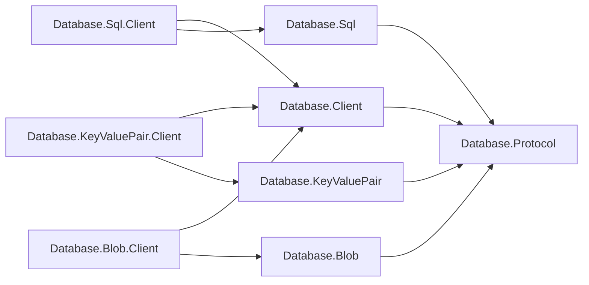
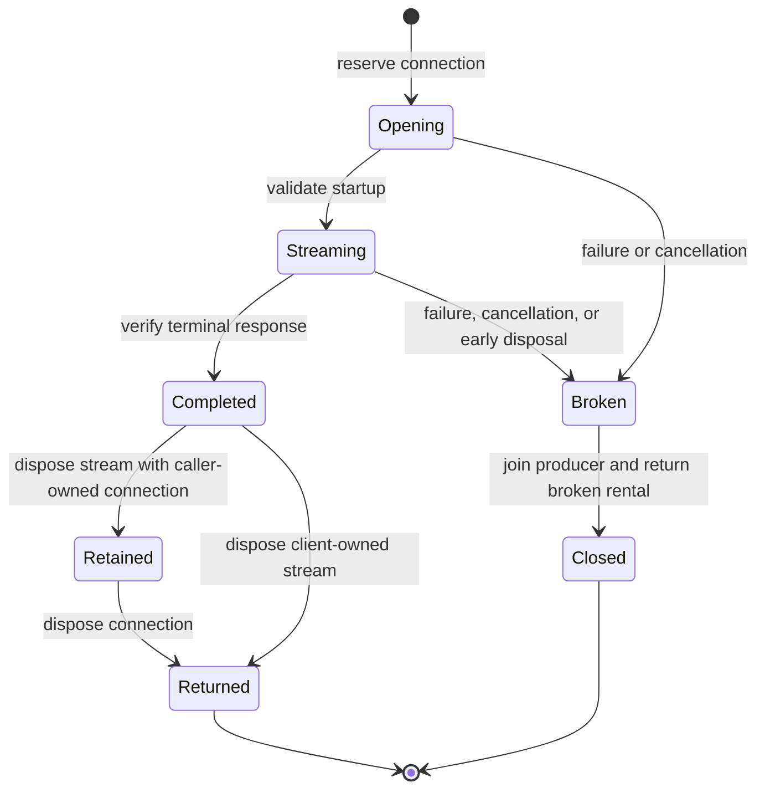

# Assimalign.Cohesion.Database.Client — Design

The shared client owns transport dialing, startup/authentication, framing, pooling,
and connection health. Model clients own request encoding, response validation, and
result materialization. The shared client references no model package and imposes
no result shape.

## Family boundary

Clients depend on shared mechanism and their own model's wire codecs:

```mermaid
flowchart LR
    SqlClient["Database.Sql.Client"] --> Client["Database.Client"]
    SqlClient --> Sql["Database.Sql"]
    KvClient["Database.KeyValuePair.Client"] --> Client
    KvClient --> Kv["Database.KeyValuePair"]
    BlobClient["Database.Blob.Client"] --> Client
    BlobClient --> Blob["Database.Blob"]
    Client --> Protocol["Database.Protocol"]
    Sql --> Protocol
    Kv --> Protocol
    Blob --> Protocol
```

| Package | Responsibility |
| --- | --- |
| Database.Client | Dial, handshake, bounded pooling, framed exchange lifetime |
| Database.Protocol | Framing, shared messages, immutable family binding |
| Database.Sql.Client | SQL parameter encoding, decoding, and materialization |
| Database.KeyValuePair.Client | Key-value encoding, decoding, and materialization |
| Database.Blob.Client | Blob transfer validation, acknowledgements, and typed metadata responses |
| Model packages | Model identifiers and payload codecs |

`DatabaseClientOptions.Family` is mandatory. The pool captures the exact immutable
`ProtocolMessageFamily` instance before dialing. Every connection uses a
`ProtocolChannel` bound to that family throughout its lifetime. A
`DatabaseProtocolExchange<TResult>` takes its required family in its protected
constructor and consumes one exchange through the channel reader and writer. A
different family instance is rejected before execution, including a family that
reuses the same identifier bytes.

The materialized operation returns only after consuming the complete response and
must not retain or dispose the borrowed reader/writer. SQL and Key-Value materialize;
Blob uploads transfer bounded chunks from caller-owned streams. Downloads use the
shared streaming exchange described below. Model payloads, result shapes, and
acknowledgement rules remain owned by their model packages.

## Lifecycle and errors

Creation performs no I/O. Rent opens or reuses an authenticated session.
Disposing a healthy rental returns it to an idle stack; `MaxPoolSize` bounds
rentals and exhausted rents wait. Disposing the client closes idle connections;
outstanding rentals close when returned. Closure sends best-effort `Terminate`.

The pool does not infer connection health from an error code. On failure, the
exchange's completion evidence certifies that it consumed the entire response and
left the server session ready for another request. The base owns that evidence: its
internal run entry clears it before every run, and a leaf records it with the
protected `MarkResponseComplete` before it throws. An exchange that supplies no
evidence is discarded after failure. Successful return already guarantees a complete
response, so a successful exchange never marks anything. Framing violations,
transport failure, and an unfinished response invalidate the connection.

SQL, Key-Value and Graph mark the evidence only after decoding a terminal response.
Before the base owned the reset, each of the three cleared it by hand at the start of
its exchange. Their server implementations send `ParseFailure` and
`ExecutionFailure` as complete statement responses before any result frames and
return to their ready loop; the model exchanges certify that initial response phase
before throwing the unchanged
`DatabaseClientException`. Other server errors terminate those sessions. This
knowledge belongs to the statement exchange, not to a pool-wide list of safe codes.
Blob failures do not certify completion: a transfer can leave unread frames even
when its error code is `ExecutionFailure`. Wire codes and messages reach callers
unchanged, independently of the health decision.

Handshake rejections preserve their wire code in `DatabaseClientException`.
Idle server-side evictions remain discoverable at next use; rent-time pings are
future work.

Only one exchange may use a connection at a time. An overlapping exchange is rejected
before it writes any frames. Disposing a connection cancels and joins its current
operation before returning the rental, so an active exchange cannot enter the idle
pool. Disposal and failure release each rental exactly once.

`DatabaseConnection.AbortAsync` explicitly discards a rental when a model cannot
reset its application-level session state. It marks the connection unusable before
cancelling/joining any active exchange and disposing the rental, so the pool closes
its transport instead of reusing the session. This is non-cancellable and idempotent
on the current rental. It makes no claim about whether the server completed an
unacknowledged command; transaction outcome and reconciliation remain model concerns.

## Streaming exchange and ownership

`DatabaseStreamingExchange` takes the exact `Family` in its protected constructor
and implements two protected cores: an `OpenCoreAsync` phase that writes the request
and validates startup metadata, and a `CopyToCoreAsync` phase that copies content
into a borrowed destination and verifies the terminal response. Their entry points
are internal, so only the shared client runs the phases, in that order.
The shared client owns the asynchronous producer, bounded handoff, cancellation,
read stream, and connection lifetime. The model owns framing semantics, metadata,
counts, and acknowledgements; it never owns the handoff queue or producer task.
Startup failures reach the opening call. After startup, failures reach stream reads.
Streaming frame adapters normalize completed transport pipes that report
`InvalidOperationException` into transport failures. This normalization is confined
to streaming frame I/O; materialized SQL and Key-Value exchanges retain their
existing transport exception behavior, and caller stream exceptions are unchanged.

There are two deliberate ownership forms. `DatabaseConnection.ExecuteStreamingAsync`
uses a caller-owned rental and preserves that rental after verified completion and
stream disposal, allowing another operation on the same typed connection. A failed
or abandoned transfer invalidates and returns that rental immediately.
`DatabaseClient.ExecuteStreamingAsync` rents on the caller's behalf; its returned
stream owns that rental until disposal or failure. It rejects an exchange of another
family before it rents, so a wrong exchange dials nothing. Verified EOF alone does
not return a client-owned stream's healthy rental: the caller must dispose the stream.
These forms serve the Blob and Graph connection APIs and model clients that expose a
download directly from their pooled client.

The destination copies content into chunks no larger than 65,536 bytes and writes
them through a single-slot bounded queue. Backpressure stops the producer when the
consumer's current chunk and queued chunk have not advanced. Content memory stays
bounded by those chunks, a pending destination chunk, and model/transport buffers,
independent of transfer length. The producer must finish validating the terminal
response before the stream can report EOF. A recorded failure is sticky: it takes
precedence over buffered content and subsequent reads keep reporting it.

The opening token remains active throughout the transfer. Canceling any asynchronous
read cancels the whole producer, including a destination write blocked on a full
queue. Early synchronous or asynchronous stream disposal cancels and joins the
producer and closes the unfinished connection; completed stream disposal preserves
connection health. Disposal suppresses recorded transfer errors because reads carry
those errors. Streams are read-only and sequential, reject overlapping reads, and
do not support length or seeking.

The lifecycle below distinguishes verified completion from release of the rental.
For a caller-owned connection, healthy stream disposal retains the rental until
connection disposal; for a client-owned stream, it returns the rental to the pool.

```mermaid
stateDiagram-v2
    [*] --> Opening: reserve connection
    Opening --> Streaming: validate startup
    Opening --> Broken: failure or cancellation
    Streaming --> Completed: verify terminal response
    Streaming --> Broken: failure, cancellation, or early disposal
    Completed --> Retained: dispose stream with caller-owned connection
    Completed --> Returned: dispose client-owned stream
    Retained --> Returned: dispose connection
    Broken --> Closed: join producer and return broken rental
    Returned --> [*]
    Closed --> [*]
```

The completion signal serves SQL, Key-Value, Graph, Blob, and future exchanges with
their own terminal semantics. The streaming contract and its two ownership forms serve
Blob's downloads, Graph's path streams and test-level model consumers; a future
Documents client implements only its startup and content protocol. No Blob-specific
type enters the shared contract, and those clients need not copy Blob's former
lifetime machinery.

## Settings and compatibility

Connection strings carry database, principal, endpoint, and pool size. Drivers are
typed `IConnectionFactory` options, composed statically. Typed endpoints also
support in-memory transports. The endpoint selects the model; startup carries no
model discriminator.

SQL and Key-Value wire bytes stay at version 1.0. Moving APIs is a managed API
migration: direct SQL callers import `Database.Sql.Client` and bind
`SqlProtocol.Family`, or use the existing typed client. `DatabaseClientResult`
and `DatabaseClientColumn` now live in the SQL client's namespace. New model
clients derive from the exchange bases using their model's exact family.

No reflection, code generation, driver discovery, model parser, or model result
policy is required. The streaming path adds no dependencies or shipped-library
`InternalsVisibleTo` grants and remains compatible with `net10.0` and NativeAOT.
TLS remains a connection-factory concern.

## Declarative command delivery

`DatabaseCommandClient.Create(Uri controlPlaneAddress, string bearerToken, HttpMessageInvoker transport)`
accepts a caller-owned transport, including its TLS trust policy. Disposing the returned client
does not dispose that transport; the caller retains it until requests finish and disposes it
afterward. The two-argument factory still creates a transport owned and disposed by the client.
Both overloads perform the same endpoint and credential validation; a null supplied transport
throws `ArgumentNullException`. The client does not discover application trust.

The sealed `DatabaseCommandClient` is the separate HTTP admin command client. `DatabaseCommandClient.Create`
accepts the full manifest control-plane URI (including its path) and an opaque bootstrap bearer.
SendCommandAsync posts the camel-case id/kind/owner/key/payload envelope to commands; payload is
base64. DeleteCommandAsync sends DELETE to the same route and envelope. Both return package-local
ResourceCommandObservation with Status and Detail, retaining actionable provider refusal text.
Transport failures propagate; HTTP refusals become Rejected observations. Serialization uses explicit
Utf8JsonWriter/JsonDocument access. The caller disposes the client; redirect following and cookies
are disabled. No runtime Hosting or ApplicationModel dependency was added.

## Concrete types (concrete-types plan, phase 5, #1261)

The client core has no public interface left and no `Abstractions/` folder
([plan](../../../../docs/programs/DATABASE_CONCRETE_TYPES_PLAN.md) §7, "P5, as landed").

| Type | Shape | Was |
|---|---|---|
| `DatabaseClient` | sealed; `Create(DatabaseClientOptions)` over a private constructor | the static `DatabaseClient` factory, `IDatabaseClient` and the internal `DefaultDatabaseClient` |
| `DatabaseCommandClient` | sealed; the two `Create` overloads over a private constructor | the static factory, `IDatabaseCommandClient` and the internal `HttpDatabaseCommandClient` |
| `DatabaseConnection` | sealed; internal constructor | `IDatabaseConnection` and the internal `PooledDatabaseConnection` |
| `DatabaseProtocolExchange<TResult>` | abstract; protected constructor | `IDatabaseProtocolExchange<TResult>` |
| `DatabaseStreamingExchange` | abstract; protected constructor | `IDatabaseStreamingExchange` |

- **Why the two exchange bases are abstract.** They are inverted seams (`database-area.md`, rule
  2): Database.Client runs them, and the model clients, their tests and applications implement
  them. The protocol exchange is a variant set as well (the Sql, Key-Value, Graph and Blob
  exchanges and the download stream's carrier), and so is the streaming exchange (Blob's download
  and Graph's path stream). Their leaves live in other shipped assemblies, so the constructors
  are protected (rule 3), and both carry the deviation marker.
- **What the bases own.** The family is a constructor argument behind a non-virtual getter (rule
  6). The protocol exchange owns the completion evidence: an internal getter the connection reads,
  cleared by the internal run entry before every run, and set by the leaf through the protected
  `MarkResponseComplete`. That replaces the interface's default member and the hand-written resets
  of the Sql, Key-Value and Graph exchanges (and Graph's test exchange).
  `DatabaseExchangeHealthTests.ExecuteAsync_ReusedExchangeWithoutNewEvidence_ShouldDiscardSession`
  pins the reset: it fails when the entry stops clearing the evidence.
- **Internal entry points.** The run entries (`ExecuteAsync`, `OpenAsync`, `CopyToAsync`) are
  internal over protected abstract cores. Only a connection runs an exchange, so no public entry
  exists that runs one over another reader and writer, for the same reason the engine worker has
  no public release.
- **No generic virtual method.** `DatabaseConnection.ExecuteAsync<TResult>` was a generic
  interface call, which NativeAOT never devirtualizes; it is a non-virtual generic method on the
  sealed connection (rule 5).
- **`DatabaseConnection.OpenAsync` is internal.** The client opens every connection before its
  first rental, and nothing else called it. Public, it reopened a broken connection by dialing a
  second transport over the first without releasing it.
- **The streaming extension is folded in** (plan §5.2). `DatabaseClient.ExecuteStreamingAsync` is
  an instance member, and it rejects an exchange of another family before it rents
  (`DatabaseStreamingExchangeTests.ExecuteStreamingAsync_DifferentFamily_ShouldRejectBeforeRenting`);
  the extension rented first (dialing when no connection was idle) and then returned the rental.
- **What changed for a caller.** The interface names become the sealed types, so a caller that
  mocked a client through its interface uses an in-process engine behind a loopback server
  instead, as these tests do. An exchange passes its family to the base constructor, overrides
  `ExecuteCoreAsync` (or `OpenCoreAsync` and `CopyToCoreAsync`), and calls
  `MarkResponseComplete()` where it used to set `IsResponseComplete`.
- **A returned `DatabaseConnection` is not a lease (known limit).** The pool hands out the same
  instance on every rental of its session, and its rented flag is per instance, so a reference
  kept after `DisposeAsync` reaches the next caller's rental once the pool rents it again: its
  calls run on that rental and a second dispose returns it. `ObjectDisposedException` fires only
  between the return and the next rent. The four model connections wrap the rental with their
  own disposed flag (the Sql and Key-Value ones since the P5 review), so their callers are safe;
  a direct caller of `RentAsync` drops the reference when it disposes. A per-rental lease or
  generation token is a design change left to P8 (plan §12).
- **Exceptions not wrapped.** `RentAsync` wraps handshake failures in `DatabaseClientException`,
  but a transport dial failure (for example a `SocketException` from `TcpConnectionFactory`)
  propagates unchanged from the connection factory, through each model's `ConnectAsync` as well.
  The XML documentation says so; wrapping it is a behavior change left to the owner (plan §7,
  "P5, as landed", owner review 39).
