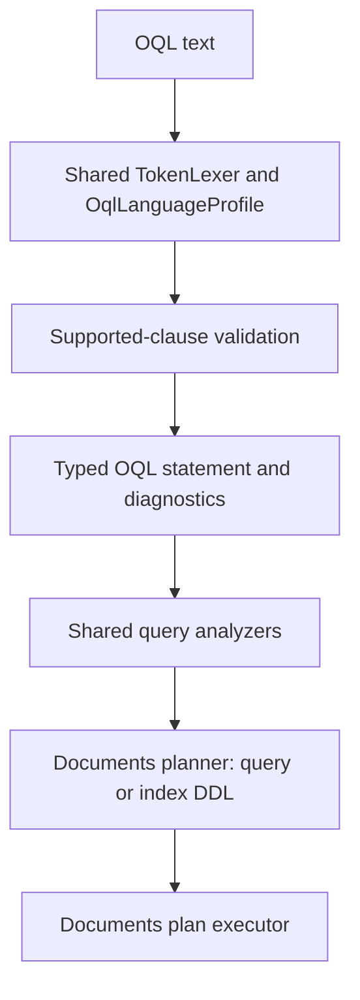

# Assimalign.Cohesion.Database.Documents.Language — Design

The package owns the document model's OQL grammar, statement and expression trees, diagnostics,
and conformance corpus. `OqlQueryParser` derives from the shared `QueryParser` and declares
`OqlLanguageProfile.Instance` as its profile. The shared `TokenLexer` provides tokenization;
there is no alternate lexer or duplicated keyword configuration.

## Family and pipeline

`Database.Documents.Language` references only `Assimalign.Cohesion.Database.Language`.
`Database.Documents` consumes its AST for logical planning, physical index selection or index
catalog changes, and execution. This package has no catalog, storage, hosting, or
ApplicationModel dependency.

Parsing runs shared lexing, capability validation, statement/expression parsing, then shared
analyzers. Malformed input remains an `OqlQueryStatement` with error diagnostics; consumers
must reject statements containing errors before planning.

The diagram shows the common parse-plan-execute flow. Both `SELECT` and index DDL remain on this
path; DDL is not dispatched through a separate engine API.



## Supported-clause matrix

The profile's supported set is deliberately the executable subset of `OqlClauses`.
Lexical recognition preserves the established vocabulary so rejected constructs receive
`COHDBL001`; recognizing a token does not make its operation supported.

| Clause | Supported | Shape or reason |
| --- | --- | --- |
| `SELECT` | Yes | One or more projected expressions, optional `AS` output names; `*` returns the source document |
| `FROM` | Yes | Exactly one unqualified collection or reserved `COHESION_SCHEMA` source and optional iteration variable, with or without `AS` |
| `WHERE` | Yes | Scalar comparison and Boolean document filtering |
| `GROUP BY` | Yes | One or more grouping expressions |
| `HAVING` | Yes | Group filtering, including aggregate calls |
| `ORDER BY` | Yes | One or more expressions, each optionally `ASC` or `DESC` |
| `CREATE INDEX` | Yes | One named, nonunique index over one document path in one collection |
| `DROP INDEX` | Yes | One named index in one collection; the `ON` qualifier is required |
| `DEFINE` | No | Named query definitions are not planned |
| `ELEMENT` | No | Singleton extraction is not planned |
| `FLATTEN` | No | Collection expansion is not planned |
| `SUBQUERY` | No | A nested `SELECT` reports this capability name at the inner keyword |
| `LIMIT`, `OFFSET` | No (pin) | SQL++ row limits; oql-limit-offset flips the pin |
| `UPSERT` | No (pin) | SQL++ document write; oql-upsert flips the pin |
| `MERGE` | No (pin) | SQL++ merge; stays a pin with no T1 item lifting it, and #1101 owns it |
| `UNNEST` | No (pin) | SQL++ array expansion in `FROM`; oql-arrays flips the pin |
| `EVERY ... SATISFIES` | No (pin) | SQL++ quantified predicate, also opened by `ANY` and `SOME`; oql-arrays flips the pin |

Only `COUNT`, `SUM`, `AVG`, `MIN`, and `MAX` are callable. Each takes one expression;
`COUNT(*)` also counts documents. Aggregate placement, grouping consistency, and value semantics
are validated by the Documents planner/executor. `DISTINCT`, `ALL`, `IN`, `EXISTS`, `LIKE`,
`BETWEEN`, collection constructors/quantifiers, `ABS`, and other reserved but unimplemented
operations produce `COHDBL001`. Unknown function calls likewise produce `COHDBL001` naming the
function. There is no implied support for the full ODMG specification.

### Keyword disposition (#1101)

The capability scan reads one static recognized-unsupported table, `OqlUnsupportedVocabulary`.
Each entry has a spelling, the construct its `COHDBL001` names, and a position. Each
recognized-unsupported construct is reported once at the word that names it, and never bound as
a name:

- **Anywhere** (the ODMG words above): every occurrence except a path segment after a dot. All
  are lexer keywords or functions.
- **Clause** (statements and clauses of other languages, and the SQL++ words `LIMIT`,
  `OFFSET` and `UNNEST`): the first word of the statement, or the word directly after the end
  of an operand. An operand ends with a name, a path segment, a literal, a parameter, `)`, `]`,
  `NULL`/`NIL`/`TRUE`/`FALSE` or `ASC`/`DESC`. So `WHERE a = 1 LIMIT 5`, `WHERE a = 'x' LIMIT 1`
  and `ORDER BY a DESC OFFSET 2` report `LIMIT` or `OFFSET`, where they used to fall through to
  `OQL0002`. `FROM c UNNEST c.items` reports `UNNEST` instead of binding it as the alias. These
  words are not lexer keywords, so `SELECT limit, merge FROM c` and `SELECT a AS limit FROM c`
  still parse. Because the collection name ends an operand, a Clause word cannot be an AS-less
  `FROM` alias: `FROM c unnest` reports `UNNEST`, while `FROM c AS unnest` keeps it a name.
- **Statement** (the SQL++ statement verbs `UPSERT` and `MERGE`): only the first word of the
  statement. Elsewhere they are names, so an AS-less alias such as `FROM c merge` still parses,
  as it did before #1101.
- **Quantifier**: `EVERY`, `ANY` or `SOME` followed by `name IN` opens a quantified predicate.
  It is one construct named `EVERY ... SATISFIES` (or `ANY`/`SOME`), up to its `END`. Its binding
  `IN` is not reported as the `IN` predicate. ODMG's `FOR ALL name IN` and `EXISTS name IN` bind
  the same way and report `FOR ALL` and `EXISTS`; the `SATISFIES` after them is not reported
  again. `EVERY` and `SATISFIES` name the construct only there, so an alias such as
  `FROM c every` still parses.

A statement whose first word is unsupported, such as `UPSERT INTO c ...` or
`MERGE INTO c ...`, is one construct: the scan reports that word and nothing after it. Each
operand of a set operation starts its own `SELECT`, which is not reported as a subquery, and a
set operation with `ALL` or `DISTINCT` (`UNION ALL`) is one construct spanning both words.
`OqlKeywordDispositionTests` enumerates the profile's keywords plus the table. Every word needs
a supported parse case or a case with exactly one `COHDBL001` naming its construct, and for a
table entry that diagnostic must also name the construct the table records. A word added
without a case fails, so oql-sqlpp-basis and the flip items add their cases in the same change.
OQL declares no `~`, so `SELECT ~a FROM c` stays an `OQL0002` syntax error (a pin). It is one
error: a second error with the same code at the same span is dropped, so recovery that reaches
one bad token from several rules no longer reports it three times.

## Grammar, statement, and expression trees

```text
statement    := (query | create-index | drop-index) [';']
query        := SELECT projection (',' projection)* FROM collection [AS? identifier]
                [WHERE expression] [GROUP BY expression (',' expression)*]
                [HAVING expression] [ORDER BY ordering (',' ordering)*]
create-index := CREATE INDEX identifier ON collection '(' path ')'
drop-index   := DROP INDEX identifier ON collection
collection   := identifier | COHESION_SCHEMA '.' identifier
projection   := expression [AS identifier]
ordering     := expression [ASC | DESC]
path         := identifier ('.' identifier | '[' integer ']' | '[' string ']')*
```

`CREATE INDEX` and `DROP INDEX` intentionally use SQL's familiar shape because ODMG defines no
index-DDL syntax. The create form accepts the same document-path grammar as query expressions, so
an index can target a nested object field or array element. The path is relative to each document;
there is no iteration alias in an index statement. Index and collection names follow the same
identifier quoting and case-preservation rules as query collection names.

`OqlQueryStatement` wraps one top-level `OqlExpression`: `OqlSelectExpression`,
`OqlCreateIndexExpression`, or `OqlDropIndexExpression`. Index creation retains its target as an
`OqlPathExpression`, rather than flattening the path during parsing, so the planner receives the
same segment model used by query predicates.

Keywords and function names are case-insensitive. Collection and property names preserve case.
Double quotes delimit identifiers; single quotes delimit strings, with a doubled single quote
representing one quote. Property names after a dot may use a reserved word; bracket strings
address arbitrary property names. Array indices are nonnegative, zero-based 32-bit integers.
Parentheses group expressions. `$name`, `$1`, and `@name` all produce parameter names without
the prefix. Empty identifiers and empty parameter names are syntax errors.

Literal nodes hold a string, Boolean, decimal, or null; `NIL` is a synonym for null. Decimal
and scientific notation use invariant culture and reject invalid/out-of-range decimal values.
Numeric query literals therefore have a bounded decimal range even when JSON can represent a
larger number. The parser does not silently round a literal to an infinity or coerce it to text.

Operator precedence, lowest first: `OR`, `AND`, comparisons and null tests, addition/subtraction,
multiplication/division/remainder, unary signs. `NOT` binds around comparisons, so
`NOT age < 18` means `NOT (age < 18)`. Comparison operators are `=`, `!=`, `<>`, `<`, `<=`, `>`,
and `>=`; the AST normalizes `<>` to `!=`. Null tests are unary `IS NULL` and `IS NOT NULL`
nodes. Arithmetic supports `+`, `-`, `*`, `/`, and `%`.

The parser is a partial class, split into dispatch/token handling, SELECT clauses, index DDL, and
expression parsing, following `SqlQueryParser`. Parser-produced list properties are read-only
snapshots; AST nodes retain source spans and the top-level expression retains the original
statement text.
Locations use zero-based UTF-16 offsets with exclusive ends and one-based line numbers.
Nested expressions are capped at 128 recursive parse levels; rejection is a diagnostic, not a
stack-overflow exception. Concurrent calls on one parser are serialized. The parser owns no
disposable resources beyond those used by the shared analyzer pipeline.

## Diagnostic contract

| Code | Meaning |
| --- | --- |
| `COHDBL001` | A recognized clause or operation lies outside the executable profile, reported once at the word that names it (see Keyword disposition) |
| `OQL0001` | Empty statement, including whitespace/comment-only text |
| `OQL0002` | Syntax error, missing token, invalid identifier/path, multiple statements or leftover tokens, or a character OQL does not use (`?`, `#`, `^`, `§`, ...) |
| `OQL0003` | Unterminated quoted text or block comment |
| `OQL0004` | Invalid or out-of-range numeric literal |
| `OQL0005` | Expression nesting exceeds the supported depth |
| `OQL0006` | Invalid aggregate argument count or star operand |

Every error has an absolute start/end span and source line. End-of-input errors use the source
length for both offsets. A line breaks at LF, CR, NEL (U+0085), LS (U+2028) or PS (U+2029), and
CR LF is one break (`TokenLexer.CountLineBreaks`). Capability validation precedes statement parsing
so an unsupported construct receives the shared capability diagnostic instead of an accidental
generic syntax error. Quotes, comments, and property names after dots are not mistaken for clauses.
Malformed index DDL produces `OQL0002` at the missing or invalid token; it does not escape the
parser as an exception.

A `--` comment ends before the first of those line terminators, the rule
`Database.Language/docs/DESIGN.md` records for every language, so line numbers break exactly where
a comment ends (#1150). The shared lexer used to end a comment only at LF, so in
`SELECT * FROM people -- note<CR>WHERE age > 1` the `WHERE` was comment text and every document
matched. The `WHERE` now stays in effect at every terminator, and `OqlLineCommentTests` pins it
together with the diagnostic lines. OQL has no `//` comment: `/` is the division operator.

A character OQL does not use lexes as `TokenType.Unrecognized`. It reports
`Unexpected character '<c>'; it is not part of OQL.` (`OQL0002`) at its span during
tokenization. The statement is then not parsed, so nothing is bound and no `NULL` literal stands
in for the character. `SELECT * FROM people ^` and `SELECT * FROM c WHERE c.a = ?` each report
exactly that one error (#1101). Every statement form (`SELECT`, `CREATE INDEX`, `DROP INDEX`)
rejects leftover tokens with `OQL0002`, with or without a separating `;`, and the corpus pins
both.

## Scope, index DDL, and mutations

OQL's scope was deliberately expanded from query-only to include index DDL. Documents and SQL now
manage secondary indexes through their language pipelines, and callers no longer need document
index extension members that switch on internal database implementations. This is an intentional
language-design change, not an accidental departure from the earlier query-only boundary. It is
limited to `CREATE INDEX` and `DROP INDEX`: both are parsed, planned, and executed by the Documents
engine in the same change that adds them to `OqlLanguageProfile`.

An OQL statement cannot name a server or switch databases. `FROM other.collection` is invalid
syntax; quoted collection names remain a single opaque identifier. The only qualified source
syntax is the reserved `COHESION_SCHEMA.<name>` namespace in the current database. The engine
resolves `COHESION_SCHEMA.INDEXES` and `COHESION_SCHEMA.OBJECT_OWNERSHIP` to virtual document
collections computed from its statement catalog snapshot. Their qualified names are
case-insensitive, including fully quoted names. Their document fields retain ordinary
case-sensitive OQL path semantics. No catalog or storage dependency is added to this parser.

The same source syntax is parsed in index DDL so supported mutations receive the engine's
stable `System collection '<canonical source>' is read-only.` diagnostic instead of an
accidental syntax or missing-collection error. Projection, filtering, grouping, and ordering
reuse ordinary SELECT syntax; no separate metadata API or statement class is introduced.
The engine design documents the field shapes, snapshot visibility, and read-only rules.
`CREATE DATABASE`,
`DROP DATABASE`, `USE`, and other SQL data-mutation/transaction commands are unsupported.
Multiple statements per parse are rejected. Logical database creation and deletion remain
engine-side C# operations.

OQL still has no document data-mutation syntax. Document insert/replacement and delete use the
frozen `IDocumentCollection.PutAsync` and `DeleteAsync` contracts, including their transaction and
expected-version semantics. No existing public interface was widened for index management or a
second data-mutation language. The Documents engine design states query ordering, mixed-shape
behavior, index-DDL ownership, and aggregate/mutation semantics.

## Verification and extension

`OqlQueryParserTests` and `OqlIndexDdlParserTests` contain valid and malformed query/index-DDL
corpora plus structural AST, exact diagnostic span, precedence, nested-path/array, parameter,
scope, and recursion-limit checks. `OqlParseStrictnessTests` pins stray characters, the SQL++
words, field names that reuse them, and trailing tokens after every statement form.
`OqlKeywordDispositionTests` is the keyword-disposition corpus.
Profile tests assert every supported capability and every deferred OQL clause. Existing lexer
conformance remains unchanged, including recognition of unsupported reserved vocabulary.

A new clause requires parser, planner, executor, conformance tests, and a matrix entry together;
only then may it join the profile's supported set. The package uses static code and BCL values,
with no reflection, runtime discovery, or `Microsoft.Extensions.*` dependencies, and remains
NativeAOT compatible.
