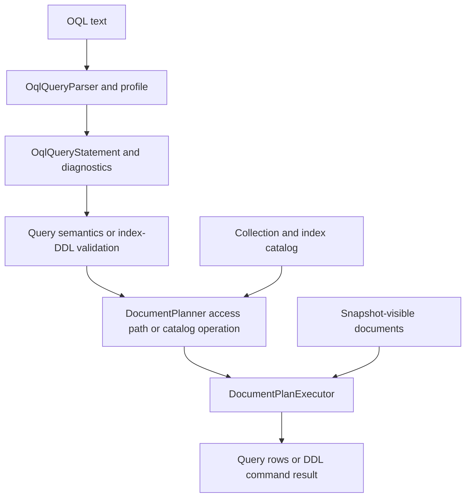

# Documents engine design

## Intent and composition

Documents combines the Blob engine's lifecycle, session transaction, worker, and
stamped chunk discipline with SQL's parse, logical planning, physical planning,
and execution split. Storage, journaling, paging, locks, MVCC, and B+Tree algorithms
belong to the shared kernel. No kernel contract or existing public interface was
widened. The model adds internal implementations of the frozen document contracts.

Every OQL statement flows through these stages. Catalog metadata informs query access-path
selection and index-DDL planning; `SELECT`, `CREATE INDEX`, and `DROP INDEX` all reach the same
plan executor rather than an index-management side channel.

| Assembly | Responsibility |
| --- | --- |
| `Database.Documents` | Engine, bound sessions, CRUD, OQL query/index-DDL plans and execution, builder extension |
| `Database.Documents.Language` | Profile, parser, AST, stable diagnostic locations |
| `Database.Documents.Catalog` | Versioned collection/document/index metadata and transactional index maintenance |
| `Database.Documents.Storage` | Explicit JSON validation, stamped metadata/chunk records, kernel record-space adapter |
| `Database` and child roots | Shared contracts, transaction coordinator, lock manager, WAL, pages, B+Tree |

The engine references the three model packages and the Database root. The catalog
references Documents storage and shared indexing/transactions, never this engine.
There are no Hosting or ApplicationModel references.

## Sessions and authority

The database's direct collection methods run automatic transactions. Methods called
through `session.Database` use that session's active transaction. OQL statements execute through
the session and therefore use its active transaction or an automatic statement transaction.
Collection CRUD always takes a session; a collection rejects sessions from another database.
A handle obtained through a session remains bound to that specific session and
fails once it closes. Collection names are database-local, case-sensitive names;
OQL has one collection source and no database qualification or server commands.
The inherited `IDatabase.Engine` lifecycle reference remains the frozen root API;
executing OQL or CRUD never interprets it as session authority over other databases.

Each statement uses one `ITransactionContext`. Automatic operations commit on
success and roll back on failure. Explicit transaction operations leave commit
to the caller; a failing operation rolls back the whole explicit transaction.
Snapshot isolation fixes the read horizon at transaction start. ReadCommitted
captures one statement snapshot and pins its retention horizon for the statement.
Serializable is rejected rather than silently weakened.

The shared lock manager serializes writers per logical database. Before changing
a document, collection, or index, the operation compares its snapshot with the
latest state under that lock. An intervening change raises
`DatabaseTransactionAbortedException`. Reads stay snapshot based. Catalog and
index writes use the same logical context as content chunks; rollback and crash
recovery cannot publish a partial document.

Collections created by these APIs have `DatabaseObjectOwner.Adhoc`. A collection
directly marked `Schema` refuses `DROP COLLECTION`, `CREATE INDEX`, and `DROP INDEX`,
with `DatabaseObjectLockedException` naming the collection, owning schema, and requested
operation. Document contents remain mutable. There is no
compiled-schema provisioning authority in this engine.

## OQL query and DDL semantics

The supported clause matrix lives in the language package's
[DESIGN.md](../../Assimalign.Cohesion.Database.Documents.Language/docs/DESIGN.md).
SELECT, FROM, WHERE, GROUP BY, HAVING, ORDER BY, CREATE INDEX, and DROP INDEX are executed;
DEFINE, ELEMENT, FLATTEN, nested queries, document data-mutation statements, and server
statements are rejected with `COHDBL001`. The parser advertises only clauses this executor
supports.
AST diagnostics are checked both for text requests and directly constructed requests.

Projection supports whole documents, nested field paths, zero-based array element
paths, literals, parameters, arithmetic, and aggregates. `SELECT *` returns one
`document` column containing the entire JSON value. Objects and arrays remain
`JsonElement` values; scalars become null, Boolean, decimal, or string. Mixed-type
columns advertise `DatabaseType.Null` as unknown rather than guessing a schema.
An explicit alias resolves duplicate projected column names; otherwise they fail.
No POCO reflection, schema inference, or runtime code generation is involved.
Query JSON parsing uses the same 128-level nesting limit as storage validation
and index extraction, so every accepted document can be queried at its stored depth.

Absent fields, paths through an incompatible shape, and out-of-range array indexes
evaluate to null. Null and missing share the same group and `IS NULL` behavior.
Ordinary comparison with null is unknown; WHERE/HAVING retain only true predicates.
Equality compares scalar values and structurally compares arrays/objects.
Range predicates compare only values of the same scalar kind. Arithmetic requires
decimal operands; invalid numeric input and division by zero fail explicitly.

COUNT(*) counts documents; COUNT(expression) counts nonnull values. SUM and AVG
require numeric nonnull inputs. SUM, AVG, MIN, and MAX over no nonnull inputs return
null; COUNT returns zero. Ungrouped aggregate queries yield a single group even
for an empty source. Outside aggregate calls, grouped projection, HAVING, and
ORDER BY expressions must be a group key or an expression built from group keys
and constants. Group-key binding compares expression structure, preserves literal
scalar types, and treats qualified and unqualified paths to the same iteration
variable as equivalent. Group values compare structurally.

Results are deterministic. A scan and an index seek both establish ordinal
document-ID order before filtering and projection. GROUP BY uses the total order
null, Boolean, decimal, ordinal string, array, object. Arrays compare element by
element; objects compare property names in ordinal order and their values.
ORDER BY accepts source expressions or a standalone explicit projection alias;
alias names take precedence over source fields for that standalone form.
It compares its expressions and preserves the established order for ties.
This baseline makes identical data and queries return identical sequences across
access paths. Query results are materialized and own their JSON values; they do
not retain a transaction or borrowed storage memory after execution.

## Index planning and writes

`CREATE INDEX <index-name> ON <collection> (<path>)` and
`DROP INDEX <index-name> ON <collection>` are OQL statements. `DocumentPlanner` binds them to
catalog-operation plans and `DocumentPlanExecutor` executes those plans under the statement's
`ITransactionContext`. This replaces the former extension-member entry point and leaves the
frozen `IDocumentDatabase` member list unchanged; there is no runtime switch on internal database
implementations.

The create path uses the same segment grammar as a WHERE path, including nested object fields,
array subscripts, and bracket-string property names. Planning converts those segments to the
catalog's lossless canonical path without changing their case or treating a property name's
punctuation as structure.

The executor takes the logical database's exclusive writer lock, enforces schema ownership using
the specific `CREATE INDEX` or `DROP INDEX` operation name, and delegates the transactional
catalog/tree work to Documents.Catalog. The catalog owns index definitions and maintains shared
B+Trees during every Put/Delete and collection drop. Index creation populates existing documents
in its transaction; queries never lazily build trees. Dropping an index removes its visible
definition in the same transaction, so subsequent physical plans stop selecting it while older
snapshots retain their defined visibility.

Successful index DDL returns a command `QueryResult` with `Success` status and an affected count
of zero; index definition changes are not document-row mutations.

The physical planner uses applicable equality/range predicates on indexed paths,
including parameter values, reversed operands, and conjunctive bounds. Equality
is preferred over a range; ties choose ordinal index name. The executor reapplies
the full predicate to candidates, preserving mixed-shape semantics. See the
[catalog design](../../Assimalign.Cohesion.Database.Documents.Catalog/docs/DESIGN.md)
for supported scalar keys, visibility filtering, and restart recovery.

## Data mutation and serialization semantics

OQL now includes index DDL but no document data-mutation clauses. The existing collection API
provides deterministic mutation semantics: Put replaces the complete JSON value
by ordinal identity, Delete removes that identity, and each operation either
completes in its transaction or rolls back. Put captures caller memory before
awaiting and returns a new version. An optional expected version must match an
existing visible document; mismatch fails. Versions use the durable kernel
sequence allocator, are strictly increasing for successful writes, and may have
gaps. Delete/reinsert and restart never reuse an old version.

Nested objects, arrays, and scalar roots are accepted. JSON validation and exact
byte-preservation rules are specified in the
[storage format](../../Assimalign.Cohesion.Database.Documents.Storage/docs/DESIGN.md).
Adding/removing fields and changing a scalar's type are supported complete-document
replacements. They need no compiled schema migration and update indexes in the
same transaction. The new shape can change predicate membership and projection
types by the explicit mixed-shape rules above.

## Lifecycle and durability

`DocumentDatabaseEngine.Create` starts four engine-owned workers: checkpoint,
write-ahead-log flush, dirty-page write-back, and MVCC version purge. `Workers`
exposes them through the existing engine contract. The observable state is Running,
Faulted after an unexpected worker exception, and Disposed after close.
Disposal is idempotent: stop/join workers, dispose coordinators (rolling back open
transactions), then durably flush and close each storage file set. Close errors
are aggregated after attempting every database.

File-backed databases have `document.dat`, `document.log`, and `document.bak` under
one validated database-name directory. Open performs kernel WAL replay with its
checkpoint deferred, scrubs uncommitted record writers and index changes, and then
completes the recovery checkpoint. Both synchronous and grouped durability
acknowledge commits only after the journal is durable. Memory-backed databases
use the identical storage/transaction implementation over in-memory streams.

## Limits and verification

The current engine materializes query inputs/results and whole JSON values in
managed memory. Chunk persistence handles documents larger than a page but does
not promise a bounded heap independent of document/query size. Database-wide
writer locking is conservative; there is no query-cost statistics model, join,
subquery, external sort, wire protocol, replication, security, hosting wiring,
ApplicationModel integration, or compiled-schema provisioning.

Co-located tests cover nested/mixed JSON, expected-version writes, explicit commit
and rollback, both isolation levels, cross-database/session guards, direct-marked
schema ownership, indexed-versus-scanned queries, and file reopen. Storage/catalog
tests exercise crash images with committed and abandoned writes and index recovery.
All serialization and activation are static BCL calls compatible with trimming
and NativeAOT.

The frozen lock manager does not cancel queued requests on transaction rollback.
Documents rechecks the context after a writer grant and releases any grant to an
ended transaction. A caller cancellation token cancels a pending wait promptly;
without cancellation, an ended operation fails when the earlier writer releases.
Operation completion and abort are serialized to avoid duplicate logical rollback.

The engine's durability setting configures the storage's physical commit gate.
The current transaction coordinator flushes logical document commits synchronously
in both settings; grouped logical commit batching is not claimed. The WAL flush
worker remains the engine-owned implementation of the shared storage flush duty.
