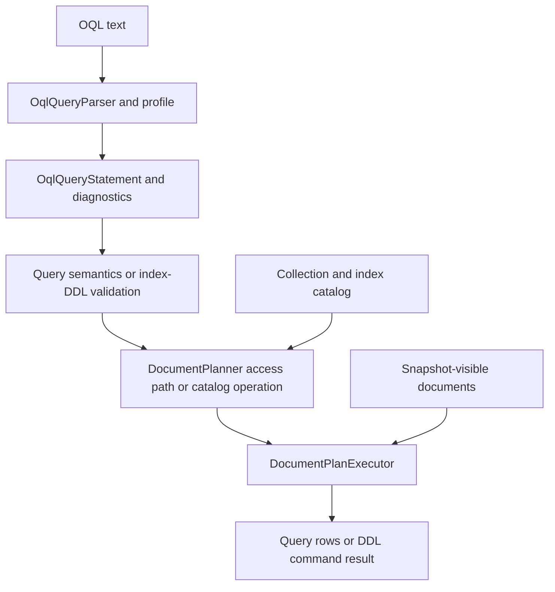
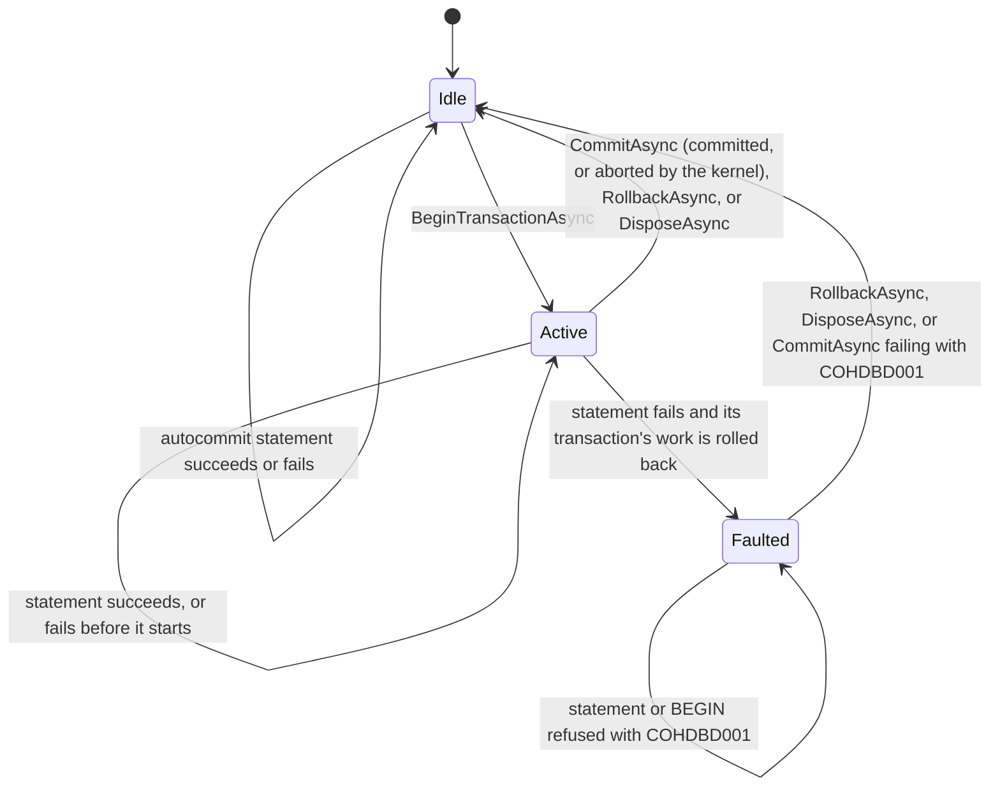
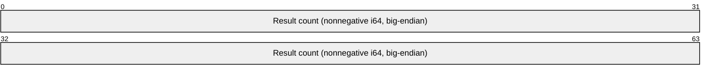
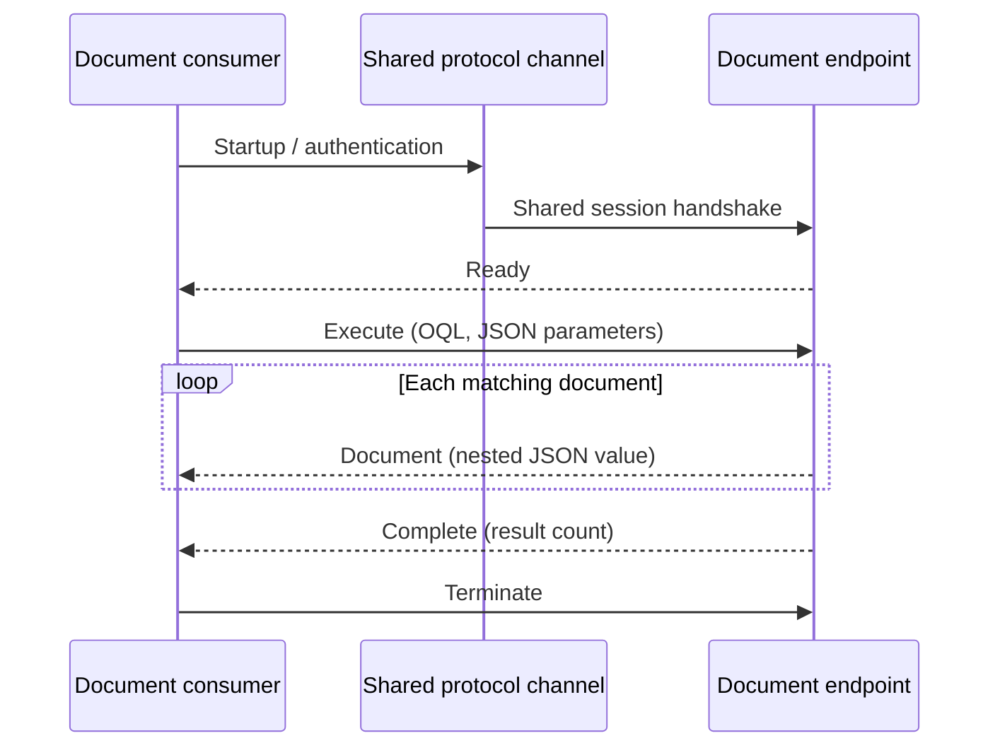

# Documents engine design

## String comparison and collation (#1025)

Documents remains ordinal-only. OQL string predicates, ordering, grouping, and
distinct comparisons use case-sensitive .NET ordinal (UTF-16 code-unit) order.
String index keys encode that same order, including supplementary characters;
they do not inherit SQL's UTF-8 collation transforms. Collection names, document
IDs, JSON property names, and prefix listings are also ordinal and case-sensitive.
Administrative database lookup remains ordinal-ignore-case. SQL database defaults,
column collations, and expression `COLLATE` have no effect on this model.
Configurable document collation is deferred; stored text retains its original form.

## Intent and composition

Documents combines the Blob engine's lifecycle, session transaction, worker, and
stamped chunk discipline with SQL's parse, logical planning, physical planning,
and execution split. Storage, journaling, paging, locks, MVCC, and B+Tree algorithms
belong to the shared kernel. No kernel contract was widened. The engine, its database
(`DocumentDatabase`), session, transaction, collection and builder are public sealed types, the
first four leaves of the area root's bases ([Concrete types](#concrete-types-concrete-types-plan-phase-4-1260)),
while the planner, executor, workers and storage strategy are internal.

Every OQL statement flows through these stages. Catalog metadata informs query access-path
selection and index-DDL planning; `SELECT`, `CREATE INDEX`, and `DROP INDEX` all reach the same
plan executor rather than an index-management side channel.


```mermaid
flowchart TD
    Text["OQL text"] --> Parse["OqlQueryParser and profile"]
    Parse --> Ast["OqlQueryStatement and diagnostics"]
    Ast --> Logical["Query semantics or index-DDL validation"]
    Logical --> Physical["DocumentPlanner access path or catalog operation"]
    Catalog["Collection and index catalog"] --> Physical
    Physical --> Execute["DocumentPlanExecutor"]
    Data["Snapshot-visible documents"] --> Execute
    Execute --> Result["Query rows or DDL command result"]
```

| Assembly | Responsibility |
| --- | --- |
| `Database.Documents` | Engine, bound sessions, CRUD, OQL query/index-DDL plans and execution, document protocol family, builder extension |
| `Database.Documents.Language` | Profile, parser, AST, stable diagnostic locations |
| `Database.Documents.Catalog` | Versioned collection/document/index metadata and transactional index maintenance |
| `Database.Documents.Storage` | Explicit JSON validation, stamped metadata/chunk records, kernel record-space adapter |
| `Database` and child roots | Shared contracts, transaction coordinator, lock manager, WAL, pages, B+Tree |

The engine references the three model packages and the Database root. The catalog
references Documents storage and shared indexing/transactions, never this engine.
There are no Hosting or ApplicationModel references.

## Sessions and authority

Collection operations exist only on the session (owner decision 32 of 2026-10-06):
`DocumentDatabaseSession.CreateCollectionAsync`, `GetCollectionAsync`, `DropCollectionAsync` and
`GetCollectionsAsync` use that session's active transaction, as OQL statements do; without one,
each runs in an automatic statement transaction. Until decision 32 the database carried
session-less copies that always ran automatic transactions. The engine has one writer at a time,
so a write through one of them while the caller's own session held an explicit transaction's
writer lock waited for that transaction, and a caller that awaited it before ending the
transaction waited until the call's token was canceled. With the session as the one entry point
that self-wait cannot happen. `session.Database` is the unbound database (option B of the
concrete-types plan, §6.6): disposing it closes the database for every session, never the
session itself. Once that close ends the engine forgets the database, so a later
`OpenDatabaseAsync` opens it again from its files ("Lifecycle and durability", owner decision 33).

Collection CRUD always takes a `DocumentDatabaseSession`; a collection rejects sessions from
another database. A handle obtained through a session remains bound to that specific session and
fails once it closes. Collection names are database-local, case-sensitive names;
OQL has one collection source and no database qualification or server commands.
The inherited `DatabaseInstance.Engine` lifecycle reference is the root API;
executing OQL or CRUD never interprets it as session authority over other databases.

Each statement uses one `TransactionContext`. Automatic operations commit on
success and roll back on failure. Explicit transaction operations leave commit
to the caller; a failing operation aborts the whole explicit transaction, which
then refuses every later statement until the caller rolls it back, as
[Failed statements in explicit transactions](#failed-statements-in-explicit-transactions-1225)
describes.
Snapshot isolation fixes the read horizon at transaction start. ReadCommitted
captures one statement snapshot and pins its retention horizon for the statement.
Serializable is rejected rather than silently weakened.

The shared lock manager serializes writers per logical database. Before changing
a document, collection, or index, the operation compares its snapshot with the
latest state under that lock. An intervening change raises
`DatabaseTransactionAbortedException`. A commit or rollback the transaction kernel
refuses or aborts crosses the model boundary the same way (see "Failed statements in
explicit transactions" below for the end contract). An operation that ends up granted
the writer lock after its transaction ended gives the grant back through the
coordinator's lock manager, which leaves that release to the transaction manager while
the manager still tracks the transaction: a rolled-back transaction whose undo the
kernel had to defer keeps the writer lock until the version-purge pass completes the
undo (#1226, `Database.Transactions` DESIGN.md, "Ending a transaction"). Reads stay
snapshot based. Catalog and
index writes use the same logical context as content chunks; rollback and crash
recovery cannot publish a partial document.

### Failed statements in explicit transactions (#1225)

A statement that fails inside an explicit transaction aborts the whole transaction. Document
storage cannot undo one statement: a `PutAsync` writes its content chunks, tombstones the old
chain and publishes catalog and index entries through separate physical brackets, and
`Database.Transactions` undoes a writer only as a whole transaction, with no savepoints. Until
#1225 the session then dropped the rolled-back transaction from view, so the next statement
silently ran in autocommit and the caller's `RollbackAsync` threw. The session now follows the
contract the Graph engine set in #1188 (Graph [DESIGN.md](../../Assimalign.Cohesion.Database.Graph/docs/DESIGN.md#failed-statements-in-explicit-transactions-1188)),
with its own code, `COHDBD001`:

1. The failure rolls the transaction's work back at once and releases its locks, so the aborted
   transaction blocks no other writer while it waits for the caller. (When the undo itself fails,
   the kernel keeps the writer lock until its version-purge pass completes the undo; see
   `Database.Transactions` DESIGN.md, "Ending a transaction".)
2. The transaction stays the session's `CurrentTransaction` and reports `TransactionState.Faulted`.
   Every later statement on the session fails with `COHDBD001`: OQL text or requests, collection
   `GetAsync`/`PutAsync`/`DeleteAsync`, and the session's own collection operations
   (`CreateCollectionAsync`, `GetCollectionAsync`, `DropCollectionAsync`,
   `GetCollectionsAsync`). `BeginTransactionAsync` fails with `COHDBD001` too. The error names the
   original failure in its message (`Cause: ...`) and carries it as `InnerException`. A refused
   statement does not change the transaction, and an aborted transaction refuses text before
   parsing it.
3. `RollbackAsync` succeeds, leaves none of the transaction's writes, and returns the session to
   autocommit. Disposing the transaction or the session ends it the same way. A rollback of any
   transaction that did not commit may be repeated and raises nothing; a rollback of a committed
   transaction is refused. This holds when the rollback, or the session's disposal, runs while a
   statement of the transaction is still running on another thread: the kernel admits no
   physical bracket of a transaction whose end has begun and waits for the one already applying
   before it undoes the transaction (Transactions [DESIGN.md](../../Assimalign.Cohesion.Database.Transactions/docs/DESIGN.md#ending-a-transaction-under-a-running-statement)),
   so the running statement fails with `DatabaseTransactionAbortedException` and writes nothing
   that outlives the rollback. A statement still waiting for the writer lock fails at once.
4. `CommitAsync` fails with `COHDBD001`, commits nothing, and ends the transaction (`RolledBack`).
   It keeps that answer after the transaction has ended some other way (disposed, or rolled back
   by the caller), so a commit never reports anything but `COHDBD001` for a transaction a
   statement aborted. A commit after the session closed fails with `COHDBD001` too, naming the
   closure ("The session closed before the transaction ended.") when no statement failed first,
   or the statement the closure aborted ("The document session closed while the operation was
   running."). A commit while a statement of the transaction still runs is refused ("An operation
   of the transaction is still running; commit after it completes.") and leaves the transaction
   active. A commit the kernel aborts throws
   `DatabaseTransactionAbortedException` and leaves the transaction `Faulted` and ended.
5. Every failure of a statement that started counts: parse diagnostics of text the session parses
   or of a typed request, planning and execution errors (an unknown collection, a stale expected
   version, a document whose indexed value outgrows the 1,024-byte index key, OQL `CREATE INDEX`
   or `DROP INDEX` on a `COHESION_SCHEMA` collection, which the planner refuses), ownership
   refusals, kernel aborts such as snapshot conflicts, and cancellation while the statement runs,
   including a wait for the writer lock. Failures that come before a statement starts leave the
   transaction unchanged: argument validation (a null, empty or whitespace id, collection name or
   statement text), the typed `CreateCollectionAsync` and `DropCollectionAsync` refusal of a
   `COHESION_SCHEMA` name, a session of another database, a request that carries no OQL
   statement, and the refusal of a second concurrent operation on the session.
6. Autocommit statements are unaffected: a failure ends only its own statement transaction.
7. A rollback or commit observes its cancellation token only before it starts: a token canceled by
   then throws `OperationCanceledException` and leaves the transaction as it was. One that has
   started runs to completion (PostgreSQL holds interrupts through `AbortTransaction`,
   `backend/access/transam/xact.c:2854-2861`), and it always ends the transaction (#1226): the
   transaction kernel completes a started rollback whatever fails (a lost abort record is ignored,
   and a failed undo is retried by the kernel with the writer lock held), and it aborts a commit it
   cannot complete. Until #1226 a journal or storage failure could leave the context active behind
   a failed rollback, and the session kept the transaction `Faulted`, refusing work with
   `COHDBD001`, until a later rollback completed; that end-failure state is gone, as it is in Graph.
   The kernel still refuses a rollback before it starts while the database closes
   (`ObjectDisposedException`: the manager's disposal flags itself before it claims any end, so
   every end refused during the close fails this way). The context then stays active only until
   disposal's own abort ends it: the session refuses statements in the ended transaction ("being
   committed or rolled back; start the operation after it ends."), another `RollbackAsync` fails the same way while the close runs
   and is accepted once the close's abort ended the context, and a `CommitAsync` commits nothing:
   it fails with `ObjectDisposedException` while the database closes, or reports the `Faulted`
   state once disposal's abort ended the context.

Kernel failures cross the engine boundary translated (the area error policy): a deadlock as
`DatabaseTransactionDeadlockException`, a kernel abort as `DatabaseTransactionAbortedException`,
and a commit whose record was written but could not be made durable as
`DatabaseTransactionCommitUnconfirmedException` (the transaction is `Committed`; only its
durability is unconfirmed, `Database.Transactions` DESIGN.md), never as the kernel's own
exception types, for statements and for every end of the explicit transaction alike: commit,
rollback, disposal, the session's closure, and the abort a statement failure starts. One translation (`DocumentDatabase.TranslateKernelFailure`) serves them
all. The unconfirmed commit's message leads with the model's code on every path, the explicit
commit and an automatic statement's own commit alike (owner decision 24 of 2026-10-06, #1272):
`COHDBD002: Database '{name}' went offline while a transaction was committing: ...`, built by the
root's `DatabaseTransactionCommitUnconfirmedException.Create(code, database, cause)` with the
kernel's `TransactionCommitUnconfirmedException` as its inner exception. Before #1272 this path
carried the kernel's message alone, without a code. Storage failures still surface as the
storage child root's exceptions. Since phase 4 of the concrete-types plan the end state machine
this section describes is the root `DatabaseTransaction` base's, and the session state, the "already active" check and the
one-statement hold are the root `DatabaseSession` base's; the model supplies `COHDBD001`,
`COHDBD002`, the kernel calls and this translation ([Concrete types](#concrete-types-concrete-types-plan-phase-4-1260)).

The explicit-transaction lifecycle, where Faulted is the new state:


```mermaid
stateDiagram-v2
    [*] --> Idle
    Idle --> Idle: autocommit statement succeeds or fails
    Idle --> Active: BeginTransactionAsync
    Active --> Active: statement succeeds, or fails before it starts
    Active --> Faulted: statement fails and its transaction's work is rolled back
    Faulted --> Faulted: statement or BEGIN refused with COHDBD001
    Active --> Idle: CommitAsync (committed, or aborted by the kernel), RollbackAsync, or DisposeAsync
    Faulted --> Idle: RollbackAsync, DisposeAsync, or CommitAsync failing with COHDBD001
```

The reference engines agree on the outcome. PostgreSQL aborts the whole block on any error
(`TBLOCK_ABORT`, "failed xact, awaiting ROLLBACK", `backend/access/transam/xact.c:171`) and rejects
every later command but COMMIT and ROLLBACK before parse analysis with SQLSTATE 25P02
(`backend/tcop/postgres.c:1150-1164`); Neo4j refuses work in a terminated transaction
(`community/kernel/.../coreapi/TransactionImpl.java:529-535`), accepts repeated rollbacks
(`community/kernel/.../KernelTransactionImplementation.java:1184-1194`) and fails a commit of a
transaction it rolled back (`KernelTransactionImplementation.java:1206-1210`, `1291-1303`). COMMIT
follows Neo4j, not PostgreSQL's silent ROLLBACK tag (`xact.c:4133-4139`): a caller awaiting
`CommitAsync` must not see success when nothing committed. RavenDB, the document-model reference,
has no interactive server transaction; its all-or-nothing unit is one client command or batch.
Its transaction merger groups independent requests into one write transaction and, when that
merged transaction fails, disposes it and reruns each request on its own
(`src/Raven.Server/Documents/TransactionMerger/AbstractTransactionOperationsMerger.cs:368-375`,
`391-394`); each rerun gets its own write transaction, disposed uncommitted when the command
throws (`AbstractTransactionOperationsMerger.cs:906-916`). A failed request therefore commits
nothing of its own, and the merge never makes one request's failure another's. Citations are to
PostgreSQL `85f55534e80`, Neo4j `54a7dcf7c25` and RavenDB `83399cb8bc8`.

Documents has no wire server or client yet, so the contract is exercised in process only
(`DocumentTransactionFailureTests`).

Collections created by these APIs have `DatabaseObjectOwner.Adhoc`. A collection
directly marked `Schema` refuses `DROP COLLECTION`, `CREATE INDEX`, and `DROP INDEX`,
with `DatabaseObjectLockedException` naming the collection, owning schema, and requested
operation. Document contents remain mutable. There is no
compiled-schema provisioning authority in this engine.

## OQL query and DDL semantics

### Catalog introspection

Collections are already discoverable through `GetCollectionsAsync` and
`GetCollectionAsync`. OQL adds only the catalog facts those handles do not expose,
through two virtual document collections:

| Source | Document properties | Cardinality |
| --- | --- | --- |
| `COHESION_SCHEMA.INDEXES` | `COLLECTION_CATALOG`, `COLLECTION_NAME`, `INDEX_NAME`, `PATH`, `IS_UNIQUE` | One document per visible index definition; `IS_UNIQUE` is Boolean false for the current nonunique indexes |
| `COHESION_SCHEMA.OBJECT_OWNERSHIP` | `COLLECTION_CATALOG`, `COLLECTION_NAME`, `OBJECT_TYPE`, `OBJECT_NAME`, `OWNER`, `OWNING_SCHEMA` | One document per visible collection; `OBJECT_TYPE` is `COLLECTION` |

`COLLECTION_CATALOG` is the bound database name. `OWNER` preserves SQL's `Adhoc`
and `Schema` values; `OWNING_SCHEMA` is the schema name or JSON null. Documents
enforces ownership on the collection: index DDL checks that collection's owner.
The index metadata has no independent ownership, so the ownership source reports
collections and does not invent an index owner. Index paths retain the catalog's
canonical document-path spelling; physical generation IDs and B+Tree pages remain
internal. There is no collection schema or inferred document-field catalog.

The sources are document shaped: `SELECT *` returns one JSON document per entry,
and ordinary projection, aliases, parameters, filtering, grouping, aggregates,
and ordering use the same evaluator as stored documents. For example:

```sql
SELECT INDEX_NAME, PATH FROM COHESION_SCHEMA.INDEXES
WHERE COLLECTION_NAME = 'items' ORDER BY INDEX_NAME

SELECT OBJECT_NAME, OWNER, OWNING_SCHEMA
FROM COHESION_SCHEMA.OBJECT_OWNERSHIP
```

This follows the existing choice to put document index DDL in OQL and keeps the
frozen database interface unchanged. The system-source names are case-insensitive;
their JSON property names are case-sensitive, as with all document paths. Only the
reserved `COHESION_SCHEMA` qualifier is accepted: it names a source in the session's
database, never another database. Ordinary `other.items` remains invalid. Quoting
the entire system-source name also identifies the same reserved source.

Every query computes documents directly from the same transaction catalog snapshot
used by the statement. Snapshot transactions retain their read horizon, while own
uncommitted catalog writes are visible. Subsequent statements observe committed
catalog changes according to their isolation level. No metadata copy, content record,
or synthetic collection is stored, and existing collection listing stays unchanged.

The sources are read-only. `CREATE INDEX` and `DROP INDEX` targeting either source,
and `CreateCollectionAsync` or `DropCollectionAsync` using either reserved name,
throw `DatabaseException` with `System collection '<canonical source>' is read-only.`
before ordinary catalog lookup or mutation. OQL document `INSERT`, `UPDATE`, and
`DELETE` remain unsupported everywhere and return the existing `COHDBL001` parse
diagnostic. Virtual sources do not provide mutable `DocumentCollection` handles.

### Stored document queries

The supported clause matrix lives in the language package's
[DESIGN.md](../../Assimalign.Cohesion.Database.Documents.Language/docs/DESIGN.md).
SELECT, FROM, WHERE, GROUP BY, HAVING, ORDER BY, CREATE INDEX, and DROP INDEX are executed;
DEFINE, ELEMENT, FLATTEN, nested queries, document data-mutation statements, and server
statements are rejected with `COHDBL001`. The parser advertises only clauses this executor
supports.
AST diagnostics are checked both for text requests and directly constructed requests.

Projection supports whole documents, nested field paths, zero-based array element
paths, literals, parameters, arithmetic, and aggregates. `SELECT *` returns one
`document` column containing the entire JSON value. Objects and arrays remain
`JsonElement` values; scalars become null, Boolean, decimal, or string. Mixed-type
columns advertise `DatabaseType.Null` as unknown rather than guessing a schema.
An explicit alias resolves duplicate projected column names; otherwise they fail.
No POCO reflection, schema inference, or runtime code generation is involved.
Query JSON parsing uses the same 128-level nesting limit as storage validation
and index extraction, so every accepted document can be queried at its stored depth.

Absent fields, paths through an incompatible shape, and out-of-range array indexes
evaluate to null. Null and missing share the same group and `IS NULL` behavior.
Ordinary comparison with null is unknown; WHERE/HAVING retain only true predicates.
Equality compares scalar values and structurally compares arrays/objects.
Range predicates compare only values of the same scalar kind. Arithmetic requires
decimal operands; invalid numeric input and division by zero fail explicitly.

COUNT(*) counts documents; COUNT(expression) counts nonnull values. SUM and AVG
require numeric nonnull inputs. SUM, AVG, MIN, and MAX over no nonnull inputs return
null; COUNT returns zero. Ungrouped aggregate queries yield a single group even
for an empty source. Outside aggregate calls, grouped projection, HAVING, and
ORDER BY expressions must be a group key or an expression built from group keys
and constants. Group-key binding compares expression structure, preserves literal
scalar types, and treats qualified and unqualified paths to the same iteration
variable as equivalent. Group values compare structurally.

Results are deterministic. A scan and an index seek both establish ordinal
document-ID order before filtering and projection. GROUP BY uses the total order
null, Boolean, decimal, ordinal string, array, object. Arrays compare element by
element; objects compare property names in ordinal order and their values.
ORDER BY accepts source expressions or a standalone explicit projection alias;
alias names take precedence over source fields for that standalone form.
It compares its expressions and preserves the established order for ties.
This baseline makes identical data and queries return identical sequences across
access paths. Query results are materialized and own their JSON values; they do
not retain a transaction or borrowed storage memory after execution.

## Index planning and writes

`CREATE INDEX <index-name> ON <collection> (<path>)` and
`DROP INDEX <index-name> ON <collection>` are OQL statements. `DocumentPlanner` binds them to
catalog-operation plans and `DocumentPlanExecutor` executes those plans under the statement's
`TransactionContext`. This replaced the former extension-member entry point and gives
`DocumentDatabase` and `DocumentDatabaseSession` no index-management members; there is no runtime
switch on internal database implementations.

The create path uses the same segment grammar as a WHERE path, including nested object fields,
array subscripts, and bracket-string property names. Planning converts those segments to the
catalog's lossless canonical path without changing their case or treating a property name's
punctuation as structure.

The executor takes the logical database's exclusive writer lock, enforces schema ownership using
the specific `CREATE INDEX` or `DROP INDEX` operation name, and delegates the transactional
catalog/tree work to Documents.Catalog. The catalog owns index definitions and maintains shared
B+Trees during every Put/Delete and collection drop. Index creation populates existing documents
in its transaction; queries never lazily build trees. Dropping an index removes its visible
definition in the same transaction, so subsequent physical plans stop selecting it while older
snapshots retain their defined visibility.

Successful index DDL returns a command `QueryResult` with `Success` status and an affected count
of zero; index definition changes are not document-row mutations.

The physical planner uses applicable equality/range predicates on indexed paths,
including parameter values, reversed operands, and conjunctive bounds. Equality
is preferred over a range; ties choose ordinal index name. The executor reapplies
the full predicate to candidates, preserving mixed-shape semantics. See the
[catalog design](../../Assimalign.Cohesion.Database.Documents.Catalog/docs/DESIGN.md)
for supported scalar keys, visibility filtering, and restart recovery.

## Data mutation and serialization semantics

OQL now includes index DDL but no document data-mutation clauses. The existing collection API
provides deterministic mutation semantics: Put replaces the complete JSON value
by ordinal identity, Delete removes that identity, and each operation either
completes in its transaction or rolls back. Put captures caller memory before
awaiting and returns a new version. An optional expected version must match an
existing visible document; mismatch fails. Versions use the durable kernel
sequence allocator, are strictly increasing for successful writes, and may have
gaps. Delete/reinsert and restart never reuse an old version.

Nested objects, arrays, and scalar roots are accepted. JSON validation and exact
byte-preservation rules are specified in the
[storage format](../../Assimalign.Cohesion.Database.Documents.Storage/docs/DESIGN.md).
Adding/removing fields and changing a scalar's type are supported complete-document
replacements. They need no compiled schema migration and update indexes in the
same transaction. The new shape can change predicate membership and projection
types by the explicit mixed-shape rules above.

## Lifecycle and durability

`DocumentDatabaseEngine.Create` starts four engine-owned workers: checkpoint,
write-ahead-log flush, dirty-page write-back, and MVCC version purge. `Workers`
exposes them through the existing engine contract. The observable state is Running,
Faulted while a worker keeps failing, and Disposed after close.

A worker failure never ends a worker (#1268). Each worker catches per database: a failed
checkpoint, page write-back or group flush of one database is reported
(`DatabaseEngineWorker.ReportFailure`, the worker's `Fault`), the pass goes on to the next
database, and later passes skip that database for `DatabaseEngineWorker.FailureBackoff` (one
second, PostgreSQL's error sleep, `src/backend/postmaster/checkpointer.c:286-346`,
`bgwriter.c:154-205`) while every other database keeps the worker's full pace (#1268 review); the
first pass that finishes that database's work clears its record, so the engine is Faulted exactly while a worker
keeps failing. A failure that took a database offline (a failed durable flush, a failed drain of
the journal's append buffer, #1252, or a failed header slot write) is not the worker's: the
workers skip the database and the engine lists it in
`OfflineDatabases`. The root engine base's pump runs a worker again after the backoff if its loop
ever ends early, and the engine then reports Faulted until disposal; a `DatabaseEngineWorker`, the
only kind the engine attaches since phase 4 of the concrete-types plan, records a failed pass
instead and its loop lets nothing escape. Each pump thread is named for its worker
(`{engine}/wal-flush` and its siblings; it was `{engine}/{kind}` before phase 4). Before #1268
the pump caught outside the worker's loop, so one unexpected exception ended that worker for
good. `DocumentWorkerResilienceTests` fails a
checkpoint's and a write-back's page writes (the worker reports, backs off and recovers while
the other database's work goes on), a group flush's drain or fsync on the flush worker's own
thread (only its database goes offline, `StorageOfflineCause.JournalFlush` either way), and a
header slot write (the database goes offline with COHDBD002, naming "a write of the file
header", and its files stop changing). It also checks that a database whose checkpoints keep
failing leaves the other database a pace a worker-wide backoff cannot reach: over a shared
six-second window more than twice the backoff's checkpoints, the floor that fails every
worker-wide backoff or stall of one backoff a pass, with the median second's share of the no-fault
checkpoints as a secondary signal. A smaller worker-wide slowdown can pass; the deterministic
signal that would catch it is required follow-up work (the SQL engine's DESIGN.md, "Engine-owned
background workers"). It also checks that a writer
queued for the database writer lock when the database goes offline (a header slot write, a
journal fsync or a journal drain failing) gets COHDBD002 at once instead of waiting for the reopen: an offline
database undoes nothing, so the writer holding the lock keeps it, and the coordinator ends every
lock wait instead (`TransactionCoordinator.AbandonLockWaits`, wired to the storage's offline hook).

**A failure that persists takes the database offline (owner decision 25 of 2026-10-06).** When
the checkpoint, page write-back, write-ahead flush or version-purge worker fails on one database
on `WorkerFailureLimit` passes in a row (an engine option, one hundred by default since owner
decision 35 of 2026-10-07: the window of Neo4j's ten failed checkpoints,
`community/kernel/src/main/java/org/neo4j/wal/checkpoint/CheckPointScheduler.java:41-42`, at its
ten-second checkpoint check, `CheckPointThreshold.java:40`, is a hundred passes at the one-second
worker backoff),
the root worker base asks the engine to give up on it, and
`DocumentDatabaseEngine.TakeDatabaseOfflineCore` takes the database's storage offline with the
`StorageOfflineCause` that names the worker (`CheckpointFailures` and its siblings). A second checkpoint in a row
that fails while the database's journal holds `JournalSizeLimit` bytes (an engine option; zero, the
default, means four times `CheckpointJournalSize`, 1 GiB at its default) takes it offline with
`JournalSizeLimit`; one failure of a journal that reached the cap with no failure at all (#1283)
is retried like any other. Either way the database goes offline through the #1243 machinery: every
operation is refused with `COHDBD002`, its lock waits end, nothing more is written to it, and the
engine lists it in `OfflineDatabases` until `OpenDatabaseAsync` reopens it (a hosted engine's
application reopens it with backoff, owner decision 22). The engine takes it offline on a thread-pool thread, never the worker's,
so a give-up that waits for a hung fsync of that database holds back none of the others, and it
finds the database in its published snapshot, without its registry lock, so it never waits for
another's open. Once the database is offline, or whenever it closes, the engine ends every
worker's failure record of it, so the engine reports `Running` at once and a reopened database
counts its failures from one; a database already offline or closed is not counted.
`DocumentWorkerResilienceTests` pins it: a checkpoint failure that never clears takes only its
database offline after the limit of failed passes, a journal past the cap does on its second
failed checkpoint in a row, one transient failure of a journal already past the cap does not,
and a transient failure under the limit does not (the count restarts once a checkpoint
finishes). A database opened from a copied file set, whose storage carries the original's name
in its file header, goes offline for its own write-back failures, never the original: the
write-back and flush workers visit the engine's databases and report under the database's
name, not the storage's (owner decision 25 review). The
suite's other engines set both limits out of reach, since they keep a database failing on purpose.
Disposal is idempotent: stop/join workers, dispose coordinators (rolling back open
transactions), then durably flush and close each storage file set. Close errors
are aggregated after attempting every database.

**A database closed outside the engine is skipped, then forgotten** (owner decision 33 of
2026-10-06, #1289). A database its holder disposed, directly or through `session.Database`
(option B, "Sessions and authority"), stays registered only until its close ends. The close then
tells the engine (`DocumentDatabaseEngine.ForgetClosedDatabaseCore`, through the root's shared
`DatabaseRegistry.Forget`), which stops tracking it, so a later `OpenDatabaseAsync` opens it again
from its files: a new instance with every committed document. An in-memory database reopens with
its documents too, because the engine keeps each in-memory file set's streams until its own
disposal releases them (`DatabaseMemoryFiles`) and the open copies the closed streams' bytes and
runs the same recovery over them (#1272); before #1272 an in-memory reopen got empty storage.
While the close runs, an open waits for it (the root `DatabaseEngine.OpenDatabaseAsync`),
`TryGetDatabase` does not report
the database, a create of its name is refused as existing, and a drop or the engine's disposal
waits for the close, so nothing reuses the files under it. Before decision 33 the database stayed
registered until it was dropped, and the open refused it with `ObjectDisposedException`. The
forget reads the engine's lock-free instance snapshot and takes the engine's lock only through a
bounded `Monitor.TryEnter` loop. A drop, an offline reopen and the engine's disposal remove a
database from the snapshot and dispose it while holding that lock, and that disposal waits for a
close a holder started, so a forget that blocked on the lock would deadlock with them. The same
wait means a holder's close that stalls (a fsync that does not answer) stalls the engine's other
registry operations until it ends, and a drop's token is not observed meanwhile (root
`DESIGN.md`, "A stalled close stalls the engine's registry").

For the window between the close and the forget the workers skip the database:
`DocumentDatabase.IsClosed` reads the base's disposed flag, `DocumentDatabaseEngine.IsOpen` is
false for the closed database, the version-purge worker skips it in its pass
and in its trigger wait, and the checkpointer skips it
through the model's `IsCheckpointDue`, which is false for a closed database (the pass is the
engines' shared one, and its `IsOpen` check covers only a checkpoint that raced the close). A
close that was not idle leaves the journal untruncated: when its retry of a deferred undo still
fails, the close keeps that writer in flight (#1226), so the closed storage stays due for a
checkpoint it refuses. The flush and write-back workers skip it too (`DocumentDatabase.IsClosed`),
and an `ObjectDisposedException` from a close that raced their visit is tolerated through
`IsOpen(DocumentDatabase)` rather than recorded. Until owner decision 25's review they visited the
engine's storages rather than its databases, and reported under the storage's name, which a
storage reads from its file header: a database opened from a copied file set carries the
original's, so its persistent failures would have taken the original offline. Before the skips, the version-purge worker failed
on the closed database's disposed coordinator every pass (21 failed passes in half a second at
20 ms intervals); and when the checkpointer had a failure recorded for a database whose close was
not idle, every poll handed a lane the refused checkpoint, which kept the failure recorded.
Either way the engine reported `Faulted` for good and `Database.Hosting` reported it degraded
until the engine was recreated. The workers do what PostgreSQL's background workers do with an
object dropped under them: check that it still exists and skip it quietly. Autovacuum leaves out
a dropped or partially dropped database (`src/backend/postmaster/autovacuum.c:998-1000`,
`:1859-1868`) and a relation dropped since it listed it (`:2510-2513`), and the checkpointer skips
the fsync request of a dropped relation, which the drop canceled before it unlinked the file
(`src/backend/storage/sync/sync.c:400-411`, `:492-503`). A close here happens outside the engine,
which learns of it only when it ends, so until then the workers read the database's own flag
where PostgreSQL reads the cancellation. `DocumentWorkerResilienceTests.DisposeAsync_DatabaseClosedOutsideTheEngine_ShouldLeaveTheEngineRunning`
closes a database both ways under 20 ms worker intervals and asserts that every pass succeeds,
no worker records a failure, the engine is `Running`, the other database takes writes, and the
open opens the database again with its 20 documents.
`OpenDatabaseAsync_DatabaseClosedOutsideTheEngine_ShouldReopenItWithItsDocuments` closes it both
ways, in memory and on disk, with a document of an uncommitted transaction: the reopened instance
is new, holds the committed documents and not the uncommitted one, takes writes, and a second
close and open keeps them.
`DocumentWorkerResilienceTests.CheckpointWorker_FailingDatabaseClosedWithAWriterInFlight_ShouldEndItsFailureAndLeaveTheEngineRunning`
records a checkpoint failure for a database whose page writes fail, closes it with a rolled-back
transaction's undo deferred behind a bracket that holds every page, and asserts that the
checkpointer's failure ends and the engine runs again (before the checkpointer's skip it stayed
`Faulted` for the test's 30 seconds).

File-backed databases have `document.dat`, `document.log`, and `document.bak` under
one validated database-name directory. Open performs kernel WAL replay with its
checkpoint deferred, scrubs uncommitted record writers and index changes, and then
completes the recovery checkpoint. Before the scrub it checks every index tree's
B-tree page format (`DocumentCatalog.EnsureIndexFormat`, #1194): a database whose
indexes an engine before #1194 wrote is refused with "Database 'x' cannot be
opened. COHDBI001: …". A cleanly closed database is left byte-identical. A
crashed one has already had the storage layer's format-agnostic journal redo and
undo when the check runs, but keeps its journal (the open-time checkpoint is
deferred), so the engine that wrote it still recovers it. A file set in another storage
format (#1251) is refused by the storage before its journal is read, and the engine names
the database: "Database 'x' cannot be opened. COHDBS001: …", the storage's
`StorageFormatException` as its inner exception, the files byte-identical
(`DocumentEngineTests`). Both synchronous and grouped durability
acknowledge commits only after the journal is durable. Memory-backed databases
use the identical storage/transaction implementation over in-memory streams.

## Storage operations (#1243, #1254, #1226)

**A failed fsync takes the database offline (#1243).** When a durable flush of the
database's journal or data file fails, the storage goes offline (`Database.Storage`
DESIGN.md, "A failed durable flush takes the storage offline") and nothing more is written to
the file set, closing included — PostgreSQL's `PANIC` on a failed WAL fsync (`issue_xlog_fsync`,
`src/backend/access/transam/xlog.c:9877-9937`; the commit critical section in
`RecordTransactionCommit`, `src/backend/access/transam/xact.c:1470-1583`; and `data_sync_retry`
off, `src/backend/storage/file/fd.c:3966-3987`), scoped to the database. The statement whose
commit flush failed gets `DatabaseTransactionCommitUnconfirmedException`, its message leading
with `COHDBD002` (owner decision 24). Every later operation —
a new session, an OQL statement or typed request, a collection call, BEGIN, and the COMMIT or
ROLLBACK of a transaction open at the failure — is refused with `DatabaseOfflineException`, code
`COHDBD002`, carrying the storage's `StorageOfflineException`. The engine has no wire server.
The workers skip the database; closing its sessions and transactions writes nothing. A storage
bracket whose commit record was written before its flush failed is reported as unconfirmed,
never refused (`StorageOfflineException.CommitRecordWritten`). The engine stays `Running`;
`DocumentDatabaseEngine.OfflineDatabases` names the database, and `Database.Hosting` reports the
application unhealthy while it is listed. A header slot write that fails takes the database
offline the same way (#1268): no header write may run again in that process, so no checkpoint
could truncate the journal, and a database that kept accepting commits would grow it without
bound; the refusal's message names "a write of the file header".
`DocumentDatabaseEngine.OpenDatabaseAsync(name)` disposes the offline instance without writing
and reopens the file set, whose recovery keeps the unconfirmed commit if its record's bytes
reached the media and aborts every transaction that was open. `DocumentStorageOperationsTests`
fails the commit's journal fsync through a fault-injecting strategy over durable in-memory
handles, checks every refusal and that the file set did not change through the workers' passes
and the close, and reopens with and without the unconfirmed record's bytes. The test holds
its open transaction as a reader: the engine's single database writer lock would otherwise block
the failing commit.

**Buffer pool and checkpoint options (#1254).** `DocumentDatabaseEngineOptions` (and
`DocumentDatabaseEngineBuilder`) carry `BufferPoolCapacity` (32 MiB; whole 8 KiB pages, at least
1 MiB), `CheckpointJournalSize` (256 MiB; zero for time only; not negative) and
`CheckpointInterval` (5 minutes, was 30 seconds), all validated by `Create`. The checkpoint
worker checkpoints a database when its journal reaches the size (its storage wakes the worker
at once) or when the interval passed and its journal received records, looking at most once a
second otherwise; it checkpoints through the transaction coordinator, under the statement apply
gate, so a sustained load cannot keep it out, and it never waits for the gate: a statement that
holds it runs the checkpoint as it ends (`TransactionCoordinator.TryCheckpoint`), so a long
statement in one database cannot stop the other databases' checkpoints. An open database costs
up to about 33 MiB of pool memory once it touched that many pages; an in-memory one also holds
its data and its journal (up to the checkpoint size, briefly twice that while the buffer doubles
past it, released by the checkpoint). The reasoning is in `Database.Storage` DESIGN.md
("Capacity", "Checkpoint triggers").

**Deferred undo is retried on its own backoff (#1226).** The version-purge worker retries a
rollback's failed undo about 100 ms after the deferral, then at doubling delays up to
`MaintenanceInterval`, so a transient failure releases the database writer lock within about a
second; a failure that persists is recorded as a worker fault and retried without stopping the
worker, and the first pass with no failure and no undo still deferred clears the fault
(`Database.Transactions` DESIGN.md).

## Limits and verification

The current engine materializes query inputs/results and whole JSON values in
managed memory. Chunk persistence handles documents larger than a page but does
not promise a bounded heap independent of document/query size. Database-wide
writer locking is conservative; there is no query-cost statistics model, join,
subquery, external sort, document protocol server/client, replication, security, hosting wiring,
ApplicationModel integration, or compiled-schema provisioning.

Co-located tests cover nested/mixed JSON, expected-version writes, explicit commit
and rollback, both isolation levels, cross-database/session guards, direct-marked
schema ownership, indexed-versus-scanned queries, and file reopen. Storage/catalog
tests exercise crash images with committed and abandoned writes and index recovery.
All serialization and activation are static BCL calls compatible with trimming
and NativeAOT.

The frozen lock manager does not cancel queued requests on transaction rollback.
Documents rechecks the context after a writer grant and releases any grant to an
ended transaction. A caller cancellation token cancels a pending wait promptly;
without cancellation, an ended operation fails when the earlier writer releases.
Operation completion and abort are serialized to avoid duplicate logical rollback.

The engine's durability setting configures the storage's physical commit gate, and
the transaction coordinator's logical commit goes through it
(`Storage.EnsureCommitDurable`): under `Grouped` a commit waits for the WAL flush
worker's group flush, as `DocumentWorkerResilienceTests` shows (the failing fsync
of a grouped commit runs on the flush worker's thread). The WAL flush worker is the
engine-owned implementation of the shared storage flush duty.

## Document wire family

`DocumentProtocol.Family` contributes the Documents message vocabulary to the shared
`ProtocolChannel`. The channel is permanently bound to this family at the endpoint; neither a
request nor the startup payload can change the model. The shared package owns framing, startup,
authentication, errors, liveness and termination. Documents owns OQL requests, JSON parameter
objects and JSON results. This mirrors the shared lexer/parser mechanism and model language profile.
There is no document server or document client in this increment. The public family and codecs
are the surface for that work. `DocumentProtocolTests` exercises a complete startup/authentication,
OQL request, engine execution, nested result and termination exchange over `Connections.InMemory`.

The envelope remains protocol **1.0**: unsigned 32-bit big-endian payload length, one message-type
byte, then exactly that many payload bytes. The length excludes the five-byte header and is at
most 16,777,216. Shared codes 1–4 and 10–13 retain their meaning; 14–63 are reserved. The Documents
endpoint admits only its family below and the shared codes. Code 64 on another model's endpoint
belongs to that endpoint's vocabulary. A channel and a client pool cannot switch families.
Unknown major versions are rejected with shared `UnsupportedVersion`; the negotiated minor is
the smaller supported/requested minor. No deployed SQL or Key-Value frame changes.

All lengths and counts below are signed big-endian integers. A string is an `int32` byte length
followed by that many UTF-8 bytes; a negative length is invalid. No padding is present.

| Byte | Direction | Payload |
| --- | --- | --- |
| 64 (`Execute`) | Client → server | Statement string; `int32` parameter-byte length; exactly that many UTF-8 JSON bytes containing one object |
| 65 (`Document`) | Server → client | Exactly one complete UTF-8 JSON value occupying the entire payload, with no inner length prefix |
| 66 (`Complete`) | Server → client | Exactly eight bytes: nonnegative `int64` count of Document frames emitted for this request |

Payload offsets are zero-based and exclude the shared five-byte frame header. For `Execute`, bytes
0–3 are the signed 32-bit big-endian statement byte length `S`; the `S` UTF-8 statement bytes begin
at byte 4; bytes `4 + S`–`7 + S` are the signed 32-bit big-endian parameter byte length `P`; and
the `P` JSON-object bytes begin at byte `8 + S` and consume the rest of the payload. A `Document`
payload is its complete JSON value from byte 0 through the payload end, without an inner length.
A `Complete` payload has one exact fixed layout: bytes 0–7 (bits 0–63) are the nonnegative signed
64-bit result count in big-endian order, and no bytes follow it. The packet view below shows that
exact fixed `Complete` layout; the variable-length `Execute` and `Document` layouts remain in prose.


```mermaid
packet-beta
0-63: "Result count (nonnegative i64, big-endian)"
```

Parameters are named object members and may themselves contain nested values. An empty parameter
set is `{}`. A result can be an object, array, string, number, Boolean or null; absent properties
stay absent. The codec preserves the original bytes, including whitespace and Unicode spelling.
JSON comments, trailing commas, multiple top-level values, malformed UTF-8 and nesting deeper
than 256 levels are invalid. Extra bytes after the Execute parameter object or Complete count
are protocol violations. Objects and arrays stay intact; there is no schema header or positional
field vocabulary.

After the shared Ready message the client sends one Execute and waits for zero or more Document
messages followed by exactly one Complete. A shared Error instead terminates the current exchange;
no Complete follows it. Statements are serialized on a connection. An empty result has Complete
count zero. The family does not fragment an individual JSON value: each result must fit one frame;
only Blob imposes a chunked byte-stream exchange. Session implementations must verify the completion
count against the number of results received and reject out-of-order messages.

The sequence shows the model-owned result exchange within the shared session lifecycle:


```mermaid
sequenceDiagram
    participant Client as Document consumer
    participant Channel as Shared protocol channel
    participant Session as Document endpoint
    Client->>Channel: Startup / authentication
    Channel->>Session: Shared session handshake
    Session-->>Client: Ready
    Client->>Session: Execute (OQL, JSON parameters)
    loop Each matching document
        Session-->>Client: Document (nested JSON value)
    end
    Session-->>Client: Complete (result count)
    Client->>Session: Terminate
```


## Phase 29: deferred hosting composition

The owner-approved [Database hosting composition](../../../../docs/programs/DATABASE_HOSTING_DESIGN.md)
is implemented as `AddDocuments((context, engine) => ...)` on
`IDatabaseApplicationBuilder`. This replaces `AddDocumentDatabase`. The model callback
runs during application Build and receives the sealed `DocumentDatabaseEngineBuilder`.
It configures the complete option set, including `FileSystemPath? RootPath`,
durability, identity and worker intervals; it neither binds configuration nor
accesses a service container. Retained builder options and factories reject
mutation after the first engine Build attempt.

`AddWorker` and `AddServer` take factories typed over the engine
(`Func<DocumentDatabaseEngine, DatabaseEngineWorker>`,
`Func<DocumentDatabaseEngine, DatabaseServer>`) whose engine argument exists before
the factory runs, so a model-specific factory needs no cast. A factory runs when
its product is attached, so it sees the products attached before it; every worker
is attached before any server. The engine schedules custom workers through the
root `DatabaseEngineWorker` base, and refuses a worker whose name another worker
of the engine has. The engine owns successful factory products and cleans them up
on subsequent construction failure. Nested servers must front that exact engine.
The application snapshots each engine's Servers for start/stop; disposing the
engine disposes its servers and custom workers.

`DocumentDatabaseEngine.Create(options)` remains the standalone entry point.
Application factory registrations are application-owned; instance registrations
remain caller-owned, including their nested components. All four named database
operations now take `DatabaseName`, with the existing implicit string conversion
preserving ordinary literal call sites. Empty/default names are rejected.

The explicit requirement for StorageStrategy superseded the draft's statement
that this model lacks a storage injection parameter. The internal
`DocumentStorageStrategy` provides create/open/drop, existence and discovery using
the existing `DocumentStorage` product. It overrides RootPath without allocating
default files; returned storage is engine-owned and the strategy itself is
borrowed. Durability is supplied explicitly, and opening must defer
checkpointing until engine recovery. Default file/memory selection remains
unchanged. Since phase 4 of the concrete-types plan the strategy is
`internal abstract` (D9): no shipped code implemented the former public
`IDocumentStorageStrategy`, so the options and builder property are internal and
only this assembly's test doubles (fault-injecting and recording) supply one.

`DocumentDatabaseEngine.CreateBuilder()` exposes the model builder for the
concrete hosting builder's `AddEngine(name, build => ...)` overload. The consumer
assigns resolved configuration/service values, registers nested server/worker
factories, and returns `Build()`; the model package still never sees DI. The
builder implements no root interface: no Hosting code consumed
`IDatabaseEngineBuilder`.

## Concrete types (concrete-types plan, phase 4, #1260)

The model is the third to adopt the root bases
([plan](../../../../docs/programs/DATABASE_CONCRETE_TYPES_PLAN.md) §7), after KeyValuePair and
Graph. Its public types are sealed leaves; it has no public interface left, and no
`Abstractions/` folder. Its child root collapsed the same way: `DocumentCatalog` is a sealed
type behind its `Open` factory. Documents has no wire server, so it has no server or server
session leaf.

| Type | Base | Was |
|---|---|---|
| `DocumentDatabaseEngine` | `DatabaseEngine` | a sealed `IDatabaseEngine` |
| `DocumentDatabase` | `DatabaseInstance` | `IDocumentDatabase`, the internal `DocumentDatabaseInstance`, and the session-bound view `DocumentSessionDatabase` a session returned as its database |
| `DocumentDatabaseSession` | `DatabaseSession` | an internal `IDatabaseSession` |
| `DocumentDatabaseTransaction` | `DatabaseTransaction` | an internal `IDatabaseTransaction` |
| `DocumentCollection` | none | `IDocumentCollection` and its internal implementation |
| `DocumentDatabaseEngineBuilder` | none | `IDocumentDatabaseEngineBuilder` and its internal implementation |
| `DocumentStorageStrategy` (internal abstract) | none | `IDocumentStorageStrategy` |

- **Option B for the session's database** (plan §6.6). The session-bound view gave `Dispose` two
  meanings: disposing a session's database closed the session, disposing the database itself
  closed the database. The session now runs its collection operations itself
  (`CreateCollectionAsync`, `GetCollectionAsync`, `DropCollectionAsync`, `GetCollectionsAsync`,
  in its transaction), and `session.Database` is the unbound `DocumentDatabase`, whose disposal
  closes the database. So `session.Database` creates sessions after the session closed (the view
  refused with "The document session is closed."), and disposing it closes the database for every
  session, not the session. Since owner decision 33 the engine forgets the closed database once
  its close ends and the next open opens it again; until then it refused the reopen with
  `ObjectDisposedException` until the database was dropped or the engine recreated, as a directly
  disposed database always was. Its workers skip a closed database ("Lifecycle and durability"),
  so the engine stays `Running`; until they did, option B made the version-purge worker's endless
  failure on a closed database, which a directly disposed database always caused, reachable from
  a session's own property.
- **Session-only collection operations** (owner decision 32 of 2026-10-06, plan §6.6). Phase 4
  kept the database's own `CreateCollectionAsync`, `GetCollectionAsync`, `DropCollectionAsync` and
  `GetCollectionsAsync`, which ran in autocommit outside any session. A write through one of them
  while the caller's session held an explicit transaction's writer lock waited for that
  transaction, so a caller that awaited it before ending the transaction waited until its token
  was canceled. Decision 32 removed them: the session is the one entry point, a collection handle
  is always bound to the session that produced it, and the self-wait, its caveat and its test are
  gone. Studio already used the session's operations.
- **Typed surface without casts.** The engine re-exposes `CreateDatabaseAsync`,
  `OpenDatabaseAsync` and `GetDatabasesAsync` typed (`DocumentDatabase`) with `new` members over
  the base's public members; a database re-exposes its `Engine` and `CreateSessionAsync`
  (`DocumentDatabaseSession`); a session its `Database`, `CurrentTransaction` and both
  `BeginTransactionAsync` overloads (`DocumentDatabaseTransaction`). Each `new` member awaits or
  reads the base's public member and casts once, so the base's checks always run.
  `TryGetDatabase(DatabaseName, out DocumentDatabase)` is a typed overload of the base's lookup,
  not a `new` member: an `out var` call binds it, and an explicitly typed `out DatabaseInstance`
  binds the base's. A collection's `GetAsync`, `PutAsync` and `DeleteAsync` take a
  `DocumentDatabaseSession`.
- **What the bases own now.** The engine base owns the name, the model, the workers' pumps (the
  model no longer compiles `shared/DatabaseEngineWorkerPump.cs`), the state fold, composition and
  the disposal order; the database base owns the disposed flag; the session base owns the session
  state, the session's transaction, the "already active" check and the statement hold (the
  model's former reservation flag and operation set, at most one statement at a time); the
  transaction base owns the whole end state machine, the admission of statements (the model's
  former operation counter) and the abort. The model supplies its vocabulary: `COHDBD001`,
  `COHDBD002`, the kernel calls and the translation of the kernel's exceptions. It keeps its
  per-statement rule (#1225): a failed statement aborts the explicit transaction through the
  base's `AbortAsync`, and a statement holds the session from its start to its end.
- **What changed for a caller** (plan §6.4): a closed session fails every operation with "The
  session is closed." (was "The document session is closed."); BEGIN refuses a closed session,
  then an active transaction or operation, then a canceled token, before the isolation-level and
  offline refusals, which came first; on an offline database BEGIN from the session that holds an
  open transaction fails "already active" (was `COHDBD002`), and a canceled token is refused by
  `CreateSessionAsync`, both execute seams and BEGIN before `COHDBD002`, and so are the seams'
  argument errors, a null request and a blank statement (the collection and document operations
  keep their order, the offline refusal first); BEGIN refuses a transaction the kernel ended under
  its caller with `COHDBD001`, where it reported the disposed database; BEGIN and both execute
  seams refuse a closed session as closed before they check its database, so a closed session of a
  dropped or closed database reports "The session is closed." where it reported
  `ObjectDisposedException` (the collection and document operations check the database first and
  still report it); a commit after the session closed an active transaction names "The session
  closed before the transaction ended." (was "The document session closed before the transaction
  ended."); a commit while a statement of the transaction runs fails with "An operation of the
  transaction is still running; commit after it completes." (was "Dispose every document
  operation before committing its transaction."); a statement refused while the caller's commit
  or rollback runs says "operation" where it said "statement", and one refused after the caller's
  own end says the transaction "ended before the operation started" where it reported `COHDBD001`
  without a cause; a session that fails to close reports "The session failed to close." (was "One
  or more document operations failed to close."); and the engine's disposal aggregate is "One or
  more components of engine '{name}' failed to close." (was "One or more document engine
  components failed to close."), with the databases that fail to close as one component, nested
  in "One or more document databases failed to close." when there are several. The engine's
  guards check an empty name, then disposal, then the token, and the model's
  single-file-name-component rule after them (it checked the whole name, then the token, then
  disposal); `GetDatabasesAsync` checks disposal when it is called; a blank `EngineName` is
  refused by `Create` and `Build` (`ArgumentException`, parameter `EngineName`); a worker whose
  name another worker of the engine has is refused (the model never checked names); and each
  worker's pump thread is named for the worker (it was `{engine}/{kind}`).
- **Unchanged for Documents**, though the bases now carry it: the "already active" message (the
  model's was the base's); a second commit of an aborted transaction and a commit after the
  teardown reporting `COHDBD001` with the cause (the model's teardown already closed the
  transaction with a cause); the `Faulted` state of a transaction whose session closed while its
  database was offline; the one-statement hold's refusal, "Dispose the active document operation
  before starting another operation on this session."; the worker disposal order (last attached
  first); and the collection's refusal of a session of another database or of another session
  than the one it is bound to.
