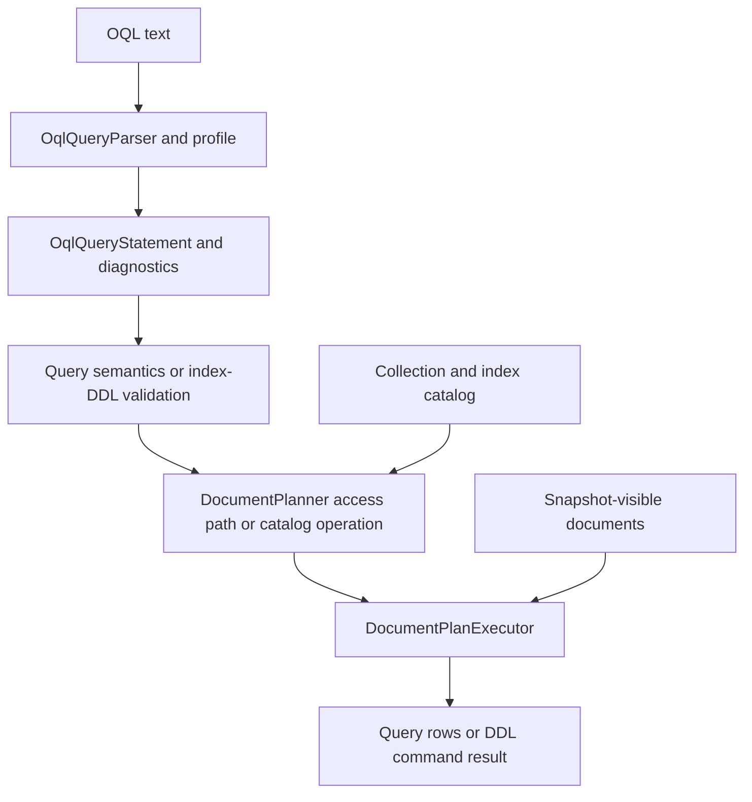
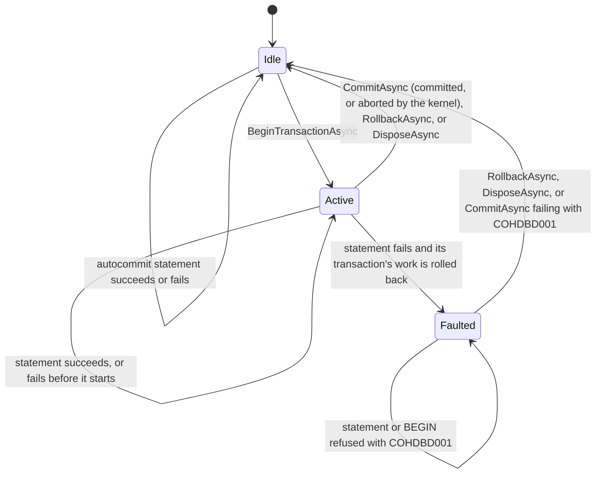
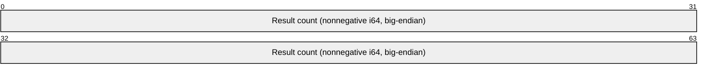
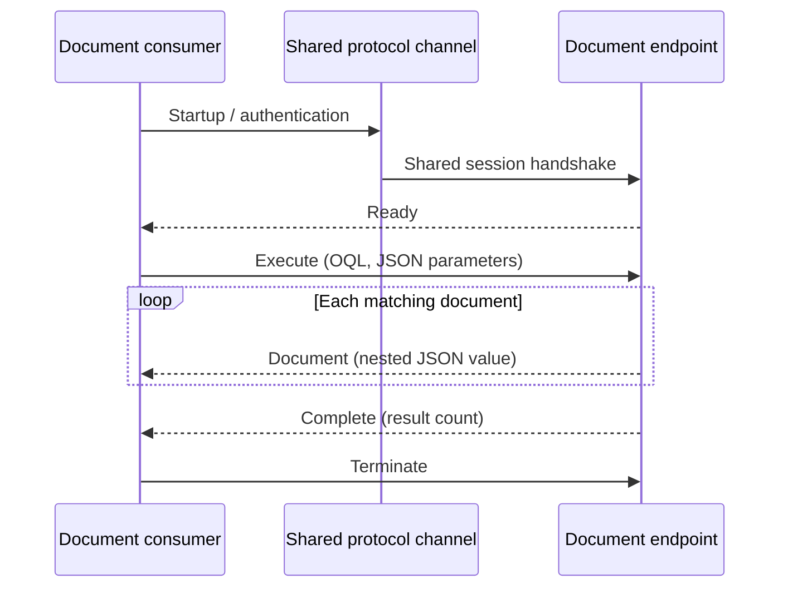

# Documents engine design

## String comparison and collation (#1025)

Documents remains ordinal-only. OQL string predicates, ordering, grouping, and
distinct comparisons use case-sensitive .NET ordinal (UTF-16 code-unit) order.
String index keys encode that same order, including supplementary characters;
they do not inherit SQL's UTF-8 collation transforms. Collection names, document
IDs, JSON property names, and prefix listings are also ordinal and case-sensitive.
Administrative database lookup remains ordinal-ignore-case. SQL database defaults,
column collations, and expression `COLLATE` have no effect on this model.
Configurable document collation is deferred; stored text retains its original form.

## Intent and composition

Documents combines the Blob engine's lifecycle, session transaction, worker, and
stamped chunk discipline with SQL's parse, logical planning, physical planning,
and execution split. Storage, journaling, paging, locks, MVCC, and B+Tree algorithms
belong to the shared kernel. No kernel contract or existing public interface was
widened. The model adds internal implementations of the frozen document contracts.

Every OQL statement flows through these stages. Catalog metadata informs query access-path
selection and index-DDL planning; `SELECT`, `CREATE INDEX`, and `DROP INDEX` all reach the same
plan executor rather than an index-management side channel.


```mermaid
flowchart TD
    Text["OQL text"] --> Parse["OqlQueryParser and profile"]
    Parse --> Ast["OqlQueryStatement and diagnostics"]
    Ast --> Logical["Query semantics or index-DDL validation"]
    Logical --> Physical["DocumentPlanner access path or catalog operation"]
    Catalog["Collection and index catalog"] --> Physical
    Physical --> Execute["DocumentPlanExecutor"]
    Data["Snapshot-visible documents"] --> Execute
    Execute --> Result["Query rows or DDL command result"]
```

| Assembly | Responsibility |
| --- | --- |
| `Database.Documents` | Engine, bound sessions, CRUD, OQL query/index-DDL plans and execution, document protocol family, builder extension |
| `Database.Documents.Language` | Profile, parser, AST, stable diagnostic locations |
| `Database.Documents.Catalog` | Versioned collection/document/index metadata and transactional index maintenance |
| `Database.Documents.Storage` | Explicit JSON validation, stamped metadata/chunk records, kernel record-space adapter |
| `Database` and child roots | Shared contracts, transaction coordinator, lock manager, WAL, pages, B+Tree |

The engine references the three model packages and the Database root. The catalog
references Documents storage and shared indexing/transactions, never this engine.
There are no Hosting or ApplicationModel references.

## Sessions and authority

The database's direct collection methods run automatic transactions. Methods called
through `session.Database` use that session's active transaction. OQL statements execute through
the session and therefore use its active transaction or an automatic statement transaction.
Collection CRUD always takes a session; a collection rejects sessions from another database.
A handle obtained through a session remains bound to that specific session and
fails once it closes. Collection names are database-local, case-sensitive names;
OQL has one collection source and no database qualification or server commands.
The inherited `IDatabase.Engine` lifecycle reference remains the frozen root API;
executing OQL or CRUD never interprets it as session authority over other databases.

Each statement uses one `ITransactionContext`. Automatic operations commit on
success and roll back on failure. Explicit transaction operations leave commit
to the caller; a failing operation aborts the whole explicit transaction, which
then refuses every later statement until the caller rolls it back, as
[Failed statements in explicit transactions](#failed-statements-in-explicit-transactions-1225)
describes.
Snapshot isolation fixes the read horizon at transaction start. ReadCommitted
captures one statement snapshot and pins its retention horizon for the statement.
Serializable is rejected rather than silently weakened.

The shared lock manager serializes writers per logical database. Before changing
a document, collection, or index, the operation compares its snapshot with the
latest state under that lock. An intervening change raises
`DatabaseTransactionAbortedException`. A commit or rollback the transaction kernel
refuses or aborts crosses the model boundary the same way (see "Failed statements in
explicit transactions" below for the end contract). An operation that ends up granted
the writer lock after its transaction ended gives the grant back through the
coordinator's lock manager, which leaves that release to the transaction manager while
the manager still tracks the transaction: a rolled-back transaction whose undo the
kernel had to defer keeps the writer lock until the version-purge pass completes the
undo (#1226, `Database.Transactions` DESIGN.md, "Ending a transaction"). Reads stay
snapshot based. Catalog and
index writes use the same logical context as content chunks; rollback and crash
recovery cannot publish a partial document.

### Failed statements in explicit transactions (#1225)

A statement that fails inside an explicit transaction aborts the whole transaction. Document
storage cannot undo one statement: a `PutAsync` writes its content chunks, tombstones the old
chain and publishes catalog and index entries through separate physical brackets, and
`Database.Transactions` undoes a writer only as a whole transaction, with no savepoints. Until
#1225 the session then dropped the rolled-back transaction from view, so the next statement
silently ran in autocommit and the caller's `RollbackAsync` threw. The session now follows the
contract the Graph engine set in #1188 (Graph [DESIGN.md](../../Assimalign.Cohesion.Database.Graph/docs/DESIGN.md#failed-statements-in-explicit-transactions-1188)),
with its own code, `COHDBD001`:

1. The failure rolls the transaction's work back at once and releases its locks, so the aborted
   transaction blocks no other writer while it waits for the caller. (When the undo itself fails,
   the kernel keeps the writer lock until its version-purge pass completes the undo; see
   `Database.Transactions` DESIGN.md, "Ending a transaction".)
2. The transaction stays the session's `CurrentTransaction` and reports `TransactionState.Faulted`.
   Every later statement on the session fails with `COHDBD001`: OQL text or requests, collection
   `GetAsync`/`PutAsync`/`DeleteAsync`, and the session-bound `IDocumentDatabase` verbs
   (`CreateCollectionAsync`, `GetCollectionAsync`, `DropCollectionAsync`,
   `GetCollectionsAsync`). `BeginTransactionAsync` fails with `COHDBD001` too. The error names the
   original failure in its message (`Cause: ...`) and carries it as `InnerException`. A refused
   statement does not change the transaction, and an aborted transaction refuses text before
   parsing it.
3. `RollbackAsync` succeeds, leaves none of the transaction's writes, and returns the session to
   autocommit. Disposing the transaction or the session ends it the same way. A rollback of any
   transaction that did not commit may be repeated and raises nothing; a rollback of a committed
   transaction is refused. This holds when the rollback, or the session's disposal, runs while a
   statement of the transaction is still running on another thread: the kernel admits no
   physical bracket of a transaction whose end has begun and waits for the one already applying
   before it undoes the transaction (Transactions [DESIGN.md](../../Assimalign.Cohesion.Database.Transactions/docs/DESIGN.md#ending-a-transaction-under-a-running-statement)),
   so the running statement fails with `DatabaseTransactionAbortedException` and writes nothing
   that outlives the rollback. A statement still waiting for the writer lock fails at once.
4. `CommitAsync` fails with `COHDBD001`, commits nothing, and ends the transaction (`RolledBack`).
   It keeps that answer after the transaction has ended some other way (disposed, or rolled back
   by the caller), so a commit never reports anything but `COHDBD001` for a transaction a
   statement aborted. A commit after the session closed fails with `COHDBD001` too, naming the
   closure when no statement failed first. A commit the kernel aborts throws
   `DatabaseTransactionAbortedException` and leaves the transaction `Faulted` and ended.
5. Every failure of a statement that started counts: parse diagnostics of text the session parses
   or of a typed request, planning and execution errors (an unknown collection, a stale expected
   version, a document whose indexed value outgrows the 1,024-byte index key, OQL `CREATE INDEX`
   or `DROP INDEX` on a `COHESION_SCHEMA` collection, which the planner refuses), ownership
   refusals, kernel aborts such as snapshot conflicts, and cancellation while the statement runs,
   including a wait for the writer lock. Failures that come before a statement starts leave the
   transaction unchanged: argument validation (a null, empty or whitespace id, collection name or
   statement text), the typed `CreateCollectionAsync` and `DropCollectionAsync` refusal of a
   `COHESION_SCHEMA` name, a session of another database, a request that carries no OQL
   statement, and the refusal of a second concurrent operation on the session.
6. Autocommit statements are unaffected: a failure ends only its own statement transaction.
7. A rollback or commit observes its cancellation token only before it starts: a token canceled by
   then throws `OperationCanceledException` and leaves the transaction as it was. One that has
   started runs to completion (PostgreSQL holds interrupts through `AbortTransaction`,
   `backend/access/transam/xact.c:2854-2861`), and it always ends the transaction (#1226): the
   transaction kernel completes a started rollback whatever fails (a lost abort record is ignored,
   and a failed undo is retried by the kernel with the writer lock held), and it aborts a commit it
   cannot complete. Until #1226 a journal or storage failure could leave the context active behind
   a failed rollback, and the session kept the transaction `Faulted`, refusing work with
   `COHDBD001`, until a later rollback completed; that end-failure state is gone, as it is in Graph.
   The kernel still refuses a rollback before it starts while the database closes
   (`ObjectDisposedException`: the manager's disposal flags itself before it claims any end, so
   every end refused during the close fails this way). The context then stays active only until
   disposal's own abort ends it: the session refuses statements in the ended transaction ("being
   committed or rolled back"), another `RollbackAsync` fails the same way while the close runs
   and is accepted once the close's abort ended the context, and a `CommitAsync` commits nothing:
   it fails with `ObjectDisposedException` while the database closes, or reports the `Faulted`
   state once disposal's abort ended the context.

Kernel failures cross the engine boundary translated (the area error policy): a deadlock as
`DatabaseTransactionDeadlockException`, a kernel abort as `DatabaseTransactionAbortedException`,
and a commit whose record was written but could not be made durable as
`DatabaseTransactionCommitUnconfirmedException` (the transaction is `Committed`; only its
durability is unconfirmed, `Database.Transactions` DESIGN.md), never as the kernel's own
exception types, for statements and for every end of the explicit transaction alike: commit,
rollback, disposal, the session's closure, and the abort a statement failure starts. One translation (`DocumentDatabaseInstance.TranslateKernelFailure`) serves them
all. Storage failures still surface as the storage child root's exceptions.

The explicit-transaction lifecycle, where Faulted is the new state:


```mermaid
stateDiagram-v2
    [*] --> Idle
    Idle --> Idle: autocommit statement succeeds or fails
    Idle --> Active: BeginTransactionAsync
    Active --> Active: statement succeeds, or fails before it starts
    Active --> Faulted: statement fails and its transaction's work is rolled back
    Faulted --> Faulted: statement or BEGIN refused with COHDBD001
    Active --> Idle: CommitAsync (committed, or aborted by the kernel), RollbackAsync, or DisposeAsync
    Faulted --> Idle: RollbackAsync, DisposeAsync, or CommitAsync failing with COHDBD001
```

The reference engines agree on the outcome. PostgreSQL aborts the whole block on any error
(`TBLOCK_ABORT`, "failed xact, awaiting ROLLBACK", `backend/access/transam/xact.c:171`) and rejects
every later command but COMMIT and ROLLBACK before parse analysis with SQLSTATE 25P02
(`backend/tcop/postgres.c:1150-1164`); Neo4j refuses work in a terminated transaction
(`community/kernel/.../coreapi/TransactionImpl.java:529-535`), accepts repeated rollbacks
(`community/kernel/.../KernelTransactionImplementation.java:1184-1194`) and fails a commit of a
transaction it rolled back (`KernelTransactionImplementation.java:1206-1210`, `1291-1303`). COMMIT
follows Neo4j, not PostgreSQL's silent ROLLBACK tag (`xact.c:4133-4139`): a caller awaiting
`CommitAsync` must not see success when nothing committed. RavenDB, the document-model reference,
has no interactive server transaction; its all-or-nothing unit is one client command or batch.
Its transaction merger groups independent requests into one write transaction and, when that
merged transaction fails, disposes it and reruns each request on its own
(`src/Raven.Server/Documents/TransactionMerger/AbstractTransactionOperationsMerger.cs:368-375`,
`391-394`); each rerun gets its own write transaction, disposed uncommitted when the command
throws (`AbstractTransactionOperationsMerger.cs:906-916`). A failed request therefore commits
nothing of its own, and the merge never makes one request's failure another's. Citations are to
PostgreSQL `85f55534e80`, Neo4j `54a7dcf7c25` and RavenDB `83399cb8bc8`.

Documents has no wire server or client yet, so the contract is exercised in process only
(`DocumentTransactionFailureTests`).

Collections created by these APIs have `DatabaseObjectOwner.Adhoc`. A collection
directly marked `Schema` refuses `DROP COLLECTION`, `CREATE INDEX`, and `DROP INDEX`,
with `DatabaseObjectLockedException` naming the collection, owning schema, and requested
operation. Document contents remain mutable. There is no
compiled-schema provisioning authority in this engine.

## OQL query and DDL semantics

### Catalog introspection

Collections are already discoverable through `GetCollectionsAsync` and
`GetCollectionAsync`. OQL adds only the catalog facts those handles do not expose,
through two virtual document collections:

| Source | Document properties | Cardinality |
| --- | --- | --- |
| `COHESION_SCHEMA.INDEXES` | `COLLECTION_CATALOG`, `COLLECTION_NAME`, `INDEX_NAME`, `PATH`, `IS_UNIQUE` | One document per visible index definition; `IS_UNIQUE` is Boolean false for the current nonunique indexes |
| `COHESION_SCHEMA.OBJECT_OWNERSHIP` | `COLLECTION_CATALOG`, `COLLECTION_NAME`, `OBJECT_TYPE`, `OBJECT_NAME`, `OWNER`, `OWNING_SCHEMA` | One document per visible collection; `OBJECT_TYPE` is `COLLECTION` |

`COLLECTION_CATALOG` is the bound database name. `OWNER` preserves SQL's `Adhoc`
and `Schema` values; `OWNING_SCHEMA` is the schema name or JSON null. Documents
enforces ownership on the collection: index DDL checks that collection's owner.
The index metadata has no independent ownership, so the ownership source reports
collections and does not invent an index owner. Index paths retain the catalog's
canonical document-path spelling; physical generation IDs and B+Tree pages remain
internal. There is no collection schema or inferred document-field catalog.

The sources are document shaped: `SELECT *` returns one JSON document per entry,
and ordinary projection, aliases, parameters, filtering, grouping, aggregates,
and ordering use the same evaluator as stored documents. For example:

```sql
SELECT INDEX_NAME, PATH FROM COHESION_SCHEMA.INDEXES
WHERE COLLECTION_NAME = 'items' ORDER BY INDEX_NAME

SELECT OBJECT_NAME, OWNER, OWNING_SCHEMA
FROM COHESION_SCHEMA.OBJECT_OWNERSHIP
```

This follows the existing choice to put document index DDL in OQL and keeps the
frozen database interface unchanged. The system-source names are case-insensitive;
their JSON property names are case-sensitive, as with all document paths. Only the
reserved `COHESION_SCHEMA` qualifier is accepted: it names a source in the session's
database, never another database. Ordinary `other.items` remains invalid. Quoting
the entire system-source name also identifies the same reserved source.

Every query computes documents directly from the same transaction catalog snapshot
used by the statement. Snapshot transactions retain their read horizon, while own
uncommitted catalog writes are visible. Subsequent statements observe committed
catalog changes according to their isolation level. No metadata copy, content record,
or synthetic collection is stored, and existing collection listing stays unchanged.

The sources are read-only. `CREATE INDEX` and `DROP INDEX` targeting either source,
and `CreateCollectionAsync` or `DropCollectionAsync` using either reserved name,
throw `DatabaseException` with `System collection '<canonical source>' is read-only.`
before ordinary catalog lookup or mutation. OQL document `INSERT`, `UPDATE`, and
`DELETE` remain unsupported everywhere and return the existing `COHDBL001` parse
diagnostic. Virtual sources do not provide mutable `IDocumentCollection` handles.

### Stored document queries

The supported clause matrix lives in the language package's
[DESIGN.md](../../Assimalign.Cohesion.Database.Documents.Language/docs/DESIGN.md).
SELECT, FROM, WHERE, GROUP BY, HAVING, ORDER BY, CREATE INDEX, and DROP INDEX are executed;
DEFINE, ELEMENT, FLATTEN, nested queries, document data-mutation statements, and server
statements are rejected with `COHDBL001`. The parser advertises only clauses this executor
supports.
AST diagnostics are checked both for text requests and directly constructed requests.

Projection supports whole documents, nested field paths, zero-based array element
paths, literals, parameters, arithmetic, and aggregates. `SELECT *` returns one
`document` column containing the entire JSON value. Objects and arrays remain
`JsonElement` values; scalars become null, Boolean, decimal, or string. Mixed-type
columns advertise `DatabaseType.Null` as unknown rather than guessing a schema.
An explicit alias resolves duplicate projected column names; otherwise they fail.
No POCO reflection, schema inference, or runtime code generation is involved.
Query JSON parsing uses the same 128-level nesting limit as storage validation
and index extraction, so every accepted document can be queried at its stored depth.

Absent fields, paths through an incompatible shape, and out-of-range array indexes
evaluate to null. Null and missing share the same group and `IS NULL` behavior.
Ordinary comparison with null is unknown; WHERE/HAVING retain only true predicates.
Equality compares scalar values and structurally compares arrays/objects.
Range predicates compare only values of the same scalar kind. Arithmetic requires
decimal operands; invalid numeric input and division by zero fail explicitly.

COUNT(*) counts documents; COUNT(expression) counts nonnull values. SUM and AVG
require numeric nonnull inputs. SUM, AVG, MIN, and MAX over no nonnull inputs return
null; COUNT returns zero. Ungrouped aggregate queries yield a single group even
for an empty source. Outside aggregate calls, grouped projection, HAVING, and
ORDER BY expressions must be a group key or an expression built from group keys
and constants. Group-key binding compares expression structure, preserves literal
scalar types, and treats qualified and unqualified paths to the same iteration
variable as equivalent. Group values compare structurally.

Results are deterministic. A scan and an index seek both establish ordinal
document-ID order before filtering and projection. GROUP BY uses the total order
null, Boolean, decimal, ordinal string, array, object. Arrays compare element by
element; objects compare property names in ordinal order and their values.
ORDER BY accepts source expressions or a standalone explicit projection alias;
alias names take precedence over source fields for that standalone form.
It compares its expressions and preserves the established order for ties.
This baseline makes identical data and queries return identical sequences across
access paths. Query results are materialized and own their JSON values; they do
not retain a transaction or borrowed storage memory after execution.

## Index planning and writes

`CREATE INDEX <index-name> ON <collection> (<path>)` and
`DROP INDEX <index-name> ON <collection>` are OQL statements. `DocumentPlanner` binds them to
catalog-operation plans and `DocumentPlanExecutor` executes those plans under the statement's
`ITransactionContext`. This replaces the former extension-member entry point and leaves the
frozen `IDocumentDatabase` member list unchanged; there is no runtime switch on internal database
implementations.

The create path uses the same segment grammar as a WHERE path, including nested object fields,
array subscripts, and bracket-string property names. Planning converts those segments to the
catalog's lossless canonical path without changing their case or treating a property name's
punctuation as structure.

The executor takes the logical database's exclusive writer lock, enforces schema ownership using
the specific `CREATE INDEX` or `DROP INDEX` operation name, and delegates the transactional
catalog/tree work to Documents.Catalog. The catalog owns index definitions and maintains shared
B+Trees during every Put/Delete and collection drop. Index creation populates existing documents
in its transaction; queries never lazily build trees. Dropping an index removes its visible
definition in the same transaction, so subsequent physical plans stop selecting it while older
snapshots retain their defined visibility.

Successful index DDL returns a command `QueryResult` with `Success` status and an affected count
of zero; index definition changes are not document-row mutations.

The physical planner uses applicable equality/range predicates on indexed paths,
including parameter values, reversed operands, and conjunctive bounds. Equality
is preferred over a range; ties choose ordinal index name. The executor reapplies
the full predicate to candidates, preserving mixed-shape semantics. See the
[catalog design](../../Assimalign.Cohesion.Database.Documents.Catalog/docs/DESIGN.md)
for supported scalar keys, visibility filtering, and restart recovery.

## Data mutation and serialization semantics

OQL now includes index DDL but no document data-mutation clauses. The existing collection API
provides deterministic mutation semantics: Put replaces the complete JSON value
by ordinal identity, Delete removes that identity, and each operation either
completes in its transaction or rolls back. Put captures caller memory before
awaiting and returns a new version. An optional expected version must match an
existing visible document; mismatch fails. Versions use the durable kernel
sequence allocator, are strictly increasing for successful writes, and may have
gaps. Delete/reinsert and restart never reuse an old version.

Nested objects, arrays, and scalar roots are accepted. JSON validation and exact
byte-preservation rules are specified in the
[storage format](../../Assimalign.Cohesion.Database.Documents.Storage/docs/DESIGN.md).
Adding/removing fields and changing a scalar's type are supported complete-document
replacements. They need no compiled schema migration and update indexes in the
same transaction. The new shape can change predicate membership and projection
types by the explicit mixed-shape rules above.

## Lifecycle and durability

`DocumentDatabaseEngine.Create` starts four engine-owned workers: checkpoint,
write-ahead-log flush, dirty-page write-back, and MVCC version purge. `Workers`
exposes them through the existing engine contract. The observable state is Running,
Faulted while a worker keeps failing, and Disposed after close.

A worker failure never ends a worker (#1268). Each worker catches per database: a failed
checkpoint, page write-back or group flush of one database is reported
(`DatabaseEngineWorker.ReportFailure`, the worker's `Fault`), the pass goes on to the next
database, and later passes skip that database for `DatabaseEngineWorker.FailureBackoff` (one
second, PostgreSQL's error sleep, `src/backend/postmaster/checkpointer.c:286-346`,
`bgwriter.c:154-205`) while every other database keeps the worker's full pace (#1268 review); the
first pass that finishes that database's work clears its record, so the engine is Faulted exactly while a worker
keeps failing. A failure that took a database offline (a failed durable flush, a failed drain of
the journal's append buffer, #1252, or a failed header slot write) is not the worker's: the
workers skip the database and the engine lists it in
`OfflineDatabases`. The engine's pump runs a worker again after the backoff if its loop ever ends
early (only an `IDatabaseEngineWorker` without the guided base can; the engine then reports
Faulted until disposal). Before #1268 the pump caught outside the worker's loop, so one
unexpected exception ended that worker for good. `DocumentWorkerResilienceTests` fails a
checkpoint's and a write-back's page writes (the worker reports, backs off and recovers while
the other database's work goes on), a group flush's drain or fsync on the flush worker's own
thread (only its database goes offline, `StorageOfflineCause.JournalFlush` either way), and a
header slot write (the database goes offline with COHDBD002, naming "a write of the file
header", and its files stop changing). It also checks that a database whose checkpoints keep
failing leaves the other database a pace a worker-wide backoff cannot reach: over a shared
six-second window more than twice the backoff's checkpoints, the floor that fails every
worker-wide backoff or stall of one backoff a pass, with the median second's share of the no-fault
checkpoints as a secondary signal. A smaller worker-wide slowdown can pass; the deterministic
signal that would catch it is required follow-up work (the SQL engine's DESIGN.md, "Engine-owned
background workers"). It also checks that a writer
queued for the database writer lock when the database goes offline (a header slot write, a
journal fsync or a journal drain failing) gets COHDBD002 at once instead of waiting for the reopen: an offline
database undoes nothing, so the writer holding the lock keeps it, and the coordinator ends every
lock wait instead (`TransactionCoordinator.AbandonLockWaits`, wired to the storage's offline hook).
Disposal is idempotent: stop/join workers, dispose coordinators (rolling back open
transactions), then durably flush and close each storage file set. Close errors
are aggregated after attempting every database.

File-backed databases have `document.dat`, `document.log`, and `document.bak` under
one validated database-name directory. Open performs kernel WAL replay with its
checkpoint deferred, scrubs uncommitted record writers and index changes, and then
completes the recovery checkpoint. Before the scrub it checks every index tree's
B-tree page format (`DocumentCatalog.EnsureIndexFormat`, #1194): a database whose
indexes an engine before #1194 wrote is refused with "Database 'x' cannot be
opened. COHDBI001: …". A cleanly closed database is left byte-identical. A
crashed one has already had the storage layer's format-agnostic journal redo and
undo when the check runs, but keeps its journal (the open-time checkpoint is
deferred), so the engine that wrote it still recovers it. A file set in another storage
format (#1251) is refused by the storage before its journal is read, and the engine names
the database: "Database 'x' cannot be opened. COHDBS001: …", the storage's
`StorageFormatException` as its inner exception, the files byte-identical
(`DocumentEngineTests`). Both synchronous and grouped durability
acknowledge commits only after the journal is durable. Memory-backed databases
use the identical storage/transaction implementation over in-memory streams.

## Storage operations (#1243, #1254, #1226)

**A failed fsync takes the database offline (#1243).** When a durable flush of the
database's journal or data file fails, the storage goes offline (`Database.Storage`
DESIGN.md, "A failed durable flush takes the storage offline") and nothing more is written to
the file set, closing included — PostgreSQL's `PANIC` on a failed WAL fsync (`issue_xlog_fsync`,
`src/backend/access/transam/xlog.c:9877-9937`; the commit critical section in
`RecordTransactionCommit`, `src/backend/access/transam/xact.c:1470-1583`; and `data_sync_retry`
off, `src/backend/storage/file/fd.c:3966-3987`), scoped to the database. The statement whose
commit flush failed gets `DatabaseTransactionCommitUnconfirmedException`. Every later operation —
a new session, an OQL statement or typed request, a collection call, BEGIN, and the COMMIT or
ROLLBACK of a transaction open at the failure — is refused with `DatabaseOfflineException`, code
`COHDBD002`, carrying the storage's `StorageOfflineException`. The engine has no wire server.
The workers skip the database; closing its sessions and transactions writes nothing. A storage
bracket whose commit record was written before its flush failed is reported as unconfirmed,
never refused (`StorageOfflineException.CommitRecordWritten`). The engine stays `Running`;
`DocumentDatabaseEngine.OfflineDatabases` names the database, and `Database.Hosting` reports the
application unhealthy while it is listed. A header slot write that fails takes the database
offline the same way (#1268): no header write may run again in that process, so no checkpoint
could truncate the journal, and a database that kept accepting commits would grow it without
bound; the refusal's message names "a write of the file header".
`DocumentDatabaseEngine.OpenDatabaseAsync(name)` disposes the offline instance without writing
and reopens the file set, whose recovery keeps the unconfirmed commit if its record's bytes
reached the media and aborts every transaction that was open. `DocumentStorageOperationsTests`
fails the commit's journal fsync through a fault-injecting strategy over durable in-memory
handles, checks every refusal and that the file set did not change through the workers' passes
and the close, and reopens with and without the unconfirmed record's bytes. The test holds
its open transaction as a reader: the engine's single database writer lock would otherwise block
the failing commit.

**Buffer pool and checkpoint options (#1254).** `DocumentDatabaseEngineOptions` (and
`IDocumentDatabaseEngineBuilder`) carry `BufferPoolCapacity` (32 MiB; whole 8 KiB pages, at least
1 MiB), `CheckpointJournalSize` (256 MiB; zero for time only; not negative) and
`CheckpointInterval` (5 minutes, was 30 seconds), all validated by `Create`. The checkpoint
worker checkpoints a database when its journal reaches the size (its storage wakes the worker
at once) or when the interval passed and its journal received records, looking at most once a
second otherwise; it checkpoints through the transaction coordinator, under the statement apply
gate, so a sustained load cannot keep it out, and it never waits for the gate: a statement that
holds it runs the checkpoint as it ends (`TransactionCoordinator.TryCheckpoint`), so a long
statement in one database cannot stop the other databases' checkpoints. An open database costs
up to about 33 MiB of pool memory once it touched that many pages; an in-memory one also holds
its data and its journal (up to the checkpoint size, briefly twice that while the buffer doubles
past it, released by the checkpoint). The reasoning is in `Database.Storage` DESIGN.md
("Capacity", "Checkpoint triggers").

**Deferred undo is retried on its own backoff (#1226).** The version-purge worker retries a
rollback's failed undo about 100 ms after the deferral, then at doubling delays up to
`MaintenanceInterval`, so a transient failure releases the database writer lock within about a
second; a failure that persists is recorded as a worker fault and retried without stopping the
worker, and the first pass with no failure and no undo still deferred clears the fault
(`Database.Transactions` DESIGN.md).

## Limits and verification

The current engine materializes query inputs/results and whole JSON values in
managed memory. Chunk persistence handles documents larger than a page but does
not promise a bounded heap independent of document/query size. Database-wide
writer locking is conservative; there is no query-cost statistics model, join,
subquery, external sort, document protocol server/client, replication, security, hosting wiring,
ApplicationModel integration, or compiled-schema provisioning.

Co-located tests cover nested/mixed JSON, expected-version writes, explicit commit
and rollback, both isolation levels, cross-database/session guards, direct-marked
schema ownership, indexed-versus-scanned queries, and file reopen. Storage/catalog
tests exercise crash images with committed and abandoned writes and index recovery.
All serialization and activation are static BCL calls compatible with trimming
and NativeAOT.

The frozen lock manager does not cancel queued requests on transaction rollback.
Documents rechecks the context after a writer grant and releases any grant to an
ended transaction. A caller cancellation token cancels a pending wait promptly;
without cancellation, an ended operation fails when the earlier writer releases.
Operation completion and abort are serialized to avoid duplicate logical rollback.

The engine's durability setting configures the storage's physical commit gate, and
the transaction coordinator's logical commit goes through it
(`Storage.EnsureCommitDurable`): under `Grouped` a commit waits for the WAL flush
worker's group flush, as `DocumentWorkerResilienceTests` shows (the failing fsync
of a grouped commit runs on the flush worker's thread). The WAL flush worker is the
engine-owned implementation of the shared storage flush duty.

## Document wire family

`DocumentProtocol.Family` contributes the Documents message vocabulary to the shared
`ProtocolChannel`. The channel is permanently bound to this family at the endpoint; neither a
request nor the startup payload can change the model. The shared package owns framing, startup,
authentication, errors, liveness and termination. Documents owns OQL requests, JSON parameter
objects and JSON results. This mirrors the shared lexer/parser mechanism and model language profile.
There is no document server or document client in this increment. The public family and codecs
are the surface for that work. `DocumentProtocolTests` exercises a complete startup/authentication,
OQL request, engine execution, nested result and termination exchange over `Connections.InMemory`.

The envelope remains protocol **1.0**: unsigned 32-bit big-endian payload length, one message-type
byte, then exactly that many payload bytes. The length excludes the five-byte header and is at
most 16,777,216. Shared codes 1–4 and 10–13 retain their meaning; 14–63 are reserved. The Documents
endpoint admits only its family below and the shared codes. Code 64 on another model's endpoint
belongs to that endpoint's vocabulary. A channel and a client pool cannot switch families.
Unknown major versions are rejected with shared `UnsupportedVersion`; the negotiated minor is
the smaller supported/requested minor. No deployed SQL or Key-Value frame changes.

All lengths and counts below are signed big-endian integers. A string is an `int32` byte length
followed by that many UTF-8 bytes; a negative length is invalid. No padding is present.

| Byte | Direction | Payload |
| --- | --- | --- |
| 64 (`Execute`) | Client → server | Statement string; `int32` parameter-byte length; exactly that many UTF-8 JSON bytes containing one object |
| 65 (`Document`) | Server → client | Exactly one complete UTF-8 JSON value occupying the entire payload, with no inner length prefix |
| 66 (`Complete`) | Server → client | Exactly eight bytes: nonnegative `int64` count of Document frames emitted for this request |

Payload offsets are zero-based and exclude the shared five-byte frame header. For `Execute`, bytes
0–3 are the signed 32-bit big-endian statement byte length `S`; the `S` UTF-8 statement bytes begin
at byte 4; bytes `4 + S`–`7 + S` are the signed 32-bit big-endian parameter byte length `P`; and
the `P` JSON-object bytes begin at byte `8 + S` and consume the rest of the payload. A `Document`
payload is its complete JSON value from byte 0 through the payload end, without an inner length.
A `Complete` payload has one exact fixed layout: bytes 0–7 (bits 0–63) are the nonnegative signed
64-bit result count in big-endian order, and no bytes follow it. The packet view below shows that
exact fixed `Complete` layout; the variable-length `Execute` and `Document` layouts remain in prose.


```mermaid
packet-beta
0-63: "Result count (nonnegative i64, big-endian)"
```

Parameters are named object members and may themselves contain nested values. An empty parameter
set is `{}`. A result can be an object, array, string, number, Boolean or null; absent properties
stay absent. The codec preserves the original bytes, including whitespace and Unicode spelling.
JSON comments, trailing commas, multiple top-level values, malformed UTF-8 and nesting deeper
than 256 levels are invalid. Extra bytes after the Execute parameter object or Complete count
are protocol violations. Objects and arrays stay intact; there is no schema header or positional
field vocabulary.

After the shared Ready message the client sends one Execute and waits for zero or more Document
messages followed by exactly one Complete. A shared Error instead terminates the current exchange;
no Complete follows it. Statements are serialized on a connection. An empty result has Complete
count zero. The family does not fragment an individual JSON value: each result must fit one frame;
only Blob imposes a chunked byte-stream exchange. Session implementations must verify the completion
count against the number of results received and reject out-of-order messages.

The sequence shows the model-owned result exchange within the shared session lifecycle:


```mermaid
sequenceDiagram
    participant Client as Document consumer
    participant Channel as Shared protocol channel
    participant Session as Document endpoint
    Client->>Channel: Startup / authentication
    Channel->>Session: Shared session handshake
    Session-->>Client: Ready
    Client->>Session: Execute (OQL, JSON parameters)
    loop Each matching document
        Session-->>Client: Document (nested JSON value)
    end
    Session-->>Client: Complete (result count)
    Client->>Session: Terminate
```


## Phase 29: deferred hosting composition

The owner-approved [Database hosting composition](../../../../docs/programs/DATABASE_HOSTING_DESIGN.md)
is implemented as `AddDocuments((context, engine) => ...)` on
`IDatabaseApplicationBuilder`. This replaces `AddDocumentDatabase`. The model callback
runs during application Build and receives an `IDocumentDatabaseEngineBuilder`.
It configures the complete option set, including `FileSystemPath? RootPath`,
durability, storage strategy, identity and worker intervals; it neither binds
configuration nor accesses a service container. Retained builder options and
factories reject mutation after the first engine Build attempt.

`AddWorker` and `AddServer` take factories whose engine argument exists before
the factory runs. The engine schedules custom workers through the common
`IDatabaseEngineWorker.Run` contract; this is the concrete generic consumer
that earns `IDatabaseEngineBuilder`. There are no additional strongly typed
factory overloads: a model-specific factory can cast its argument, while ordinary
workers remain portable across models. The engine owns successful factory
products and cleans them up on subsequent construction failure. Nested servers
must front that exact engine. The application snapshots each engine's Servers
for start/stop; disposing the engine disposes its servers and custom workers.

`DocumentDatabaseEngine.Create(options)` remains the standalone entry point.
Application factory registrations are application-owned; instance registrations
remain caller-owned, including their nested components. All four named database
operations now take `DatabaseName`, with the existing implicit string conversion
preserving ordinary literal call sites. Empty/default names are rejected.

The explicit requirement for StorageStrategy supersedes the draft's statement
that this model lacks a storage injection parameter. `IDocumentStorageStrategy`
provides create/open/drop, existence and discovery using the existing
`DocumentStorage` product. It overrides RootPath without allocating default
files; returned storage is engine-owned and the strategy itself is borrowed.
Durability is supplied explicitly, and opening must defer checkpointing until
engine recovery. Default file/memory selection remains unchanged.

`DocumentDatabaseEngine.CreateBuilder()` exposes the model builder for the
concrete hosting builder's `AddEngine(name, build => ...)` overload. The consumer
assigns resolved configuration/service values, registers nested server/worker
factories, and returns `Build()`; the model package still never sees DI.
There is no generic production orchestration over `IDatabaseEngineBuilder`;
the base contract supports model-agnostic worker composition, demonstrated by
tests exercising the public factory through that base interface.
