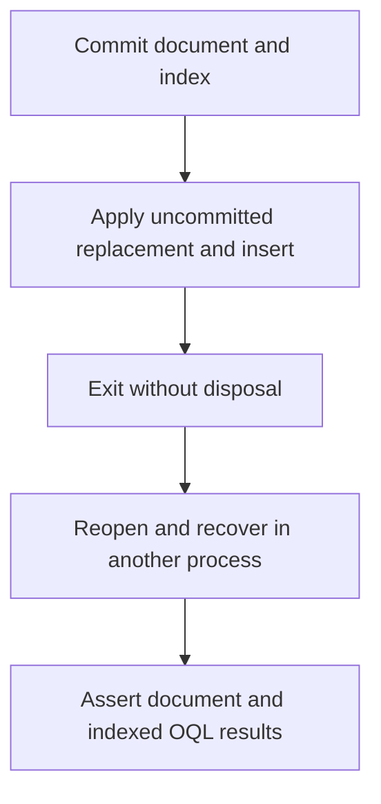

# Documents recovery fixture design

The seed process commits a multi-page document and its secondary index, starts
an explicit transaction, overwrites that document, inserts another, writes dirty
pages through the kernel's WAL-before-data gate, and exits
without disposing anything. The verification process reopens storage, reads
the original nested JSON, checks the partial document is absent, and executes
an indexed parameterized OQL aggregate. Assertions fail the executable with a
nonzero exit. The fixture uses no reflection and can be published with NativeAOT.

The process boundary forces recovery from persisted files, independently of
in-process cleanup.

