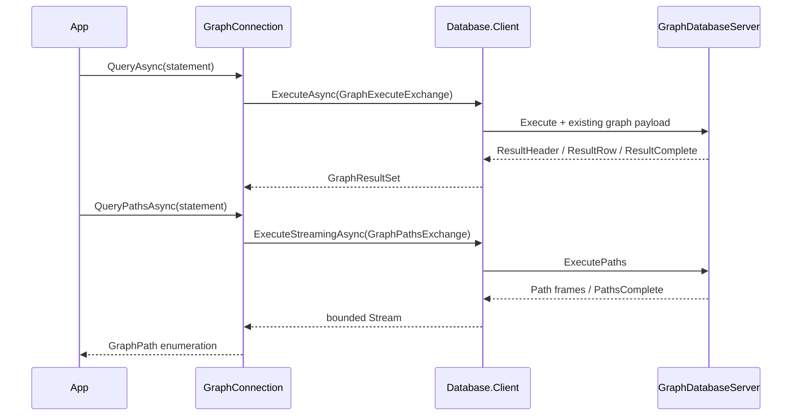

# Graph client design

The client follows Sql.Client's interface, options, internal connection, exchange, and exception
shape. It references Database.Graph for its existing model protocol and graph values, and
Database.Client for the pool, handshake, frame transport, and connection lifetime. It has no
Hosting dependency, reflection, dynamic serialization, or dependency on Microsoft.Extensions.

## Scalar completion

GraphExecuteExchange implements IDatabaseProtocolExchange and explicitly reports
IsResponseComplete. A successful ResultComplete certifies completion. A ParseFailure or
ExecutionFailure received before any result header is the server's complete rejected-statement
response, so the pool may reuse that session. A malformed response, truncated transport,
cancellation, or error after result output cannot certify completion.

Rows require exactly the advertised number of scalar components. Columns preserve wire names
and shared DatabaseType identities; duplicate names resolve to the first column, with ordinals
available for unambiguous access. Scalar statements fully materialize before returning.
MATCH projection metadata remains the engine's DatabaseType.Null (unknown), because graph
properties may have heterogeneous types. The tuple codec preserves each actual value's runtime
type. SHOW metadata retains its precisely declared catalog types.

GraphClientException preserves the stable ProtocolErrorCode and inner failure. The typed
connection does not translate error codes into connection health decisions: completion belongs
to its exchange and pooling belongs to Database.Client.

## Path lifetime

GraphPathsExchange implements IDatabaseStreamingExchange. OpenAsync sends ExecutePaths and
validates the initial Path or PathsComplete frame. CopyToAsync validates each existing path
payload and verifies the final path count. Its private stream handoff prefixes each payload
with its length to preserve boundaries through bounded byte buffering; this is entirely within
the client and does not alter the graph wire protocol. GraphConnection decodes those same
payloads into GraphPath values.

The shared ExecuteStreamingAsync owns frame I/O, applies backpressure, and keeps the connection
busy through completion. Consuming EOF verifies terminal completion before another operation.
Disposing an unfinished enumeration cancels the worker and discards the rental. Stream errors,
including an initial server rejection, discard the connection under the existing shared
streaming contract. This is intentionally stricter than materialized statement rejection;
IDatabaseStreamingExchange has no failed-response completion capability.

The client holds a bounded number of path payloads for materialization plus the shared bounded
byte buffer. The engine currently materializes its path result, so end-to-end server memory still
depends on the number of matched paths. A single path must fit the existing maximum frame size.

## Supported surface and limits

ExecutePaths accepts exactly one bound path, node, or relationship projection from a read-only
MATCH. A node becomes a singleton path; a relationship includes its stored-direction endpoints;
a named path retains traversal order. Scalar or mixed projections and mutations are rejected,
so no path is reconstructed from scalar results. Execute serves scalar projection rows and
mutations; bound entity projections direct callers to ExecutePaths.

Graph transactions remain a deliberate limit: there are no connection transaction members;
BEGIN, COMMIT, ROLLBACK, and the reserved Transaction message are unsupported. Mutations retain
the engine's existing execution and validation semantics. Database binding remains fixed at
handshake and catalog SHOW keeps its existing read-only and scoping diagnostics.
