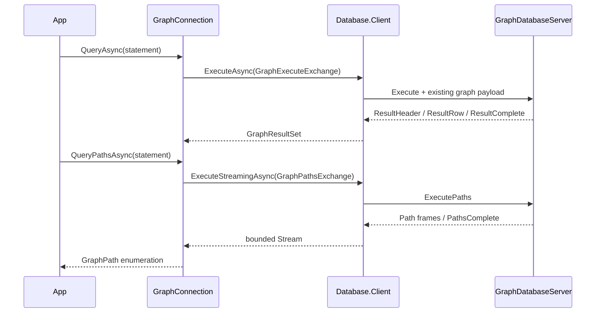

# Graph client design

The client follows Sql.Client's shape: a sealed client with a `Create` factory over options, a
sealed connection, internal exchanges, and an exception that keeps the wire code. It references Database.Graph for its existing model protocol and graph values, and
Database.Client for the pool, handshake, frame transport, and connection lifetime. It has no
Hosting dependency, reflection, dynamic serialization, or dependency on Microsoft.Extensions.

```mermaid
sequenceDiagram
    participant App
    participant GraphConnection
    participant Pool as Database.Client
    participant Server as GraphDatabaseServer
    App->>GraphConnection: QueryAsync(statement)
    GraphConnection->>Pool: ExecuteAsync(GraphExecuteExchange)
    Pool->>Server: Execute + existing graph payload
    Server-->>Pool: ResultHeader / ResultRow / ResultComplete
    Pool-->>GraphConnection: GraphResultSet
    App->>GraphConnection: QueryPathsAsync(statement)
    GraphConnection->>Pool: ExecuteStreamingAsync(GraphPathsExchange)
    Pool->>Server: ExecutePaths
    Server-->>Pool: Path frames / PathsComplete
    Pool-->>GraphConnection: bounded Stream
    GraphConnection-->>App: GraphPath enumeration
```

## Scalar completion

GraphExecuteExchange derives from DatabaseProtocolExchange, whose run entry clears the completion
evidence before each run. A successful ResultComplete certifies completion. A ParseFailure or
ExecutionFailure received before any result header is the server's complete rejected-statement
response, so the exchange calls MarkResponseComplete and the pool may reuse that session. A malformed response, truncated transport,
cancellation, or error after result output cannot certify completion.

Rows require exactly the advertised number of scalar components. Columns preserve wire names
and shared DatabaseType identities; duplicate names resolve to the first column, with ordinals
available for unambiguous access. Scalar statements fully materialize before returning.
MATCH projection metadata remains the engine's DatabaseType.Null (unknown), because graph
properties may have heterogeneous types. The tuple codec preserves each actual value's runtime
type. SHOW metadata retains its precisely declared catalog types.

GraphClientException preserves the stable ProtocolErrorCode and inner failure. The typed
connection does not translate error codes into connection health decisions: completion belongs
to its exchange and pooling belongs to Database.Client.

A failed dial reaches ConnectAsync as the core's DatabaseClientException with
ProtocolErrorCode.ConnectionFailure (owner decision 39; the core's DESIGN.md, "Lifecycle and
errors"). GraphClientException keeps that code, and the core exception, which keeps the
transport's exception, is its inner exception. A canceled dial throws OperationCanceledException
unchanged (GraphClientDialFailureTests).

## Path lifetime

GraphPathsExchange derives from DatabaseStreamingExchange. OpenCoreAsync sends ExecutePaths and
validates the initial Path or PathsComplete frame. CopyToCoreAsync validates each existing path
payload and verifies the final path count. Its private stream handoff prefixes each payload
with its length to preserve boundaries through bounded byte buffering; this is entirely within
the client and does not alter the graph wire protocol. GraphConnection decodes those same
payloads into GraphPath values.

The shared ExecuteStreamingAsync owns frame I/O, applies backpressure, and keeps the connection
busy through completion. Consuming EOF verifies terminal completion before another operation.
Disposing an unfinished enumeration cancels the worker and discards the rental. Stream errors,
including an initial server rejection, discard the connection under the existing shared
streaming contract. This is intentionally stricter than materialized statement rejection;
DatabaseStreamingExchange has no failed-response completion capability.

The client holds a bounded number of path payloads for materialization plus the shared bounded
byte buffer. The engine currently materializes its path result, so end-to-end server memory still
depends on the number of matched paths. A single path must fit the existing maximum frame size.

## Supported surface and limits

ExecutePaths accepts exactly one bound path, node, or relationship projection from a read-only
MATCH. A node becomes a singleton path; a relationship includes its stored-direction endpoints;
a named path retains traversal order. Scalar or mixed projections and mutations are rejected,
so no path is reconstructed from scalar results. Execute serves scalar projection rows and
mutations; bound entity projections direct callers to ExecutePaths.

Statement warnings do not reach the client yet. A read that names a label or relationship type the
database does not have succeeds in the engine with a `COHDBG010` or `COHDBG011` warning (#1228), and
protocol 1.0 has no frame for a successful statement's diagnostics, so the client receives the rows
alone: for a required unknown name an empty `GraphResultSet` (its header's columns and an affected
count of -1) or a path enumeration with no paths. The statement is not a failure, so the pooled
session and any explicit transaction on it continue. Protocol 1.1 (#1105) negotiates a core
Diagnostics frame that the server sends before `ResultComplete` (#1105 decision 2) and, as #1228
proposes to #1105, before `PathsComplete`; the client adds the received warnings to its result
objects.

Graph transactions remain a deliberate limit: there are no connection transaction members;
BEGIN, COMMIT, ROLLBACK, and the reserved Transaction message are unsupported. Mutations retain
the engine's existing execution and validation semantics. Database binding remains fixed at
handshake and catalog SHOW keeps its existing read-only and scoping diagnostics.

## Diagnostics

The client reports through one internal event source named for its assembly,
`Assimalign.Cohesion.Database.Graph.Client` (`src/Internal/EventSource/GraphClientEventSource.cs`),
written by GraphConnection's three public members. Start and stop carry the `Queries` keyword
(`0x1`).

| Id | Event | Level | Keyword | Payload |
| --- | --- | --- | --- | --- |
| 1 | `QueryStart` | Verbose | `Queries` | `database`, `operation` (`Query`, `Execute` or `QueryPaths`) |
| 2 | `QueryStop` | Verbose | `Queries` | `database`, `operation`, `status` (`Success`, `Error` or `Cancelled`), `rowCount` (rows; for `QueryPaths`, the paths read by then; -1 for a scalar query that did not return), `durationMilliseconds` |
| 3 | `QueryFailed` | Error | — | `database`, `operation`, `code` (the wire code; empty for an uncoded failure), `exceptionType`, `durationMilliseconds` |

QueryAsync and ExecuteAsync share one private core that names the operation, so an Execute is
reported as such and not as the Query it runs. **Every start has a stop** (the area's convention,
`docs/resources/Database/DESIGN.md`, "Diagnostics"), written from a `finally`: a failure writes
event 3 and then `QueryStop` with `Error`, a cancellation (how a timeout surfaces) `QueryStop` with
`Cancelled` and no failure. The failure is captured by an exception filter that declines it, so it
reaches the caller unchanged. A path query ends when its enumeration does: `Success` once it
reached the server's terminal count; `Error`, after event 3, for a failed open or read;
`Cancelled` for a cancellation or for a caller that stopped reading and disposed the enumerator
early, with the paths read by then. An iterator cannot catch around a `yield`, so the open and each
read capture their own failure, and the iterator's `finally` writes the stop. Its start and stop are
written by different steps of the enumerator, each on its consumer's execution context, where the
start's activity is not current; so while the start was written, the enumerator captures the
start's execution context and writes the end in it (`ExecutionContext.Run`, allocating only then),
and an activity-tracking tool sees `QueryStop` close the activity `QueryStart` opened. As
`System.Net.Http`'s `RequestStop`, a stop is written only for a start that was written, so a
listener that attaches mid-query sees no stop without its start; event 3 is written either way.

The statement text and the parameter values are never written, nor is the server's message: a GQL
parse error's quotes a fragment of the statement, so event 3 writes the wire code and the
exception's type only (the area's failure rule). Timestamps are taken only while a listener takes
the source. No counters.

`GraphClientEventSourceTests` checks the name, the strict manifest, one event per query of each
member, a refused statement included (its failure, then its `Error` stop, with no statement text and
no server message), a path query its caller stopped reading (a `Cancelled` stop with the paths read),
a cancelled query (a `Cancelled` stop and no failure), a path query the server refused
(`ParseFailure`, then an `Error` stop with no paths), a query refused by the client itself because a
path query holds the exchange (an empty code and `InvalidOperationException`), a failure whose start
was not written (no stop), and, under `TplEventSource` activity tracking, a path query's stop
carrying its start's activity id whether its caller read every path or stopped early.

## Concrete types (concrete-types plan, phase 5, #1261)

The package has no public interface left and no `Abstractions/` folder
([plan](../../../../docs/programs/DATABASE_CONCRETE_TYPES_PLAN.md) §7, "P5, as landed").

| Type | Shape | Was |
|---|---|---|
| `GraphClient` | sealed; `Create(GraphClientOptions)` over a private constructor | the static `GraphClient` factory, `IGraphClient` and the internal `DefaultGraphClient` |
| `GraphConnection` | sealed; internal constructor; moved out of `Internal/` | `IGraphConnection` and the internal `GraphConnection` |

The two exchanges stay internal sealed leaves of the shared bases: `GraphExecuteExchange` of
`DatabaseProtocolExchange<GraphResultSet>` and `GraphPathsExchange` of
`DatabaseStreamingExchange`. `GraphResultSet.Columns` and its rows are never null (`database-area.md`,
rule 9): a statement without a result header yields empty ones. Studio's graph workspace was
retyped to the sealed types.
