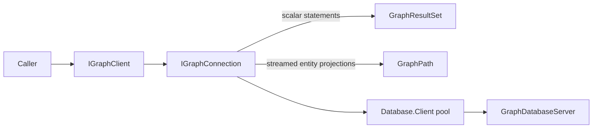

# Graph client

`Assimalign.Cohesion.Database.Graph.Client` is the pooled, transport-independent client for
`GraphDatabaseServer`. It ships as a NuGet package outside the App.Database shared framework.
Create an `IGraphClient` through `GraphClient.Create`, supplying `GraphClientOptions` with shared
database settings and a Connections transport factory.

`QueryAsync` returns scalar MATCH projections and the existing SHOW catalog rows as
`GraphResultSet`, with column metadata and rows accessible by ordinal or name.
`ExecuteAsync` sends CREATE, INSERT, DELETE, and DETACH DELETE to the engine and returns its
affected count. The server retains engine ownership, cycle, and database-scoping enforcement.

`QueryPathsAsync` returns real engine paths for a single bound projection:
`MATCH p = (a)-[r:KNOWS]->(b) RETURN p`, `MATCH (a) RETURN a`, or
`MATCH (a)-[r]->(b) RETURN r`. Paths retain ids, labels, relationship types, direction, and
properties. Enumerate to completion to verify the terminal count; abandoning an unfinished
enumeration discards its connection.

Dispose each connection to return a healthy authenticated session to the pool, and dispose the
client to close the pool. Scalar parse/execution failures retain the session; path-stream
failures discard it under the shared streaming contract. Explicit transactions are not exposed:
BEGIN/COMMIT/ROLLBACK and the reserved Transaction message are unsupported.

Parameters are encoded using the shared scalar codec, but parameter syntax remains subject to
the server's advertised GQL subset. The client never parses GQL or retries statements.
See [design](DESIGN.md) for completion and lifetime behavior.

