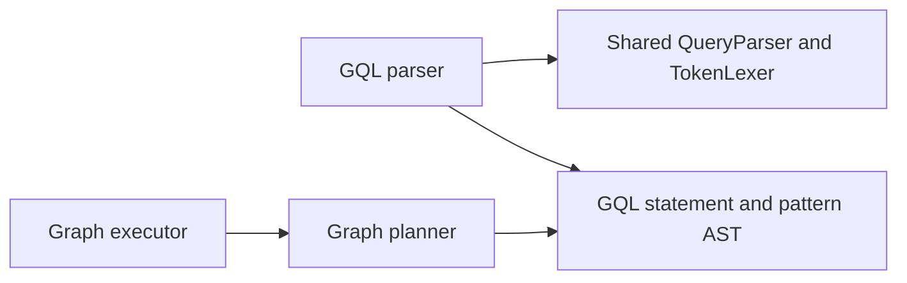

# Assimalign.Cohesion.Database.Graph.Language — Design

## Standard decision (#193)

The owner selected **ISO/IEC 39075:2024 GQL** on **2026-09-17**, following
`DATABASE_PROGRAM_PLAN.md`. ISO GQL provides a ratified, independently governed standard and a
portability target for the graph engine; openCypher's vendor-centered governance was the rejected
alternative. This records the owner decision independently of the feature list and chat transcript.
The GitHub issue may still require an administrative close; this implementation does not post to it.

[ISO's publication record](https://www.iso.org/standard/76120.html) identifies the first edition as
published in April 2024 and describes its property-graph data structures and operations. The
[standard editors' status page](https://www.gqlstandards.org/) records publication and the standards
committee process. These are the standard-selection references, not a claim that this MVP implements
every mandatory ISO feature.

The implemented syntax is an explicitly bounded subset. **`INSERT` is the standard graph-insertion
verb. `CREATE (pattern)` is a Cohesion compatibility extension**, retained for the phase-5 examples.
Both compile to the same `Creates` AST. Database-scoped catalog `SHOW` statements are another
explicit Cohesion extension. Repeated colon labels and `!=` are accepted conveniences: `:A:B`
builds the same tree as ISO `:A&B`. The convenience repeats plain names only, so mixing repeated
colons with label-expression operators or a wildcard (`:A:B|C`, `:A|B:C`, `:%:A`, `:A:%`) is
`GQL0002`. Applications seeking portable syntax should write `:A&B` and
`<>`. Database, graph, schema, and session selection statements are outside the profile: all
evaluation stays inside the already-bound logical database.

## Parser and expression tree

`GqlQueryParser` derives from the shared `QueryParser`, and its `Profile` is
`GqlLanguageProfile.Instance`. The shared `TokenLexer` supplies graph arrows and punctuation. The
parser constructs immutable lists/maps in the AST and returns diagnostics on `GqlQueryStatement`.
Its partial files separate the statement, pattern, and scalar-expression grammars. Instances
serialize concurrent calls and clear their transient state between statements. Shared analyzers run
through the existing base-class pipeline.

The parser depends on shared language contracts; the graph planner depends on the resulting AST,
and the graph executor depends on the planner's plan. This dependency view summarizes that flow.



`GqlQueryExpression` carries match paths, an optional predicate, insertion paths, deletion variables,
a detach flag, projections, and an optional `GqlCatalogSurface` for dedicated metadata statements.
Catalog statements cannot carry graph clauses. `GqlPathPattern.Variable` optionally names a MATCH
path; it is null for anonymous paths and insertion paths. Every path holds one more node than relationship. Anonymous nodes
and relationships have a null variable. Relationship directions are relative to consecutive pattern
nodes; incoming arrows reverse that relationship's endpoints. A scalar property reference always
contains a variable and exactly one property key; qualified database names have no AST representation.

A node or relationship pattern's label specification (`:` or `IS`, then a label expression) is the
init-only `LabelExpression`, a `GqlLabelExpression` tree of five sealed records: `GqlLabelName`,
`GqlLabelWildcard` (`%`), `GqlLabelNegation` (`!`), `GqlLabelConjunction` (`&`) and
`GqlLabelDisjunction` (`|`). The conjunction and disjunction are n-ary: each holds an `Operands` list
of any length, so `A|B|C` and `:A:B:C` are one node each (see "Chain length and nesting" below).
Parentheses group without a node. `Labels` and `Type` are filled only
for a pure conjunction or a single type, so a hand-built AST that sets only those keeps its meaning;
when both are set, the planner requires `Labels` to name exactly the conjunction and `Type` to equal
the single name (`COHDBG001` otherwise). `GqlPatternDirection.LeftOrRight` is the ISO left-or-right
direction. A `WHERE` labeled predicate is `GqlLabeledPredicate` (variable, expression, `IsNegated`),
a Boolean primary beside the comparisons. A `WHERE` conjunction is one n-ary `GqlLogicalExpression`
(`Operator` `GqlLogicalOperator.And`, `Operands`); `GqlBinaryExpression` holds one comparison, and the
planner rejects a binary node whose operator is `AND` (`COHDBG001`).

The label records compare structurally: two trees are equal when they have the same kinds in the
same shape, names equal ordinally and chains with the same operands in the same order, and
`GetHashCode` agrees. `ToString`, equality and hashing walk the tree with an explicit stack, so they
hold for a hand-built tree of any depth. The public chain constructors copy their operand sequence;
only the parser hands a list it built to a node without copying it.

## Supported-clause matrix

Only these clauses occur in `GqlLanguageProfile.Clauses`. The larger reserved keyword table is
retained for tokenization and targeted unsupported diagnostics; it does not advertise capabilities.
The builtin-function table is empty because the executor implements no functions.

| Clause | Accepted subset | Execution |
| --- | --- | --- |
| `MATCH` | Comma-separated finite node/relationship chains; optional `variable =` path assignment, label expressions, literal property maps; every ISO full and abbreviated edge except the tilde forms | Planner chooses an indexed anchor when available; executor matches bounded relationship-unique trails and binds named paths in traversal order |
| `WHERE` | Scalar `=`, `<>`, `!=`, `<`, `<=`, `>`, `>=` comparisons and labeled predicates (`n IS [NOT] LABELED A`, `n:A`) joined by `AND`, one n-ary chain of any length; predicate parentheses of any depth the stack allows | Filters bound properties against literal or property operands, and bound elements by label expression |
| `RETURN` | Bound node/relationship/path variables or scalar properties, optional `AS` aliases | Projects elements or scalar values in source order; the engine path-request API requires exactly one bound entity or path projection |
| `INSERT` | Literal node/path insertion, optionally following a match; a node takes a label conjunction (`:A&B`, `:A:B`), a relationship one type and a directed edge (`-[:T]->`, `<-[:T]-`) | Inserts nodes and relationships transactionally |
| `CREATE` | Same insertion grammar as `INSERT`; compatibility extension | Same transactional insertion path |
| `DELETE` | Bound node/relationship variables following a match | Refuses deleting a node that still has incident relationships |
| `DETACH DELETE` | Bound node/relationship variables following a match | Deletes incident relationships with the node in one transaction |
| `SHOW` | `LABELS`, `RELATIONSHIP TYPES`, `PROPERTY KEYS`, `INDEXES`, or `OBJECT OWNERSHIP`; Cohesion extension | Returns typed, read-only metadata from the session database's catalog snapshot |
| `LABEL EXPRESSION` | ISO/IEC 39075 16.8 `\|`, `&`, `!`, `%` and parentheses after `:` or `IS` in a node or edge pattern; the labeled predicate in `WHERE` (#1139); chains of any length and nesting the stack allows | A node is tested against its label set, a relationship against its one type; a disjunction, negation, wildcard or labeled predicate never supplies the index anchor |

Match patterns accept `(a)`, `(a:Label {key: value})`, `(a IS A|B)`, `(a:(A|B)&!C)`, `(a:%)`, and
every ISO directed edge in full and abbreviated form: `-[r:TYPE]->` or `->`, `<-[r:TYPE]-` or `<-`,
`-[r:TYPE]-` or `-` (any direction), and `<-[r:TYPE]->` or `<->` (left or right), including anonymous
bracketed relationships and edge label expressions such as `-[r:T|U]->`. The lexer reads `<->` as
`<-` then `>`, and the parser joins the two only when they touch, so `(a)<- >(b)` and `(a)- >(b)` are
`GQL0002`. An abbreviated edge carries no variable, label expression or property map (`-r->`,
`-:T->`, `-IS T->`, `-{k: 1}->` are `GQL0002`; the capability scan reads the names after such a
`:` or `IS` as labels, so neither `IS` nor a keyword-spelled label reports `COHDBL001` there). Scalar literals are null, Boolean, signed 64-bit integer,
finite double, and single-quoted string with doubled-quote escaping. Names are case-sensitive;
keywords are case-insensitive, and a label name may spell a keyword (`(n:Order)`, `n:A|Order`).
Double-quoted names preserve spaces. A single optional trailing semicolon is accepted. Multiple
statements, the tilde (undirected) edges, Cypher arrows, nested property access, and
return-after-delete are not accepted.

The grammar is intentionally finite:

```text
query        := [ MATCH match-paths [ WHERE predicate ] ]
                ( (INSERT | CREATE) paths [ RETURN projections ]
                | [ DETACH ] DELETE variables
                | RETURN projections )
match-paths  := match-path (',' match-path)*
match-path   := [ variable '=' ] path
paths        := path (',' path)*
path         := node (edge node)*
node         := '(' [ variable ] [ label-spec ] [ properties ] ')'
edge         := '-[' filler ']->' | '<-[' filler ']-' | '-[' filler ']-' | '<-[' filler ']->'
              | '->' | '<-' | '-' | '<->'
filler       := [ variable ] [ label-spec ] [ properties ]
label-spec   := (':' | IS) label-expr | ':' label ( ':' label )+
label-expr   := label-term ('|' label-term)*
label-term   := label-factor ('&' label-factor)*
label-factor := '!' label-primary | label-primary
label-primary:= label | '%' | '(' label-expr ')'
predicate    := comparison ('AND' comparison)*
comparison   := operand comparison-operator operand | labeled | '(' predicate ')'
labeled      := variable (IS [NOT] LABELED | ':') label-expr
operand      := variable '.' property | scalar-literal
projection   := variable ['.' property] [AS alias]
catalog      := SHOW (LABELS | RELATIONSHIP TYPES | PROPERTY KEYS | INDEXES | OBJECT OWNERSHIP)
```

The repeated-colon form of `label-spec` applies to node patterns only; a relationship has one type.
`LABELED` is positional, like the path mode words: only after `IS` or `IS NOT` in a predicate does
it introduce a label expression, so it remains usable as a name. `!` negates one primary, as ISO
writes it, so `!!A` is `GQL0002` and `!(!A)` parses. Each `(...)*` repetition in `label-spec`,
`label-expr`, `label-term` and `predicate` builds one n-ary node; parentheses are the only recursion.

A mutation can start without `MATCH`; a read or deletion must bind variables through `MATCH`.
Named assignment is a MATCH-only construct: `INSERT p = (...)` and `CREATE p = (...)` are
unsupported. `MATCH p = (a)-[r:TYPE]->(b) RETURN p` captures the entire matched trail, including
the order of nodes and relationships when an indexed anchor starts in the middle or a relationship
is traversed in reverse. A path variable cannot be deleted or used as a scalar property owner;
the planner rejects `DELETE p` and `RETURN p.name` rather than treating a path as an entity.
A named path cannot rebind an existing variable, including a node or relationship binding.
Pattern chains are limited to 64 relationships (`GQL0005`). Label expressions and predicates have no
length or nesting limit: a chain of one operator is one n-ary node of any length, and only the stack
bounds parentheses and negations, as in Neo4j (see "Chain length and nesting" below). Match execution
also imposes a materialized-binding limit, documented in the Graph engine design. Quantified paths
are unsupported, so cycles cannot cause unbounded repetition of a path pattern. The executor's
trail rule permits repeated nodes but forbids repeated relationship identities within one path.

### Dedicated catalog statement choice (C2)

The separate `SHOW` grammar exposes metadata through the query language without constructing fake
nodes or relationships for `MATCH`. Catalog definitions have stable catalog identities but are not
graph elements. The extension adds no server scope or database selector and changes no public
interface. Keywords are case-insensitive and comments and one optional trailing semicolon follow
the ordinary lexer rules. A statement cannot combine `SHOW` with graph matching, projection or
mutation. Attempted mutation composition produces `GQL0007`, including verbs such as `SET` and
`DROP` that are otherwise unsupported. The engine validates direct AST requests too.

The [engine's catalog section](../../Assimalign.Cohesion.Database.Graph/docs/DESIGN.md#catalog-introspection-c2)
defines ordered result columns, SQL-consistent ownership vocabulary and session snapshot behavior.
The parser describes only the metadata subject; it never accesses or caches catalog state.

## Diagnostics and conformance (#194, #195)

| Code | Meaning |
| --- | --- |
| `COHDBL001` | Recognized construct outside the executable profile, reported once at its own span: optional matching, procedures, functions, parameters, collection literals, quantifiers, ordering, set operations, server/session scope, undirected (tilde) edges, path mode and path search prefixes, `NODETACH DELETE`, and `MERGE` |
| `GQL0001` | Empty statement |
| `GQL0002` | Malformed supported syntax, invalid statement composition, leftover tokens, or a character GQL does not use (`?`, `#`, `^`, `§`, ...) |
| `GQL0003` | Unterminated string, quoted name, or block comment |
| `GQL0004` | Invalid or out-of-range numeric literal |
| `GQL0005` | Pattern length limit exceeded: a path pattern holds at most 64 relationships. Label expressions and predicates have no length or nesting limit (#1139 follow-up) |
| `GQL0006` | Duplicate literal property key |
| `GQL0007` | `Graph catalog introspection is read-only.`: mutation composed with `SHOW` |
| `GQL0008` | A `--` comment begins exactly where a node pattern's `)` or an edge pattern's `]` ends, in `MATCH`, `INSERT` or `CREATE`: a Cypher arrow (`-->`, `--`) that would hide the rest of the line. Reported at the `--`; the message names `->`, `<-` and `-` |
| `GQL0009` | The statement nests parentheses (in a label expression or a predicate) deeper than the parsing thread's stack can follow. Reported at the `(` that could not be entered; the parse stops there and reports nothing else. The same text parses on a thread with more stack, so the engine's `GraphQueryRequest.FromGql` reports it as `COHDBG007`, statement too complex, not as a parse error |

Locations use zero-based absolute UTF-16 offsets with exclusive ends and one-based line numbers.
A line breaks at LF, CR, NEL (U+0085), LS (U+2028) or PS (U+2029), and CR LF is one break
(`TokenLexer.CountLineBreaks`), so lines break exactly where a `--` comment ends.
Capability checks run before syntax parsing, so a recognized unsupported clause does not degrade
into a generic error caused by its downstream syntax. Quoted text, comments, label names, and
property keys do not trigger keyword-based capability checks. Binding and catalog diagnostics belong
to the Graph planner, which knows the database schema.

### Keyword disposition (#1101)

The capability scan reads one static recognized-unsupported table, `GqlUnsupportedVocabulary`.
Each entry has a spelling, the construct its `COHDBL001` names, and a position. Each construct is
reported once, at its own span:

| Written | Construct named | Span | Who lifts it |
| --- | --- | --- | --- |
| `(a)~[r]~(b)`, `<~[r]~`, `~[r]~>`, `(a)~(b)`, `<~`, `~>` | `UNDIRECTED EDGE` | the whole edge, from `~` or `<~` through its closing `~` or `~>` | pin until the engine stores undirected edges |
| `MATCH TRAIL (a)-[]->(b)`, `MATCH p = ACYCLIC (...)`, `WALK`, `SIMPLE` | `<MODE> PATH MODE` | the mode word, plus `PATH`/`PATHS` | pin |
| `MATCH ALL SHORTEST (...)`, `MATCH ANY SHORTEST (...)` | `ALL SHORTEST`, `ANY SHORTEST` | the prefix, plus its path mode and `PATH`/`PATHS` | pin |
| `MATCH SHORTEST 2 (...)`, `SHORTEST 2 GROUPS` | `SHORTEST PATH` | the prefix, plus its count, path mode and `PATH`/`PATHS` or `GROUP`/`GROUPS` | pin |
| `MATCH ALL (...)`, `MATCH ALL TRAIL (...)`, `MATCH ANY 2 (...)` | `ALL PATH SEARCH`, `ANY PATH SEARCH` | the prefix, plus its count, path mode and `PATH`/`PATHS` | pin |
| `MATCH (n) NODETACH DELETE n` | `NODETACH DELETE` | both words | pin |
| `MERGE (n)` | `MERGE` | `MERGE` | pin |

#1101 pinned the label-expression operators (`LABEL DISJUNCTION`, `LABEL CONJUNCTION`,
`LABEL NEGATION`, `WILDCARD LABEL`) and `(n IS A)` (`IS LABEL EXPRESSION`) here; #1139 made them
executable, removed them from the table and flipped their corpus cases to supported parses. A
`[:A|:B]` relationship alternative, which the old pin also covered, is `GQL0002` now: ISO writes
`[:A|B]`. A path mode word
was read as a path variable, so `MATCH TRAIL (...)` failed with "Expected '='". `ALL SHORTEST`
reported two diagnostics, `ALL` and `SHORTEST PATH`, and a path mode after a path search prefix
(`ALL TRAIL`, `ANY SHORTEST TRAIL`) was a second construct; ISO/IEC 39075 makes the whole
`<path search prefix>` one. `NODETACH` failed with
"MATCH requires RETURN, INSERT, CREATE, or DELETE.". `STARTS WITH` and `ENDS WITH` are one
construct each, and a procedure's `YIELD` belongs to its `CALL`. A statement whose first word is
unsupported, such as `SESSION SET GRAPH g` or `DROP GRAPH g`, is one construct: the scan
reports that word and nothing after it.

Path mode words and `NODETACH` are positional, not lexer keywords. Before a path pattern, or
before `DELETE`, they name the construct. Elsewhere they are names, so `MATCH trail = (a)-[]->(b)`
and `MATCH (nodetach) DELETE nodetach` still parse.
`GqlKeywordDispositionTests` enumerates the profile's keywords, the table, and the executable
label-expression spellings `GqlLabelVocabulary` lists (`|`, `&`, `!`, `%` and the positional
`LABELED`). Every word needs a supported parse case or a case with exactly one `COHDBL001` naming its
construct, and for a table entry that diagnostic must also name the construct the table records. A
word added without a case fails. `~` is a table entry (`UNDIRECTED EDGE`); `--` after a pattern
element is `GQL0008`, which "Label expressions and edge directions" below describes.

A character GQL does not use lexes as `TokenType.Unrecognized`. It reports
`Unexpected character '<c>'; it is not part of GQL.` (`GQL0002`) at its span during
tokenization, and the statement is not parsed, so nothing is bound. Every statement form
(`MATCH ... RETURN`, `INSERT`, `CREATE`, `DELETE`, `DETACH DELETE`, `SHOW`) rejects leftover
tokens with `GQL0002`, with or without a separating `;`, and `GqlParseStrictnessTests` pins each.

`GqlQueryParserTests` is the executable-subset conformance corpus, with valid and malformed cases
and assertions on the AST, not a full ISO certification suite. Its groups map to ISO GQL graph
pattern matching (4.11 / 16.4 / 16.7), insertion (13.2), deletion (13.5), matching (14.4), return
(14.11), comparisons (19.3), and property references (20.11). Label expressions (16.8) and the
labeled predicate have their own corpus, `GqlLabelExpressionParserTests`, and the 16.7 edge forms
`GqlEdgeDirectionParserTests`. The ISO section mapping is independently
cross-checkable in an implementer's [published GQL feature table](https://neo4j.com/docs/cypher-manual/25/appendix/gql-conformance/supported-mandatory/).
Compatibility-extension cases are named by their `CREATE` spelling. Separate tests pin the exact
profile, reject unsupported and cross-database constructs, preserve source locations, and bound
adversarial nesting and long patterns.

### Comment boundary (#1150)

A `--` comment ends before the first line terminator: LF, CR, NEL (U+0085), LS (U+2028) or PS
(U+2029), with CR LF read as one break, the rule `Database.Language/docs/DESIGN.md` records for
every language. ISO/IEC 39075's `<simple comment>` ends at CR or LF. The shared lexer used to end it
only at LF, so in `MATCH (a:Person) -- note<CR>WHERE a.name = 'x'<LF>DETACH DELETE a` the `WHERE`
was comment text and every Person was deleted. (With `DETACH DELETE` on the CR line as well, the
comment swallowed it too and the statement failed with `GQL0002`.) The `WHERE` now stays in effect
at every terminator. `GqlLineCommentTests` pins both delete forms, the clause after a spaced
comment (`MATCH (a) -- c<CR>RETURN a`, the ISO case #1139 keeps), and diagnostic lines at each
terminator.

The rule moves only where a comment ends. `GQL0008` (#1139) keys on where a `--` comment starts,
so it holds whichever terminator ends the comment. Between #1150 and #1139, `(a)-->(b)` followed
by any line terminator read as `(a)` plus a comment, so
`MATCH (a:Person)-->(b:Person)<CR>DETACH DELETE a` ran as `MATCH (a:Person) DETACH DELETE a` and
deleted every Person. It is now `GQL0008` at every terminator, and `GqlCypherArrowTests` and the
engine's `GqlLabelDirectionExecutionTests` pin it at each one.

ISO also spells a simple comment `//`. The shared lexer has no `//` comment, so
`MATCH (a) // note` reports `GQL0002` at the first `/`. An item that adds the `//` form adds a
per-language lexer switch and ends the comment at the same terminators.

## Label expressions and edge directions (#1139)

The profile advertises `LABEL EXPRESSION`: ISO/IEC 39075 16.8 label expressions in node and edge
patterns, G074's wildcard `%`, and the `<labeled predicate>` in `WHERE`. The parser binds `!`
tighter than `&` and `&` tighter than `|`; a run of one operator is one n-ary node. The
engine evaluates a node's expression against its label set and a relationship's against its one
type, with a typed switch over the five records and no reflection or text matching:

| Expression | A node matches when | A relationship matches when |
| --- | --- | --- |
| `A` | it carries `A` | its type is `A` |
| `%` | it carries at least one label | always: every stored relationship has a type |
| `!e` | it does not match `e`, so `!%` selects unlabeled nodes | it does not match `e`, so `!%` selects none |
| `e & f` | it matches both | it matches both, so `T&U` selects none |
| `e \| f` | it matches either | it matches either |

Every name in a `MATCH` expression must be a catalog label or relationship type, including names
under `!` and `|` (`COHDBG002`), because labels are persistent catalog definitions. An `INSERT`
node takes a pure conjunction (`:A`, `:A&B`, `:A:B`) and may introduce new labels; `|`, `!` and
`%` select nodes and cannot label a new one, so they are `COHDBG001`. An inserted relationship
needs one type. A labeled predicate (`n IS LABELED A|B`, `n IS NOT LABELED A`, `n:A|B`) resolves
its names against the catalog of the variable's kind, a path variable is `COHDBG003`, and an
unbound one `COHDBG001`; when gql-optional-match lands, a variable without a binding yields
UNKNOWN. Whichever of this item and gql-where-expr lands second adds the `NOT`/`OR` combinations
with labeled predicates. A `:` directly after an element variable in a predicate is the labeled
predicate; an operand that begins with `:` keeps shared-parameters' coded `:name` rejection, and
whichever of the two lands second adds the other's case.

**Index anchors.** The planner anchors only on `Labels`, which the parser fills only for a pure
conjunction: every match must carry each listed label, so anchoring on any one of them drops no
row. A disjunction, negation or wildcard leaves `Labels` empty, and a labeled predicate is never an
equality, so neither feeds an anchor: `(n:A|B {k: 1})`, `(n:!A {k: 1})` and
`MATCH (n) WHERE n:A AND n.k = 1` scan, and the executor tests each candidate. `(n:A&B {k: 1})`
anchors on an index of `A` or `B`.

**Directions.** Storage holds only directed relationships, so the ISO forms map as follows:

| Written | `GqlPatternDirection` | Matches | Inserts |
| --- | --- | --- | --- |
| `-[]->`, `->` | `Outgoing` | the stored edge from the preceding node | yes, with one type |
| `<-[]-`, `<-` | `Incoming` | the stored edge into the preceding node | yes, with one type |
| `-[]-`, `-` | `Undirected` (any direction) | either orientation | `COHDBG001` |
| `<-[]->`, `<->` | `LeftOrRight` | either orientation, exactly as `Undirected` | `COHDBG001` |
| `~[]~`, `<~[]~`, `~[]~>`, `~`, `<~`, `~>` | none | `COHDBL001` `UNDIRECTED EDGE` | `COHDBL001` |

One stored `A`-to-`B` edge therefore yields the rows `(A,B)` and `(B,A)` for `-[r]-`, `-`, `<-[r]->`
and `<->`, and a self-loop yields one row. The tilde forms are rejected rather than matched: `~[]~`
and `~` would match nothing, and `<~[]~` and `~[]~>` would silently equal their directed forms. The
rejection applies only in pattern position, directly after a node's `)`; a `~` elsewhere is a
character GQL does not use (`GQL0002`). Insertion rejects both either-direction forms, because
the executor would otherwise have to pick an orientation.

**Cypher arrows (D3).** ISO/IEC 39075 defines `--` as a `<simple comment>`, and the shared lexer
reads it that way in every language, so no lexer file changes and SQL and OQL comments cannot
regress. The parser records where each `--` comment starts and, where a node pattern consumes its
`)` or an edge pattern its `]`, reports `GQL0008` at the `--` when a comment starts at exactly that
offset. That turns the silent truncation `MATCH (b:Person)-->(a)<LF>RETURN b` →
`MATCH (b:Person) RETURN b` into an error at every line terminator. Comments elsewhere keep their
ISO meaning: `(a) -- note`, a comment on its own line, and `WHERE (a.age > 1)-- note`, whose `)`
closes a predicate. Under D3 these Cypher spellings have no 1:1 ISO counterpart and are not
accepted:

| Cypher | Read by GQL as | Result | ISO spelling |
| --- | --- | --- | --- |
| `(a)-->(b)` | `(a)` then a comment | `GQL0008` | `(a)->(b)` |
| `(a)--(b)` | `(a)` then a comment | `GQL0008` | `(a)-(b)` |
| `(a)-[r]-->(b)`, `(a)-[r]--(b)` | `-[r]` then a comment | `GQL0008` | `-[r]->`, `-[r]-` |
| `(a)<--(b)` | `<-` then `-` | `GQL0002` | `(a)<-(b)` |
| `(a)<-->(b)` | `<-` then `->` | `GQL0002` | `(a)<->(b)` or `(a)-(b)` |

The residual is recorded rather than guessed at: whitespace or a block comment between the element
and the dashes, as in `(a) -->(b)` or `(a)/* c */-->(b)`, leaves an ISO comment, so the rest of
that line is still comment text. `GqlCypherArrowTests` pins that residual so a change to it is
deliberate.

## Chain length and nesting (#1139 follow-up)

#1139 shipped binary `GqlLabelConjunction`/`GqlLabelDisjunction` records, and `WHERE` joined
predicates in a left-deep binary `GqlBinaryExpression` `AND` tree. Every walker recursed once per
operator, so the parser capped label trees, label parentheses, predicate parentheses and comparisons
at 128 each (`GQL0005`) and the planner capped hand-built trees (`COHDBG001`). One chain therefore
held at most 128 labels or 128 comparisons, while the repeated-colon list had been unbounded before
#1139. The owner decision of 2026-10-02 was "do what Neo4j does". Neo4j has no such limit (paths are
in the Neo4j repository):

- Its label expression AST has n-ary `Conjunctions(children)` and `Disjunctions(children)` with
  `flat`, which unnests a same-operator child, beside the binary `ColonConjunction` and `Negation`
  (`community/cypher/front-end/expressions/src/main/scala/org/neo4j/cypher/internal/label_expressions/LabelExpression.scala:238-302,309-317,331`).
  `replaceColonSyntax` rewrites `:A:B` into `Conjunctions.flat` (`:202-208`).
- The Cypher 25 AST builder folds each run with `flat`: `A|B|C` in `exitLabelExpression4`, and
  `A&B&C` and `:A:B` in `exitLabelExpression3`
  (`community/cypher/front-end/parser/v25/ast-factory/src/main/scala/org/neo4j/cypher/internal/parser/v25/ast/factory/LabelExpressionBuilder.scala:144-189`).
  The grammar counts nothing (`community/cypher/front-end/parser/v25/parser/src/main/antlr4/org/neo4j/cypher/internal/parser/v25/Cypher25Parser.g4:515-532`).
- `WHERE` conjunctions become the n-ary `Ands` (`flattenBooleanOperators.scala:35-50` under
  `community/cypher/front-end/frontend/src/main/scala/org/neo4j/cypher/internal/frontend/phases/rewriting/cnf/`).
- Nesting is bounded only by the JVM stack. The parser has no depth check; a `StackOverflowError`
  reaches Bolt, which reports the non-fatal transient `Neo.TransientError.General.StackOverFlowError`
  (GQLSTATUS 51N37) and keeps the connection
  (`community/bolt/src/main/java/org/neo4j/bolt/protocol/common/message/Error.java:188-249`,
  `community/bolt/src/main/java/org/neo4j/bolt/fsm/StateMachineImpl.java:156-163`,
  `community/common/src/main/java/org/neo4j/kernel/api/exceptions/Status.java:667-674`).
- Storage does not cap labels per node: they sit in the node record while they fit 36 bits and spill
  to a chain of dynamic label records otherwise
  (`community/record-storage-engine/src/main/java/org/neo4j/kernel/impl/store/InlineNodeLabels.java:42,115-122`,
  `DynamicNodeLabels.java:105-229`).

Cohesion now does the same:

| | Before | Now |
| --- | --- | --- |
| `:A:B:...`, `A&B&...`, `A\|B\|...` | at most 128 names (`GQL0005`) | one n-ary node of any length |
| `p AND q AND ...` in `WHERE` | at most 128 comparisons and labeled predicates (`GQL0005`) | one `GqlLogicalExpression` of any length |
| Label parentheses and negations | at most 128 levels (`GQL0005`) | as deep as the parsing thread's stack allows; deeper is `GQL0009` |
| Predicate parentheses | at most 128 levels (`GQL0005`) | as above |
| Hand-built tree depth | at most 128 label levels or 256 predicate levels (`COHDBG001`) | no limit; a walk out of stack is `COHDBG007` |

- **Flattening.** The parser builds each run of `|`, `&`, repeated `:` or `AND` in one list, so a chain
  costs time linear in its length. A parenthesized chain of the same operator that opens a run
  merges into it by handing over its list: `(A|B)|C` is the same node as `A|B|C`, as left
  associativity read it before. A group in a later position stays nested, `A|(B|C)`. Neo4j's `flat`
  also merges that one, but its builder re-flattens the growing vector at every operator, which is
  quadratic in a plain chain's length, and merging a later group would cost a copy of its operands
  per enclosing group; the meaning is identical because `&`, `|` and `AND` are associative. Flattening
  never crosses a precedence level: `A|B&C` is `Or(A, And(B, C))` and `!A&B` is `And(Not(A), B)`.
- **Nesting.** The grammar recurses only through parentheses. Before each descent the parser calls
  `RuntimeHelpers.TryEnsureSufficientExecutionStack`; on a thread out of stack it reports `GQL0009` at
  that `(` and stops, instead of overflowing. Every recursive engine walk (label evaluation and
  predicate evaluation) calls `RuntimeHelpers.EnsureSufficientExecutionStack`, and the engine reports
  the exhausted stack as `COHDBG007`. The walks that need no recursion do not recurse: shape
  validation, name collection, anchor equalities, `ToString`, structural equality and hashing use an
  explicit stack. This is .NET's form of Neo4j's backstop: .NET cannot catch a stack overflow, so the
  check runs before the descent instead of after the overflow.
- **Hand-built trees.** The planner validates shape, not depth: an undefined operator, a null operand
  or operand list, or a chain with fewer than two operands is `COHDBG001`.
- **Insertion.** An inserted node takes a conjunction of any length and receives each label once, in
  first-mention order (`:A&A` labels it `A`). Unlike Neo4j's spill to dynamic label records, a node's
  labels and properties share one graph record of at most 8,092 bytes, so the number of distinct
  labels one node can carry is bounded by their encoded size, not by the language; an insertion past
  it fails with the engine's `COHDBG008`, element too large, and the session stays open (Graph engine
  design, "Planning, execution and bounds").

`GqlLabelChainParserTests` pins 10,000-name chains of every operator in every position, the merge
rule, precedence after flattening, the renderer round trip, 10,000 nested groups on a large stack and
`GQL0009` on a small one. The engine's `GqlLabelChainExecutionTests` and Graph.Client's
`GraphLabelChainWireTests` pin execution, insertion, `COHDBG007` and `COHDBG008` in process and over
the wire.

## AOT posture and extension discipline

The package references only `Database.Language`. It uses ordinary typed AST classes and records
and BCL scalar values with no reflection, Regex, runtime discovery, or `Microsoft.Extensions.*`
dependencies; `GqlLabelExpression.ToString` renders GQL text with a type switch. Adding a
clause requires the parser, planner, executor, conformance cases, and this matrix in the same change;
keyword recognition alone never enables it.
