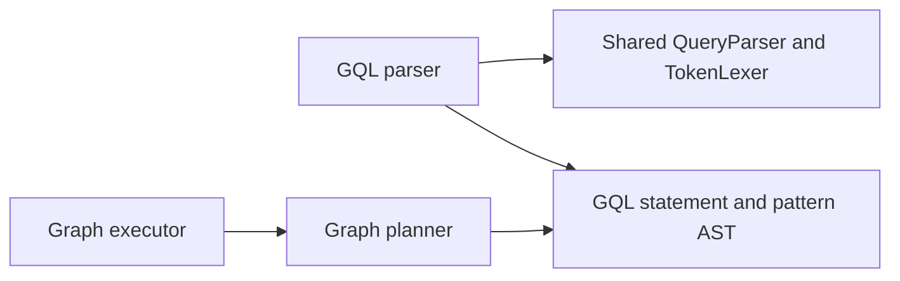

# Assimalign.Cohesion.Database.Graph.Language — Design

## Named scalar parameters (#1102, #1138)

The [shared parameter contract](../../Assimalign.Cohesion.Database.Language/docs/DESIGN.md#parameter-contract-1102)
governs `$name` and `@name`: strip one sigil from references and map keys, then match bare names
ordinally and case-sensitively, independently of the caller's dictionary comparer. `$1` binds
the exact key `"1"`; GQL has no positional binding. `$name` is the ISO and Cypher spelling;
`@name` is a Cohesion cross-language spelling, neither ISO nor Cypher. Numeric names contain
ASCII digits only. Bare `$`/`@`, numeric-name junk, and parameters in name or DELETE positions
are GQL0002. Operand `?` and `:name` retain #1102's supported-form message and complete span.
References are validated before projection or whole-map capability checks: a bare sigil in
`RETURN $`, `RETURN @`, `(n $)` or an edge filler is GQL0002 at that sigil. Valid references
in those unsupported positions retain their named COHDBL001 capability diagnostic.

`GqlParameterExpression` exposes the bare `Name` and complete reference `Location`.
**Breaking AST change:** `GqlNodePattern.Properties` and `GqlRelationshipPattern.Properties`
are now `IReadOnlyDictionary<string, GqlExpression>`. Each map entry is a scalar value expression; hand-built ASTs must wrap literals.
WHERE accepts parameters wherever it accepts scalar operands, including IN list items.

Planning snapshots and normalizes the supplied map, rejects duplicate normalized keys with
COHDBG014 even if unused, and validates every referenced value before reading data or taking
the writer lock. Missing bindings use COHDBG001, including under EXPLAIN and in skipped Boolean
branches or empty matches. Supplied null is bound; unused entries need no value conversion.
Values retain their CLR runtime scalar type and use `GraphDatabase.TypeOf` promotion for
schema matching, as the typed API does: Int32 remains Int32 on read-back. Decimal is supported
through parameters and compares numerically with integers. Only null, Boolean, string, integral,
Decimal and finite floating values are supported. List and map parameters are admitted in value positions by #1146 below. Unsupported or
non-finite leaf values use COHDBG003. Pattern property maps remain scalar-only. No reflection or
runtime code generation is involved.

`$$name` (ISO substituted reference) and whole-map `(n $props)` remain COHDBL001 naming the
form. `RETURN $p` is a live value expression since #1141; paging parameters execute in #1142's
shared ordering/paging stage. #1146 lifts list/map parameters in value positions; property maps remain scalar.
`GqlParameterParserTests`, `GraphParameterTests`, the clause execution corpus and client/server
wire tests pin this boundary. Parameters add no profile clause.

Local Neo4j reference (behavior consulted, no code copied), relative to
`C:/Source/repos/neo4j/neo4j`: `community/cypher/runtime-util/src/main/scala/org/neo4j/cypher/internal/runtime/createParameterArray.scala:29-44`
checks name presence separately from a supplied null and retains the retrieved value;
`community/cypher/interpreted-runtime/src/main/scala/org/neo4j/cypher/internal/runtime/interpreted/commands/expressions/ParameterFromSlot.scala:27-29`
reads that bound value during evaluation. Cohesion additionally requires the shared named-map
contract and validates scalars while planning.

## Standard decision (#193)

The owner selected **ISO/IEC 39075:2024 GQL** on **2026-09-17**, following
`DATABASE_PROGRAM_PLAN.md`. ISO GQL provides a ratified, independently governed standard and a
portability target for the graph engine; openCypher's vendor-centered governance was the rejected
alternative. This records the owner decision independently of the feature list and chat transcript.
The GitHub issue may still require an administrative close; this implementation does not post to it.

[ISO's publication record](https://www.iso.org/standard/76120.html) identifies the first edition as
published in April 2024 and describes its property-graph data structures and operations. The
[standard editors' status page](https://www.gqlstandards.org/) records publication and the standards
committee process. These are the standard-selection references, not a claim that this MVP implements
every mandatory ISO feature.

The implemented syntax is an explicitly bounded subset. **`INSERT` is the standard graph-insertion
verb. `CREATE (pattern)` is a Cohesion compatibility extension**, retained for the phase-5 examples.
Both compile to an insertion stage. Database-scoped catalog `SHOW` statements are another
explicit Cohesion extension. Repeated colon labels and `!=` are accepted conveniences: `:A:B`
builds the same tree as ISO `:A&B`. The convenience repeats plain names only, so mixing repeated
colons with label-expression operators or a wildcard (`:A:B|C`, `:A|B:C`, `:%:A`, `:A:%`) is
`GQL0002`. Applications seeking portable syntax should write `:A&B` and
`<>`. Database, graph, schema, and session selection statements are outside the profile: all
evaluation stays inside the already-bound logical database.

## Parser and expression tree

`GqlQueryParser` derives from the shared `QueryParser`, and its `Profile` is
`GqlLanguageProfile.Instance`. The shared `TokenLexer` supplies graph arrows and punctuation. The
parser constructs immutable lists/maps in the AST and returns diagnostics on `GqlQueryStatement`.
Its partial files separate the statement, pattern, and scalar-expression grammars. Instances
serialize concurrent calls and clear their transient state between statements. Shared analyzers run
through the existing base-class pipeline.

The parser depends on shared language contracts; the graph planner depends on the resulting AST,
and the graph executor depends on the planner's plan. This dependency view summarizes that flow.


```mermaid
flowchart LR
    Parser["GQL parser"] --> Shared["Shared QueryParser and TokenLexer"]
    Parser --> Ast["GQL statement and pattern AST"]
    Planner["Graph planner"] --> Ast
    Executor["Graph executor"] --> Planner
```

`GqlQueryExpression.Stages` carries source-ordered MATCH, LET, FILTER, FOR/UNWIND, INSERT/CREATE, DELETE, RETURN/WITH and NEXT nodes. `Segments` splits that list at explicit NEXT boundaries. The original constructors retain a single-segment facade for hand-built ASTs. Stage records retain Cypher spellings for conformance checks; the base constructor is private protected, following the Database concrete-first variant rule.

The flat single-segment facade carries ordered `GqlMatchClause(Paths, Predicate, Optional)` records, insertion paths, deletion variables,
a detach flag, expression projections, a `GqlSetQuantifier` (ALL by default), `ReturnStar`, and an optional `GqlCatalogSurface` for dedicated metadata statements.
Catalog statements cannot carry graph clauses. `GqlPathPattern.Variable` optionally names a MATCH
path; it is null for anonymous paths and insertion paths. A path without parenthesized elements holds one more node than relationship. Anonymous nodes
and relationships have a null variable. Relationship directions are relative to consecutive pattern
nodes; incoming arrows reverse that relationship's endpoints. A scalar property reference always
contains a variable and exactly one property key; qualified database names have no AST representation.

The engine reads `Stages`; `MatchClauses` remains a flattened inspection view. The original constructor constructs one mandatory clause
when paths or a predicate are supplied, and none for an empty match without a predicate. `Matches`
and `Predicate` expose the single mandatory clause only, returning empty/null for any optional or
multi-clause shape. This implements the owner's AST default for hand-built statements; malformed
clause/path lists are refused by the planner with COHDBG001.

A node or relationship pattern's label specification (`:` or `IS`, then a label expression) is the
init-only `LabelExpression`, a `GqlLabelExpression` tree of five sealed records: `GqlLabelName`,
`GqlLabelWildcard` (`%`), `GqlLabelNegation` (`!`), `GqlLabelConjunction` (`&`) and
`GqlLabelDisjunction` (`|`). The conjunction and disjunction are n-ary: each holds an `Operands` list
of any length, so `A|B|C` and `:A:B:C` are one node each (see "Chain length and nesting" below).
Parentheses group without a node. `Labels` and `Type` are filled only
for a pure conjunction or a single type, so a hand-built AST that sets only those keeps its meaning;
when both are set, the planner requires `Labels` to name exactly the conjunction and `Type` to equal
the single name (`COHDBG001` otherwise). `GqlPatternDirection.LeftOrRight` is the ISO left-or-right
direction. A `WHERE` labeled predicate is `GqlLabeledPredicate` (variable, expression, `IsNegated`),
a Boolean primary beside the comparisons. A `WHERE` conjunction is one n-ary `GqlLogicalExpression`
(`Operator` And, Or or Xor, `Operands`); `GqlBinaryExpression` holds a comparison or arithmetic/concatenation, and the
planner rejects a binary node whose operator is `AND` (`COHDBG001`).

The label records compare structurally: two trees are equal when they have the same kinds in the
same shape, names equal ordinally and chains with the same operands in the same order, and
`GetHashCode` agrees. `ToString`, equality and hashing walk the tree with an explicit stack, so they
hold for a hand-built tree of any depth. The public chain constructors copy their operand sequence;
only the parser hands a list it built to a node without copying it.

## Supported-clause matrix

### SET and REMOVE (#1149)

`GqlSetStage` and `GqlRemoveStage` carry ordered public item variants for scalar properties,
literal-map replacement/merge and node labels. `SetItems` and `RemoveItems` provide flattened
inspection facades. ISO sections 13.3 and 13.4 supply property, all-property and label items;
`+=` and multi-label colon lists are D3 spellings. The parser combines touching `+=` into one
GQL token; SQL/OQL lexer behavior is unchanged. GRAPH and SCHEMA are contextual label names.
Whole-map parameters and expressions remain COHDBL001, as do literal composite properties.
MERGE with either ON CREATE SET or ON MATCH SET produces exactly one COHDBL001 naming MERGE.
Leading SET/REMOVE and nested assignment targets are GQL0002. See [DIALECT.md](DIALECT.md#set-and-remove)
for row ordering, NULL, no-op and count semantics. `GqlUpdateParserTests` pins the AST and
diagnostics; the live profile corpus covers node properties/labels and relationship properties
for both clauses, followed by verification reads. EXPLAIN describes each update target.

Only these clauses occur in `GqlLanguageProfile.Clauses`. The larger reserved keyword table is
retained for tokenization and targeted unsupported diagnostics; it does not advertise capabilities.
The function table advertises the aggregates and core scalar functions listed below, including their accepted aliases.

| Clause | Accepted subset | Execution |
| --- | --- | --- |
| `MATCH` | Comma-separated paths with fixed/quantified edges and parenthesized segments; optional `variable =` path assignment, label expressions, scalar expression property maps; every ISO full and abbreviated edge except the tilde forms | Planner chooses an indexed anchor when available; executor matches bounded relationship-unique trails and binds named paths in traversal order |
| `OPTIONAL MATCH` | The same graph patterns and clause-local WHERE, including a leading optional or several consecutive matching clauses | Left join against each running binding; an unmatched clause preserves that row and binds its new variables to NULL |
| `QUANTIFIED PATH` | ISO edge/subpath `{m,n}`, `{m}`, `{m,}`, `{,n}`, `{,}`, `+`, `*`; Cypher bracketed `*m..n` | Enumerates distinct trails, including zero-length matches; group variables bind source-ordered lists |
| `WHERE` | Boolean and scalar expressions: comparisons, labels, AND/OR/XOR/NOT, IS null/truth tests, arithmetic, concatenation, IN lists and string predicates | Keeps TRUE only; see [DIALECT.md](DIALECT.md) and scalar expressions below |
| `EXPLAIN` | One linear statement of the supported stages | Shared description rows without executing any read expansion or write; Cohesion extension |
| `LET` | One or more `variable = expression` assignments | Adds new value bindings in assignment order; rebinding is COHDBG003 |
| `FILTER` | Predicate, optionally preceded by WHERE | Keeps TRUE only; FALSE and UNKNOWN drop the row |
| `FOR` | `FOR variable IN expression` | Expands a list; NULL yields zero rows; a non-list is COHDBG013 |
| `UNWIND` | Cypher spelling `UNWIND expression AS variable` | The same list expansion, with the scalar divergence below |
| `NEXT` | Separates linear segments after RETURN or a modifying segment | Carries projected columns, or one empty binding after a modifying segment without RETURN |
| `WITH` | Cypher projection spelling, including DISTINCT/ALL, star, GROUP BY, ordering/paging and WHERE | Projects a new scope; applies WHERE after ordering/paging |
| `RETURN` | Optional DISTINCT/ALL, either `*` or value expressions with optional `AS` aliases; also standalone | Projects expressions, expands named bindings in declaration order, then eliminates duplicate tuples for DISTINCT; path requests require one entity or path column |
| `GROUP BY` | ISO names of non-aggregated RETURN items, equivalent input expressions, or the empty grouping set `()`; omission uses the same implicit keys | Bounded hash grouping before projection, DISTINCT, ordering and paging; aggregate placement and scope are validated before execution |
| `ORDER BY` | One or more expression keys with optional ASC/ASCENDING/DESC/DESCENDING and NULLS FIRST/LAST after RETURN or WITH | Orders projected rows and paths by the total order below, after DISTINCT |
| `OFFSET` | Unsigned Int64 literal or named parameter after RETURN | Drops the first count rows after ordering |
| `SKIP` | Cypher spelling of OFFSET | The same offset stage; cannot accompany another OFFSET/SKIP |
| `LIMIT` | Unsigned Int64 literal or named parameter after RETURN | Truncates after full materialization, ordering and offset; never reduces mutations or the match cap |
| `CASE` | Simple and searched CASE, COALESCE and NULLIF case abbreviations | First matching alternative, lazy selected branch; absent ELSE yields NULL |
| `INSERT` | Scalar value-expression node/path insertion, optionally following a match; a node takes a label conjunction (`:A&B`, `:A:B`), a relationship one type and a directed edge (`-[:T]->`, `<-[:T]-`) | Inserts nodes and relationships transactionally |
| `CREATE` | Same insertion grammar as `INSERT`; compatibility extension | Same transactional insertion path |
| `SET` | ISO property assignment, literal-map replacement and node labels with IS or colon; D3 `+=` and repeated-colon labels | Applies items left to right per row, with one published replacement per updated entity per statement |
| `REMOVE` | Property keys or node labels with IS or colon | Removes keys/labels, ignoring OPTIONAL NULL targets |
| `DELETE` | Bound node/relationship variables following a match | Refuses deleting a node that still has incident relationships |
| `DETACH DELETE` | Bound node/relationship variables following a match | Deletes incident relationships with the node in one transaction |
| `SHOW` | `LABELS`, `RELATIONSHIP TYPES`, `PROPERTY KEYS`, `INDEXES`, or `OBJECT OWNERSHIP`; Cohesion extension | Returns typed, read-only metadata from the session database's catalog snapshot |
| `LABEL EXPRESSION` | ISO/IEC 39075 16.8 `\|`, `&`, `!`, `%` and parentheses after `:` or `IS` in a node or edge pattern; the labeled predicate in `WHERE` (#1139); chains of any length and nesting the stack allows | A node is tested against its label set, a relationship against its one type; a disjunction, negation, wildcard or labeled predicate never supplies the index anchor |

Match patterns accept `(a)`, `(a:Label {key: value})`, `(a IS A|B)`, `(a:(A|B)&!C)`, `(a:%)`, and
every ISO directed edge in full and abbreviated form: `-[r:TYPE]->` or `->`, `<-[r:TYPE]-` or `<-`,
`-[r:TYPE]-` or `-` (any direction), and `<-[r:TYPE]->` or `<->` (left or right), including anonymous
bracketed relationships and edge label expressions such as `-[r:T|U]->`. The lexer reads `<->` as
`<-` then `>`, and the parser joins the two only when they touch, so `(a)<- >(b)` and `(a)- >(b)` are
`GQL0002`. An abbreviated edge carries no variable, label expression or property map (`-r->`,
`-:T->`, `-IS T->`, `-{k: 1}->` are `GQL0002`; the capability scan reads the names after such a
`:` or `IS` as labels, so neither `IS` nor a keyword-spelled label reports `COHDBL001` there). Scalar literals are null, Boolean, signed 64-bit integer,
finite double, and single-quoted string with doubled-quote escaping. Names are case-sensitive;
keywords are case-insensitive, and a label name may spell a keyword (`(n:Order)`, `n:A|Order`).
Double-quoted names preserve spaces. A single optional trailing semicolon is accepted. Multiple
statements, the tilde (undirected) edges, Cypher arrows, nested property access, and
return-after-delete are not accepted.

The executable grammar is:

```text
statement    := (query | EXPLAIN query | catalog) [';']
query        := segment (NEXT segment)*
segment      := stage* [RETURN projections return-tail]
stage        := [OPTIONAL] MATCH match-paths [WHERE predicate]
              | LET variable '=' predicate (',' variable '=' predicate)*
              | FILTER [WHERE] predicate
              | FOR variable IN predicate
              | UNWIND predicate AS variable
              | (INSERT | CREATE) paths
              | SET set-item (',' set-item)*
              | REMOVE remove-item (',' remove-item)*
              | [DETACH] DELETE variables
              | WITH projections return-tail [WHERE predicate]
match-paths  := match-path (',' match-path)*
match-path   := [ variable '=' ] path
paths        := path (',' path)*
path         := path-primary ((edge [quantifier] path-primary) | parenthesized | node)*
path-primary := node | parenthesized
parenthesized:= '(' path ')' [quantifier]
quantifier   := '{' integer [',' [integer]] '}' | '{,' [integer] '}' | '+' | '*'
node         := '(' [ variable ] [ label-spec ] [ properties ] ')'
edge         := '-[' filler ']->' | '<-[' filler ']-' | '-[' filler ']-' | '<-[' filler ']->'
              | '->' | '<-' | '-' | '<->'
filler       := [ variable ] [ label-spec ] [cypher-length] [ properties ]
cypher-length:= '*' [integer] ['..' [integer]]
label-spec   := (':' | IS) label-expr | ':' label ( ':' label )+
label-expr   := label-term ('|' label-term)*
label-term   := label-factor ('&' label-factor)*
label-factor := '!' label-primary | label-primary
label-primary:= label | '%' | '(' label-expr ')'
predicate    := and-expr (('OR' | 'XOR') and-expr)*
and-expr     := not-expr ('AND' not-expr)*
not-expr     := NOT not-expr | test
test         := comparison [IS [NOT] (NULL | TRUE | FALSE | UNKNOWN)]
comparison   := concat [comparison-operator concat
                     | IN concat
                     | (STARTS WITH | ENDS WITH | CONTAINS) concat]
concat       := sum ('||' sum)*
sum          := product (('+' | '-') product)*
product      := signed (('*' | '/' | '%') signed)*
signed       := ('+' | '-') signed | operand
labeled      := variable (IS [NOT] LABELED | ':') label-expr
operand      := primary ( '[' predicate ']' | '.' field )*
primary      := variable ['.' property] | scalar-literal | parameter | labeled | '(' predicate ')'
              | aggregate '(' ([DISTINCT | ALL] predicate | '*') ')'
              | scalar-function '(' [predicate (',' predicate)*] ')'
              | CAST '(' predicate AS cast-target ')' | CURRENT_DATE | CURRENT_TIMESTAMP
              | '[' [predicate (',' predicate)*] ']'
              | '{' [field ':' predicate (',' field ':' predicate)*] '}'
              | CASE [predicate] (WHEN predicate THEN predicate)+ [ELSE predicate] END
              | COALESCE '(' predicate ',' predicate (',' predicate)* ')'
              | NULLIF '(' predicate ',' predicate ')'
parameter    := ('$' | '@') (identifier | ASCII-digits)
properties   := '{' [property ':' predicate (',' property ':' predicate)*] '}'
set-item     := variable '.' property '=' predicate | variable ('=' | '+=') properties
              | variable (IS label | ':' label (':' label)*)
remove-item  := variable '.' property | variable (IS label | ':' label (':' label)*)
projections  := [DISTINCT | ALL] ('*' | projection (',' projection)*)
projection   := predicate [AS alias]
return-tail  := [GROUP BY ('(' ')' | predicate (',' predicate)*)] [ORDER BY sort-item (',' sort-item)*] [paging]
aggregate    := COUNT | SUM | AVG | MIN | MAX | COLLECT_LIST | COLLECT
sort-item    := predicate [ASC | ASCENDING | DESC | DESCENDING] [NULLS (FIRST | LAST)]
paging       := (OFFSET | SKIP) page-value [LIMIT page-value]
              | LIMIT page-value
page-value   := unsigned-int64 | parameter
catalog      := SHOW (LABELS | RELATIONSHIP TYPES | PROPERTY KEYS | INDEXES | OBJECT OWNERSHIP)
```

The repeated-colon form of `label-spec` applies to node patterns only; a relationship has one type.
`LABELED` is positional, like the path mode words: only after `IS` or `IS NOT` in a predicate does
it introduce a label expression, so it remains usable as a name. `!` negates one primary, as ISO
writes it, so `!!A` is `GQL0002` and `!(!A)` parses. Each `(...)*` repetition in `label-spec`,
`label-expr`, `label-term` builds one n-ary label node; Boolean runs build n-ary logical nodes. Groups, signs, NOT, CASE, subscripts and collection constructors recurse with stack checks.
A truncated list, including a final [ before a trailing comment, reports GQL0002 at EOF.
The pattern-comprehension probe requires a relationship before the bar and stops at the first
item comma; label disjunctions in later list items remain ordinary values. Map key separators
do not start label scans, so unsupported map values retain their COHDBL001 diagnostics.

A linear statement may start with MATCH, OPTIONAL MATCH, INSERT/CREATE, LET, FILTER, FOR/UNWIND, WITH or RETURN. Each read segment requires RETURN; a modifying segment may omit it. RETURN is terminal within its segment, and NEXT must have a following segment. WITH requires a following stage. Deletion requires an entity binding.
Standalone RETURN evaluates against one empty binding, so `RETURN 1 + 1 AS two` returns one row.
Named assignment is a MATCH-only construct: `INSERT p = (...)` and `CREATE p = (...)` are
unsupported. `MATCH p = (a)-[r:TYPE]->(b) RETURN p` captures the entire matched trail, including
the order of nodes and relationships when an indexed anchor starts in the middle or a relationship
is traversed in reverse. A path variable cannot be deleted or used as a scalar property owner;
the planner rejects `DELETE p` and `RETURN p.name` rather than treating a path as an entity.
A named path cannot rebind an existing variable, including a node or relationship binding.
The sum of path repetition bounds is limited to 64 relationships (`GQL0005`). Label expressions and predicates have no
length or nesting limit: a chain of one operator is one n-ary node of any length, and only the stack
bounds parentheses and negations, as in Neo4j (see "Chain length and nesting" below). Match execution
also imposes a materialized-binding limit, documented in the Graph engine design. Quantified paths
enumerate bounded or unbounded repetitions with a runtime 64-hop backstop. The executor's
trail rule permits repeated nodes but forbids repeated relationship identities within one path.

### Quantified paths (#1144)

`GqlRelationshipPattern.Quantifier` and `GqlQuantifier(Min, Max)` retain inclusive bounds;
null Max means unbounded. `GqlPathPattern.Elements` holds source-ordered `GqlPathNode`,
`GqlPathRelationship` and `GqlParenthesizedPathPattern` elements. The latter carries an enclosed
path and an optional quantifier. Nodes/Relationships remain populated for a path without any
parenthesized element, and are empty for a path with one. A hand-built path may omit Elements
and use the chain lists alone; contradictory representations are COHDBG001. There is no
catalog, storage or wire format change.

| Spelling | Inclusive bounds |
| --- | --- |
| `->{m}`, `->{m,n}`, `->{m,}`, `->{,n}`, `->{,}` | m..m, m..n, m..unbounded, 0..n, 0..unbounded |
| `->+`, `->*` | 1..unbounded, 0..unbounded |
| `-[r:T*]->`, `-[*..n]->` | 1..unbounded, 1..n |
| `-[*m]->`, `-[*m..n]->`, `-[*m..]->` | m..m, m..n, m..unbounded |
| `-[*0]->`, `-[*0..n]->` | 0..0, 0..n |

The Cypher bound sits after the label expression and before the property map. ISO `{0}` and
`{0,0}` are GQL0002; the Cypher zero-length spelling `[*0]` is accepted. Reversed bounds are GQL0002, and a bound that cannot fit Int32 is GQL0004. A fixed edge contributes 1
to the path sum; a bounded segment contributes its upper bound times its body's edge count;
an unbounded segment contributes its lower bound times that count. A text sum above 64 is
GQL0005, including an unbounded lower bound above 64. Hand-built invalid bounds use COHDBG001.
At runtime an unbounded segment continues until no unused relationship qualifies; needing a
65th relationship after direction, type, bound identity and the hop's own property checks is
COHDBG004. Endpoint predicates, LIMIT and the projection cannot suppress that failure. The shared 100,000-binding and 1,000,000-candidate
budgets also apply, with no partial result output.

`(a) ((x)-[r:T]->(y)){2} (b)` joins the iterations at the same node: each y is the next x,
and both endpoint constraints hold at the junction. Every repeated property map is evaluated
for every occurrence, including deferred references to later outer bindings or comma-separated
paths. A zero repetition tests both outer endpoints on one node, emits a one-node path, and
binds empty group lists. Unknown names inside a Min=0 segment still warn but cannot eliminate
its zero branch. A standalone nullable parenthesized path also anchors on one graph node;
accepting that form departs from Neo4j's rejection of patterns that may have no node pattern.

Variables declared inside a repeated segment are lists of their singleton kind. RETURN * and
WITH * include these group variables in declaration order. Lists preserve source order when
expanded from either end; FOR/UNWIND retain the node/relationship kind, including across WITH
and NEXT. Ordinary list expressions and aggregates can consume them in process. Group provenance
survives CASE, COALESCE, NULLIF, aggregates and container construction/access at the corresponding
depth. Direct member access (`r.w`), DELETE of a group, and reuse of a name as both group and singleton are COHDBG003.
Property maps inside a repeated segment cannot reference group variables (COHDBG003); no
implicit choice between an iteration's singleton and the final list is made. A non-negotiated
possible composite final projection is statically COHDBG016. The existing Execute prohibition
on entity-valued results still applies to a negotiated possibly nonempty group-list projection,
as for collect(entity), with COHDBG001 naming lists of nodes or relationships. A Max=0 group is
provably empty and projects as `[]`; scalar projections after FOR/UNWIND use the existing wire codec. Named full paths use ExecutePaths.

INSERT/CREATE quantifiers and node quantifiers are GQL0002 before writes. Questioned paths
after an edge or parenthesized path, subpath assignments, WHERE inside a parenthesized path,
and nested quantifiers each produce one named COHDBL001. Elsewhere `?` retains the stray-character
or unsupported-parameter diagnostic. Explicit TRAIL and other path modes/search prefixes remain
COHDBL001. A `--` touching a subpath's `)` or quantifier's `}`, `+` or `*` is GQL0008, just as
after a node or edge filler, including the bracketed Cypher star and its bounds. A nested `?`
retains COHDBL001; path modes inside subpaths receive the same named capability diagnostic. Recursive
subpath parsing uses the GQL0009 stack guard. Hand-built subpath nesting beyond 128 levels, cycles and repeated path instances in one walk are refused
iteratively with COHDBG001 before shape traversal. Parsed text has no nesting cap beyond GQL0009.

Bare unbounded quantifiers use implicit trail semantics without ISO's required restrictive mode
or selector; this is a deliberate ISO deviation for the Cypher alias. Relationship uniqueness is
per path; separate comma-separated paths may reuse relationships, differing from Neo4j's clause-wide
default. Mixing bracketed Cypher lengths and ISO quantified subpaths in a clause is accepted.

Behavior consulted, no code copied, relative to `C:/Source/repos/neo4j/neo4j`:
`community/cypher/front-end/expressions/src/main/scala/org/neo4j/cypher/internal/expressions/GraphPatternQuantifier.scala:26-44`
defines plus/star emptiness and interval lower-default zero;
`community/cypher/front-end/parser/v25/parser/src/main/antlr4/org/neo4j/cypher/internal/parser/v25/Cypher25Parser.g4:381-386`
permits both interval bounds to be omitted (`{,}`);
`community/cypher/ir/src/main/scala/org/neo4j/cypher/internal/ir/converters/SimplePatternConverters.scala:108-126`
lowers legacy lengths with lower-default one; and
`community/cypher/front-end/ast/src/main/scala/org/neo4j/cypher/internal/ast/semantics/SemanticPatternCheck.scala:609-619`
declares group variables as lists of their singleton types.

GqlQuantifiedPathParserTests, GqlQuantifiedPathTests, the clause conformance corpus,
GraphQuantifiedPathWireTests and GraphServerProtocolTests pin this surface.

Matching clauses execute in source order; WHERE sees variables bound by its own or earlier clauses,
never later clauses (COHDBG001). An optional WHERE filters candidate matches before null extension;
comma-separated paths within that clause succeed together. One empty binding precedes the first
clause, so an unmatched leading optional yields one row. New variables have explicit NULL entries,
including named paths; existing bindings are retained. A NULL-bound variable in a later pattern
matches nothing without a scan, property access is NULL, and labeled predicates are UNKNOWN.
DELETE of NULL writes nothing and is not counted; INSERT with a NULL endpoint is COHDBG003.
Trail uniqueness resets per path, including across clauses. ExecutePaths rejects an optional-only
projected variable at plan time (COHDBG001), independently of the data; a mandatory-bound variable
is safe. Scalar NULLs use the existing wire encoding.

ISO 14.4's `OPTIONAL { ... }` and `OPTIONAL ( ... )` block operands remain recognized outside T1.
Their one COHDBL001 names OPTIONAL BLOCK OPERAND, including after WHERE. MANDATORY MATCH remains
unsupported. MATCH after INSERT or DELETE is a supported stage (#1145).
Behavior consulted, no code copied, relative to `C:/Source/repos/neo4j/neo4j`:
`community/cypher/interpreted-runtime/src/main/scala/org/neo4j/cypher/internal/runtime/interpreted/pipes/OptionalExpandAllPipe.scala:54-68`
keeps a row with nulls for an empty expansion or null source; `:174` filters matches to TRUE before
that fallback. `OptionalPipe.scala:30-42` constructs explicit null entries and one row on empty input.
`GqlOptionalMatchParserTests`, the keyword corpus, `GqlProfileExecutionTests`, `GqlOptionalMatchTests`
and `GraphOptionalMatchWireTests` pin these semantics and rejected forms.

### Dedicated catalog statement choice (C2)

The separate `SHOW` grammar exposes metadata through the query language without constructing fake
nodes or relationships for `MATCH`. Catalog definitions have stable catalog identities but are not
graph elements. The extension adds no server scope or database selector and changes no public
interface. Keywords are case-insensitive and comments and one optional trailing semicolon follow
the ordinary lexer rules. A statement cannot combine `SHOW` with graph matching, projection or
mutation. Attempted mutation composition produces `GQL0007`, including verbs such as `SET` and
`DROP`. SET executes only as a graph stage. The engine validates direct AST requests too.

The [engine's catalog section](../../Assimalign.Cohesion.Database.Graph/docs/DESIGN.md#catalog-introspection-c2)
defines ordered result columns, SQL-consistent ownership vocabulary and session snapshot behavior.
The parser describes only the metadata subject; it never accesses or caches catalog state.

## Linear composition (#1145)

The stage list is the planner/executor input. A leading NEXT or WITH immediately followed by NEXT is GQL0002. A hand-built RETURN predicate is COHDBG001; predicates belong to WITH. The original constructors retain the owner-selected single-segment facade for hand-built ASTs; SHOW composition is rejected through either shape. Empty or missing mandatory stage operands are refused by the planner with COHDBG001. NEXT and FOR are profile keywords and also remain legal variable names and aliases, so `RETURN a AS next NEXT ...` and property keys named next or for remain valid.

LET adds new bindings, evaluating comma-separated assignments in order. Value variables may hold maps, lists or entities; member access admits maps/entities, preserving the accessed value shape. A known scalar owner is COHDBG003 during planning; an invalid runtime container is COHDBG013. FILTER (also FILTER WHERE) keeps only TRUE. FOR and Cypher UNWIND expand a list per incoming row; NULL gives zero rows. A non-list, including string or byte[], is COHDBG013. The ISO WITH ORDINALITY and WITH OFFSET suffixes are excluded with one COHDBL001 naming FOR ORDINALITY/OFFSET SUFFIX. FOREACH, CALL, NEXT YIELD and UNION remain capability refusals. Standalone ORDER BY/OFFSET/SKIP/LIMIT stages, including after LET, FILTER, FOR or writes, remain COHDBL001 under the owner default.

RETURN followed by NEXT and WITH retain only aliased columns and bare-variable projections. Carried names are decoded variable names, including under star; displayed quotes and grouping do not create different bindings. Duplicate carried bindings are COHDBG015 during planning, including EXPLAIN. Star expands all current bindings in scope order, including LET/FOR values and the preceding projection's order. Unaliased computed columns are accepted but cannot be referenced in a later stage; this is an explicit superset divergence from Cypher. WITH DISTINCT uses the same exact numeric tuple comparer as RETURN DISTINCT. Entity kinds, optionality, possible composite values and Int64 COUNT types survive boundaries. An unbound variable is COHDBG001; LET/FOR rebinding, a scalar used as an entity, or a later reference to a deleted variable is COHDBG003. A NEXT after a modifying segment without RETURN starts with one empty binding and no scope.

WITH's ORDER BY and WHERE see both projected aliases and the incoming scope when neither DISTINCT nor grouping is present. Aliases shadow incoming names. With DISTINCT or grouping, only projected/grouped values remain visible. WHERE applies after ORDER BY, OFFSET and LIMIT. Each projection has its own grouping and ordering state, so one stage's aliases never validate a later stage. Function detection applies to every new value position, including row-evaluated pattern maps. Pattern maps evaluate scalar expressions against each row; list/map syntax keeps its graph-storage COHDBL001 and composite values remain COHDBG003.

Every stage materializes eagerly in source order. Unknown labels empty their MATCH stage only, and names introduced by an earlier INSERT are treated as available. A statement sees its own writes under Snapshot and ReadCommitted. A write anywhere takes the writer lock before the first stage. FOR and matching share the 100,000-row bound. Only the final columns determine Execute admission; a scalar LET/FOR variable is scalar, possible composites require negotiation, and carried entities still require ExecutePaths. ExecutePaths accepts a read-only composed statement with one mandatory entity/path final column and rejects any write stage.

Behavior consulted, no code copied, relative to `C:/Source/repos/neo4j/neo4j`:
`community/cypher/front-end/ast/src/main/scala/org/neo4j/cypher/internal/ast/Clause.scala:1965-1970` defines WITH's incoming scope;
`community/cypher/cypher-planner/src/main/scala/org/neo4j/cypher/internal/compiler/ast/convert/plannerQuery/ClauseConverters.scala:1018-1032` puts selection on the paged projection horizon;
`community/cypher/runtime-util/src/main/scala/org/neo4j/cypher/internal/runtime/ListSupport.scala:56-67` wraps a scalar as one row. Cohesion deliberately rejects that scalar UNWIND behavior with COHDBG013; NULL still yields zero rows.
`community/cypher/interpreted-runtime/src/main/scala/org/neo4j/cypher/internal/runtime/interpreted/pipes/LazyLabel.scala:32-37` retries unresolved label tokens, motivating stage-aware insertion name resolution.

GqlLinearCompositionParserTests, GqlKeywordDispositionTests, GqlProfileExecutionTests, GqlLinearCompositionTests, GraphConcurrencyTests and GraphLinearCompositionWireTests cover the grammar, scope, execution, locking and both wire transports. No public interface, catalog format or protocol frame is added. Typed stage dispatch preserves trimming and NativeAOT compatibility.

## EXPLAIN (#1104)

ISO/IEC 39075 defines no EXPLAIN. This is a Cohesion extension on the same footing as SHOW,
not a D3 Cypher alias. The parser recognizes the prefix before SHOW dispatch, marks the parsed
`GqlQueryExpression.IsExplain`, and retains normal statement completeness. EXPLAIN SHOW,
transaction control, nested EXPLAIN, EXPLAIN ANALYZE and PROFILE receive `COHDBL001`.
`EXPLAIN` is contextual only at the statement prefix, matching PostgreSQL's unreserved keyword
classification (`src/include/parser/kwlist.h:167` in the local clone). It is not a lexer keyword;
unquoted `explain` remains a variable, label, relationship type, property or projection alias.
The keyword-disposition corpus covers these identifiers both with and without the prefix.

The engine returns the shared
[description columns](../../Assimalign.Cohesion.Database.Execution/docs/DESIGN.md#plan-descriptions-1104)
on Execute, including `EXPLAIN MATCH (a:Person) RETURN a`. ExecutePaths rejects it with
`COHDBG001` and leaves the server session ready. The Graph engine owns anchor/expansion names.

WITH WHERE has its own validation scope: DISTINCT/aggregation expose only projected names; other WITH predicates also see incoming names. Aggregate expressions in WHERE are COHDBG001 even if repeated from the projection; their aliases remain available. ORDER BY retains its separate projected-expression reuse rules.

MATCH map entries are predicates on the bound pattern, including self references and references to later elements of the same path. Evaluation waits for every referenced variable regardless of anchor/expansion direction. INSERT/CREATE maps reference only variables from earlier stages; same-clause references are COHDBG001 during planning.

## RETURN expressions and duplicate elimination (#1141)

**Breaking AST change:** `GqlProjection(GqlExpression Expression, string? Alias)` replaces the
variable/property tuple. `GqlVariableExpression` represents a bare binding; property access uses
`GqlPropertyExpression`. Hand-built ASTs construct those nodes explicitly. RETURN uses the same
value-expression parser and evaluator as WHERE, including parameters, arithmetic, concatenation,
null/truth tests and labeled predicates. `GqlQueryExpression.SetQuantifier` defaults to ALL;
`ReturnStar` is separate from the projection list and cannot accompany explicit items.
Bare references enable entity/path equality by identity across materializations and IS NULL tests
in either expression context.

An alias names its column exactly. Otherwise the column name is normalized source text: comments
are removed, token spacing is canonical, and identifier/keyword spelling, quoted text and grouping
are preserved. Thus `a . age /* comment */ + 1` names `a.age + 1`. A source-free hand-built
expression receives equivalent rendered syntax, with parentheses around binary expressions.
This implements the owner's naming default as a Cohesion choice. The [published ISO preview](https://webstore.ansi.org/preview-pages/ISO/preview_ISO%2BIEC%2B39075-2024.pdf)
locates 14.11 on page 185 but does not expose its naming rules; the [editors' grammar, 14.11](https://github.com/opengql/grammar/blob/main/GQL.g4#L635-L654)
confirms the optional quantifier, star, expression items and AS alias, without defining implicit
column names. Normalized computed names are therefore not claimed as verified ISO semantics.

RETURN * expands first declarations, in source order, including a path assignment before its
elements, and skips anonymous elements and repeated references. `(a)-[r]->(b)` yields a, r, b.
No named binding (`MATCH () RETURN *` or standalone `RETURN *`) is GQL0002. The planner validates
equivalent hand-built shapes with COHDBG001. Aliases do not bind variables for neighboring items.
Unbound variables/parameters remain COHDBG001; a path property reference remains COHDBG003.
Final column names must be unique under ordinal case-sensitive comparison. Duplicate implicit
names, explicit aliases, or collisions between them raise COHDBG015 at the second expression
before execution, even for empty matches and EXPLAIN. Path-request shape errors retain precedence.
Behavior consulted, no code copied: Neo4j `community/cypher/front-end/frontend/src/main/scala/org/neo4j/cypher/internal/frontend/phases/parserTransformers/scoping/VariableCheckerUtil.scala:434-444`
(relative to C:/Source/repos/neo4j/neo4j) diagnoses the second duplicate result column.

DISTINCT compares the complete projected tuple: NULLs are equal, strings compare ordinally,
numbers compare by exact mathematical value across runtime numeric types, and nodes and
relationships compare by identity. Paths compare their ordered node and relationship identities,
including traversal direction, independently of materialization. Exact reduced numeric fractions
keep hashing consistent without merging adjacent Int64 values above 2^53 or rounding subnormals
to zero. Numeric comparisons (=, <>, !=, <, <=, >, >=), property matching and IN use the same
exact fractions: 0.1m = 0.1d is FALSE, 1 = 1.0 is TRUE, and mixed comparisons above 2^53
retain every integer bit. NULL comparisons remain UNKNOWN, while DISTINCT groups NULLs;
signed zeros compare equal. Overflowing numeric text such as `1e999` fails parsing with GQL0004.
Non-finite AST literals and parameters, including NaN, fail planning with COHDBG003.
Internal value equality groups NaNs across floating tags and payloads with consistent hashes.
This owner choice changes #1140's comparison promotion for reuse by #1145/#1147;
arithmetic still follows the separate promotion table below. Behavior consulted, no code copied,
relative to C:/Source/repos/neo4j/neo4j: `community/values/src/main/java/org/neo4j/values/storable/Value.java:162`
connects non-NaN predicate equality to value equality, `IntegralValue.java:77-95` provides exact
mixed numeric equality/ordering, and `community/cypher/interpreted-runtime/src/main/scala/org/neo4j/cypher/internal/runtime/interpreted/pipes/DistinctPipe.scala:78`
uses value equality for duplicate elimination.
The first representative retains its runtime type; ALL retains every row. These implement the
owner's DISTINCT defaults. Reference behavior consulted, no code copied: local Neo4j
`community/values/src/main/java/org/neo4j/values/virtual/VirtualNodeValue.java:52-61`,
`VirtualRelationshipValue.java:64-72`, and `VirtualPathValue.java:85-98` compare entity IDs and
ordered path identities rather than property maps.

The owner default for Execute is static and conservative: planned result kinds are Scalar, Node,
Relationship, Path and EntityValue (a value that may contain an entity). Only statically scalar columns pass Execute, even on empty matches; the
check precedes reads, writer locking and mutations. Entity columns retain the ExecutePaths error
and ExecutionFailure. EXPLAIN describes the plan and remains scalar even for an entity RETURN.
Collection and CASE result branches propagate possible entities through the closed
kind dispatch, including under list/map constructors and field references (#1146). Path requests accept one bare bound variable, including DISTINCT, or star over
one named binding. Computed, multiple and multi-binding star projections use the existing
COHDBG001 request-shape diagnostic. GraphPathResult completion diagnostics remain unchanged.

Cypher map projection (`a {.name}`) remains COHDBL001 naming MAP PROJECTION. NEXT and WITH, including WITH DISTINCT, execute through the linear pipeline. Immediate return-after-delete remains
COHDBL001. No catalog format or protocol frame changes are involved. `GqlReturnParserTests`,
the keyword-disposition corpus, `GqlProfileExecutionTests`, `GraphReturnTests` and
`GraphReturnWireTests` cover this surface and its boundaries.

## Conditional expressions and composite values (#1146)

CASE, WHEN, THEN, ELSE, END, COALESCE and NULLIF sit in Profile.Keywords; the function
registry independently advertises aggregates and the core scalar set (#1148). The keyword-disposition corpus has a live positive parse for each,
and GqlProfileExecutionTests measures both CASE forms and both abbreviations. CASE is
advertised as one clause. COALESCE and NULLIF parse into case-abbreviation AST nodes,
never registry function calls. The public AST also adds GqlCaseExpression and its ordered
alternatives, GqlMapExpression, GqlSubscriptExpression and GqlMemberExpression. GqlListExpression
now works in every value position; GqlInExpression.List is a GqlExpression (breaking change).

Searched CASE selects the first TRUE predicate. Simple CASE evaluates its operand once
and compares each WHEN operand in source order: WHEN 17, 42 matches either;
WHEN > 30 (and =, <>, !=, <, <=, >=) uses the exact predicate comparison; WHEN IS NULL
and WHEN IS NOT NULL test the operand directly. WHEN NULL never matches, including a NULL operand.
The parser expands a comma list into ordered alternatives sharing the THEN expression;
GqlCaseAlternative.Comparison records the comparison without reevaluating the CASE operand.
Only the selected result branch evaluates; no matching branch and no ELSE yields NULL.
COALESCE evaluates left to right until non-NULL; NULLIF evaluates both operands once and
returns NULL only for TRUE equality, otherwise its first operand. CASE result types are
the union of possible runtime types, without coercion to a common numeric/string type;
the selected runtime type is preserved and column metadata remains DatabaseType.Null.
Planning still validates all referenced bindings and every expression shape in skipped branches.

Lists materialize as object?[]; maps as read-only ordinal IReadOnlyDictionary<string, object?>.
Parameters accept BCL IList implementations with zero-based one-dimensional arrays (including object?[] and List<long>, excluding
byte[] binary scalars) and IReadOnlyDictionary<string, object?> implementations, including
Dictionary<string, object?>. Each referenced value is recursively snapshotted once per
execution; invalid/non-finite leaves and cycles or parameter bounds fail with COHDBG003
before reads or writes. All values allow depth 64, 65536 total values including the root and
16 MiB encoded bytes. Constructors validate these bounds inside the statement transaction with
COHDBG013, including in-process execution, so a refused result rolls back its writes. Strings
count real UTF-8 bytes, zero escaping and framing.
INSERT/CREATE and MATCH pattern property maps remain scalar-only (COHDBG003 for composite
parameters, COHDBL001 naming storage for list/map syntax); whole-map (n $props) stays COHDBL001.

Negative list indexes count from the end. Out-of-range indexes, missing map fields and
NULL containers/indexes yield NULL. Lists require integral indexes; maps require string
keys. Node and relationship values also accept string subscripts and member access:
(a).name, COALESCE(b,a).name and a['name'] read scalar stored properties and pass Execute.
Only containers that are neither entities nor maps fail member lookup. Invalid accesses,
including (a.name).x on a string, use #1140's COHDBG013.
The parser keeps a.b.c on a stored property as COHDBL001 while {k:{j:1}}.k.j and $m.k
are field access. Comprehensions, pattern comprehensions and slicing remain named COHDBL001.
UNWIND/FOR expand literal and parameter lists through the linear pipeline (#1145).

List equality requires equal lengths and element-wise equality. Map equality requires
equal ordinal key sets and value equality, independent of entry order. FALSE dominates
UNKNOWN; otherwise any NULL comparison makes the result UNKNOWN. IN, simple CASE and
NULLIF use that rule with the owner's exact numeric comparison (0.1m differs from 0.1d).
DISTINCT uses the same structure and exact numbers but groups corresponding NULLs, with
matching structural hashes. Ordering comparisons are lexicographic for lists; maps compare
count, sorted ordinal keys, then corresponding values. An encountered NULL or incomparable
value yields UNKNOWN. ORDER BY (#1142) uses total
ordering with the same container rules and NULL after all non-NULL nested values, rather than
using predicate UNKNOWN as an order. For the scalar/composite family the ascending type
order is map, list, string, Boolean, number, NULL; nested sorting uses that total order and
the owner's exact numeric comparisons. Explicit NULLS placement applies to a whole sort key.

Behavior consulted, no code copied, relative to C:/Source/repos/neo4j/neo4j:
community/cypher/interpreted-runtime/src/main/scala/org/neo4j/cypher/internal/runtime/interpreted/commands/expressions/CaseExpression.scala:33-40
selects the first TRUE branch and defaults to NULL;
community/values/src/main/java/org/neo4j/values/SequenceValue.java:120-136 and :187-202
define ternary list equality and lexicographic ordering;
community/values/src/main/java/org/neo4j/values/virtual/MapValue.java:537-595 and :598-634
define map ordering and ternary equality;
community/cypher/runtime-util/src/main/java/org/neo4j/cypher/operations/CypherFunctions.java:3381-3398
implements integral, negative and out-of-range indexing, and :3414-3421 delegates map lookup.
MapValue.java:125-126 returns NO_VALUE for absent keys.
community/cypher/front-end/parser/v25/ast-factory/src/main/scala/org/neo4j/cypher/internal/parser/v25/ast/factory/ExpressionBuilder.scala:532-569
lowers plain operands to Equals, comparison parts to binaryPredicate and null tests to advancedPredicate.
Cypher25Parser.g4:688-707 in community/cypher/front-end/parser/v25/parser/src/main/antlr4/org/neo4j/cypher/internal/parser/v25/
accepts comma operands, comparison parts and IS [NOT] NULL.
ISO GQL 20.7, transcribed by the [openGQL grammar](https://github.com/opengql/grammar/blob/main/GQL.g4#L2192-L2245),
defines whenOperandList, comparisonPredicatePart2 and nullPredicatePart2 respectively.
[Neo4j simple CASE](https://neo4j.com/docs/cypher-manual/current/expressions/conditional-expressions/#simple-case)
also accepts comma operands; its extended simple CASE accepts explicit comparisons and IS [NOT] NULL.
These forms share Cohesion's exact comparison rule (owner, 2026-10-17).
CypherFunctions.java:988-1017 and :1061-1079 in community/cypher/runtime-util/src/main/java/org/neo4j/cypher/operations/
read node/relationship properties through member and string-subscript access.
community/cypher/interpreted-runtime/src/main/scala/org/neo4j/cypher/internal/runtime/interpreted/commands/expressions/ListSlice.scala:34-61
dispatches omitted bounds to slicing operations, consulted but excluded here.
community/values/src/main/java/org/neo4j/values/AnyValueComparator.java:87-118 and :146-155
separates ternary orderability from total sorting (NULL and mixed groups are unordered in predicates).
Its :44-85 places NULL last and sequences before scalars; virtual/VirtualValueGroup.java:26-32
orders maps before lists, while storable/ValueGroup.java:56-65 orders zoned timestamps, dates, text, Boolean and numbers.
The selected exact numeric rule is the owner
decision, including within these composites.

## Core scalar functions and CAST (#1148)

`GqlFunctionCallExpression(Function, Arguments)` resolves scalar names to `GqlScalarFunction`;
`GqlCastExpression(Operand, Target)` resolves explicit conversions to `GqlCastType`. Both copy
or retain immutable expression children. CURRENT_DATE and CURRENT_TIMESTAMP use function nodes
whose `IsNiladic` flag is true; their spelling has no parentheses. All niladic temporal
spellings (also CURRENT_TIME, LOCAL_TIME and LOCAL_TIMESTAMP) are ISO reserved words:
unquoted binding sites fail with GQL0002; quoted names bind and are referenced quoted.
CAST is contextual: only CAST followed by `(` starts a conversion; `MATCH (cast:Movie)
RETURN cast.title` binds normally. Other registered function words remain legal variables,
path names, labels, keys and aliases. Scalar dispatch is separate from aggregate dispatch; adding a scalar
cannot silently create COLLECT_LIST. Names are case-insensitive, bindings remain ordinal.

The static language signatures check parsed arity with **GQL0002**, exactly where #1147 checks
aggregate arity. Hand-built calls are checked again during planning with COHDBG001. Unknown
calls use **GQL0010** naming the function. Recognized unsupported calls keep COHDBL001 naming
FUNCTION and the spelling; these table entries apply only before `(` in value positions, so
`date` and `duration` remain legal variables. `id(n)` specifically directs callers to element_id.
CURRENT_TIME, LOCAL_TIME and LOCAL_TIMESTAMP are recognized unsupported niladic expressions.
CARDINALITY, LTRIM/RTRIM/BTRIM, LEFT/RIGHT, LOG10 and Cypher toStringList/toIntegerList/
toFloatList/toBooleanList are recognized unsupported calls. Procedures/CALL, reduce, temporal
constructors, ELEMENTS, head/last/tail/reverse/range, list
comprehensions and slicing remain outside this subset.

The table distinguishes ISO clause 20 forms, direct Cypher aliases, and Cohesion extensions.
**Every scalar is strict:** a NULL argument returns NULL before kind or domain checks; every
argument expression still evaluates. Niladic datetime readers are the only exception. All
referenced bindings and signatures validate even in skipped branches or empty matches.
The main expression walk checks each reference once and carries its enclosing function for
diagnostics; nested calls do not rewalk descendants. KnownFunctionKind distinguishes integral
from non-integral numbers for toBoolean, rejects Boolean numeric CAST and temporal MATCH/INSERT
property values with COHDBG003 before writes.

| ISO canonical or extension | Accepted alias / status | Arguments | Non-NULL result |
| --- | --- | --- | --- |
| `element_id` | ISO 20.10; `elementId` is a 1:1 Cypher alias | node or relationship | database-local stable string identity; entity expressions also accepted as a Cohesion extension to ISO's variable operand |
| `labels` | Cypher spelling, Cohesion extension | node | ordinal label list |
| `type` | Cypher spelling, Cohesion extension | relationship | type string |
| `properties` | Cypher spelling, Cohesion extension | node, relationship or map | read-only property map copy |
| `keys` | Cypher spelling, Cohesion extension | node, relationship or map | ordinal key list |
| `startNode`, `endNode` | Cypher spellings, Cohesion extensions | relationship | stored source/target node from the same statement snapshot |
| `path_length` | ISO 20.22; `length` is a 1:1 Cypher alias | path | Int64 relationship count |
| `nodes` | Cypher spelling, Cohesion extension | path | non-null nodes in traversal order; aliases retain the element proof |
| `relationships` | Cypher spelling, Cohesion extension; `edges` is a Cohesion alias | path | non-null relationships in traversal order, retaining stored direction; aliases retain the proof |
| `lower`, `upper` | ISO 20.25; `toLower`, `toUpper` are 1:1 Cypher aliases | string | invariant-case string |
| `trim` | ISO 20.25 subset | string | string with leading/trailing U+0020 spaces removed |
| `substring` | Cypher spelling, Cohesion extension | string, numeric start [, length] | string sliced by Unicode code points, **zero-based**; past-end gives empty string |
| `replace` | Cypher spelling, Cohesion extension | string, search string, replacement string | ordinal replacement; empty search inserts replacement at every boundary, including both ends |
| `char_length`, `character_length` | ISO 20.22 synonyms | string | Int64 Unicode code-point count |
| `size` | ISO 20.22 for lists; Cypher string overload is a Cohesion extension | list or string | Int64 item/code-point count |
| `abs`, `ceil`, `ceiling`, `floor` | ISO 20.22; CEIL/CEILING are synonyms | number | input numeric type; unsigned inputs become Decimal |
| `round` | Cypher spelling, Cohesion extension | number [, nonnegative whole precision] | input numeric type; unsigned inputs become Decimal; half **away from zero** |
| `sqrt` | ISO 20.22 | nonnegative number | finite Double; negative input is COHDBG013 |
| `ln`, `log` | ISO 20.22 LN(value), LOG(base,value); Cypher log(value) is a Cohesion overload | positive number(s); log base positive and unequal to 1 | finite Double; invalid domain is COHDBG013 |
| `mod` | ISO 20.22 canonical function for Cypher `%` | two numbers | Double if floating, Decimal if Decimal/UInt64, otherwise checked Int64 |
| `CAST(value AS type)` | ISO 20.8, shared SQL conversion rules | scalar or NULL | requested scalar target; invalid value is COHDBG013 |
| `toString` | Cypher spelling, Cohesion extension | number, Boolean, string or temporal | invariant text; Boolean is lowercase |
| `toInteger` | Cypher spelling, Cohesion extension | number, Boolean or string | Int64, truncating fractions toward zero; unparsable text gives NULL |
| `toFloat` | Cypher spelling, Cohesion extension | number or string | finite Double; unparsable text gives NULL |
| `toBoolean` | Cypher spelling, Cohesion extension | Boolean, integer or string | Boolean; zero is false; unparsable text gives NULL |
| `CURRENT_DATE` | ISO 20.27, no parentheses | none | UTC DateOnly at transaction start |
| `CURRENT_TIMESTAMP` | ISO 20.27, no parentheses | none | UTC DateTimeOffset at transaction start |

ISO status was checked against the [published clause-20 contents preview](https://cdn.standards.iteh.ai/sist-preview/76120/a5695073ca0a485c9929f50970f4c862/ISO-IEC-39075-2024.pdf)
and [openGQL's clause-20 grammar](https://github.com/opengql/grammar/blob/main/GQL.g4#L2256-L2645),
not the paywalled normative text. Labels/type/keys/properties/startNode/endNode, substring,
replace and the four toX conversions have no corresponding function production there and are
explicitly Cohesion extensions. ISO supplies LEFT/RIGHT rather than SUBSTRING; the SQL
`SUBSTRING(s FROM i FOR n)` spelling is not accepted here. Cypher substring always starts at 0. Like Neo4j, floating coordinates truncate toward zero before checking the resulting nonnegative Int32 range; negative resulting coordinates or out-of-range indexes/lengths are COHDBG013.

CAST targets are INT/INTEGER (Int32), INT64/BIGINT (Int64), REAL (Single), FLOAT/FLOAT64/
DOUBLE [PRECISION] (Double), DECIMAL/NUMERIC, STRING/CHAR/VARCHAR (unbounded string), BOOL/
BOOLEAN, DATE, ZONED DATETIME and TIMESTAMP WITH TIME ZONE (DateTimeOffset). Type modifiers,
LIST, DURATION, BYTES, ZONED TIME, INT32, SMALLINT, FLOAT32, TIMESTAMP WITHOUT TIME ZONE
and LOCAL DATETIME are outside this subset; recognized unsupported target
families use COHDBL001, unknown target spellings use GQL0002. Numeric-to-integer CAST rejects
fractions, including fractional text; it never truncates or rounds. It follows SQL #1119's
shared storage types and value rules. Numeric text is invariant without grouping, and exact
numeric text cannot silently round into a whole integer. DOUBLE/REAL reject nonzero underflow
to zero from text or numeric input with COHDBG013. DECIMAL-to-REAL parses invariant decimal
text directly to avoid double rounding, matching SQL SqlStandardCasts.cs:161,206-249. Temporal text follows SQL's invariant
ISO date/time grammar, absent offset means UTC, and dates convert to midnight UTC. Boolean
CAST accepts Boolean or TRUE/FALSE text; CAST to string renders Boolean uppercase. Timestamp
text uses SQL SqlCastText.cs:27's FFFFFFF fraction, omitting the fraction at whole seconds. Cypher
conversions deliberately differ from CAST: toInteger truncates, accepts Boolean as 1/0, and
toInteger/toFloat/toBoolean return NULL for unparsable text. String/Decimal range overflow and non-finite
results still fail with COHDBG013. Like Neo4j, toInteger saturates finite floating values outside Int64 range; CAST rejects them. toString retains a fractional digit for floating integers and uses Cypher scientific-notation thresholds. This implements the main-session ruling over the older
issue-body default that requested CAST semantics for toInteger/toFloat.

Math retains exact integer identity above 2^53. abs/ceil/floor/round retain the input CLR
numeric type (all unsigned inputs become Decimal). Neo4j instead returns Float for ceil,
floor and round; this is a documented Cohesion divergence. Round uses half away from zero,
including negative ties, rather than Neo4j's unary ties toward positive infinity. Approximate round
uses the value's round-trip decimal form with bounded digit work, including precisions above 15.
SQRT/LOG/LN domain errors, zero divisors, overflow, invalid dynamic kinds, and excessive string
results use COHDBG013; they never return NaN or infinity. REPLACE bounds expanded UTF-8 bytes
before allocating, including empty-search insertion (replace('abc','','X') is 'XaXbXcX';
Neo4j community/values/src/main/java/org/neo4j/values/storable/StringValue.java:197).
toBoolean's integral-only numeric signature follows CypherFunctions.java:2775. Existing composite limits apply to every function's output.

Planning rejects provably incompatible entity/path/group, literal, parameter and carried value
kinds with COHDBG003 naming the function. Unbound arguments use COHDBG001 naming the function;
dynamic property kinds are checked at execution with COHDBG013. EXPLAIN runs the same signature
and scope checks without evaluation. Properties(map) preserves nested composite/entity/group shapes while stored entity properties remain scalar; wrappers cannot bypass wire admission. Function identity and CAST target participate in expression
hashing/equality, so equivalent function GROUP BY keys match RETURN items. Child, group,
composite, entity, scalar, rendering and validation walks all recognize both new nodes.

GraphDatabaseSession captures one UTC instant from `EngineOptions.TimeProvider ?? TimeProvider.System`
**before Coordinator.BeginAsync**, once per explicit transaction. Autocommit captures at the same
point in GraphDatabase.BeginOperationAsync. GraphDatabaseTransaction and GraphOperation carry the
instant; GraphEvaluationContext passes it explicitly to every evaluator reader, including MATCH
maps, grouping and sorting. It never lives on TransactionContext: ReadCommitted replaces that
context per statement. Every row, stage and statement of one transaction sees the same instant;
each autocommit statement captures its own. This mirrors SQL #1120's capture/carrier/reader seam.
The existing clock remains internal; no public option or visibility grant is added. Graph wire
has no transaction controls, so each wire statement is autocommit.

Temporal values compare and sort by DateOnly date or DateTimeOffset instant, including nested
composite sort keys. Total ordering puts zoned timestamps then dates between paths and strings;
DATE and timestamp are incomparable in predicates. Temporal results cannot become stored graph
properties: planning rejects proven temporal property kinds with COHDBG003; dynamic temporal values
raise COHDBG013 before the storage encoder, and the statement rolls back rather than leaking ArgumentException. No stored type, catalog version or wire encoding changes.

The wire Execute gate rejects entity-valued nodes/edges/relationships/startNode/endNode results
before writer locking or mutation, even on empty input. Scalar access through those results is
legal, and LET s=startNode(r) followed by RETURN s can use ExecutePaths when the binding is
mandatory. List/map functions labels/keys/properties use #1146's existing composite capability;
unnegotiated possible composites are COHDBG016. Scalar, CAST and temporal results use existing
components. Runtime errors materialize before ResultHeader and preserve the authenticated session.

Conformance lives in GqlFunctionParserTests, GqlKeywordDispositionTests, GraphFunctionTests,
GraphFunctionWireTests and GqlProfileExecutionTests' bidirectional Profile.Functions guard.
Local behavior references (consulted, no implementation code copied), relative to
C:/Source/repos/neo4j/neo4j: community/cypher/runtime-util/src/main/java/org/neo4j/cypher/operations/CypherFunctions.java:328-346,385-456
(numeric return types and rounding), :1748-1784 (substring), :1920-1935 (labels), :2486-2524
(path lists), :2675-2692 (size), :2730-2743 (length), :2764-2785,2814-2822,2881-2905 (conversions), :3485-3553 (numeric substring coordinates);
community/values/src/main/java/org/neo4j/values/storable/StringWrappingStringValue.java:99-116
(code-point slicing). Cohesion's CAST uses the local SQL precedent in
Sql/src/Internal/Types/SqlStandardCasts.cs:175-194,224-229 and Sql.Language/src/SqlLiteralText.cs:14-85;
the clock shape is recorded in Sql/docs/DESIGN.md, Planning, execution and bounds.

## Aggregates and grouping (#1147)

`GqlAggregateExpression(Function, Operand, Distinct)` represents ISO aggregate functions
separately from scalar calls. A null operand represents COUNT(*); only COUNT permits star,
and COUNT(DISTINCT *) or COUNT(ALL *) is GQL0002. ALL is the default set quantifier; DISTINCT applies to
the non-null operand values. Function names remain valid node, edge and path variables,
property owners and aliases despite lexing as Function tokens. `collect` maps directly to
`GqlAggregateFunction.CollectList`, the ISO COLLECT_LIST operation.

Every RETURN item without an aggregate is an implicit grouping key. An explicit ISO
`GROUP BY` lists exactly those items' names, in any order; equivalent input expressions
are also accepted (structurally duplicate RETURN keys count once). A plain variable resolves
first to a RETURN item's name; an aggregate item's name is COHDBG001. Other expressions
retain input scope and cannot contain aggregates. `GROUP BY ()` is the empty grouping set,
valid only when there are no non-aggregate keys; otherwise it raises the same mismatch error.
A keyed empty input returns no rows; with no keys an aggregate always returns one row. GROUP BY without aggregates
eliminates duplicate keys. This implements the owner's grouping default. Mixed aggregate
expressions may use a key as a subtree or a grouped entity's properties; they cannot
introduce an ungrouped variable. RETURN aliases are available in GROUP BY as plain grouping
names and in ORDER BY, where they shadow input variables. RETURN itself retains input scope.
Computed-expression reuse in ORDER BY excludes expressions referencing redefined variables;
aggregate operands retain input scope. Function-named list comprehensions keep the recognized
COHDBL001 LIST COMPREHENSION diagnostic. Recursive aggregate parsing checks the thread stack.

All functions skip NULL values; COUNT(*) counts input rows, including OPTIONAL MATCH's
null-extended rows. DISTINCT and grouping reuse RETURN's exact numeric, composite and
entity equality; NULL keys group together. MIN/MAX use ORDER BY's total order, preserve
the selected value's runtime type and skip top-level NULLs. COLLECT_LIST preserves retained
input order and duplicates unless DISTINCT is specified; its result is an object array.

| Function | Result type | Empty or all-NULL input |
| --- | --- | --- |
| COUNT(*), COUNT(expr), COUNT(DISTINCT expr) | Int64, including wire column metadata | 0 |
| SUM | Int64 for integral inputs; Double when any retained input is floating; Decimal when any is Decimal or UInt64 (takes precedence over floating) | Int64 0 |
| AVG | Double for integral/floating inputs, including UInt64; Decimal if any retained input is Decimal | NULL |
| MIN, MAX | Selected input runtime type | NULL |
| COLLECT_LIST, collect | List, requiring graph.composite-values on the wire | Empty list |

These numeric types implement the owner's default. Decimal arithmetic converts any mixed
floating values to Decimal; an unrepresentable conversion fails. Integral/Decimal totals
are retained exactly until final promotion. Mixed integer/floating SUM converts the exact
integer quotient to Double once before adding floating values. Exact Decimal SUM retains the
largest input scale (integral inputs have scale zero); only Decimal averages round once, ties to even,
to the available Decimal precision. Double averages use a bounded running mean. Invalid
SUM/AVG operands, non-finite results and numeric overflow are COHDBG013, #1140's value
error code; a non-numeric operand message names SUM or AVG. Floating inputs outside Decimal's
range are detected before conversion, avoiding per-row overflow exceptions. Negotiated Graph
value encoding preserves Decimal scale through parameters and results. Nested aggregates,
aggregates in WHERE, unequal GROUP BY lists, and ungrouped
ORDER BY references are COHDBG001 before reading data, including under EXPLAIN. Parameters
inside aggregate operands are validated even on empty input. ExecutePaths rejects a final
aggregate projection with its existing COHDBG001 path-request message; an intermediate
aggregate such as WITH collect(n) AS ns UNWIND ns AS n feeds later stages (#1145). HAVING, STDDEV_SAMP, STDDEV_POP,
PERCENTILE_CONT and PERCENTILE_DISC remain precise COHDBL001 capability diagnostics.
WITH aggregates execute through the same per-stage grouping plan (#1145).

Neo4j behavior consulted, no code copied, relative to `C:/Source/repos/neo4j/neo4j`, under
`community/cypher/interpreted-runtime/src/main/scala/org/neo4j/cypher/internal/runtime/interpreted/pipes/aggregation/`:
`CountFunction.scala:31-40` skips NULL and returns Long; `SumFunction.scala:36-45` returns
zero for empty input; `AvgFunction.scala:53-57,69-70` returns NULL or Double and updates
a running mean; `MinMaxFunction.scala:35-49` retains NULL until a non-null input;
`CollectFunction.scala:32-43` builds a list and skips NULL. Decimal promotion is Cohesion's
extension to those numeric types. GraphAggregateTests, GraphAggregateWireTests, the keyword
corpus and the single function-coverage guard pin the executable surface.

The star production has no set quantifier, as in Neo4j
`community/cypher/front-end/parser/v25/parser/src/main/antlr4/org/neo4j/cypher/internal/parser/v25/Cypher25Parser.g4:812-813`.

Additional local references consulted, no code copied: Neo4j
`community/values/src/main/java/org/neo4j/values/utils/ValueMath.java:60-65` adds mixed numeric
values directly; `community/cypher/front-end/rewriting/src/main/scala/org/neo4j/cypher/internal/rewriting/rewriters/preparatoryRewriters/NormalizeWithAndReturnClauses.scala:315-342`
guards reuse against redefined variables; `community/cypher/front-end/frontend/src/main/scala/org/neo4j/cypher/internal/frontend/phases/parserTransformers/scoping/AggregationChecker.scala:117-144`
distinguishes grouping and aggregate aliases. PostgreSQL, under `C:/Source/repos/postgres/postgres`,
`src/backend/utils/adt/numeric.c:8153` retains the larger numeric input scale.

## Ordering and paging (#1142)

RETURN accepts `return-tail` in both row and path requests. `GqlQueryExpression.OrderBy`
contains `GqlSortItem(Expression, Direction, NullOrdering)`; Offset and Limit contain literal
or parameter expressions. ASC and ALL are the defaults. NULLS, FIRST and LAST are contextual
words, absent from Profile.Keywords, so `first` and `last` remain valid variable names.
OFFSET and Cypher SKIP share one slot. OFFSET/SKIP must precede LIMIT, as in ISO and Cypher; LIMIT followed by OFFSET/SKIP, duplicate clauses
and ORDER BY following paging are GQL0002 at the offending token. A negative, floating or
string literal is GQL0002 expecting an unsigned integer or parameter; overflow is GQL0004.
Dynamic values must have an integral CLR type in [0, Int64.MaxValue]; NULL, negatives,
floating values and other graph values fail with COHDBG013 before reads or writes. Non-finite and unsupported CLR values fail with COHDBG003 during binding. Missing parameters
remain COHDBG001. Both `$name` and `@name` follow the shared named-binding contract.

The owner default follows Cypher: NULL last ascending, first descending. NULLS FIRST/LAST
overrides that direction-dependent placement. This diverges from Cohesion SQL's NULL-first ASC
default. Strings compare ordinally; numbers use the owner's exact comparison everywhere,
including 0.1m versus 0.1d and adjacent integers above 2^53. The complete ascending family
order is map, node, relationship, list, path, zoned timestamp, date, string, Boolean, number, NULL. Lists compare
lexicographically; maps compare count, sorted ordinal keys, then corresponding values;
nested values use the same total order with NULL last. Entities compare IDs; paths compare
their starting node, relationship sequence and length. Equal sort keys retain input order.

ORDER BY sees RETURN aliases and projected expressions. Without DISTINCT it may also use
unprojected bindings. With DISTINCT, every referenced binding must come from a projected
value, including a projected entity under any alias or a structurally matching computed expression (literal type and value both match); a hidden
binding is COHDBG001 at planning even on an empty graph. Aliases remain unavailable to other
RETURN items. CASE, COALESCE and composite expressions are ordinary sort keys. A label test on an alias that may produce an entity is validated at runtime; a non-entity value raises COHDBG003.

Mutations run for every matched binding before projection. DISTINCT precedes sorting, then
OFFSET precedes LIMIT. LIMIT 0 returns no rows; large offsets return no rows without overflow.
The owner default is full materialization: LIMIT 1 over more than 100,000 matches still fails
COHDBG004. Sorting does not change wire or catalog formats. Standalone ORDER BY/page statements
before RETURN remain COHDBL001 naming STANDALONE ORDER BY AND PAGE STATEMENT (T2).
WITH ordering/paging executes through the same stage, and aggregate aliases follow its grouping stage.

Behavior consulted, no code copied, relative to `C:/Source/repos/neo4j/neo4j`:
`community/values/src/main/java/org/neo4j/values/AnyValueComparator.java:44-85`,
`virtual/VirtualValueGroup.java:26-32`, `virtual/MapValue.java:538-564`, and
`virtual/PathValue.java:171-189` under the same values tree define the total family/container
order. Neo4j's [ORDER BY documentation](https://neo4j.com/docs/cypher-manual/current/clauses/order-by/)
records NULL placement and RETURN alias/hidden-variable visibility, including DISTINCT.
`community/cypher/front-end/ast/src/main/scala/org/neo4j/cypher/internal/ast/Clause.scala:1965-2025`
checks ORDER BY in the projected scope, retaining the incoming scope only without DISTINCT or aggregation.
`Cypher25Parser.g4:138-164` under `community/cypher/front-end/parser/v25/parser/src/main/antlr4/org/neo4j/cypher/internal/parser/v25/`
fixes paging order and accepts both direction spellings.
`NormalizeWithAndReturnClauses.scala:253-347` under
`community/cypher/front-end/rewriting/src/main/scala/org/neo4j/cypher/internal/rewriting/rewriters/preparatoryRewriters/`
uses typed AST hash keys and rewrites projected entity references.
`SemanticExpressionCheck.scala:552-564` under
`community/cypher/front-end/ast/src/main/scala/org/neo4j/cypher/internal/ast/semantics/`
permits label operands that may be entities. Behavior consulted, no code copied.
GqlOrderPagingParserTests, GqlKeywordDispositionTests, GqlProfileExecutionTests,
GqlOrderPagingTests and GraphOrderPagingWireTests pin the executable surface.

## Diagnostics and conformance (#194, #195)

| Code | Meaning |
| --- | --- |
| `COHDBL001` | Recognized construct outside the executable profile, reported once at its own span: OPTIONAL block operands, MANDATORY MATCH, procedures, excluded functions and datetime forms, unsupported CAST targets, HAVING and statistical aggregates (STDDEV_SAMP/POP, PERCENTILE_CONT/DISC), substituted/whole-map parameters, composite properties, comprehensions, slicing, map projections, questioned paths, subpath variables, parenthesized-path WHERE, nested quantifiers, standalone ORDER BY/page statements, set operations, FOR ordinality/offset suffixes, NEXT YIELD, server/session scope, undirected (tilde) edges, path mode and path search prefixes, `NODETACH DELETE`, and `MERGE` |
| `GQL0001` | Empty statement |
| `GQL0002` | Malformed supported syntax, invalid statement composition, leftover tokens, or a character GQL does not use (`?`, `#`, `^`, ```, ...) |
| `GQL0003` | Unterminated string, quoted name, or block comment |
| `GQL0004` | Invalid or out-of-range numeric literal |
| `GQL0005` | Repetition-bound sum exceeded: a path contributes at most 64 relationships through fixed edges and quantified bounds. Label expressions and predicates have no length or nesting limit (#1139 follow-up) |
| `GQL0006` | Duplicate literal property or map-literal key |
| `GQL0007` | `Graph catalog introspection is read-only.`: mutation composed with `SHOW` |
| `GQL0008` | A `--` comment begins exactly where a node/subpath pattern's `)`, an edge pattern's `]`, or a postfix quantifier's `}`, `+` or `*` ends, in `MATCH`, `INSERT` or `CREATE`: a Cypher arrow (`-->`, `--`) that would hide the rest of the line. Reported at the `--`; the message names `->`, `<-` and `-` |
| `GQL0009` | The statement nests groups, unary expressions, CASE, subscripts or collection constructors deeper than the parsing thread's stack can follow. Reported at the group, unary, constructor or subscript token that could not be entered; the parse stops there and reports nothing else. The same text parses on a thread with more stack, so the engine's `GraphQueryRequest.FromGql` reports it as `COHDBG008`, statement too complex, not as a parse error |
| `GQL0010` | Unknown function call; the message names the unregistered spelling |

Locations use zero-based absolute UTF-16 offsets with exclusive ends and one-based line numbers.
A line breaks at LF, CR, NEL (U+0085), LS (U+2028) or PS (U+2029), and CR LF is one break
(`TokenLexer.CountLineBreaks`), so lines break exactly where a `--` comment ends.
Capability checks run before syntax parsing, so a recognized unsupported clause does not degrade
into a generic error caused by its downstream syntax. Quoted text, comments, label names, and
property keys do not trigger keyword-based capability checks. Binding and catalog diagnostics belong
to the Graph planner, which knows the database schema.

### Keyword disposition (#1101)

The capability scan reads one static recognized-unsupported table, `GqlUnsupportedVocabulary`.
Each entry has a spelling, the construct its `COHDBL001` names, and a position. Each construct is
reported once, at its own span:

| Written | Construct named | Span | Who lifts it |
| --- | --- | --- | --- |
| `(a)~[r]~(b)`, `<~[r]~`, `~[r]~>`, `(a)~(b)`, `<~`, `~>` | `UNDIRECTED EDGE` | the whole edge, from `~` or `<~` through its closing `~` or `~>` | pin until the engine stores undirected edges |
| `MATCH TRAIL (a)-[]->(b)`, `MATCH p = ACYCLIC (...)`, `WALK`, `SIMPLE` | `<MODE> PATH MODE` | the mode word, plus `PATH`/`PATHS` | pin |
| `MATCH ALL SHORTEST (...)`, `MATCH ANY SHORTEST (...)` | `ALL SHORTEST`, `ANY SHORTEST` | the prefix, plus its path mode and `PATH`/`PATHS` | pin |
| `MATCH SHORTEST 2 (...)`, `SHORTEST 2 GROUPS` | `SHORTEST PATH` | the prefix, plus its count, path mode and `PATH`/`PATHS` or `GROUP`/`GROUPS` | pin |
| `MATCH ALL (...)`, `MATCH ALL TRAIL (...)`, `MATCH ANY 2 (...)` | `ALL PATH SEARCH`, `ANY PATH SEARCH` | the prefix, plus its count, path mode and `PATH`/`PATHS` | pin |
| `MATCH (n) NODETACH DELETE n` | `NODETACH DELETE` | both words | pin |
| `MERGE (n)` | `MERGE` | `MERGE` | pin |

#1101 pinned the label-expression operators (`LABEL DISJUNCTION`, `LABEL CONJUNCTION`,
`LABEL NEGATION`, `WILDCARD LABEL`) and `(n IS A)` (`IS LABEL EXPRESSION`) here; #1139 made them
executable, removed them from the table and flipped their corpus cases to supported parses. A
`[:A|:B]` relationship alternative, which the old pin also covered, is `GQL0002` now: ISO writes
`[:A|B]`. A path mode word
was read as a path variable, so `MATCH TRAIL (...)` failed with "Expected '='". `ALL SHORTEST`
reported two diagnostics, `ALL` and `SHORTEST PATH`, and a path mode after a path search prefix
(`ALL TRAIL`, `ANY SHORTEST TRAIL`) was a second construct; ISO/IEC 39075 makes the whole
`<path search prefix>` one. `NODETACH` failed with
"MATCH requires RETURN, INSERT, CREATE, or DELETE.". `STARTS WITH` and `ENDS WITH` are one
construct each, and a procedure's `YIELD` belongs to its `CALL`. A statement whose first word is
unsupported, such as `SESSION SET GRAPH g` or `DROP GRAPH g`, is one construct: the scan
reports that word and nothing after it.

Path mode words and `NODETACH` are positional, not lexer keywords. Before a path pattern, or
before `DELETE`, they name the construct. Elsewhere they are names, so `MATCH trail = (a)-[]->(b)`
and `MATCH (nodetach) DELETE nodetach` still parse.
`GqlKeywordDispositionTests` enumerates the profile's keywords, the table, and the executable
label-expression spellings `GqlLabelVocabulary` lists (`|`, `&`, `!`, `%` and the positional
`LABELED`). Every word needs a supported parse case or a case with exactly one `COHDBL001` naming its
construct, and for a table entry that diagnostic must also name the construct the table records. A
word added without a case fails. `~` is a table entry (`UNDIRECTED EDGE`); `--` after a pattern
element is `GQL0008`, which "Label expressions and edge directions" below describes.

A character GQL does not use lexes as `TokenType.Unrecognized`. It reports
`Unexpected character '<c>'; it is not part of GQL.` (`GQL0002`) at its span during
tokenization, and the statement is not parsed, so nothing is bound. `?` defers rejection to
syntax parsing: an operand gets the shared supported-form message, while a trailing stray
`?` keeps the generic character message. Keyword-shaped host parameters such as `:union`
receive one GQL0002 at the whole reference, without a capability diagnostic for the name.
Every statement form
(`MATCH ... RETURN`, `INSERT`, `CREATE`, `DELETE`, `DETACH DELETE`, `SHOW`) rejects leftover
tokens with `GQL0002`, with or without a separating `;`, and `GqlParseStrictnessTests` pins each.

`GqlQueryParserTests` is the executable-subset conformance corpus, with valid and malformed cases
and assertions on the AST, not a full ISO certification suite. Its groups map to ISO GQL graph
pattern matching (4.11 / 16.4 / 16.7), insertion (13.2), deletion (13.5), matching (14.4), return
(14.11), comparisons (19.3), and property references (20.11). Label expressions (16.8) and the
labeled predicate have their own corpus, `GqlLabelExpressionParserTests`, and the 16.7 edge forms
`GqlEdgeDirectionParserTests`. The ISO section mapping is independently
cross-checkable in an implementer's [published GQL feature table](https://neo4j.com/docs/cypher-manual/25/appendix/gql-conformance/supported-mandatory/).
Compatibility-extension cases are named by their `CREATE` spelling. Separate tests pin the exact
profile, reject unsupported and cross-database constructs, preserve source locations, and bound
adversarial nesting and long patterns.

### Comment boundary (#1150)

A `--` comment ends before the first line terminator: LF, CR, NEL (U+0085), LS (U+2028) or PS
(U+2029), with CR LF read as one break, the rule `Database.Language/docs/DESIGN.md` records for
every language. ISO/IEC 39075's `<simple comment>` ends at CR or LF. The shared lexer used to end it
only at LF, so in `MATCH (a:Person) -- note<CR>WHERE a.name = 'x'<LF>DETACH DELETE a` the `WHERE`
was comment text and every Person was deleted. (With `DETACH DELETE` on the CR line as well, the
comment swallowed it too and the statement failed with `GQL0002`.) The `WHERE` now stays in effect
at every terminator. `GqlLineCommentTests` pins both delete forms, the clause after a spaced
comment (`MATCH (a) -- c<CR>RETURN a`, the ISO case #1139 keeps), and diagnostic lines at each
terminator.

The rule moves only where a comment ends. `GQL0008` (#1139) keys on where a `--` comment starts,
so it holds whichever terminator ends the comment. Between #1150 and #1139, `(a)-->(b)` followed
by any line terminator read as `(a)` plus a comment, so
`MATCH (a:Person)-->(b:Person)<CR>DETACH DELETE a` ran as `MATCH (a:Person) DETACH DELETE a` and
deleted every Person. It is now `GQL0008` at every terminator, and `GqlCypherArrowTests` and the
engine's `GqlLabelDirectionExecutionTests` pin it at each one.

ISO also spells a simple comment `//`. The shared lexer has no `//` comment, so
`MATCH (a) // note` reports `GQL0002` at the first `/`. An item that adds the `//` form adds a
per-language lexer switch and ends the comment at the same terminators.

## Label expressions and edge directions (#1139)

The profile advertises `LABEL EXPRESSION`: ISO/IEC 39075 16.8 label expressions in node and edge
patterns, G074's wildcard `%`, and the `<labeled predicate>` in `WHERE`. The parser binds `!`
tighter than `&` and `&` tighter than `|`; a run of one operator is one n-ary node. The
engine evaluates a node's expression against its label set and a relationship's against its one
type, with a typed switch over the five records and no reflection or text matching:

| Expression | A node matches when | A relationship matches when |
| --- | --- | --- |
| `A` | it carries `A` | its type is `A` |
| `%` | it carries at least one label | always: every stored relationship has a type |
| `!e` | it does not match `e`, so `!%` selects unlabeled nodes | it does not match `e`, so `!%` selects none |
| `e & f` | it matches both | it matches both, so `T&U` selects none |
| `e \| f` | it matches either | it matches either |

Every name in a `MATCH` expression resolves against the catalog, including names under `!` and `|`,
because labels are persistent catalog definitions. A name the database does not have is a label no
node carries, or the type of no relationship: the expression evaluates with it (`:!Missing` matches
every node), and a read reports it as a `COHDBG010` or `COHDBG011` warning instead of failing, as
Neo4j does (#1228; Graph engine design, "Unknown labels and relationship types in reads"). An `INSERT`
node takes a pure conjunction (`:A`, `:A&B`, `:A:B`) and may introduce new labels; `|`, `!` and
`%` select nodes and cannot label a new one, so they are `COHDBG001`. An inserted relationship
needs one type. A labeled predicate (`n IS LABELED A|B`, `n IS NOT LABELED A`, `n:A|B`) resolves
its names against the catalog of the variable's kind, a path variable is `COHDBG003`, and an
unbound one `COHDBG001`; a variable null-extended by OPTIONAL MATCH yields
UNKNOWN. The #1140 conformance corpus adds the `NOT`/`OR` combinations
with labeled predicates. A `:` directly after an element variable in a predicate is the labeled
predicate; an operand that begins with `:` keeps shared-parameters' coded `:name` rejection, and
whichever of the two lands second adds the other's case.

**Index anchors.** The planner anchors only on `Labels`, which the parser fills only for a pure
conjunction: every match must carry each listed label, so anchoring on any one of them drops no
row. A disjunction, negation or wildcard leaves `Labels` empty, and a labeled predicate is never an
equality, so neither feeds an anchor: `(n:A|B {k: 1})`, `(n:!A {k: 1})` and
`MATCH (n) WHERE n:A AND n.k = 1` scan, and the executor tests each candidate. `(n:A&B {k: 1})`
anchors on an index of `A` or `B`.

**Directions.** Storage holds only directed relationships, so the ISO forms map as follows:

| Written | `GqlPatternDirection` | Matches | Inserts |
| --- | --- | --- | --- |
| `-[]->`, `->` | `Outgoing` | the stored edge from the preceding node | yes, with one type |
| `<-[]-`, `<-` | `Incoming` | the stored edge into the preceding node | yes, with one type |
| `-[]-`, `-` | `Undirected` (any direction) | either orientation | `COHDBG001` |
| `<-[]->`, `<->` | `LeftOrRight` | either orientation, exactly as `Undirected` | `COHDBG001` |
| `~[]~`, `<~[]~`, `~[]~>`, `~`, `<~`, `~>` | none | `COHDBL001` `UNDIRECTED EDGE` | `COHDBL001` |

One stored `A`-to-`B` edge therefore yields the rows `(A,B)` and `(B,A)` for `-[r]-`, `-`, `<-[r]->`
and `<->`, and a self-loop yields one row. The tilde forms are rejected rather than matched: `~[]~`
and `~` would match nothing, and `<~[]~` and `~[]~>` would silently equal their directed forms. The
rejection applies only in pattern position, directly after a node's `)`; a `~` elsewhere is a
character GQL does not use (`GQL0002`). Insertion rejects both either-direction forms, because
the executor would otherwise have to pick an orientation.

**Cypher arrows (D3).** ISO/IEC 39075 defines `--` as a `<simple comment>`, and the shared lexer
reads it that way in every language, so no lexer file changes and SQL and OQL comments cannot
regress. The parser records where each `--` comment starts and, where a node pattern consumes its
`)` or an edge pattern its `]`, reports `GQL0008` at the `--` when a comment starts at exactly that
offset. That turns the silent truncation `MATCH (b:Person)-->(a)<LF>RETURN b` →
`MATCH (b:Person) RETURN b` into an error at every line terminator. Comments elsewhere keep their
ISO meaning: `(a) -- note`, a comment on its own line, and `WHERE (a.age > 1)-- note`, whose `)`
closes a predicate. Under D3 these Cypher spellings have no 1:1 ISO counterpart and are not
accepted:

| Cypher | Read by GQL as | Result | ISO spelling |
| --- | --- | --- | --- |
| `(a)-->(b)` | `(a)` then a comment | `GQL0008` | `(a)->(b)` |
| `(a)--(b)` | `(a)` then a comment | `GQL0008` | `(a)-(b)` |
| `(a)-[r]-->(b)`, `(a)-[r]--(b)` | `-[r]` then a comment | `GQL0008` | `-[r]->`, `-[r]-` |
| `(a)<--(b)` | `<-` then `-` | `GQL0002` | `(a)<-(b)` |
| `(a)<-->(b)` | `<-` then `->` | `GQL0002` | `(a)<->(b)` or `(a)-(b)` |

The residual is recorded rather than guessed at: whitespace or a block comment between the element
and the dashes, as in `(a) -->(b)` or `(a)/* c */-->(b)`, leaves an ISO comment, so the rest of
that line is still comment text. `GqlCypherArrowTests` pins that residual so a change to it is
deliberate.

## Chain length and nesting (#1139 follow-up)

#1139 shipped binary `GqlLabelConjunction`/`GqlLabelDisjunction` records, and `WHERE` joined
predicates in a left-deep binary `GqlBinaryExpression` `AND` tree. Every walker recursed once per
operator, so the parser capped label trees, label parentheses, predicate parentheses and comparisons
at 128 each (`GQL0005`) and the planner capped hand-built trees (`COHDBG001`). One chain therefore
held at most 128 labels or 128 comparisons, while the repeated-colon list had been unbounded before
#1139. The owner decision of 2026-10-02 was "do what Neo4j does". Neo4j has no such limit (paths are
in the Neo4j repository):

- Its label expression AST has n-ary `Conjunctions(children)` and `Disjunctions(children)` with
  `flat`, which unnests a same-operator child, beside the binary `ColonConjunction` and `Negation`
  (`community/cypher/front-end/expressions/src/main/scala/org/neo4j/cypher/internal/label_expressions/LabelExpression.scala:238-302,309-317,331`).
  `replaceColonSyntax` rewrites `:A:B` into `Conjunctions.flat` (`:202-208`).
- The Cypher 25 AST builder folds each run with `flat`: `A|B|C` in `exitLabelExpression4`, and
  `A&B&C` and `:A:B` in `exitLabelExpression3`
  (`community/cypher/front-end/parser/v25/ast-factory/src/main/scala/org/neo4j/cypher/internal/parser/v25/ast/factory/LabelExpressionBuilder.scala:144-189`).
  The grammar counts nothing (`community/cypher/front-end/parser/v25/parser/src/main/antlr4/org/neo4j/cypher/internal/parser/v25/Cypher25Parser.g4:515-532`).
- `WHERE` conjunctions become the n-ary `Ands` (`flattenBooleanOperators.scala:35-50` under
  `community/cypher/front-end/frontend/src/main/scala/org/neo4j/cypher/internal/frontend/phases/rewriting/cnf/`).
- Nesting is bounded only by the JVM stack. The parser has no depth check; a `StackOverflowError`
  reaches Bolt, which reports the non-fatal transient `Neo.TransientError.General.StackOverFlowError`
  (GQLSTATUS 51N37) and keeps the connection
  (`community/bolt/src/main/java/org/neo4j/bolt/protocol/common/message/Error.java:188-249`,
  `community/bolt/src/main/java/org/neo4j/bolt/fsm/StateMachineImpl.java:156-163`,
  `community/common/src/main/java/org/neo4j/kernel/api/exceptions/Status.java:667-674`).
- Storage does not cap labels per node: they sit in the node record while they fit 36 bits and spill
  to a chain of dynamic label records otherwise
  (`community/record-storage-engine/src/main/java/org/neo4j/kernel/impl/store/InlineNodeLabels.java:42,115-122`,
  `DynamicNodeLabels.java:105-229`).

Cohesion now does the same:

| | Before | Now |
| --- | --- | --- |
| `:A:B:...`, `A&B&...`, `A\|B\|...` | at most 128 names (`GQL0005`) | one n-ary node of any length |
| `p AND q AND ...` in `WHERE` | at most 128 comparisons and labeled predicates (`GQL0005`) | one `GqlLogicalExpression` of any length |
| Label parentheses and negations | at most 128 levels (`GQL0005`) | as deep as the parsing thread's stack allows; deeper is `GQL0009` |
| Predicate parentheses | at most 128 levels (`GQL0005`) | as above |
| Hand-built tree depth | at most 128 label levels or 256 predicate levels (`COHDBG001`) | no limit; a walk out of stack is `COHDBG008` |

- **Flattening.** The parser builds each run of `|`, `&`, repeated `:` or `AND` in one list, so a chain
  costs time linear in its length. A parenthesized chain of the same operator that opens a run
  merges into it by handing over its list: `(A|B)|C` is the same node as `A|B|C`, as left
  associativity read it before. A group in a later position stays nested, `A|(B|C)`. Neo4j's `flat`
  also merges that one, but its builder re-flattens the growing vector at every operator, which is
  quadratic in a plain chain's length, and merging a later group would cost a copy of its operands
  per enclosing group; the meaning is identical because `&`, `|` and `AND` are associative. Flattening
  never crosses a precedence level: `A|B&C` is `Or(A, And(B, C))` and `!A&B` is `And(Not(A), B)`.
- **Nesting.** The label grammar recurses through parentheses; scalar expressions also recurse through NOT, signs and IN lists. Before each such descent the parser calls
  `RuntimeHelpers.TryEnsureSufficientExecutionStack`; on a thread out of stack it reports `GQL0009` at
  the group, unary or list token and stops, instead of overflowing. Every recursive engine walk (label evaluation and
  predicate evaluation) calls `RuntimeHelpers.EnsureSufficientExecutionStack`, and the engine reports
  the exhausted stack as `COHDBG008`. The walks that need no recursion do not recurse: shape
  validation, name collection, anchor equalities, `ToString`, structural equality and hashing use an
  explicit stack. This is .NET's form of Neo4j's backstop: .NET cannot catch a stack overflow, so the
  check runs before the descent instead of after the overflow.
- **Hand-built trees.** The planner validates shape, not depth: an undefined operator, a null operand
  or operand list, or a chain with fewer than two operands is `COHDBG001`.
- **Insertion.** An inserted node takes a conjunction of any length and receives each label once, in
  first-mention order (`:A&A` labels it `A`). Unlike Neo4j's spill to dynamic label records, a node's
  labels and properties share one graph record of at most 8,092 bytes, so the number of distinct
  labels one node can carry is bounded by their encoded size, not by the language; an insertion past
  it fails with the engine's `COHDBG009`, element too large, and the session stays open (Graph engine
  design, "Planning, execution and bounds").

`GqlLabelChainParserTests` pins 10,000-name chains of every operator in every position, the merge
rule, precedence after flattening, the renderer round trip, 10,000 nested groups on a large stack and
`GQL0009` on a small one. The engine's `GqlLabelChainExecutionTests` and Graph.Client's
`GraphLabelChainWireTests` pin execution, insertion, `COHDBG008` and `COHDBG009` in process and over
the wire.

## Scalar WHERE expressions (#1140)

The public AST adds GqlUnaryExpression, GqlIsNullExpression, GqlTruthTestExpression,
GqlInExpression, GqlStringPredicateExpression (with its operator enum) and GqlListExpression.
Lists occur only as IN's right operand; their items are scalar expressions. Lists elsewhere
and list-valued parameters belong to #1146. The planner validates every child with an explicit
stack and rejects malformed hand-built shapes with COHDBG001. Index anchoring and required
unknown-name inference descend only through AND. Neither OR/XOR nor NOT can supply an
anchor or make an unknown label empty the whole plan.

Precedence from weakest to strongest; binary runs associate left, comparisons do not chain:

| Level | Operators |
| --- | --- |
| 1 | OR, XOR (one left-associated level) |
| 2 | AND |
| 3 | NOT |
| 4 | Comparisons, IN, string predicates, followed by optional IS [NOT] NULL/TRUE/FALSE/UNKNOWN |
| 5 | String concatenation `\|\|` |
| 6 | Binary + and - (including + on two strings) |
| 7 | * / % |
| 8 | Unary + and - |
| 9 | Literals, properties, labeled predicates and parentheses |

`NOT a.x = 1 OR a.y = 2 AND a.z = 3` is OR(NOT(=), AND(=, =)).
OR and XOR share a level in the [openGQL grammar, GQL.g4:2062](https://github.com/opengql/grammar/blob/main/GQL.g4#L2062).
Thus `TRUE OR TRUE XOR TRUE` is `(TRUE OR TRUE) XOR TRUE` (FALSE), and
`TRUE XOR TRUE OR TRUE` is `(TRUE XOR TRUE) OR TRUE` (TRUE).
[Neo4j's GQL conformance table, GE07](https://neo4j.com/docs/cypher-manual/current/appendix/gql-conformance/supported-optional/)
records Cypher's different XOR precedence; this parser follows GQL.
Signed numeric literals fold, including -9223372036854775808. In expression context the
shared lexer's left arrow in `a.age<-1` means `a.age < -1`. ISO's `--` always starts
a line comment: `a.x--1` leaves a bare property predicate; write `a.x - -1` to subtract
a negative literal. The pattern-only GQL0008 rule is unchanged.

AND, OR, XOR and NOT accept Boolean or NULL. AND stops on FALSE, OR stops on TRUE;
otherwise any NULL makes the result UNKNOWN. UNKNOWN is also accepted as a Boolean literal,
represented by NULL, as in the openGQL grammar's BOOLEAN_LITERAL production (GQL.g4:2974-2978).
XOR is UNKNOWN if any operand is NULL,
otherwise true for an odd number of true operands. WHERE retains only TRUE; an evaluated
non-Boolean operand raises COHDBG013. IS NULL tests any scalar; IS TRUE/FALSE/UNKNOWN
tests Boolean/NULL, always returning Boolean, inverted by NOT. Comparisons with NULL are
UNKNOWN. Incomparable non-null types are unequal (= false, <> true); their ordering is
UNKNOWN, so NOT does not turn such an ordering into a match.

Arithmetic promotion is a Cohesion extension for the typed API's stored CLR types.
It does not apply to comparisons or IN, which use exact fractions shared with DISTINCT.
The first applicable row selects arithmetic conversions and the result type:

| Operands | Arithmetic result |
| --- | --- |
| Either float or double | Double |
| Otherwise either ulong or decimal | Decimal |
| Otherwise supported integral types | Int64 |

Int64 arithmetic is checked. Int64 / truncates toward zero; % is its corresponding remainder
with the dividend's sign. Every integral remainder by -1 is 0, including Int64.MinValue;
Int64.MinValue / -1 still overflows (PostgreSQL `src/backend/utils/adt/int8.c:584-594`,
relative to C:/Source/repos/postgres/postgres). Decimal stays Decimal; floating arithmetic stays Double and rejects
non-finite results. Division/remainder by zero, overflow, invalid numeric signs, mixed
string/number + and invalid concatenation types carry COHDBG013. Two strings make + an alias
for `||`, without conversion. Arithmetic with NULL is NULL. Cohesion SQL promotes every
non-integral operand to Decimal; GQL deliberately uses Double for floating operands.

**Standards and spellings.** The [ISO contents preview, sections 19 and 20](https://cdn.standards.iteh.ai/sist-preview/76120/a5695073ca0a485c9929f50970f4c862/ISO-IEC-39075-2024.pdf)
lists comparisons, null predicates and Boolean/numeric/string expressions, with no IN or
string-search predicate. The [openGQL grammar](https://github.com/opengql/grammar/blob/main/GQL.g4),
productions for sections 19.2 and 20.1, also contains neither IN nor STARTS WITH/ENDS WITH/CONTAINS.
These four spellings are therefore recorded as Cohesion compatibility extensions. This checks
the public contents and grammar, not the paywalled normative text. ISO string concatenation
is `||`; string + is the Cypher alias. % is the Cypher spelling of the ISO MOD operation;
the canonical MOD function executes in #1148.

Local Neo4j references, relative to C:/Source/repos/neo4j/neo4j (behavior consulted, no code copied):

- `community/cypher/front-end/parser/v25/parser/src/main/antlr4/org/neo4j/cypher/internal/parser/v25/Cypher25Parser.g4:546-600`
  spells IN and the string predicates. Its separate OR/XOR levels are Cypher-specific;
  GQL's shared level above governs this parser.
- `community/cypher/front-end/expressions/src/main/scala/org/neo4j/cypher/internal/expressions/PredicateExpressions.scala:227-231,269-295`
  models membership and the three string predicates, whose signatures accept any operand types.
- `community/cypher/interpreted-runtime/src/main/scala/org/neo4j/cypher/internal/runtime/interpreted/commands/predicates/Predicate.scala:447-483`
  returns UNKNOWN unless both string-predicate operands are text.
- `community/cypher/interpreted-runtime/src/main/scala/org/neo4j/cypher/internal/runtime/interpreted/commands/predicates/CachedIn.scala:37-58`
  returns FALSE for an empty list. IN otherwise returns TRUE for a matching non-null item;
  with no match, NULL in the searched value or list makes UNKNOWN, otherwise FALSE.
  Thus NULL IN [] is false and 2 IN [1, NULL] is unknown.
- `community/cypher/interpreted-runtime/src/main/scala/org/neo4j/cypher/internal/runtime/interpreted/commands/expressions/ListLiteral.scala:36-45`
  evaluates every list item before returning the list; `CachedIn.scala:38-49` consumes that
  evaluated list before testing membership. Cohesion likewise evaluates the complete list
  before comparing, so `42 IN [42, 1 / 0]` raises COHDBG013 in either item order.
  A match still wins over NULL: `1 IN [1, NULL]` is TRUE, `1 IN [2, NULL]` is UNKNOWN.
- `community/values/src/main/java/org/neo4j/values/utils/ValueBooleanLogic.java:170-186`
  checks the empty list before the searched NULL value;
  `community/values/src/main/java/org/neo4j/values/utils/InCache.java:94-118` lets a matching
  value win before returning UNKNOWN for a NULL item with no match.

Arithmetic chains have no parser count limit. A long left-deep arithmetic AST can exhaust the
evaluation stack and reports COHDBG008. NOT, groups and nested IN lists also retain the
GQL0009/COHDBG008 backstops without a fixed language depth limit. GqlWhereExpressionParserTests,
GqlWhereExpressionTests, GqlProfileExecutionTests and GraphClientWireTests cover ASTs, truth
tables, typed numeric promotion, anchors, exclusions, stack failures, exact rows and protocol
1.0 statement failure completion before ResultHeader.

## AOT posture and extension discipline

The package references only `Database.Language`. It uses ordinary typed AST classes and records
and BCL scalar values with no reflection, Regex, runtime discovery, or `Microsoft.Extensions.*`
dependencies; `GqlLabelExpression.ToString` renders GQL text with a type switch. Adding a
clause requires the parser, planner, executor, conformance cases, and this matrix in the same change;
keyword recognition alone never enables it.

## Function declaration and diagnostic delivery (#1103)

Profile.Functions is the executable built-in set, checked by the engine's one function-
coverage guard: every declared name has a passing live case and every live case has a
declared name. GQL declares the aggregates and the core scalar names and aliases in the function table above. OQL removes ABS (already recognized by its
unsupported table), and its parser/planner membership checks read the profile. OQL's
[temporary ODMG exemptions were removed by #1126](../../Assimalign.Cohesion.Database.Documents.Language/docs/DESIGN.md#function-declaration-and-diagnostic-delivery-1103).

The root DatabaseException.Diagnostics carrier preserves the complete parser list at text
factories and session boundaries, including parsed typed requests. DatabaseParseException
retains the existing first-error message and no error-recovery AST executes. Graph's path
request factory shares this contract. Diagnostics remain plain Database.Types data.
