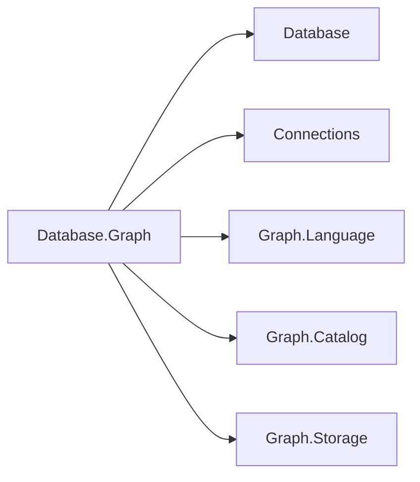
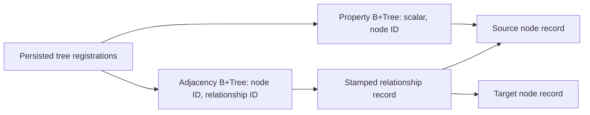

# Graph engine design

## Composition and frozen contracts

The fifth database engine follows Documents' parser/planner/executor composition and Blob's
engine-owned lifecycle. `GraphDatabaseEngine` is the public factory and engine implementation;
database, session, transaction, planner and executor implementations are internal. Its dependencies
are the area root, Connections and the Graph.Language, Graph.Catalog and Graph.Storage packages. Storage uses
shared Storage, Transactions and Indexing rather than another pager, journal or lock manager.

| Package | Responsibility |
| --- | --- |
| `Database.Graph` | Engine, sessions, typed operations, planning, execution and catalog protocol server |
| `Database.Graph.Language` | ISO GQL subset, AST and syntax/capability diagnostics |
| `Database.Graph.Catalog` | Snapshot-visible labels, types, property keys, index metadata and ownership |
| `Database.Graph.Storage` | Record encoding, kernel adapter, adjacency and property B+Trees |

The engine references the area root, transport abstraction and its model packages; the protocol
and security contracts arrive through the area's root composition. These are dependency edges:

No existing public interface changed. `IGraphDatabase` accepts an explicit `IDatabaseSession` for
each data operation. Every entry point checks the concrete session's database identity; sharing an
engine or database name is insufficient. `GraphSchema.Open(database, session)` returns the new
`IGraphSchema` interface, also bound to that exact database and session. Its operations join the
session transaction. Administrative database lifecycle remains on `IDatabaseEngine`; no GQL AST
can select a server, another database, or another graph.

## Physical records and adjacency

Each logical database owns `graph.dat`, `graph.log` and `graph.bak`. All records start with the
shared 16-byte little-endian writer/deleter transaction stamp. The graph payload's byte 16 is the
kind, byte 17 is format version 1, and bytes 18–25 are a nonzero unsigned 64-bit identity. Graph
identities are reserved from the shared storage sequence allocator, so rollback does not recycle
an identity. Database-local IDs must always be paired with the correct session.

| Page owner / kind | Payload after the stamp |
| --- | --- |
| Owner 0, catalog | Catalog-specific version, discriminant and encoded definition; see Graph.Catalog's format |
| Owner 2, kind 1 | Common graph header, label count and strings, then scalar property map |
| Owner 2, kind 2 | Common graph header, source ID, target ID, type string, scalar property map |
| Owner 2, kind 3 | Common graph header, indexed label and property key |
| Owner 1, kind 4 | Zero stamps, kind/version, tree object ID, signed 64-bit root page; 34 bytes total |

Counts and fixed integers are little-endian. Strings use BinaryWriter's UTF-8 encoding with a
7-bit encoded byte-length prefix. Property maps are ordered by ordinal key and preserve scalar
type tags. The exact tag table and index tuple encodings live in
[Graph.Storage DESIGN.md](../../Assimalign.Cohesion.Database.Graph.Storage/docs/DESIGN.md), which
is the format reference for another reader. Properties support null, Boolean, string, integral,
decimal and finite floating point values. Records fit one shared slotted page; oversized records
are rejected before publication. Large graph properties/chunking are deferred.

The adjacency B+Tree contains one entry per incident endpoint, keyed by `(node ID, relationship
ID)` and pointing to the relationship's packed physical record location `(page ID << 16) | slot`.
A self-loop has one entry. The relationship record carries both directed endpoints and its type;
direction/type filtering occurs after the node-prefix seek. Composite keys avoid duplicate-key
boundary ambiguity after B+Tree splits. A node identity map reconstructed from records at open
provides constant-time identity lookup followed by a stamped page read.

The diagram shows the references stored by the adjacency and property trees; relationship records
carry endpoint identities referring to node records.

An incident lookup costs `O(log E + degree)` index work plus one record read per incident edge;
deterministic result ordering adds `O(degree log degree)` CPU work. Direct traversal costs the
sum of these lookups for expanded nodes and uses `O(Vvisited)` visited state. A label scan
examines node records and sorts its matches. A property equality anchor instead seeks its
shared B+Tree in `O(log N + candidates)` after locating index metadata, then sorts its matches.
Index numeric keys normalize
integral, decimal and finite floating point values through double conversion. Full scalar comparisons
filter index candidates, preserving exact integral/decimal comparisons despite key collisions.
Comparisons involving a floating point operand use double precision, including subnormal values.
All node creation/deletion paths maintain property indexes. Graph has no property-update verb.

## Transactions, atomicity and recovery

One `TransactionCoordinator` per database owns MVCC, logical undo, journal durability, lock
management and physical statement brackets. A conservative database writer lock serializes writers
through their logical commit or rollback; readers use snapshots. Metadata and affected graph
records are checked against the latest committed view after lock acquisition, so a stale writer
cannot create an orphan endpoint or bypass a newer schema constraint.

Node creation and label/key metadata participate in the same logical transaction. Relationship
creation writes its record and both adjacency entries in one physical bracket. Deleting a node
with `DETACH DELETE` tombstones its incident relationships, adjacency and property entries with
the node atomically. Plain GQL `DELETE` refuses a still-connected node. `DELETE r,a` first deletes
explicitly selected relationships, then checks the nodes. The frozen typed `DeleteNodeAsync`
contract explicitly cascades and is implemented that way. Any mutation failure rolls back the
owning logical transaction, including an explicit session transaction, as in Documents.

Snapshot and ReadCommitted isolation are supported. ReadCommitted captures and pins a statement
snapshot, so metadata and each hop of a traversal share a visibility horizon. Serializable is
rejected rather than silently weakened. Explicit transactions use the existing session API;
GQL transaction-control syntax is outside the profile. Results materialize before the statement
transaction is released, so result iteration cannot race record reclamation.

Open defers the storage checkpoint, performs physical WAL recovery, then invokes coordinator
record scrub, opens catalog/store indexes, purges unproven index writers using the same recovery
plan, and checkpoints last. The process fixture exits after committed graph/index creation and
after uncommitted detach/insertion page write-back, without disposal. Restart must recover the
committed path and index, remove partial nodes/types/edges, and undo partial tombstones; it then
reopens a second time to verify the recovery checkpoint.

## Planning, execution and bounds

`GqlQueryParser` builds `GqlQueryStatement`; `GraphPlanner` resolves labels, relationship types,
variable kinds and access paths; `GraphPlanExecutor` applies that plan. The planner considers
literal inline properties and equality predicates joined by `AND` for every node position in a
pattern. It can anchor at the middle or end, expanding right and then left with appropriately
reversed directions. Bound variables from earlier comma-separated patterns take precedence over
a fresh scan. Every selected candidate still passes labels, property predicates and bindings.

GQL patterns are finite chains of at most 64 relationships. Each matched path is a trail: an edge
identity is used at most once within that path; a node may recur. Separate comma-separated paths
have separate edge sets and share variable bindings. This makes a three-edge cycle a valid
three-hop result but forbids reusing its first edge on a fourth hop. At most 100,000 intermediate
path matches materialize per pattern, and a statement examines at most 1,000,000 node/edge
candidates, including dead ends; either overflow fails with `COHDBG004`, never silent truncation.
Cancellation is observed during expansion and materialization. Repeated node/relationship
variables enforce identity equality, and conflicting variable kinds fail before execution.

`TraverseAsync` implements the frozen `GraphTraversal` contract separately: breadth-first traversal,
an explicit nonnegative maximum depth, a visited-node set seeded with the start, and no repeated
nodes. It excludes the start even when a cycle or self-loop reaches it. Incident edges are ordered
by identity, making the breadth-first result deterministic. Its result contains visited nodes;
GQL's projected `a,r,b` values expose the actual frozen `GraphNode`/`GraphRelationship` objects
through `QueryRow.GetValue`. Property projections return scalars. This does not add a path member
to the frozen traversal contract.

The [supported-clause matrix](../../Assimalign.Cohesion.Database.Graph.Language/docs/DESIGN.md#supported-clause-matrix)
is the single executable-language inventory: MATCH, WHERE, RETURN, INSERT, CREATE (compatibility
extension), DELETE, DETACH DELETE and SHOW (catalog extension). Parameters, functions, variable-length paths, aggregations,
ordering, graph selection and language DDL are not advertised. Label/type/index management is the
session-bound C# schema API. The ISO decision and conformance corpus are documented alongside the
parser; this is a bounded ISO subset, not a full conformance claim.

## Catalog introspection (C2)

`GraphSchema.Open(database, session)` already supplies in-process discovery of labels, relationship
types, property keys and indexes. C2 preserves that interface and makes the same catalog reachable
through textual requests on the existing `IDatabaseSession.ExecuteAsync` query boundary. Dedicated
`SHOW` statements are Cohesion GQL extensions, not ISO conformance claims. A catalog definition is
not a graph node: exposing it through `MATCH` would invent graph identities and relationships and
would reserve labels in the user graph. `SHOW` instead returns a typed result set with no fabricated
graph elements or persisted system data.

`GraphDatabaseServer.Create(engine, options)` exposes these statements to the existing generic
`Database.Client` over the shared Cohesion protocol. The composition root supplies an
`IConnectionListener` through `GraphDatabaseServerOptions.Listener` and owns the engine lifecycle;
the server owns the listener and its accepted sessions. Startup authentication binds each connection
to one database. Typed scalar result columns and rows use the existing protocol codecs, including
GUID identities and nullable ownership values. The catalog server deliberately supports only `SHOW`
statements: other graph queries return `ExecutionFailure` with
`The graph wire server supports catalog SHOW statements only.` Graph element serialization and a
typed Graph client remain outside this increment. No existing interface gained a transport member.

Each statement has a fixed ordered column contract. All name columns are strings, identity columns
are GUIDs, and `IS_REQUIRED` and `IS_UNIQUE` are Booleans.

| Statement | Columns in result order |
| --- | --- |
| `SHOW LABELS` | `DATABASE_NAME`, `LABEL_ID`, `LABEL_NAME` |
| `SHOW RELATIONSHIP TYPES` | `DATABASE_NAME`, `RELATIONSHIP_TYPE_ID`, `RELATIONSHIP_TYPE_NAME` |
| `SHOW PROPERTY KEYS` | `DATABASE_NAME`, `DEFINITION_TYPE`, `DEFINITION_ID`, `DEFINITION_NAME`, `PROPERTY_KEY`, `DATA_TYPE`, `IS_REQUIRED` |
| `SHOW INDEXES` | `DATABASE_NAME`, `LABEL_ID`, `LABEL_NAME`, `INDEX_NAME`, `PROPERTY_KEY`, `IS_UNIQUE` |
| `SHOW OBJECT OWNERSHIP` | `DATABASE_NAME`, `DEFINITION_TYPE`, `DEFINITION_ID`, `DEFINITION_NAME`, `OBJECT_TYPE`, `OBJECT_NAME`, `OWNER`, `OWNING_SCHEMA` |

`DEFINITION_TYPE` distinguishes `LABEL` from `RELATIONSHIP TYPE`, including when both have the same
name. `DATA_TYPE` is the declared shared `DatabaseType` name, or null for an unconstrained key;
observed property values do not invent a declared type. Current node-property indexes are nonunique,
so `IS_UNIQUE` is false. Storage pages and physical index registrations stay internal. Definition
names and their child names retain the catalog's ordinal ordering; label definitions precede
relationship-type definitions. Definitions remain discoverable when the last graph element is gone.

Ownership follows SQL's `COHESION_SCHEMA.OBJECT_OWNERSHIP` vocabulary: `OBJECT_TYPE`, `OBJECT_NAME`,
`OWNER` (`Adhoc` or `Schema`) and nullable `OWNING_SCHEMA`. The owning schema is the compiled/schema
authority, never a graph namespace. Label and relationship-type rows report their persisted owner.
Property and index metadata has no independent ownership field: its rows report the parent
definition's authority because catalog mutation enforcement checks that parent. `OBJECT_TYPE` is
`LABEL`, `RELATIONSHIP TYPE`, `PROPERTY KEY` or `INDEX`; the definition identity disambiguates children.

The executor reads all definitions and children using the operation's existing pinned MVCC snapshot.
Snapshot transactions retain their original visibility; ReadCommitted and auto-commit statements
observe catalog changes at statement start. Own uncommitted definitions are visible in the same
transaction, other sessions cannot see them, and rollback leaves no virtual rows behind. Dropping a
definition removes its property/index/ownership rows from fresh snapshots. Results are computed at
execution time and never materialized into the graph's persistent record space.

`SHOW` always targets the session's logical database. There is no database qualifier, server listing,
graph selection, filtering, projection, or mutation composition in this bounded extension. An
attempt to append a mutation clause returns `GQL0007: Graph catalog introspection is read-only.`
before any writer lock or data mutation; hand-built ASTs have the same protection. Unsupported
read composition returns the ordinary syntax/binding diagnostic. Since no synthetic graph objects
are created, ordinary graph writes cannot address or change these result rows.

## Metadata and diagnostics

Labels, relationship types and discovered property keys persist even when the last data object is
deleted. Discovery sees the session snapshot. New data introduces ad-hoc definitions. A supplied
property definition can require a value and its database scalar type; adding a constraint
validates existing objects first. Unsigned integer values map to the next wider signed database
type (`byte` to Int16, `ushort` to Int32, `uint` to Int64, `ulong` to Decimal); persisted CLR types
remain unchanged. Unsupported property types are refused. Dropping an in-use label/type is refused. Schema ownership is
enforced on drop and every alter/index/property-metadata path with `DatabaseObjectLockedException`,
naming the object, owning schema and operation. An initial directly marked definition is supported
to exercise that enforcement path; compiled provisioning is not included.

| Code | Meaning |
| --- | --- |
| `COHDBL001` | Unsupported language capability, reported on the parsed statement |
| `GQL0001`–`GQL0006` | Parser syntax/literal/bound errors; see language design |
| `GQL0007` | Attempt to mutate catalog introspection results |
| `COHDBG001` | Invalid pattern, variable binding or traversal specification |
| `COHDBG002` | Unknown label or relationship type |
| `COHDBG003` | Schema/data mismatch, restricted deletion or invalid graph mutation |
| `COHDBG004` | Path materialization or candidate-expansion limit exceeded |
| `COHDBG005` | Session/database binding mismatch |
| `COHDBG006` | Storage failure translated at the engine boundary |

Planner/data errors use stable code prefixes on `DatabaseException`. Kernel aborts cross the engine
boundary as `DatabaseTransactionAbortedException`; deadlocks retain their specialized subtype.
Ownership uses the shared dedicated exception rather than an invented graph ownership code.

## Lifecycle and delivery

Engine construction starts WAL-flush, page-writeback, checkpoint and version-purge workers, exposed
through `Workers`. State is Running until a worker fails (Faulted) or disposal begins (Disposed).
Disposal is idempotent: stop and join workers, abort outstanding transactions, durably flush and
close each database. Logical commits are synchronous through the coordinator even when physical
grouped durability is configured. The flush worker still services the storage group-commit seam.

Names are single path components, directory lookup is case insensitive, and enumeration includes
persisted databases not yet open in memory. Root-builder `AddGraphDatabase` registers the running
engine without Hosting dependencies. The family is included in all solution, framework, CI and
release-inventory surfaces. General graph wire queries, model security policies, replication,
Hosting/ApplicationModel changes and compiled-schema provisioning remain out of scope. The catalog
server uses the shared authenticator rather than adding graph-specific authentication contracts.
No reflection or runtime code generation is used.
