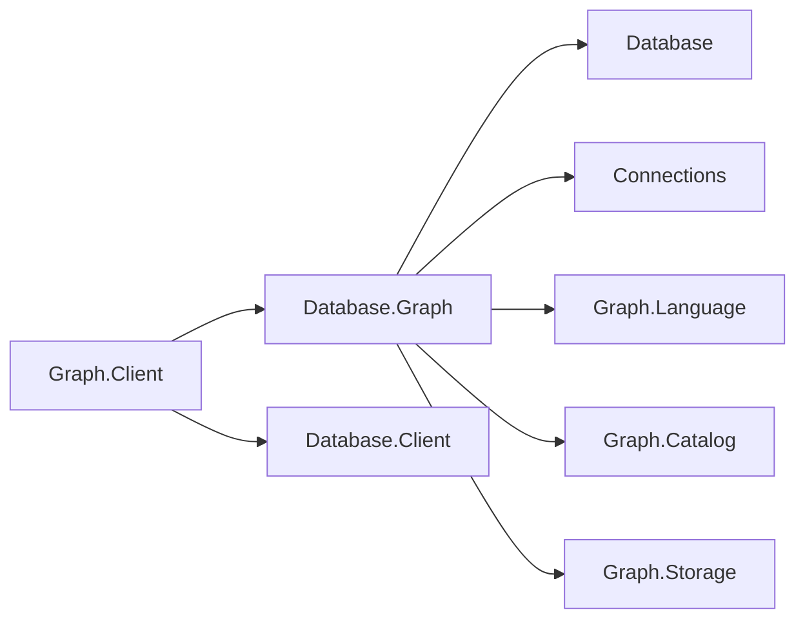
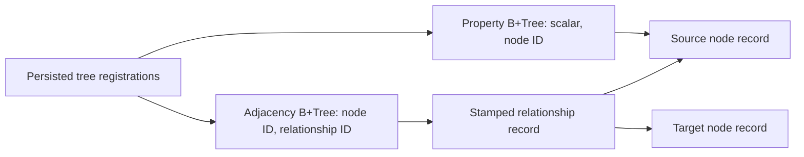
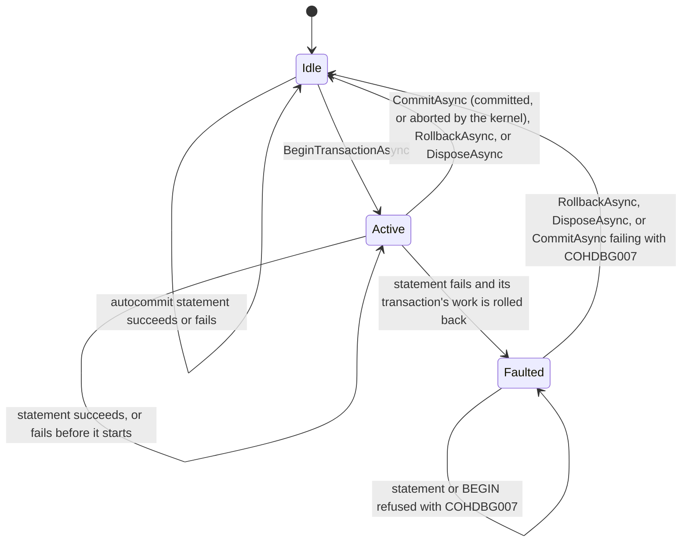
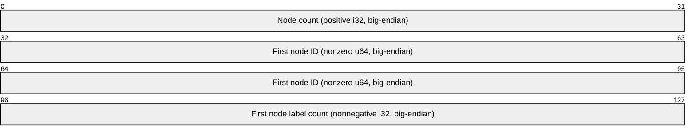
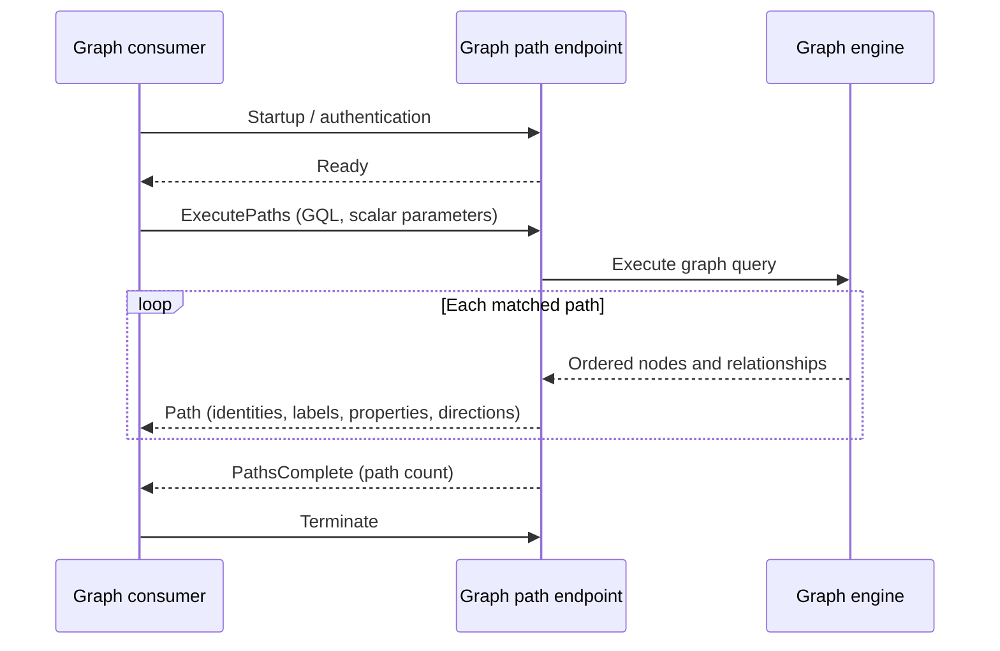

# Graph engine design

## String comparison and collation (#1025)

Graph remains ordinal-only. String property predicates use case-sensitive .NET
ordinal (UTF-16 code-unit) comparison; property index keys encode the same order.
Labels, edge types, property keys, and query variable bindings retain ordinal,
case-sensitive identity. Administrative database lookup remains
ordinal-ignore-case. SQL database defaults and `COLLATE` overrides do not apply
to GQL or graph storage. Configurable graph collation is deferred; no case or
accent folding is applied to stored labels or property values.

## Composition and frozen contracts

The fifth database engine follows Documents' parser/planner/executor composition and Blob's
engine-owned lifecycle. `GraphDatabaseEngine` is the public factory and engine; the engine, its
database (`GraphDatabase`), session, transaction, server and builder are public sealed types, the
first five leaves of the area root's bases ([Concrete types](#concrete-types-concrete-types-plan-phase-4-1260)),
while the planner, executor, server session and storage strategy are internal. Its dependencies
are the area root, Connections and the Graph.Language, Graph.Catalog and Graph.Storage packages. Storage uses
shared Storage, Transactions and Indexing rather than another pager, journal or lock manager.

| Package | Responsibility |
| --- | --- |
| `Database.Graph` | Engine, sessions, typed operations, planning, scalar/path execution, and graph protocol server |
| `Database.Graph.Client` | NuGet-only scalar and path client over the shared connection pool; references Graph and Database.Client |
| `Database.Graph.Language` | ISO GQL subset, AST and syntax/capability diagnostics |
| `Database.Graph.Catalog` | Snapshot-visible labels, types, property keys, index metadata and ownership |
| `Database.Graph.Storage` | Record encoding, kernel adapter, adjacency and property B+Trees |

The engine references the area root, transport abstraction and its model packages; the protocol
and security contracts arrive through the area's root composition. These are dependency edges:

```mermaid
flowchart LR
    Engine["Database.Graph"] --> Root["Database"]
    Engine --> Connections["Connections"]
    Engine --> Language["Graph.Language"]
    Engine --> Catalog["Graph.Catalog"]
    Engine --> Storage["Graph.Storage"]
    Client["Graph.Client"] --> Engine
    Client --> SharedClient["Database.Client"]
```

`GraphDatabase` takes an explicit `GraphDatabaseSession` for each data operation. Every entry point
checks the session's database identity; sharing an engine or database name is insufficient.
`GraphSchema.Open(database, session)` returns a `GraphSchema` bound to that exact database and
session. Its operations join the session transaction. #1228 changed `GraphSchema.GetIndexesAsync`
(a breaking change) to return `GraphSchemaResult<GraphIndexMetadata>`, a read-only list that also
carries the read's warnings. Administrative database lifecycle remains on the engine; no GQL AST
can select a server, another database, or another graph.

## Physical records and adjacency

Each logical database owns `graph.dat`, `graph.log` and `graph.bak`. All records start with the
shared 16-byte little-endian writer/deleter transaction stamp. The graph payload's byte 16 is the
kind, byte 17 is format version 1, and bytes 18–25 are a nonzero unsigned 64-bit identity. Graph
identities are reserved from the shared storage sequence allocator, so rollback does not recycle
an identity. Database-local IDs must always be paired with the correct session.

| Page owner / kind | Payload after the stamp |
| --- | --- |
| Owner 0, catalog | Catalog-specific version, discriminant and encoded definition; see Graph.Catalog's format |
| Owner 2, kind 1 | Common graph header, label count and strings, then scalar property map |
| Owner 2, kind 2 | Common graph header, source ID, target ID, type string, scalar property map |
| Owner 2, kind 3 | Common graph header, indexed label and property key |
| Owner 1, kind 4 | Zero stamps, kind/version, tree object ID, signed 64-bit root page; 34 bytes total |

Counts and fixed integers are little-endian. Strings use BinaryWriter's UTF-8 encoding with a
7-bit encoded byte-length prefix. Property maps are ordered by ordinal key and preserve scalar
type tags. The exact tag table and index tuple encodings live in
[Graph.Storage DESIGN.md](../../Assimalign.Cohesion.Database.Graph.Storage/docs/DESIGN.md), which
is the format reference for another reader. Properties support null, Boolean, string, integral,
decimal and finite floating point values. Records fit one shared slotted page; oversized records
are rejected before publication. Large graph properties/chunking are deferred.

The adjacency B+Tree contains one entry per incident endpoint, keyed by `(node ID, relationship
ID)` and pointing to the relationship's packed physical record location `(page ID << 16) | slot`.
A self-loop has one entry. The relationship record carries both directed endpoints and its type;
direction/type filtering occurs after the node-prefix seek. Composite keys avoid duplicate-key
boundary ambiguity after B+Tree splits. A node identity map reconstructed from records at open
provides constant-time identity lookup followed by a stamped page read.

The diagram shows the references stored by the adjacency and property trees; relationship records
carry endpoint identities referring to node records.

```mermaid
flowchart LR
    Adj["Adjacency B+Tree: node ID, relationship ID"] --> Rel["Stamped relationship record"]
    Rel --> Src["Source node record"]
    Rel --> Dst["Target node record"]
    Prop["Property B+Tree: scalar, node ID"] --> Src
    Reg["Persisted tree registrations"] --> Adj
    Reg --> Prop
```

An incident lookup costs `O(log E + degree)` index work plus one record read per incident edge;
deterministic result ordering adds `O(degree log degree)` CPU work. Direct traversal costs the
sum of these lookups for expanded nodes and uses `O(Vvisited)` visited state. A label scan
examines node records and sorts its matches. A property equality anchor instead seeks its
shared B+Tree in `O(log N + candidates)` after locating index metadata, then sorts its matches.
Index numeric keys normalize
integral, decimal and finite floating point values through double conversion. Full scalar comparisons
filter index candidates, preserving exact integral/decimal comparisons despite key collisions.
Comparisons involving a floating point operand use double precision, including subnormal values.
All node creation/deletion paths maintain property indexes. Graph has no property-update verb.

## Transactions, atomicity and recovery

One `TransactionCoordinator` per database owns MVCC, logical undo, journal durability, lock
management and physical statement brackets. A conservative database writer lock serializes writers
through their logical commit or rollback; readers use snapshots. Metadata and affected graph
records are checked against the latest committed view after lock acquisition, so a stale writer
cannot create an orphan endpoint or bypass a newer schema constraint.

Node creation and label/key metadata participate in the same logical transaction. Relationship
creation writes its record and both adjacency entries in one physical bracket. Deleting a node
with `DETACH DELETE` tombstones its incident relationships, adjacency and property entries with
the node atomically. Plain GQL `DELETE` refuses a still-connected node. `DELETE r,a` first deletes
explicitly selected relationships, then checks the nodes. The frozen typed `DeleteNodeAsync`
contract explicitly cascades and is implemented that way. Any statement failure rolls back the
owning logical transaction. An autocommit statement's transaction is its own; an explicit session
transaction is aborted as a whole and stays aborted until the caller rolls it back, as
[Failed statements in explicit transactions](#failed-statements-in-explicit-transactions-1188)
describes.

Snapshot and ReadCommitted isolation are supported. ReadCommitted captures and pins a statement
snapshot, so metadata and each hop of a traversal share a visibility horizon. Serializable is
rejected rather than silently weakened. Explicit transactions use the existing session API;
GQL transaction-control syntax is outside the profile. Wire transactions are deliberately deferred:
`BEGIN`/`COMMIT`/`ROLLBACK` do not parse and reserved `Transaction` byte 9 is rejected with
`ProtocolViolation`. No connection-level transaction API is exposed. Results materialize before
the statement transaction is released, so result iteration cannot race record reclamation.

Open defers the storage checkpoint, performs physical WAL recovery, then invokes coordinator
record scrub, opens catalog/store indexes, purges unproven index writers using the same recovery
plan, and checkpoints last. The process fixture exits after committed graph/index creation and
after uncommitted detach/insertion page write-back, without disposal. Restart must recover the
committed path and index, remove partial nodes/types/edges, and undo partial tombstones; it then
reopens a second time to verify the recovery checkpoint.

### Failed statements in explicit transactions (#1188)

A statement that fails inside an explicit transaction aborts the whole transaction. Graph storage
cannot undo one statement: a statement writes catalog definitions, records and index entries
through separate physical brackets, and `Database.Transactions` undoes a writer only as a whole
transaction, with no savepoints. The SQL session's contract, where the failed statement writes
nothing and the transaction stays active, is therefore unavailable, and the session follows Neo4j:

1. The failure rolls the transaction's work back at once and releases its locks, so the aborted
   transaction blocks no other writer while it waits for the caller. (When the undo itself fails,
   the kernel keeps the writer lock until its version-purge pass completes the undo; see
   `Database.Transactions` DESIGN.md, "Ending a transaction".)
2. The transaction stays the session's `CurrentTransaction` and reports `TransactionState.Faulted`.
   Every later statement on the session fails with `COHDBG007`: GQL text or requests, typed
   `GraphDatabase` operations, traversals and `GraphSchema` calls. `BeginTransactionAsync` fails
   with `COHDBG007` too. The error names the original failure in its message (`Cause: ...`) and
   carries it as `InnerException`. A refused statement does not change the transaction, and an
   aborted transaction refuses text before parsing it.
3. `RollbackAsync` succeeds, leaves none of the transaction's writes, and returns the session to
   autocommit. Disposing the transaction or the session ends it the same way. A rollback of any
   transaction that did not commit may be repeated and raises nothing: one already rolled back,
   one a failed statement aborted, and one whose commit the kernel aborted (a commit record that
   could not be written). So a catch-block rollback after a failed commit never hides the
   commit's error. A rollback of a committed transaction is refused, because it cannot do what it
   says.
4. `CommitAsync` fails with `COHDBG007`, commits nothing, and ends the transaction (`RolledBack`);
   every later commit fails the same way, with the same cause, and so does a commit after the
   session's teardown ended the transaction (since phase 4 of the concrete-types plan, when the
   root transaction base took over the state machine; before it a later commit reported "The
   transaction is RolledBack.").
   A commit the kernel aborts throws `DatabaseTransactionAbortedException`, as a statement's kernel
   abort does, and leaves the transaction `Faulted` and ended. A commit whose record was written
   but could not be made durable is not an abort: it throws
   `DatabaseTransactionCommitUnconfirmedException` and leaves the transaction `Committed`
   (`Database.Transactions` DESIGN.md, "A commit record that was written but not made durable").
   Its message leads with the model's code on every path, the explicit commit and an autocommit
   statement's own commit alike (owner decision 24 of 2026-10-06, #1272):
   `COHDBG012: Database '{name}' went offline while a transaction was committing: ...`, built by
   the root's `DatabaseTransactionCommitUnconfirmedException.Create(code, database, cause)` in
   `GraphDatabase.TranslateKernelFailure`, now an instance member so it knows the database, with
   the kernel's `TransactionCommitUnconfirmedException` as its inner exception. Before #1272 this
   path carried the kernel's message alone.
5. Every failure of a statement that started counts: parse diagnostics, planning and execution
   errors, ownership refusals, kernel aborts such as conflicts and deadlocks, cancellation while
   the statement runs, and (on the wire) a result the server cannot encode or deliver. Failures
   that come before a statement starts leave the transaction unchanged: argument validation (null
   or whitespace text; a null label list, or a null, empty or whitespace label or relationship
   type, on the typed `GraphDatabase` writes; an invalid traversal specification, reported as
   `COHDBG001` before the traversal starts), a session of another database (`COHDBG005`), a token
   canceled before the statement starts, a non-GQL request, and the refusal of a second
   concurrent operation on the session. A definition `GraphSchema` saves is validated by the
   catalog inside its statement, so a rejected definition is a failed statement.
6. Autocommit statements are unaffected: a failure ends only its own statement transaction.
7. A rollback or commit observes its cancellation token only before it starts: a token canceled
   by then throws `OperationCanceledException` and leaves the transaction as it was. One that has
   started runs to completion. A rollback stopped half way would keep the writer lock, and a
   commit stopped half way would only become a kernel abort of work the caller asked to keep;
   PostgreSQL likewise holds interrupts through `AbortTransaction`
   (`backend/access/transam/xact.c:2854-2861`), and Neo4j's `commit` and `rollback` take no
   cancellation.
   A rollback or commit that started always ends the transaction. Until #1226 a journal or
   storage failure could leave the context active behind a failed rollback, and the session then
   kept the transaction `Faulted` until a later rollback completed. The transaction kernel now
   completes a started rollback whatever fails (a lost abort record is ignored, and a failed undo
   is retried by the kernel with the writer's locks held), and it aborts a commit it cannot
   complete. The kernel still refuses a rollback before it starts when the database is closing:
   once the manager's disposal begins, a rollback fails with `ObjectDisposedException` (the
   disposal flags itself before it claims any end, so no end refused during the close fails any
   other way). That refusal leaves the context active only until disposal's own abort ends it, so the
   `Faulted` end-failure state and its `COHDBG007` message were removed, and the stateless guard
   that remains covers the case: once a rollback throws with the context active, the session
   refuses statements in the ended transaction ("being committed or rolled back"), another
   `RollbackAsync` fails the same way while the close runs and is accepted once the close's abort
   ended the context, and a `CommitAsync` commits nothing the caller rolled back: it fails with
   `ObjectDisposedException` while the database closes, or reports the `Faulted` state once
   disposal's abort ended the context.

The session's explicit-transaction lifecycle, where Faulted is the new state:

```mermaid
stateDiagram-v2
    [*] --> Idle
    Idle --> Idle: autocommit statement succeeds or fails
    Idle --> Active: BeginTransactionAsync
    Active --> Active: statement succeeds, or fails before it starts
    Active --> Faulted: statement fails and its transaction's work is rolled back
    Faulted --> Faulted: statement or BEGIN refused with COHDBG007
    Active --> Idle: CommitAsync (committed, or aborted by the kernel), RollbackAsync, or DisposeAsync
    Faulted --> Idle: RollbackAsync, DisposeAsync, or CommitAsync failing with COHDBG007
```

The reference engines agree on the failure and the refusal; they differ only on COMMIT. Citations
are to Neo4j commit `54a7dcf7c25` and PostgreSQL commit `85f55534e80`, under each repository's
`community/` and `src/` trees respectively.

| Behavior | Neo4j (followed) | PostgreSQL | Graph |
| --- | --- | --- | --- |
| A statement fails | Any failure, compilation included, marks the transaction for termination (`cypher/cypher/.../ExecutionEngine.scala:232-245`); every error classification rolls back (`common/.../Status.java:983-1005`); Bolt marks the transaction failed (`bolt/.../tx/TransactionImpl.java:130-145`) | Any error aborts the block into `TBLOCK_ABORT`, "failed xact, awaiting ROLLBACK" (`backend/access/transam/xact.c:171`) | Aborted; its work is rolled back at once |
| Later statements | Refused as terminated (`kernel/.../coreapi/TransactionImpl.java:529-535`, `fabric/query-router/.../RouterTransactionImpl.java:478-486`); Bolt answers every request but RESET with IGNORED or FAILURE (`bolt/.../fsm/StateMachineImpl.java:143-153`) | Rejected with SQLSTATE 25P02 before parse analysis (`backend/tcop/postgres.c:1150-1164`) | `COHDBG007`, checked before parsing |
| BEGIN | Refused with the rest in Bolt's failed state | 25P02: BEGIN is no transaction exit statement (`backend/tcop/postgres.c:2945-2958`) | `COHDBG007` |
| ROLLBACK | Succeeds, repeatably, on any transaction that is no longer open, a committed one included (`kernel/.../coreapi/TransactionImpl.java:210-214`, `kernel/.../KernelTransactionImplementation.java:1184-1194`, `RouterTransactionImpl.java:268-275`) | Ends the block; abort processing is already done (`xact.c:4272-4280`) | Succeeds, repeatably, on any transaction that did not commit; refused after a commit |
| COMMIT | Rolls back and throws `Terminated` (`KernelTransactionImplementation.java:1206-1210`, `1291-1303`; `RouterTransactionImpl.java:219-225`) | Ends the block and reports the tag ROLLBACK without an error (`xact.c:4133-4139`, `backend/tcop/utility.c:636-641`) | `COHDBG007`; nothing commits; the transaction ends |

COMMIT follows Neo4j: a caller awaiting `CommitAsync` must not see success when nothing committed.
A Bolt driver sends RESET after a failure; `RollbackAsync` plays that part here. ROLLBACK departs
from Neo4j in one case: Neo4j ignores a rollback of a committed transaction, and Graph refuses it,
because a rollback that returns normally promises that none of the transaction's work persists.

Reading a label or relationship type the database does not have is not a failed statement (#1228,
following Neo4j). A read probe such as `MATCH (n:Missing) RETURN n` or
`GraphSchema.GetIndexesAsync("Missing")` returns no rows and a `COHDBG010` or `COHDBG011` warning,
and the explicit transaction stays active with its earlier writes, as
[Unknown labels and relationship types in reads](#unknown-labels-and-relationship-types-in-reads-1228)
describes.

The graph protocol has no transaction control, so a wire session runs inside an explicit
transaction only when its host opens one on the server session's engine session
(`DatabaseServerSession.DatabaseSession`, through `GraphDatabaseServer.Sessions`). The server hands
parsing and request validation to
that engine session, so a parse failure or an entity projection on `Execute` aborts the
transaction exactly as the same failure does in process. A statement whose result the server
then cannot encode or deliver (for example a property value the wire codec has no encoding for)
fails for the client after its operation completed, so the server aborts the transaction before
it writes the `ExecutionFailure`, as Bolt marks its transaction failed on any failure of a request,
result streaming included (`bolt/.../fsm/StateMachineImpl.java:156-162`). An empty statement is
rejected before it reaches the session and changes nothing. Each refusal is an `ExecutionFailure` whose message starts with `COHDBG007`, on
`Execute` and `ExecutePaths` alike, and the session stays ready.

## Planning, execution and bounds

`GqlQueryParser` builds `GqlQueryStatement`; `GraphPlanner` resolves labels, relationship types,
variable kinds and access paths; `GraphPlanExecutor` applies that plan. The planner considers
literal inline properties and equality predicates joined by `AND` for every node position in a
pattern. It can anchor at the middle or end, expanding right and then left with appropriately
reversed directions. Bound variables from earlier comma-separated patterns take precedence over
a fresh scan. Every selected candidate still passes labels, property predicates and bindings.

Label expressions (#1139) follow one anchor rule: only a node's `Labels` can choose a label scan or
a property index, and the parser fills `Labels` only for a pure conjunction (`:A`, `:A&B`,
`:A:B`), whose every match carries each listed label. A disjunction (`:A|B`), negation (`:!A`) or
wildcard (`:%`) leaves `Labels` empty, so `(n:A|B {k: 1})` and `(n:!A {k: 1})` plan an anchor with
no label and no property and scan every node; anchoring on `A`'s index would silently drop the `B`
or non-`A` rows. A `WHERE` labeled predicate (`n:A`, `n IS [NOT] LABELED A`) is a Boolean primary,
never an equality, so `MATCH (n) WHERE n:A AND n.k = 1` also plans no index property. The
executor evaluates the expression on every candidate node, and a relationship pattern's expression
on every incident edge's type. `GraphLabelEvaluator` validates each expression before execution:
an unknown kind, a null operand, name or operand list, a conjunction or disjunction with fewer than
two operands, or `Labels`/`Type` that disagree with the expression are `COHDBG001`. Every name a
match reads, including those under `!` and `|`, resolves against the catalog at the statement's
snapshot, and a chain that repeats a name resolves it once; a name the database does not have
matches nothing and is reported as a warning, not an error (see
[Unknown labels and relationship types in reads](#unknown-labels-and-relationship-types-in-reads-1228)).
`Undirected` and `LeftOrRight`
constrain neither end of a stored edge; insertion takes only `Outgoing` and `Incoming`, one type,
and a label conjunction. Storage cannot hold an empty or all-whitespace label, relationship type or
property key, and a delimited name such as `(n:" ")` or `{" ": 1}` can spell one, so insertion
rejects each with `COHDBG001` before anything is written; matching on such a name finds no catalog
entry, so no element carries it and a read warns (`COHDBG010`/`COHDBG011`).

Label expressions and `WHERE` predicates have no length or nesting limit (#1139 follow-up, owner
decision 2026-10-02: do what Neo4j does; the evidence is in the
[language design](../../Assimalign.Cohesion.Database.Graph.Language/docs/DESIGN.md#chain-length-and-nesting-1139-follow-up)).
A conjunction or disjunction of labels, and an `AND` chain of predicates, is one n-ary node, and the
engine evaluates it with a loop that stops at the first operand that decides it, under three-valued
logic for `AND` (false, otherwise unknown, otherwise true). Validation, name collection and the
anchor's equality search walk with an explicit stack. Anchor selection reads the visible indexes
once per plan (`GraphStore.GetIndexes`, grouped by label) and the `WHERE` chain's equalities once,
keeping each variable's first non-null value per key; each node then tries, for each distinct label
in order, only the keys that label has an index on. A plan therefore costs time linear in its `E`
equalities, its `D` pattern labels and properties and its `I` visible indexes, plus for each node the
indexes its own labels carry, never the product of labels, equalities and indexes (Neo4j's leaf
planner likewise groups predicates once and visits only each label's own index descriptors,
`NodeIndexLeafPlanner.scala`:184, :201, :248-296), and it chooses as a per-pair search would: the
first label with an index on a key the node has a value for, then that label's key whose value comes
first, inline properties before `WHERE` equalities. A node carrying more than 16 labels is tested
through a hash set built once per evaluation. Only label and predicate evaluation recurse, where the
tree nests, and each descent calls `RuntimeHelpers.EnsureSufficientExecutionStack`. A statement
whose parse (`GQL0009`), plan or evaluation needs more stack than the executing thread has left
fails with `COHDBG008`, statement too complex (ISO SQLSTATE 54001; Neo4j's transient
`StackOverFlowError`, GQLSTATUS 51N37). A caller that runs `GraphQueryRequest.FromGql` itself gets
the failure before any statement starts. Text the session parses (`ExecuteAsync(string)`, the wire)
is part of its statement (#1188), and so is a typed request whose statement already carries
`GQL0009`: a parse, plan or evaluation out of stack is a failed statement and, like any other,
aborts an explicit transaction (`COHDBG007` until the caller rolls back; see
[Failed statements in explicit transactions](#failed-statements-in-explicit-transactions-1188)).
The session stays open. Over the wire's `Execute` seam the
failure is an `ExecutionFailure` that keeps the connection ready; on the `ExecutePaths` seam the
server session survives too, but the client currently closes its connection after any statement
error received before the first path (a `Database.Client` follow-up). Planner messages quote at
most 256 UTF-16 code units of a label expression, cut so that no surrogate pair is split.

Two storage limits remain, recorded here rather than hidden behind the language. A node's labels
and properties, or a relationship's type and properties, share one graph record of at most 8,092
bytes (`GraphRecordCodec`), so the number of distinct labels one node can carry is bounded by their
encoded size, and an indexed property value must fit the 1,016-byte index key. Past either limit the
store throws `GraphElementTooLargeException` before it writes anything for the element, and the
engine fails the statement with `COHDBG009`, element too large: the operation aborts like any other
statement failure (an explicit transaction is aborted until the caller rolls back) and the session, in process and over the
wire, stays open. A search for a value too long for its index matches nothing, since no write can
store one. Neo4j instead spills labels to dynamic label records and long properties to property
chains, which this store's format does not yet have. Defining a new label or relationship type
checks identity uniqueness by listing every definition (`GraphCatalog.SaveDefinitionAsync`),
so a statement that introduces N new labels costs time quadratic in N (measured in Release: 1,000
new labels in one `INSERT` take 7.5 s, 2,000 take 42 s). Neither limit counts expression length;
both are follow-up storage items.

GQL patterns are finite chains of at most 64 relationships. Each matched path is a trail: an edge
identity is used at most once within that path; a node may recur. Separate comma-separated paths
have separate edge sets and share variable bindings. This makes a three-edge cycle a valid
three-hop result but forbids reusing its first edge on a fourth hop. At most 100,000 intermediate
path matches materialize per pattern, and a statement examines at most 1,000,000 node/edge
candidates, including dead ends; either overflow fails with `COHDBG004`, never silent truncation.
Cancellation is observed during expansion and materialization. Repeated node/relationship
variables enforce identity equality, and conflicting variable kinds fail before execution.

`TraverseAsync` implements the frozen `GraphTraversal` contract separately: breadth-first traversal,
an explicit nonnegative maximum depth, a visited-node set seeded with the start, and no repeated
nodes. It excludes the start even when a cycle or self-loop reaches it. Incident edges are ordered
by identity, making the breadth-first result deterministic. Its result contains visited nodes;
GQL's projected `a,r,b` values expose the actual frozen `GraphNode`/`GraphRelationship` objects
through `QueryRow.GetValue`. Property projections return scalars. This does not add a path member
to the frozen traversal contract.

`GraphPathsQueryRequest.FromGql` selects real path execution through the existing
`DatabaseSession.ExecuteAsync(QueryRequest)` boundary. Its `GraphPathsQueryResult.Paths` contains
materialized `GraphPath` objects from the matcher's bound entities and traversal sequence, under
the same pinned snapshot as scalar execution. Exactly one projection is required: a node variable
produces a singleton path, a relationship variable produces its stored source and target nodes,
and a named path (`MATCH p = (a)-[r:KNOWS]->(b) RETURN p`) preserves traversal order, including
reverse traversal and legal cycles. Properties, labels, types and database-local identities are
the actual engine values. Scalar projections, multiple projections, mutations and catalog queries
are rejected as path requests before execution. This new request/result pair adds no members to
existing public interfaces and does not infer paths from scalar rows.

The [supported-clause matrix](../../Assimalign.Cohesion.Database.Graph.Language/docs/DESIGN.md#supported-clause-matrix)
is the single executable-language inventory: MATCH, WHERE, RETURN, INSERT, CREATE (compatibility
extension), DELETE, DETACH DELETE, SHOW (catalog extension) and LABEL EXPRESSION. Parameters, functions, variable-length paths, aggregations,
ordering, graph selection and language DDL are not advertised. Label/type/index management is the
session-bound C# schema API. The ISO decision and conformance corpus are documented alongside the
parser; this is a bounded ISO subset, not a full conformance claim.

### Unknown labels and relationship types in reads (#1228)

A read names a label or relationship type the database does not have when the catalog has no
visible definition of that name at the statement's snapshot. Owner decision of 2026-10-03: follow
Neo4j, where such a read returns no rows with a WARNING notification rather than an error. The
statement does not fail, so it never aborts an explicit transaction
([#1188](#failed-statements-in-explicit-transactions-1188)): a probe for a label that does not exist
yet keeps the caller's transaction and its earlier writes.

- **Matching.** An unknown name is a label no node carries, or the type of no relationship, and
  every expression evaluates with it: `(n:Missing)`, `(n:A&Missing)` and `WHERE n:Missing` match no
  node, `(n:A|Missing)` matches the `A` nodes, and `(n:!Missing)` and
  `WHERE n IS NOT LABELED Missing` match every node. A label is not a relationship type, so
  `WHERE r:A` on a relationship and `WHERE n:T` on a node name unknown tokens of the variable's kind.
  Neo4j's token resolution likewise leaves an unresolved name out of its semantic table without an
  error (`cypher-planner/.../compiler/planner/ResolveTokens.scala:80-105`).
- **The warning.** A read-only statement reports each unknown name in its result's `Diagnostics`:
  `COHDBG010` for a label (Neo4j `Neo.ClientNotification.Statement.UnknownLabelWarning`, GQLSTATUS
  01N50) and `COHDBG011` for a relationship type (`UnknownRelationshipTypeWarning`, 01N51), each a
  `Diagnostic` of `DiagnosticSeverity.Warning` whose message quotes the name, cut to 256 UTF-16 code
  units (`common/.../kernel/api/exceptions/Status.java:346-355`,
  `neo4j-notifications/.../NotificationCodeWithDescription.java:190-199`). Neo4j's
  `CheckForUnresolvedTokens` reports every unresolved `LabelName` and `RelTypeName` in the statement,
  under negation and disjunction included (`CheckForUnresolvedTokens.scala:61-88`), into a set keyed
  by name and source position (`InternalNotificationLogger.scala:43-49`). Graph pattern names carry
  no source position, so a name is reported once per kind, at its first mention: the patterns' names
  path by path (each path's labels, then its relationship types), then the `WHERE` clause's. A
  warning for a name first met in a labeled predicate carries that predicate's span
  (`DiagnosticLocation.Absolute`); a pattern name's has none. `QueryResult.Diagnostics` stays null
  for a statement with nothing to report. The warning travels on a row result (`QueryResultSet`), on
  `GraphPathsQueryResult`, and on the result of a statement with no projection.
- **Writes.** `INSERT` still defines new labels and relationship types. A write whose `MATCH` names
  an unknown name matches nothing, so its `INSERT` or `DELETE` acts on nothing: the statement
  succeeds having written nothing (an affected count of 0, or an empty row result for
  `INSERT ... RETURN`) and reports no warning, because Neo4j checks unresolved tokens only when
  `query.readOnly` (`CheckForUnresolvedTokens.scala:53`). Schema writes still
  require the definition they change: `CreateIndexAsync`, `DropLabelAsync` and
  `DropRelationshipTypeAsync` of an unknown name fail with `COHDBG002`, a failed statement.
- **Snapshot.** Resolution uses the statement's snapshot, so a transaction sees the labels and types
  its own earlier statements created, and another session sees them only after the commit.
- **No wasted reads.** A pattern that requires an unknown name, a node conjunction (`:A`, `:A&B`,
  `:A:B`) or a relationship's type, can match no element, so the plan records that it matches
  nothing and the executor starts with no binding, never scanning the store. The `WHERE` form does
  the same: a non-negated labeled predicate with a pure conjunction among the clause's top-level
  `AND` operands (`WHERE n:Missing`, `WHERE n.k = 1 AND n IS LABELED A&Missing`, `WHERE r:Missing`)
  is never true, so under three-valued `AND` the clause keeps no row and the plan reads nothing.
  Without this, `MATCH (n) WHERE n:Missing` would scan every node and, past 1,000,000 candidates,
  fail with `COHDBG004` and abort the explicit transaction it was meant to keep. Neo4j treats both
  forms alike, planning a label scan from the selections' `HasLabels` predicates
  (`cypher-planner/.../steps/leafplanner/labelScanLeafPlanner.scala:45`). A name under `!`, `|` or
  `IS NOT LABELED` can be true for an element without it, so it leaves the plan as it is. The flag
  empties the whole statement, which holds only because every `MATCH` in the subset is mandatory:
  when `gql-optional-match` lands, an optional pattern that requires an unknown name binds nulls
  instead and must not set it.
- **Schema reads.** `GraphSchema.GetIndexesAsync(label)` returns `GraphSchemaResult<GraphIndexMetadata>`,
  a read-only list with a `Diagnostics` list: for an unknown label, no indexes and the same
  `COHDBG010` warning. Neo4j's schema API returns an empty list for a label token that does not exist
  (`kernel/.../coreapi/schema/SchemaImpl.java:142-154`); its core API has no notification channel.
  A null label is an `ArgumentNullException` before the read starts.
  `GraphSchemaResult<T>.Diagnostics` is empty, never null, when the read reports nothing: it is a
  new collection property, and .NET's design guidelines rule out a null collection.
  `QueryResult.Diagnostics` keeps its existing null-when-empty contract, so a caller tests `Count`
  on the schema result and null on a statement result until the concrete-type redesign of the
  Database models settles one convention. The other schema reads take no name (`GetLabelsAsync`,
  `GetRelationshipTypesAsync`) or a definition identity (`GetPropertyKeysAsync`, empty for an
  unknown identity, unchanged).
- **Traversal.** `TraverseAsync` filters by `GraphTraversal.RelationshipType` without a catalog
  lookup, so an unknown type visits nothing; its node stream has no diagnostics, so it reports no
  warning.
- **The wire.** Protocol 1.0 has no frame for a successful statement's diagnostics, and none is added
  ad hoc. The server sends the read's rows as it sends any result's, so a read of a required unknown
  name is an empty result: `Execute` sends `ResultHeader`, no `ResultRow` and `ResultComplete` (-1);
  `ExecutePaths` sends `PathsComplete` with a count of 0. A 1.0 client therefore sees the rows without
  the warning, and its session and explicit transaction continue (`GraphServerProtocolTests` pins the
  frames, `GraphTransactionFailureWireTests` the client's view).
  [#1105](https://github.com/assimalign/cohesion/issues/1105) (protocol 1.1
  structured diagnostics) carries the warning: a core `Diagnostics` message in the reserved 14–63
  range, sent only on a session that negotiated its capability, with Warning severity included and
  Information never sent; Graph.Client then exposes it on its result objects. #1105's decision (2)
  places the frame before `ResultComplete` on success, which covers `Execute`. It does not yet name
  `ExecutePaths`; #1228 proposes the same placement there, before `PathsComplete`, for #1105 to
  record.

## Catalog introspection (C2)

`GraphSchema.Open(database, session)` already supplies in-process discovery of labels, relationship
types, property keys and indexes. C2 preserves that API and makes the same catalog reachable
through textual requests on the existing `DatabaseSession.ExecuteAsync` query boundary. Dedicated
`SHOW` statements are Cohesion GQL extensions, not ISO conformance claims. A catalog definition is
not a graph node: exposing it through `MATCH` would invent graph identities and relationships and
would reserve labels in the user graph. `SHOW` instead returns a typed result set with no fabricated
graph elements or persisted system data.

`GraphDatabaseServer.Create(engine, options)` exposes these statements to the existing generic
model-owned catalog exchange over the shared `Database.Client` connection infrastructure. The composition root supplies an
`IConnectionListener` through `GraphDatabaseServerOptions.Listener` and owns the engine lifecycle;
the server owns the listener and its accepted sessions. Startup authentication binds each connection
to one database. Typed scalar result columns and rows use the Graph-owned codecs, including GUID
identities and nullable ownership values. The same `Execute` exchange now serves scalar `MATCH`,
`CREATE`, `DELETE` and `DETACH DELETE` through the engine session; ownership, cycle and mutation
validation remain engine responsibilities. Entity and path projections use `ExecutePaths`, which
dispatches a `GraphPathsQueryRequest` and writes one `Path` frame for each real engine path,
followed by `PathsComplete`. Ordinary `Execute` rejects unsupported entity-shaped values instead
of producing scalar stand-ins. [Graph.Client](../../Assimalign.Cohesion.Database.Graph.Client/docs/DESIGN.md)
provides typed access to both exchanges. The catalog contracts below remain unchanged. No existing
interface gained a transport member.

Each statement has a fixed ordered column contract. All name columns are strings, identity columns
are GUIDs, and `IS_REQUIRED` and `IS_UNIQUE` are Booleans.

| Statement | Columns in result order |
| --- | --- |
| `SHOW LABELS` | `DATABASE_NAME`, `LABEL_ID`, `LABEL_NAME` |
| `SHOW RELATIONSHIP TYPES` | `DATABASE_NAME`, `RELATIONSHIP_TYPE_ID`, `RELATIONSHIP_TYPE_NAME` |
| `SHOW PROPERTY KEYS` | `DATABASE_NAME`, `DEFINITION_TYPE`, `DEFINITION_ID`, `DEFINITION_NAME`, `PROPERTY_KEY`, `DATA_TYPE`, `IS_REQUIRED` |
| `SHOW INDEXES` | `DATABASE_NAME`, `LABEL_ID`, `LABEL_NAME`, `INDEX_NAME`, `PROPERTY_KEY`, `IS_UNIQUE` |
| `SHOW OBJECT OWNERSHIP` | `DATABASE_NAME`, `DEFINITION_TYPE`, `DEFINITION_ID`, `DEFINITION_NAME`, `OBJECT_TYPE`, `OBJECT_NAME`, `OWNER`, `OWNING_SCHEMA` |

`DEFINITION_TYPE` distinguishes `LABEL` from `RELATIONSHIP TYPE`, including when both have the same
name. `DATA_TYPE` is the declared shared `DatabaseType` name, or null for an unconstrained key;
observed property values do not invent a declared type. Current node-property indexes are nonunique,
so `IS_UNIQUE` is false. Storage pages and physical index registrations stay internal. Definition
names and their child names retain the catalog's ordinal ordering; label definitions precede
relationship-type definitions. Definitions remain discoverable when the last graph element is gone.

Ownership follows SQL's `COHESION_SCHEMA.OBJECT_OWNERSHIP` vocabulary: `OBJECT_TYPE`, `OBJECT_NAME`,
`OWNER` (`Adhoc` or `Schema`) and nullable `OWNING_SCHEMA`. The owning schema is the compiled/schema
authority, never a graph namespace. Label and relationship-type rows report their persisted owner.
Property and index metadata has no independent ownership field: its rows report the parent
definition's authority because catalog mutation enforcement checks that parent. `OBJECT_TYPE` is
`LABEL`, `RELATIONSHIP TYPE`, `PROPERTY KEY` or `INDEX`; the definition identity disambiguates children.

The executor reads all definitions and children using the operation's existing pinned MVCC snapshot.
Snapshot transactions retain their original visibility; ReadCommitted and auto-commit statements
observe catalog changes at statement start. Own uncommitted definitions are visible in the same
transaction, other sessions cannot see them, and rollback leaves no virtual rows behind. Dropping a
definition removes its property/index/ownership rows from fresh snapshots. Results are computed at
execution time and never materialized into the graph's persistent record space.

`SHOW` always targets the session's logical database. There is no database qualifier, server listing,
graph selection, filtering, projection, or mutation composition in this bounded extension. An
attempt to append a mutation clause returns `GQL0007: Graph catalog introspection is read-only.`
before any writer lock or data mutation; hand-built ASTs have the same protection. Unsupported
read composition returns the ordinary syntax/binding diagnostic. Since no synthetic graph objects
are created, ordinary graph writes cannot address or change these result rows.

## Metadata and diagnostics

Labels, relationship types and discovered property keys persist even when the last data object is
deleted. Discovery sees the session snapshot. New data introduces ad-hoc definitions. A supplied
property definition can require a value and its database scalar type; adding a constraint
validates existing objects first. Unsigned integer values map to the next wider signed database
type (`byte` to Int16, `ushort` to Int32, `uint` to Int64, `ulong` to Decimal); persisted CLR types
remain unchanged. Unsupported property types are refused. Dropping an in-use label/type is refused. Schema ownership is
enforced on drop and every alter/index/property-metadata path with `DatabaseObjectLockedException`,
naming the object, owning schema and operation. An initial directly marked definition is supported
to exercise that enforcement path; compiled provisioning is not included.

| Code | Meaning |
| --- | --- |
| `COHDBL001` | Unsupported language capability, reported on the parsed statement |
| `GQL0001`–`GQL0006` | Parser syntax/literal/bound errors; see language design. `GQL0005` is the 64-relationship path bound only |
| `GQL0007` | Attempt to mutate catalog introspection results |
| `GQL0008` | A Cypher arrow (`-->`, `--`) directly after a pattern element, which GQL reads as a comment |
| `GQL0009` | Parentheses nested deeper than the parsing thread's stack; `GraphQueryRequest.FromGql` and the engine report it as `COHDBG008` |
| `COHDBG001` | Invalid pattern, variable binding, label expression, predicate or traversal specification, including an insertion that names `\|`, `!`, `%` or an either-direction edge, a binary `AND`, and a chain with fewer than two operands |
| `COHDBG002` | Unknown label or relationship type in a schema write (`CreateIndexAsync`, `DropLabelAsync`, `DropRelationshipTypeAsync`), a failed statement. A read never reports it; see `COHDBG010` and `COHDBG011` |
| `COHDBG003` | Schema/data mismatch, restricted deletion or invalid graph mutation |
| `COHDBG004` | Path materialization or candidate-expansion limit exceeded |
| `COHDBG005` | Session/database binding mismatch |
| `COHDBG006` | Storage failure translated at the engine boundary |
| `COHDBG007` | The session's explicit transaction is aborted by a failed statement: a statement, BEGIN or COMMIT is refused until a rollback completes; the message and `InnerException` name the original failure |
| `COHDBG008` | Statement too complex: parsing, planning or evaluating it needs more stack than the executing thread has left (ISO SQLSTATE 54001). The statement fails and the session stays open; on the wire's `ExecutePaths` seam the client currently closes its connection |
| `COHDBG009` | Element too large: a node's labels and properties, or a relationship's type and properties, exceed the 8,092-byte graph record, or an indexed property value exceeds the 1,016-byte index key. Nothing is written for the element; the statement fails and the session stays open |
| `COHDBG010` | **Warning**, not a failure: a read-only statement or `GetIndexesAsync` names a label the database does not have at the statement's snapshot. No node carries it, so the read returns the rows the expression still matches (none for a required label), reports this `DiagnosticSeverity.Warning` diagnostic in `QueryResult.Diagnostics` or `GraphSchemaResult<T>.Diagnostics`, and leaves an explicit transaction active. Neo4j's `UnknownLabelWarning`, GQLSTATUS 01N50. Not sent over protocol 1.0 |
| `COHDBG011` | **Warning**, not a failure: the same for a relationship type the database does not have; no relationship has it. Neo4j's `UnknownRelationshipTypeWarning`, GQLSTATUS 01N51. Not sent over protocol 1.0 |
| `COHDBG012` | The database is offline (#1243): a durable flush of its journal or data file failed. Every operation is refused with `DatabaseOfflineException` until `OpenDatabaseAsync` reopens it; `Unavailable` on the wire. The storage's `StorageOfflineException` (`COHDBS002`) is the inner exception ("Storage operations") |
| `COHDBI001` | `Database.Indexing`'s code, carried unchanged: opening a database whose property-index pages are in a B-tree page format this engine does not read (format 1, written before #1194) fails with "Database 'x' cannot be opened. COHDBI001: …", checked before recovery's scrub, so a cleanly closed database's files stay as they were (a crashed one has had only the storage layer's journal redo and undo, and keeps its journal) |
| `COHDBS001` | `Database.Storage`'s code, carried unchanged: opening a database whose file set is in another storage format (#1251) fails with "Database 'x' cannot be opened. COHDBS001: …", the storage's `StorageFormatException` as its inner exception, refused before its journal is read, so the files stay as they were |

Planner/data errors use stable code prefixes on `DatabaseException`. Warnings are never exceptions
or message prefixes: they are `Diagnostic` objects with a `Code` and `DiagnosticSeverity.Warning` on
a successful result. Kernel aborts cross the engine
boundary as `DatabaseTransactionAbortedException`; deadlocks retain their specialized subtype.
Ownership uses the shared dedicated exception rather than an invented graph ownership code.

## Lifecycle and delivery

Engine construction starts WAL-flush, page-writeback, checkpoint and version-purge workers, exposed
through `Workers` and named `{engine}/wal-flush`, `{engine}/page-writeback`, `{engine}/checkpoint`
and `{engine}/version-purge`; the root engine base pumps each on a dedicated thread named for the
worker. State is Running, Faulted while a worker keeps failing, and Disposed once disposal begins.
Disposal is idempotent and in the root base's order: dispose the servers, stop and join the worker
pumps, dispose the workers (last attached first), then abort outstanding transactions, durably
flush and close each database. The coordinator's logical commit goes through the
storage's commit gate (`Storage.EnsureCommitDurable`), so under grouped durability a commit
waits for the flush worker's group flush; `GraphWorkerResilienceTests` shows the failing fsync of
a grouped commit running on the flush worker's thread.

A worker failure never ends a worker (#1268). Each worker catches per database: a failed
checkpoint, page write-back or group flush of one database is reported
(`DatabaseEngineWorker.ReportFailure`, the worker's `Fault`), the pass goes on to the next
database, and later passes skip that database for `DatabaseEngineWorker.FailureBackoff` (one
second, PostgreSQL's error sleep, `src/backend/postmaster/checkpointer.c:286-346`,
`bgwriter.c:154-205`) while every other database keeps the worker's full pace (#1268 review); the
first pass that finishes that database's work clears its record. A failure that took a database offline — a
failed durable flush (#1243) or drain of the journal's append buffer (#1252), or a header slot
write that failed (#1268), after which no checkpoint could truncate its journal — is not the
worker's: every later operation is refused
with `COHDBG012`, the workers skip the database, and the engine lists it in `OfflineDatabases`.
The root engine base's pump runs a worker again after the backoff if its loop ever ends early, and
the engine then reports Faulted until disposal; a `DatabaseEngineWorker`, the only kind the engine
attaches since phase 4 of the concrete-types plan, records a failed pass instead and its loop lets
nothing escape. Before #1268 one unexpected exception ended a worker for good.
`GraphWorkerResilienceTests` covers each case, a group flush's drain and its fsync both. It also
checks that a database whose checkpoints keep failing leaves the other database a pace a
worker-wide backoff cannot reach: over a shared six-second window more than twice the backoff's
checkpoints, the floor that fails every worker-wide backoff or stall of one backoff a pass, with
the median second's share of the no-fault checkpoints as a secondary signal. A smaller worker-wide
slowdown can pass; the deterministic signal that would catch it is required follow-up work (the
SQL engine's DESIGN.md, "Engine-owned background workers"). It also checks that a writer queued
for the database writer lock when the database goes offline (a
header slot write, a journal fsync or a journal drain failing) gets the coded refusal at once
instead of waiting for the reopen: an offline database undoes nothing, so the writer holding the
lock keeps it, and the coordinator ends every lock wait instead
(`TransactionCoordinator.AbandonLockWaits`, wired to the storage's offline hook).

**A failure that persists takes the database offline (owner decision 25 of 2026-10-06).** When
the checkpoint, page write-back, write-ahead flush or version-purge worker fails on one database
on `WorkerFailureLimit` passes in a row (an engine option, ten by default: Neo4j's tolerance of
failed checkpoints, `community/kernel/src/main/java/org/neo4j/wal/checkpoint/CheckPointScheduler.java:41-42`),
the root worker base asks the engine to give up on it, and
`GraphDatabaseEngine.TakeDatabaseOfflineCore` takes the database's storage offline with the
`StorageOfflineCause` that names the worker (`CheckpointFailures` and its siblings). A checkpoint
that fails while the database's journal holds `JournalSizeLimit` bytes (an engine option; zero, the
default, means four times `CheckpointJournalSize`, 1 GiB at its default) takes it offline at once
with `JournalSizeLimit`. Either way the database goes offline through the #1243 machinery: every
operation is refused with `COHDBG012`, its lock waits end, nothing more is written to it, and the
engine lists it in `OfflineDatabases` until `OpenDatabaseAsync` reopens it (a hosted engine's
application reopens it with backoff, owner decision 22). The engine finds the database in its
published snapshot, without its registry lock, so a worker that gives up on one database never
waits for another's open; a database already offline or closed is not counted.
`GraphWorkerResilienceTests` pins it: a checkpoint failure that never clears takes only its
database offline after the limit of failed passes, a journal past the cap does at once, and a
transient failure under the limit does not (the count restarts once a checkpoint finishes). The
suite's other engines set both limits out of reach, since they keep a database failing on purpose.

**A database closed outside the engine is skipped, then forgotten** (owner decision 33 of
2026-10-06, #1289). A database its holder disposed (directly; `session.Database` is the same
instance) stays registered only until its close ends. The close then tells the engine
(`GraphDatabaseEngine.ForgetClosedDatabaseCore`, through the root's shared
`DatabaseRegistry.Forget`), which stops tracking it, so a later `OpenDatabaseAsync` opens it again
from its files: a new instance with every committed node and relationship. An in-memory database
reopens with its graph too, because the engine keeps each in-memory file set's streams until its
own disposal releases them (`DatabaseMemoryFiles`) and the open copies the closed streams' bytes
and runs the same recovery over them (#1272); before #1272 an in-memory reopen got empty storage.
While the close runs, an open waits for it (the root `DatabaseEngine.OpenDatabaseAsync`),
`TryGetDatabase` does not report the database, a create of its name is refused as existing, and a drop or the engine's
disposal waits for the close, so nothing reuses the files under it. Before decision 33 the
database stayed registered until it was dropped, and the open refused it with
`ObjectDisposedException`. The forget reads the engine's lock-free instance snapshot and takes the
engine's lock only through a bounded `Monitor.TryEnter` loop: a drop, an offline reopen and the
engine's disposal dispose a database while holding that lock, and that disposal waits for a close
a holder started, so a forget that blocked on the lock would deadlock with them. The same wait
means a holder's close that stalls (a fsync that does not answer) stalls the engine's other
registry operations until it ends, and a drop's token is not observed meanwhile (root
`DESIGN.md`, "A stalled close stalls the engine's registry").

For the window between the close and the forget the workers skip the database:
`GraphDatabase.IsClosed` reads the base's disposed flag, `GraphDatabaseEngine.IsOpen` is false
for the closed database and for its storage, the version-purge worker skips it in its pass and
in its trigger wait, and the checkpointer skips it
through the model's `IsCheckpointDue`, which is false for a closed database (the pass is the
engines' shared one, and its `IsOpen` check covers only a checkpoint that raced the close). A
close that was not idle leaves the journal untruncated: when its retry of a deferred undo still
fails, the close keeps that writer in flight (#1226), so the closed storage stays due for a
checkpoint it refuses. The flush and write-back workers visit storages, not databases, so they
still visit the closed database's storage, whose close flushed it: write-back writes nothing for a
disposed storage, and an `ObjectDisposedException` from it is tolerated through
`IsOpen(GraphStorage)` rather than recorded. Before the skips, the version-purge worker failed on
the closed database's disposed coordinator every pass (21 failed passes in half a second at 20 ms
intervals); and when the checkpointer had a failure recorded for a database whose close was not
idle, every poll handed a lane the refused checkpoint, which kept the failure recorded. Either way
the engine reported `Faulted` for good and `Database.Hosting` reported it degraded until the
engine was recreated; the Graph server does not read the engine's state, so it kept serving. The
workers do what PostgreSQL's background workers do with an object dropped under
them: check that it still exists and skip it quietly (autovacuum,
`src/backend/postmaster/autovacuum.c:998-1000`, `:1859-1868`, `:2510-2513`; the checkpointer's
canceled fsync requests, `src/backend/storage/sync/sync.c:400-411`, `:492-503`). A close here
happens outside the engine, which learns of it only when it ends, so until then the workers read
the database's own flag where PostgreSQL reads the cancellation.
`GraphWorkerResilienceTests.DisposeAsync_DatabaseClosedOutsideTheEngine_ShouldLeaveTheEngineRunningAndItsServerServing`
closes a database under 20 ms worker intervals and asserts that every pass succeeds, no worker
records a failure, the engine is `Running`, a server over the engine starts and serves a handshake
and a write to the other database, and the open opens the closed database again with its nodes.
`OpenDatabaseAsync_DatabaseClosedOutsideTheEngine_ShouldReopenItWithItsNodes` closes it both
ways, in memory and on disk, with a node of an uncommitted transaction: the reopened instance is
new, holds the committed nodes and not the uncommitted one, takes writes, and a second close and
open keeps them.
`GraphWorkerResilienceTests.CheckpointWorker_FailingDatabaseClosedWithAWriterInFlight_ShouldEndItsFailureAndLeaveTheEngineRunning`
records a checkpoint failure for a database whose page writes fail, closes it with a rolled-back
transaction's undo deferred behind a bracket that holds every page, and asserts that the
checkpointer's failure ends and the engine runs again (before the checkpointer's skip it stayed
`Faulted` for the test's 30 seconds).

Names are single path components, directory lookup is case insensitive, and enumeration includes
persisted databases not yet open in memory. Root-builder `AddGraph` captures a deferred
engine factory without Hosting dependencies. Engine packages ship in the App.Database framework;
Graph.Client ships separately as a NuGet-only package, with all solution, CI and release-inventory
entries. Model security policies, replication, Hosting/ApplicationModel changes and compiled-schema
provisioning remain out of scope. The graph server uses the shared authenticator rather than adding
graph-specific authentication contracts.
No reflection or runtime code generation is used.

### Storage operations (#1243, #1254, #1226)

**A failed fsync takes the database offline (#1243).** When a durable flush of the
database's journal or data file fails, the storage goes offline (`Database.Storage`
DESIGN.md, "A failed durable flush takes the storage offline") and nothing more is written to
the file set, closing included — PostgreSQL's `PANIC` on a failed WAL fsync (`issue_xlog_fsync`,
`src/backend/access/transam/xlog.c:9877-9937`; the commit critical section in
`RecordTransactionCommit`, `src/backend/access/transam/xact.c:1470-1583`; and `data_sync_retry`
off, `src/backend/storage/file/fd.c:3966-3987`), scoped to the database. The statement whose
commit flush failed gets `DatabaseTransactionCommitUnconfirmedException`, its message leading with
`COHDBG012` (owner decision 24). Every later operation —
a new session, a GQL statement, a typed `GraphDatabase` call, BEGIN, and the COMMIT or ROLLBACK
of a transaction open at the failure — is refused with `DatabaseOfflineException`, code
`COHDBG012`, carrying the storage's `StorageOfflineException`; the offline check runs before the
generic storage translation, so it is never reported as `COHDBG006`. `GraphDatabaseServer`
answers a statement on an existing session, and a handshake for the database, with
`Unavailable` and the coded message. The workers skip the database; closing its sessions and
transactions writes nothing. A storage bracket whose commit record was written before its flush
failed is reported as unconfirmed, never refused (`StorageOfflineException.CommitRecordWritten`).
The engine stays `Running`; `GraphDatabaseEngine.OfflineDatabases` names the database, and
`Database.Hosting` reports the application unhealthy while it is listed.
`GraphDatabaseEngine.OpenDatabaseAsync(name)` disposes the offline
instance without writing and reopens the file set, whose recovery keeps the unconfirmed commit if
its record's bytes reached the media and aborts every transaction that was open.
`GraphStorageOperationsTests` covers it in process and over the wire, with a fault-injecting
strategy over durable in-memory handles, reopening with and without the unconfirmed record's
bytes.

**Buffer pool and checkpoint options (#1254).** `GraphDatabaseEngineOptions` (and
`GraphDatabaseEngineBuilder`) carry `BufferPoolCapacity` (32 MiB; whole 8 KiB pages, at least
1 MiB), `CheckpointJournalSize` (256 MiB; zero for time only; not negative) and
`CheckpointInterval` (5 minutes, was 30 seconds), all validated by `Create`. The checkpoint worker
checkpoints a database when its journal reaches the size (its storage wakes the worker at once)
or when the interval passed and its journal received records, looking at most once a second
otherwise, through the transaction coordinator's apply gate so a sustained load cannot keep it
out. The worker never waits for the gate: a statement that holds it runs the checkpoint as it
ends (`TransactionCoordinator.TryCheckpoint`), so a long statement in one database cannot stop
the other databases' checkpoints. An open database costs up to about 33 MiB of pool memory once
it touched that many pages; an in-memory one also holds its data and its journal (up to the
checkpoint size, briefly twice that while the buffer doubles past it, released by the
checkpoint). The reasoning is in `Database.Storage` DESIGN.md ("Capacity", "Checkpoint
triggers").

**Deferred undo is retried on its own backoff (#1226).** The version-purge worker retries a
rollback's failed undo about 100 ms after the deferral, then at doubling delays up to
`MaintenanceInterval`, so a transient failure releases the database writer lock within about a
second (`Database.Transactions` DESIGN.md). A retry that fails makes the engine report
`Faulted`; the first pass with no failure and no undo still deferred clears it.

## Graph wire family

`GraphProtocol.Family` fixes the graph vocabulary for an accepted connection. Shared
`ProtocolChannel` handles framing and validates every type against the bound family; Graph owns
all request/result payloads. The endpoint selects Graph before startup. No model discriminator is
added to startup, and a connection or client pool cannot change families. Other endpoints may use
the same model-scoped bytes for other meanings; shared codes 1–4 and 10–13 retain their meanings
and 14–63 remain reserved. Bytes 5–9 retain Graph's deployed catalog exchange. The path extension
uses 64–66. This follows the shared lexer/parser and per-model grammar precedent.

Version **1.0** is retained: the deployed catalog, SQL and Key-Value exchanges are byte-for-byte
unchanged. Unknown major versions receive shared `UnsupportedVersion`. Compatible negotiation
chooses the smaller server/requested minor. The wire envelope is unsigned 32-bit big-endian payload
length, one type byte, then the payload. The length excludes the five-byte header and cannot exceed
16,777,216. Integers below are big-endian. A string is a nonnegative signed `int32` UTF-8 byte length
followed by those bytes. There is no padding.

| Byte | Direction | Payload |
| --- | --- | --- |
| 5 (`Execute`) | Client → server | GQL string; `int32` parameter count; repeated parameter-name string, `int32` encoded-value byte length, value bytes |
| 6 (`ResultHeader`) | Server → client | `int32` column count; repeated column-name string and one `DatabaseType` byte |
| 7 (`ResultRow`) | Server → client | Concatenated self-describing scalar tuple components, exactly one per declared column |
| 8 (`ResultComplete`) | Server → client | `int64` affected count; -1 for a result set |
| 9 (`Transaction`) | Client → server | Reserved legacy identifier; server rejects it with `ProtocolViolation` |
| 64 (`ExecutePaths`) | Client → server | The same GQL/parameter payload as byte 5, requesting path-shaped results |
| 65 (`Path`) | Server → client | Ordered node and relationship sequences in the format below |
| 66 (`PathsComplete`) | Server → client | Exactly eight bytes: nonnegative `int64` count of Path frames in this exchange |

Catalog parameters and tuples retain `DatabaseValueCodec` encoding; the precise scalar tags,
numeric transforms and variable-length escaping are specified in
[the unchanged SQL scalar wire encoding](../../Assimalign.Cohesion.Database.Sql/docs/WIRE-PROTOCOL.md).
The catalog response is Header, zero or more Row frames, Complete; command responses may have only
Complete. A shared Error ends the current exchange without Complete. Existing SHOW statements and
their ordered column contracts above remain supported by `GraphDatabaseServer`. Its channel is
bound to `GraphProtocol.Family` once, before the handshake. Path messages transport the engine's
real `GraphPathsQueryResult`, without changing the existing payload definitions. A path response
contains zero or more Path frames and one PathsComplete; a shared Error terminates either exchange
without a completion frame. Statement errors leave a completely consumed exchange reusable. Version
1.0 has no frame for a successful statement's warnings: a read that warns (`COHDBG010`,
`COHDBG011`) reaches a 1.0 client as its rows alone, and protocol 1.1 (#1105) adds the negotiated
core `Diagnostics` frame before `ResultComplete`, and, as #1228 proposes to #1105, before
`PathsComplete`
([Unknown labels and relationship types in reads](#unknown-labels-and-relationship-types-in-reads-1228)).
Malformed or out-of-order frames are protocol violations. Server/client acceptance tests use the
production `GraphDatabaseServer` and `Graph.Client` over `Connections.InMemory`.

### Path payload

A Path payload consists of the following fields, with no trailing bytes:

1. `int32 nodeCount`, followed by `nodeCount` node records in traversal order.
2. `int32 relationshipCount`, followed by `relationshipCount` relationship records in traversal order.

The other family layouts remain prose-only. `Execute` (5) and `ExecutePaths` (64) share one
payload: bytes 0–3 hold the signed 32-bit big-endian statement length `S`, the statement starts at
byte 4, and bytes `4 + S`–`7 + S` hold the signed 32-bit big-endian parameter count. Each parameter
then starts at some byte `Q` with a signed 32-bit big-endian name length `N` at `Q`, `N` name bytes
at `Q + 4`, a signed 32-bit big-endian encoded-value length `V` at `Q + 4 + N`, and `V` tuple-codec
bytes at `Q + 8 + N`. `ResultHeader` (6) starts with its signed 32-bit big-endian column count at
bytes 0–3; each repeated column has the same four-byte name length and name bytes followed by one
`DatabaseType` byte. `ResultRow` (7) is self-delimiting tuple components from byte 0 through the
payload end. The `ResultComplete` (8) encoder emits one signed 64-bit big-endian affected count at
bytes 0–7. `Transaction` (9) is reserved and has no accepted graph payload. `PathsComplete` (66) is
exactly a nonnegative signed 64-bit big-endian path count at bytes 0–7 with no trailing bytes.

A valid Path always contains a first node, so its payload has an exact 16-byte fixed prefix. At
payload-local bytes 0–3 (bits 0–31) is the positive signed 32-bit node count in big-endian order;
bytes 4–11 (bits 32–95) are the first node's nonzero unsigned 64-bit identity in big-endian order;
and bytes 12–15 (bits 96–127) are that node's nonnegative signed 32-bit label count in big-endian
order. Its length-prefixed labels and property map follow, then any remaining node records, the
relationship count, and the repeated relationship records described below. The packet view below
shows this exact fixed Path prefix; all variable and repeated tails remain in prose.

```mermaid
packet-beta
0-31: "Node count (positive i32, big-endian)"
32-95: "First node ID (nonzero u64, big-endian)"
96-127: "First node label count (nonnegative i32, big-endian)"
```

A node record contains `uint64 id`, `int32 labelCount`, that many label strings, then a property map.
A relationship record contains `uint64 id`, `uint64 fromNodeId`, `uint64 toNodeId`, relationship-type
string, then a property map. Identities are nonzero, database-local unsigned integers; their entire
64-bit range is preserved. Counts are nonnegative and bounded by the remaining payload before
allocation. Each path contains at least one node and exactly one fewer relationships than nodes.
Relationship `i` connects node `i` and node `i+1`; either direction is permitted. From/To always
retain the graph's stored edge direction, including during reverse traversal. A one-node path has
zero relationships; repeated nodes, cycles and self-loops remain representable.

A property map is `int32 propertyCount` followed by property-name string and tagged value for each
property. Names are ordinal and unique within the map; map entry order is not significant. Graph's
scalar tags preserve the existing engine's numeric runtime types, including unsigned types absent
from the shared catalog tuple codec. Their precise payloads are:

| Tag | Value | Bytes after tag |
| --- | --- | --- |
| 0 | null | None |
| 1 | false | None |
| 2 | true | None |
| 3 | string | Length-prefixed UTF-8 string |
| 4 | byte | One unsigned byte |
| 5 | sbyte | One two's-complement byte |
| 6 | Int16 | Two-byte two's-complement integer |
| 7 | UInt16 | Two-byte unsigned integer |
| 8 | Int32 | Four-byte two's-complement integer |
| 9 | UInt32 | Four-byte unsigned integer |
| 10 | Int64 | Eight-byte two's-complement integer |
| 11 | UInt64 | Eight-byte unsigned integer |
| 12 | Single | Four-byte IEEE-754 binary32 bit pattern |
| 13 | Double | Eight-byte IEEE-754 binary64 bit pattern |
| 14 | Decimal | Four 32-bit words: low, middle, high 96-bit unsigned coefficient limbs, then flags |

For Decimal, flags bit 31 is the sign, bits 16–23 hold the scale 0–28, and all other bits must be
zero. Its value is `(-1)^sign × coefficient / 10^scale`. Each word is big-endian; limb order is low,
middle, high. Single and Double must be finite. Unknown tags, duplicate property names, malformed
lengths/counts, zero IDs, disconnected relationships and extra path bytes are protocol violations.
Node labels and relationship types remain model strings; no fake table schema is introduced.

After Ready, the path client sends ExecutePaths and consumes zero or more Path messages followed
by one PathsComplete, or a shared Error with no completion. Requests are serialized. The completion
count must match received paths; zero matches requires count zero. Each path fits one frame.
The client enumerates those frames through `IDatabaseStreamingExchange` and
`ExecuteStreamingAsync`, keeping the shared connection lease until enumeration completes or is
disposed. Consuming PathsComplete or a terminal statement Error permits reuse; cancellation or
early disposal before terminal consumption leaves the exchange incomplete and discards the
connection. Engine materialization is bounded by the existing traversal limits; the client does
not promise unbounded graph traversal. Codecs perform static, explicit encoding and decoding with
no reflection or runtime serializer metadata.

The sequence shows the graph-owned path exchange within the shared connection lifecycle:

```mermaid
sequenceDiagram
    participant Client as Graph consumer
    participant Session as Graph path endpoint
    participant Engine as Graph engine
    Client->>Session: Startup / authentication
    Session-->>Client: Ready
    Client->>Session: ExecutePaths (GQL, scalar parameters)
    Session->>Engine: Execute graph query
    loop Each matched path
        Engine-->>Session: Ordered nodes and relationships
        Session-->>Client: Path (identities, labels, properties, directions)
    end
    Session-->>Client: PathsComplete (path count)
    Client->>Session: Terminate
```

## Phase 29: deferred hosting composition

The owner-approved [Database hosting composition](../../../../docs/programs/DATABASE_HOSTING_DESIGN.md)
is implemented as `AddGraph((context, engine) => ...)` on
`IDatabaseApplicationBuilder`. This replaces `AddGraphDatabase`. The model callback
runs during application Build and receives the sealed `GraphDatabaseEngineBuilder`.
It configures the complete option set, including `FileSystemPath? RootPath`,
durability, identity and worker intervals; it neither binds configuration nor
accesses a service container. Retained builder options and factories reject
mutation after the first engine Build attempt.

`AddWorker` and `AddServer` take factories typed over the engine
(`Func<GraphDatabaseEngine, DatabaseEngineWorker>`,
`Func<GraphDatabaseEngine, DatabaseServer>`) whose engine argument exists before
the factory runs, so a model-specific factory needs no cast. A factory runs when
its product is attached, so it sees the products attached before it; every worker
is attached before any server. The engine schedules custom workers through the
root `DatabaseEngineWorker` base, and refuses a worker whose name another worker
of the engine has. The engine owns successful factory products and cleans them up
on subsequent construction failure. Nested servers must front that exact engine.
The application snapshots each engine's Servers for start/stop; disposing the
engine disposes its servers and custom workers.

`GraphDatabaseEngine.Create(options)` remains the standalone entry point.
Application factory registrations are application-owned; instance registrations
remain caller-owned, including their nested components. All four named database
operations now take `DatabaseName`, with the existing implicit string conversion
preserving ordinary literal call sites. Empty/default names are rejected.

The explicit requirement for StorageStrategy superseded the draft's statement
that this model lacks a storage injection parameter. The internal
`GraphStorageStrategy` provides create/open/drop, existence and discovery using
the existing `GraphStorage` product. It overrides RootPath without allocating
default files; returned storage is engine-owned and the strategy itself is
borrowed. Durability is supplied explicitly, and opening must defer
checkpointing until engine recovery. Default file/memory selection remains
unchanged. Since phase 4 of the concrete-types plan the strategy is
`internal abstract` (D9): no shipped code implemented the former public
`IGraphStorageStrategy`, so the options and builder property are internal and
only this assembly's test doubles (fault-injecting and recording) supply one.

`GraphDatabaseEngine.CreateBuilder()` exposes the model builder for the
concrete hosting builder's `AddEngine(name, build => ...)` overload. The consumer
assigns resolved configuration/service values, registers nested server/worker
factories, and returns `Build()`; the model package still never sees DI. The
builder implements no root interface: no Hosting code consumed
`IDatabaseEngineBuilder`.

## Concrete types (concrete-types plan, phase 4, #1260)

The model is the second to adopt the root bases
([plan](../../../../docs/programs/DATABASE_CONCRETE_TYPES_PLAN.md) §7). Its public types
are sealed leaves; it has no public interface left, and no `Abstractions/` folder. Its
child roots collapsed the same way: `GraphCatalog` and `GraphStore` are sealed types behind
their `Open` factories.

| Type | Base | Was |
|---|---|---|
| `GraphDatabaseEngine` | `DatabaseEngine` | a sealed `IDatabaseEngine` |
| `GraphDatabase` | `DatabaseInstance` | `IGraphDatabase` and the internal `GraphDatabaseInstance` |
| `GraphDatabaseSession` | `DatabaseSession` | an internal `IDatabaseSession` |
| `GraphDatabaseTransaction` | `DatabaseTransaction` | an internal `IDatabaseTransaction` |
| `GraphDatabaseServer` | `DatabaseServer` | a sealed `IDatabaseServer` |
| `GraphDatabaseServerSession` (internal) | `DatabaseServerSession` | an internal `IDatabaseServerSession` |
| `GraphDatabaseEngineBuilder` | none | `IGraphDatabaseEngineBuilder` and its internal implementation |
| `GraphSchema` | none | `IGraphSchema`, the static `GraphSchema` and the internal `GraphSchemaSession` |
| `GraphStorageStrategy` (internal abstract) | none | `IGraphStorageStrategy` |

- **Typed surface without casts.** The engine re-exposes `CreateDatabaseAsync`,
  `OpenDatabaseAsync` and `GetDatabasesAsync` typed (`GraphDatabase`) with `new` members over
  the base's public members; a database re-exposes its `Engine` and `CreateSessionAsync`
  (`GraphDatabaseSession`); a session its `Database`, `CurrentTransaction` and both
  `BeginTransactionAsync` overloads (`GraphDatabaseTransaction`); the server its `Engine`. Each
  `new` member awaits or reads the base's public member and casts once, so the base's checks
  always run. `TryGetDatabase(DatabaseName, out GraphDatabase)` is a typed overload of the base's
  lookup, not a `new` member: an `out var` call binds it, and an explicitly typed
  `out DatabaseInstance` binds the base's. The typed operations (`CreateNodeAsync` and its
  siblings) and `GraphSchema.Open` take a `GraphDatabaseSession` and a `GraphDatabase`.
- **What the bases own now.** The engine base owns the name, the model, the workers' pumps (the
  model no longer compiles `shared/DatabaseEngineWorkerPump.cs`), the state fold, composition and
  the disposal order; the database base owns the disposed flag; the session base owns the session
  state, the session's transaction, the "already active" check and the statement hold (the model's
  former reservation flag and operation set, at most one statement at a time); the transaction base
  owns the whole end state machine, the admission of statements (the model's former operation
  counter) and the abort; the server base owns the lifecycle. The model supplies its vocabulary:
  `COHDBG007`, `COHDBG012`, the kernel calls and the translation of the kernel's exceptions. It
  keeps its per-statement rule (#1188): a failed statement aborts the explicit transaction through
  the base's `AbortAsync`, and a statement holds the session from its start to its end.
- **What changed for a caller** (plan §6.4): a closed session fails every operation with "The
  session is closed." (was "The graph session is closed."); BEGIN refuses a closed session, then
  an active transaction or operation, then a canceled token, before the isolation-level and offline
  refusals, which came first; on an offline database BEGIN from the session that holds an open
  transaction fails "already active" (was `COHDBG012`), and a canceled token is refused by
  `CreateSessionAsync`, both execute seams and BEGIN before `COHDBG012`, and so are the seams'
  argument errors, a null request and a blank statement (the typed operations keep their order);
  BEGIN refuses a transaction the kernel ended under its caller with `COHDBG007`, where it
  reported the disposed database; BEGIN and both execute seams refuse a closed session as closed
  before they check its database, so a closed session of a dropped or closed database reports "The
  session is closed." where it reported `ObjectDisposedException` (the typed operations and the
  schema surface check the database first and still report it); every commit of an aborted transaction reports
  `COHDBG007` with the cause, a second commit and a commit after the session's teardown included
  (both reported "The transaction is RolledBack."), and a commit after the session closed an
  active transaction names "The session closed before the transaction ended."; a commit while a
  statement of the transaction runs fails with "An operation of the transaction is still running;
  commit after it completes." (was "Dispose every graph operation before committing its
  transaction."); a statement refused while the caller's commit or rollback runs says
  "operation" where it said "statement", and one refused after the caller's own end says the
  transaction "ended before the operation started" where it reported `COHDBG007` without a
  cause; a transaction whose session closed while its database was offline reports `Faulted`
  (was `Active`); a session that fails to close reports "The session failed to close." (was "One
  or more graph operations failed to close."); and the engine's disposal aggregate is "One or
  more components of engine '{name}' failed to close." (was "One or more graph engine components
  failed to close."), with the databases that fail to close as one component, nested in "One or
  more graph databases failed to close." when there are several. The engine's guards check an
  empty name, then disposal, then the token, and the model's single-file-name-component rule after
  them (it checked the whole name, then the token, then disposal); `GetDatabasesAsync` checks
  disposal when it is called; a blank `EngineName` is refused by `Create` and `Build`
  (`ArgumentException`, parameter `EngineName`); a worker whose name another worker of the engine
  has is refused (the model never checked names); each worker's pump thread is named for the
  worker (it was `{engine}/{kind}`); and a null session or database given to a typed operation or
  `GraphSchema.Open` is an `ArgumentNullException` (it was `COHDBG005`).
