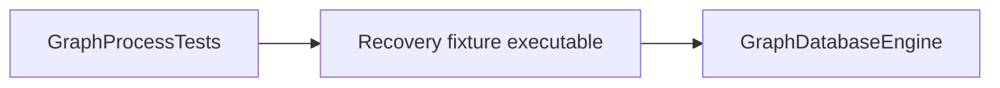

# Graph recovery fixture design

The fixture depends only on the Graph engine's public composition and session surfaces. A separate
process is required so ending the process bypasses automatic transaction disposal and rollback.
Manual page-writeback exercises recovery of physical pages containing uncommitted logical writes;
the WAL commit record determines which effects remain after reopening.

The diagram shows the fixture and test dependencies described above.

