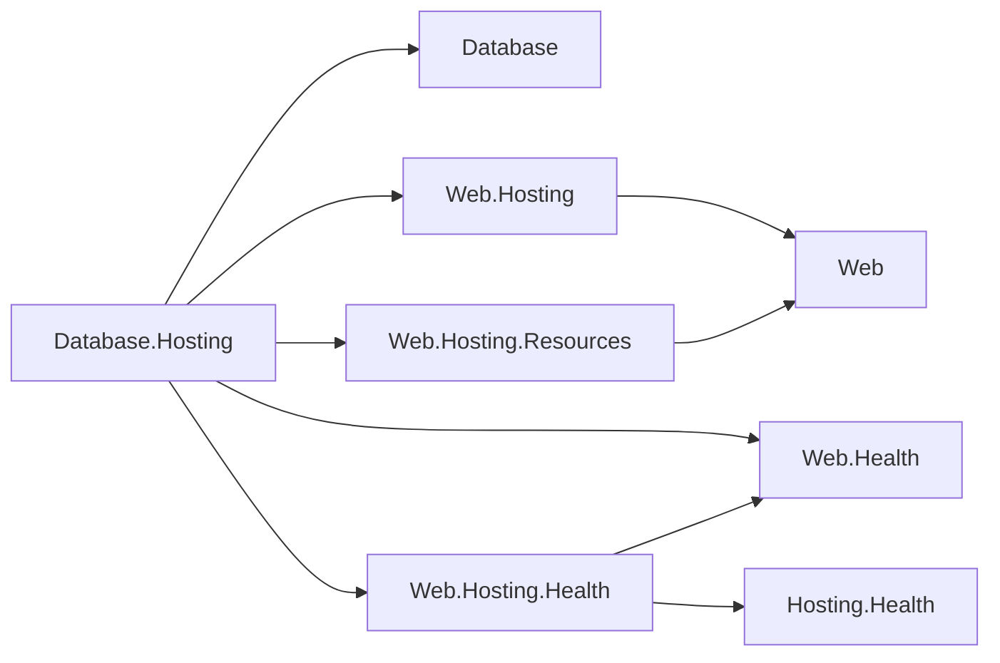

# Assimalign.Cohesion.Database.Hosting — Design

## Design intent

`DatabaseApplication` is the standalone host for the database resource. Per the
Cohesion hosting model, each resource type runs as its own `Host<TContext>`
subclass owning its own lifecycle in its own process; this project is that hosting
shell — and, since the 2026-07-13 redesign, it is **composition-only in the
strictest sense**: it wraps composed `IDatabaseServer` instances generically as
endpoint host services, runs any additional services the composition root adds,
and implements the root's application-builder seam. It owns no server machinery
(servers are per-model, implemented inside the model packages — the SQL model's
`SqlDatabaseServer` lives in `Database.Sql`), no engine lifecycle
(engines are data machines — operational from creation, disposed by their
composition root), and no worker scheduling (engines own their loops
unconditionally). Its same-area references remain the area root only. The
non-area plain `Hosting` package supplies lifecycle, `Hosting.Resources` supplies the
opt-in resource runtime/control-plane contracts, and `Hosting.Health` supplies health
contribution contracts, while
private cross-area `Web.Hosting`, `Web.Hosting.Resources`, `Web.Hosting.Health`, and `Web.Health` references implement the
enabled resource's HTTP admin surface without exposing Web types publicly.

The admin surface uses private Web implementation references while Database exposes only its own area contracts.

## Execution model

Threading is a per-service decision made by static dispatch from the execution
menu defined by `Assimalign.Cohesion.Hosting` (see
`libraries/Hosting/Assimalign.Cohesion.Hosting/docs/DESIGN.md`):

| Service | Menu member | Why |
| --- | --- | --- |
| `DatabaseServerHostService` (one per registered server) | direct `IHostService` adapter | awaits `IDatabaseServer.StartAsync`, so the host cannot report `Started` until the listener is accepting; delegates stop to the server's bounded graceful drain |
| `DatabaseAdminEndpointService` (enabled resources only) | `BackgroundService` | owns the private asynchronous Web control-plane host for the application lifetime |
| Composition-root services (`DatabaseApplicationOptions.Services`) | caller's choice | includes `DefaultDatabaseProvisioner`, registered by `Provision`/`AddDatabase` |

Registration order is the additional services first, then one endpoint service
per registered server. A host starts services in registration order and stops
them in reverse, so **the servers start last and drain first** — the unchanged
ordering rule — and provisioning-style services complete before any endpoint
accepts. `DatabaseApplication` rejects inherited concurrent-start/concurrent-stop
options and snapshots the remaining host lifecycle settings at construction, so
a retained mutable options object cannot weaken that invariant after `Build()`.

Everything that used to sit between those two rows is gone by design:

- **No engine host services.** Engines have no `StartAsync`/`StopAsync` to
  forward (the data-machine decision — root DESIGN.md). The composition root
  creates engines before building the application and disposes them after
  stopping it; durability rides engine disposal, not host stop.
- **No worker slot services.** The engine spawns its own worker loops at
  creation — the latency-critical WAL flusher and page write-back on dedicated
threads the engine itself owns (the Lane-H dedicated-thread guardrail is
satisfied inside the engine), checkpoint/maintenance on engine-owned timers —
  and quiesces them on dispose. The host cannot schedule, claim, enable, or
disable them. See "Worker ownership" below for the reversal record.

## Worker ownership — engine-owned, always (the claim handshake is gone)

The #902 delivery (2026-07-12) let a host *claim* engine workers before engine
start and drive them on its own execution menu (`TryClaim`/`Release`, per-kind
slot options, four named slot services). The 2026-07-13 redesign **deleted that
model**: `IDatabaseEngineWorker` is now observational (name, kind, cadence), the
pump lives on the guided base for the engine's internal use, and the engine is
the one and only scheduler of its loops, from creation to disposal.

Why the reversal: R10 (engine self-sufficiency) already forced the worker
*bodies* and their default scheduling into the engine — the claim handshake only
added a second possible owner for the *pump*, and with it a two-owner protocol
whose failure modes (claim races between host composition and engine start,
disabled slots silently handing loops back, half-claimed inventories across
restarts) each needed rules, tests, and documentation. No composition ever needed
a different scheduler than the engine's own — the host's dedicated-thread slots
were re-implementing exactly the threads the engine spawns for itself. One owner
means a worker can never run twice, with no handshake to verify. The execution
menu still matters for the services this module *does* compose: the admin Web host
is asynchronous background work, while each database server uses its explicit
start-ready/stop-drained lifecycle. Engine durability threading remains the
engine's internal affair.

What survives for hosts: observability. `IDatabaseEngine.Workers` (name, kind,
interval) and the engine's observational `State` (`Running`/`Faulted`/`Disposed`)
are the surface a health endpoint (#168) reads; a worker fault flips the engine
to `Faulted` without stopping service (durability self-help holds — see the Sql
DESIGN.md).

## Why-this-not-that

### The server machinery moved out — servers are per-model (2026-07-13, settled 2026-07-14)

The wire-protocol server was folded INTO this module on 2026-07-12 (mirroring
`Web.Server`→`Web.Hosting`). The 2026-07-13 redesign **half-unwound that fold**:
the approved architecture makes servers per-model (`SqlDatabaseServer` fronting
one `SqlDatabaseEngine`), and COHRES001 makes this module unreferenceable by
area libraries — so server machinery living here is unreachable by exactly the
packages that need it. The machinery's placement then settled through evidence
discipline (area DESIGN decision log): a shared `Database.Server` base above
the root (2026-07-13) → judged premature abstraction from n=1 and folded into
`Database.Sql` (2026-07-14) → the second model server fired the recorded
extraction trigger and the proven core was extracted back out → **the owner
reviewed the extraction evidence and chose per-model duplication (2026-07-14,
the settled placement)**: the shared library was removed and each model package
carries its own full copy of the machinery (the preserved evidence table lives
in the area DESIGN §3.10). The root's `IDatabaseServer` contract is the only
area-wide server requirement. What the 2026-07-12 fold got right is retained
here: composing servers into a host process is this module's job — it wraps any
`IDatabaseServer` in `DatabaseServerHostService`, registered last. This module
references **no model package**: it composes through the root's
`IDatabaseServer` seam alone, which is what keeps it transport-free (no
`Connections` reference).

### One host service shape per server, plural servers

`IDatabaseApplicationContext.Servers` is plural — one server per model the
application serves. Each registered server is wrapped in its own
`DatabaseServerHostService`; they start in registration order and drain in
reverse. The earlier singular `DatabaseApplicationOptions.Server` shape (one
endpoint per application, enforced by an `AddServer`-throws-on-second rule)
was superseded by the per-model server decision — plurality is structural now.

### The host drives servers, not engines

The pre-redesign application registered a per-engine lifecycle service first so
engines started before everything and stopped last. With engines as data
machines there is nothing to drive: an engine registered on the application
(`DatabaseApplicationOptions.Engines`) is an **observational** entry on the
context — the composition root that created it owns it. Durability-on-shutdown
moved from "host stops engines last" to "composition root disposes engines after
the host stops," which a customer executable does in dependency order
(application → server-owned listener → engine).

## Ambient resource configuration

The legacy `DatabaseHostConfiguration` and resource-specific environment conventions are
removed. `DatabaseApplication.CreateBuilder(args)` consults
`Hosting.Resources` `ResourceRuntime.Current` only when the calling executable has an
assembly-keyed default-control-plane registration. Its typed ambient endpoints, mounts, settings,
references, and environment are then the resource contract; a plain builder does
not consume the ambient context. Engine and wire-server options stay code-first in
the customer's `Program.cs`.

## The builder-first composition surface

`DatabaseApplication.CreateBuilder()` is the composition entry point, following
the `WebApplication.CreateBuilder()` idiom. The split of responsibilities:

- **The root's `IDatabaseApplicationBuilder`** carries what model packages need:
  engine registration (`AddEngine` — server-less, embedded registrations) and
  server registration (`AddServer` — an instance, or a factory deferred to
  `Build` that receives the **application context**, mirroring the Web area's
  context-receiving factory). The root has no `AddService` member and references no
  hosting library (O34). Model verbs like `Database.Sql`'s
  `AddSqlDatabase(...)` / `AddSqlServer(...)` compose against this seam only, so
  a model registers itself **without knowing the hosting implementation** — registration
  remains values and typed factories only (no container).
- **This module's `DatabaseApplicationBuilder`** implements the seam over a
  `DatabaseApplicationOptions` instance and exposes it (`builder.Options`) for
  hosting-specific settings and fully manual option composition. Its `AddService`
  pair accepts a plain Hosting service instance or a `Func<DatabaseApplicationContext, IHostService>`
  factory. The root-level `AddServer` keeps its `IDatabaseApplicationContext` factory. Services preserve
  registration order, start before servers, and stop after servers drain. Deferred service
  and server factories resolve at `Build()` in their respective registration
  order against the live context (instance registrations are wrapped as trivial
  factories, so ordering is registration-faithful across each pair of overloads).
  Service factories resolve after the server registry is complete, so they receive
  the final engine and server view; lifecycle materialization still places every
  service ahead of every server adapter. `Build()` returns the concrete
  `DatabaseApplication` (the guided richer signature; the interface member
  forwards), which implements the root's `IDatabaseApplication` — `Context` +
  start/stop, the Web shape.
- **Model packages compile declarations before they reach Hosting.**
  `AddDatabase(engine, name, schema)` receives the model's immutable `CompiledSchema`,
  checks its database identity, and returns/stores it by registering
  `Provision(engine, schema)`. SQL callers use `SqlSchema.Create` and `SqlSchemaCompiler`
  from `Database.Sql.Schema` in their composition root. This compile-time adaptation
  keeps Hosting's same-area dependency limited to the area root (COHRES002);
  no schema vocabulary, interface members, or lifecycle wiring move into Hosting.
  `DefaultDatabaseProvisioner` opens or
  creates the logical database, requires its `IDatabaseSchemaProvisioner` model
  seam, and reconciles that compiled schema before startup can advance. The raw
  DSL never reaches an engine. Because every additional service is materialized
  before every server wrapper, schema apply precedes accept even when a server
  verb appears earlier in `Program.cs`. The provisioner creates the database only
  when open reports the root's exact `DatabaseNotFoundException`; validation,
  migration, and unrelated database failures propagate and fail application
  startup.
- Direct construction (`new DatabaseApplication(options)`) remains supported for
  fully manual hosts; the builder is sugar over the same options object, never a
  second composition model.

A customer resource executable is the composition root: it registers a model
engine, declares databases through `AddDatabase`, fronts the engine with its
model's server verb, then builds and runs the host.

## Enabled-resource control plane

`DatabaseApplication.CreateBuilder(args)` uses the process entry assembly for standalone
execution and asks the `Hosting.Resources` `ResourceRuntime` for its generated registration.
During an in-process resource invocation, the ambient invocation's logical member assembly
takes precedence; no caller-stack reflection is required. When one is present, `Build()` adds
builder health checks and registered
`Hosting.Health` `IHealthContributor`s to the isolated plane, including
`DatabaseApplicationContext`. The context de-duplicates registered and
server-fronted engines by identity: `Running` is healthy, `Faulted` is degraded,
and `Disposed` (or an unknown state) is unhealthy; its diagnostic data carries the
engine state and full worker name/kind/cadence inventory.

`Build()` also observes every ambient endpoint, attaches the database host for
graceful stop, and starts a private Web host on the ambient `admin` address.
`Web.Health` maps `/healthz`, `/readyz`, and `/livez` plus their namespaced aliases.
The single `Web.Hosting.Resources` terminal runs after those maps and handles the remaining
`/cohesion/v1/*` namespace, including endpoints, stop, commands, and unknown routes; the accepted Database command
kinds are registered through runtime-owned handlers. Readiness has a dedicated outer-host gate:
the admin listener may report startup progress while servers bind, but `/readyz`
cannot become healthy until every server has confirmed accept and the Database host
is `Started`; `/livez` remains process-oriented. Gateway-managed namespaced requests
reaching the terminal require an ES256 bootstrap JWT (application issuer, gateway subject,
resource audience, kid, signature, required claims, and lifetime at most 24 hours). Missing
or invalid tokens return 401 with Bearer; a valid wrong-audience token returns 403 without
a challenge. Build validates the managed identity and P-256 trust key only when the admin
listener is installed. A managed resource without that listener still builds.

The six mapped probes retain the database.accepting readiness gate and run before the terminal.
Thus the three namespaced probes are unauthenticated aliases of the already-public bare probes;
Web and filler hosts authenticate their namespaced probes. All other namespaced routes use the
terminal as sole authorizer. No gateway name means no authentication, even with an ambient
credential. Stop is deferred until the 202 response has been written by the default Web server. A plain application created with the
no-argument or options overload receives none of this behavior.

The private Web references are the sanctioned cross-area implementation seam;
no Database public API exposes a Web type, and `Database.Hosting` never
references `Database.ApplicationModel`.

## Status and non-goals

- No DI-container surface on the builder — registration stays values and typed
  context factories only, per the area composition rules (`*.Hosting` remains
  the DI seam for everything else).
- No governance/quotas (#167). The application-context engine/worker aggregate and
  HTTP delivery seam are present; model-specific diagnostics can contribute
  additional `Hosting.Health` `IHealthContributor`s later.
- No server machinery — servers are per-model and live inside the model
  packages (`SqlDatabaseServer` in `Database.Sql`); this module composes them
  through the root's `IDatabaseServer` seam.
- The admin surface is control-plane-only and separate from every database wire
  protocol server. It exists only for an enabled resource registration.

## AOT posture

Static composition: the composition root hands the application its servers and
engines; nothing is discovered at runtime. No reflection.

## Declarative command delivery

Enabled hosts register database.add-database and database.add-principal handlers when advertised by
their generated control plane. The database payload is UTF-8 JSON with database and optional engine;
the key is `engine/database` when an engine is supplied, otherwise the database name. Database names
cannot contain `/`; engine names may contain it, keeping the final-slash ownership identity unique.
An omitted engine requires exactly one registered or server-fronted
engine. Creation calls IDatabaseEngine.CreateDatabaseAsync and teardown calls DropDatabaseAsync,
with the shared control-plane ownership ledger gating both. Existing databases are refused rather
than adopted into a declaration that could later delete them.

The principal payload carries database and name. The existing principal builder describes startup
schema; the runtime has no principal mutation contract. database.add-principal therefore returns a
named Rejected detail explaining that boundary. It does not create an ad hoc wire management path.

The existing admin GET and POST paths and envelope remain stable. DELETE /cohesion/v1/commands uses
the same envelope. Unsupported commands return 501 with status/detail; provider refusals return 409;
blank keys return 400. Direct in-process delivery uses the same handler and ownership checks.

## HTTPS endpoint certificate contract (31t)

The enabled resource's `admin` listener consumes the shared Hosting.Resources endpoint certificate accessor. Endpoint metadata identifies an ordinary Secret mount (default `tls`), carrying one PEM leaf/private-key/chain document; existing hand-authored IdentityHub and LogSpace bundles retain the same format. Empty mounts are absent; malformed or multi-key bundles fail. TLS options are composed in Hosting from the returned leaf and chain, with no hosting-isolation exemptions or dependency changes. Plain application composition is unchanged.

## Optional telemetry (31b)

The registered resource constructor calls ResourceTelemetry.Configure using the invocation snapshot. With no gateway or telemetry endpoint, existing providers and hosted services are unchanged. When enabled, the shared Hosting.Telemetry sibling adds OTLP/HTTP JSON logging and a service registered before producers; reverse StopAsync drains producers before a flush bounded by five seconds and the host shutdown token. Logging remains composed only in Hosting. See libraries/Hosting/Assimalign.Cohesion.Hosting.Telemetry/docs/DESIGN.md for ordering and protocol limits.

The admin endpoint uses `Web.Hosting.Health.AddContributor` through the private project/framework
pair. Its defined Healthy, Degraded, and Unhealthy mappings preserve the existing status,
description, data, ready/live tags, cancellation, and failure policy. Undefined statuses now
throw through the Web health failure policy. The readiness-only `database.accepting` check
remains separate and unchanged.
