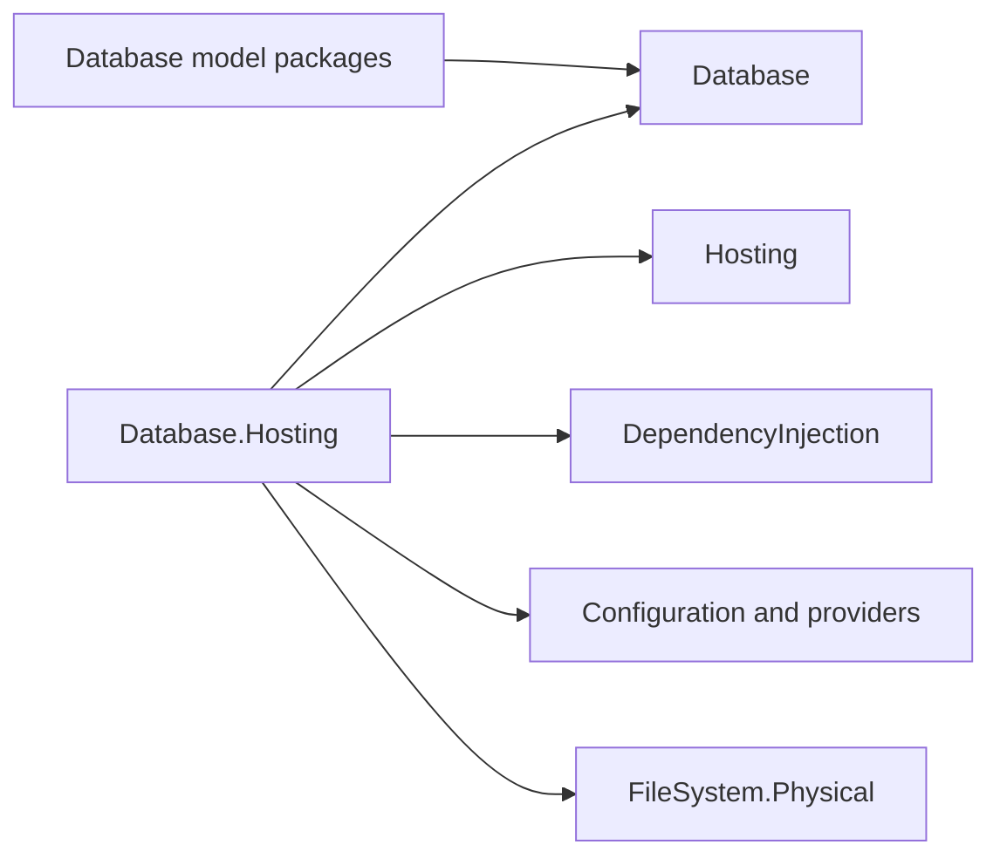

# Assimalign.Cohesion.Database.Hosting — Design

## Composition

Phase 29 implements the owner-approved [Database hosting design](../../../../docs/programs/DATABASE_HOSTING_DESIGN.md), including its nested-engine corrections. The public path is `DatabaseApplication.CreateBuilder(args)` → Add intent → one-shot `Build()` → engine access / `RunAsync()`. There is no composition `Use` method or application-builder `AddServer`.

The root builder accepts borrowed engines and dependency-free engine factories receiving the application context. Model packages supply `AddSql`, `AddDocuments`, `AddGraph`, `AddKeyValue`, and `AddBlob` using `extension(IDatabaseApplicationBuilder)`. Their callbacks run at Build against a model engine builder; worker and server factories run after that engine exists. Hosting never references a model package, resolves model services, or binds model configuration. A concrete hosting overload, `AddEngine(name, factory)`, receives built `Configuration` and `Services` explicitly.

```mermaid
flowchart LR
    Runtime["Database.Hosting"] --> Root["Database"]
    Runtime --> Host["Hosting"]
    Runtime --> DI["DependencyInjection"]
    Runtime --> Config["Configuration and providers"]
    Runtime --> FS["FileSystem.Physical"]
    Model["Database model packages"] --> Root
```

COHRES001–004 remain enforced. Existing private Web hosting/health references serve the pre-existing enabled-resource admin integration. Phase 29 adds no ApplicationModel surface, manifest, resource command, resource control plane, or orchestration behavior. The existing `ResourceRuntime.HostBuilt` hook remains in place so an installed `HostContext.Runner` still controls complete runs through `IHostRunner` / `IHostRun`.

## Build and configuration

Build consumes the builder before user code runs, even if construction fails. Registration methods and retained configuration/service facades reject late mutation. The facades reject independent Build/BuildAsync; the application is the sole owner of materialization. Legacy `Options` scalar settings and borrowed instance lists are copied at Build and cannot alter runtime registries later. The root builder has no live `Engines` property.

Construction order is optional `appsettings.json`, optional `appsettings.{Environment}.json`, environment variables prefixed `COHESION_CONFIG__`, copied command-line arguments, then explicitly registered configuration providers; later values win. Paths resolve against `Options.ContentRootPath`, defaulting to `AppContext.BaseDirectory`. Environment uses the existing Hosting default; `Local` remains `Local`. JSON reload is disabled. The default physical file system is allocated only at Build and disposed after configuration.

One Cohesion service provider is built with `EnableDynamicCode = false`, `ValidateScopes = true`, and `ValidateOnBuild = true`. This selects the interpreted resolver on JIT and NativeAOT. Hosting permits closed factories and instances only, rejects implementation-type/open-generic activation, and reserves `IConfiguration` as a borrowed registration for the application's configuration. Model construction uses explicit assignments rather than reflection-based binding. Provider-owned services must not be returned from application factories; doing so would create two owners.

Root engine factories observe preceding engine registrations. They cannot depend on later registrations. This follows the approved context-taking factory correction; names from arbitrary factories can only be validated when the factory returns. Concrete named factories reserve names at Add and must return an exact ordinal name match. Names are nonempty, case-sensitive, and unique across models. `Context.GetEngine(name)` returns a borrowed reference, typed as the root base; the root's static extension `Context.GetEngine<TEngine>(name)` returns it as the model's engine (`SqlDatabaseEngine`, …).

## Concrete types (concrete-types plan, phase 6, #1262)

The module composes the root bases, not interfaces: the area deleted every root engine-model interface in phase 6 (`database-area.md`; the plan's rows 3 to 13). `IDatabaseApplicationBuilder.AddEngine` takes a `DatabaseEngine` or a `Func<IDatabaseApplicationContext, DatabaseEngine>`, and the hosting builder's own overloads, `Provision`, `AddDatabase`, `DatabaseApplicationOptions.Engines` and `.Servers`, the context's `Engines`, `Servers` and `GetEngine` follow. What the retype changed in the module:

- **A server's engine is `server.Engine`**, the base's field, where the module read `server.Context.Engine`; the server context is gone.
- **Provisioning is a flag check.** `DefaultDatabaseProvisioner` opens or creates the database, refuses one whose `DatabaseInstance.SupportsSchemaProvisioning` is false with `NotSupportedException` naming the engine and its model, and calls `DatabaseInstance.ApplySchemaAsync`; it used to test the database for `IDatabaseSchemaProvisioner`.
- **Health and the reopen service read every engine's offline cause** through `DatabaseEngine.GetOfflineError`; until phase 6 they did so only for an engine of the root base (`engine is DatabaseEngine`), and an engine of the interface alone reported none. The reopen service reads the engine's state without guarding it, because the base folds `State` from its own fields and never throws.
- **Health no longer describes a worker whose loop failed.** It reported an engine `Faulted` with no failing worker as a registered worker whose loop escaped, "degraded until it is disposed". Only a worker that implemented the deleted `IDatabaseEngineWorker` without the base could do that; every worker derives from `DatabaseEngineWorker`, whose loop lets nothing escape. An engine reported `Faulted` with no failing worker (a worker that recovered between the two reads) is still degraded, with the generic description. Every worker now reports `failureCount`; only a failing one adds `consecutiveFailures` and `fault`.
- **The engine base enforces the nested-server rules.** `DatabaseEngine.AttachServer` refuses a server that fronts another engine and a server attached twice, so Build no longer checks a nested server against its owner or against the other nested servers; it still refuses a nested server that is also registered as a borrowed `Options.Servers` input ("A server was registered more than once.").
- **The test doubles derive from the bases** and implement only the protected cores (`RecordingEngine`, `ProvisioningEngine` and its `ProvisioningDatabase`, `RecordingServer`, `RecordingEngineWorker`, the controlled-start servers). A double's state is the base's: a test faults an engine by failing a pass of its worker, and disposes it to make it `Disposed`; a double's server stop core runs once, and never after a failed start, so a host's rollback of a server whose start failed reaches no core.

## Nested servers and ownership

Application Build flattens each engine's `Servers` snapshot in engine/attachment order. Engines own these servers and dispose them before workers and databases. The application drives their Start/Stop through `DatabaseServerHostService` but never enrolls them for a second disposal. A server must front its owning engine, which the engine base enforces when the server is attached. Legacy `Options.Servers` remains a borrowed input path; its referenced engines are implicitly borrowed and included in the runtime registry. Duplicate lifecycle references and conflicting engine names fail Build.

| Input | Disposal owner |
| --- | --- |
| `AddEngine(instance)` / `Options.Engines` | Caller |
| Root or hosting `AddEngine(factory)` / model Add verb | Application after Build; builder on failed Build |
| Model builder worker/server factory | Engine |
| `Options.Servers` | Caller; application drives start/stop only |
| `AddService(instance)` / `Options.Services` | Caller |
| `AddService(factory)` | Application if disposable |
| Provider-created service | Provider |
| Provider instance registration | Caller |
| Configuration and default configuration file system | Application |

A factory transfers a fresh product, and cleans up partial allocations if it throws before returning. Detectable borrowed/owned aliases are rejected before re-enrollment. Fresh invalid products are enrolled before validation so rollback disposes them. Build compensation attempts owned services, engines (including their servers), provider, configuration, and file system in reverse dependency order. Synchronous Build bridges asynchronous cleanup on a worker without capturing the caller's synchronization context. Original construction exceptions are preserved; cleanup failures produce an aggregate with the original first. Files created by a factory are never silently deleted.

## Runtime lifetime

Additional services start in registration order, then servers; shutdown drains servers first and stops services in reverse. Compiled-schema `Provision` / `AddDatabase` uses the existing provisioner and runs before listener accept. Named overloads resolve deferred engines at Build. Instance overloads require the engine to belong to the composition.

`DatabaseApplication` remains `Host<DatabaseApplicationContext>` and its context remains `HostContext` / `IHealthContributor`. `Run`, `RunAsync`, and `AsService` use the Hosting extensions. Embedded applications can use engines immediately after Build, or Run to wait for host shutdown without a listener.

The application permits one start lifecycle. Repeated Start while started is a host no-op; restart after Stop or a failed start is rejected through the protected start hook, including interface/Run paths. Stop before first Start does not consume the attempt. Concurrent Start/Stop/Dispose is unsupported; concurrent Dispose calls alone share one cleanup task. Dispose is idempotent, stops if needed, and attempts all application-owned roots after failures. Provider/configuration outlive products that depend on them. Sessions remain caller-owned and must finish before application disposal. Borrowed SQL/KeyValue servers may terminally close their listeners during Stop despite remaining caller-owned for disposal.

Health observes distinct engines, states and workers from the frozen runtime registry. Existing enabled-resource admin endpoints, telemetry order and health aggregation remain compatible; this phase does not extend those systems.

Health also reports offline databases (#1243). A database whose journal or data fsync failed, whose journal's append buffer failed to drain (#1252), whose header slot write failed (#1268), or whose engine gave up on it after a background worker kept failing on it or its journal passed the engine's cap (owner decision 25) refuses every request until it is reopened, while its engine stays `Running`, so the engine state alone left health `Healthy`. The contribution reads each engine's `OfflineDatabases`, adds the databases the reopen service is still reopening (below), records `engine.N.offlineDatabaseCount`, `engine.N.offlineDatabases`, the total `offlineDatabaseCount` and `reopenOfflineDatabases`, and for each offline database `engine.N.offline.M.name`, its `cause` (the `StorageOfflineCause` name, read through `DatabaseEngine.GetOfflineError`) and, once a reopen failed, `reopenAttempts` and `reopenFault` (the exception type). It is `Unhealthy` while any database is offline, naming each as `engine/database (cause; n failed reopen attempt(s), last ExceptionType)`, and turns healthy again once every one is open. Like the worker faults, the output carries exception types only, never messages, because the endpoint is unauthenticated. Without the reopen service it turns healthy once the database is reopened (`OpenDatabaseAsync`, in process) or the process restarts and opens it again; an orchestrator that restarts an unhealthy process recovers it the way PostgreSQL's postmaster does after a `PANIC` (`restart_after_crash`, on by default, `src/backend/postmaster/postmaster.c:248`; the "reinitializing" restart at `3245-3252`). Hosting has no remote reopen command (an open owner decision, recorded with the #1243 review).

## Reopening offline databases (owner decision 22 of 2026-10-06)

A running application reopens a database its engine reports offline by itself, with exponential backoff and jitter, until the reopen succeeds or the application stops. It is the module's own lifecycle service, `Internal/DatabaseReopenService`, registered at Build after the other services and before the servers (so it starts before them and stops after they drained), and owned by the application. `DatabaseApplicationOptions` configures it: `ReopenOfflineDatabases` (on by default; off leaves every offline database to the operator and composes no service), `ReopenInitialDelay` (one second, the engines' worker failure backoff) and `ReopenMaximumDelay` (one minute), validated at Build (the initial delay positive, the maximum at least the initial delay and at most `DatabaseApplicationOptions.MaximumReopenDelay`, the longest a timer waits) and copied with the other host settings.

- **It reopens through the engine's own path.** The service polls each engine of the frozen registry (the server-fronted ones included) for `DatabaseEngine.OfflineDatabases`, at most once a second, or once per initial delay when that is shorter. A database it finds is reopened through `DatabaseEngine.OpenDatabaseAsync`: the engine closes the offline instance, which writes nothing, and opens the database again from its files, so the open's recovery decides every commit that was not confirmed (#1243), the decision-33 path a caller of `OpenDatabaseAsync` takes. The reopen returns the engine's new instance to the engine's registry; servers resolve databases by name, so their next session gets it.
- **Backoff and jitter.** The first attempt waits a random time between half the initial delay and the initial delay; after the n-th failed attempt the next waits between half and all of `min(maximum, initial × 2^n)`. A reopen that keeps failing is tried less and less often, and two databases that failed together do not retry in lockstep. RavenDB's database landlord retries a database whose start failed after a randomized delay the same way (`src/Raven.Server/Documents/DatabasesLandlord.cs:1504-1510`), and lets the next access load a database whose load faulted (`:831-835`).
- **A database that flaps keeps its backoff.** The service remembers each successful reopen for `ReopenMaximumDelay`. A database found offline again within that window starts its new episode at the step after the last one its previous episode reached (`min(maximum, initial × 2^k)`, k the attempts of its earlier episodes), not at the initial delay; one found later starts over. A fault the reopen does not clear (a version purge or page write-back that keeps failing after recovery succeeded) therefore takes the database offline and back less and less often, instead of every few seconds with a full recovery under the engine's lock each time and in-flight commits failed as unconfirmed. Before the review it started over at the initial delay, and a version-purge fault made the database flap. At the engines' default worker failure limit (a hundred passes, owner decision 35 of 2026-10-07) a worker's give-up takes about a hundred seconds of failed passes, longer than the one-minute default window, so at the defaults only a database a device failure takes offline (at once) carries its backoff over; a window tied to the engines' limits is an open owner item (concrete-types plan §12).
- **Databases are reopened side by side.** Each database's attempt runs on the thread pool, and the loop goes on without awaiting it: an attempt that hangs (a recovery stuck in its device) holds back that database only, while the loop keeps finding and reopening the others, other engines' included. One attempt or check per database runs at a time. Before the review the loop awaited each attempt in turn, so one hung recovery held every other database's reopen and stopped discovery.
- **It never reopens a database that was dropped.** Before its first attempt the service lets go of a database its engine no longer lists: someone reopened it, dropped it, or its holder closed it (decision 33: the engine forgets it). After a failed attempt the engine no longer lists the database either, because its failed open left it closed, so the service keeps it until a reopen succeeds; a reopen that reports `DatabaseNotFoundException` means it was dropped meanwhile, and the service lets it go. A disposed engine's databases are let go.
- **A database reopened elsewhere is let go at the next poll.** While a database whose attempt failed is not listed offline, each poll also checks whether its engine holds it open again (`TryGetDatabase`) and online (not in `OfflineDatabases`): an operator or another caller reopened it. The service then lets it go ("it was reopened elsewhere") and makes no further attempt, so health turns `Healthy` within a poll instead of after the backoff, which can be as long as `ReopenMaximumDelay`. The check waits for the engine's registry lock, which an open holds through its recovery, so it runs on the thread pool like an attempt, never on the loop's thread, and is awaited until the stop signal only. Health itself never takes that lock: it reports the service's pending entry until the poll lets it go.
- **Health stays unhealthy until the reopen.** The service's pending reopens (`GetPendingReopens`) are part of the health contribution above, so a database whose reopen keeps failing stays `Unhealthy`, with its cause and attempts, though its engine no longer lists it; health turns `Healthy` with the successful reopen. The engine ends its workers' failure records of a database once it took it offline, and again when the reopen closes the offline instance (owner decision 25 review), so the engine reports `Running`, not `Faulted`, and health is not left `Degraded` by the failure that took the database offline.
- **Stop never waits for it.** Every wait observes the service's stop signal, and an attempt or check runs on the thread pool and is awaited until that signal only: a stop during a backoff returns at once, and a stop during an attempt returns without it. The loop waits for its attempts and checks in flight as it ends, each of which ends at the stop signal. The attempt then finishes on its own (an engine's open runs to its end under the engine's lock, and the engine's disposal waits for that lock), and its outcome is still written to the event source. A failure of the loop itself is written and the next poll goes on: nothing ends the loop before the application stops.
- **An embedded application that never starts** reopens nothing: the service runs between Start and Stop, like the servers. Its health still reports the offline databases.
- **Tests.** `DatabaseReopenTests` runs a real in-memory SQL engine whose database a registered checkpoint worker takes offline through the engine's own escalation (a worker failure limit of one, owner decision 25). Reopen faults are injected through the service's internal `Reopen` hook, which wraps the engine's reopen, because the engines' storage strategies, where device faults are injected, are internal to their models: offline, unhealthy with `CheckpointFailures`, failing reopens, the fault clears, reopened and healthy with its rows; a reopen that keeps failing waits at least half of each backoff step and stays unhealthy; a stop during a ten-second backoff, and during an attempt that hangs, returns within two seconds; a database dropped before its first attempt, or after a failed one, is never reopened; a database an operator reopens after a failed attempt is let go and health is `Healthy` within two and a half seconds, with no second attempt; a database taken offline again right after each of four reopens waits longer each time (the fourth at least half of `initial × 8`); one engine's attempt that hangs leaves another engine's database to be reopened, and health names only the hanging one; the off switch. The helper takes a database offline through the engine's queued give-up and waits for it, and no longer runs a second worker pass to end the worker's record: the engine ends it.

## Diagnostics

The module raises its own events through one internal event source, named for the assembly: `Assimalign.Cohesion.Database.Hosting` (`src/Internal/EventSource/DatabaseHostingEventSource.cs`, owner decision 22). Every finding, reopen attempt and outcome is one event, so an application's logging, through `Assimalign.Cohesion.Logging.EventSource`, logs each under the category `Assimalign.Cohesion.Database.Hosting`; a library describes its own behavior through an event source and takes no logging dependency (`.claude/rules/event-source.md`).

| Id | Event | Level | Payload |
| --- | --- | --- | --- |
| 1 | `OfflineDatabaseFound` | Warning | `engineName`, `database`, `cause` (the `StorageOfflineCause` name, or `Unknown`), `delayMilliseconds` (until the first attempt) |
| 2 | `ReopenAttempted` | Informational | `engineName`, `database`, `attempt` (from one) |
| 3 | `ReopenSucceeded` | Informational | `engineName`, `database`, `attempts` |
| 4 | `ReopenFailed` | Warning | `engineName`, `database`, `attempt`, `exceptionType` (full name), `exceptionMessage`, `retryMilliseconds` |
| 5 | `ReopenAbandoned` | Informational | `engineName`, `database`, `reason` (dropped, closed or reopened elsewhere, or its engine disposed) |
| 6 | `ReopenLoopFailed` | Error | `exceptionType`, `exceptionMessage` |

No counters: the attempts are on the health contribution. The engine's own events (a worker's failures, the database it took offline) are on the root's `Assimalign.Cohesion.Database` source. `DatabaseHostingEventSourceTests` checks the name, the strict manifest, and the events of a real reopen once each with their payloads.

The public static `CreateBuilder()` on each model engine provides deferred standalone composition and the bridge for hosting-aware engine factories that also need nested servers. It returns the model's sealed engine builder (`SqlDatabaseEngineBuilder`, …), whose `AddServer` factory receives the model's engine typed, since phase 4 of the concrete-types plan. Configuration and service reads still occur in the hosting callback, outside the model package.
