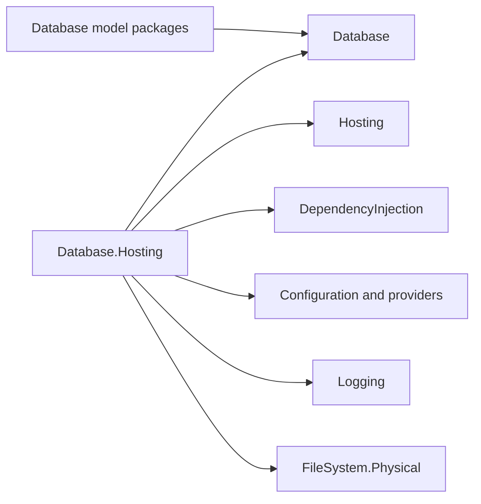

# Assimalign.Cohesion.Database.Hosting — Design

## Composition

Phase 29 implements the owner-approved [Database hosting design](../../../../docs/programs/DATABASE_HOSTING_DESIGN.md), including its nested-engine corrections. The public path is `DatabaseApplication.CreateBuilder(args)` → Add intent → one-shot `Build()` → engine access / `RunAsync()`. There is no composition `Use` method or application-builder `AddServer`.

The root builder accepts borrowed engines and named, dependency-free engine factories receiving the application context (`AddEngine(name, factory)`). Model packages supply `AddSql`, `AddDocuments`, `AddGraph`, `AddKeyValue`, and `AddBlob` using `extension(IDatabaseApplicationBuilder)`; each takes the engine name as its first argument and an `Action<XEngineBuilder>` (owner decision 52 of 2026-10-09). Their callbacks run at Build against a model engine builder created for that name; worker and server factories run after that engine exists, and every model engine opens or creates the databases its builder declares before its build returns, a SQL engine provisioning their schemas too (§Provisioning, below). Since B3 of the engine extensibility design the five builders share one shape: `Options` (values only, copied at the engine's build; no options type carries an engine name), `AddDatabase`, `AddServer(options => …)` beside `AddServer(engine => …)` for the models with a server (Sql, KeyValue, Graph, Blob), `AddWorker`, and `Build`/`BuildAsync`. Hosting never references a model package, resolves model services, or binds model configuration. The concrete hosting overload of the same shape, `AddEngine(name, factory)`, receives the built host-level pieces explicitly (`DatabaseApplicationBuildContext`, below).

```mermaid
flowchart LR
    Runtime["Database.Hosting"] --> Root["Database"]
    Runtime --> Host["Hosting"]
    Runtime --> DI["DependencyInjection"]
    Runtime --> Config["Configuration and providers"]
    Runtime --> Logging["Logging"]
    Runtime --> FS["FileSystem.Physical"]
    Model["Database model packages"] --> Root
```

COHRES001–004 remain enforced. Existing private Web hosting/health references serve the pre-existing enabled-resource admin integration. Phase 29 adds no ApplicationModel surface, manifest, resource command, resource control plane, or orchestration behavior. The existing `ResourceRuntime.HostBuilt` hook remains in place so an installed `HostContext.Runner` still controls complete runs through `IHostRunner` / `IHostRun`.

## Build and configuration

Build consumes the builder before user code runs, even if construction fails. Registration methods and the service container reject late mutation, and so does the logging builder once Build built its factory. The `Options` host settings are copied at Build and cannot alter the application later. The root builder has no live `Engines` property. `DatabaseApplicationOptions` holds host policy only: its borrowed `Engines`, `Servers` and `Services` lists, the `DatabaseApplication(options)` constructor and `CreateBuilder(options)` were deleted (owner decision 54 of 2026-10-09), so there is one registration path per kind of thing (`AddEngine`, `AddService`, and a server on its engine's builder).

### Host-level pieces (owner request of 2026-10-08)

The builder exposes the four host-level pieces `WebApplicationBuilder` exposes, as the same concrete types, created the same way when the builder is created (`Web.Hosting`'s `WebApplicationBuilder` constructor):

| Builder member | Type | Created | At Build |
| --- | --- | --- | --- |
| `Environment` | `HostEnvironment` | from `Options.Environment` (`production` when unset) and `Options.ContentRootPath`, which an enabled resource's ambient context sets first | registered as `IHostEnvironment`; the application context's `Environment` |
| `Configuration` | `ConfigurationManager` | empty; `CreateBuilder(args)` adds the default sources | registered as `IConfiguration`; owned and disposed by the application |
| `Logging` | `LoggerFactoryBuilder` | empty; an enabled resource's telemetry adds its exporter | built once into the application's `LoggerFactory`, registered as `ILoggerFactory`, owned and disposed after the provider |
| `Services` | `ServiceProviderBuilder` | `EnableDynamicCode = false`, `ValidateOnBuild`, `ValidateScopes` | checked, given the three registrations above, made read-only, built once into the application's `ServiceProvider` |

The root `IDatabaseApplicationBuilder` gains none of them: model packages and other feature code compose against the root without the container, configuration or logging (COHRES004, `resource-areas.md`). The engine factories of `AddEngine(name, factory)` run at Build, after the container closed, so their `DatabaseApplicationBuildContext` carries the built counterparts, not the builders: `Environment` (`HostEnvironment`, the builder's instance), `Configuration` (`ConfigurationManager`, the builder's instance), `Services` (the built `ServiceProvider`; the DependencyInjection library's provider type is public, so the context names it rather than `IServiceProvider`) and `LoggerFactory` (the built `LoggerFactory`). One build context exists per application, and every named factory receives it.

`CreateBuilder(args)` adds the default configuration sources when it creates the builder, in order: optional `appsettings.json` and `appsettings.{Environment}.json` under the content root, environment variables prefixed `COHESION_CONFIG__`, then the ambient resource settings as `--key=value` arguments ahead of the caller's arguments, as Web adds them; later values win, and a provider the application adds afterwards wins over all of them. Environment uses the existing Hosting default; `Local` remains `Local`. JSON reload is disabled. `CreateBuilder()` and `new DatabaseApplicationBuilder(options)` start with an empty configuration, as Web's do. The manager loads each provider as it is added, so a provider that fails to load fails the call that added it, not Build, and a provider added after Build loads into the running configuration; engine factories read the configuration once, at Build, so nothing is recomposed. The default sources' physical file system is allocated when the builder is created and owned by the application from Build, which disposes it after the configuration.

The content root `CreateBuilder(args)` reads those files under is the ambient resource's `ContentRootPath` when an enabled resource sets one, else `AppContext.BaseDirectory`: the overload creates fresh options and loads the sources before it returns, so a plain application cannot set the path for it. `Options.ContentRootPath`, like `Options.Environment`, applies to `new DatabaseApplicationBuilder(options)`, and only as the builder is created: both are read into `Environment` then, a later change to `Options` changes neither, and Build's options snapshot takes both from `Environment`, so the application's options and its context never disagree.

`Build` creates the application's one service provider and one logger factory. `Services` and `Logging` are the concrete builders, so a caller can still build them directly: `((IServiceProviderBuilder)builder.Services).Build()` yields a separate provider the application never uses, which creates its singletons a second time and is the caller's to dispose, and `builder.Logging.Build()` yields a separate logger factory, after which the application's own Build fails because the logging builder builds once. `WebApplicationBuilder` exposes the same two builders the same way; the deferred facades they replace (below) refused both calls.

*Before the owner request,* the builder exposed `IConfigurationBuilder Configuration` and `IServiceProviderBuilder Services` as deferred registration facades that loaded nothing until Build, refused their own `Build`, and took the environment and content root from the options at Build; the build context carried `IConfiguration` and `IServiceProvider` only, and there was no logging builder (the enabled-resource telemetry built a factory nothing used). Every `CreateBuilder` overload loaded the default sources at Build.

One Cohesion service provider is built with `EnableDynamicCode = false`, `ValidateScopes = true`, and `ValidateOnBuild = true`. This selects the interpreted resolver on JIT and NativeAOT. Hosting permits closed factories and instances only, rejects implementation-type/open-generic activation, and reserves `IHostEnvironment`, `IConfiguration` and `ILoggerFactory` for the application's own pieces, which Build registers as borrowed instances. Model construction uses explicit assignments rather than reflection-based binding. Provider-owned services must not be returned from application factories; doing so would create two owners.

Root engine factories observe preceding engine registrations. They cannot depend on later registrations. Every engine is registered by name (owner decision 52 of 2026-10-09): a borrowed engine by its own `Name`, a factory by the name its registration gives, which the factory's product must match exactly (ordinal). The name is reserved at Add, so a duplicate is refused there, before any factory runs; the nameless factory overload, whose product's name could only be checked once the factory had returned, is deleted, because a model's factory now opens and provisions databases, which a duplicate engine must never reach (the duplicate would have run against the same data path). Names are nonempty, case-sensitive, and unique across models. `Context.GetEngine(name)` returns a borrowed reference, typed as the root base; the root's static extension `Context.GetEngine<TEngine>(name)` returns it as the model's engine (`SqlDatabaseEngine`, …).

## Concrete types (concrete-types plan, phase 6, #1262)

The module composes the root bases, not interfaces: the area deleted every root engine-model interface in phase 6 (`database-area.md`; the plan's rows 3 to 13). `IDatabaseApplicationBuilder.AddEngine` takes a `DatabaseEngine`, or (since B1) a name and a `Func<IDatabaseApplicationContext, DatabaseEngine>`, and the hosting builder's own overloads and the context's `Engines`, `Servers` and `GetEngine` follow. What the retype changed in the module:

- **A server's engine is `server.Engine`**, the base's field, where the module read `server.Context.Engine`; the server context is gone.
- **Provisioning was a flag check** until B1 deleted it: `DefaultDatabaseProvisioner` opened or created the database, refused one whose `DatabaseInstance.SupportsSchemaProvisioning` was false, and called `DatabaseInstance.ApplySchemaAsync`; it had tested the database for `IDatabaseSchemaProvisioner` before phase 6.
- **Health and the reopen service read every engine's offline cause** through `DatabaseEngine.GetOfflineError`; until phase 6 they did so only for an engine of the root base (`engine is DatabaseEngine`), and an engine of the interface alone reported none. The reopen service reads the engine's state without guarding it, because the base folds `State` from its own fields and never throws.
- **Health no longer describes a worker whose loop failed.** It reported an engine `Faulted` with no failing worker as a registered worker whose loop escaped, "degraded until it is disposed". Only a worker that implemented the deleted `IDatabaseEngineWorker` without the base could do that; every worker derives from `DatabaseEngineWorker`, whose loop lets nothing escape. An engine reported `Faulted` with no failing worker (a worker that recovered between the two reads) is still degraded, with the generic description. Every worker now reports `failureCount`; only a failing one adds `consecutiveFailures` and `fault`.
- **The engine base enforces the nested-server rules.** `DatabaseEngine.AttachServer` refuses a server that fronts another engine and a server attached twice, so Build no longer checks a nested server against its owner or against the other nested servers. Every server reaches the application through its engine since B1 deleted the borrowed `Options.Servers` input.
- **The test doubles derive from the bases** and implement only the protected cores (`RecordingEngine`, `RecordingServer`, `RecordingEngineWorker`, the controlled-start servers; the `ProvisioningEngine` double left with the provisioner in B1). A double's state is the base's: a test faults an engine by failing a pass of its worker, and disposes it to make it `Disposed`; a double's server stop core runs once, and never after a failed start, so a host's rollback of a server whose start failed reaches no core.

## Nested servers and ownership

Application Build flattens each engine's `Servers` snapshot in engine/attachment order. Engines own these servers and dispose them before workers and databases. The application drives their Start/Stop through `DatabaseServerHostService` but never enrolls them for a second disposal. A server must front its owning engine, which the engine base enforces when the server is attached. Every server reaches the application through its engine: the borrowed `Options.Servers` input path is deleted (owner decision 54). Duplicate lifecycle references fail Build; conflicting engine names fail at registration.

| Input | Disposal owner |
| --- | --- |
| `AddEngine(instance)` | Caller |
| Root or hosting `AddEngine(name, factory)` / model Add verb | Application after Build; builder on failed Build |
| Model builder worker/server factory | Engine |
| `AddService(instance)` | Caller |
| `AddService(factory)` | Application if disposable |
| Provider-created service | Provider |
| Provider instance registration | Caller |
| Configuration and default configuration file system | Application |
| Logger factory and service provider | Application |

A factory transfers a fresh product, and cleans up partial allocations if it throws before returning. Detectable borrowed/owned aliases are rejected before re-enrollment. Fresh invalid products are enrolled before validation so rollback disposes them. Build compensation attempts owned services, engines (including their servers), provider, logger factory, configuration, and file system in reverse dependency order. Synchronous Build bridges asynchronous cleanup on a worker without capturing the caller's synchronization context. Original construction exceptions are preserved; cleanup failures produce an aggregate with the original first. Files created by a factory are never silently deleted.

## Runtime lifetime

Additional services start in registration order, then servers; shutdown drains servers first and stops services in reverse.

## Provisioning (B1 of the engine extensibility design)

The module holds no schema knowledge and provisions nothing. A model's engine builder declares the databases its engine owns, and the engine's own build opens or creates and provisions each of them before it returns (`docs/programs/DATABASE_ENGINE_EXTENSIBILITY_DESIGN.md` §5.2 and §5.3). The model verb's factory runs that build inside the application's `Build()`, and servers start only when the application starts, so provisioning still precedes accept (area DESIGN, R4) without a hosting service.

- **What was deleted** (owner decisions 49 to 54 of 2026-10-09): `Provision(engine, schema)` and `Provision(engineName, schema)`, `AddDatabase(engine, name, schema)` and `AddDatabase(engineName, name, schema)`, `Schemas`, their validators, and the internal `DefaultDatabaseProvisioner` host service that opened or created a database and applied a compiled schema in `StartAsync`, under `StartupTimeout`.
- **The cost, accepted by decision 49:** open, recovery and migration run synchronously in application `Build()`, outside `StartupTimeout`, with no cancellation in the hosted path; the admin endpoint and readiness start later, as they did. A schema step whose cost grows with a table's data would run there too; the proposal that defers such steps to an engine-owned worker (49a) is not accepted and is B2's if it is.
- **A failed provisioning fails Build.** The model's build disposes its engine before it throws, and the application's Build rollback disposes every product built before it.

`DatabaseApplication` remains `Host<DatabaseApplicationContext>` and its context remains `HostContext` / `IHealthContributor`. `Run`, `RunAsync`, and `AsService` use the Hosting extensions. Embedded applications can use engines immediately after Build, or Run to wait for host shutdown without a listener.

The application permits one start lifecycle. Repeated Start while started is a host no-op; restart after Stop or a failed start is rejected through the protected start hook, including interface/Run paths. Stop before first Start does not consume the attempt. Concurrent Start/Stop/Dispose is unsupported; concurrent Dispose calls alone share one cleanup task. Dispose is idempotent, stops if needed, and attempts all application-owned roots after failures. Provider/configuration outlive products that depend on them. Sessions remain caller-owned and must finish before application disposal. Borrowed SQL/KeyValue servers may terminally close their listeners during Stop despite remaining caller-owned for disposal.

Health observes distinct engines, states and workers from the frozen runtime registry. Existing enabled-resource admin endpoints, telemetry order and health aggregation remain compatible; this phase does not extend those systems.

Health also reports offline databases (#1243). A database whose journal or data fsync failed, whose journal's append buffer failed to drain (#1252), whose header slot write failed (#1268), or whose engine gave up on it after a background worker kept failing on it or its journal passed the engine's cap (owner decision 25) refuses every request until it is reopened, while its engine stays `Running`, so the engine state alone left health `Healthy`. The contribution reads each engine's `OfflineDatabases`, adds the databases the reopen service is still reopening (below), records `engine.N.offlineDatabaseCount`, `engine.N.offlineDatabases`, the total `offlineDatabaseCount` and `reopenOfflineDatabases`, and for each offline database `engine.N.offline.M.name`, its `cause` (the `StorageOfflineCause` name, read through `DatabaseEngine.GetOfflineError`) and, once a reopen failed, `reopenAttempts` and `reopenFault` (the exception type). It is `Unhealthy` while any database is offline, naming each as `engine/database (cause; n failed reopen attempt(s), last ExceptionType)`, and turns healthy again once every one is open. Like the worker faults, the output carries exception types only, never messages, because the endpoint is unauthenticated. Without the reopen service it turns healthy once the database is reopened (`OpenDatabaseAsync`, in process) or the process restarts and opens it again; an orchestrator that restarts an unhealthy process recovers it the way PostgreSQL's postmaster does after a `PANIC` (`restart_after_crash`, on by default, `src/backend/postmaster/postmaster.c:248`; the "reinitializing" restart at `3245-3252`). Hosting has no remote reopen command (an open owner decision, recorded with the #1243 review).

## Reopening offline databases (owner decision 22 of 2026-10-06)

A running application reopens a database its engine reports offline by itself, with exponential backoff and jitter, until the reopen succeeds or the application stops. It is the module's own lifecycle service, `Internal/DatabaseReopenService`, registered at Build after the other services and before the servers (so it starts before them and stops after they drained), and owned by the application. `DatabaseApplicationOptions` configures it: `ReopenOfflineDatabases` (on by default; off leaves every offline database to the operator and composes no service), `ReopenInitialDelay` (one second, the engines' worker failure backoff) and `ReopenMaximumDelay` (one minute), validated at Build (the initial delay positive, the maximum at least the initial delay and at most `DatabaseApplicationOptions.MaximumReopenDelay`, the longest a timer waits) and copied with the other host settings.

- **It reopens through the engine's own path.** The service polls each engine of the frozen registry (the server-fronted ones included) for `DatabaseEngine.OfflineDatabases`, at most once a second, or once per initial delay when that is shorter. A database it finds is reopened through `DatabaseEngine.OpenDatabaseAsync`: the engine closes the offline instance, which writes nothing, and opens the database again from its files, so the open's recovery decides every commit that was not confirmed (#1243), the decision-33 path a caller of `OpenDatabaseAsync` takes. The reopen returns the engine's new instance to the engine's registry; servers resolve databases by name, so their next session gets it.
- **Backoff and jitter.** The first attempt waits a random time between half the initial delay and the initial delay; after the n-th failed attempt the next waits between half and all of `min(maximum, initial × 2^n)`. A reopen that keeps failing is tried less and less often, and two databases that failed together do not retry in lockstep. RavenDB's database landlord retries a database whose start failed after a randomized delay the same way (`src/Raven.Server/Documents/DatabasesLandlord.cs:1504-1510`), and lets the next access load a database whose load faulted (`:831-835`).
- **A database that flaps keeps its backoff.** The service remembers each successful reopen for its carry-over window. A database found offline again within that window starts its new episode at the step after the last one its previous episode reached (`min(maximum, initial × 2^k)`, k the attempts of its earlier episodes), not at the initial delay; one found later starts over. A fault the reopen does not clear (a version purge or page write-back that keeps failing after recovery succeeded) therefore takes the database offline and back less and less often, instead of every few seconds with a full recovery under the engine's lock each time and in-flight commits failed as unconfirmed. Before the review it started over at the initial delay, and a version-purge fault made the database flap.
- **The carry-over window is tied to the engine's (owner decision 48 of 2026-10-08, as its review revised it; the formula awaits the owner's acceptance).** It is the database's engine's `DatabaseEngine.WorkerFailureWindow`, plus the longest `Interval` among the engine's `Workers` that can take a database offline (every kind but `IndexMaintenance`, which never does, owner decision 47), plus `ReopenMaximumDelay` (`GetCarryOverWindow`), saturating at `TimeSpan.MaxValue` rather than overflowing; it depends on the engine, not on the episode. A worker's give-up comes no sooner than the engine's window after its first failure on the reopened database (100 s across at least three failed passes at the defaults, owner decision 42, whichever worker fails: about 101 s for a version purge's full pass since decision 46 and about 102 s for a deferred undo), and that first failure comes only when the worker's own pace brings it to the database: a version purge's full pass runs on one engine-wide `MaintenanceInterval` timer (a minute by default), so it first fails up to a minute after the reopen, and a checkpoint is due a `CheckpointInterval` after the storage opened (five minutes by default; `Storage.IsCheckpointDue` is time-backstopped from the open) unless its journal passes the size trigger first. `ReopenMaximumDelay` is at least every backoff step, so it covers the backoff to the pass that gives up, the give-up on the thread pool and the service's poll of up to a second. At the defaults the window is 100 s + 5 min + 1 min, 460 s, at every step: a time-triggered checkpoint give-up reaches the service about 404 s after the reopen at the latest, and a version purge's about 163 s. It is never shorter than `ReopenMaximumDelay`, which covers a device failure that takes the database offline again at once. *As decision 48 first landed,* the window was the engine's window plus the backoff step the episode reached, at least `ReopenMaximumDelay`, measured from the reopen: 102 s after a one-step episode. A version purge carried its backoff over only when its first full pass after the reopen fell in about the first second, a time-triggered checkpoint never did, and a miss reset the level, so the window never grew. *Before decision 48* the window was `ReopenMaximumDelay` alone, a minute by default, so no worker give-up at the defaults carried its backoff over. *Not bounded by any reopen-anchored window:* a page write-back fault surfaces at the first write after the reopen, however late; the alternative (the engine records the give-up streak's first-failure time on the offline error, and the backoff carries over when that streak began within `ReopenMaximumDelay` of the reopen) is an owner call (concrete-types plan §12).
- **Only the instance the service reopened carries its backoff over.** The service remembers the `DatabaseInstance` its reopen returned. A database found offline with a remembered reopen is first checked, off the loop's thread because `TryGetDatabase` takes the engine's registry lock, to be that instance: the engine still holds it (an offline instance is still held, so the check finds it). A database dropped and created again under the same name within the window, or reopened by someone else, is another instance; its entry drops the remembered level and starts at the initial delay, counted from when it was found. The `OfflineDatabaseFound` event of such an entry is written once the check settled its delay.
- **Databases are reopened side by side.** Each database's attempt runs on the thread pool, and the loop goes on without awaiting it: an attempt that hangs (a recovery stuck in its device) holds back that database only, while the loop keeps finding and reopening the others, other engines' included. One attempt or check per database runs at a time. Before the review the loop awaited each attempt in turn, so one hung recovery held every other database's reopen and stopped discovery.
- **It never reopens a database that was dropped.** Before its first attempt the service lets go of a database its engine no longer lists: someone reopened it, dropped it, or its holder closed it (decision 33: the engine forgets it). After a failed attempt the engine no longer lists the database either, because its failed open left it closed, so the service keeps it until a reopen succeeds; a reopen that reports `DatabaseNotFoundException` means it was dropped meanwhile, and the service lets it go. A disposed engine's databases are let go.
- **A database reopened elsewhere is let go at the next poll.** While a database whose attempt failed is not listed offline, each poll also checks whether its engine holds it open again (`TryGetDatabase`) and online (not in `OfflineDatabases`): an operator or another caller reopened it. The service then lets it go ("it was reopened elsewhere") and makes no further attempt, so health turns `Healthy` within a poll instead of after the backoff, which can be as long as `ReopenMaximumDelay`. The check waits for the engine's registry lock, which an open holds through its recovery, so it runs on the thread pool like an attempt, never on the loop's thread, and is awaited until the stop signal only. Health itself never takes that lock: it reports the service's pending entry until the poll lets it go.
- **Health stays unhealthy until the reopen.** The service's pending reopens (`GetPendingReopens`) are part of the health contribution above, so a database whose reopen keeps failing stays `Unhealthy`, with its cause and attempts, though its engine no longer lists it; health turns `Healthy` with the successful reopen. The engine ends its workers' failure records of a database once it took it offline, and again when the reopen closes the offline instance (owner decision 25 review), so the engine reports `Running`, not `Faulted`, and health is not left `Degraded` by the failure that took the database offline.
- **Stop never waits for it.** Every wait observes the service's stop signal, and an attempt or check runs on the thread pool and is awaited until that signal only: a stop during a backoff returns at once, and a stop during an attempt returns without it. The loop waits for its attempts and checks in flight as it ends, each of which ends at the stop signal. The attempt then finishes on its own (an engine's open runs to its end under the engine's lock, and the engine's disposal waits for that lock), and its outcome is still written to the event source. A failure of the loop itself is written and the next poll goes on: nothing ends the loop before the application stops.
- **An embedded application that never starts** reopens nothing: the service runs between Start and Stop, like the servers. Its health still reports the offline databases.
- **Tests.** `DatabaseReopenTests` runs a real in-memory SQL engine whose database a registered checkpoint worker takes offline through the engine's own escalation (a window of one tick across two failed passes, owner decisions 25 and 42: the helper runs two failing passes a millisecond apart). Reopen faults are injected through the service's internal `Reopen` hook, which wraps the engine's reopen, because the engines' storage strategies, where device faults are injected, are internal to their models: offline, unhealthy with `CheckpointFailures`, failing reopens, the fault clears, reopened and healthy with its rows; a reopen that keeps failing waits at least half of each backoff step and stays unhealthy; a stop during a ten-second backoff, and during an attempt that hangs, returns within two seconds; a database dropped before its first attempt, or after a failed one, is never reopened; a database an operator reopens after a failed attempt is let go and health is `Healthy` within two and a half seconds, with no second attempt; a database taken offline again right after each of four reopens waits longer each time (the fourth at least half of `initial × 8`); a worker that first fails one interval after the reopen and gives up a window later keeps the backoff (an engine scaled down the way the defaults relate: workers paced at 1.5 s, a window of 500 ms and a maximum delay of 1.2 s; the give-up comes past the window decision 48 first landed with, owner decision 48 review); a database dropped and created again within the window, then taken offline, starts over at the initial delay; and the window is 460 s at the defaults, at least the engine's window plus a checkpoint interval plus two backoffs and a second, and at least the same with a maintenance interval, ignores an index-maintenance worker paced at a day, and saturates for a worker paced at `TimeSpan.MaxValue`; one engine's attempt that hangs leaves another engine's database to be reopened, and health names only the hanging one; the off switch. The helper takes a database offline through the engine's queued give-up and waits for it, and no longer runs a second worker pass to end the worker's record: the engine ends it.

## Diagnostics

The module raises its own events through one internal event source, named for the assembly: `Assimalign.Cohesion.Database.Hosting` (`src/Internal/EventSource/DatabaseHostingEventSource.cs`, owner decision 22). Every finding, reopen attempt and outcome is one event, so an application's logging, through `Assimalign.Cohesion.Logging.EventSource`, logs each under the category `Assimalign.Cohesion.Database.Hosting`; a library describes its own behavior through an event source and takes no logging dependency (`.claude/rules/event-source.md`).

| Id | Event | Level | Payload |
| --- | --- | --- | --- |
| 1 | `OfflineDatabaseFound` | Warning | `engineName`, `database`, `cause` (the `StorageOfflineCause` name, or `Unknown`), `delayMilliseconds` (until the first attempt) |
| 2 | `ReopenAttempted` | Informational | `engineName`, `database`, `attempt` (from one) |
| 3 | `ReopenSucceeded` | Informational | `engineName`, `database`, `attempts` |
| 4 | `ReopenFailed` | Warning | `engineName`, `database`, `attempt`, `exceptionType` (full name), `exceptionMessage`, `retryMilliseconds` |
| 5 | `ReopenAbandoned` | Informational | `engineName`, `database`, `reason` (dropped, closed or reopened elsewhere, or its engine disposed) |
| 6 | `ReopenLoopFailed` | Error | `exceptionType`, `exceptionMessage` |

No counters: the attempts are on the health contribution. The engine's own events (a worker's failures, the database it took offline) are on the root's `Assimalign.Cohesion.Database` source. `DatabaseHostingEventSourceTests` checks the name, the strict manifest, and the events of a real reopen once each with their payloads.

The public static `CreateBuilder(name)` on each model engine provides deferred standalone composition and the bridge for hosting-aware engine factories that also need nested servers. It returns the model's sealed engine builder (`SqlDatabaseEngineBuilder`, …), whose `AddServer` and `AddWorker` factories receive the model's engine typed, since phase 4 of the concrete-types plan, and whose `Options` and `AddDatabase` are the same on every model since B3. Configuration and service reads still occur in the hosting callback, outside the model package.
