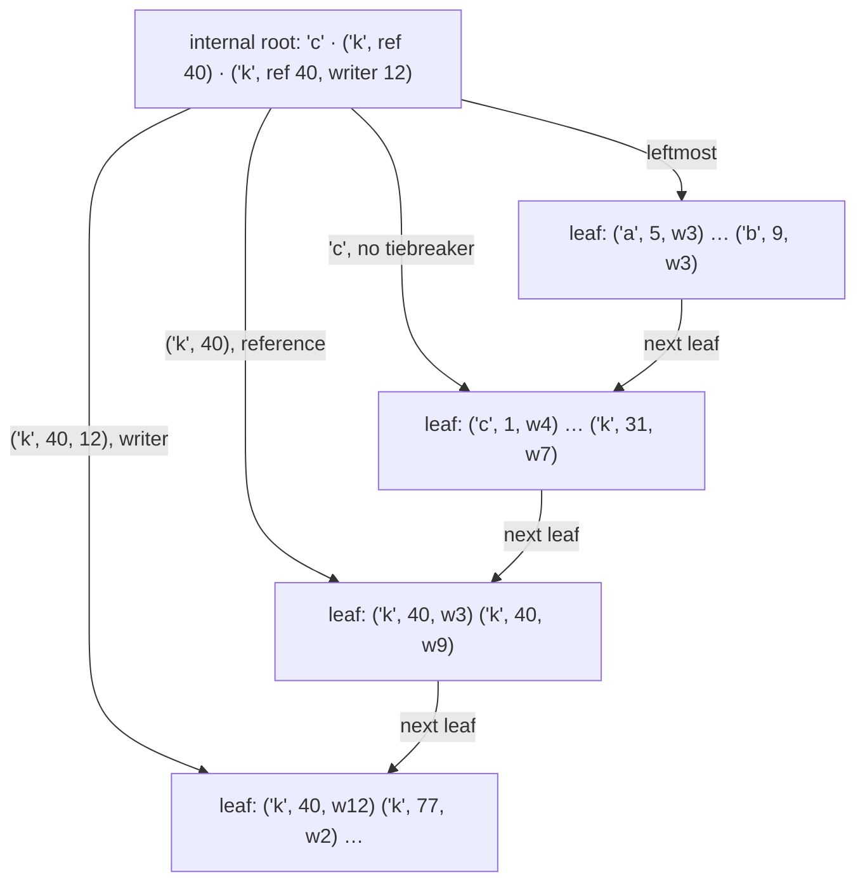

# Assimalign.Cohesion.Database.Indexing — Design

## Intent

Every model needs ordered lookups: SQL secondary indexes, document indexes, graph adjacency, the KV primary structure. Building four bespoke trees would quadruple the hardest code in the platform, so index structures live in the kernel and models bring only their key extraction. The SQL engine is the first real consumer (#912): CREATE/DROP INDEX, write-path maintenance, and planner seeks all compose this package's manager, trees, and cursors.

## Byte-comparable keys

`IndexKey` compares by unsigned lexicographic byte order — the single comparison rule every structure (and every future on-disk page compare) uses. Type order is preserved at *encoding* time: integers are big-endian with the sign bit flipped (`FromInt64`), so numeric order and byte order coincide; composite keys concatenate component encodings. String collation encoding is deliberately **not** defined here — it belongs to the shared type system (`Database.Types`), which owns collation identity; `IndexKey.From(DatabaseKeyWriter)` is the bridge for typed and composite keys.

This is the same design center as FoundationDB tuples and MySQL/InnoDB memcmp-able keys: one dumb, fast comparator at the bottom, all type intelligence pushed to encoding.

`IndexKey.FromString(value, collation)` delegates to the shared writer. `Binary`,
`CaseInsensitive`, and `CaseAccentInsensitive` produce deterministic transformed
UTF-8 keys. Equivalent spellings have identical bytes, equality, content hashes,
and unique-lock identities; original spelling never breaks a collation tie.
`Invariant` is explicitly not index-backed and key construction rejects it. The
owning model must resolve index collation and seek eligibility; the B+Tree itself
continues to compare raw bytes.

## The B+Tree implementation

`BTreeIndexManager.Create(options)` composes B+Trees over `PageType.Index` pages —
one node per page, a sorted offset directory with entry data growing from the body
end, key capacity capped (`MaxKeyLength` = 1 KiB) so a node always holds several
entries and splits stay correct.

- **Every page mutation rides the owning storage transaction** through the storage
  layer's `OpenPageForWrite`/`AllocatePageForWrite` — a full page image on a page's first
  change since the checkpoint, byte-range deltas at commit (storage format 3, #1253), and an
  in-memory pre-image for rollback. That is the whole crash story: a crash mid-split reverts
  to the consistent pre-transaction tree; committed splits replay from the journal
  (the crash suites prove both). `IStorageTransactionSource` is how the engine
  pairs logical transaction contexts with their storage transactions.
- **MVCC entries, tombstone deletes.** Leaf entries carry writer and deleter
  sequence stamps; reads filter through the caller's snapshot (writer visible,
  deleter absent-or-invisible). Deletes stamp — never remove — so old snapshots
  keep seeing the entry; an aborted deleter's stamp reverts physically with its
  page image. Physical reclamation and node merges belong to vacuum, which follows
  version pruning (post-MVP).
- **Uniqueness checks the LATEST state, not the snapshot.** Two transactions that
  began before each other's commits would both pass a snapshot-visibility check
  (write skew). Instead: unique inserts *and deletes* first take an exclusive
  key lock (hashed key) in the shared lock manager; once held, a live entry
  (deleter stamp zero) can only be committed or our own — uncommitted others are
  excluded by the lock, and aborted writers' entries were physically reverted.
- **Concurrency (MVP): a tree-level reader/writer latch.** Writers exclusive;
  cursors materialize their range's visible entries under the read latch, so no
  latch is held across awaits and readers never see a torn structure. Lock
  coupling / latch-per-node is a measured-need follow-up. The argument that the
  entry order below keeps this protocol correct is under "Concurrency and
  recovery".
- **The root page never moves.** A root split copies the root's contents to a new
  page and rewrites the root in place as an internal node over that page and the
  new sibling (SQLite's balance-deeper). The root id a catalog registered when the
  tree was created therefore stays valid: a rolled-back split reverts the root
  page from its pre-image like any other page, and a crash between a committed
  split and the catalog's next persistence point loses nothing. (A moving root
  left the in-memory root pointing at an unallocated page after a statement
  bracket rolled a root split back, and a persisted registration one checkpoint
  stale.) The fixed root is also where the tree's page format is checked (below).
- **Directory persistence belongs to the catalog.** The manager keeps an in-memory
  directory and exports `BTreeIndexRegistration`s (`IIndexRegistry`); the model
  catalog persists them and re-attaches on open (`ExistingIndexes`). Since the
  root page stays put, a registration changes only through index DDL; the
  catalogs' re-export at their persistence points remains as a backstop and
  normally finds nothing to write. Dropping an index is a directory operation;
  its pages await vacuum.

### Entry order: `(key, entry reference, writer)` (#1194)

Keys are not unique — a secondary index repeats a value per row, and every MVCC
version adds an entry — but entries are, so the tree orders entries by their
identity: the key, then the entry reference, then the writer stamp. Attributes
compare one at a time: the key as unsigned bytes, the reference and the writer as
unsigned integers. This is PostgreSQL's heap-key-space design: nbtree makes every
key unique by treating the heap TID as a tiebreaker key attribute
(`src/backend/access/nbtree/README:42-49`), so every entry has one place in the
tree and a lookup that knows it descends straight to it. Before #1194 the order
was the key alone, and every lookup that targeted one entry walked the key's
duplicate run; the measurements below show what that cost.

- **Why the identity is unique.** Every model's entry reference is the location
  of one record version (SQL `SqlRecordLocation`, key-value
  `KeyValueRecordLocation`, document and graph `PackLocation`): a slot holds one
  version at a time, and every UPDATE writes its new version to a new slot. A slot
  is reused under the same key only after the version purge reclaims it, which
  needs the old version's deleter committed below every active transaction, so the
  reusing writer is newer than the old one — the writer is the second tiebreaker for
  exactly that case. A failed statement reverts its index pages with its record
  pages (one bracket), so a slot it reuses cannot meet its own earlier entry. An
  insert whose identity is already present is therefore a defect, and the tree
  refuses it with `IndexException` instead of placing an entry no separator could
  distinguish — PostgreSQL treats a duplicate heap TID the same way, as index
  corruption (`nbtsearch.c:558-574`).
- **The deleter is not part of the order.** Tombstoning, clearing a tombstone and
  the open-time purge change or remove entries in place and never move one, so no
  MVCC transition reorders a leaf.
- **One comparer.** `BTreeEntryOrder` decides every position: the insert and
  build-path (`InsertVersionAsync`) position, separators, descents, seeks, delete,
  erase, clear-deleter, the live-version match, the unique check, leaf compaction
  and splits. Engines pass the reference they already store; there is no ordering
  logic outside this package.

### Separators keep the tiebreaker they need (suffix truncation)

A leaf split builds its separator from the last entry that stays left and the
first entry that moves right, and keeps only what separates them (`BuildSeparator`):

| The two entries differ in | The separator keeps | Tiebreaker bits |
|---|---|---|
| their keys | the right key's bytes up to and including the first byte that differs | 0 |
| their references only | the key and the right entry's reference | 1 |
| their writers only (a reused slot) | the key, the reference and the right entry's writer | 2 |

An attribute the separator does not keep reads as minus infinity, so the separator
`s` satisfies `lastLeft < s <= firstRight`: a strict upper bound of everything left
of it and a lower bound of its child. PostgreSQL keeps the mirror-image bound, a
non-strict upper bound for the left page built from lastleft's TID
(`nbtutils.c:771-778`, `:783-798`); this tree keeps the right-hand bound its
separators always had. Attribute truncation follows `_bt_truncate` and
`_bt_keep_natts` (`nbtutils.c:692-760`, `:837-898`). PostgreSQL truncates whole
attributes only, and its README notes that truncating inside a variable-length
attribute "would be straightforward" (`README:839-856`): an `IndexKey` is one
unsigned byte string whose earlier bytes always decide, the "prefix property"
Bayer and Unterauer's simple prefix B-tree needs, so the key is truncated by byte.
Separators are unique on their level, so the order check on every split is now
strict.

**Decision, with evidence: truncate.** Measured on the trees below (2026-10-02,
Release; "separator" is the average internal entry with its directory slot):

| Workload | Baseline (format 1) | Full key + reference + writer always | Tiebreaker truncation only (PostgreSQL) | Tiebreaker and key bytes (shipped) |
|---|---|---|---|---|
| 100,000 distinct INT keys, random order | fan-out 187, 17 B, height 3 | 112.6, 33 B, 3 | 187, 17 B, 3 | 186, 17 B, 3 |
| 100,000 rows over 997 INT keys | 182.3, 17 B, 3 | 109.8, 33 B, 3 | 182.3, 24.3 B, 3 | 182.3, 24.3 B, 3 |
| 100,000 rows over 10 INT keys | 272.7, 17 B, 3 | 164.0, 33 B, 3 | 164.0, 25 B, 3 | 164.0, 25 B, 3 |
| 50,000 distinct 64-byte keys, random order | 82.8, 76 B, 3 | 49.1, 92 B, 3 | 82.8, 76 B, 3 | 166.8, 20 B, 3 |
| 5,000 equal 1,024-byte keys | 4.0, 1,036 B, 6 | 4.0, 1,052 B, 6 | 4.0, 1,044 B, 6 | 4.0, 1,044 B, 6 |

Keeping the tiebreaker everywhere would cost 40% of the fan-out of every index with
short distinct keys; truncating it costs nothing there, and only separators inside
a duplicate run pay the 8-byte reference (the 10-key row). Byte truncation doubles
the fan-out of long distinct keys. Heights are equal at these sizes; at 10 million
INT keys (about 56,000 leaves) a fan-out of 187 needs three internal levels and one
of 113 still three, but long keys and larger trees reach the next level sooner
without truncation.

### Lookups descend to their entry

Every descent takes, at each internal node, the child of the last separator not
greater than the search position (`FindChildSlot`) — PostgreSQL's `_bt_binsrch` over
pivots, with `_bt_compare` reading truncated attributes as minus infinity
(`nbtsearch.c:346-420`, `:795-860`). A search names as much of the identity as it
knows:

| Operation | Search position | Work |
|---|---|---|
| Insert, build path (`InsertVersionAsync`) | `(key, reference, writer)` | one descent |
| Erase (logical undo of an insert) | `(key, reference, writer)` | one descent |
| Delete — the live version the snapshot sees | `(key, reference, +inf)`, read backward | one descent: the reference's newest version |
| Clear-deleter (logical undo of a tombstone) | `(key, reference, +inf)`, read backward | one descent: the reference's newest version |
| Equality and inclusive range seek | `(key, -inf)` | one descent, then the range's entries |
| Exclusive range start | `(key, +inf)` | one descent, then the range's entries |
| Unique check | `(key, -inf)` | one descent, then the key's entries until a live one |

A full identity lands on the leaf that holds it. A partial position lands on the
leaf where its entries begin — or end, when they begin on the next leaf — and the
lookup walks forward only while entries share the position's prefix
(`TryFindEntry`). Seeks keep their semantics exactly: they start before every entry
of their start key and return every visible entry in range, now in entry-reference
order within a key; #1159's randomized seek = scan = model tests pass unchanged.

**Delete and clear-deleter read a reference's versions newest first**
(`TryFindNewestEntry`). They know the key and the reference but not the writer, and
a reference can have many versions under one key: a record slot reused after the
version purge reclaimed its previous version leaves that version's dead entry behind
until dead versions are pruned (#1195). But a slot holds one version at a time, and
it is reused only once the previous version's deleter committed below every active
transaction, so every version of a reference except the newest carries a committed
deleter. The newest is therefore the only one that can be live, and the only one an
in-flight or aborting deleter can have stamped. The lookup descends to the position
after the reference's last version — `(key, reference + 1, -inf)`, which no entry
lies between, or `(key, +inf)` for the largest reference — and reads backward along
the previous-leaf links, across leaves an undo emptied, until an entry leaves the
reference. It stops at the first match, so the targeted lookup is one descent
however many dead versions the slot left behind (measured below: 4,000 dead versions
cost what 10 do, about 26 µs, where reading them oldest first cost 290 µs). When the
newest does not match — a stale or replayed undo, which is a no-op — the walk reads
the older versions too, so the result never depends on the invariant, only the cost
does. Splits and root growth always maintained the previous-leaf links, but no
lookup followed them before; the randomized and recovery suites now check, page by
page, that they mirror the next-leaf links.

The unique check is the one lookup still linear in a key's history. It must prove
no live version exists among the key's versions, and a live version can sit
anywhere among the dead ones, so it reads the key's run from `(key, -inf)` until it
finds a live entry or passes the key — one descent and a forward walk over
consecutive leaves, the cheapest walk the semantics allow. PostgreSQL's
`_bt_check_unique` walks the same way (`nbtinsert.c:440-449`). Pruning dead versions
(#1195) bounds it.

**Known limit until #1195: a row updated many times under a UNIQUE index.** Every
UPDATE of a row leaves its old version's entry under the same key, so the unique
check of the next UPDATE reads one more dead entry. `UPDATE t SET v = v + 1 WHERE
id = 2`, repeated 20,000 times on a table whose primary key is the unique index,
costs 0.40 ms per update over the first 2,500 updates, 3.67 ms over updates
10,001–12,500 and 5.98 ms over the last 2,500 (Release; before #1194, 0.55, 4.19
and 8.29 ms). #1194 makes the tombstone half of each UPDATE one descent, but the
unique check still grows with the row's history; these numbers are #1195's
baseline.

### Splits

- **Inserts into a duplicate run keep append locality only while references grow
  with insertion order.** An entry now goes to its reference's place in the run,
  not to the run's end, so inserts whose references arrive out of order land on
  different leaves of the run. Each leaf a transaction writes for the first time
  costs the storage layer a pre-image and, at commit, a delta (since storage format 3,
  #1253; until then an 8 KiB before-image and an 8 KiB after-image, about 25 µs each),
  and a run larger than the buffer pool also reloads pages. Measured with 100,000 inserts over 10 INT keys
  in 1,000-insert transactions (Release, see "Measurements"): references in
  insertion order are unaffected; references ascending within shuffled 200-reference
  blocks (pages a table reuses) insert about 1.5–2× slower; fully random references
  about 8× slower with the whole tree cached and about 20× slower with the engines'
  default 128-page pool. In exchange the run packs denser (leaf fill 50% → 69–76%,
  540–590 leaves instead of 816), and every targeted lookup is one descent.
  PostgreSQL makes the same trade, heap TID order within a key. The SQL engine
  appends new row versions to a table's current write page and takes its next page
  from the free-space map, so its row locations ascend within a page and follow
  page allocation across pages, close to the block pattern above. The per-leaf
  journal cost was the storage follow-up named under "Measurements" (#1236; storage
  formats 2 and 3, #1251 and #1253); #1196 addresses fill, not locality.
- **A split attaches its new node by position.** The insert's descent records the
  child slot it took at every level, and the new right half goes directly after the
  node that split, so the child order always equals the leaf chain. (With unique
  separators the slot always agrees with the separator's value; the order check
  confirms it.)
- **Internal nodes split by bytes.** Internal entries range from 11 bytes (a
  separator truncated to one key byte) to 1,050 bytes (a 1,024-byte key with both
  tiebreaker attributes); the promoted separator is the
  first at which the entries before it would exceed half the node, so both halves
  keep room for the largest separator.
- **The leaf split point is one function, `ChooseLeafSplit`** — currently the middle
  of the leaf, which any split point in `[1, count - 1]` may replace, since adjacent
  entries always differ. #1196 replaces it with PostgreSQL's strategy for rightmost
  and single-value splits (`nbtsplitloc.c:130`, `_bt_strategy` `:935`). Measured
  for 5,000 equal 1,024-byte keys inserted in reference order, before and after this
  change alike: 1,666 leaves holding 3.0 of a possible 7 entries (39.2% full),
  height 6, internal fan-out 4.0 — every insert reaches the rightmost leaf, and a
  middle split leaves the left half half-empty for good.
- **Order is checked in every build.** A leaf split fails unless its separator
  falls strictly after the last entry kept left and at or before the first entry
  moved right, and every separator written into a parent must be strictly between
  its neighbours; `IndexException` then leaves the caller's storage bracket to roll
  the half-done split back. A misordered separator that reached disk would misroute
  lookups permanently (there is no repair path, #1152), and the checks cost four
  comparisons per split.

### Page format 2 and the format gate

The node layout of every index page (offsets relative to the page body, after the
storage layer's 96-byte page header):

| Offset | Field |
|---|---|
| 0 | `u16` magic `"BT"` (`0x5442`) |
| 2 | `u8` page format version, `2` |
| 3 | `u8` kind: 1 leaf, 2 internal |
| 4 | `u16` entry count |
| 6 | `u16` data start: entry data grows down from the body end |
| 8 / 16 | `i64` next / previous leaf (`-1` for none) |
| 24 | `i64` leftmost child (internal nodes) |
| 32 | `u16` directory of entry offsets, in entry order |

A leaf entry is `[u16 key length][key][u64 reference][u64 writer][u64 deleter]`. An
internal entry is `[u16 key length | tiebreaker << 14][key][u64 reference]?[u64
writer]?[i64 child]`: the top two bits of the length field count the tiebreaker
attributes the separator keeps (the key length never exceeds 1,024, so they are
free), as PostgreSQL stores a pivot's attribute count in spare bits of its tuple
header (`src/include/access/nbtree.h:409-418`). Format 1 — every engine before
#1194 — had no magic and no version: its first byte was the kind (1 or 2), which
can never read as the magic, its directory began at offset 29, and its entries
were ordered by key alone.

The tree that a separator and its children form, for a key `'k'` whose run spans
three leaves — one separator per truncation level:

The root holds three separators. `'c'` keeps one key byte and no tiebreaker,
because the entries either side of it differ in their keys; `('k', ref 40)` keeps the
reference, because its neighbours share the key `'k'`; `('k', ref 40, writer 12)`
keeps the writer, because its neighbours are two versions of the same reference.
Each separator points at the leaf whose entries start at or after it, and the leaves
link left to right.

**This package owns the format and checks it once per tree, at attach** —
PostgreSQL's metapage test (`btm_magic` and `btm_version`, `nbtpage.c:155-168`;
`BTREE_MAGIC`/`BTREE_VERSION`, `nbtree.h:150-151`) moved onto the root page, which
never moves and from which one engine wrote the whole tree. `BTreeIndexManager.Create`
reads every registered root before it attaches any tree, and a root in any other
format refuses the attach with `IndexFormatException`, whose message starts with
`COHDBI001` and names the index, the format found and the one supported ("uses
B-tree page format 1, but this engine supports only format 2", with the export,
drop and recreate remedy and #1152), or says the root is no B-tree page at all.
`BTreeIndexManager.EnsureFormat(storage, registrations)` makes the same check alone,
writing nothing, for a model whose open recovers its record space before it attaches
its trees. Every node read after attach also checks the magic and version, like
PostgreSQL's `_bt_checkpage` (`nbtpage.c:782-811`); a page that fails is damage, and
the operation fails with `IndexCorruptionException` (`COHDBI002`, PostgreSQL's
`ERRCODE_INDEX_CORRUPTED`). There is no upgrade path (owner decision of 2026-10-02;
upgrades are #1152). How each model surfaces the refusal:

| Model | Where its open checks | Error |
|---|---|---|
| SQL | Its catalog's data-storage format marker, bumped from 4 to 5 by #1194 (now 6, #1241), before the data file set opens; then the attach check, before recovery | `SqlDataStorageFormatException` "uses data-storage format 4, but this engine supports only format 6"; a marker that does not describe its trees, the attach check's `COHDBI001` |
| Key-value | Its catalog's entry-space format marker, bumped from 1 to 2, before the attach; then the attach check, before recovery | `DatabaseException` "uses entry-space format 1, but this engine supports only format 2"; a marker that does not describe its tree, "Database 'x' cannot be opened. COHDBI001: …" |
| Document | `DocumentCatalog.EnsureIndexFormat`, before the recovery scrub; the attach check again in the catalog's open | "Database 'x' cannot be opened. COHDBI001: …" |
| Graph | `GraphStore.EnsureIndexFormat`, before the recovery scrub; the attach check again in the store's open | the same |

Every refusal comes before the model's own recovery — its scrub, index purge and
checkpoint — writes anything. A cleanly closed database is therefore left
byte-identical. A crashed one has already had the storage layer's physical redo
and undo when an attach check refuses it (the storage open replays its journal
before any model code runs; SQL's marker gate alone runs before the data files
open), but that replay is format-agnostic, and the journal is kept because the
open-time checkpoint is deferred, so the engine that wrote the database still
recovers it. Each model's test pins the clean case.

**The fence against older engines is the model markers.** An engine before #1194
reads neither the page stamp nor the format-2 layout, so it can be stopped only by
something it already checks. SQL's format-4 engines require their marker to equal
4, and key-value engines before #1194 reject an entry-space marker newer than 1, so
both refuse a database this engine wrote before they attach a tree. Documents and
Graph engines before #1194 check nothing that #1194 changed, so they cannot detect
a database this engine wrote and must not open one: they would misread its trees.
Nothing has shipped (owner decision of 2026-10-02), so this is recorded for owner
review rather than fenced with a new Documents or Graph marker.

### Concurrency and recovery

- **The latch protocol is unchanged, and the new order does not weaken it.** Every
  mutation — insert, delete, erase, clear-deleter, the build path and the purge —
  holds the tree's write latch from its descent until its page change is done, and a
  cursor holds the read latch while it materializes its range. The unique key lock
  is acquired before the latch, never while holding it, so the order key lock → tree
  latch → storage page lock stays acyclic. The order change moves which leaf a lookup
  lands on, not when it holds the latch: `TryFindEntry`'s descent, its forward walk
  and the caller's tombstone, clear or removal at the returned position all happen in
  one write-latch hold, so no split or removal can move the entry in between, and a
  cursor never sees a split half done. The newest-first lookup of delete and
  clear-deleter reads leftward along the previous-leaf links inside the same hold,
  and so does every structural change that rewrites those links (a split, a root
  growth), so the leftward walk sees the same chain the rightward one does. Physical
  page writes of different transactions never interleave on a leaf: engines apply
  statements one bracket at a time through the transaction coordinator's apply gate,
  and a storage page write lock held by another bracket fails fast
  (`StorageTransactionException`) instead of waiting, so no wait-for cycle can form
  with the tree latch.
- **Recovery replays pages, so it is order-agnostic.** The journal carries each page's
  full image once per checkpoint interval and the bytes each committed bracket changed
  (storage format 3, #1253): a crash mid-split leaves the pre-transaction tree, because no
  change of an uncommitted bracket is redone, and committed inserts, deletes and splits
  replay byte for byte in the order they were written. The open-time purge removes and restores entries in place and
  never reorders a leaf; a separator stays a valid bound after the entries it was
  copied from are gone, as PostgreSQL's pivot tuples may hold values of tuples
  VACUUM has since removed (`README:34-38`).
- **Rollback and undo find the exact entry.** A statement's physical rollback
  restores its bracket's in-memory page pre-images; the logical undo after a multi-statement ROLLBACK erases by
  full identity and clears tombstones from the reference's newest version back,
  both stamp-checked, so a stale or repeated ledger entry is a no-op.
  `BTreeEntryOrderTests` covers a crash with a committed duplicate run and an
  in-flight one, the undo pair over 600 versions of one reference that span
  seventeen leaves, and the newest-first lookups across leaves an erase emptied.

### Measurements (2026-10-02)

Release builds on one developer machine (12 logical cores, shared with other
workloads); the index harness storage has a 64-page buffer pool unless noted.
Before is the integration branch at `d987d7f1`. Rows marked *pinned* ran each
build in its own process on four reserved cores at high priority, alternating
builds, and report the median over every round.

| Workload | Before | After |
|---|---|---|
| `DeleteAsync` of 300 random entries of one key, 2,500-entry run (median) | 136.8 µs | 2.8 µs |
| the same, 40,000-entry run | 7,576 µs | 95.3 µs |
| the same with a 4,096-page pool, 2,500 / 40,000 entries | 14.8 / 304.7 µs | 1.5 / 40.7 µs |
| A 400-entry block from the middle of a 2,500- and a 40,000-entry run of one tree, per operation: delete | 12.1 / 6,163 µs | 4.9 / 5.7 µs |
| the same: erase | 19.9 / 6,414 µs | 1.2 / 1.3 µs |
| the same: clear-deleter | 20.9 / 6,644 µs | 1.5 / 1.2 µs |
| Delete of a reference's live version behind V dead versions of it (a reused slot), with 2,000 other references under the key, 4,096-page pool, median of nine deletes each in its own transaction (first write to the leaf included): V = 10 / 100 / 1,000 / 4,000 | 95–134 / 96–108 / 134–150 / 290–395 µs | 26 / 26 / 26 / 26 µs (five runs; single runs 25.6–42.3 µs) |
| the same: clear-deleter of the newest version's tombstone | 94–135 / 96–108 / 152–154 / 303–408 µs | 26 / 26 / 26 / 26 µs (single runs 25.3–42.7 µs) |
| SQL `ON DELETE CASCADE`, 2,000 / 8,000 / 16,000 children, separate databases | 264 / 734 / 6,176 ms; pinned rerun 134–145 / 378–496 / 2,997–3,089 ms | 83 / 476 / 426 ms; pinned rerun 36–52 / 199–281 / 222–304 ms |
| the same, 32,000 / 64,000 children | — | 966 / 1,582 ms |
| SQL cascade of 4,000 and of 16,000 children in one table, per child | 39.1 / 391.0 µs | 23.0 / 22.5 µs |
| Unique-index insert and seek, 100,000 INT keys in random order (median of three) | 10,883 inserts/s, 29,061 seeks/s | 10,818 / 28,969 (−0.6%, −0.3%) |
| the same, pinned, 18 rounds | 18,241 inserts/s, 52,135 seeks/s | 17,451 / 50,397 (−4.3%, −3.3%) |
| Unique-index insert and seek, 300,000 INT keys in ascending order, pinned, 18 rounds | 639,637 inserts/s, 1,983,214 seeks/s | 638,314 / 1,981,246 (−0.2%, −0.1%) |
| Inserts into duplicate runs: 100,000 rows over 10 INT keys, 1,000 per transaction, the engines' default 128-page pool; references in insertion order / ascending in shuffled 200-reference blocks / random | 203k–392k / 504k–524k / 411k–525k inserts/s; 816 leaves, 50% full | 198k–384k / 229k–247k / 22k–23k inserts/s; 816 / 590 / 540 leaves, 50% / 69% / 76% full |
| the same with a 4,096-page pool | 490k–503k / 387k–516k / 418k–537k inserts/s | 322k–610k / 239k–339k / 55k–58k inserts/s |
| SQL hot row: `UPDATE t SET v = v + 1 WHERE id = 2` 20,000 times under the primary key's unique index, per update in updates 1–2,500 / 7,501–10,000 / 10,001–12,500 / 17,501–20,000 | 0.55 / 1.07 / 4.19 / 8.29 ms | 0.40 / 0.97 / 3.67 / 5.98 ms |
| `SqlCascadeDeleteDepthTests`' 100,000-row self-referencing cascade (Debug, whole test, builds alternating) | 41 s, 41 s | 41 s, 42 s (unchanged) |

**Since storage format 2 (#1251, 2026-10-04).** Most of the per-leaf before-image cost
above was the storage layer's byte-at-a-time CRC over each 8 KiB image and page. With
CRC-32C through `BitOperations.Crc32C` the duplicate-run rows, re-measured on reserved cores
with both builds alternating (`Database.Storage` DESIGN.md, "Measurements"), read: random
references 11.6k–14.0k → 77.7k–80.6k inserts/s at the 128-page pool and 34.5k–38.4k →
109.6k–114.8k at 4,096 pages; insertion order 105k–127k → 135k–146k and 194k–239k →
348k–408k; shuffled blocks 115k–128k → 200k–261k and 113k–166k → 380k–450k. The full
before- and after-image per leaf per transaction remains (#1252, #1253).

**Since storage format 3 (#1253, 2026-10-04).** A leaf is journaled as a full image once per
checkpoint interval, on its first change since the checkpoint, and each commit journals only the
bytes it changed. The duplicate-run rows, measured the same way (`Database.Storage` DESIGN.md,
"Measurements (#1253)", six alternating runs, the machine's other load moving rates by up to
2×), read: random references 105k–161k → 137k–245k inserts/s at the 128-page pool and 194k–265k
→ 315k–658k at 4,096 pages; insertion order 164k–258k → 148k–260k and 511k–928k → 651k–1,386k;
shuffled blocks 215k–380k → 196k–411k and 510k–954k → 483k–1,303k. The journal bytes per insert
fall from 447 / 912 / 4,491 (insertion, blocks, random) to 80 / 89 / 154. Random references now
run at 0.42–0.65 of insertion order at 4,096 pages (0.26–0.46 before) and 0.68–1.11 at 128 pages
(0.52–0.86). An index 28 times a 128-page pool, taking 100,000 random inserts with a checkpoint
every 5,000 (so most inserts first-touch their leaf since the checkpoint), journals 2,888 bytes
per insert instead of 14,402. The review's independent probe (five alternating runs, its own
code) reproduced the journal bytes and put random references at 0.67–0.81 of insertion order at
128 pages and 0.39–0.76 at 4,096, at or above one half in one run of five: #1236's "within 2× of
ascending" holds at a 128-page pool and is still partial at the 4,096-page (32 MiB) default.

The issue's own measurements of the same baseline (#1194: 124 µs and 7.2 ms per
delete; 76 ms, 442 ms and 4,526 ms per cascade) were taken on the same kind of
build; the rows above vary with the machine's other load by up to 2×, which is why
the timing guards compare ratios. The random-delete rows still grow with the run
because the storage layer journaled an 8 KiB before-image the first time a
transaction wrote a page (25–50 µs; since #1253 a pre-image in memory and a delta at commit), and
random deletes in a longer run touch more distinct leaves; the block rows hold the leaves touched constant and show the
descent itself does not grow. That before-image is also what the versions rows'
flat 26 µs is: one first write per delete. With the entry order but a reference's
versions read oldest first (#1194's first commit, `f2f9a7f2`), the same versions
deletes cost 27 / 37 / 139–141 / 289–371 µs, linear in V. The duplicate-run insert rows
are the cost described under "Splits"; the hot-row row is the unique check's known
limit (#1195). The 100,000-row chain has one entry per key, so #1194 does not
change its asymptotics. The timing guards compare growth ratios, not absolute
times, so CI speed and load cancel out:

- `BTreeEntryTimingTests`, delete, erase and clear-deleter in a 40,000-entry run
  against a 2,500-entry run of the same tree: allowed growth 4×; the baseline
  measured 317–510×, the entry order 0.8–1.2×.
- `BTreeEntryTimingTests`, delete and clear-deleter of 16 references with 2,048
  versions each against 16 with 16 versions each, every newest version on its own
  leaf: allowed growth 2.5×; the oldest-first walk measured 12.6–14.3×, the
  newest-first lookup 0.87–1.21× (Release and Debug).
- `SqlCascadeFanOutTests`, 16,000 children against 4,000: allowed growth 2×; the
  baseline measured 10×. Each round times one 16,000-child cascade against four
  4,000-child cascades back to back, so both blocks run about as long; one
  4,000-child cascade against one of 16,000 measured up to 2.2× under load with the
  walk linear. Load still swung a round's wall-clock cost two to four times, so the
  blocks are timed in the process's CPU time (the timing collection runs alone in its
  process), after an unmeasured warm-up round of both blocks: pinned to three cores
  or beside another suite on them, the linear walk measured 0.77–1.27× (the wall
  clock reached 2.42× once in 40 loaded runs) and the duplicate-run walk #1194
  removed 2.58–3.58×, failing 20 runs of 20 (on the wall clock it passed 5 of 10
  loaded runs).

## Transactional binding

`IIndex` mutations take an `ITransactionContext` — index entries are stamped and become visible under the same MVCC rules as the data they reference. There is no "non-transactional index write" surface; recovery replays index changes from the same WAL as data changes. Unique enforcement happens at insert against the *latest* state under the key lock (above); a competing in-flight writer of the same key is resolved by the lock manager, not the index.

### The maintenance surfaces (model-engine consumers)

The SQL engine's index adoption (#912) added a small family of operations that
deliberately take the **physical bracket** (`IStorageTransaction`) instead of a
transaction context — they run where no statement bracket exists:

- **`InsertVersionAsync(bracket, key, reference, writer, deleter)`** — the
  offline (DDL-blocking) build path: an index built over existing rows inserts
  each stored version with its original stamps, so pre-existing snapshots read
  through the new index exactly what the row scan shows them. No uniqueness
  check — the builder detects live duplicates itself under the object's
  exclusive lock (online rebuild remains a non-goal). It positions each entry by
  its identity like any insert, and refuses an identity already present.
- **`EraseAsync` / `ClearDeleterAsync`** — the logical-undo pair: physically
  remove an aborted writer's insert; clear an aborted writer's tombstone. Both
  verify the recorded stamp before acting, so replays and stale ledgers no-op.
  Erase knows the entry's full identity and descends to it; clear-deleter knows the
  key and reference, descends past the reference's last version and reads its
  versions newest first. Physical removal
  drops only the directory slot; the entry bytes stay orphaned in the node until a
  rebuild reclaims them (bounded space for a rare path). An insert that finds a leaf
  full rebuilds it in place when the orphaned bytes are what stands between it and
  room, and splits only otherwise — an undo can empty a full leaf, and a split
  there would have no entries to divide.
- **`IIndexManager.PurgeWritersAsync(bracket, writers)`** — the open-time
  recovery obligation: one walk per tree removes every unproven writer's
  entries and clears their tombstones (the in-memory undo ledger died with the
  process; snapshots have no commit-log awareness, so unproven stamps must not
  serve reads). Idempotent across the crash window.
- **`OpenCursor(TransactionSnapshot, range)`** — reads through an explicit
  snapshot, so a statement-scoped reader (per-statement snapshots under
  ReadCommitted) sees exactly the same visibility through the index as through
  its row scan.
- **`IndexKey.Hash()`** — publishes the FNV-1a key-lock identity so a writer
  that must never wait inside a serialized apply scope can pre-acquire the
  unique-key lock in its own lock phase and rely on the lock manager's
  same-owner re-grant when the tree acquires it again internally.
- **`BTreeIndexManager.EnsureFormat(storage, registrations)`** — the attach-time
  page format check on its own (#1194), for an open that must refuse a database
  before its recovery writes to it.

### Shared record-version undo binding (#918)

`RecordVersionIndex` implements the new `Database.Transactions.IRecordVersionIndex`
contract by forwarding encoded key bytes to the existing `IIndex.EraseAsync`
and `ClearDeleterAsync` operations. Engines supply this bridge to the shared
`RecordSpaceVersionStore` ledger. Index key construction and stamp verification
remain in Indexing; Transactions needs no Indexing or area-root reference, and
the existing `IIndex` and `IStorageTransactionSource` interfaces are unchanged.
Open-time index scrubbing still uses `IIndexManager.PurgeWritersAsync` between
the coordinator's record scrub and its final checkpoint.

## Entry references are opaque `ulong`s

The index maps keys to entry references the owning storage layer understands (page address, row id, node id). Making the reference generic (`IIndex<TReference>`) would infect every cursor and page layout with a type parameter for zero runtime benefit — models already own both sides of the mapping. The tree compares references as unsigned integers to break ties between equal keys and never interprets them otherwise.

## Error model

`IndexException` is the package's own exception root and inherits `Exception`
directly, not the area's `DatabaseException` — this package is a child root the
area root rolls up (2026-07-13 inversion), so it must stay independently
consumable. `IndexUniqueViolationException : IndexException` is the typed
unique-violation surface. `IndexFormatException : IndexException` is the typed
page-format refusal at attach (`COHDBI001`, with the index, its object, its root
page and the format found). `IndexCorruptionException : IndexException` is the
typed damage surface (`COHDBI002`, with the index, the page and the format the page
claims): a page reached inside an attached tree that is not a node of the current
format, PostgreSQL's `ERRCODE_INDEX_CORRUPTED` from `_bt_checkpage`, and the
counterpart of the storage child root's `StorageCorruptionException`. Each code
is a constant on its exception type (`ErrorCode`) and leads its message. An insert
whose `(key, reference, writer)` identity is already present is a caller defect and
fails with a plain `IndexException` before it changes anything. Model engines that
expose index failures on the area's error surface translate at their own boundary
and keep the code and the original exception as the inner exception.

## Relationship to `Database.Storage`

`Database.Storage` provides the *physical* substrate through `IStoragePageManager` — index pages (`PageType.Index`) are allocated, pinned, and flushed like any other page and live in the same storage files. This project is the *logical* layer: structures, keys, cursors, uniqueness, and the node page format inside each index page's body. The B+Tree implementation binds the two. (An earlier string-based `IStorageIndexManager` stub in `Database.Storage` was removed during the #157 alignment — it duplicated this project's `IIndexManager` at the wrong layer with no design behind it.)

## Non-goals

- No full-text or spatial indexes in the MVP surface (future `IndexKind` members; the enum is the extension point).
- No online index rebuild in the contract yet — DDL-blocking builds first.
- No cost/statistics surface here — planners get statistics through their model catalogs.
- No in-place upgrade of index pages from an older page format (#1152).

## AOT posture

Pure contracts and span-based value objects. No reflection.
