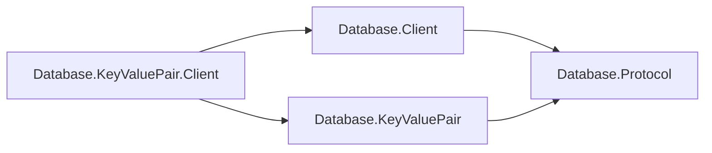

# Assimalign.Cohesion.Database.KeyValuePair.Client — Design

The key-value client owns command construction, parameter encoding, result
materialization, typed outcomes, error mapping, and telemetry. The shared client
owns pooling, handshake, framing, and exchange lifetime.

## Family position

The client references shared mechanism and the key-value wire family:

| Package | Role |
| --- | --- |
| Database.KeyValuePair.Client | Command/result policy and materialization |
| Database.Client | Pooling, handshake, framed exchange lifetime |
| Database.KeyValuePair | Family identifiers and payload codecs |
| Database.Protocol | Shared framing and immutable family binding |

## Wire ownership

`KeyValueClient.Create` binds its pool to `KeyValueProtocol.Family`.
`KeyValueExecuteExchange`, a `DatabaseProtocolExchange<KeyValueProtocolResult>`,
encodes parameters, writes the command, and materializes the complete response
before returning its private result to the typed connection.
The model's [command specification](../../Assimalign.Cohesion.Database.KeyValuePair/docs/COMMANDS.md)
defines command grammar and operation result shapes. Protocol 1.0 bytes are unchanged.

The model assembly reference supplies codecs; this client does not construct an
engine or parse commands. The transitive closure is an accepted packaging
consequence. A separate model protocol assembly can be considered later.

Keys and values remain byte-oriented and use `DatabaseValueCodec` binary
components. Typed serialization belongs to consumers; public client entry/range
types remain independent from engine request types.

## Conditional outcomes

An etag mismatch is a first-class outcome: conditional put returns
`KeyValueWriteResult` with `Applied` and the new-or-current etag; conditional
delete returns a boolean. Staleness calls for rereading, while a concurrently
committed write conflict reports `ExecutionFailure` for contention retry.
Unconditional put returns its new etag directly.

## Errors, lifecycle, and telemetry

`KeyValueClientException : DatabaseException` maps wire codes to model error
kinds and preserves the code. `MalformedResult` identifies a completed response
that does not match the typed operation's values; no unread frames remain.
Framing/decoder failure or cancellation during an exchange invalidates the shared
connection. Disposing a healthy typed connection returns its session to the pool;
disposing the client disposes that pool.

A failed dial reaches `ConnectAsync` as the core's `DatabaseClientException` with
`ProtocolErrorCode.ConnectionFailure` (owner decision 39; the core's `DESIGN.md`,
"Lifecycle and errors"). It maps to `KeyValueClientErrorKind.ConnectionFailure`, like a
handshake rejection, and the core exception, which keeps the transport's exception, is
the inner exception. A canceled dial throws `OperationCanceledException` unchanged
(`KeyValueClientDialFailureTests`).

Observers report grammar text, counts, and elapsed time. Key/value bytes are never
included. Observer exceptions cannot fault an operation or mask its exception. An
observer derives from the abstract `KeyValueClientObserver`, whose three hooks are
`protected internal virtual` with empty bodies: it overrides only what it records, and
only the owning `KeyValueConnection` fires them.

## Diagnostics

The client reports through one internal event source named for its assembly,
`Assimalign.Cohesion.Database.KeyValuePair.Client`
(`src/Internal/EventSource/KeyValueClientEventSource.cs`), written by `KeyValueConnection`'s one
command path. Its ids, names and payloads are the SQL client's, so one query reads both. Start and
stop carry the `Commands` keyword (`0x1`).

| Id | Event | Level | Keyword | Payload |
| --- | --- | --- | --- | --- |
| 1 | `CommandStart` | Verbose | `Commands` | `database`, `parameterCount` |
| 2 | `CommandStop` | Verbose | `Commands` | `database`, `rowCount`, `affectedCount`, `durationMilliseconds` |
| 3 | `CommandFailed` | Error | — | `database`, `errorKind` (`KeyValueClientErrorKind`), `code` (the wire code), `exceptionMessage`, `durationMilliseconds` |
| 4 | `ObserverFailed` | Warning | — | `database`, `callback` (`OnExecuting`, `OnExecuted` or `OnFailed`), `exceptionType`, `exceptionMessage` |

Keys, values and the command text are never written, as the observers never receive key or value
bytes. Event 3 writes the server's message, and the server names a conflicting key in hexadecimal
(`Write-write conflict on key '…'`), so the event replaces the hexadecimal form of every byte
parameter the command bound with `<redacted>`; the shared core's `ExchangeFailed` writes no
statement-level server message at all (Database.Client `DESIGN.md`, "Diagnostics"). A command
fails with an Error whatever its cause; a `MalformedResult` the typed operation raises after a
completed response is not a command failure. Only a coded failure (`DatabaseClientException`) ends
a start with event 3: a cancellation, which is how a timeout surfaces, or an uncoded exception (an
overlapping exchange, a disposed connection) leaves the start without a stop or a failure, and
because event 3 is not a stop, an activity-tracking tool leaves a failed command's activity open.
Pairing every start with a stop is an owner decision on the event-source plan's catalog. Event 4
makes visible an observer failure the client swallows. No counters. The command path already takes
the timestamp its observer receives, so the events add only `IsEnabled` checks while nobody
listens.

`KeyValueClientEventSourceTests` checks the name, the strict manifest, a put and a refused scan
under an observer whose every hook throws (each event once, in order, with its payload, and no
key, value or command text), and a write-write conflict whose server message names the key, which
neither event 3 nor the core's events write. The test assembly's observers override the hooks as
`protected internal`, which the project's test-only `InternalsVisibleTo` requires (CS0507).

## Materialized scans, AOT, and non-goals

Materialized scans are this package's policy. Use a range limit to bound results;
cursor composition can resume after the last key. An incremental API can be added
here without changing shared result policy.

Encoding and materialization use no reflection or runtime code generation.
Wire transactions, typed serialization, caching, retry policy, and rent-time
liveness pings remain outside this surface.

## Phase 29 composition migration

The TCP end-to-end fixture now registers `AddKeyValue` with a nested deferred
`AddServer` factory. Build constructs the engine and listener/server, then the
fixture retrieves the engine from the built context for provisioning. The
application owns the engine and the engine owns its server/listener; disposing
the application closes this whole graph before the restart-recovery composition.
Wire/client behavior and protocol remain unchanged.

## Concrete types (concrete-types plan, phase 5, #1261)

The package has no public interface left and no `Abstractions/` folder
([plan](../../../../docs/programs/DATABASE_CONCRETE_TYPES_PLAN.md) §7, "P5, as landed").

| Type | Shape | Was |
|---|---|---|
| `KeyValueClient` | sealed; `Create(KeyValueClientOptions)` over a private constructor | the static `KeyValueClient` factory, `IKeyValueClient` and the internal `DefaultKeyValueClient` |
| `KeyValueConnection` | sealed; internal constructor; moved out of `Internal/` | `IKeyValueConnection` and the internal `KeyValueConnection` |
| `KeyValueClientObserver` | abstract; protected constructor; `protected internal virtual` hooks with empty bodies | `IKeyValueClientObserver` |

- **Why the observer is abstract.** It is an inverted seam (`database-area.md`, rule 2): the
  application supplies it through `KeyValueClientOptions.Observer` and the connection fires it; no
  observer ships. Its constructor is protected (rule 3), and it carries the deviation marker.
  `KeyValueClientTests.PutAsync_WithPartialThrowingObserver_ShouldNotFaultCommands` covers a
  one-hook observer that throws.
- **Result collections.** `ScanAsync` returns an array, empty when nothing matches, never null
  (rule 9). `GetAsync` returns null for a key with no visible entry: null means absent there, which
  the rule leaves alone.
- **What changed for a caller.** `IKeyValueClient` and `IKeyValueConnection` become
  `KeyValueClient` and `KeyValueConnection` (Studio's key-value workspace was retyped), and an
  observer overrides `protected` hooks instead of implementing public ones. An observer cannot
  forward to another observer instance: outside this assembly the hooks are protected (CS1540),
  so an application that needs several sinks fans out inside one subclass (plan §7, "P5, as
  landed", owner review 38).
- **Disposal is final for the instance.** The pool rents the same core `DatabaseConnection` to
  the next caller, so `KeyValueConnection` keeps its own disposed flag, as `GraphConnection` and
  `BlobConnection` do: after `DisposeAsync` every command throws `ObjectDisposedException` before
  the observer runs, and a second dispose does nothing. Before the P5 review a stale
  `KeyValueConnection` ran its commands on whichever caller had rented the session next, and a
  second dispose returned that caller's rental
  (`KeyValueClientTests.GetAsync_AfterDisposeAndReRent_ShouldThrowObjectDisposedException`).