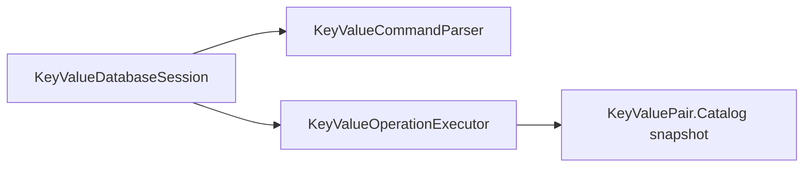
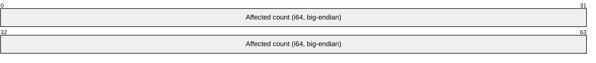

# Assimalign.Cohesion.Database.KeyValuePair — Design

The key-value engine (area architecture:
[resources/Database/DESIGN.md](../../../../docs/resources/Database/DESIGN.md) §3.3, generality report §3.10):
an ordered key space over the shared kernel, and the **second model engine** —
built deliberately as the proof that the kernel is model-general, not SQL-shaped.

## String comparison and collation (#1025)

Key-Value remains binary-only for user data: keys and values are opaque bytes,
and key equality, ordering, uniqueness, and prefix ranges use unsigned
lexicographic byte comparison. Text supplied as a key is compared in its encoded
form without case or accent folding. Command keywords and administrative database
lookup remain ordinal-ignore-case; those identifier rules do not transform user
keys. SQL database defaults and column/expression `COLLATE` have no effect on
this model. Configurable text collation is deferred.

## Design intent

Compose kernel pieces, never re-implement them — and compose them in a
*different shape* than the SQL engine, because the difference is the point:

| | SQL engine | Key-value engine |
|---|---|---|
| Primary structure | the record space (scan-primary; indexes are secondary accelerators) | **the B+Tree primary key index** (index-primary; every read is a seek) |
| Record payload | object-id-prefixed typed tuple, schema from the catalog | key + value as two binary tuple components, self-describing |
| Conflict grain | table intent locks + per-row location locks + unique-key locks | **key locks only** (one per command) |
| Statement surface | the SQL dialect | data commands plus `KEYSPACES` discovery (docs/COMMANDS.md) |
| Catalog | schemas/tables/columns/indexes | registrations + format marker only |

Both engines share, unchanged: the storage substrate (slotted pages, per-owner
chains, WAL v2, recovery), the MVCC discipline (16-byte writer/deleter stamp
prefix, snapshot visibility, first-updater-wins latest-state checks, logical
rollback via the version-store ledger, open-time recovery scrub), the B+Tree
(MVCC-stamped entries, latest-state uniqueness under hashed-key locks), the
one-sequence-namespace pairing, and the per-statement bracket/apply-gate model.

## Execution model

- **Index-primary reads.** `GET`/`EXISTS` seek the unique primary index
  (`key` → packed record location) through the command's snapshot; `SCAN` drives
  a snapshot cursor over an `IndexKeyRange`. Keys go into `IndexKey` **raw** —
  the key-value ordering contract (unsigned lexicographic byte comparison) *is*
  `IndexKey`'s comparison, so no codec transformation applies to keys. Every
  fetched record's stamps are re-checked against the same snapshot (the SQL seek
  executor's defense-in-depth discipline: entries mirror record stamps by
  construction, so a divergence is a bug this filter contains). Prefix scans map
  to `[prefix, successor(prefix))` by byte-successor arithmetic; an all-0xFF
  prefix is unbounded above.
- **Entry records.** `[writer u64][deleter u64]` — the fixed 16-byte stamp
  header, the same layout the SQL record space and the B+Tree leaves carry —
  followed by the shared tuple codec payload (`key` binary component, `value`
  binary component). Entries live in the key space's per-object page chain
  (owner id 1), so a full scan of the database touches only entry pages. The
  key is stored in the record (not only in the index) so recovery scrubs and
  integrity checks are self-describing. The entry-space format version is
  catalog-persisted and gated at open (below); there is no upgrade machinery.
- **Entry-space format 2 (#1194), gated in both directions.** The marker
  describes the whole data file set: the entry records and the primary index
  tree that rides it. Format 2 keeps format 1's entry records, but its primary
  index is a tree of `Database.Indexing`'s B-tree page format 2 (entries ordered
  by key, entry location and writer) instead of format 1 (ordered by key alone).
  The engine stamps the marker at creation before it registers the primary
  index, and at open, before it attaches the index or recovery writes anything,
  it refuses any database that registers a primary index on a marker other than
  2 — "Database 'x' uses entry-space format 1, but this engine supports only
  format 2. …" with the export, drop and recreate remedy, or the newer-engine
  remedy for a higher marker. (A catalog that registers no primary index is a
  creation interrupted before the registration; nothing was written through it,
  so the open bootstraps the index and stamps 2.) The bump also fences the other
  direction: an engine before #1194 rejects a marker newer than its own 1, so it
  refuses a format-2 database before it attaches the tree instead of misreading
  it. **Behind the marker, the index manager checks the tree itself**: it reads
  the root page's B-tree page format when the instance attaches the
  registration, and a tree the marker does not describe is refused with
  `DatabaseException` "Database 'x' cannot be opened. COHDBI001: Index … uses
  B-tree page format 1, but this engine supports only format 2 …", the index
  manager's `IndexFormatException` as its inner exception. A cleanly closed
  database is left byte-identical by either refusal; a crashed one has had only
  the storage layer's format-agnostic journal redo and undo, and keeps its
  journal for the engine that wrote it (`KeyValueEngineLifecycleTests` pins both
  refusals). There is no upgrade path (owner decision of 2026-10-02; #1152).
  **Below both, each file set has its own storage format (#1251):** the storage refuses
  a data or catalog file set in another storage format with `StorageFormatException`
  (`COHDBS001`) before its journal is read, and the engine names the database and the
  file set: `DatabaseException` "Database 'x' cannot be opened: its catalog file set
  'x.catalog' was refused. COHDBS001: …" (or its data file set 'x'), the files left
  byte-identical (`KeyValueEngineLifecycleTests`).
  With entries ordered by location, a PUT's tombstone of the key's previous
  version descends to it instead of walking the key's dead versions; the unique
  check still reads them until version pruning (#1195).
- **Writes are two-phase, key-grain.** Phase one: acquire the key's Exclusive
  lock (`LockResource.Entry(keySpace, IndexKey.Hash())` — the same identity the
  B+Tree's unique enforcement locks internally, so its in-gate re-acquisition is
  a same-owner re-grant), resolve the visible version by index seek, re-validate
  its **current** stamps under the lock (a foreign committed deleter =
  first-updater-wins conflict, retryable), and decide conditional writes. Phase
  two: the coordinator's gated apply bracket — tombstone the old version in
  place (same-length stamp write), insert the new version into the chain, mirror
  both in the primary index, ledger every effect. A unique violation on the
  insert is a concurrently committed invisible writer → translated to the same
  retryable conflict.
  - **Why no row/location locks (a deliberate divergence from SQL):** every
    key-value mutation is keyed by exactly one key, and every version of a key
    is only ever mutated by that key's writer — so the key lock subsumes
    per-location locks entirely. Key-grain locks are the model's whole
    user-visible conflict surface; deadlocks (multi-key transactions) surface
    through the shared lock manager's requester-closes-cycle detection.
- **Etags = writer sequences.** An entry's etag is the `TransactionSequence`
  that wrote its visible version — R1's "key/etag uniqueness" for free: the
  sequence namespace is unique per database, every applied write produces a new
  etag, and the stamp is already in the record. Surfaced as `long` (the wire's
  `Int64` component).
  - **Compare-and-swap is a conditional decision, not a conflict** (the
    recorded outcome-shape decision): `IF @etag` / `IF ABSENT` misses return
    first-class not-applied outcomes (`applied=false` + current etag, affected
    count 0) with **no mutation and no exception** — an etag mismatch means the
    caller's *own* view is stale, which is application flow, not contention.
    Contention (a concurrently *committed* change racing the command) instead
    aborts with the root's retryable `DatabaseTransactionAbortedException` —
    same taxonomy as SQL. Rejected alternative: throwing on CAS misses (an
    exception storm on a hot upsert path) or folding conflicts into
    `applied=false` (hides real contention and breaks retry semantics).
- **Transactions.** Identical binding to the SQL engine's (§3.8): per-database
  `Database.Transactions.TransactionCoordinator` (manager + lock manager + record-space
  version store + gated journal-bound log, one sequence namespace with storage),
  explicit transactions and auto-commit both ride manager contexts, `Snapshot`
  default / `ReadCommitted` per-command refresh / `Serializable` rejected,
  rollback is logical through the ledger, recovery classifies + scrubs record
  space and primary index at open. Kernel aborts are wrapped in the root's
  exceptions at the session boundary (the area error policy). A failed command
  leaves an explicit transaction active; see
  [Failed commands in explicit transactions](#failed-commands-in-explicit-transactions-1225).
- **Result shapes.** `GET`/`SCAN` return result sets (`key`, `value`, `etag`);
  `PUT` a one-row outcome set (`applied`, `etag`); `EXISTS` a one-row boolean
  set; `DELETE` a plain result with its affected count. These shapes ride the
  wire's generic ResultHeader/Row/Complete framing untouched — a deliberate
  constraint so the model needs no protocol surface of its own.

## Failed commands in explicit transactions (#1225)

The #1225 audit asked whether this engine shares the Documents and Blob defect, where a failed
statement rolled the explicit transaction back underneath its caller so that later statements
silently autocommitted and `RollbackAsync` threw. For failed commands it does not, and it keeps
a different contract from Graph, Documents and Blob, deliberately:

- **A command is statement-atomic.** Its writes (the old version's tombstone, the new record,
  both primary-index entries) share one physical bracket that the coordinator rolls back
  physically when the command fails (`TransactionCoordinator.ApplyStatementAsync`), and the
  ledger entries the failed bracket recorded are stamp-verified no-ops at undo and prune. Lock
  waits, latest-version checks and conditional decisions run before the bracket. So a failed
  command writes nothing, and the explicit transaction stays `Active` with every earlier command's
  work intact: later commands run inside it, and `RollbackAsync` undoes all of them. This is the
  SQL session's contract (a failed statement writes nothing and the transaction stays open),
  which the Graph design names as the one it would keep if its storage could undo one statement.
  It holds for every failure: a grammar violation, a first-updater-wins conflict, a unique-index
  conflict found inside the bracket, a deadlock victim, a canceled lock wait. A conflict still
  surfaces as the retryable `DatabaseTransactionAbortedException`; under Snapshot isolation a
  retry inside the same transaction meets the same conflict, so the caller rolls back and retries
  the transaction, as the MVCC tests do.
- **The transaction's own end follows the #1188 contract**, with the code `COHDBK001`, and since
  the concrete-types plan's phase 4 (#1260) the state machine is the root `DatabaseTransaction`'s
  (below, "Concrete types"): the model supplies only its kernel calls, its exception translation,
  its offline refusal and its `COHDBK001` error. A
  transaction that did not commit accepts any number of rollbacks (a catch-block rollback after a
  kernel-aborted commit raises nothing); a committed one refuses a rollback. A commit or rollback
  observes its cancellation token only before it starts, and one that started runs to completion:
  until #1225 a canceled commit token became a kernel abort ("the commit record could not be made
  durable"), and a canceled or failed rollback left the context active, usable and queued for the
  version-purge worker, which would undo work the session went on writing in it. A started
  rollback also always ends the transaction (#1226, [Transactions DESIGN.md](../../Assimalign.Cohesion.Database.Transactions/docs/DESIGN.md#ending-a-transaction-a-started-rollback-always-completes-1226)):
  the kernel ignores a lost abort record, and when the undo itself fails it ends the
  transaction but keeps the key locks of what it wrote until the version-purge pass completes
  the undo. So the end-failure state #1225 first gave this engine, where a commit or rollback
  that failed with the context still active left the transaction `Faulted` and refusing work
  with `COHDBK001` until a later rollback completed, is gone, as it is in Graph. The kernel still
  refuses a rollback before it starts while the database closes (`ObjectDisposedException`: the
  manager's disposal flags itself before it claims any end); the session then refuses commands
  in the ended transaction ("The session's transaction is being committed or rolled back; start
  the operation after it ends."), another `RollbackAsync` fails the
  same way while the close runs and is accepted once the close's abort ended the context, and a
  `CommitAsync` commits nothing: it fails with `ObjectDisposedException` while the database
  closes, or reports the `Faulted` state once disposal's abort ended the context. A commit whose
  record was written but could not be made durable throws
  `DatabaseTransactionCommitUnconfirmedException` and leaves the transaction `Committed`
  (`Database.Transactions` DESIGN.md). Its message leads with the model's code on every path,
  the explicit commit and an autocommit command's own commit alike (owner decision 24 of
  2026-10-06, #1272): `COHDBK002: Database '{name}' went offline while a transaction was
  committing: ...`, built by `KeyValueDatabase.CreateUnconfirmedCommit` through the root's
  `DatabaseTransactionCommitUnconfirmedException.Create(code, database, cause)`, with the kernel's
  `TransactionCommitUnconfirmedException` as its inner exception; before #1272 these paths carried
  the kernel's message alone. A transaction the kernel ended under its caller (disposal's abort, or a
  commit the kernel aborted) reports `Faulted` and refuses commands (typed and text, the text
  before it is parsed) and BEGIN with `COHDBK001` until the caller ends it. `CurrentTransaction`
  returns the transaction until the caller ends it, and null after a commit, rollback or disposal
  (it used to return the ended transaction). Disposing the session rolls back an open
  transaction, and a commit of that transaction afterwards fails with `COHDBK001` naming the
  closure ("The session closed before the transaction ended.").
- **A rollback leaves no write behind, even under a running command.** The transaction can end on
  another thread while one of its commands runs: the caller's rollback, the session closing, or a
  host rolling back a wire session's transaction while a wire command waits for a key lock. Until
  the #1225 review, a `PUT` or `DELETE` parked on the key lock was granted the lock later, after
  its transaction had ended; it then applied its write under the ended sequence, which every
  snapshot reads as committed, so a rolled-back write became visible, and the key lock stayed
  granted to a transaction that would never release it, so every later writer of the key waited
  until restart. Now three rules close it. The kernel admits no bracket of a transaction whose
  end has begun ([Transactions DESIGN.md](../../Assimalign.Cohesion.Database.Transactions/docs/DESIGN.md#ending-a-transaction-under-a-running-statement)).
  The end fails the transaction's queued lock requests, so the parked command fails at once with
  `DatabaseTransactionAbortedException`, even when the kernel defers the rollback's undo and the
  transaction keeps the locks it was granted. And a request queued just after the end is checked once
  the grant arrives: the executor releases a grant made to an ended transaction and fails the
  command, as the Graph, Documents and Blob engines do for their writer lock; while the kernel
  still tracks the transaction (its undo deferred), the coordinator's lock manager leaves that
  release to the transaction manager, which makes it once the undo completes. A grant to a
  transaction that is still active is kept when the command then fails, because releasing all of
  the transaction's locks would expose the keys its earlier commands wrote.
- **A commit waits for no command.** A commit that starts while a command of the transaction is
  still running is refused with a plain `DatabaseException` ("An operation of the transaction is
  still running; commit after it completes.") and leaves the transaction active,
  as Documents and Blob refuse a commit while an operation or stream is open: the command's
  bracket would otherwise race the commit record. A rollback is never refused this way.
- **Over the wire** the protocol has no transaction control, so a host opens the transaction on
  the engine session of one of `KeyValueDatabaseServer.Sessions` (`DatabaseServerSession.DatabaseSession`).
  A failed wire command reports `ParseFailure` or
  `ExecutionFailure`, keeps the session ready and keeps the transaction, exactly as in process
  (`KeyValueTransactionFailureWireTests`, `KeyValueTransactionFailureClientTests`). A connection
  that ends disposes its engine session and so rolls the transaction back; the host's rollback
  afterwards, or racing the teardown, raises nothing, and its commit afterwards fails with
  `COHDBK001`. A host rollback while a wire command waits for a key lock fails that command with
  `ExecutionFailure`, and nothing of it is written.

`KeyValueTransactionFailureTests` covers the in-process cases, and `KeyValueLifecycleTests` the
transaction ending under a running command.

## The text seam (docs/COMMANDS.md — the grammar contract)

The session's text-execute seam parses the command grammar into the
same typed requests the typed seam executes. **Decision (2026-07-14): the
recommended minimal-grammar shape was taken** — it makes the model
wire-compatible with the existing `Execute` message (statement text + named
tuple-codec parameters) and the generic server session pump with **zero protocol
changes**, which is also what made the server-core extraction evidence
conclusive (area DESIGN §3.10). The rejected alternative — model-specific binary
command frames ("KV wants binary command paths", the extraction trigger's
prediction) — would have forked the protocol message family and the server pump
for no expressiveness gain over named binary parameters; it remains open as a
measured-need optimization, not a default. The grammar is a contract: parser,
COMMANDS.md, and the corpus tests change together (the DIALECT.md precedent).

## Key-space catalog introspection (C2)

The survey found one implicit key space and no named key-space registry. The
catalog holds its primary index registration and entry-space format version;
`GetAsync`, `ExistsAsync`, and `ScanAsync` already expose entry access, but none
describes that key space. `KEYSPACES` extends the existing command vocabulary
with discovery through the session and wire protocol. Its typed counterpart is
`KeyValueKeySpacesRequest`; no existing public interface changes.

The command returns one row describing the catalog-registered implicit space:
database name, key-space object id, entry format version, primary-index name,
index kind, and uniqueness. The exact column order and types are specified in
[COMMANDS.md](COMMANDS.md#key-space-discovery-c2). The key-space id is local to
the database and does not imply named-space support. Physical index pages remain
internal. This model has no compiled-schema ownership or ownership enforcement,
so there is no `OWNER` or `OWNING_SCHEMA` field to report. A smaller surface
faithfully describes its catalog without inventing relational or schema concepts.

The executor captures format and index registrations together under the
catalog's metadata lock when each command runs. Rows are computed in memory from
that capture and never persisted into entry storage or a second metadata cache.
The next command sees newly published catalog state, even inside a snapshot
transaction: catalog publications are self-committing, separate from entry MVCC.
An already returned result retains its capture. The executor receives only its
session's database catalog and name; no selector can address another database.

The catalog snapshot belongs to the catalog package. The executor obtains a
`KeyValueCatalogSnapshot` from the sealed catalog's instance method
`KeyValueCatalog.CaptureSnapshot()` (until phase 4 of the concrete-types plan, a
`public static` bridge over the catalog interface). The snapshot is a sealed class
with an internal constructor; it owns no storage handle and requires no disposal.
The command executor returns the ordinary wire result shape:

`KEYSPACES` is read-only. Both supported mutation verbs reject the reserved
target (`PUT KEYSPACES ...`, `DELETE KEYSPACES ...`) before execution with
`DatabaseParseException`, mapped to `ParseFailure` on the wire, and the stable
diagnostic `The KEYSPACES catalog surface is read-only.` Keys passed as byte
parameters remain data, including the bytes `KEYSPACES`. Scope, fresh captures,
unchanged user storage, and client discovery/refusal are covered by
`KeyValueIntrospectionTests` without replacing existing entry-access tests.

## The key-value server runtime (`KeyValueDatabaseServer`)

The model ships its own wire-protocol server — the **second model server**, the
one whose construction fired the area's recorded server-core extraction trigger
(2026-07-14) and thereby produced the evidence behind the settled placement.
`KeyValueDatabaseServer` is a sealed leaf of the area root's
`DatabaseServer` base fronting exactly one `KeyValueDatabaseEngine`
(`Create(engine, options)`, options in `KeyValueDatabaseServerOptions`), and
this package carries its **own full copy of the server machinery** — accept
loop, session state machine and frame pump (`Internal/`), auth/idle/session
guardrails, two-phase drain. **Per-model duplication is the owner's decision
(2026-07-14), made with this model's extraction evidence in hand:** the
extraction into a shared `Database.Server` was executed and then reversed on
review — model independence outweighs the duplication/drift cost, and
wire-behavior parity is held by the protocol contract plus each model's E2E
suite, not by shared code (the preserved prediction-vs-evidence table and the
full placement history live in the area `DESIGN.md` §3.10 and decision log).
The copy is textually near-identical to `Database.Sql`'s today; divergence over
time is sanctioned — that is the point. The pump adds no model-specific
behavior yet: the command grammar travels the protocol's existing Execute
message into the root's text-execute seam, and the model's result sets ride the
generic result framing (`ResultComplete` carries the set's real
`AffectedCount`, so the model's one-row outcome sets report 1/0 on the wire).
Model-specific wire surface (binary command frames, if measurement ever demands
them) grows here, in this copy, without touching any other model. The machinery
design record (composition seam, state machine, error taxonomy, two-phase stop)
is documented in `Database.Sql`'s DESIGN.md server section, whose decisions
this copy currently mirrors. In particular, `StartAsync` awaits the configured
listener's `BindAsync` before starting the accept loop or returning; bind
failure terminally disposes the listener. `StopAsync` cancels accept, drains
sessions, then terminally disposes the listener. Stop is terminal, so restart
symmetry composes a fresh server and listener rather than reusing the disposed
pair. When this copy diverges, this section records the divergence. Since the
concrete-types plan's phase 4 (#1260) that lifecycle, the one this server carried
itself, is the base's state machine: the server supplies the bind-and-accept start
core and the drain-and-release stop core, and its sessions are internal sealed
leaves of `DatabaseServerSession`, which owns their identity, negotiated version and
authenticated principal. `Sessions` and `Engine` are read on the server itself;
the hosting layer reads `Engine` too, since phase 6 of the concrete-types plan deleted the
server's `Context`. A connection's teardown ignores
the engine session's disposal failure, now one `AggregateException` ("The session
failed to close."), as it ignored the `DatabaseException` before.

## Engine-owned background workers

The same five-worker inventory as the SQL engine, spawned at creation on
engine-owned threads, quiesced on dispose (engines are data machines; R10):
group-commit WAL flusher (signal-driven), paced page write-back, checkpointer
(both file sets; data set through the coordinator so truncating checkpoint
records carry in-flight sequences; re-exports index registrations when they
changed — a backstop, since the B+Tree keeps its root page fixed through splits,
#1159),
**version purge — live** (the KV MVCC binding is real from the first cut, so the
purge duty is real: aborted-undo retries + reclamation below the minimum
snapshot floor), and the index-maintenance **stub** (the index layer has no
compaction yet — the stub matters more here than in SQL, since every delete
accrues a tombstone in the primary structure; the seam is kept stable for the
compaction feature). Cadence knobs live on `KeyValueDatabaseEngineOptions`.

The checkpointer and the purge worker follow the SQL engine's (#1254, #1226; Sql DESIGN.md,
"Engine-owned background workers"): a file set is checkpointed when its journal reaches
`CheckpointJournalSize` (its storage wakes the worker at once) or when `CheckpointInterval`
passed and its journal received records; the worker otherwise looks once a second. The purge
worker retries a deferred undo about 100 ms after the deferral and then at doubling delays up
to `MaintenanceInterval`, records a failure for its database with no backoff of its own (the
coordinator paces the retries, so one database's failing undo delays no other's), clears it once
a pass leaves that database no undo deferred, and keeps running. Both skip an offline database.

**A worker failure never ends a worker (#1268).** Every worker catches per database and per
file set: a failed checkpoint, page write-back or group flush of one database is reported
(`DatabaseEngineWorker.ReportFailure`, the worker's `Fault`), the pass goes on to the next
database, and later passes skip that database for `DatabaseEngineWorker.FailureBackoff` (one
second, PostgreSQL's error sleep, `src/backend/postmaster/checkpointer.c:286-346`,
`bgwriter.c:154-205`) while every other database keeps the worker's full pace (#1268 review); the
first pass that finishes that database's work clears its record; the engine reports `Faulted`
exactly while a worker holds a failure. A failure that took a database offline is not the
worker's: the engine lists the database in `OfflineDatabases`. The engine's pump runs a worker
again after the backoff if its loop ever ends early; since the engine derives from the root
`DatabaseEngine` (concrete-types plan, phase 4, #1260), whose pump this is, every worker it
runs is a `DatabaseEngineWorker`, whose loop lets nothing but cancellation escape, so a
registered worker whose pass throws is recorded and run again after the backoff instead. Before
#1268 one unexpected exception ended a worker for good. `KeyValueWorkerResilienceTests` covers a
checkpoint's and a write-back's page-write failures, a group flush's drain (#1252) or fsync
failure, a header slot write failure, a registered worker whose pass throws, a database whose
checkpoints keep failing (the other database keeps a pace a worker-wide backoff cannot reach: over
a shared six-second window more than twice the backoff's checkpoints, the floor that fails every
worker-wide backoff or stall of one backoff a pass, with the median second's share of the
no-fault checkpoints as a secondary signal; a smaller worker-wide slowdown can pass, and the
deterministic signal that would catch it is required follow-up work, the SQL engine's DESIGN.md,
"Engine-owned background workers"),
and a writer queued for a key lock when the database goes offline (by any of the three device
faults): it gets `COHDBK002` at once instead of waiting for the
reopen, because the coordinator ends every lock wait of an offline database
(`TransactionCoordinator.AbandonLockWaits`, wired to the data file set's offline hook), while
the writer that holds the lock keeps it, since an offline database undoes nothing.

**A failure that persists takes the database offline (owner decisions 25 of 2026-10-06 and
42 of 2026-10-07).** When
the checkpoint, page write-back, write-ahead flush or version-purge worker keeps failing on one
database for `WorkerFailureWindow` across at least `WorkerFailureMinimumPasses` failed passes in a
row (engine options, 100 s and three by default since owner decision 42 of 2026-10-07, which
replaced decision 35's count of a hundred passes: the window of Neo4j's ten failed checkpoints,
`community/kernel/src/main/java/org/neo4j/wal/checkpoint/CheckPointScheduler.java:41-42`, at its
ten-second checkpoint check, `CheckPointThreshold.java:40`, measured on the engine's clock from
the first failed pass, so every worker gives up about that long after its first failure: about
100 s for a failing checkpoint, page write-back or write-ahead flush, about 101 s for a version purge's
full pass and about 102 s for a deferred undo, where the count took about 100 and 92 minutes;
the root `DESIGN.md`, "Why time, not a count";
a pass that fails both file sets counts once), the root worker base asks the engine to give up on
it, and `KeyValueDatabaseEngine.TakeDatabaseOfflineCore` takes the data file set offline with the
`StorageOfflineCause` that names the worker (`CheckpointFailures` and its siblings). A second checkpoint in a row
that fails while one of the database's journals holds `JournalSizeLimit` bytes (an engine option; zero, the
default, means four times `CheckpointJournalSize`, 1 GiB at its default) takes it offline with
`JournalSizeLimit`; one failure of a journal that reached the cap with no failure at all (#1283)
is retried like any other. Either way the database goes offline through the #1243 machinery:
the catalog file set follows through the data set's hook, every operation is refused with
`COHDBK002`, its lock waits end, nothing more is written to it, and the engine lists it in
`OfflineDatabases` until `OpenDatabaseAsync` reopens it (a hosted engine's application reopens it
with backoff, owner decision 22). The engine takes it offline on a thread-pool thread, never the worker's,
so a give-up that waits for a hung fsync of that database holds back none of the others, and it
finds the database in its published snapshot, without its registry lock, so it never waits for
another's open. Once the database is offline, or whenever it closes, the engine ends every
worker's failure record of it, so the engine reports `Running` at once and a reopened database
starts a new streak; a
database already offline or closed is not counted. `KeyValueWorkerResilienceTests` pins it: a
checkpoint failure that persists takes only its database offline once it lasted the window across the minimum of
passes (on a clock the test
moves; the minimum of passes inside the window leaves it online), a journal past the cap does on its second
failed checkpoint in a row, one transient failure of a journal already past the cap does not,
and a transient failure under the window does not (the window starts again once a checkpoint
finishes). The suite's other engines set the minimum of passes and the journal cap out of
reach, since they keep a database failing on purpose.

**A database closed outside the engine is skipped, then forgotten** (owner decision 33 of
2026-10-06, #1289). A database its holder disposed (directly; `session.Database` is the same
instance) stays registered only until its close ends. The close then tells the engine
(`KeyValueDatabaseEngine.ForgetClosedDatabaseCore`, through the root's shared
`DatabaseRegistry.Forget`), which stops tracking it, so a later `OpenDatabaseAsync` opens it again
from its file sets: a new instance with every committed entry. An in-memory database reopens with
its entries too: `InMemoryKeyValueStorageStrategy` keeps both file sets' streams until the
engine's disposal releases them (`DatabaseMemoryFiles`, `InMemoryKeyValueStorageStrategy.Release`),
and the open copies the closed streams' bytes and runs the same
recovery over them without the open's checkpoint (#1272); before #1272 an in-memory reopen got
empty storage. While the close runs, an open waits for it (the root
`DatabaseEngine.OpenDatabaseAsync`), `TryGetDatabase` and `GetDatabasesAsync` do not report the
database, a create of its name is refused as existing, and a drop or the engine's disposal waits
for the close, so nothing reuses the files under it. Before decision 33 `OpenDatabaseAsync`,
`TryGetDatabase` and `GetDatabasesAsync` returned the closed instance, which refused a new session
with `ObjectDisposedException`, until the database was dropped or the engine recreated. The
forget reads the engine's lock-free instance snapshot and takes the engine's lock only through a
bounded `Monitor.TryEnter` loop: a drop, an offline reopen and the engine's disposal dispose a
database while holding that lock, and that disposal waits for a close a holder started, so a
forget that blocked on the lock would deadlock with them. The engine's create, open and drop now
also check its disposal under the lock, so none of them registers or drops a database after the
engine's disposal has taken its snapshot. Because a drop and an offline reopen wait for a holder's
close under that lock, a close that stalls (a fsync that does not answer) stalls the engine's
other registry operations until it ends, and a drop's token is not observed meanwhile (root
`DESIGN.md`, "A stalled close stalls the engine's registry").

For the window between the close and the forget the workers skip the database:
`KeyValueDatabase.IsClosed` reads the base's disposed flag, `KeyValueDatabaseEngine.IsOpen` is
false for it, and the version-purge worker skips it in its pass and in its trigger wait, as do
the flush and write-back workers, which visit databases here (both file sets each). The
checkpointer skips it through the model's `IsCheckpointDue`, which is false for a closed
database (the pass is the engines' shared one, and its `IsOpen` check covers only a checkpoint
that raced the close). A close that was not idle leaves the data journal untruncated: when its
retry of a deferred undo still fails, the close keeps that writer in flight (#1226), so the closed
data set stays due for a checkpoint it refuses. Before the skips, the version-purge worker failed
on the closed database's disposed coordinator every pass (24 failed passes in half a second at
20 ms intervals); and when the checkpointer had a failure recorded for a database whose close was
not idle, every poll handed a lane the refused checkpoint, which kept the failure recorded.
Either way the engine reported `Faulted` for good and `Database.Hosting` reported it degraded
until the engine was recreated; the key-value server does not read the engine's state, so it
kept serving. The workers do what PostgreSQL's
background workers do with an object dropped under them: check that it still exists and skip it
quietly (autovacuum, `src/backend/postmaster/autovacuum.c:998-1000`, `:1859-1868`,
`:2510-2513`; the checkpointer's canceled fsync requests,
`src/backend/storage/sync/sync.c:400-411`, `:492-503`). A close here happens outside the
engine, which learns of it only when it ends, so until then the workers read the database's own
flag where PostgreSQL reads the cancellation.
`KeyValueWorkerResilienceTests.DisposeAsync_DatabaseClosedOutsideTheEngine_ShouldLeaveTheEngineRunningAndItsServerServing`
closes a database under 20 ms worker intervals and asserts that every pass succeeds, no worker
records a failure, the engine is `Running`, a server over the engine starts and serves a
handshake and a `PUT` to the other database, and the open returns a new instance holding the
closed database's 20 entries.
`OpenDatabaseAsync_DatabaseClosedOutsideTheEngine_ShouldReopenItWithItsEntries` closes it both
ways, in memory and on disk, with an entry of an uncommitted transaction: the reopened instance
is new, holds the committed entries and not the uncommitted one, takes writes, and a second
close and open keeps them.
`KeyValueWorkerResilienceTests.CheckpointWorker_FailingDatabaseClosedWithAWriterInFlight_ShouldEndItsFailureAndLeaveTheEngineRunning`
records a checkpoint failure for a database whose page writes fail, closes it with a rolled-back
transaction's undo deferred behind a bracket that holds every data page, and asserts that the
checkpointer's failure ends and the engine runs again (before the checkpointer's skip it stayed
`Faulted` for the test's 30 seconds).

## Storage operations (#1243, #1254, #1226)

**A failed fsync takes the database offline (#1243).** When a durable flush of either file
set fails, the storage goes offline (`Database.Storage` DESIGN.md, "A failed durable flush
takes the storage offline") and the other file set goes offline in the same moment: each
storage's `OnOffline` hook calls the other's `TakeOffline` before the failing call returns (until
the #1243 review it followed only when something next read the database's offline state, and
the workers could write the other set in between), so no file of the database changes after the
failure — PostgreSQL's `PANIC` on a failed WAL fsync
(`issue_xlog_fsync`, `src/backend/access/transam/xlog.c:9877-9937`; the commit critical
section in `RecordTransactionCommit`, `src/backend/access/transam/xact.c:1470-1583`; and
`data_sync_retry` off, `src/backend/storage/file/fd.c:3966-3987`), without stopping the process.
The command whose commit flush failed gets `DatabaseTransactionCommitUnconfirmedException`, its
message leading with `COHDBK002` (owner decision 24); every later operation — a new session, a
typed or text command, BEGIN, and the COMMIT or ROLLBACK of a transaction open at the failure —
is refused with `DatabaseOfflineException`, code
`COHDBK002`, carrying the storage's `StorageOfflineException`. `KeyValueDatabaseServer` answers a
command on an existing session, and a handshake for the database, with `Unavailable` and the
coded message. The workers skip the database, and closing its sessions writes nothing. A
storage bracket whose commit record was written before its flush failed is reported as
unconfirmed, never refused (`StorageOfflineException.CommitRecordWritten`). The engine stays
`Running`; `KeyValueDatabaseEngine.OfflineDatabases` names the database, and `Database.Hosting`
reports the application unhealthy while it is listed. A header slot write that fails takes the
database offline the same way (#1268): no header write may run again in that process, so no
checkpoint could truncate the journal, and a database that kept accepting commits would grow it
without bound; the refusal's message names "a write of the file header".
`KeyValueDatabaseEngine.OpenDatabaseAsync(name)` disposes the offline instance without writing
and reopens the file sets; recovery keeps the unconfirmed commit if its record's bytes reached
the media, and aborts every transaction that was open. `KeyValueStorageOperationsTests` covers
it with a fault-injecting strategy over durable in-memory handles, running every worker's pass
before any session operation and reopening with and without the unconfirmed record's bytes; the
test strategy can now reopen a database it created, which the old one could not. Two more tests
fail one file set's journal fsync — the data set's on a commit, the catalog set's at its
checkpoint — and check, with no engine call in between, that the other set is already offline
and that a pass of every worker leaves its files unchanged.

**Buffer pool and checkpoint options (#1254).** `BufferPoolCapacity` (32 MiB per data file set;
whole 8 KiB pages, at least 1 MiB), `CheckpointJournalSize` (256 MiB; zero for time only; not
negative) and `CheckpointInterval` (5 minutes, was 30 seconds); `Create` validates all three and
`KeyValueDatabaseEngineBuilder` carries them. The catalog file set keeps a 128-page (1 MiB) pool
(`KeyValueDatabaseEngine.CatalogBufferPoolPages`), so an open database costs up to about 34 MiB of
pool memory once it has touched that many pages, plus, in memory, its data and its journal (up to
the checkpoint size, briefly twice that while the buffer doubles past it). The reasoning is in
`Database.Storage` DESIGN.md ("Capacity", "Checkpoint triggers"). The checkpoint worker never
waits for a statement: one holding a database's apply gate runs that database's checkpoint as it
ends (`TransactionCoordinator.TryCheckpoint`), so a long command in one database cannot stop the
other databases' checkpoints.

**Deferred undo is retried on its own backoff (#1226).** The version-purge worker retries a
failed undo about 100 ms after the deferral, then at doubling delays up to `MaintenanceInterval`.
A retry that fails makes the engine report `Faulted`; the first pass with no failure and no undo
still deferred clears it. A full pass that fails keeps the database's failure until a later full
pass completes: the retries between full passes do not redo its work (owner decision 42 review;
Sql DESIGN.md, "Deferred undo is retried on its own backoff"). That later full pass is the
database's own retry, a `FailureBackoff` after the failure, not the next `MaintenanceInterval`
(owner decision 46), so a full pass that keeps failing gives up at about 101 s, like the other
workers.

## Two file sets per database

`<name>` (entries + primary index pages — index pages ride the data storage's
transactional page surface, no separate index file) and `<name>.catalog`
(registrations + format marker), both via the internal `KeyValueStorageStrategy`
base — file-backed under `RootPath`, in-memory otherwise, the SQL strategy pattern.
The strategy is `internal abstract` since the concrete-types plan's phase 4 (D9):
no shipped code outside this assembly supplied one, so the public interface and the
public option property went, and this assembly's durability and fault-injecting
test strategies derive through its test-only grant.
The primary index bootstraps at database creation inside a durably-committed
bracket (the self-committing DDL posture), then persists the format marker and
then its registration as catalog self-commits — in that order, so a registered
primary index always carries the marker of the engine that built it; a crash
between tree build and registration leaves only an orphaned root page (safe
leak), repaired by re-bootstrapping on the next open.

## Error model

`DatabaseException` (area root) for misuse and model errors;
`DatabaseNotFoundException` for an open request whose storage does not exist;
`DatabaseParseException` for grammar violations (→ `ParseFailure` on the wire);
`DatabaseTransactionAbortedException`/`DatabaseTransactionDeadlockException`
(retryable) for MVCC conflicts — kernel exceptions are translated at the model
boundary, never leaked raw; `DatabaseTransactionCommitUnconfirmedException` (not
retryable) for a commit whose record was written but whose fsync failed, and
`DatabaseOfflineException` (`COHDBK002`, → `Unavailable` on the wire) for every operation
after it ("Storage operations").

## Shared MVCC composition (#918 — area DESIGN §3.10)

`TransactionCoordinator` and `RecordSpaceVersionStore` now live in the existing
`Database.Transactions` child root. `KeyValueTransactionRecordSpace` supplies
entry reads, transactional updates/deletes, and the existing packed location
codec. `KeyValueRecordCodec` retains key/value payload encoding and delegates
stamp operations to `RecordVersionStamp`; the shared
[16-byte layout](../../Assimalign.Cohesion.Database.Transactions/docs/DESIGN.md#record-stamp-prefix-the-16-byte-contract)
is the contract for subsequent models. The instance's thin
`TransactionSource` resolver (the index manager's delegate since #1258) retains the engine's `DatabaseException`
for a missing statement bracket; Indexing's `BTreeRecordVersionIndex` binds the
primary index to the shared undo ledger without a reverse dependency.

Recovery ordering is unchanged: re-attach the primary index, analyze and scrub
records, scrub the index with the same classification, then complete the
deferred checkpoint before ensuring the primary index exists. The coordinator
retains the same journal append/checkpoint gate, statement apply gate, and
snapshot-based safe prune bound as the extracted copies.

## Non-goals (current cut)

- **TTL/expiration** — the area model table lists TTL for this model; it is
  deferred (#919), and the surface was deliberately shipped without
  `ExpiresAt` so etag semantics landed clean first.
- Named key spaces (multiple ordered key spaces per database) — the catalog
  reserves the concept; the engine currently owns one implicit key space.
- Multi-key atomic batches, `Serializable` isolation, secondary value indexes,
  index compaction (the stub worker's future body).

## Database scope conformance (A5)

Each session captures one database instance and its operation executor.
`KeyValueDatabase` validates that instance identity before all five typed
operations, including deferred scan enumeration; they take a `KeyValueDatabaseSession`,
so a session of another model cannot be passed at all. Typed requests carry no database
selector; key bytes are data even when they resemble qualified names. The text
grammar has no database selector or server administration verb. Database lifecycle
operations belong to the host-owned engine.

`KeyValueDatabaseScopeTests` mirrors the SQL/Blob guard: two databases contain
the same key with different values, attempts to pass a foreign session fail,
commands cannot select another database, and attempted server/database commands
leave the binding and engine inventory unchanged. The tests use public execution
behavior without reflection.

## AOT posture

No reflection, no runtime codegen: byte spans, the shared tuple codec, and
boxed scalars only at the result-row boundary (the Execution family's shape).

## Model-owned wire family (#1015)

This package owns the KeyValuePair request and tabular result codecs; the shared protocol
contains only mechanism. [Wire format](WIRE-PROTOCOL.md) specifies every message and
scalar component for independent clients. The server binds KeyValueProtocol.Family
once on accept, retains wire version 1.0 and the existing bytes, and negotiates
incompatible majors before authentication. Result materialization belongs to
Database.KeyValuePair.Client. Transport listeners remain supplied through generic IConnectionListener.

Payload offsets are zero-based and exclude the shared five-byte frame header. `Execute` (5)
starts with a signed 32-bit big-endian statement byte length `S` at bytes 0–3, followed by
`S` UTF-8 statement bytes at byte 4 and a nonnegative signed 32-bit big-endian parameter
count at bytes `4 + S`–`7 + S`. Each parameter beginning at byte `Q` has a nonnegative
signed 32-bit big-endian name length `N` at bytes `Q`–`Q + 3`, `N` UTF-8 name bytes at
byte `Q + 4`, a nonnegative signed 32-bit big-endian encoded-value length `V` at bytes
`Q + 4 + N`–`Q + 7 + N`, and `V` self-describing scalar-component bytes at byte
`Q + 8 + N`. `ResultHeader` (6) starts with a nonnegative signed 32-bit big-endian column
count at bytes 0–3; each repeated column has the same four-byte name length and UTF-8 name,
followed immediately by one unsigned `DatabaseType` byte. `ResultRow` (7) concatenates one
self-describing scalar component per result field from byte 0 through the payload end, with
no count prefix. `Transaction` (9) is reserved and has no implemented payload; supported
key-value transaction commands travel as statement text in `Execute`.

`ResultComplete` (8) is the implemented family's one fixed-width payload. Its encoder emits
exactly eight bytes: bytes 0–7 (bits 0–63) are the signed 64-bit affected count in big-endian
order. Key-value query sets use `-1`; outcome sets preserve their affected count of `1` or
`0`. The packet view below shows that complete fixed-width payload.

## Phase 29 hosting composition

`AddKeyValue(Action<IDatabaseApplicationContext, KeyValueDatabaseEngineBuilder>)`
replaces eager `AddKeyValueDatabase` and the sibling application `AddKeyValueServer`.
The verb registers a dependency-free factory and returns the application builder.
Application Build executes its callback; the model builder exposes all existing
options, including `FileSystemPath? RootPath`, and freezes them on its one Build
attempt. It constructs the engine before invoking nested `AddWorker` and `AddServer`
factories. No DI or configuration enters this model package. Direct
`KeyValueDatabaseEngine.Create(options)` stays available, and its composition is
complete when it returns: an engine created without its builder takes no worker or
server.

The engine's worker pumps are the root `DatabaseEngine`'s: every worker, built-in or
factory-supplied, is a `DatabaseEngineWorker`, which the engine pumps and quiesces
during disposal. `KeyValueDatabaseEngine.Servers` is read-only observation;
application Build flattens it for lifecycle, while the engine owns server disposal,
followed by worker quiescence and database closure. Cleanup attempts independent
children after a failure. Factory engines are application-owned; instance
registrations remain caller-owned. Database create/open/drop/lookup accept
`DatabaseName`.

**The sealed builder (concrete-types plan, D5, phase 4, #1260).**
`KeyValueDatabaseEngine.CreateBuilder()` returns the `public sealed`
`KeyValueDatabaseEngineBuilder`, which has an internal constructor, so the verb and
`CreateBuilder` are the only ways to get one. Its factories are typed over the
engine, `AddWorker(Func<KeyValueDatabaseEngine, DatabaseEngineWorker>)` and
`AddServer(Func<KeyValueDatabaseEngine, DatabaseServer>)`, so a server factory needs
no cast (`KeyValueDatabaseServer.Create(engine, options)`). This reverses the
phase-29 ruling that kept the factories on the root interfaces and had server
callbacks cast to the model engine once, to avoid ambiguous overloads: a sealed
builder has one overload of each, typed. `Build()` returns the engine. The builder runs the shared `DatabaseEngineBuilderState`, which
hands the products to the engine's internal `Compose` method one factory at a time;
the engine attaches each through the root base, which refuses a product attached
twice, a server that fronts another engine, and a worker whose name another worker
of the engine has (ordinal, ignoring case), and then freezes the composition. The
state disposes what a failed build leaves unowned and then the engine.
`KeyValueEngineCompositionTests` pins every path. The storage strategy option is
internal on the builder as on the options (D9).

## Concrete types (concrete-types plan, phase 4, #1260)

The model is the first to adopt the root bases
([plan](../../../../docs/programs/DATABASE_CONCRETE_TYPES_PLAN.md) §7). Its public types
are sealed leaves; it has no public interface left, and no `Abstractions/` folder.

| Type | Base | Was |
|---|---|---|
| `KeyValueDatabaseEngine` | `DatabaseEngine` | a sealed `IDatabaseEngine` |
| `KeyValueDatabase` | `DatabaseInstance` | `IKeyValueDatabase` and the internal `KeyValueDatabaseInstance` |
| `KeyValueDatabaseSession` | `DatabaseSession` | an internal `IDatabaseSession` |
| `KeyValueDatabaseTransaction` | `DatabaseTransaction` | an internal `IDatabaseTransaction` |
| `KeyValueDatabaseServer` | `DatabaseServer` | a sealed `IDatabaseServer` |
| `KeyValueDatabaseServerSession` (internal) | `DatabaseServerSession` | an internal `IDatabaseServerSession` |
| `KeyValueDatabaseEngineBuilder` | none | `IKeyValueDatabaseEngineBuilder` and its internal implementation |
| `KeyValueStorageStrategy` (internal abstract) | none | `IKeyValueStorageStrategy` |

- **Typed surface without casts.** The engine re-exposes `CreateDatabaseAsync`,
  `OpenDatabaseAsync` and `GetDatabasesAsync` typed (`KeyValueDatabase`) with `new`
  members over the base's public members; a database re-exposes its `Engine` and
  `CreateSessionAsync` (`KeyValueDatabaseSession`); a session its `Database`,
  `CurrentTransaction` and both `BeginTransactionAsync` overloads
  (`KeyValueDatabaseTransaction`); the server its `Engine`. Each `new` member awaits
  or reads the base's public member and casts once, so the base's checks always run.
  `TryGetDatabase(DatabaseName, out KeyValueDatabase)` is a typed overload of the base's
  lookup, not a `new` member (the parameter types differ): it calls the base's public
  member and casts once, an `out var` or `out _` call on the engine binds it, and an
  explicitly typed `out DatabaseInstance` binds the base's. The typed operations
  (`GetAsync` and its siblings) take a `KeyValueDatabaseSession`.
- **What the bases own now.** The engine base owns the name, the model, the workers'
  pumps (the model no longer compiles `shared/DatabaseEngineWorkerPump.cs`), the state
  fold, composition and the disposal order (servers, the pumps and the workers, then
  the databases); the database base owns the disposed flag; the session base owns the
  session state, the session's transaction and the "already active" check; the
  transaction base owns the whole end state machine; the server base owns the
  lifecycle. The model supplies its vocabulary: `COHDBK001` and `COHDBK002`, the
  kernel calls and the translation of the kernel's exceptions. It keeps its
  per-command rule (the owner's 2026-10-04 decision): a failed command never aborts
  the transaction, so the session never calls the base's `AbortAsync`, and commands do
  not take the session's operation hold.
- **What changed for a caller** (plan §6.4): BEGIN on an active session fails with
  "A transaction or operation is already active on this session." (was "A transaction
  is already active on this session."), and fails that way before the Serializable and
  offline refusals; BEGIN refuses a transaction the kernel ended under its caller
  (`COHDBK001`) before it checks the token, where a canceled token was reported first; a
  canceled token is refused by `CreateSessionAsync` and both execute seams before the
  offline (`COHDBK002`) and refusing-transaction (`COHDBK001`) refusals, which were
  reported first; a transaction whose session closed while its database was offline
  reports `Faulted` (was `Active`), and refuses everything either way; a closed session
  fails with "The session is closed." (was "Session is not open. Current state:
  Closed."); a rollback after a commit fails with "The
  transaction is Committed; a committed transaction cannot roll back." and a commit of
  an ended transaction with "The transaction is {state}." (both were "Cannot … in
  state …"); a commit while a command runs fails with "An operation of the transaction
  is still running; commit after it completes."; a command refused while the caller's
  commit or rollback runs or after it ended says "operation" where it said "command";
  the teardown cause a later commit names is "The session closed before the
  transaction ended."; a session that fails to close reports one `AggregateException`
  ("The session failed to close."), where the transaction's failure escaped
  unwrapped; and the engine's disposal aggregate is "One or more components of engine
  '{name}' failed to close." (was "Engine disposal encountered failures."). When two or
  more databases fail to close, the engine aggregate carries them inside one nested
  `AggregateException` ("One or more key-value databases failed to close."), where each
  was an inner exception of the engine's; one failure stays flat. The
  engine's guards check the name, then disposal, then the token (disposal used to
  come first, and `TryGetDatabase` did not check the name), `GetDatabasesAsync` checks
  disposal when it is called, and a blank `EngineName` is refused by `Create` and
  `Build` (`ArgumentException`, parameter `EngineName`). A worker's blank name is
  refused by its own constructor inside its factory ("A worker must have a diagnostic
  name." is gone), and the engine disposes every worker last attached first, factory
  workers before the built-in ones (it used to dispose the checkpointer first).

## Diagnostics

The model raises its own events through one internal event source, named for the assembly:
`Assimalign.Cohesion.Database.KeyValuePair`
(`src/Internal/EventSource/KeyValueDatabaseEventSource.cs`; database event-sources plan, batch
B5). It reports the wire server and its sessions. A command's outcome, the engine, its
databases and its workers are the root source's (`Assimalign.Cohesion.Database`); kernel
transactions, locks and storage are the Transactions and Storage sources'. The SQL, Graph and
Blob servers write events 1-9 with the same ids, names and payloads from their own sources
(plan, D2), so one provider list and one log query cover the four servers.
The conventions every Database source shares (the failure rule, the ending rule, peer hang-ups,
bounded peer-sent names) are in the area's
[`DESIGN.md`](../../../../docs/resources/Database/DESIGN.md#diagnostics-one-event-source-per-assembly).

| Id | Event | Level | Keyword | Payload |
| --- | --- | --- | --- | --- |
| 1 | `SessionAccepted` | Verbose | `Sessions` | `engineName`, `sessionId`, `activeSessions` (this one included, as the accept loop counted them) |
| 2 | `SessionRejected` | Warning | — | `engineName`, `reason` (`SessionLimit`), `activeSessions`, `maxSessions` |
| 3 | `HandshakeRefused` | Warning | — | `sessionId`, `database` and `principal` (as the startup named them, cut to 256 characters; empty before it was read), `code` (the `ProtocolErrorCode` name), `detail` (the error frame's message, cut to 1024 characters) |
| 4 | `HandshakeTimedOut` | Warning | — | `sessionId`, `timeoutMilliseconds` (the timeout lapsed anywhere in the handshake: at a read, or while the database opened, a frame was written, the authenticator ran or the session was created) |
| 5 | `SessionClosed` | Verbose | `Sessions` | `sessionId`, `reason`, `durationMilliseconds` (zero for a session accepted while the event was off) |
| 6 | `SessionProtocolViolation` | Warning | — | `sessionId`, `exceptionMessage` (cut to 1024 characters) |
| 7 | `SessionFaulted` | Error | — | `sessionId`, `exceptionType` (full name), `exceptionMessage` |
| 8 | `SessionCleanupFailed` | Warning | — | `sessionId`, `exceptionType`, `exceptionMessage` |
| 9 | `SessionsAborted` | Warning | — | `engineName`, `sessions`, `drainTimeoutMilliseconds` |

`SessionClosed`'s `reason` is `PeerClosed`, `Terminated`, `IdleTimeout`, `Shutdown` (the
graceful drain closed it at a frame boundary), `HandshakeTimedOut`, `HandshakeRefused`,
`ProtocolViolation`, `Cancelled` (aborted, its connection closed, or the stop arrived mid-frame),
`ConnectionAborted`, `TransportFailed`, `Faulted`, or `Unknown` (an out-of-memory failure, which
the pump does not catch). The handshake refuses with `ProtocolViolation` a first frame that is
not Startup and an answer that is not AuthenticateResponse, with `UnsupportedVersion`,
`DatabaseNotFound` and `AuthenticationFailed`, and with `Unavailable` an offline database
(#1243). `SessionFaulted` is the catch-all that used to leave only an internal-error frame; the
handshake timeout and the session-close failure were silent before.

**A peer that hangs up is not a fault** (plan D9). A transport failure from the peer's side
reaches the pump as the TCP driver's raw `SocketException`, a `ConnectionException`
(`ConnectionResetException`, `ConnectionAbortedException`), or an `IOException` that wraps one.
The four servers classify it with one rule, in identical private copies (`TransportCloseReason`,
plan D2), and close the session with `TransportFailed` or `ConnectionAborted`, writing no
`SessionFaulted` and no error frame. A bare `IOException` stays a fault: it can be the storage
device's. The TCP driver reports a reset its receive sees as the end of the stream, so a session
idle in its ready loop that the peer resets closes as `PeerClosed`; a reset that fails a send the
pump is blocked in raises the raw `SocketException`, which was a `SessionFaulted` (Error) before
this rule. **A session leaves the server once**: its cleanup releases its resources in a `try`
and completes the session with the server in the `finally`, so a disposal that throws, which
still propagates, neither leaves `current-server-sessions` raised nor skips `SessionClosed`, and
its `MaxSessions` slot is freed.

Counters, maintained whether or not anyone listens and updated on accept, rejection and close
only, never per frame or row: `current-server-sessions` (gauge: up when the accept loop
registers a session, down when the session's completion removes it), `total-server-sessions`,
`total-rejected-sessions`.

Every write sits behind `IsEnabled(level, keywords)`, and a session reads its start timestamp
only while `SessionClosed` is on. No payload carries command text, keys, values or
authentication evidence; principal names are kept as identifiers. A string a peer sent can reach
a payload before authentication, and a frame may hold 16 MB, so the handshake's `database` and
`principal` are cut to 256 characters and a `detail` or violation message to 1024, marked with
`...` (event-source.md rule 11). `KeyValueDatabaseEventSourceTests` checks the name, the strict
manifest, the gauge's return, the counters, that no write allocates while nobody listens, and
events 1-7 and 9 once each with their payloads over real sessions on the in-memory driver: every
handshake refusal code, a timeout at a read and inside the authenticator, and the bound on an
oversized startup; a peer that resets its TCP connection while its session idles and while the
server writes (a transport reason, never `SessionFaulted`; the write case, reset once the peer's
unread pongs stop growing, accepts only `TransportFailed` or `ConnectionAborted`, so it fails if the
reset stops reaching a send); and a connection whose disposal throws
(`SessionClosed` once, the gauge restored). `SessionCleanupFailed` is covered only by the
allocation check: no test double makes the session's own close fail yet.
