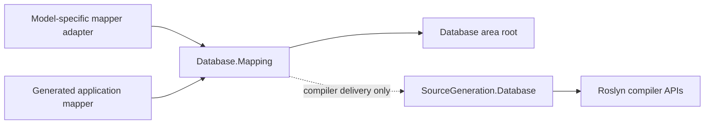

# Mapping core design

## Intent and dependency direction

Identity and save lifecycle are shared between stores; object shape and persistence operations are
model-owned. This library therefore owns typed identity spaces, snapshots and transaction
coordination. It does not know tables, columns, queries, foreign keys, nodes, paths or streams.

The arrows below show dependencies; SQL schema analysis happens in the compiler, not in this core.

| Package | Responsibility | Dependency |
| --- | --- | --- |
| `Assimalign.Cohesion.Database.Mapping` | Identity, snapshots, atomic save coordination | Database area root at runtime; compiler-only analyzer delivery |
| `Assimalign.Cohesion.SourceGeneration.Database` | Analyze retained C# schema declarations and emit direct code | Roslyn only |
| Future model-specific adapters (#1008–#1011) | Model shape, client operations, serialization and transaction implementation | Mapping core and their model client |

No feature or area-root dependency reaches Database.Hosting or any Cohesion.Hosting library.
All registrations are explicit; there is no assembly scan, CLR-type registry or reflection fallback.

The Mapping package bundles the generator through a build-only `CohesionAnalyzerReference`, and
App.Database's reference pack bundles the same compiler assembly as a `CohesionFrameworkAnalyzer`.
Neither delivery path adds the generator or Roslyn to the runtime closure. Generation requires
`CohesionGenerateDatabaseMappers=true`; `Sdk.Database` exposes that property to Roslyn automatically.
Plain SDK/package consumers also declare `CompilerVisibleProperty` as shown in the overview. This
explicit opt-in prevents a framework reference from imposing mapping constraints on schema-only
applications and introduces no second description of the schema.

## Contracts and identity

`IEntityMapper<TEntity, TKey, TSnapshot>` binds key extraction, capture and snapshot equality.
`IEntityReader<TEntity, TSource>` and `IEntityWriter<TEntity, TTarget>` preserve the model's source
and destination shape. They are separate because serialization is not required for identity and
tracking, and a graph path must not become a flattened row just to use shared infrastructure.

`Register` creates one logical identity space and its typed adapter writer. Register each logical
mapping once and retain the returned set. Different registrations may legitimately map the same
CLR type into different collections, so keys are unique within a registration, not across unrelated
mappings. Within a set, `Attach` returns the same tracked object for the same key without overwriting
local edits. Pending deletions retain identity until commit. `Add` rejects duplicate tracked keys;
`Remove` requires the canonical instance and cancels an unsaved addition. Successful deletion
removes identity so a later materialization can track a fresh object.

Keys are non-null, application-assigned immutable values. Changing a tracked key fails before
starting a save transaction. Key comparers must be stable, side-effect-free and non-throwing, as
required by the dictionary identity map. Adapters must select comparers matching their store's key
semantics where those differ from CLR equality (for example collation or temporal representations).
Server-generated keys and key remapping are not promised.

## Explicit change tracking

An attachment captures its accepted baseline. Each save captures the current values once, before
store I/O, and compares them to that baseline. Reverting a value to its original value produces no
write. An addition always inserts; a deletion carries the original snapshot. The writer receives
`EntityChange` with original and current snapshots and the stable key, allowing a document adapter
to calculate a partial update without adding document paths to this core.

The mapper owns snapshot semantics: snapshots must be immutable and must not share mutable state
with the entity. The SQL generator copies byte arrays and compares them structurally. It compares
supported scalar values with typed equality, also preserving `DateTime.Kind` and
`DateTimeOffset.Offset`, and ignores undeclared properties. Floating-point comparison uses value
equality, so signed zero and different NaN payloads are not separate changes. Null and empty
byte arrays differ. Nested mutable objects, navigation changes and collections are not silently
deep-tracked: unsupported SQL shapes receive compile-time diagnostics. Other models must state and
implement their own snapshot semantics.

This is a single-caller scope, with no concurrent calls or entity mutation during save. Reentrant
registration and set operations are rejected while saving. Direct entity mutations cannot be
intercepted, but detached snapshots ensure a later mutation cannot alter an already prepared write;
the accepted baseline is the captured saved snapshot, never a recapture after I/O.

## Atomic save and ownership

`SaveChangesAsync` prepares every registered mapping before opening a transaction. It then stages
all changes in registration and attachment order, commits once, and accepts the captured snapshots.
There is no transaction for an empty change set. All staged writes use the same typed transaction;
writers neither commit nor mutate snapshots.

The store adapter supplies `IMappingStore<TTransaction>` and `IMappingTransaction`. The transaction
must publish all writes atomically, publish none on a throwing/cancelled commit, and roll back
uncommitted writes on disposal. The unit of work always disposes an acquired transaction. A mapping
core cannot synthesize atomicity over a store that lacks it; this contract deliberately refuses to
promise a distributed transaction. Tests use a transactional store that stages multiple writes and
injects failures after staging, at commit and through cancellation to verify both stored state and
retry behavior.

Snapshots are accepted only after commit, including when cancellation races with successful commit.
There is no post-commit cancellation check. A disposal failure after successful commit propagates,
but accepted baselines are preserved so a retry does not duplicate the committed writes. Before
commit, failures leave additions, deletions and original snapshots intact for retry. Mapper and
adapter exceptions propagate; invalid lifecycle/identity operations use `InvalidOperationException`
and invalid arguments use BCL argument exceptions. There is no new exception hierarchy.

The caller owns the store's lifetime. The scope holds entities and snapshots only; it acquires and
disposes store resources within each save, so it requires no separate disposal protocol. Retaining
the scope retains tracked entities. End its lifetime at the application unit-of-work boundary.

## Seams for #1008–#1011

- **SQL (#1008):** bind generated snapshots to the SQL client's transaction and commands. SQL owns
  its typed query builder, schema ownership checks, relationship metadata, dependency ordering and
  optimistic concurrency. The core does not invent SQL or cascade relationships.
- **Documents (#1009):** preserve a document source and immutable snapshot; compare original/current
  snapshots in its writer to produce supported partial updates. Collection identity stays local to
  its registration. Serialization shape is the document adapter's responsibility.
- **Graph (#1010):** materialize typed nodes, relationships and paths using model-owned `TSource`;
  use identity sets for the entities requiring identity. Path shape and cycle semantics remain in
  the graph client. Traversal is never reimplemented by the tracking core.
- **Key-value/blob (#1011):** readers and writers can be used independently of a unit of work.
  Typed stream access should retain its stream source/target, with typed metadata materialized
  separately. Blob content must not be captured in snapshots or buffered by these contracts.

The remaining uncertainty is transport commit certainty: future clients must expose an atomic,
definite transaction outcome, or explicitly design reconciliation before adopting this save
contract. Client transaction support and SQL dependency ordering need proof in #1008; the other
wire clients do not yet exist. No one-off bridge members have been added to preempt those decisions.

## AOT and verification

The library inherits `net10.0` and `IsAotCompatible=true`. Runtime code uses typed generics, direct
interface calls and typed dictionaries. It has no reflection, expression compilation, runtime type
inspection, dynamic registration or `IQueryable` translation. The analyzer retains the established
`netstandard2.0` / `IsAotCompatible=false` compiler-host exception.

The generator reads Roslyn symbols for real `SqlSchema` declarations. It does not execute schema
callbacks inside the compiler and does not require mapping attributes or a second schema. The
existing runtime schema builder/compiler does perform inspection; the AOT guard retains its schema
declaration in an uncalled method and executes only emitted mapping code. That existing compiler is
outside the verified mapper runtime path and is not claimed to have become reflection-free.

Verification covers compiled and executed generated code against a real compiled schema, an actual
published-and-executed NativeAOT guard, source scans of the mapping runtime and generated mapper,
and NativeAOT trim/dynamic-code diagnostics without suppression in these new projects.
