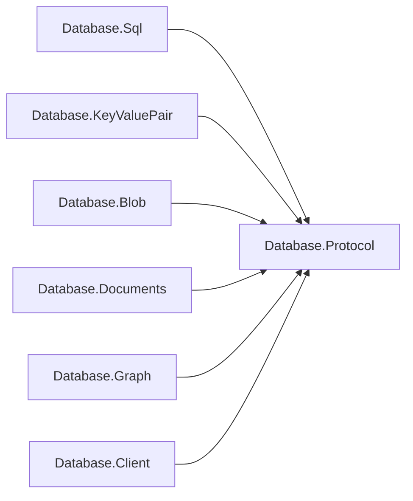
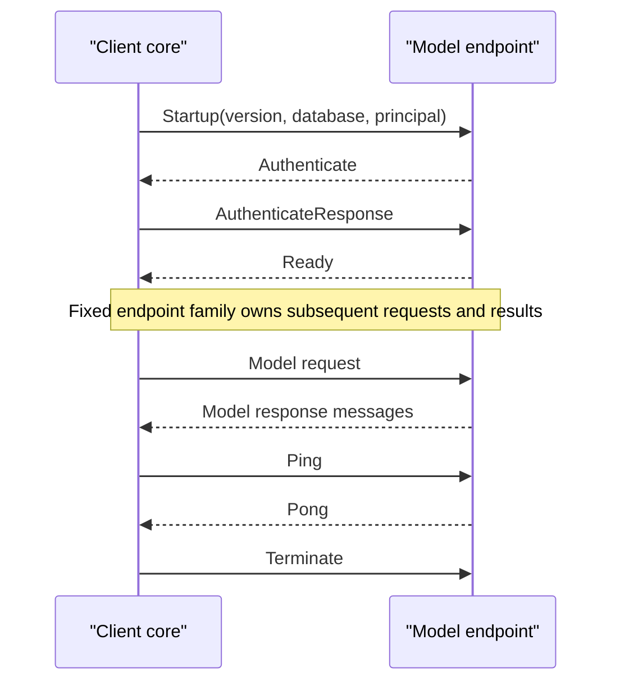

# Database.Protocol design

## Mechanism and model policy

This child root owns the frame envelope, shared payload primitives, startup and
authentication exchange, session lifecycle, error taxonomy, and version negotiation.
It has no model dependencies. As with Database.Language's TokenLexer, Diagnostic,
QueryLanguageProfile and QueryParser, mechanism is shared while each model supplies
its own grammar: here that grammar is its message family and payload codecs.

The dependencies point from model policy toward the shared mechanism.

Each model package owns its message identifiers, encode/decode routines, and exchange
ordering. Each model's Client package owns result materialization. Database.Client
owns pooling, handshake, framed exchanges, and connection health. Each model server
continues to own its accept loop and session state machine.

## Envelope and primitives

Every frame is `u32 payloadLength + u8 type + payload`; lengths exclude the five-byte
header. Integers are big-endian. Payloads are limited to 16,777,216 bytes. Readers
check the length before allocation, require the entire declared payload, distinguish
clean EOF between frames from truncation, and reject oversized declarations. Writers
apply the same bound. Framing imposes no logical-object buffering or transfer policy.

`ProtocolPayload` provides signed i32/i64, unsigned u16, and strings encoded as
`i32 UTF8-byte-length + UTF8 bytes`. Negative lengths and out-of-bounds reads fail
with ProtocolException. Codecs are direct span operations, with no reflection,
Microsoft.Extensions dependencies, serialization discovery, or generated runtime code.

## Numbering and the family seam

The endpoint selects the model before accept. Startup has no model discriminator.
A connection serves one model and one database throughout its lifetime. A client
must choose the endpoint for the family it speaks; the protocol cannot discover a
misconfigured endpoint without the deliberately deferred handshake discriminator.

| Identifier | Owner / meaning |
| --- | --- |
| 0 | Reserved, invalid |
| 1 | Core: Startup |
| 2 | Core: Authenticate |
| 3 | Core: AuthenticateResponse |
| 4 | Core: Ready |
| 5–9 | Model family, preserving deployed identifiers |
| 10 | Core: Error |
| 11 | Core: Ping |
| 12 | Core: Pong |
| 13 | Core: Terminate |
| 14–63 | Reserved for future shared mechanism |
| 64–255 | Model family |

A single contiguous model range would have renumbered deployed messages unnecessarily.
Instead, 5–9 remain endpoint-scoped legacy slots, and new families use 64–255.
Different endpoints may assign the same byte differently. There is never a union of
families or a per-message registry lookup on one session.

`ProtocolMessageFamily` copies its identifier set, rejects duplicate and reserved
identifiers, and has no mutators. `ProtocolChannel` permanently binds one family to
one stream and validates incoming and outgoing identifiers against that family and
the core. Model server sessions create the channel exactly once. Client pools select
one family when composed and reject exchanges belonging to another family. Payload
interpretation belongs exclusively to that endpoint's model codec. Unknown identifiers
are protocol violations; session code reports Error(ProtocolViolation) and closes.

The low-level ProtocolFraming reader/writer remain available for diagnostics and
framing tests. They deliberately do not dispatch payloads or infer model semantics.
Applications use ProtocolChannel for their endpoint's validated exchange.

## Shared exchange and payloads

The shared handshake precedes every model-specific exchange, as shown here.

Startup is `u16 major + u16 minor + string database + string principal`.
The existing trust handshake sends an empty Authenticate and AuthenticateResponse;
authenticators receive response evidence as opaque bytes. Ready is empty in 1.0.
Ping, Pong, and Terminate have empty payloads. Error is `u16 code + string message`.
Codes are append-only: Internal=0, UnsupportedVersion=1, AuthenticationFailed=2,
NotAuthorized=3, DatabaseNotFound=4, ParseFailure=5, ExecutionFailure=6,
TransactionAborted=7, ProtocolViolation=8, Unavailable=9. Statement failures can
leave a session ready; framing, handshake, or ordering violations terminate it.

## Version decision

ProtocolVersion.Current remains **1.0**. SQL and Key-Value deployed clients retain
exactly the same header, message identifiers, handshake, payload encodings, and
exchange order. New families are additive on separately selected model endpoints;
no existing endpoint silently reinterprets an identifier. Moving CLR types between
assemblies is a source/package migration, not a wire-format change.

`TryNegotiate` rejects any major other than 1 and chooses the minimum peer/server
minor. Model servers return UnsupportedVersion before authentication for incompatible
majors. Version 1.0 Ready stays empty, so no new version field is sent to old clients;
success accepts the 1.0 baseline. A future minor requiring capabilities must negotiate
them explicitly before use. An incompatible change to an existing endpoint's meaning
or payload requires a deliberate major bump; changing only framing is not the sole
reason to bump a major. Unknown identifiers never trigger a fallback to another family.

## Extending a model

Define a model-owned identifier enum, a single immutable family, codecs, and its
ordering rules. Bind that family at endpoint accept and client pool composition.
Use shared ProtocolPayload primitives where appropriate, and document the exact
wire payload in the owning model package. Add transport-independent conformance
coverage through Connections.InMemory. Models do not add payload policy to this core.

ProtocolException is this child root's independent exception type. Servers translate
it to the shared wire taxonomy; the client core translates it to DatabaseClientException.
Transports remain outside this package and outside engine packages.
