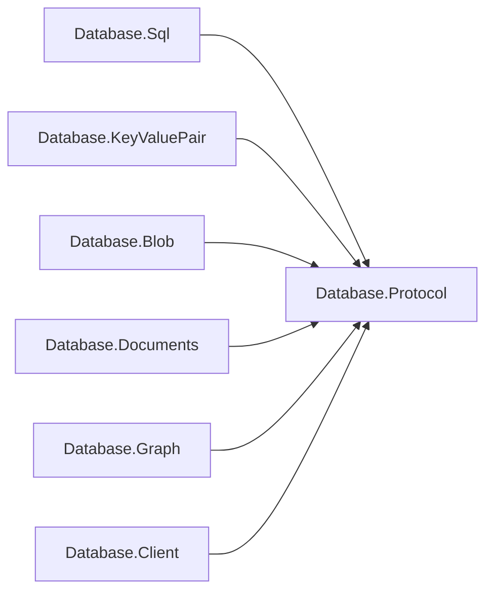
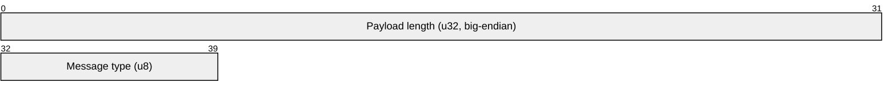
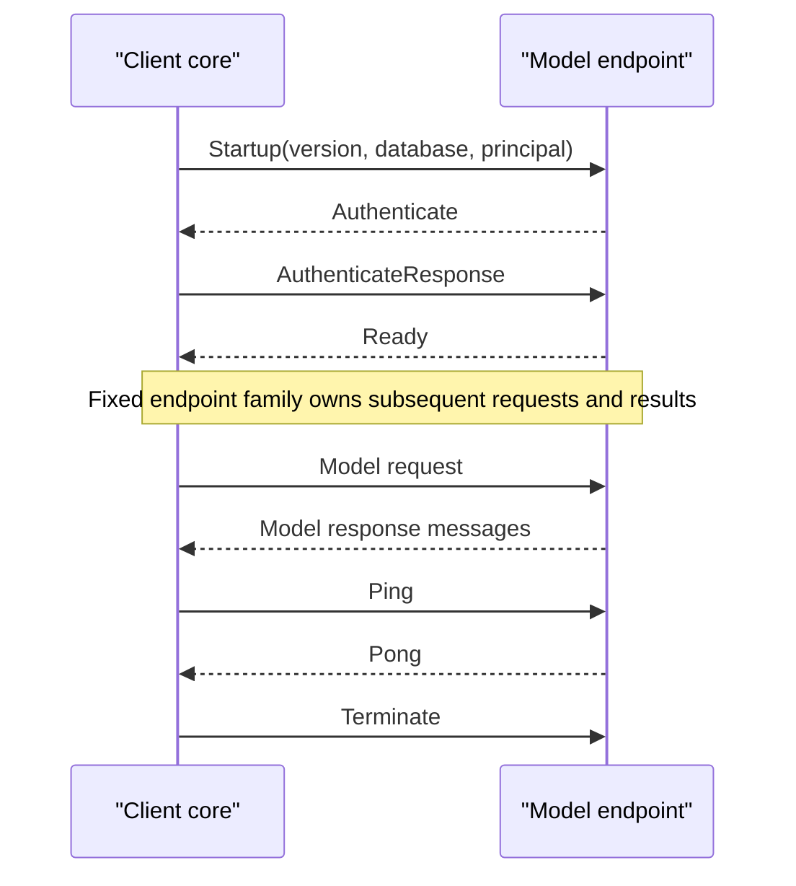
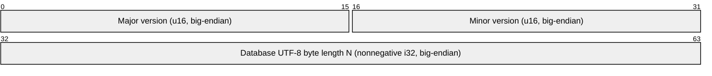

# Database.Protocol design

## Mechanism and model policy

This child root owns the frame envelope, shared payload primitives, startup and
authentication exchange, session lifecycle, error taxonomy, and version negotiation.
It has no model dependencies. As with Database.Language's TokenLexer, Diagnostic,
QueryLanguageProfile and QueryParser, mechanism is shared while each model supplies
its own grammar: here that grammar is its message family and payload codecs.

The dependencies point from model policy toward the shared mechanism.

```mermaid
flowchart LR
    Sql["Database.Sql"] --> Core["Database.Protocol"]
    Kv["Database.KeyValuePair"] --> Core
    Blob["Database.Blob"] --> Core
    Docs["Database.Documents"] --> Core
    Graph["Database.Graph"] --> Core
    Client["Database.Client"] --> Core
```

Each model package owns its message identifiers, encode/decode routines, and exchange
ordering. Each model's Client package owns result materialization. Database.Client
owns pooling, handshake, framed exchanges, and connection health. Each model server
continues to own its accept loop and session state machine.

## Envelope and primitives

Every frame begins with a five-byte header. Header bytes 0–3 (bits 0–31) are the
unsigned 32-bit payload length in big-endian order, and byte 4 (bits 32–39) is the
unsigned 8-bit message type. The payload starts at byte 5, and the declared length
counts only those payload bytes, not the header. Payloads are limited to 16,777,216
bytes. Readers check the length before allocation, require the entire declared
payload, distinguish clean EOF between frames from truncation, and reject oversized
declarations. Every writer applies the same bound before it writes anything (below). Framing imposes no logical-object
buffering or transfer policy. The packet view below shows the two fixed header fields.

```mermaid
packet-beta
0-31: "Payload length (u32, big-endian)"
32-39: "Message type (u8)"
```

`ProtocolPayload` provides signed i32/i64, unsigned u16, and strings encoded as
`i32 UTF8-byte-length + UTF8 bytes`. Negative lengths and out-of-bounds reads fail
with ProtocolException. Codecs are direct span operations, with no reflection,
Microsoft.Extensions dependencies, serialization discovery, or generated runtime code.

## Numbering and the family seam

The endpoint selects the model before accept. Startup has no model discriminator.
A connection serves one model and one database throughout its lifetime. A client
must choose the endpoint for the family it speaks; the protocol cannot discover a
misconfigured endpoint without the deliberately deferred handshake discriminator.

| Identifier | Owner / meaning |
| --- | --- |
| 0 | Reserved, invalid |
| 1 | Core: Startup |
| 2 | Core: Authenticate |
| 3 | Core: AuthenticateResponse |
| 4 | Core: Ready |
| 5–9 | Model family, preserving deployed identifiers |
| 10 | Core: Error |
| 11 | Core: Ping |
| 12 | Core: Pong |
| 13 | Core: Terminate |
| 14–63 | Reserved for future shared mechanism |
| 64–255 | Model family |

A single contiguous model range would have renumbered deployed messages unnecessarily.
Instead, 5–9 remain endpoint-scoped legacy slots, and new families use 64–255.
Different endpoints may assign the same byte differently. There is never a union of
families or a per-message registry lookup on one session.

`ProtocolMessageFamily` copies its identifier set, rejects duplicate and reserved
identifiers, and has no mutators. `ProtocolChannel` permanently binds one family to
one stream and validates incoming and outgoing identifiers against that family and
the core. Model server sessions create the channel exactly once. Client pools select
one family when composed and reject exchanges belonging to another family. Payload
interpretation belongs exclusively to that endpoint's model codec. Unknown identifiers
are protocol violations; session code reports Error(ProtocolViolation) and closes.

`ProtocolFrameReader.Create` and `ProtocolFrameWriter.Create` return the low-level
stream reader and writer, for diagnostics, framing tests and a server's at-capacity
rejection (one Error frame written before any session or channel exists). They
deliberately do not dispatch payloads or infer model semantics. Applications use
ProtocolChannel for their endpoint's validated exchange.

## Frame reader and writer types

`ProtocolFrameReader` and `ProtocolFrameWriter` are public abstract classes, not
interfaces: the Database area is concrete-first (`.claude/rules/database-area.md`).
Each has a variant set. The stream reader and writer behind `Create` encode the
envelope; every other leaf decorates one of them:

| Leaf | Assembly | Adds |
| --- | --- | --- |
| stream reader / writer (internal) | Database.Protocol | the envelope; on the reader, the declared-length bound |
| `ProtocolChannel`'s family reader / writer (private) | Database.Protocol | the family check in both directions |
| `ClientFrameReader` / `ClientFrameWriter` (internal) | Database.Client | a closed pipe's `InvalidOperationException` becomes `IOException` |
| Blob's error reader / frame writer (private) | Database.Blob.Client | closed pipes, and on the reader Error frames, become `DatabaseClientException` |

Because leaves live in three assemblies, the constructors are `protected`. The public
members (`ReadFrameAsync`, `WriteFrameAsync`, `FlushAsync`, `DisposeAsync`) are
non-virtual and call `protected abstract` cores (`ReadFrameCoreAsync`,
`WriteFrameCoreAsync`, `FlushCoreAsync`); `DisposeAsyncCore` is a `protected virtual`
lifecycle hook whose default does nothing, so a view over a shared reader or writer
(Blob's) does not override it. The `Create` factories replace the former
`ProtocolFraming` static class, the `Aes.Create()` shape.

**The writer's payload bound is the base's (owner decision 29 of 2026-10-06).** The public,
non-virtual `WriteFrameAsync` refuses a payload longer than
`ProtocolFrameHeader.MaxPayloadLength` with a `ProtocolException` before it calls the core
(rule 4: public members own argument validation), so every writer refuses an oversized payload
the same way and before anything reaches the transport: the stream writer, the channel's family
writer, the client decorators, and any leaf another assembly adds. Until then the check sat in
the stream writer's core, the one writer that encodes the envelope, which a leaf that did not
forward to it skipped. The bound now runs before every core, so the error order is fixed: **a
frame that fails both the bound and `ProtocolChannel`'s family check reports the bound**; a frame
that fails only the family check still reports the family. The bound is thrown by the call
itself, not through the returned task, as the channel's family check is. `ProtocolFramingTests` pins both
(`WriteFrame_OversizedPayload_EveryWriterShouldRefuseBeforeItsCore`,
`Channel_OversizedPayloadOutsideTheFamily_ShouldReportTheBoundFirst`). The reader's bound stays
in the stream reader's core, where the declared length is decoded. The other public members add
no check of their own.

## Diagnostics

The child root reports through one internal event source named for its assembly,
`Assimalign.Cohesion.Database.Protocol` (`src/Internal/EventSource/ProtocolEventSource.cs`): a
Verbose frame trace under the `Frames` keyword (`0x1`), so a tool takes it alone with
`dotnet-trace collect --providers Assimalign.Cohesion.Database.Protocol:0x1:5`. A frame carries its
message type and payload length, never its payload.

| Id | Event | Level | Keyword | Payload |
| --- | --- | --- | --- | --- |
| 1 | `FrameRead` | Verbose | `Frames` | `messageType` (the `ProtocolMessageType` name, or its number for a model identifier), `payloadLength` |
| 2 | `FrameWritten` | Verbose | `Frames` | `messageType`, `payloadLength` |

**The public members write the events, for the stream leaf only.** `ReadFrameAsync` and
`WriteFrameAsync` write them, so the trace follows the NVI rule, but only when the reader or writer
is the stream one `Create` returns. Every other leaf in the table above decorates a stream leaf
through its public member, so writing at every layer would report one wire frame two or three
times (a client's response passes the client decorator, the channel's family reader and the stream
reader). A frame is reported once, where it crosses the transport; a frame a decorator refuses (the
family check) was still read or written. `FrameRead` follows a non-null frame; the clean end of the
stream writes nothing. `FrameWritten` follows a completed write, before any flush.

**The trace costs nothing while nobody takes it.** The public member checks
`IsEnabled(Verbose, Frames)` and returns the core's task unchanged when it is off. When it is on, a
core that completed synchronously is reported at once; otherwise a static wrapper on a pooling
builder (`PoolingAsyncValueTaskMethodBuilder`) awaits it and reports the frame. No counters: the
SQL server writes one frame per result row, and a process-wide count updated per frame by every
session would be a contention point. Frame failures (`ProtocolException`) are not events here: the
server session or the client that catches one reports it, with its session or connection.

`ProtocolEventSourceTests` checks the name, the strict manifest, one event per frame through a
`ProtocolChannel` (and through a transport that completes asynchronously), nothing without the
keyword, and that the reader and writer allocate no more than their stream cores while nobody
listens (zero bytes per frame in Release).

## Shared exchange and payloads

The shared handshake precedes every model-specific exchange, as shown here.

```mermaid
sequenceDiagram
    participant Client as "Client core"
    participant Server as "Model endpoint"
    Client->>Server: Startup(version, database, principal)
    Server-->>Client: Authenticate
    Client->>Server: AuthenticateResponse
    Server-->>Client: Ready
    Note over Client,Server: Fixed endpoint family owns subsequent requests and results
    Client->>Server: Model request
    Server-->>Client: Model response messages
    Client->>Server: Ping
    Server-->>Client: Pong
    Client->>Server: Terminate
```

Startup is `u16 major + u16 minor + string database + string principal`. In its fixed
prefix, bytes 0–1 (bits 0–15) are the big-endian unsigned 16-bit major version, bytes
2–3 (bits 16–31) are the big-endian unsigned 16-bit minor version, and bytes 4–7
(bits 32–63) are the database string's nonnegative big-endian signed 32-bit UTF-8
byte length `N`. The `N` database bytes start at byte 8; the principal's nonnegative
big-endian signed 32-bit UTF-8 byte length follows at byte `8 + N`, followed by that
many principal bytes.
The packet view below shows the startup payload's fixed eight-byte prefix.

```mermaid
packet-beta
0-15: "Major version (u16, big-endian)"
16-31: "Minor version (u16, big-endian)"
32-63: "Database UTF-8 byte length N (nonnegative i32, big-endian)"
```

The existing trust handshake sends an empty Authenticate and AuthenticateResponse;
authenticators receive response evidence as opaque bytes. Ready is empty in 1.0.
Ping, Pong, and Terminate have empty payloads. Error is `u16 code + string message`.
Codes are append-only: Internal=0, UnsupportedVersion=1, AuthenticationFailed=2,
NotAuthorized=3, DatabaseNotFound=4, ParseFailure=5, ExecutionFailure=6,
TransactionAborted=7, ProtocolViolation=8, Unavailable=9, ConnectionFailure=10. Statement failures can
leave a session ready; framing, handshake, or ordering violations terminate it.
`ConnectionFailure` is the one client-local code: the client core raises it when the transport
dial fails, and no server sends it (the client core reads an error frame that carries it as a
`ProtocolViolation`). It shares the taxonomy so a client exception carries one code
type, as SQLSTATE class 08 holds `08001` (`sqlclient_unable_to_establish_sqlconnection`), which
a client raises (PostgreSQL `src/backend/utils/errcodes.txt:108`; postgres_fdw raises it when it
cannot reach its remote server, `contrib/postgres_fdw/connection.c:661-666`).

## Version decision

ProtocolVersion.Current remains **1.0**. SQL and Key-Value deployed clients retain
exactly the same header, message identifiers, handshake, payload encodings, and
exchange order. New families are additive on separately selected model endpoints;
no existing endpoint silently reinterprets an identifier. Moving CLR types between
assemblies is a source/package migration, not a wire-format change.

`TryNegotiate` rejects any major other than 1 and chooses the minimum peer/server
minor. Model servers return UnsupportedVersion before authentication for incompatible
majors. Version 1.0 Ready stays empty, so no new version field is sent to old clients;
success accepts the 1.0 baseline. A future minor requiring capabilities must negotiate
them explicitly before use. An incompatible change to an existing endpoint's meaning
or payload requires a deliberate major bump; changing only framing is not the sole
reason to bump a major. Unknown identifiers never trigger a fallback to another family.

## Extending a model

Define a model-owned identifier enum, a single immutable family, codecs, and its
ordering rules. Bind that family at endpoint accept and client pool composition.
Use shared ProtocolPayload primitives where appropriate, and document the exact
wire payload in the owning model package. Add transport-independent conformance
coverage through Connections.InMemory. Models do not add payload policy to this core.

ProtocolException is this child root's independent exception type. Servers translate
it to the shared wire taxonomy; the client core translates it to DatabaseClientException.
Transports remain outside this package and outside engine packages.
