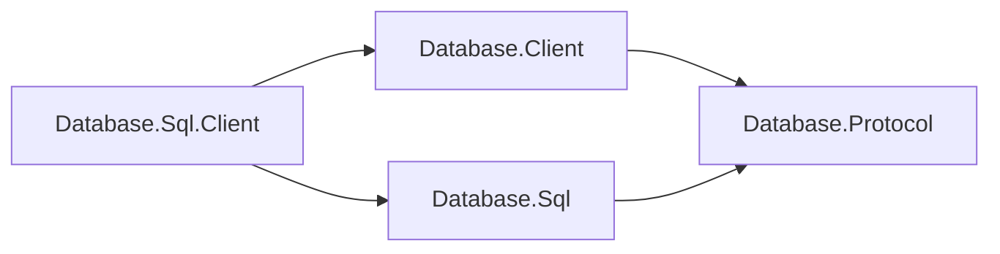

# Database.Sql.Client — Design

The SQL client owns parameter encoding, response decoding and materialization,
typed commands/results, and error/telemetry mapping. It delegates dialing,
startup/authentication, framing, and pooling to the shared client.

## Family position

The SQL client references shared mechanics and its model's codecs:

| Package | Role |
| --- | --- |
| Database.Sql.Client | SQL materialization and typed APIs |
| Database.Client | Pooling, handshake, framed exchange lifetime |
| Database.Sql | SQL identifiers and payload codecs |
| Database.Protocol | Shared framing and immutable family binding |

Other model clients do not depend on this package.

## SQL-owned exchange

`SqlClient.Create` binds the pool to `SqlProtocol.Family`.
`SqlExecuteExchange` implements `IDatabaseProtocolExchange<DatabaseClientResult>`:
it encodes parameters with `DatabaseValueCodec`, writes the execute request,
consumes SQL's header/data/completion exchange, and materializes values.
`SqlConnection` projects this result into `SqlResultSet`.

`SqlProtocolConnectionExtensions.ExecuteAsync` provides the same operation on a
rented `IDatabaseConnection` bound to SQL's exact family instance.
`DatabaseClientResult` and `DatabaseClientColumn` moved to this package's
namespace. Typed SQL APIs and protocol 1.0 wire behavior are unchanged.

The model reference supplies codecs without parsing SQL or inspecting plans.
Its transitive assembly closure is an accepted packaging consequence; a dedicated
model protocol assembly can be a future refinement. The model's
[design](../../Assimalign.Cohesion.Database.Sql/docs/DESIGN.md) defines wire ownership.

## Typed projection

Column names map to ordinals once, shared by every result record. First column
wins duplicate names; ordinal access reaches every value. Exact runtime types are
returned directly; widening getters use `Convert.ChangeType` and invariant
culture, without reflection. Incompatible access produces `InvalidCast`.

Parameter collection names strip a leading `@` or `$`; bare names travel on the
wire. SQL parsing remains the server's responsibility.

## Lifecycle, errors, and telemetry

Disposing a typed connection returns its shared authenticated session; disposing
the client closes its pool. Connections support one exchange at a time.

`SqlClientException : DatabaseException` maps stable wire codes to SQL error kinds
and retains the original code. The shared pool invalidates incomplete exchanges,
including cancellation and decoder failure. Completed parse/execution failures
keep the connection reusable.

Observers receive synchronous primitive callbacks before execution, on completion,
and on failure. Observer exceptions are swallowed so telemetry cannot change the
command outcome.

## AOT and non-goals

Encoding and materialization are hand-written, with no reflection or code
generation. Transports are typed options, never string-named plugins. Full result
materialization is SQL client policy; an incremental API can be added here
independently. Parsing, ORM behavior, retries, and explicit wire transactions
remain outside the current surface.
