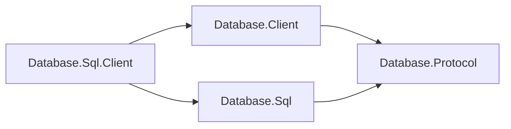

# Database.Sql.Client — Design

The SQL client owns parameter encoding, response decoding and materialization,
typed commands/results, and error/telemetry mapping. It delegates dialing,
startup/authentication, framing, and pooling to the shared client.

## Family position

The SQL client references shared mechanics and its model's codecs:

```mermaid
flowchart LR
    SqlClient["Database.Sql.Client"] --> Client["Database.Client"]
    SqlClient --> Sql["Database.Sql"]
    Client --> Protocol["Database.Protocol"]
    Sql --> Protocol
```

| Package | Role |
| --- | --- |
| Database.Sql.Client | SQL materialization and typed APIs |
| Database.Client | Pooling, handshake, framed exchange lifetime |
| Database.Sql | SQL identifiers and payload codecs |
| Database.Protocol | Shared framing and immutable family binding |

Other model clients do not depend on this package.

## SQL-owned exchange

`SqlClient.Create` binds the pool to `SqlProtocol.Family`.
`SqlExecuteExchange` derives from `DatabaseProtocolExchange<DatabaseClientResult>`:
it encodes parameters with `DatabaseValueCodec`, writes the execute request,
consumes SQL's header/data/completion exchange, and materializes values.
`SqlConnection` projects this result into `SqlResultSet`.

`SqlProtocolConnectionExtensions`, an `extension(DatabaseConnection)` block, provides
the same operation as `ExecuteAsync` on a rented `DatabaseConnection` bound to SQL's
exact family instance. It stays an extension because the connection lives in
Database.Client, which references no model package.
`DatabaseClientResult` and `DatabaseClientColumn` moved to this package's
namespace. Typed SQL APIs and protocol 1.0 wire behavior are unchanged.

The model reference supplies codecs without parsing SQL or inspecting plans.
Its transitive assembly closure is an accepted packaging consequence; a dedicated
model protocol assembly can be a future refinement. The model's
[design](../../Assimalign.Cohesion.Database.Sql/docs/DESIGN.md) defines wire ownership.

## Typed projection

Column names map to ordinals once, shared by every result record. First column
wins duplicate names; ordinal access reaches every value. Exact runtime types are
returned directly; widening getters use `Convert.ChangeType` and invariant
culture, without reflection. Incompatible access produces `InvalidCast`.

Parameter collection names strip a leading `@` or `$`; bare names travel on the
wire. SQL parsing remains the server's responsibility.

## Lifecycle, errors, and telemetry

Disposing a typed connection returns its shared authenticated session; disposing
the client closes its pool. Connections support one exchange at a time.

`SqlConnection.AbortAsync` discards a rental and closes its session instead of
returning it to the pool. Use it when SQL session state cannot be reset, including
a failed ROLLBACK or uncertain COMMIT. It delegates to the shared client's discard
operation and is not cancellable. Discarding prevents session leakage; it cannot
undo an already published transaction.

SQL transactions currently use ordinary `BEGIN`, `COMMIT` and `ROLLBACK` commands
on one connection. The wire protocol does not expose a durable transaction token,
status lookup or replay deduplication. A connection loss after the server publishes
COMMIT but before the response reaches the client has an unknown outcome. Client
exceptions do not promise that a failed COMMIT left no writes. The SQL mapper
documents and enforces this boundary by faulting its scope/store and refusing replay;
see its [reconciliation contract](../../Assimalign.Cohesion.Database.Sql.Mapping/docs/DESIGN.md#commit-outcome-and-reconciliation).

`SqlClientException : DatabaseException` maps stable wire codes to SQL error kinds
and retains the original code. The shared pool invalidates incomplete exchanges,
including cancellation and decoder failure. Completed parse/execution failures
keep the connection reusable.

Observers receive synchronous primitive callbacks before execution, on completion,
and on failure. Observer exceptions are swallowed so telemetry cannot change the
command outcome. An observer derives from the abstract `SqlClientObserver`, whose
three hooks are `protected internal virtual` with empty bodies: an observer overrides
only the hooks it records, and only the owning `SqlConnection` fires them.

## AOT and non-goals

Encoding and materialization are hand-written, with no reflection or code
generation. Transports are typed options, never string-named plugins. Full result
materialization is SQL client policy; an incremental API can be added here
independently. Parsing, ORM behavior, retries, and explicit wire transactions
remain outside the current surface.

## Concrete types (concrete-types plan, phase 5, #1261)

The package has no public interface left and no `Abstractions/` folder
([plan](../../../../docs/programs/DATABASE_CONCRETE_TYPES_PLAN.md) §7, "P5, as landed").

| Type | Shape | Was |
|---|---|---|
| `SqlClient` | sealed; `Create(SqlClientOptions)` over a private constructor | the static `SqlClient` factory, `ISqlClient` and the internal `DefaultSqlClient` |
| `SqlConnection` | sealed; internal constructor; moved out of `Internal/` | `ISqlConnection` and the internal `SqlConnection` |
| `SqlClientObserver` | abstract; protected constructor; `protected internal virtual` hooks with empty bodies | `ISqlClientObserver` |
| `SqlProtocolConnectionExtensions` | `extension(DatabaseConnection)` block | an old-style `this IDatabaseConnection` extension |

- **Why the observer is abstract.** It is an inverted seam (`database-area.md`, rule 2): the
  application supplies it through `SqlClientOptions.Observer` and the connection fires it; no
  observer ships. Its constructor is protected because applications derive from it (rule 3),
  and it carries the deviation marker. Because the hooks have empty bodies, an observer overrides
  only what it records; one that implemented the interface had to implement all three.
  `SqlClientTests.QueryAsync_WithPartialThrowingObserver_ShouldKeepEachCommandOutcome` covers a
  one-hook observer that throws.
- **Typed surface.** `ConnectAsync` returns the sealed `SqlConnection`, which wraps the core's
  sealed `DatabaseConnection`; nothing casts. `Settings` reads the core's settings.
- **What changed for a caller.** `ISqlClient` and `ISqlConnection` become `SqlClient` and
  `SqlConnection` (the Sdk.ApplicationModel `EnabledWeb` fixture and Studio's SQL workspace were
  retyped), and an observer overrides `protected` hooks instead of implementing public ones.
  The sealed `SqlConnection` shares its name with `Microsoft.Data.SqlClient.SqlConnection`; a
  file that imports both namespaces aliases one (plan §11, R11).
