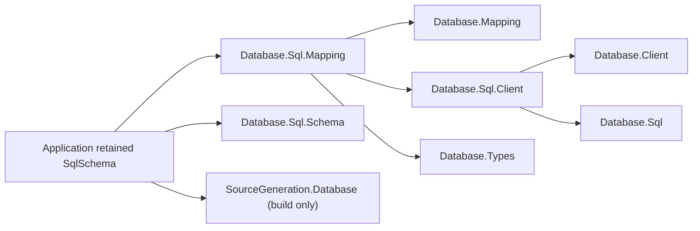
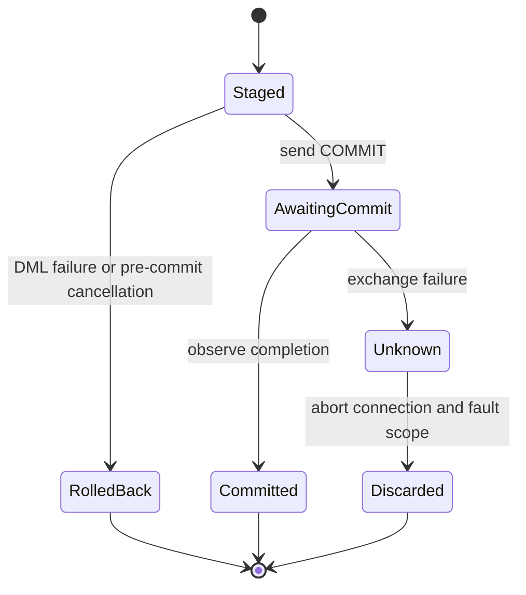

# Database.Sql.Mapping design

## Intent and family boundary

This adapter proves that the shared mapping core can express a relational model
without runtime member discovery or a second schema configuration language. The
existing `SqlMapperGenerator` reads retained `SqlSchema` source declarations. When
the SQL adapter is referenced, it additionally emits `ISqlEntityMapping`, typed
column tokens, snapshot serialization and foreign-key target table names. Core-only
consumers retain their original generated surface.

The dependency direction keeps schema deployment and hosting outside the mapper:

| Package | Responsibility |
| --- | --- |
| `Assimalign.Cohesion.Database.Sql.Mapping` | Retained mapping contracts, SQL commands, typed queries, dependency scheduling and outcome handling |
| `Assimalign.Cohesion.Database.Mapping` | Identity, detached snapshots, change detection and one save transaction |
| `Assimalign.Cohesion.Database.Sql.Client` | Typed SQL requests, parameter/result codecs and model errors |
| `Assimalign.Cohesion.Database.Client` | Pooling, transport lifetime and explicit rental discard |
| `Assimalign.Cohesion.Database.Types` | Retained storage type identities used to reject mismatched query values |
| `Assimalign.Cohesion.Database.Sql.Schema` | The application's retained deployment model |
| `Assimalign.Cohesion.SourceGeneration.Database` | Compile-time verification and static mapping emission |

There is no shipped-library friend assembly. Runtime operations use public client
and core contracts. The generator remains the existing netstandard2.0 analyzer;
all runtime and emitted code is NativeAOT-compatible.

The NuGet dependency on `Database.Mapping` preserves analyzer assets while keeping
build and content assets private. Mapping is the single package carrying the
generator DLL. SQL.Mapping does not bundle another copy: consumers referencing
either only SQL.Mapping or both packages receive the same analyzer file path.

The principal extension contract is `ISqlEntityMapping`; store and transaction
implement the existing core interfaces. Query, predicate and column types are
sealed immutable construction surfaces whose closed grammar is part of their
contract. They have concrete types so an implementation cannot silently substitute
an arbitrary SQL expression behind the restricted builder grammar.

## Retained shape and schema authority

`ISqlEntityMapping<TEntity,TKey,TSnapshot>` composes the core mapper, reader and
writer contracts with ordered column names, a primary key, referenced table names
and snapshot writing. Parallel column storage types validate each query comparison
even when a caller fabricates a column token with the wrong generic value type.
The generator emits these from exactly the same selectors
as deployment. It validates unsupported declarations and contradictions during
compilation rather than discovering them during a save. `WriteSnapshot` supplies
detached values, including binary copies, so a later entity mutation cannot change
the buffered request.

Mapping metadata is copied and validated at registration/query creation. Invalid
names, duplicate columns and missing key columns fail before sending SQL. Double
quotes inside identifiers are rejected precisely: the current executable lexer
does not implement escaped quoted identifiers. All other identifiers are delimited;
values are exclusively parameters. A caller can explicitly implement the public
mapping contract, just as it can implement the core contracts, but must then meet
its documented retained-schema obligations. The compile-time guarantee applies to
generated mappings derived from the compiled retained declaration. Deploying a
different application binary or independently replaced schema is not made safe by
a client mapper; the server still validates every statement against its catalog.

## Save ordering and atomicity

`SqlMappingStore` owns no client lifetime. A save rents one connection, sends
`BEGIN`, and returns a transaction to the core. The core captures all changes and
the adapter buffers their SQL without executing DML. At commit the adapter orders
the retained table dependency graph and executes inserts, then updates, then
deletes. Parents precede children for insert/update; children precede parents for
delete. Registration order and attachment order do not override these dependencies.
Within one table, the core's stable attachment order is preserved.

This supports a save that inserts a new parent and child, changes an existing
entity, and deletes another graph as one transaction. A foreign-key, uniqueness or
other server failure partway through execution rolls back every preceding write.
An update or delete affecting a count other than one fails the save, preventing a
missing entity from being silently accepted. There are no optimistic concurrency
tokens: a concurrent update that preserves the row can still be overwritten.

Dependency cycles, including self references among staged tables, are rejected
before any DML. The mapper does not invent deferred constraints, nullable temporary
keys, or multiple atomic transactions to accommodate a cycle. The engine's immediate
constraint enforcement may also reject a unique-value swap; it rolls the whole
save back. Such graphs require an explicit application/schema design.

One store permits one save at a time. Separate query calls rent separate connections
and do not participate in an active save transaction. The application owns unit of
work scope and must obey the core's single-caller rule. Disposal rolls back unless
commit succeeded. A failed rollback discards the connection and faults the store,
so an open transaction cannot leak into another pool rental.

## Commit outcome and reconciliation

**The SQL client does not provide a definite committed/not-committed outcome when
the COMMIT acknowledgement is lost.** The server can publish atomically and then
lose the connection before its completion reaches the client. Protocol 1.0 has no
durable transaction identifier, operation deduplication token or transaction-status
lookup. Transport failure, cancellation or a later ROLLBACK cannot prove which
side of publication the failure occurred on. Even a conservative classification
of a server error cannot manufacture that missing observation.

The adapter checks cancellation immediately before sending COMMIT, then uses
`CancellationToken.None` for that exchange. Once COMMIT starts, any nonfatal failure
is surfaced as `MappingCommitOutcomeUnknownException`. The adapter faults its
store before cleanup, and the core faults its unit of work before disposal. Tracking
snapshots remain unresolved and no registration, identity operation or further save
is permitted on that scope. Creating another unit of work over the same store also
fails. The connection is aborted through the explicit client discard capability,
never returned to the pool. Cleanup errors cannot replace the outcome exception.

The lifecycle distinguishes an ordinary retryable pre-commit failure from the
unresolved state:

Reconciliation is an application responsibility, not an automatic retry feature.
After an unknown outcome, preserve the intended change set and application-assigned
keys, stop competing writers for that logical operation, and consult authoritative
database state through an independent connection. Reconcile the entire intended
unit, not only the first inserted row. Account for already-applied cascades and any
other writers; observing a row alone is not proof that this particular save created
it. Establish either that the desired unit committed or that it did not commit
before creating a fresh store/scope and attaching the authoritative state.

If concurrent writes or external effects make those observations inconclusive,
the application must retain the unresolved operation for operator intervention.
Exactly-once automatic recovery requires a future server protocol or a durable
application operation journal committed inside the same transaction; neither is
implemented here. In particular, this adapter does not promise safe retry after
an unknown COMMIT, automatic reconciliation, cross-store atomicity, or durability
beyond the SQL engine/storage configuration. This is the explicit boundary inherited
by subsequent mapping adapters (#1009–#1011).

## Query grammar and relationship loading

`SqlQuery<TEntity>` is immutable and materializes the complete retained entity
shape. Its grammar is deliberately smaller than the engine's measured 33/49 clause
surface: `SELECT [DISTINCT] columns FROM table [WHERE predicate] [ORDER BY columns]
[LIMIT integer] [OFFSET integer]`. Predicates comprise six comparisons, `IS NULL`,
`IS NOT NULL`, and parenthesized `AND`, `OR`, `NOT`. Every scalar comes from a typed
`SqlColumn<TEntity,TValue>` token; predicate and order columns must belong to the
same retained mapping. Null equality becomes `IS NULL`, null inequality becomes
`IS NOT NULL`, and ordered comparison against null fails precisely before execution.
Negative pagination values, unknown columns, nonfinite parameters and unsupported
value types are rejected locally. Byte values normalize to the retained schema's
Int16 storage representation; byte arrays are detached copies.

Non-null Binary, Float32 and Float64 predicates throw `NotSupportedException` at
command compilation. The engine's predicate evaluator cannot compare binary
values, and its floating-point comparison converts values through Decimal, which
cannot represent the complete IEEE domain and can collapse distinct values. No
query command is emitted for these unsupported comparisons. Ordering and DISTINCT
use the engine's separate grouping comparator, which supports binary content and
floating-point values beyond Decimal range, so those operations remain available.

Raw SQL fragments, expression trees, delegates translated to SQL, joins, grouping,
aggregates, subqueries, set operations, windows, DML RETURNING and DDL have no builder
members. In particular the builder cannot emit a recognized-but-excluded clause
that the parser rejects with `COHDBL001`. New grammar must first have measured engine
support and a parser/planner execution test before receiving a builder member.

Foreign keys are scalar retained members. Load a parent and query the children with
their generated foreign-key token, then explicitly assemble application navigation
collections. Queries return detached entities; `Attach` selects the existing
tracked instance without overwriting local modifications. No navigation discovery,
lazy loading, proxy objects or automatic fixup occurs.

## Keys, ownership and AOT

Keys are immutable and assigned by the application. SQL mapper generation rejects
Binary, Float32, Float64, DateTime and DateTimeOffset primary keys. Floating-point
signed zero and temporal Kind/offset distinguish encoded storage keys while the
SQL equality predicate may equate their values; binary predicates do not execute.
Those identities cannot support reliable targeted UPDATE/DELETE in this dialect.
Runtime metadata validation applies the same precise restriction to explicit
mapping implementations. The types remain valid non-key columns. Integer widths,
Boolean, Decimal, String, DateOnly, TimeOnly, TimeSpan and Guid keys use their normal
typed equality. Nonfinite values are rejected as SQL parameters.
Default string identity is binary. Applications using a different database default
string collation must pass the matching comparer to `SqlMapping.Register`; the
mapper cannot infer deployment options not present in the retained declaration.
Custom comparers must remain stable and non-throwing as required by the core.

Code-first ownership protects **schema structure**. Entity inserts, updates and
deletes into schema-owned tables are ordinary allowed DML. This adapter exposes no
table/index creation, alteration, drop, owner mutation, deployment or catalog
capability. It sends no DDL and has no provisioning identity to bypass the engine's
ownership checks. Independent attempts at DDL remain subject to the engine's existing
`DatabaseObjectOwner.Schema` enforcement.

Index ownership is independent from table ownership: existing engine policy permits
an ordinary session to create a new ad-hoc index on a schema-owned table. It still
refuses alteration/deletion of the schema-owned table or its schema-owned indexes.
The mapper has no index-management entry point and does not change that distinction.

The runtime uses statically selected generic interfaces and generated accessors.
There is no reflection, `IQueryable`, dynamic compilation, assembly loading or
`Microsoft.Extensions.*` dependency. Application-assigned keys, shallow scalar
tracking and explicit relationships avoid introducing runtime generation through
proxies or navigation machinery. The package's own NativeAOT sample publishes and
runs a guard over the actual server/client path.
