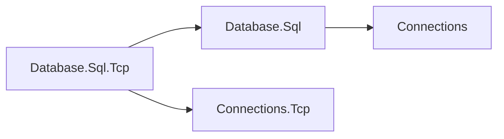

# SQL TCP composition design

## Ownership

Transport selection belongs to the composition root. This optional integration
references SQL and Connections.Tcp; SQL never references this integration or a
concrete transport. App.Database includes the integration for SDK consumers.

The dependencies follow the direction shown here.

## Endpoint behavior

`Listen(Uri)` retains its namespace, signature, IP-literal/localhost/wildcard
resolution, validation, and listener ownership behavior. Referencing this package
is the source migration; no SQL engine API chooses a transport. The existing SQL
server-options tests exercise the moved extension unchanged. No DNS lookup,
reflection, Microsoft.Extensions dependencies, or runtime code generation is used.
