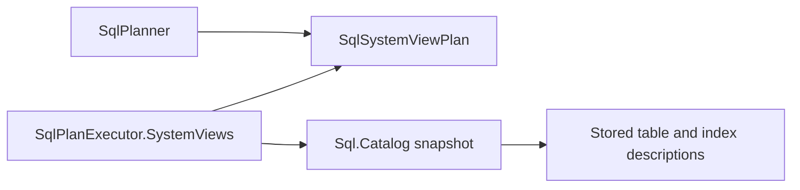
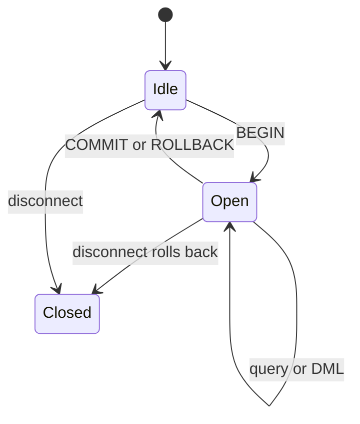

# Assimalign.Cohesion.Database.Sql — Design

The SQL engine (area architecture: [resources/Database/DESIGN.md](../../../../docs/resources/Database/DESIGN.md)
§3.3): parse (`Sql.Language`) → plan (`SqlPlanner`) → execute (`SqlPlanExecutor`)
against shared storage, with the catalog (`Sql.Catalog`) as schema authority.

## Compiled-schema provisioning

`ISqlDatabase` implements the root `IDatabaseSchemaProvisioner` seam. Before a
schema is applied, the provisioner requires `EngineModel.Sql`, the same logical
database name, and a shape the shipped SQL DDL surface can represent. It then
reconstructs or reads the last canonical catalog state, uses
`SqlSchemaMigrationPlanner` from `Database.Sql.Schema` for deterministic ordering/destructive gating, and
`SqlMigrationScriptGenerator` for parser-validated engine requests. Supported
steps are table, column, and secondary-index add/drop; alter/rebuild operations
and advanced objects (custom types, functions,
triggers, principals/grants, extensions) fail before execution rather than
recording a false applied hash. Foreign keys and checks now render into provisioning
DDL and persist in the table catalog; unique declarations use unique indexes.

Each DDL request remains self-committing under the catalog's established rule.
On a later failure, completed reversible steps run their compensating requests
in reverse order and the applied-schema marker remains unchanged. The marker is
written only after all steps succeed, and a repeated apply is a no-op only when
the stored canonical document/hash and live catalog all agree. Full atomicity
for a destructive multi-statement migration is deliberately not claimed: the
current catalog has no transaction spanning DDL statements, and irreversible
data loss cannot be compensated. That kernel seam is recorded as the remaining
gap rather than hidden behind the content hash.

### Object ownership and the schema package

The area root carries only `CompiledSchema` identity and canonical content, the
`IDatabaseSchemaProvisioner` seam, and model-independent ownership contracts.
`Database.Sql.Schema` owns SQL declarations, compiled tables/indexes/constraints,
validation, serialization, and migration plans. The engine references this thin
package; the schema package never references the engine or its storage/transport.

Live sessions create `Adhoc` tables and indexes. The provisioner's private
session carries the compiled schema name as `ProvisioningSchema` in an internal
statement context, so catalog creation persists `Schema` ownership and that name
as `OwningSchema` in the object's first durable record. `SqlCatalogTable.Schema`
remains the separate SQL namespace (for example, `dbo`). Only that internal
session may execute `DROP TABLE`, `ALTER TABLE ADD COLUMN`, `ALTER TABLE DROP
COLUMN`, or `DROP INDEX` against its schema's objects. Normal sessions receive
`DatabaseObjectLockedException` with the object, compiled schema exposed as
`OwningSchema`, and refused operation; row DML remains available. Compensation
uses the same private session and preserves the existing reversible-step policy.

DDL re-reads catalog ownership after acquiring the exclusive object lock. If a
table was dropped and its name reused while the statement waited, the acquired
lock covers the old object id: the statement rejects a schema-owned replacement
and requires a retry for any other replacement before changing metadata or rows.
Index drops likewise refresh their description after the wait. Missing-table
paths fail directly rather than issuing an unlocked catalog mutation by name.

Schema reconciliation compares only objects owned by the applying schema. Ad-hoc
tables and ad-hoc indexes coexist with it and do not create false drift or become
implicit destructive migration targets. A desired name that collides with an
ad-hoc object is rejected before applying any steps; adoption requires a future
explicit policy. No existing public interface gains an ownership or bypass
member: table creation uses a narrow internal catalog helper, with friend access
for this engine, and ordinary `ISqlCatalog.CreateTableAsync` stays ad-hoc.

## Virtual system relations (C1)

The catalog is the sole data source for six `INFORMATION_SCHEMA` relations and
two Cohesion extensions. Their complete MVP column matrix is in
[DIALECT.md](../../Assimalign.Cohesion.Database.Sql.Language/docs/DIALECT.md#system-view-matrix-c1).
Every row describes an object in the session's current database. The catalog
name columns contain that database's name; schema qualification continues to
select a SQL namespace, never another database. `TABLES` lists stored tables as
`BASE TABLE`; these virtual relations have no catalog table records to list.

### The relation seam and statement snapshot

`SqlPlanner` recognizes the reserved, schema-qualified view names before
`ResolveTable`. It binds their declared columns into a separate
`SqlSystemViewPlan`, carrying the view identity, projection, predicate, ordering,
distinct/count mode, and limit/offset. `SqlSelectPlan` still means a stored
table, and `SqlCatalogTable` has no virtual/system flag. This keeps physical
access paths and object locks meaningful instead of inventing a dummy object id
or storage location for metadata. No existing public interface changes.

`SqlPlanExecutor.SystemViews.cs` projects catalog descriptions to rows at query
time and applies the same expression evaluator and SELECT semantics as table
queries: column and expression projection, aliases, parameters, `WHERE`,
`ORDER BY`, `DISTINCT`, a lone `COUNT(*)`, `LIMIT`, and `OFFSET`. The existing
planner limits on joins, grouping, other aggregates, and subqueries also apply.
Rows use the ordinary materialized result and wire codecs, so metadata is
available over `SqlDatabaseServer` without a separate protocol operation.

An internal catalog snapshot captures tables and their index descriptions
together under the catalog's existing metadata lock. A snapshot transaction
retains the capture taken at begin; auto-commit and `ReadCommitted` statements
capture at statement start. All system rows for that statement use that one
capture, including referenced-key resolution. Catalog publication cannot split
a table from its constraints or indexes during a metadata read. Later statements
see completed DDL according to their isolation level, so `DROP TABLE` removes
the table, its columns, constraints, indexes, and ownership rows from fresh
snapshots. There are no metadata rows in the user record space and no persisted
system-view cache to reconcile.

The dependency split keeps virtual relation binding and execution in SQL while
the catalog remains the source of stored object descriptions:

### Deliberate extension: index metadata

ISO `INFORMATION_SCHEMA` has no general index relation. Cohesion exposes
`COHESION_SCHEMA.INDEXES`, with one row per ordered index key column. Repeating
the table/index identity on each key row supports ordinary column projection,
filtering, and ordering without parsing a vendor-specific DDL string or encoded
column list. `IS_UNIQUE` and `IS_PRIMARY_KEY` are `YES`/`NO`; the latter
distinguishes the catalog's primary-key enforcement index from other unique
indexes. Physical root pages and index-manager registrations stay internal.
This explicit extension namespace avoids presenting a MySQL `STATISTICS` or
PostgreSQL `pg_indexes` compatibility contract that Cohesion does not implement.

### Deliberate extension: object ownership

`COHESION_SCHEMA.OBJECT_OWNERSHIP` has one row per table or index, identified by
its table identity, `OBJECT_TYPE` (`TABLE` or `INDEX`), and `OBJECT_NAME`.
`OWNER` preserves the catalog values `Adhoc` and `Schema`; `OWNING_SCHEMA` is
the compiled schema's name for code-provisioned objects and null for ad-hoc
objects. It remains distinct from `TABLE_SCHEMA`, the SQL namespace. Index
ownership is reported from the index itself, so an ad-hoc index on a table does
not accidentally inherit that table's provisioning ownership.

These concepts have no ISO counterpart. A separate Cohesion relation keeps
non-standard fields out of `INFORMATION_SCHEMA.TABLES`, preserving the documented
column ordering for tools that map `SELECT *` positionally. The accepted cost
is an additional metadata query when a client needs provisioning ownership.

### Standard vocabulary and the MVP boundary

This is a documented subset of ISO 9075-11's information schema, not a claim to
implement every standard view, column, or SQL domain. Identifiers and descriptive
text use the shared `String` type; standard `yes_or_no` values are strings
`YES`/`NO`, not Boolean values. Cardinal numbers use nonnegative `Int64` values,
with ordinal positions starting at one. These conventions follow the
[information-schema type definitions](https://www.postgresql.org/docs/17/infoschema-datatypes.html)
and [column metadata conventions](https://www.postgresql.org/docs/18/infoschema-columns.html)
documented by PostgreSQL's implementation of the standard.

`COLUMNS.DATA_TYPE` reports the canonical SQL name of the catalog's shared type
identity. The catalog does not preserve the original alias spelling (`INT`
versus `INTEGER`, for example), so this surface cannot reconstruct it. Declared
length, precision, scale, nullability, and default text come from catalog fields;
unknown or inapplicable facts are null, including an unknown character octet
bound. Cohesion types without an ISO spelling, such as `JSONB`, retain their
documented dialect name.

Primary keys and unique constraints project the catalog's enforcing indexes;
foreign keys and explicit checks project persisted constraint descriptions.
For older catalog records with `PrimaryKeyColumns` but no index marked
`IsPrimaryKey`, the constraint views infer the name `PrimaryKey_<table>` from
that existing primary-key declaration, appending `_1`, `_2`, and so on until
the name does not collide case-insensitively with a recorded index or constraint
on that table. This fallback does not invent an index row or index ownership;
separately recorded unique indexes remain `UNIQUE`.
The catalog does not name `NOT NULL` declarations as separate check objects:
their nullability is exposed by `COLUMNS`, and no synthetic check names are
invented. This is a deliberate MVP limitation relative to the standard's
[check-constraint convention](https://www.postgresql.org/docs/18/infoschema-check-constraints.html).
Foreign keys store referenced columns rather than an index identity. The views
resolve those columns to the primary key first (including the legacy fallback),
then to a matching unique index ordered deterministically by name. Foreign keys
report `MATCH_OPTION = 'NONE'`, `UPDATE_RULE = 'RESTRICT'`, and
`DELETE_RULE = 'RESTRICT'` or `'CASCADE'`.
Constraints are enforced immediately and are not deferrable.

Constraint names remain unique within a table, as the catalog already requires,
rather than within the entire SQL schema. Consequently `CHECK_CONSTRAINTS` and
`REFERENTIAL_CONSTRAINTS` can contain ambiguous repeated constraint identities
if callers reuse names on different tables; `TABLE_CONSTRAINTS` and
`KEY_COLUMN_USAGE` carry table identities. This existing catalog limitation is
not changed by introspection; the same portability consequence is described in
[PostgreSQL's information-schema notes](https://www.postgresql.org/docs/18/information-schema.html).
Metadata currently follows the engine's database visibility boundary; per-object
privilege filtering belongs to SQL security (D2).

### Read-only names

`INSERT`, `UPDATE`, `DELETE`, and all supported table/index DDL targeting a
system relation fail with `DatabaseException` and the stable message
`System view '<SCHEMA>.<VIEW>' is read-only.` The view name in the diagnostic is
canonical uppercase, for example `INFORMATION_SCHEMA.TABLES`. The wire server
returns `ExecutionFailure` with that message and keeps the connection usable.
`CREATE TABLE` collisions are refused by the same rule, including
`IF NOT EXISTS`; `DROP TABLE IF EXISTS` and `DROP INDEX IF EXISTS` do not turn
the refusal into a no-op. `CREATE VIEW` and `DROP VIEW` remain outside the
declared dialect and retain their existing unsupported-clause diagnostics.

## Execution model

- **Rule-based planning, plan/execute split.** `SqlPlanner` binds the AST against
  the catalog into a small `SqlPlan` IR and rejects everything outside the
  executor's surface *at plan time with precise messages* (JOIN, GROUP BY,
  subqueries, aggregates beyond a lone `COUNT(*)`, `INSERT ... SELECT`). The IR
  is deliberately thin — a cost-based planner replaces the binding internals
  later without changing the executor seam (#178's plan-stage requirement, MVP
  shape). That promise paid out with index adoption: the IR gained exactly one
  node family (`SqlAccessPath` on the SELECT plan — scan | index seek) and the
  executor seam did not move.
- **Access-path selection (rule-based; no cost model — the MVP planner
  contract).** The planner flattens the WHERE clause's top-level `AND`
  conjuncts into per-column sargable predicates — `column op comparand` where
  the comparand is plan-time evaluable (literal/parameter, no column
  references), non-null, and coercible to the column's storage type; `BETWEEN`
  contributes its two bounds — then picks the index with the **longest
  equality prefix** over its leading key columns (ties prefer a usable range
  bound, then uniqueness, then name — deterministic), extended by range bounds
  on the next key column. **Range sargability is a type matrix**: only types
  whose evaluator comparison order provably equals the key codec's byte order
  (integers, decimal, floats, boolean, temporal types) get range seeks;
  strings are equality-only (`Collation.Binary` is code-point order, which
  diverges from ordinal UTF-16 comparison for astral planes — the #854
  lesson), as are Guid/binary/json. Everything else — `OR` at the top level,
  computed columns, column-to-column comparisons, null comparands — falls
  back to the per-object scan. **The full WHERE always remains the residual
  predicate**, re-evaluated on every fetched row, so access-path selection
  can cost performance but never correctness. SELECT only in this cut;
  UPDATE/DELETE target collection still scans (recorded follow-up).
- **Seek execution is snapshot-anchored.** The executor drives the B+Tree
  cursor through the **statement snapshot** (the `IIndex.OpenCursor(snapshot,
  …)` overload — the same snapshot the equivalent scan filters through, which
  is the equivalence anchor under ReadCommitted's per-statement re-capture),
  unpacks each visible entry's packed row location, fetches the row, and
  re-checks the row's stamps against the same snapshot (defense in depth:
  entries mirror row stamps by the maintenance discipline, so a divergence is
  a bug this filter contains rather than surfaces; a dangling entry under an
  invisible stamp is skipped, never fetched wrongly). Prefix ranges ride the
  codec's order preservation: every composite key starting with prefix `P`
  sorts in `[P, successor(P))`; bound inclusivity maps to prefix-successor
  arithmetic on the encoded component. Per-statement observability
  (`SqlStatementMetrics`: access path + records examined) is the behavioral
  proof surface — the planner suite asserts an indexed equality seek examines
  O(matches) records while the equivalent scan examines O(table).
- **Row format: MVCC stamps + object-id-prefixed tuple, in per-object page
  chains (record-space format version 3).** Every data record is
  `[writer u64][deleter u64]` — a fixed 16-byte version-stamp header, the
  B+Tree leaf-entry design adopted for the record space — followed by the
  shared tuple codec payload (#854): the owning table's object id, then one
  self-describing component per column. Why a fixed binary prefix and not
  tuple components (the rejected alternative): (a) stamps in front never
  disturb ADD COLUMN's O(1) null-tail decode, which depends on missing
  components being *trailing*; (b) fixed width makes tombstoning a same-length
  in-place write — a delete can never relocate a record; (c) stamp reads don't
  pay tuple-decode costs on the scan hot path. Since format version 3 the
  tables of a database still share one record *space* but not one page
  stream: rows land on pages tagged with their table's object id (the storage
  layer's per-owner chains), so **a table scan touches only its own table's
  pages** — O(table), not O(database) — and `DROP TABLE` releases the
  table's whole chain back to the allocator (transactionally, inside the
  statement bracket; the record-byte layout is unchanged from version 2, and
  the object-id prefix stays as defense in depth and upgrade detection).
- **Scans are snapshot-visible.** Every scan filters through the statement's
  snapshot: a version is visible when `IsVisible(writer)` and its deleter — when
  stamped — is *not* admitted (a visible tombstone reads as absence). Updates
  write version chains in the record space itself: tombstone the old version in
  place, insert the new one, both stamped with the writing transaction's
  sequence — so exactly one version of a logical row is visible per snapshot by
  construction, versions are WAL-covered like all record writes (restart keeps
  them correct for free), and aborted stamps revert physically with the page
  images. Deletes tombstone (older snapshots keep the row until the purge
  worker reclaims below every live horizon). DDL row rewrites (DROP COLUMN)
  walk *every* stored version, visible or not, preserving stamps.
- **Migration rule (record-space format version, catalog-persisted).** The
  catalog stores the record-space format version (kind-4 record): 1 = the
  pre-MVCC unstamped layout, 2 = stamped rows in the shared page stream, 3 =
  stamped rows in per-object page chains. Older databases upgrade in place at
  open, stage by stage, marker written after both stages so each is
  idempotent across the two-storage crash window: (1 → 2) every record gains
  a zeroed stamp header (writer 0 = committed bootstrap data, visible to
  every snapshot) under one storage transaction — idempotent because a
  version-1 record always begins with the tuple codec's nonzero Int64 tag
  byte, so an already-stamped record is provably upgraded and skipped on
  replay; (2 → 3) rows relocate from the shared (owner-zero) pages into their
  table's chain, stamps preserved verbatim (visibility unchanged), the
  emptied shared pages released, and rows whose object id no longer exists in
  the catalog (residue of pre-chain DROP TABLEs) dropped rather than moved —
  idempotent because the stage reads only owner-zero pages and a moved record
  lives on an owner-tagged page. Relocation changes row locations, which is
  safe at upgrade time: nothing persistent references locations (the
  version-store ledger dies with the process; index entries reference
  locations only from format 3 onward, and a version-2 database cannot have
  SQL indexes).
- **Schema evolution:** `ADD COLUMN` is O(1) — missing trailing components decode
  as null; `DROP COLUMN` rewrites the table's rows (positional records), inside
  the caller's transaction.
- **Expression evaluation** is interpretive with SQL null propagation (nulls
  reject predicates, comparisons with null are null, `AND`/`OR` are three-valued),
  numeric promotion to decimal, ordinal string comparison, hand-rolled `LIKE`
  (`%`/`_`), `CASE`, `BETWEEN`, `IN` (lists), `IS NULL`, parameters (`@name`
  bound by bare name), and a small builtin set (`COALESCE`, `UPPER`, `LOWER`,
  `LENGTH`, `ABS`). Compiled expression plans are a later optimization.
- **SELECT materializes.** Sorting and `DISTINCT` need the full result anyway at
  this stage; `SqlMaterializedResultSet` carries typed columns and evaluated
  rows. Streaming operators arrive with the planner build-out.
- **Transactions (MVCC session binding, §3.8).** Every statement — explicit
  transaction or auto-commit — runs under an `ITransactionContext` from the
  database's transaction manager, whose sequences come from the storage's own
  counter (one namespace). The shared `Database.Transactions.TransactionCoordinator` owns
  the composition (manager + lock manager + record-space version store +
  journal-bound log). The instance's thin `IStorageTransactionSource` adapter
  resolves a context's *current statement bracket* and retains the engine's
  `DatabaseException` for a missing pairing. Commit flows
  through the manager: its journal-bound log appends the commit record and
  awaits durability (which, by journal ordering, also covers every statement
  bracket the transaction committed non-durably); rollback is **logical** —
  the version store's ledger physically undoes the writer's stamps before its
  locks release. Auto-commit statements ride a one-statement manager
  transaction, so visibility semantics never fork. Isolation: `Snapshot`
  (default) fixes the statement snapshot at begin, `ReadCommitted` re-captures
  per statement; `Serializable` is **rejected** until conflict detection
  exists (never run weaker than requested). Kernel aborts surface wrapped in
  the root's `DatabaseTransactionAbortedException` (deadlock victims:
  `DatabaseTransactionDeadlockException` — retryable by construction, an
  `ExecutionFailure` on the wire, session stays usable). On every database
  open the coordinator runs `TransactionRecovery.Analyze` over the recovered
  journal (the storage strategy defers the open-time checkpoint for exactly
  this) and scrubs every unproven writer's stamps out of the record space —
  the open-time bulk form of `IVersionStore.PurgeWriterAsync`, one pass
  instead of one scan per writer because the in-memory ledger died with the
  process; the checkpoint worker checkpoints data storages *through the
  coordinator*, so truncating checkpoint records carry in-flight logical
  sequences. DDL in auto-commit mode flows to the catalog, which self-commits on its own storage
  (see the catalog DESIGN.md for why DDL-in-DML is out of MVP scope), and
  interlocks with row writers through table-grain intent locks (below).
- **Shared record-space composition (#918).** `SqlTransactionRecordSpace`
  supplies row reads, transactional updates/deletes, and the existing packed
  location codec to `RecordSpaceVersionStore` in `Database.Transactions`.
  `SqlRowCodec` retains SQL tuple encoding and legacy-format migration, while
  its stamp operations delegate to the shared `RecordVersionStamp` contract
  ([layout](../../Assimalign.Cohesion.Database.Transactions/docs/DESIGN.md#record-stamp-prefix-the-16-byte-contract)).
  `RecordVersionIndex` in Indexing binds each live secondary index to the
  shared undo ledger. Recovery ordering is unchanged: re-attach indexes,
  analyze and scrub records, scrub indexes with the same classification, then
  complete the deferred checkpoint before the existing format upgrades.
- **Write statements execute in two phases; the physical bracket is per
  statement (§3.8's migration path).** Phase one — no physical bracket: scan
  through the statement snapshot, collect targets, acquire an IntentExclusive
  table lock and an Exclusive lock per target row through the lock manager
  (asynchronous waits, cancellation-honoring; deadlocks detected here,
  requester-closes-cycle). **Lock-key scheme:** row locks key on
  `LockResource.Entry(objectId, packed page/slot location)` — the same packed
  identity the version-store ledger uses, and the same `LockResource` space
  the B+Tree's hashed key locks live in, so index and row locks cannot alias.
  Phase two — the coordinator's **apply gate** (one writer statement applies
  at a time per database): open the statement's storage bracket, **re-validate
  every target against its current stamps** (the latest-state check under the
  exclusive lock — the B+Tree uniqueness-discipline precedent; a snapshot-only
  check would admit write skew), apply, and commit the bracket *non-durably*
  (the transaction's commit record owns durability through journal ordering; a
  statement-level failure still rolls the bracket back physically). A target
  tombstoned by a concurrently *committed* transaction fails the statement
  with the retryable conflict — **first-updater-wins**; under `ReadCommitted`
  this is deliberately stricter than PostgreSQL's re-evaluation (the statement
  aborts rather than re-targeting the new version — retry is the policy).
  **Why the apply gate and not concurrent appliers with page-conflict retry
  (the recorded page-conflict fallback decision):** page locks release at
  statement end either way, so the gate costs only intra-database physical
  apply parallelism — which page-grain single-writer never had — while
  concurrent appliers reintroduce unbounded retry loops and page-vs-row wait
  cycles the lock manager cannot see. Revisited when per-object page chains
  landed (format version 3): chains remove data-page conflicts *between
  tables*, but writer statements still share the current write page within a
  table, the free-space map, and journal append ordering — the gate stays,
  and a per-object relaxation remains a measured-need follow-up, not a
  default. SELECT statements take no locks and no bracket: readers never block
  writers, and physical read/write interleaving is unchanged from the
  page-grain engine (a known storage-layer constraint, not widened by this
  design).
- **Two file sets per database:** `<name>` (data) and `<name>.catalog` — both via
  the engine's storage strategy, so file-backed and in-memory composition stays
  symmetric.

## Secondary indexes

`CREATE [UNIQUE] INDEX` / `DROP INDEX` are end-to-end: dialect (the DIALECT.md
matrix), plan nodes, catalog metadata, and B+Tree trees through
`Database.Indexing`'s manager — **on the same database file set** (index pages
ride the data storage's transactional page surface; no new file assets). The
engine is the Indexing child root's first real consumer; the split of duties is
unchanged: the tree is physical, the catalog owns persistence (schema
description + exported registrations), the engine binds them.

- **DDL flow.** CREATE INDEX takes the table's Exclusive lock (DDL-blocking
  build — in-flight writers finish first, Indexing's documented no-online-rebuild
  posture), builds inside one gated **durably committed** bracket (the
  self-committing DDL posture: the catalog record commits independently and must
  never describe a tree a crash could revert), walks **every stored version** and
  inserts entries carrying the version's original writer/deleter stamps — so
  snapshots older than the index read exactly what the row scan shows them —
  then persists metadata + registrations in **one catalog self-commit** (the two
  must never tear: a registration without a description is an unused tree; a
  description without a registration would promise uniqueness no tree enforces).
  Crash windows leave only orphaned tree pages — safe leaks, never a
  half-attached index. DROP INDEX inverts the order (catalog first — the
  authoritative drop — then the in-memory directory) under the same lock; DROP
  TABLE drops its indexes' metadata/registrations atomically with the table
  record and DROP COLUMN on an indexed column is rejected (drop the index
  first — entries key on the column's values).
- **Write-path maintenance mirrors the row-version discipline exactly.** INSERT
  adds entries stamped with the writer's sequence; DELETE stamps entry deleters
  (tombstones — old snapshots keep seeing them); UPDATE tombstones the
  old-location entries and inserts new-location entries, the index image of the
  in-space version chain. Every effect is recorded in the version-store ledger,
  so **logical rollback undoes index stamps through the ledger** (physical erase
  of aborted inserts, deleter-clear of aborted tombstones — the Indexing
  `EraseAsync`/`ClearDeleterAsync` undo surfaces), and the open-time recovery
  scrub purges unproven writers out of every tree in one walk
  (`IIndexManager.PurgeWritersAsync`, driven by the same
  `TransactionRecovery.Analyze` classification that scrubs the record space).
  The ledger route was chosen for live rollback (surgical, O(transaction
  effects)) and the tree walk for open-time scrub (the ledger dies with the
  process) — both end in the same physical operations.
- **The lock-ordering rule** (uniform across INSERT/UPDATE/DELETE so cycles stay
  detectable and rare): phase one acquires the adjacent tables' IntentShared
  locks in object-id order, then the table's IntentExclusive lock, then row
  Exclusive locks sorted by packed location, then **parent-row Shared locks
  sorted by (object, entry)** for the outgoing foreign keys the statement takes
  on and for the ones it releases, then
  **unique-index key locks sorted by key hash** (`IndexKey.Hash`, the same FNV-1a
  identity the B+Tree locks internally). Object-grain locks are intent-only
  across classes one and two, and intent modes are mutually compatible, so only
  the entry-grain classes can conflict. Inside the apply gate the B+Tree
  re-acquires the key lock as a same-owner re-grant that completes synchronously
  — **no lock wait can ever occur while the gate is held** (a wait there would be
  invisible to deadlock detection). Non-unique indexes take no key locks. Key
  locks and row locks share the `LockResource.Entry` space; a hash/location
  collision only over-locks, and the class ordering keeps acquisition globally
  consistent. **The one deliberate exception is the cascade walk**, which locks
  rows in discovery order because the closure it is discovering is what
  determines the lock set; see "Referential enforcement locks parent rows" under
  constraints for why that trade was taken and what it costs.
- **Uniqueness = the B+Tree's latest-state check under the exclusive hashed-key
  lock** (never snapshot visibility — write skew; the recorded #851 lesson).
  Violations surface as the area root's `DatabaseException` at the model
  boundary (`IndexUniqueViolationException` translated — the child-root error
  policy); the statement's bracket has rolled back, the session stays usable.
  Unique keys treat nulls as values (stricter than ANSI; consistent with the
  codec's nulls-first ordering — documented dialect decision).
- **Registrations re-export at persistence points** (root page ids drift on
  splits): index DDL itself, each checkpoint pass, and instance disposal — each
  compares against the stored set first, so an idle checkpoint writes nothing.

## Engine-owned background workers

The engine is a **data machine**: `Create(options)` returns it operational, with
the five-worker inventory already pumping — one dedicated background thread per
worker, spawned by the constructor and joined on dispose. Nothing outside the
engine schedules, claims, or configures these loops (the 2026-07-13 redesign
deleted the #902 claim handshake — see the root DESIGN.md); the root contract's
`IDatabaseEngineWorker` view of them is observational (name, kind, cadence).
Each worker iterates a lock-free snapshot of every open storage file set (data +
catalog per database, rebuilt when databases open/close; passes tolerate racing
a drop):

- **`SqlWriteAheadFlushWorker`** — signal-driven group-commit flusher. Every open
  storage's `OnCommitPending` hook sets one engine-level event; a pass resets the
  event first (a mid-pass registration re-arms it) then calls
  `FlushPendingCommits()` per storage. Only does work under
  `SqlDatabaseEngineOptions.Durability = Grouped`; the default stays synchronous
  per-commit fsync.
- **`SqlPageWriteBackWorker`** — paced `WriteBackDirtyPages(batch)` per storage per
  pass (`PageWriteBackInterval`/`PageWriteBackBatchSize`).
- **`SqlCheckpointWorker`** — checkpoints **both** file sets of every open database
  per pass (`CheckpointInterval`); a busy storage (`StorageTransactionException`) is
  skipped and retried next pass. The data file set checkpoints **through the
  database's transaction coordinator**, so the truncating checkpoint record
  carries every in-flight logical transaction's sequence (recovery
  classification survives truncation); the catalog file set has no logical
  transactions above it and checkpoints directly.
- **`SqlVersionPurgeWorker`** — **live** (#910): per pass, per open database, it
  retries the logical undo of any aborted writer whose rollback-time purge
  failed (`IVersionStore.PurgeWriterAsync`) and physically reclaims versions no
  snapshot can reach (`IVersionStore.PruneAsync` below the safe prune bound —
  the minimum snapshot floor of every open transaction, anchored above the
  recovered sequence namespace after a reopen, or the manager's oldest-active
  bound when idle; the manager's bound alone would let a live pinned snapshot
  lose a version it can still read). Cadence: `MaintenanceInterval`. A pass
  failure flips the engine to `Faulted` without stopping service — unpurged
  versions cost space, never consistency. The stub-era seam was untouched, as
  designed: activation changed the worker body and nothing else.
- **`SqlIndexMaintenanceWorker`** — the one remaining documented stub
  (sanctioned by #902): the index layer has no compaction to drive yet. It
  keeps the inventory — and any observer over it — stable; the throttled
  maintenance body fills in when index compaction lands, without touching the
  seam.

**Lifecycle (create → use → dispose):** the worker threads live exactly as long
as the engine. Disposal signals the pumps, joins the threads *before* closing
storages (no worker pass may touch a database being disposed), then durably
flushes and closes every open database — an embedded consumer gets identical
durability with no host and no composition at all (R10). A worker fault flips
the engine's observational `State` to `Faulted` without stopping service — a
faulted worker never compromises correctness (grouped commits self-help within
the window; checkpoints simply stop truncating), but the owner can observe the
engine runs degraded. (Previously the fault was thrown from `StopAsync`; with
lifecycle members gone, `State` is the reporting surface — throwing from
`DisposeAsync` would be hostile to `await using`.)

Cadence knobs live here, on `SqlDatabaseEngineOptions` — the engine owns the
loop, so cadence is engine configuration; observers read it through
`IDatabaseEngineWorker.Interval`.

## The SQL server runtime (`SqlDatabaseServer`)

The SQL model ships its own wire-protocol server: `SqlDatabaseServer`, a sealed
implementation of the area root's `IDatabaseServer` contract fronting exactly
one `SqlDatabaseEngine` (`Create(engine, options)`, options in
`SqlDatabaseServerOptions`). Servers are per-model by design: this type is
where SQL-specific wire behavior grows (typed relational payloads, SQL
transaction frames) as the protocol's model-specific surface lands; today
execution rides the model-agnostic text-execute seam on the root's
`IDatabaseSession`. "Running" lives here — the engine underneath has no
lifecycle; the server starts and stops around it.

### Why the machinery is Sql-internal — per-model duplication (2026-07-14, owner decision; the settled placement)

The server machinery — accept loop, session state machine and frame pump,
guardrails, two-phase drain — lives **inside this package** (`Server/` for the
public surface, `Internal/` for the pump and context), not in a shared library.
This is the fifth and final placement, and the history is deliberate evidence
discipline (each move recorded in the area DESIGN decision log): folded into
`Database.Hosting` (2026-07-12) → resurrected as a shared `Database.Server`
base (2026-07-13) → folded in here as premature abstraction from n=1
(2026-07-14), with an extraction trigger recorded for the second model server →
**the trigger fired the same day**: building `KeyValueDatabaseServer` supplied
the evidence, the evidence exceeded the prediction (even the execute pump
proved common, because model #2 rides the root's text-execute seam), and the
proven core was extracted back into `Database.Server` → **the owner reviewed
the evidence and chose per-model duplication anyway** (2026-07-14): the shared
library was removed, and each model package carries its **own full copy** of
the machinery. The trade-off was stated and accepted — model independence
(each model server free to evolve its pump, framing, and guardrails without
coordinating a shared base) outweighs the duplication/drift cost; **wire-behavior
parity is maintained by the protocol contract and per-model E2E suites, not by
shared code**. The copies are allowed to be textually near-identical today —
divergence over time is sanctioned, and no linked-source or shared-internals
mechanism may be used to fake the independence. The prediction-vs-evidence
table from the extraction is preserved in the area `DESIGN.md` §3.10. The root
contracts (`IDatabaseServer`/`IDatabaseServerContext`/`IDatabaseServerSession`)
remain the **only area-wide requirement** — every model implements them its own
way against `Connections` and the `Database.Protocol` child root (via the
root's rollup).

### Composition seam

`SqlDatabaseServer.Create(engine, options)` — or the `AddSqlServer(engine,
configure)` builder verb — composes a server. The options carry one configured
`IConnectionListener` instance, not a listener factory. `StartAsync` explicitly
awaits `BindAsync` before it starts the accept loop or returns; a bind failure is
propagated only after the listener is terminally disposed, so a partially
acquired endpoint cannot remain live. `StopAsync` cancels the pending accept,
drains sessions within the configured budget, then terminally disposes the
listener. Listener ownership therefore transfers to the server when start is
attempted. Stop is terminal: restart symmetry is a fresh server with a fresh
listener, never reuse of the disposed pair.
`options.Authenticator` defaults to `DatabaseAuthenticator.AllowAll`
(`Database.Security`) — the MVP development posture, deliberately an explicit,
discoverable object rather than hidden server behavior. The engine is likewise
owned by the composition root: engines are data machines (create → use →
dispose), and the server never disposes its engine.

### The text-execute path

The server receives statement *text* and tuple-codec parameter bytes off the
wire; the bridge to the engine is the **text-execute seam on the root
contract** —
`IDatabaseSession.ExecuteAsync(string, IReadOnlyDictionary<string, object?>?, CancellationToken)`
— which `SqlDatabaseSession` implements with the model's own parser
(`SqlQueryRequest.FromSql`). Parameters decode with `DatabaseValueCodec`
(`Database.Types`), one self-describing component per parameter; result rows
encode the same way, one component per column, so both directions ride the one
shared codec the client also speaks.

### Session state machine

`Connected → Startup received → Authenticating → Ready ⇄ Executing → Terminated`.
Guardrails baked into the options because they are DoS-critical (the HTTP/1.1
limits lesson, #791): unauthenticated connections are dropped after
`AuthenticationTimeout`; `MaxSessions` bounds concurrency (rejections use the
protocol `Unavailable` error); idle sessions are evicted; `StopAsync` drains
within `ShutdownDrainTimeout` then aborts.

Implementation decisions (carried over from the machinery's prior homes — this
record moves with the machinery):

- **Version negotiation:** an unknown *major* in `Startup` earns
  `UnsupportedVersion` and a close; the server then speaks
  `ProtocolVersion.Current` (minors are additive by the protocol's contract, so
  no per-minor branching yet).
- **Database binding** resolves on the server's one engine: already-open
  databases first (`TryGetDatabase`), then an open attempt; an exact
  `DatabaseNotFoundException` → wire `DatabaseNotFound` and close. Other open
  failures propagate to the handshake's internal-error path. (The pre-per-model
  server probed a *list* of engines in registration order; one engine per server
  removed that ambiguity.)
- **Authenticate exchange (MVP):** the challenge frame carries no payload (the
  trust method); the client's response bytes pass to `IDatabaseAuthenticator`
  as opaque evidence. Method-specific payload schemas arrive with real
  authenticators.
- **`MaxSessions` counts handshaking sessions too** — an unauthenticated
  connection holds a slot, otherwise the cap would not bound resource use at
  all. Over-limit connections get the `Unavailable` error frame immediately at
  accept and never become sessions.
- **Error taxonomy per exchange:** statement-level failures keep the session in
  Ready — `DatabaseParseException` → `ParseFailure`, any other
  `DatabaseException` → `ExecutionFailure` (an execution error is not a protocol
  violation). Framing/order violations (`ProtocolException`, malformed parameter
  components) → `ProtocolViolation` **and close**; anything unexpected →
  `Internal` and close. A child-root exception that escapes raw (for example a
  `StorageException` the engine failed to wrap) reaches the wire as `Internal`
  and closes the session — the engine's model boundary is where wrapping into
  `DatabaseException` belongs.
- **`ResultComplete` carries the result set's real `AffectedCount`** — the
  evidence-driven adjustment from the (since-reversed) shared-core extraction,
  kept in both models' copies: SQL's materialized query sets report `-1`, so
  SQL wire behavior is unchanged, while outcome-shaped sets elsewhere carry
  real counts.
- **Two-phase stop:** a *soft stop* token ends the accept loop and cancels reads
  at frame boundaries (idle sessions close immediately, telling the peer
  `Unavailable`); in-flight executions run on the session lifetime token and get
  the full drain budget. When the budget lapses, the *hard abort* token cancels
  executions and aborts connections. Session pumps own their errors — their
  completion tasks never fault, so drain is a plain `WhenAll`.

The server layer defines no exception root of its own: wire failures are the
protocol's (`ProtocolException`, mapped to wire error codes as above), and
engine failures are the area root's (`DatabaseException` family). Configuration
misuse (no listener, non-positive session limit, null engine) throws argument
exceptions at creation.

Server non-goals: no host-service adapter (`Database.Hosting` wraps
`IDatabaseServer` generically through the root seam); no connection-level
replication endpoints; no special transaction frames (SQL transaction commands
use the existing `Execute` payload); no
TLS/transport policy — transport configuration stays in `libraries/Connections`
drivers, while the server owns bind-through-release lifecycle.

## SQL transaction control and the B7 seam

`BEGIN [TRANSACTION]`, `COMMIT [TRANSACTION]`, and `ROLLBACK [TRANSACTION]`
are ordinary SQL requests over the existing wire `Execute` message. The session
dispatches their parsed AST before creating an auto-commit transaction. `BEGIN`
opens a coordinator context; subsequent queries and DML share that context and
its visibility snapshot. `COMMIT` awaits the coordinator's durable commit;
`ROLLBACK` undoes row and index versions and releases locks. Closing the session,
including EOF, explicit wire termination, or server shutdown, rolls back an open
transaction before releasing the session. The C# transaction API and SQL control
commands operate on the same scope.

The session owns `Stack<SqlTransactionScope>`, with zero entries outside a
transaction and exactly one root entry in B2. Each scope carries its transaction
and the existing `Database.Transactions.IsolationLevel` value. The session's
default isolation value is `Snapshot`; begin and auto-commit pass that value to
the coordinator instead of embedding a level at each call site. B7 anticipates
`SAVEPOINT name`, `ROLLBACK TO [SAVEPOINT] name`, `RELEASE [SAVEPOINT] name`, and
`SET TRANSACTION ISOLATION LEVEL ...`: named scopes and undo markers can extend
the stack, while isolation syntax sets the carried value. B2 implements none of
that syntax or savepoint undo machinery. `Serializable` remains rejected by the
existing C# seam until the coordinator supports serialization detection.

The session lifecycle below applies equally to SQL requests and C# transactions.

State misuse returns `QueryResultStatus.Error` with an error diagnostic, without
throwing or changing the active transaction. `COHSQLT001` means nested `BEGIN`;
`COHSQLT002` means `COMMIT` or `ROLLBACK` without an active scope. The wire maps
these to `ExecutionFailure` and includes the stable diagnostic code in its
message. The connection remains usable.

DDL still commits on the catalog's separate storage and cannot enlist in a user
transaction through the frozen catalog contract. `COHSQLT003` therefore refuses
`CREATE`, `ALTER`, and `DROP` while a session transaction is open, before catalog
or data mutation. Auto-commit DDL retains its established durability contract.
This limitation and the unavailable interface seam are recorded in
`_out/phase4-b2-ESCALATIONS.md`.

## Integrity constraints

`UNIQUE` is a unique index, consistently across SQL syntax, catalog metadata and
`CompiledSchemaIndex(IsUnique: true)`. A separate compiled constraint kind would
duplicate both persistence and enforcement and permit the two paths to diverge.
Named `UNIQUE` declarations keep their name as the index name. Foreign keys and
checks are table constraint records; their names, ordered columns, reference
target, delete action and check expression text are persisted in the versioned
table codec and recovered with the rest of the catalog.

Table creation reserves an unpublished object identity, durably builds its
unique and primary-key backing trees, then publishes the table, constraints,
index metadata and registrations in one catalog commit. A crash before publish
can leave orphan tree pages, but cannot expose an unenforced declaration.
Adding column constraints or table constraints uses the same atomic publication
path after validating existing rows. Primary-key backing indexes carry an
explicit catalog marker; schema reconciliation keeps them separate from the
schema's declared secondary indexes.

Primary keys use the same physical uniqueness enforcement, with a persisted
`IsPrimaryKey` marker on their backing indexes. Schema reconciliation excludes
only those marked indexes from the declared secondary-index list; an explicitly
declared unique index over the same columns remains a separate schema object.
Compiled provisioning creates all tables and indexes before adding references,
so child-first names and cyclic reference graphs provision deterministically.

`SqlPlanExecutor` enforces checks and outgoing references on inserted or updated
rows, and incoming references on parent deletes or key changes. Checks reject a
false result; SQL unknown/null passes. Foreign keys with null components are
not checked (MATCH SIMPLE). A non-null child key needs a parent visible through
the statement snapshot. Delete defaults to `RESTRICT`; `CASCADE` recursively
collects child deletions into the same statement apply bracket. Parent key
updates are restricted while referenced. `ON UPDATE` is unsupported and returns
`COHDBL001`.

Checks require Boolean predicates made from supported deterministic row
expressions. Parameters, subqueries, aggregates, unsupported functions and casts
are rejected during binding. Multiple unnamed constraints receive distinct
generated names. Cascades are collected before restriction checks; a child
already in the complete statement deletion set does not prevent that deletion,
so physical row order and declaration order do not change the result.

Enforcement uses the existing lock manager and coordinator. Unique keys acquire
transaction-duration key locks before entering the apply gate, then the B+Tree
checks current entry stamps, including winners committed after the caller's
snapshot. Two transactions cannot both publish the same unique key. Constraint
failures roll back the physical statement bracket, preserving earlier successful
statements in an explicit transaction. The exception is
`SqlConstraintViolationException`; callers can inspect the constraint name,
table name and safe offending value. Sensitive/raw binary values are omitted
where they cannot safely be exposed.

Uniqueness follows the existing index convention: null components participate
in the key, including its duplicate check. A single numeric or Boolean offending
value is carried when available; strings, binary values and composite keys are
omitted, including the encoded index exception that could disclose them.

**Referential enforcement locks parent rows, not reference graphs.** Every
constraint check needs one guarantee from the lock manager: *before a statement
reads a table's latest state for some key, every other writer of that key is
already decided* — committed, or rolled back with its undo complete. Two
conflicting locks on the **parent row** deliver it:

- A child writer (INSERT, or an UPDATE that sets a foreign key) takes `Shared`
  on the parent row version it matched, then re-checks that version's stamps
  under the lock. Holding it is what stops a concurrent parent delete from
  admitting an orphan; the stamp check is what rejects a parent the writer's own
  snapshot still sees but a committed transaction has already removed.
- A child writer that **releases** a reference — deleting the row (including as
  a cascade target), or changing its key away — takes the same `Shared` lock on
  the parent row it is giving up. This half is not symmetry for its own sake: a
  latest-state read treats an *undecided* tombstone as absence, so without it a
  parent delete concludes the row is unreferenced, commits, and is contradicted
  the moment the child's transaction rolls back and restores the reference.
  `ParentDelete_ConcurrentUncommittedChildDelete_ShouldNotStrandTheRestoredChild`
  is the regression guard. The cascade walk skips the edge it arrived by, whose
  parent row the statement already holds exclusively — that is also what keeps
  the constraint-lookup access-path metrics unchanged.
- A parent writer takes `Exclusive` on every row it deletes or re-keys **before**
  reading child tables for incoming references. `Shared` and `Exclusive` are
  incompatible, so by the time that read happens every child writer that acquired
  *or released* a reference to the row has been decided.

Table-grain locks stay intent-only: `IntentShared` on the adjacent tables a
statement reads for constraint purposes, which is compatible with other writers'
`IntentExclusive` and blocks only table-grain DDL, keeping parent definitions
stable for the life of the statement. A cascade walks the closure locking as it
descends — a row is exclusively locked before its children are read — because a
transitive closure cannot be pre-sorted.

**Why not component-wide exclusion (the rejected original).** The first cut took
`Exclusive` on every table in the transitive closure of the reference graph, in
object-id order, before row/key locks and the apply gate. It was correct and
could not deadlock, but in a normalized schema that closure is usually the whole
database, so a single foreign key serialized nearly every writer — the cost was
the feature, not an edge case. Narrowing to parent-row granularity buys back
that concurrency (`ForeignKeyComponent_ConcurrentWritesToDifferentTables_ShouldNotSerialize`
is the proof: writers of different tables in one component now overlap, and two
children may hold shared locks on the same parent row at once) and pays for it
in one place — **referential waits can now form wait-for cycles**, where the
closure's object-id ordering made them impossible. They surface as the lock
manager's requester-closes-cycle abort, the retryable
`DatabaseTransactionDeadlockException` the row-write path already produces, so
the failure mode is one callers must already handle. The MVCC alternative —
validating references optimistically and rechecking at commit — was not taken:
the coordinator has no commit-time validation hook, adding one would be a new
concurrency mechanism in `Database.Transactions`, and lock-based enforcement
reuses the machinery that already arbitrates every other wait in the engine.

DDL constraint backfills are the exception that stays table-grain: `ADD
CONSTRAINT` / `ADD COLUMN` validate *every* existing row against latest state,
so they hold the `Exclusive` table lock on their own table plus the `Exclusive`
locks on every referenced parent — the same guarantee at table grain, and DDL is
rare enough that its cost is not the engine's concurrency story.

Reference lookups select the longest usable leading-column index prefix and
reorder equality values to match its column order. Partial prefixes retain a
residual comparison for remaining columns; they scan the table only when no
suitable index exists. A declared index
whose physical tree is missing fails closed.

## The application-builder verbs (`AddSqlDatabase`, `AddSqlServer`)

The model registers itself on a database application through two
`extension(IDatabaseApplicationBuilder)` members in `Extensions/`, composing
against the **area root's builder seam only** (this package references no
hosting module; COHRES001 stays intact — the same rule that puts
`AddAuthentication` in `Web.Authentication`, not `Web.Hosting`):

- `AddSqlDatabase(Action<SqlDatabaseEngineOptions>?)` creates and registers the
  engine — operational the moment the verb returns — and returns it (the Web
  convention of returning the feature's own composition object), so a
  composition root can seed or provision databases, or front the engine with a
  server, before the application starts.
- `AddSqlServer(SqlDatabaseEngine, Action<SqlDatabaseServerOptions>)` creates and
  registers a `SqlDatabaseServer` fronting the given engine and returns it. The
  verb composes eagerly — a per-model server needs only its one engine, already
  in hand, so the deferred context-receiving `AddServer` overload exists for
  composition roots with genuinely late-bound decisions, not for model verbs.

Registration is dependency-free: the verbs new the objects up from options and
hand them to `AddEngine`/`AddServer`; no container, no configuration binding.

## Error model

`DatabaseException` (area root) for everything user-facing: plan-time
validation and execution errors. Named integrity violations use
`SqlConstraintViolationException`, a `DatabaseException` carrying the constraint,
table and safe offending value. Parse failures
(`SqlQueryRequest.FromSql`, and therefore the session's text-execute seam) throw
the root's `DatabaseParseException` so callers — the wire-protocol server in
particular — can distinguish fix-the-text errors (`ParseFailure` on the wire)
from execution errors without model knowledge. Opening a database absent from the
storage strategy throws the root's `DatabaseNotFoundException`; other open failures
retain their own error type. `SqlCatalogException` (a `DatabaseException`) surfaces
catalog violations unchanged.

## The MVCC integration (scoped under #862)

The engine is the first adopter of the area's transaction-integration design
(`resources/Database/DESIGN.md` §3.8), which closes the isolation split-brain in
four independently shippable steps:

1. **Binding — delivered (#907):** `SqlDatabaseSession` begins an
   `ITransactionContext` on the database's transaction manager alongside the
   storage bracket (one shared sequence), paired through the coordinator's
   `IStorageTransactionSource`; commit/rollback flow through the manager
   (journal-bound log), the storage transaction stays the physical WAL bracket.
   The carried `IsolationLevel` is real per-level snapshot semantics — see
   "Transactions" under the execution model. **Scope decision:** the MVCC
   composition is per **database**, not per engine — the journal binding,
   recovery analysis, and the `OldestActive` prune bound are properties of one
   database's journal and record space; a per-engine manager would couple
   unrelated databases' snapshot horizons.
2. **Row versions + visibility — delivered (#908):** rows in the shared record
   space carry writer/deleter `TransactionSequence` stamps (the B+Tree
   leaf-entry design — tombstone deletes, aborted stamps reverting via page
   images); scans filter through `TransactionSnapshot.IsVisible`, closing the
   dirty-read window. **Version-layout decision:** chains live *in the record
   space itself* (update = tombstone old + insert new) rather than copying old
   versions out to a side store — in-space versions are WAL-covered, so restart
   visibility is correct by construction, no stable row identity is needed
   (the rejected copy-out design required one to key chains across record
   relocation), and the purge worker reclaims dead versions where they lie.
   See "Row format" and "Migration rule" under the execution model.
3. **Row-grain write conflicts — delivered (#909):** exclusive row locks via
   `ILockManager` (the B+Tree uniqueness-lock precedent) replaced page
   conflicts as the user-visible surface — concurrent writers to disjoint rows
   of one table (and one page) both commit; same-row writers wait, then
   resolve first-updater-wins; deadlock victims surface as the root's
   retryable `DatabaseTransactionDeadlockException`; DDL interlocks with row
   writers via table-grain intent locks. See "Write statements execute in two
   phases" under the execution model for the bracket/gate mechanics and the
   recorded page-conflict fallback decision.
4. **Version purge — delivered (#910):** `SqlVersionPurgeWorker`'s body is
   real — aborted-writer undo retries plus physical reclamation below the safe
   prune bound; the worker slot was kept in the inventory precisely so this
   landed seam-stable (it did: the activation touched the body and nothing
   else). **Bound decision:** the prune bound is the minimum snapshot floor of
   every open transaction — never a statement-local view, and deliberately
   stricter than the issue's advisory `OldestActive` alone, which can reclaim
   a version a live snapshot with an older minimum still needs (the
   pinned-snapshot test is the proof).

## Non-goals (current cut)

Joins, grouping/aggregation (beyond `COUNT(*)`), subqueries, `Serializable`
isolation (rejected at begin), cost-based optimization (selection stays
rule-based), index seeks for UPDATE/DELETE target collection, and index-only
result production (a seek always fetches the row). (Row-level MVCC visibility
and secondary indexes — DDL, write-path maintenance, and planner seek
adoption — were non-goals of earlier cuts and are now delivered; see "The MVCC
integration", "Secondary indexes", and the access-path bullets above.)

## Database scope conformance (A5)

Each session captures one database instance and its catalog/executor. Table
qualification selects a schema inside that catalog; it cannot select another
database or a server object. Database creation, enumeration, and deletion belong
to the host-owned `IDatabaseEngine`, not to SQL session execution.

`SqlDatabaseScopeTests` guards this boundary using two databases with the same
table name and different values. Text and typed requests cannot read or mutate
the other database, and attempted `USE`, database DDL, database enumeration, and
server shutdown leave the binding and engine inventory unchanged. These are
behavioral tests; they do not use reflection or widen the session contract.

## AOT posture

Interpretive evaluation over the AST — no expression compilation, no reflection.
Values are boxed scalars at this layer; span-based row codecs below.

## Model-owned wire family (#1015)

This package owns the Sql request and tabular result codecs; the shared protocol
contains only mechanism. [Wire format](WIRE-PROTOCOL.md) specifies every message and
scalar component for independent clients. The server binds SqlProtocol.Family
once on accept, retains wire version 1.0 and the existing bytes, and negotiates
incompatible majors before authentication. Result materialization belongs to
Database.Sql.Client. The TCP Listen(Uri) extension lives in the optional Database.Sql.Tcp composition package; this engine references only generic Connections.
