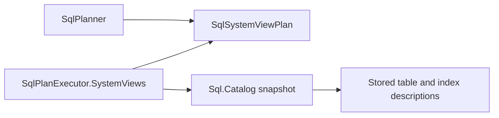
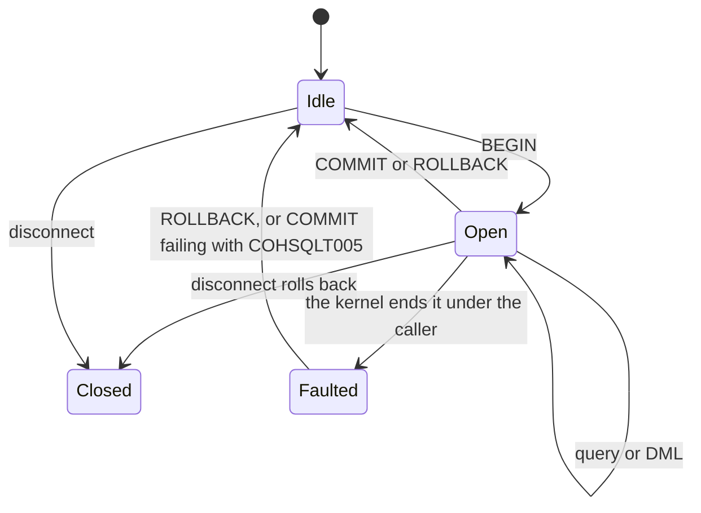
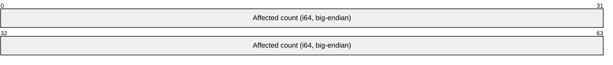

# Assimalign.Cohesion.Database.Sql — Design

The SQL engine (area architecture: [resources/Database/DESIGN.md](../../../../docs/resources/Database/DESIGN.md)
§3.3): parse (`Sql.Language`) → plan (`SqlPlanner`) → execute (`SqlPlanExecutor`)
against shared storage, with the catalog (`Sql.Catalog`) as schema authority.

## Ordering output values (#1024)

`SqlPlanner.Ordering.cs` binds aliases and standalone numeric ordinals to
projection indexes for stored tables, system relations, joins and groups.
Unqualified aliases take precedence over source columns, including inside
scalar ordering expressions. Qualified references and aggregate operands retain
their source scope. Invalid numeric ordinals fail during binding, even for an
empty input; compound constants such as `1 + 1` remain scalar expressions.

The executor materializes each referenced projection before sorting and retains
source values alongside it for other ordering keys. Grouped queries use the
same binding against completed group outputs. `SqlExpressionEvaluator` resolves
bound AST nodes by identity to these output slots and follows each projection's
source for collation. It does not reconstruct language AST nodes or require
cross-assembly internal access. Sorting is stable, with NULL first ascending and
last descending, followed by DISTINCT and LIMIT/OFFSET. Explicit NULL placement
and derived-table ordering remain capability errors. The exact syntax contract
and execution evidence are in
[DIALECT.md](../../Assimalign.Cohesion.Database.Sql.Language/docs/DIALECT.md).

## Subquery and insert-source operators (#1021)

`SqlPlanner.Subqueries.cs` binds each uncorrelated child SELECT in its own local
scope and lowers its use sites to typed slots. `SqlSubqueryPlan` owns those child
plans and the enclosing relation plan. `SqlPlanExecutor.Subqueries.cs` executes
each child with the enclosing `SqlStatementContext`, materializes its results,
and supplies typed constants or an IN value list by AST node identity while the
enclosing plan runs. Expression evaluation never opens a query, session,
transaction, or read view. Keeping the expression trees preserves grouping's
expression-ordinal bindings, including subqueries in HAVING and aggregate arguments.

Scalar children require one output column and at most one row; an empty result
is a typed null. IN children require one column and preserve SQL three-valued
membership, including unknown for nonmatches against a null-containing set and
false for membership in an empty set. EXISTS tests row existence. Output types
and string collations cross the materialization boundary. Nested system-view
queries trigger one statement catalog capture, just like outer system views.

`SqlInsertSelectPlan` holds the destination binding and a query source. Its
executor reads the entire source before staging any destination writes, so
self-inserts read the original statement snapshot exactly once. Source width and
declared type compatibility are validated before execution, including empty
sources; value conversions use the literal insert rules. Both insert forms call
the same preparation, default/nullability/CHECK/FK/UNIQUE validation, locking,
index maintenance and transactional apply path.

Correlation is deliberately excluded: qualified outer references receive
`COHDBL001` in language validation, and catalog binding rejects any nested column
that cannot resolve in its local scope. Parsing and planning enforce at most 32
subquery levels. UPDATE/DELETE, VALUES, CHECK/DEFAULT and LIMIT/OFFSET expression
subqueries, quantified comparisons, derived tables, CTEs and lateral joins remain
outside the profile. SELECT continues to require FROM. Subquery resolution uses
AST node identity at evaluation time; it needs no language-assembly friend access
or public AST constructors. See [DIALECT.md](../../Assimalign.Cohesion.Database.Sql.Language/docs/DIALECT.md#subqueries-and-query-source-inserts-1021)
for the exact supported forms and semantics.

## Compiled-schema provisioning

`SqlDatabase` provisions compiled schemas: it passes `supportsSchemaProvisioning: true` to
the root `DatabaseInstance` and overrides `ApplySchemaCoreAsync`, behind the base's
`ApplySchemaAsync` (which checks disposal, a null schema and the token first; the offline
refusal, `COHSQLT004`, comes after them). The hosting provisioner reads the base's
`SupportsSchemaProvisioning` and calls `ApplySchemaAsync`; until phase 6 of the concrete-types
plan the database also listed the root `IDatabaseSchemaProvisioner`, which the provisioner tested
for, and phase 6 deleted it. Before a
schema is applied, the provisioner requires `EngineModel.Sql`, the same logical
database name, and a shape the shipped SQL DDL surface can represent. It then
reconstructs or reads the last canonical catalog state, uses
`SqlSchemaMigrationPlanner` from `Database.Sql.Schema` for deterministic ordering/destructive gating, and
`SqlMigrationScriptGenerator` for parser-validated engine requests. Supported
steps are table, column, and secondary-index add/drop; alter/rebuild operations
and advanced objects (custom types, functions,
triggers, principals/grants, extensions) fail before execution rather than
recording a false applied hash. Foreign keys and checks now render into provisioning
DDL and persist in the table catalog; unique declarations use unique indexes.

Retained table, column, index and constraint names share the parser's delimited
identifier contract. The renderer preserves bare ordinary names and double-quotes
reserved words or names containing spaces and literal dots. Catalog names contain
the identifier value without its delimiters. Embedded double quotes and null
characters fail before deployment because the current lexer does not support
those identifier forms. The mapper uses the same retained names, so its quoted
DML binds the objects deployed by this renderer without another naming convention.

Each DDL request remains self-committing under the catalog's established rule.
On a later failure, completed reversible steps run their compensating requests
in reverse order and the applied-schema marker remains unchanged. The marker is
written only after all steps succeed, and a repeated apply is a no-op only when
the stored canonical document/hash and live catalog all agree. Full atomicity
for a destructive multi-statement migration is deliberately not claimed: the
current catalog has no transaction spanning DDL statements, and irreversible
data loss cannot be compensated. That kernel seam is recorded as the remaining
gap rather than hidden behind the content hash.

### Object ownership and the schema package

The area root carries only `CompiledSchema` identity and canonical content, the
`DatabaseInstance` schema seam (`SupportsSchemaProvisioning` and `ApplySchemaAsync`), and
model-independent ownership contracts.
`Database.Sql.Schema` owns SQL declarations, compiled tables/indexes/constraints,
validation, serialization, and migration plans. The engine references this thin
package; the schema package never references the engine or its storage/transport.

Live sessions create `Adhoc` tables and indexes. The provisioner's private
session carries the compiled schema name as `ProvisioningSchema` in an internal
statement context, so catalog creation persists `Schema` ownership and that name
as `OwningSchema` in the object's first durable record. `SqlCatalogTable.Schema`
remains the separate SQL namespace (for example, `dbo`). Only that internal
session may execute `DROP TABLE`, `ALTER TABLE ADD COLUMN`, `ALTER TABLE DROP
COLUMN`, or `DROP INDEX` against its schema's objects. Normal sessions receive
`DatabaseObjectLockedException` with the object, compiled schema exposed as
`OwningSchema`, and refused operation; row DML remains available. Compensation
uses the same private session and preserves the existing reversible-step policy.

DDL re-reads catalog ownership after acquiring the exclusive object lock. If a
table was dropped and its name reused while the statement waited, the acquired
lock covers the old object id: the statement rejects a schema-owned replacement
and requires a retry for any other replacement before changing metadata or rows.
Index drops likewise refresh their description after the wait. Missing-table
paths fail directly rather than issuing an unlocked catalog mutation by name.

Schema reconciliation compares only objects owned by the applying schema. Ad-hoc
tables and ad-hoc indexes coexist with it and do not create false drift or become
implicit destructive migration targets. A desired name that collides with an
ad-hoc object is rejected before applying any steps; adoption requires a future
explicit policy. Table creation uses the catalog's reserve/build/publish lifecycle,
including its ownership metadata, through `SqlCatalog.ReserveTableAsync` and
`SqlCatalog.PublishTableAsync`; ordinary `SqlCatalog.CreateTableAsync`
stays ad-hoc. The catalog persists descriptions;
the engine continues to authorize session operations against schema-owned objects.

## Virtual system relations (C1)

The catalog is the sole data source for six `INFORMATION_SCHEMA` relations and
two Cohesion extensions. Their complete MVP column matrix is in
[DIALECT.md](../../Assimalign.Cohesion.Database.Sql.Language/docs/DIALECT.md#system-view-matrix-c1).
Every row describes an object in the session's current database. The catalog
name columns contain that database's name; schema qualification continues to
select a SQL namespace, never another database. `TABLES` lists stored tables as
`BASE TABLE`; these virtual relations have no catalog table records to list.

### The relation seam and statement snapshot

`SqlPlanner` recognizes the reserved, schema-qualified view names before
`ResolveTable`. It binds their declared columns into a separate
`SqlSystemViewPlan`, carrying the view identity, projection, predicate, ordering,
distinct/count mode, and limit/offset. `SqlSelectPlan` still means a stored
table, and `SqlCatalogTable` has no virtual/system flag. This keeps physical
access paths and object locks meaningful instead of inventing a dummy object id
or storage location for metadata. No existing public interface changes.

`SqlPlanExecutor.SystemViews.cs` projects catalog descriptions to rows at query
time and applies the same expression evaluator and SELECT semantics as table
queries: column and expression projection, aliases, parameters, `WHERE`,
`ORDER BY`, `DISTINCT`, grouping/aggregates, `LIMIT`, and `OFFSET`. The existing
planner limits on joins and subqueries also apply.
Rows use the ordinary materialized result and wire codecs, so metadata is
available over `SqlDatabaseServer` without a separate protocol operation.

`SqlCatalog.CaptureSnapshot()` returns the catalog-owned sealed
`SqlCatalogSnapshot`, capturing tables and their index descriptions together under the
catalog's existing metadata lock. The capture is read-only, carries no storage
handle, and has no disposal lifetime. A snapshot transaction
retains the capture taken at begin; auto-commit and `ReadCommitted` statements
capture at statement start. All system rows for that statement use that one
capture, including referenced-key resolution. Catalog publication cannot split
a table from its constraints or indexes during a metadata read. Later statements
see completed DDL according to their isolation level, so `DROP TABLE` removes
the table, its columns, constraints, indexes, and ownership rows from fresh
snapshots. There are no metadata rows in the user record space and no persisted
system-view cache to reconcile.

The dependency split keeps virtual relation binding and execution in SQL while
the catalog remains the source of stored object descriptions:

```mermaid
flowchart LR
    Planner["SqlPlanner"] --> ViewPlan["SqlSystemViewPlan"]
    Executor["SqlPlanExecutor.SystemViews"] --> ViewPlan
    Executor --> Snapshot["Sql.Catalog snapshot"]
    Snapshot --> Catalog["Stored table and index descriptions"]
```

### Deliberate extension: index metadata

ISO `INFORMATION_SCHEMA` has no general index relation. Cohesion exposes
`COHESION_SCHEMA.INDEXES`, with one row per ordered index key column. Repeating
the table/index identity on each key row supports ordinary column projection,
filtering, and ordering without parsing a vendor-specific DDL string or encoded
column list. `IS_UNIQUE` and `IS_PRIMARY_KEY` are `YES`/`NO`; the latter
distinguishes the catalog's primary-key enforcement index from other unique
indexes. Physical root pages and index-manager registrations stay internal.
This explicit extension namespace avoids presenting a MySQL `STATISTICS` or
PostgreSQL `pg_indexes` compatibility contract that Cohesion does not implement.

### Deliberate extension: object ownership

`COHESION_SCHEMA.OBJECT_OWNERSHIP` has one row per table or index, identified by
its table identity, `OBJECT_TYPE` (`TABLE` or `INDEX`), and `OBJECT_NAME`.
`OWNER` preserves the catalog values `Adhoc` and `Schema`; `OWNING_SCHEMA` is
the compiled schema's name for code-provisioned objects and null for ad-hoc
objects. It remains distinct from `TABLE_SCHEMA`, the SQL namespace. Index
ownership is reported from the index itself, so an ad-hoc index on a table does
not accidentally inherit that table's provisioning ownership.

These concepts have no ISO counterpart. A separate Cohesion relation keeps
non-standard fields out of `INFORMATION_SCHEMA.TABLES`, preserving the documented
column ordering for tools that map `SELECT *` positionally. The accepted cost
is an additional metadata query when a client needs provisioning ownership.

### Standard vocabulary and the MVP boundary

This is a documented subset of ISO 9075-11's information schema, not a claim to
implement every standard view, column, or SQL domain. Identifiers and descriptive
text use the shared `String` type; standard `yes_or_no` values are strings
`YES`/`NO`, not Boolean values. Cardinal numbers use nonnegative `Int64` values,
with ordinal positions starting at one. These conventions follow the
[information-schema type definitions](https://www.postgresql.org/docs/17/infoschema-datatypes.html)
and [column metadata conventions](https://www.postgresql.org/docs/18/infoschema-columns.html)
documented by PostgreSQL's implementation of the standard.

`COLUMNS.DATA_TYPE` reports the canonical SQL name of the catalog's shared type
identity. The catalog does not preserve the original alias spelling (`INT`
versus `INTEGER`, for example), so this surface cannot reconstruct it. Declared
length, precision, scale, nullability, and default text come from catalog fields
(the default is the stored canonical literal, reported as is);
unknown or inapplicable facts are null, including an unknown character octet
bound. Cohesion types without an ISO spelling, such as `JSONB`, retain their
documented dialect name.

Primary keys and unique constraints project the catalog's enforcing indexes;
foreign keys and explicit checks project persisted constraint descriptions.
For older catalog records with `PrimaryKeyColumns` but no index marked
`IsPrimaryKey`, the constraint views infer the name `PrimaryKey_<table>` from
that existing primary-key declaration, appending `_1`, `_2`, and so on until
the name does not collide case-insensitively with a recorded index or constraint
on that table. This fallback does not invent an index row or index ownership;
separately recorded unique indexes remain `UNIQUE`.
The catalog does not name `NOT NULL` declarations as separate check objects:
their nullability is exposed by `COLUMNS`, and no synthetic check names are
invented. This is a deliberate MVP limitation relative to the standard's
[check-constraint convention](https://www.postgresql.org/docs/18/infoschema-check-constraints.html).
Foreign keys store referenced columns rather than an index identity. The views
resolve those columns to the primary key first (including the legacy fallback),
then to a matching unique index ordered deterministically by name. Foreign keys
report `MATCH_OPTION = 'NONE'`, `UPDATE_RULE = 'RESTRICT'`, and
`DELETE_RULE = 'RESTRICT'` or `'CASCADE'`.
Constraints are enforced immediately and are not deferrable.

Constraint names remain unique within a table, as the catalog already requires,
rather than within the entire SQL schema. Consequently `CHECK_CONSTRAINTS` and
`REFERENTIAL_CONSTRAINTS` can contain ambiguous repeated constraint identities
if callers reuse names on different tables; `TABLE_CONSTRAINTS` and
`KEY_COLUMN_USAGE` carry table identities. This existing catalog limitation is
not changed by introspection; the same portability consequence is described in
[PostgreSQL's information-schema notes](https://www.postgresql.org/docs/18/information-schema.html).
Metadata currently follows the engine's database visibility boundary; per-object
privilege filtering belongs to SQL security (D2).

### Read-only names

`INSERT`, `UPDATE`, `DELETE`, and all supported table/index DDL targeting a
system relation fail with `DatabaseException` and the stable message
`System view '<SCHEMA>.<VIEW>' is read-only.` The view name in the diagnostic is
canonical uppercase, for example `INFORMATION_SCHEMA.TABLES`. The wire server
returns `ExecutionFailure` with that message and keeps the connection usable.
`CREATE TABLE` collisions are refused by the same rule, including
`IF NOT EXISTS`; `DROP TABLE IF EXISTS` and `DROP INDEX IF EXISTS` do not turn
the refusal into a no-op. `CREATE VIEW` and `DROP VIEW` remain outside the
declared dialect and retain their existing unsupported-clause diagnostics.

## Execution model

- **Rule-based planning, plan/execute split.** `SqlPlanner` binds the AST against
  the catalog into a small `SqlPlan` IR and rejects everything outside the
  executor's surface *at plan time with precise messages* (JOIN, GROUP BY,
  subqueries, aggregates beyond a lone `COUNT(*)`, `INSERT ... SELECT`). The IR
  is deliberately thin — a cost-based planner replaces the binding internals
  later without changing the executor seam (#178's plan-stage requirement, MVP
  shape). That promise paid out with index adoption: the IR gained exactly one
  node family (`SqlAccessPath` on the SELECT plan — scan | index seek) and the
  executor seam did not move.
- **Unknown functions and wrong argument counts fail before binding (#1068,
  #1189).** `SqlPlanner.Plan` walks the whole statement
  (`ValidateFunctionCalls`), subqueries, DML values, `CHECK` predicates and
  `DEFAULT`s included, and resolves every call before it binds the catalog or
  reads a row: a name outside `SqlLanguageProfile.Instance.Functions` is
  `Unknown function '<name>'.`, and a call whose arguments its function's
  signature does not accept fails with `SqlEvaluationException` `COHSQLE006`. The
  evaluator used to discover an unknown name per row, so the same statement failed
  on a populated table and succeeded on an empty one, and it evaluated an argument
  only when a call had exactly one, so `ABS(1, 2)`, `UPPER()` and `COALESCE()`
  returned NULL and a CHECK built on one never fired. The walk resolves a call's
  arguments before the call itself, as PostgreSQL's parse analysis does
  (`transformFuncCall` transforms the arguments and then `ParseFuncOrColumn`
  resolves the function, `src/backend/parser/parse_expr.c`), so the innermost bad
  call is the one reported. A declared name that does not execute yet (`NULLIF`,
  `TRIM`, ...) passes this check and still fails during evaluation; #1103 rejects
  those at parse time and gives planner rejections structured codes.
- **One table of function signatures (#1189).** `SqlFunctionSignatures` holds one
  `SqlFunctionSignature` per executable function: name, scalar or aggregate, the
  fewest and most arguments a call may pass, whether `*` is accepted (only
  `COUNT`), and the call forms a diagnostic shows. Its readers are the planner walk
  above; the evaluator, which resolves each call against it again before computing
  it (a tree that reaches evaluation unplanned gets the same `COHSQLE006`) and
  dispatches on the entry instead of comparing upper-cased names per row; the
  grouping planner and aggregate detection; CHECK validation, which admits exactly
  the table's scalars; and persisted-definition binding (below). The rule follows
  PostgreSQL's function resolution: `func_get_detail` keeps only candidates whose
  argument count matches, and a call none accepts is `function ... does not exist`,
  SQLSTATE 42883, with the detail "No function of that name accepts the given number
  of arguments" (`src/backend/parser/parse_func.c`, `ParseFuncOrColumn` and
  `func_lookup_failure_details`). `COALESCE` takes one or more operands, as
  PostgreSQL's grammar does (`COALESCE '(' expr_list ')'` in `gram.y`), where ISO
  requires two; the dialect records the deviation. The T1 functions of #1120 are
  new entries, and their argument-type rules, result types, NULL rule and
  determinism new members of `SqlFunctionSignature`, not a second list. Until those
  members exist, each reader that behaves per function finds the function through
  the table (`SqlFunctionSignatures.FunctionOf`, or the signature `Resolve` returns)
  and switches on `SqlBuiltinFunction`; none compares the written name against a
  literal. Those switches are the evaluator's dispatch, which evaluates inside each
  function's case only the arguments that function's signature admits; the grouping
  planner's result types and its SUM/AVG numeric-argument rule; the static operand
  type; CHECK's Boolean `COALESCE` rule; and the grouping executor's accumulators and
  `COUNT`'s non-nullable result, where each aggregate of a `SqlGroupPlan` carries
  the signature the planner bound it to (`SqlGroupAggregate`) and an aggregate entry
  without an accumulator fails when the plan executes rather than counting rows.
  #1120 moves those arms into signature members. The SQL parser's own aggregate list
  (`SqlQueryParser.IsAggregateFunction`, Sql.Language, which cannot read this
  engine's internal table) is the one name list outside it. The table is a frozen
  dictionary over a fixed array: no reflection, no runtime code, a case-insensitive
  lookup that does not allocate.
- **Aggregates in UPDATE and DELETE.** `PlanUpdate` and `PlanDelete` reject an
  aggregate in an assignment or a `WHERE` filter while planning (`Aggregate
  functions are not allowed in UPDATE SET.` / `... in WHERE.`), as `PlanSelectCore`
  does for a SELECT's `WHERE` and `JOIN ... ON`, and as PostgreSQL's
  `check_agglevels_and_constraints` does for `EXPR_KIND_UPDATE_SOURCE` and
  `EXPR_KIND_WHERE` (`src/backend/parser/parse_agg.c`, SQLSTATE 42803). The statements
  write one row at a time, so no group exists for the aggregate to summarize; without
  the check they succeeded over an empty table and failed per row, uncoded, over a
  populated one. The arity walk runs first, so a wrong count still reports
  `COHSQLE006`.
- **Access-path selection (rule-based; no cost model — the MVP planner
  contract).** The planner flattens the WHERE clause's top-level `AND`
  conjuncts into per-column sargable predicates — `column op comparand` where
  the comparand is plan-time evaluable (literal/parameter, no column
  references), non-null, and coercible to the column's storage type; `BETWEEN`
  contributes its two bounds — then picks the index with the **longest
  equality prefix** over its leading key columns (ties prefer a usable range
  bound, then uniqueness, then name — deterministic), extended by range bounds
  on the next key column. **Range sargability is a type matrix**: only types
  whose evaluator comparison order provably equals the key codec's byte order
  (integers, decimal, floats, boolean, temporal types and strings under matching
  byte-expressible collations) get range seeks; Guid/binary/json remain equality-only.
  String predicates with expression/index collation mismatch scan. Everything else — `OR` at the top level,
  computed columns, column-to-column comparisons, null comparands — falls
  back to the per-object scan. **The full WHERE always remains the residual
  predicate**, re-evaluated on every fetched row, so access-path selection
  can cost performance but never correctness. SELECT only in this cut;
  UPDATE/DELETE target collection still scans (recorded follow-up).
- **Seek execution is snapshot-anchored.** The executor drives the B+Tree
  cursor through the **statement snapshot** (the `BTreeIndex.OpenCursor(snapshot,
  …)` overload — the same snapshot the equivalent scan filters through, which
  is the equivalence anchor under ReadCommitted's per-statement re-capture),
  unpacks each visible entry's packed row location, fetches the row, and
  re-checks the row's stamps against the same snapshot (defense in depth:
  entries mirror row stamps by the maintenance discipline, so a divergence is
  a bug this filter contains rather than surfaces; a dangling entry under an
  invisible stamp is skipped, never fetched wrongly). Prefix ranges ride the
  codec's order preservation: every composite key starting with prefix `P`
  sorts in `[P, successor(P))`; bound inclusivity maps to prefix-successor
  arithmetic on the encoded component. Per-statement observability
  (`SqlStatementMetrics`: access path + records examined) is the behavioral
  proof surface — the planner suite asserts an indexed equality seek examines
  O(matches) records while the equivalent scan examines O(table).
- **Row format: MVCC stamps + object-id-prefixed tuple, in per-object page
  chains (since record-space format version 3; the current format is 6).**
  Every data record is `[writer u64][deleter u64]` — a fixed 16-byte version-stamp header, the
  B+Tree leaf-entry design adopted for the record space — followed by the
  shared tuple codec payload (#854): the owning table's object id, then one
  self-describing component per *physical* column, live or dropped, in
  physical-ordinal order (see "DROP COLUMN marks the column dropped" below). Why a fixed binary prefix and not
  tuple components (the rejected alternative): (a) stamps in front never
  disturb ADD COLUMN's missing-tail decode, which depends on absent
  components being *trailing*; (b) fixed width makes tombstoning a same-length
  in-place write — a delete can never relocate a record; (c) stamp reads don't
  pay tuple-decode costs on the scan hot path. Since format version 3 the
  tables of a database still share one record *space* but not one page
  stream: rows land on pages tagged with their table's object id (the storage
  layer's per-owner chains), so **a table scan touches only its own table's
  pages** — O(table), not O(database) — and `DROP TABLE` releases the
  table's whole chain back to the allocator (transactionally, inside the
  statement bracket; the record-byte layout is unchanged from version 2, and
  the object-id prefix stays as defense in depth).
- **Scans are snapshot-visible.** Every scan filters through the statement's
  snapshot: a version is visible when `IsVisible(writer)` and its deleter — when
  stamped — is *not* admitted (a visible tombstone reads as absence). Updates
  write version chains in the record space itself: tombstone the old version in
  place, insert the new one, both stamped with the writing transaction's
  sequence — so exactly one version of a logical row is visible per snapshot by
  construction, versions are WAL-covered like all record writes (restart keeps
  them correct for free), and aborted stamps revert physically with the page
  images. Deletes tombstone (older snapshots keep the row until the purge
  worker reclaims below every live horizon). No DDL rewrites a row (ADD and
  DROP COLUMN change only the catalog, #1023 and #1241): **no statement ever
  moves a version**, so a location (page, slot) is a version's identity for its
  whole life — what index entries, row locks and the version store's ledger all
  key on.
- **Format rule (data-storage format version, catalog-persisted): exactly one
  format, no upgrade path.** The catalog stores the format version of the whole
  data file set, rows and the index trees that ride it (a kind-4 record for
  versions 1–3, a kind-8 record from version 4). The engine reads and writes
  format 6 only: stamped rows in per-object page chains whose index keys use the
  temporal identity encoding (#1099, below), in index trees of B-tree page format
  2, which order entries by key, entry reference and writer (#1194,
  `Database.Indexing` DESIGN), decoded through each table's physical column
  layout, which the catalog's table record carries (extension version 3: the
  dropped columns' physical ordinals, #1241). The earlier versions are history —
  1 = the pre-MVCC unstamped layout, 2 = stamped rows in the shared page stream,
  3 = per-object chains with the `DateTimeKind` and offset inside temporal keys
  (written through 10.0.0-preview.1), 4 = format 5's rows over index trees of
  B-tree page format 1, ordered by key alone (owner decision of 2026-10-02: the
  page format change takes no upgrade path either), 5 = format 6's rows and
  trees with no physical layout in the catalog, whose DROP COLUMN spliced the
  column out of every stored version (#1237; the catalog format change takes no
  upgrade path either, #1152). A format-5 table record (extension version 2)
  still loads, so that the gate below, not a decode error, refuses the database.
  `CreateDatabaseAsync` writes
  the format-6 marker as soon as the catalog opens, and first checks that the catalog is new
  (no marker, no tables): `SqlStorageStrategy.CreateStorage` (internal) must refuse
  existing storage, and a strategy that reopened it instead would otherwise get
  an older catalog declared current. `OpenDatabaseAsync` refuses a database on
  any other version, older or newer, with a `DatabaseException` (the internal
  `SqlDataStorageFormatException`) that names the database, the version found
  and the version supported. For an older database it says to export the data
  with the engine that wrote it, drop the database and create it again (create
  refuses a name whose storage exists). Version 1 means no marker: every
  released engine stamped one at creation, so an unmarked catalog is a creation
  interrupted before the stamp (or a pre-release database), and the message says
  so. **The gate reads the catalog alone.** `OpenDatabaseAsync` opens the
  catalog file set, loads the catalog and checks the marker before it opens the
  data file set, so a refused open never opens the data files: no crash replay
  into them, no journal or backup file created, no close. A database without a
  catalog storage (an interrupted creation, or one older than the catalog's own
  file set) is refused before any file is opened, never adopted with an empty
  catalog. The catalog file set itself gets only what opening any storage does.
  Cleanly closed, it is left byte-identical, because a storage closed with
  nothing written through it writes nothing (Storage DESIGN.md). Crashed, it
  gets the storage layer's physical redo/undo, which is format-agnostic and
  idempotent, and keeps its journal. That matters because the old engine must
  still be able to open the database to export its data, including running its
  own transaction recovery over journals the refused open did not touch.
  `SqlDataStorageFormatTests` pins both cases: clean images stay byte-identical,
  and a crashed format-3 image keeps its data files and catalog journal and
  still recovers (its uncommitted writer scrubbed) once its own engine opens it.
  **Decision (owner, 2026-10-01): no upgrade path while the line is
  pre-release.** #1099's first implementation rebuilt temporal indexes on open
  and carried UNIQUE duplicates the new identity exposed; it was withdrawn
  together with the earlier in-place stages (1 → 2 stamping, 2 → 3 chain
  relocation), and upgrades are designed fresh in #1152 (in-place or offline,
  duplicate handling, crash safety, progress). **Downgrade fence:** engines
  before format 4 never compared the marker against a newer version, so the
  format-4 marker is a record kind their catalogs refuse to load; they fail the
  open instead of writing format-3 keys into a format-4 database. Format-4
  engines compare the marker for equality, so they refuse a format-5 database as
  written by a newer engine, and format-5 engines refuse a format-6 one the same
  way (they would refuse its extension-3 table records first). **Behind the gate, the index manager checks the trees
  themselves (#1194).** `Database.Indexing` owns the B-tree page format and checks
  every tree's root page when `SqlDatabase` attaches the catalog's
  registrations, before recovery's scrub or checkpoint writes anything. A marker
  that does not describe its trees — a damaged root, or pages another engine build
  wrote — fails the open with `SqlDataStorageFormatException` ("uses data-storage
  format 6, but one of its index trees does not: COHDBI001: …", the index manager's
  `IndexFormatException` as its inner exception), and the files are left
  byte-identical. `SqlDataStorageFormatTests` pins both refusals with real format-1
  index pages. **Below the gate, each file set has its own storage format (#1251).**
  The storage refuses a file set in another storage format with
  `StorageFormatException` (`COHDBS001`) when it opens, before recovery reads its
  journal. A database has two file sets, so `OpenDatabaseAsync` carries the refusal
  in `SqlDataStorageFormatException` naming the database and the file set: "Database
  'x' cannot be opened: its catalog file set 'x.catalog' was refused. COHDBS001: …"
  (or its data file set 'x'). The server forwards it to the client like the gate's
  own refusals, and the files stay byte-identical.
- **Schema evolution (#1023):** `ADD COLUMN` validates the literal default and
  current rows under the exclusive object lock before publishing the complete
  replacement definition in one catalog transaction. Backfill is resolved at
  read time from persisted column metadata; no existing row bytes, locations or
  MVCC stamps are changed. `SqlRowCodec` reports how many fields were physically
  present, and the executor resolves only the missing tail, on both scans and
  index seeks. Explicit NULLs remain NULL. Default conversion is shared with
  omitted-column INSERT values and rejects overflow, nonfinite floats, string
  truncation, and decimal rounding or precision loss. Validation scans are
  O(table); there is no physical backfill or cross-storage row/catalog commit.
  A crash before catalog publication leaves the old definition; after publication
  the same persisted default resolves old rows on reopen. Constrained additions
  still build enforcing indexes durably before publication; a crash can leave
  unpublished index pages, never a partly backfilled table.
  Bound plans retain their immutable definition; later statements bind the full
  new definition even with an older row snapshot. NOT NULL without a default
  fails if any current row exists; historical deleted versions can still read
  NULL under an older snapshot after an addition to a currently empty table.
  `DROP COLUMN` marks the column dropped in the catalog and rewrites no row
  (#1241), described in the next item. DDL is self-committing and refused in explicit
  transactions. Schema-owned tables retain their existing live-session DDL guard.
  The persisted default is the canonical SQL text of its literal (`'it''s'`, `5`,
  `TRUE`), and the value every read and INSERT coerces comes from the table
  version's bound form, parsed once (see [Persisted definitions](#persisted-definitions-canonical-text-parsed-once)).
- **DROP COLUMN marks the column dropped; no version is rewritten (#1241).**
  The catalog keeps each table's physical column layout (`SqlCatalogTable`): the
  live columns, in order (`Columns`), and the physical ordinals of the dropped
  ones (`DroppedColumnOrdinals`). A row version stores one component per
  physical ordinal (`PhysicalColumnCount`) up to its last live column, and a
  live column's component sits at `GetPhysicalOrdinal(i)`. DROP COLUMN removes the column from the live list
  and adds its physical ordinal to the dropped list, in one self-committed
  catalog record (`SqlCatalog.DropColumnAsync`). The executor takes the
  table's Exclusive lock, runs the constraint checks and calls the catalog
  (`SqlPlanExecutor.ExecuteDropColumnAsync`): no scan, no apply-gate hold and no
  data write, so the statement is O(1) in the table's size and no writer of any
  table waits on it. This is PostgreSQL's dropped-attribute design:
  `pg_attribute.attisdropped` (`src/include/catalog/pg_attribute.h:139-140`) is
  set by `RemoveAttributeById`, "the guts of ALTER TABLE DROP COLUMN", which
  rewrites no tuple (`src/backend/catalog/heap.c:1692-1732`, reached from
  `ATExecDropColumn`, `src/backend/commands/tablecmds.c:9355`; documented at
  `doc/src/sgml/ref/alter_table.sgml:1546-1552`).
  - *Every decode path skips dropped ordinals.* `SqlRowCodec.TryDecode` walks the
    physical components up to the bound definition's `PhysicalColumnCount` and
    skips each dropped one with `DatabaseKeyReader.Skip`, which materializes no
    value, as `heap_deform_tuple` walks a dropped attribute by its stored length
    (`src/backend/access/common/heaptuple.c:1254`). A record that ends early was
    written before the columns it lacks were added; that missing tail resolves
    from the bound defaults as before (PostgreSQL: `getmissingattr`,
    `heaptuple.c:1360-1365`), and since physical ordinals ascend with the live
    columns the stored columns are always a prefix. Scans, index seeks, the
    latest-state constraint reads, constraint backfills (ADD CONSTRAINT, ADD
    COLUMN), cascade walks and index builds all decode through `DecodeRow`.
    Everything above the codec already works on `Columns`, which holds live
    columns only: `SELECT *` and the planner's name resolution, INSERT without a
    column list, the wire result header, CHECK and DEFAULT binding
    (`SqlBoundTableCache` binds by name against the live columns),
    INFORMATION_SCHEMA and COHESION_SCHEMA, and the persisted definitions, whose
    CHECK text and index and constraint column lists name columns, never
    ordinals. PostgreSQL filters dropped attributes at the same layers:
    `expandTupleDesc` for `*` (`src/backend/parser/parse_relation.c:3181`) and
    `NOT a.attisdropped` in `information_schema.columns`
    (`src/backend/catalog/information_schema.sql:782`).
    `INFORMATION_SCHEMA.COLUMNS.ORDINAL_POSITION` numbers the live columns 1..n,
    as the SQL standard's drop renumbers them; PostgreSQL reports `attnum`, gaps
    included (`information_schema.sql:672`), and that is the one place this
    engine does not follow it.
  - *Writes store NULL at a dropped ordinal.* `SqlRowCodec.Encode` writes a
    one-byte NULL component for every dropped ordinal ahead of the last live
    column, as PostgreSQL's INSERT and UPDATE target lists carry a NULL for a
    dropped attribute (`src/backend/optimizer/prep/preptlist.c:446-455`), and
    stops after the last live column: a dropped ordinal behind it needs no
    component, because a record that ends early decodes as a missing tail and
    every column added later takes an ordinal past it. A dropped value's space
    comes back as its rows are updated and the versions that hold it are purged,
    the behaviour `alter_table.sgml:1546-1552` documents. The NULL is a per-row
    cost: each dropped ordinal ahead of a live column adds one byte to every
    version written afterwards and lowers the largest storable row
    (`SlottedPage.MaxRecordSize`) by as much, as PostgreSQL's dropped attributes
    keep their null-bitmap bits in every new tuple (`doc/src/sgml/limits.sgml:133-136`).
    Stopping at the last live column keeps repeated ADD/DROP of a trailing
    column free for rows (`SqlDropColumnTests`' row-size test: a row 58 bytes
    under the limit stays writable after a hundred such cycles, where a NULL per
    dropped ordinal made its UPDATE fail at 8,134 bytes). A definition bound
    before a trailing drop reads that column from the missing tail of a version
    written after it, rather than from a stored NULL; no statement decodes that
    pairing (next items).
  - *ADD COLUMN appends a physical ordinal.* A new column takes
    `PhysicalColumnCount`, after every live and dropped ordinal (PostgreSQL:
    `relnatts + 1`, `tablecmds.c:7445-7446`). A column re-added under a dropped
    column's name is a different column: versions written before it read it from
    their missing tail (its default, or NULL), never the dropped values, which
    stay behind the dropped ordinal.
  - *Dropped ordinals are never reclaimed.* A physical ordinal names one column
    for the life of the table. Reusing it would decode the dropped value into
    the new column, from every version that still stores it: live, tombstoned,
    or pinned by an older snapshot. PostgreSQL keeps a dropped `pg_attribute`
    row and its `attnum` for good and counts it against the column limit
    (`doc/src/sgml/limits.sgml:133-134`). Here the bound is the catalog record:
    each dropped ordinal costs the table record one five-byte integer component,
    and a definition that outgrows one record is refused (`EnsureStorable`). For a
    table with dropped columns the refusal counts them and names the remedy,
    recreating the table and copying its rows, since only a new table starts
    without dropped ordinals (`SqlCatalogDroppedColumnTests`: a two-column table
    reaches the bound after 1,588 ADD/DROP cycles, where PostgreSQL stops at
    "tables can have at most 1600 columns", `tablecmds.c:7445-7452`).
    Compacting the layout would need a rewrite that moves every version to the
    new layout and rebuilds every index and version-store location, which is
    what PostgreSQL's rewriting forms do (`tablecmds.c:6041-6066`, and why they
    are not MVCC-safe, `alter_table.sgml:1563-1566`). No such rewrite exists; one
    added later must replace the layout in the same recoverable unit as the
    versions.
  - *Replacements keep the layout.* Every catalog alteration (ADD/DROP COLUMN,
    ADD/DROP CONSTRAINT) carries the dropped ordinals forward, and
    `SqlCatalog.PublishTableAsync` refuses a replacement that does not keep the
    current layout as its prefix (same dropped ordinals, every live column in
    place; it may only append), and a new table published with dropped columns.
  - *Crash safety.* The catalog commit is the drop's only durable step. A crash
    before it reopens on the old definition, one after it on the new one, and
    every stored version decodes correctly under either, because no row changed
    and no ordinal moved. `SqlDropColumnTests` records a crash point after every
    durable write the statement makes (`CrashCaptureSqlStorageStrategy.RecordCrashPoints`)
    and reopens each. Run against the former in-place rewrite (#1237), the point
    between the catalog commit and the rewrite's durable commit reopened on the
    new definition with every row's values shifted into the wrong columns: 770
    wrong values and failed seeks at that one of its five crash points (base
    3f379cca). The drop now writes only the catalog's commit (four crash points
    in the same run, the first before it and the rest after it), and every crash
    point reads back exactly the model.
  - *Concurrent readers.* A single-table SELECT still takes no table lock (see
    "SELECT statements take no locks" under the execution model), so it can
    overlap a DROP COLUMN, bound to either definition, and both decode every
    version onto the right columns: one bound after the drop skips the dropped
    component of a version written before it, and one bound before the drop
    still sees the dropped column, with the values of the versions its snapshot
    sees. A version written after the drop is never visible to it: the
    statement's snapshot is captured when its `SqlStatementContext` is built,
    before `SqlQueryExecutor` plans it, and every later writer of the table waits
    for the drop's Exclusive lock, so it commits after the drop's catalog commit.
    No value of another column ever appears in a column. PostgreSQL takes
    AccessExclusiveLock for DROP COLUMN as a change "visible to concurrent
    SELECTs" (`tablecmds.c:4714-4724`), which waits for the AccessShareLock every
    SELECT holds (`parse_relation.c:1533`). The layout makes that wait
    unnecessary for correctness here, so DROP COLUMN does not block readers.
    Run against the former rewrite, `SqlDropColumnTests`' concurrent readers
    read 20,821 rows with values in the wrong columns, and 5 more statements
    failed, in 243 SELECTs over four drops (base 3f379cca; the counts vary by
    run, and the issue's reviewers measured 12,495 wrong rows in 11 SELECTs). Writers and
    joins take intent locks, which wait for DROP COLUMN's Exclusive lock; one
    bound to the old definition then fails with "changed while the statement was
    waiting".
  - *What it replaced.* #1237 made DROP COLUMN splice the column out of every
    stored version in place, inside the database-wide apply gate, after the
    catalog drop self-committed on its own file set. That left the two gaps the
    last two items close (#1241), and its O(table) scan held the gate every
    writer of every table waits on. The splice (`SqlRowCodec.WithoutColumn`,
    `SqlPlanExecutor.CollectColumnSplices`) and `DatabaseKeyReader.BytesConsumed`,
    which existed only for it, are gone.
- **Expression evaluation** is interpretive with SQL null propagation (nulls
  reject predicates, comparisons with null are null, `AND`/`OR` are three-valued
  and skip the right operand once `FALSE AND` or `TRUE OR` decides the result),
  overflow-checked BIGINT arithmetic for exact integers and promotion to decimal
  otherwise, ordinal string comparison, hand-rolled `LIKE`
  (`%`/`_`), `CASE`, `BETWEEN`, `IN` (lists), `IS NULL`, parameters (`@name`
  bound by bare name), and a small builtin set (`COALESCE`, `UPPER`, `LOWER`,
  `LENGTH`, `ABS`) dispatched through the signature table above. Compiled
  expression plans are a later optimization.
- **Arithmetic faults are coded statement failures (#1069).** Division or
  modulo by zero raises `SqlEvaluationException` with `COHSQLE001`; a result,
  operand, literal, aggregate or CASE/COALESCE value outside its numeric type
  raises it with `COHSQLE002` (the dialect's arithmetic fault contract). Each
  operator, negation and `ABS` codes its own fault at the source. The evaluator's
  entry point, `Evaluate`, then converts any remaining `ArithmeticException`
  from the expression tree (an oversized literal, for example), so no raw runtime
  fault leaves evaluation. Recursion runs through `EvaluateCore`, below that
  boundary, so `CAST` still reports an operand it cannot represent as a
  conversion failure. Aggregate accumulation, the result-type normalization of
  projected values, and store assignment into an integer or `DECIMAL` column
  (`CoerceForColumn`) code their own overflow the same way. A nonzero REAL or
  DOUBLE divisor that converts to Decimal zero is out of range, not a division
  by zero, because zero is judged on the operand as supplied. `SortRows` unwraps
  the `InvalidOperationException` the runtime sort puts around a throwing
  comparer, so incomparable `ORDER BY` keys fail the statement with the
  comparer's own `DatabaseException` instead of ending a wire session. The
  exception is an internal `DatabaseException` whose message leads with the code, the convention
  Graph's `COHDBG` codes use, until the area root grows a structured diagnostics
  carrier. Evaluation runs in a write statement's first phase, before any
  physical bracket opens, so a fault writes nothing. The session's ordinary
  failure path then applies: auto-commit rolls back, and an explicit transaction
  stays active.
- **The engine's nesting limit and its backstop (#1151).** The owner's decision of
  2026-10-01 takes a middle course between SQL Server and PostgreSQL (the rule and
  the comparison are in the dialect's "Expression nesting limit"): genuine nesting
  counts against one configurable limit, an `AND`/`OR` chain is one n-ary
  `SqlLogicalExpression` that counts once, and the stack checks below are the
  backstop. `SqlDatabaseEngineOptions.ExpressionNestingLimit` (also on the engine
  builder) defaults to 256 and must lie within 32..4096; `SqlDatabaseEngine.Create`
  validates it before any worker starts and captures it in a private
  `SqlQueryParserOptions`, so a later change to the options object changes nothing.
  Every session parses statement text with it (`SqlQueryRequest.FromSql` with the
  engine's options), and refuses a typed request whose
  `SqlQueryStatement.ExpressionNestingDepth`, the nesting its own parser measured,
  exceeds it, with the `SQL0006` the engine's parse would have reported, so the
  limit holds on every seam. A request over a subquery taken out of a parsed
  statement carries no parser's measure and is held to the depth of its own tree,
  which is what the walks recurse through. The `FromSql` overload that takes
  `SqlQueryParserOptions` is public, so a typed caller parses with the engine's
  limit and accepts exactly what the text seam accepts; the overload without options
  parses at the default 256. `SqlDatabaseEngineBuilder.ExpressionNestingLimit` is the
  sealed builder's form of the option: it reports 256 until the value is set, and
  `Build()` carries it to the engine it creates. A value outside 32..4096 fails in
  `Build()`, not in the setter, with the `ArgumentOutOfRangeException` that
  `SqlDatabaseEngine.Create` throws (`Build` creates its engine through the same
  validation). **Reversed at phase 4 of the concrete-types plan:** the owner's ruling of
  2026-10-02 kept the builder an interface "meant to be implemented elsewhere", which this
  paragraph recorded, and its 2026-10-03 narrowing kept the limit an ordinary interface
  member every implementation had to supply; decision D5 of 2026-10-04 made the builder sealed
  with an internal constructor (`.claude/rules/database-area.md`), which supersedes both and
  #1232. The test builder written outside the repository (`ExternalEngineBuilder`) went with
  the interface, and its cases (the range refused in `Build`, both ends of it accepted, the
  value carried to the engine) are retested against the sealed builder
  (`SqlExpressionDepthExecutionTests`). A
  parse that runs out of stack (`SQL0007`) is not a syntax error: `FromSql` raises
  it as `COHSQLE004`, like any other walk out of stack. Text the engine generates
  rather than receives (persisted definitions, schema-migration statements) parses
  at the 4096 ceiling: the executing engine's limit still applies to a migration's
  requests, and a definition stored under one engine's limit opens under any other.
- **Walkers iterate chains.** Every walker reaches an `AND`/`OR` chain's terms
  through `SqlPlanner.Children` or iterates `Operands` itself, so it recurses once
  per level of the tree and never once per term: the evaluator's `EvaluateLogical`
  runs the terms first to last and stops at the first that decides the result, which
  is the order and stopping point of the nested binary operators it replaces, and
  three-valued logic gives the same result (#1069's short-circuit contract). The
  sargable and join-equality collectors read every term of a conjunction, a nested
  parenthesized conjunction included, CHECK validation requires every term to be
  Boolean, `StaticOperandType` and `GroupExpressionType` type a chain as Boolean, and
  grouping and persisted-definition equivalence compare operator and term count.
- **Every recursive walk checks the stack (#1151).** The parser bounds how deep a
  statement nests, not how much stack the thread that runs it has, and a configured
  limit of up to 4096 admits trees that no default thread can walk. So every walker
  that recurses over an expression tree calls
  `RuntimeHelpers.EnsureSufficientExecutionStack()` before it descends: the
  session's system-relation scan (`UsesSystemView`), the planner's validators and
  binders (`ValidateFunctionCalls`, `ValidateExpression`, `StaticOperandType`,
  `ContainsAggregate`, `ContainsCast`, `ReferencesAnyColumn`, `RejectColumnReferences`,
  `ContainsStar`, the sargable and join
  equality collectors, ordering alias binding, grouping binding, `SameGroupExpression`,
  `GroupExpressionType`, the subquery source walk and `PlanSubqueries`), the
  evaluator (`EvaluateCore`, `FindCollation`), CHECK validation
  (`ValidateCheckSyntax`), and persisted-definition binding and comparison
  (`SqlPersistedExpression.Bind`, `AreEquivalent`, `SqlBoundTableCache`'s column
  collector). `SqlPlanner.Children` documents the rule for the next walker.
  `LIKE` matching recurses once per `%` it backtracks through, so its depth follows
  the values, and both matchers check too. The check costs a stack-pointer
  comparison per node; a tree within the default limit trips it only on a thread
  created with a small stack. `SqlDatabaseSession.ExecuteAsync`
  turns the resulting `InsufficientExecutionStackException` into
  `SqlEvaluationException` with `COHSQLE004` (ISO SQLSTATE 54001, statement too
  complex), so it takes the ordinary failure path above instead of ending the
  process; over the wire it is an `ExecutionFailure` and the session stays ready.
  The tests prove each check without risking the test process:
  `SqlExpressionDepthExecutionTests` runs a walk of a 128-level tree, and of a
  1,000-term chain over one, with a few KB of stack left before the check would
  fail, measured on that thread with `RuntimeHelpers.TryEnsureSufficientExecutionStack`.
  A walker that checks as it descends throws within its first levels; one that did
  not check would carry on into the runtime's reserve, which a 128-level walk fits
  inside, and complete, so a missing check fails the test rather than the test
  process. Under a 4096 limit, a 3,000-level statement runs on a 64 MB thread and
  fails with `COHSQLE004` on a small one, whether its parse or a later walk is what
  runs out (`Engine_HighLimit_ShouldRunOrFailWithStatementTooComplex`).
- **Signs require numbers; unary plus is the identity (#1068 follow-up).** The
  evaluator returns a unary-plus operand unchanged (value and CLR type; NULL
  propagates), while negation still widens exact integers to BIGINT, and
  `GroupExpressionType` reports the matching result types. A sign whose operand is
  not a number raises `SqlEvaluationException` with `COHSQLE003`. When the operand's
  type is fixed by the plan — a string or Boolean literal, a column, a predicate,
  `||`, `UPPER`/`LOWER`, a CAST, a bound scalar subquery — `SqlPlanner.ValidateExpression`
  raises it before execution (`StaticOperandType`), so the result does not depend on
  whether the table has rows; it and `COHSQLE005` (below) are the planner's own
  coded rejections, and count evaluation and stack checks can also raise
  `COHSQLE001`/`002`/`004` while planning. A parameter, CASE or other operand only
  its value types fails when evaluated, with the same code and message.
- **VALUES rows and LIMIT/OFFSET counts have no column scope (#1165).** Both are
  evaluated once, against an empty row: a VALUES row before the INSERT writes
  anything, a count while planning. ISO SQL forbids a column reference in an
  INSERT's table value constructor. The planner used to bind no VALUES expression,
  and the executor evaluated each one with the target table's columns in scope, so
  `INSERT INTO u (id, a) VALUES (id, 1)` resolved `id` to ordinal 0 and indexed the
  empty row; the `IndexOutOfRangeException` was not a `DatabaseException`, so over the
  wire it reached the `Internal` catch-all and closed the session. Now
  `SqlPlanner.ValidateScopelessExpression` checks every expression of every VALUES row,
  and each count, before anything executes. It rejects a column reference anywhere
  (under a sign, CAST, CASE, aggregate or function call, qualified or not) with
  `SqlEvaluationException` `COHSQLE005`, which names the reference and the clause
  (ISO SQLSTATE class 42, syntax error or access rule violation). It then rejects an
  aggregate and `*` with uncoded messages naming the clause, and runs
  `ValidateExpression` against an empty column scope, which raises `COHSQLE003` for a
  sign over a non-numeric literal or parameter and `COHDBL001` for a subquery. The
  column check runs first, so `-a` and `SUM(a)` report the column, not the
  operand type or the aggregate. Every row is checked before planning returns, so a
  fault in a later row leaves the earlier rows unwritten. As defense in depth,
  `ExecuteInsertAsync` evaluates VALUES with an empty column scope too, so its
  evaluator can never resolve an ordinal the empty row does not have.
  Parameters and expressions over literals and parameters are unchanged. A count
  with a column reference already failed while planning, as `Unknown column`, or,
  inside a subquery, as an error result: `PlanSubqueries` turned the child's
  `Unknown column` into `SqlUnsupportedQueryException`, which `SqlQueryExecutor`
  returns as a `QueryResultStatus.Error` result carrying `COHDBL001`'s
  correlated-subquery diagnosis. It now throws `COHSQLE005` at every nesting level,
  for a reference to the subquery's own columns or the outer query's: ISO SQL's
  fetch-first count is a simple value specification, which no column of any scope
  reaches. (An explicit outer qualifier is still the parser's `COHDBL001`.) A `*` in
  a count now reports `'*' is not allowed in LIMIT.` (or `OFFSET`) instead of the
  evaluator's `Expression 'SqlStarExpression' is not supported by the executor yet.`
  The unqualified
  `DEFAULT` keyword in VALUES is not in the dialect and parses as a column reference
  named `DEFAULT`, so it reports `COHSQLE005` too. The niladic datetime functions
  `CURRENT_DATE`, `CURRENT_TIME` and `CURRENT_TIMESTAMP` also parse as names, because
  they take no parentheses; `RejectColumnReferences` reports an unqualified name
  spelled as one of them as the unsupported function (`Function '<name>' is not
  supported by the executor yet.`, the message `NOW()` gets at evaluation), not as
  a column, until the parser gives them a function node.
- **SELECT materializes.** Sorting and `DISTINCT` need the full result anyway at
  this stage; `SqlMaterializedResultSet` carries typed columns and evaluated
  rows. Streaming operators arrive with the planner build-out.
- **Transactions (MVCC session binding, §3.8).** Every statement — explicit
  transaction or auto-commit — runs under a `TransactionContext` from the
  database's transaction manager, whose sequences come from the storage's own
  counter (one namespace). The shared `Database.Transactions.TransactionCoordinator` owns
  the composition (manager + lock manager + record-space version store +
  journal-bound log). The instance's thin `TransactionSource` resolver (the index manager's delegate since #1258)
  resolves a context's *current statement bracket* and retains the engine's
  `DatabaseException` for a missing pairing. Commit flows
  through the manager: its journal-bound log appends the commit record and
  awaits durability (which, by journal ordering, also covers every statement
  bracket the transaction committed non-durably); rollback is **logical** —
  the version store's ledger physically undoes the writer's stamps before its
  locks release. Auto-commit statements ride a one-statement manager
  transaction, so visibility semantics never fork. Isolation: `Snapshot`
  (default) fixes the statement snapshot at begin, `ReadCommitted` re-captures
  per statement; `Serializable` is **rejected** until conflict detection
  exists (never run weaker than requested). Kernel aborts surface wrapped in
  the root's `DatabaseTransactionAbortedException` (deadlock victims:
  `DatabaseTransactionDeadlockException` — retryable by construction, an
  `ExecutionFailure` on the wire, session stays usable). A commit whose record
  was written but could not be made durable is not an abort: the transaction
  is `Committed`, and the commit throws the root's
  `DatabaseTransactionCommitUnconfirmedException`, which is not retryable
  (`Database.Transactions` DESIGN.md). On every database
  open the coordinator runs `TransactionRecovery.Analyze` over the recovered
  journal (the storage strategy defers the open-time checkpoint for exactly
  this) and scrubs every unproven writer's stamps out of the record space —
  the open-time bulk form of `VersionStore.PurgeWriterAsync`, one pass
  instead of one scan per writer because the in-memory ledger died with the
  process; the checkpoint worker checkpoints data storages *through the
  coordinator*, so truncating checkpoint records carry in-flight logical
  sequences. DDL in auto-commit mode flows to the catalog, which self-commits on its own storage
  (see the catalog DESIGN.md for why DDL-in-DML is out of MVP scope), and
  interlocks with row writers through table-grain intent locks (below).
- **Shared record-space composition (#918).** `SqlTransactionRecordSpace`
  supplies row reads, transactional updates/deletes, and the existing packed
  location codec to `RecordSpaceVersionStore` in `Database.Transactions`.
  `SqlRowCodec` retains SQL tuple encoding, while
  its stamp operations delegate to the shared `RecordVersionStamp` contract
  ([layout](../../Assimalign.Cohesion.Database.Transactions/docs/DESIGN.md#record-stamp-prefix-the-16-byte-contract)).
  `BTreeRecordVersionIndex` in Indexing binds each live secondary index to the
  shared undo ledger. Recovery ordering is unchanged: check the data-storage
  format, re-attach indexes, analyze and scrub records, scrub indexes with the
  same classification, then complete the deferred checkpoint.
- **Write statements execute in two phases; the physical bracket is per
  statement (§3.8's migration path).** Phase one — no physical bracket: scan
  through the statement snapshot, collect targets, acquire an IntentExclusive
  table lock and an Exclusive lock per target row through the lock manager
  (asynchronous waits, cancellation-honoring; deadlocks detected here,
  requester-closes-cycle). **Lock-key scheme:** row locks key on
  `LockResource.Entry(objectId, packed page/slot location)` — the same packed
  identity the version-store ledger uses, and the same `LockResource` space
  the B+Tree's hashed key locks live in, so index and row locks cannot alias.
  Phase two — the coordinator's **apply gate** (one writer statement applies
  at a time per database): open the statement's storage bracket, **re-validate
  every target against its current stamps** (the latest-state check under the
  exclusive lock — the B+Tree uniqueness-discipline precedent; a snapshot-only
  check would admit write skew), apply, and commit the bracket *non-durably*
  (the transaction's commit record owns durability through journal ordering; a
  statement-level failure still rolls the bracket back physically). A target
  tombstoned by a concurrently *committed* transaction fails the statement
  with the retryable conflict — **first-updater-wins**; under `ReadCommitted`
  this is deliberately stricter than PostgreSQL's re-evaluation (the statement
  aborts rather than re-targeting the new version — retry is the policy).
  **Why the apply gate and not concurrent appliers with page-conflict retry
  (the recorded page-conflict fallback decision):** page locks release at
  statement end either way, so the gate costs only intra-database physical
  apply parallelism — which page-grain single-writer never had — while
  concurrent appliers reintroduce unbounded retry loops and page-vs-row wait
  cycles the lock manager cannot see. Revisited when per-object page chains
  landed (format version 3): chains remove data-page conflicts *between
  tables*, but writer statements still share the current write page within a
  table, the free-space map, and journal append ordering — the gate stays,
  and a per-object relaxation remains a measured-need follow-up, not a
  default. SELECT statements take no locks and no bracket: readers never block
  writers, and physical read/write interleaving is unchanged from the
  page-grain engine (a known storage-layer constraint, not widened by this
  design).
- **Two file sets per database:** `<name>` (data) and `<name>.catalog` — both via
  the engine's storage strategy, so file-backed and in-memory composition stays
  symmetric.

## Secondary indexes

`CREATE [UNIQUE] INDEX` / `DROP INDEX` are end-to-end: dialect (the DIALECT.md
matrix), plan nodes, catalog metadata, and B+Tree trees through
`Database.Indexing`'s manager — **on the same database file set** (index pages
ride the data storage's transactional page surface; no new file assets). The
engine is the Indexing child root's first real consumer; the split of duties is
unchanged: the tree is physical, the catalog owns persistence (schema
description + exported registrations), the engine binds them.

- **DDL flow.** CREATE INDEX takes the table's Exclusive lock (DDL-blocking
  build — in-flight writers finish first, Indexing's documented no-online-rebuild
  posture), builds inside one gated **durably committed** bracket (the
  self-committing DDL posture: the catalog record commits independently and must
  never describe a tree a crash could revert), walks **every stored version** and
  inserts entries carrying the version's original writer/deleter stamps — so
  snapshots older than the index read exactly what the row scan shows them —
  then persists metadata + registrations in **one catalog self-commit** (the two
  must never tear: a registration without a description is an unused tree; a
  description without a registration would promise uniqueness no tree enforces).
  Crash windows leave only orphaned tree pages — safe leaks, never a
  half-attached index. DROP INDEX inverts the order (catalog first — the
  authoritative drop — then the in-memory directory) under the same lock; DROP
  TABLE drops its indexes' metadata/registrations atomically with the table
  record and DROP COLUMN on an indexed column is rejected (drop the index
  first — entries key on the column's values).
- **Write-path maintenance mirrors the row-version discipline exactly.** INSERT
  adds entries stamped with the writer's sequence; DELETE stamps entry deleters
  (tombstones — old snapshots keep seeing them); UPDATE tombstones the
  old-location entries and inserts new-location entries, the index image of the
  in-space version chain. Every effect is recorded in the version-store ledger,
  so **logical rollback undoes index stamps through the ledger** (physical erase
  of aborted inserts, deleter-clear of aborted tombstones — the Indexing
  `EraseAsync`/`ClearDeleterAsync` undo surfaces), and the open-time recovery
  scrub purges unproven writers out of every tree in one walk
  (`BTreeIndexManager.PurgeWritersAsync`, driven by the same
  `TransactionRecovery.Analyze` classification that scrubs the record space).
  The ledger route was chosen for live rollback (surgical, O(transaction
  effects)) and the tree walk for open-time scrub (the ledger dies with the
  process) — both end in the same physical operations.
- **The lock-ordering rule** (uniform across INSERT/UPDATE/DELETE so cycles stay
  detectable and rare): phase one acquires the adjacent tables' IntentShared
  locks in object-id order, then the table's IntentExclusive lock, then row
  Exclusive locks sorted by packed location, then **parent-row Shared locks
  sorted by (object, entry)** for the outgoing foreign keys the statement takes
  on and for the ones it releases, then
  **unique-index key locks sorted by key hash** (`IndexKey.Hash`, the same FNV-1a
  identity the B+Tree locks internally). Object-grain locks are intent-only
  across classes one and two, and intent modes are mutually compatible, so only
  the entry-grain classes can conflict. Inside the apply gate the B+Tree
  re-acquires the key lock as a same-owner re-grant that completes synchronously
  — **no lock wait can ever occur while the gate is held** (a wait there would be
  invisible to deadlock detection). Non-unique indexes take no key locks. Key
  locks and row locks share the `LockResource.Entry` space; a hash/location
  collision only over-locks, and the class ordering keeps acquisition globally
  consistent. **The one deliberate exception is the cascade walk**, which locks
  rows in discovery order because the closure it is discovering is what
  determines the lock set; see "Referential enforcement locks parent rows" under
  constraints for why that trade was taken and what it costs.
- **Uniqueness = the B+Tree's latest-state check under the exclusive hashed-key
  lock** (never snapshot visibility — write skew; the recorded #851 lesson).
  Violations surface as the area root's `DatabaseException` at the model
  boundary (`IndexUniqueViolationException` translated — the child-root error
  policy); the statement's bracket has rolled back, the session stays usable.
  Unique keys treat nulls as values (stricter than ANSI; consistent with the
  codec's nulls-first ordering — documented dialect decision).
- **Registrations re-export at persistence points**: index DDL itself, each
  checkpoint pass, and instance disposal — each compares against the stored set
  first, so an idle checkpoint writes nothing. Root splits no longer move a
  tree's root page (#1159, `Database.Indexing` DESIGN), so outside DDL the
  comparison is a backstop rather than the way a split reaches the catalog.
- **Seeks over duplicated keys** (#1159): an index over a low-cardinality column,
  and every UNIQUE index whose rows are updated (each UPDATE retires one entry
  and adds another under the same key), holds runs of equal keys that span leaf
  splits. Seeks, the UNIQUE check, and FOREIGN KEY lookups in both directions
  reach every entry of such a run; `SqlIndexDuplicateKeyTests` pins seek-versus-
  scan equivalence for indexes built by `CREATE INDEX` (over insert-only rows
  and over UPDATE/DELETE history) and maintained by DML.
- **Index maintenance descends to its entry** (#1194): the trees order entries by
  key, then the row version's location (the entry reference this engine passes),
  then the writer, so tombstoning a row version's entries and the logical undo of
  a ROLLBACK find each entry in one descent however long its key's run. An
  `ON DELETE CASCADE` over one parent's children is linear in the child count
  (16,000 children: 6.2 s before, 0.43 s after; `SqlCascadeFanOutTests` guards the
  growth ratio, timing four 4,000-child cascades against one of 16,000 in the
  process's CPU time, so another process's load cannot stretch one block alone).
  The UNIQUE check still reads its key's dead versions until a live one, so a row
  updated thousands of times under a UNIQUE index slows linearly per update until
  dead versions are pruned (#1195). Measurements and
  the design are in the `Database.Indexing` DESIGN ("Entry order").

## Engine-owned background workers

The engine is a **data machine**: `Create(options)` returns it operational, with
the five-worker inventory already pumping — one dedicated background thread per
worker, spawned by the constructor and joined on dispose. Nothing outside the
engine schedules, claims, or configures these loops (the 2026-07-13 redesign
deleted the #902 claim handshake — see the root DESIGN.md); the root base's
`DatabaseEngine.Workers` view of them is observational (name, kind, cadence). Since phase 4 of
the concrete-types plan the engine is a leaf of the root `DatabaseEngine`: its constructor
attaches the five built-in workers through the base's `AttachWorker`, which starts each pump on a
thread named for the worker, and the base stops the pumps and releases the workers on disposal
(the checkpointer's lanes end in its release hook, `DisposeAsyncCore`).
Each worker iterates a lock-free snapshot of every open storage file set (data +
catalog per database, rebuilt when databases open/close; passes tolerate racing
a drop):

- **`SqlWriteAheadFlushWorker`** — signal-driven group-commit flusher. Every open
  storage's `OnCommitPending` hook sets one engine-level event; a pass resets the
  event first (a mid-pass registration re-arms it) then calls
  `FlushPendingCommits()` per storage. Only does work under
  `SqlDatabaseEngineOptions.Durability = Grouped`; the default stays synchronous
  per-commit fsync.
- **`SqlPageWriteBackWorker`** — paced `WriteBackDirtyPages(batch)` per storage per
  pass (`PageWriteBackInterval`/`PageWriteBackBatchSize`).
- **`SqlCheckpointWorker`** — checkpoints each file set of every open database when
  it is due (#1254): its journal reached `CheckpointJournalSize` (256 MiB by
  default; the storage's `OnCheckpointNeeded` hook sets the engine's checkpoint
  signal, which wakes the worker at once), or `CheckpointInterval` (5 minutes by
  default, was 30 seconds) passed since its last checkpoint and its journal received
  records since. Otherwise the worker wakes at most once a second to look. A busy
  storage (`StorageTransactionException`) is retried at the next look; an offline
  database is skipped; any other failure of one database's checkpoint is reported, the
  pass goes on to the next database, and the worker retries after its failure backoff
  (#1268, below). The data file set checkpoints **through the database's
  transaction coordinator**, which takes the statement apply gate, so a sustained
  statement load cannot keep the checkpoint out, and the truncating checkpoint record
  carries every in-flight logical transaction's sequence (recovery classification
  survives truncation); the catalog file set has no logical transactions above it
  and checkpoints directly.
- **`SqlVersionPurgeWorker`** — **live** (#910): per pass, per open database, it
  retries the logical undo of any aborted writer whose rollback-time purge
  failed (`VersionStore.PurgeWriterAsync`) and physically reclaims versions no
  snapshot can reach (`VersionStore.PruneAsync` below the safe prune bound —
  the minimum snapshot floor of every open transaction, anchored above the
  recovered sequence namespace after a reopen, or the manager's oldest-active
  bound when idle; the manager's bound alone would let a live pinned snapshot
  lose a version it can still read). Cadence: `MaintenanceInterval` for the full
  pass; a deferred undo is retried sooner, on its own backoff (#1226): the
  coordinator's `OnUndoDeferred` wakes the worker, which retries about 100 ms after
  the deferral and then at doubling delays up to `MaintenanceInterval`
  (`TransactionCoordinator.NextDeferredUndoRetry`/`RetryDeferredUndo`). A pass
  failure flips the engine to `Faulted` without stopping service — unpurged
  versions cost space, never consistency — and the worker keeps running: before
  #1226's backoff a failure escaped the worker's pump loop and stopped the worker for
  good, leaving every deferred writer holding its locks until the database closed. The
  stub-era seam was untouched, as designed: activation changed the worker body and
  nothing else.
- **`SqlIndexMaintenanceWorker`** — the one remaining documented stub
  (sanctioned by #902): the index layer has no compaction to drive yet. It
  keeps the inventory — and any observer over it — stable; the throttled
  maintenance body fills in when index compaction lands, without touching the
  seam.

**Lifecycle (create → use → dispose):** the worker threads live exactly as long
as the engine. Disposal signals the pumps, joins the threads *before* closing
storages (no worker pass may touch a database being disposed), then durably
flushes and closes every open database — an embedded consumer gets identical
durability with no host and no composition at all (R10). A worker fault flips
the engine's observational `State` to `Faulted` without stopping service — a
faulted worker never compromises correctness (grouped commits self-help within
the window; a checkpoint that cannot run leaves the journal untruncated), but the
owner can observe the engine runs degraded. (Previously the fault was thrown from
`StopAsync`; with lifecycle members gone, `State` is the reporting surface —
throwing from `DisposeAsync` would be hostile to `await using`.)

**A worker failure never ends a worker, and one database's failure slows no other (#1268
and its review).** Every worker catches per database: a failure of one database's checkpoint,
write-back or flush is reported for that database (`DatabaseEngineWorker.ReportFailure`, which
sets the worker's `Fault`) and the pass goes on to the next database. Later passes skip the
failing database until `DatabaseEngineWorker.FailureBackoff` has passed (one second,
PostgreSQL's sleep after a background-worker error, `src/backend/postmaster/checkpointer.c:286-346`,
`bgwriter.c:154-205`), and then retry it, while every other database keeps the worker's full
pace; the first pass that finishes that database's work clears its record, so `State` is
`Faulted` exactly while a worker holds a failure. A checkpoint deferred to a running statement,
or a busy storage, keeps the record of a database that failed and records nothing for one that
did not. Before the review the backoff was the worker's: while one database's page writes kept
failing, a second database got at most one checkpoint a second (a probe with a 256 KiB size
trigger measured 6 truncations in 6 s instead of 458, and a journal peak 700-884 times the
trigger); `SqlWorkerResilienceTests` now checks that the healthy database keeps checkpointing at a
pace the worker-wide backoff cannot reach (measured: 4,332 against 4,199 no-fault checkpoints in
two seconds, where the worker-wide backoff gave 1, with a journal peak of 210 MB). Both engines
write over the same six-second window. The guarantee is the floor: the healthy database must take
more than twice the checkpoints the backoff allows over the window, 2 × (window / backoff + 1) =
14, which fails every worker-wide backoff or stall of one backoff a pass. A worker-wide backoff, a
pass that stalls a backoff for each failure, and a pass that waits out the failing database's
backoff instead of skipping it failed it in all 45 runs across the five engines, while a healthy
database took 105 to 3,203 checkpoints in 100 runs on three cores, half of them beside another
engine's suite (34 to 12,444 before storage format 3, #1253). The median second's share of
the no-fault checkpoints, which must reach a tenth, is a secondary signal (the backoff and stall
passed it in 2 of their 45 runs). A second counts only when the no-fault engine checkpointed in it
and neither engine's writer was starved in it, since the scheduler sometimes gives one writer no
CPU for seconds, and a counted second's share is taken over the second and per write, the larger
counting. A bound of half measured the machine, not the fault: each engine's checkpoints come in
phases the two engines enter independently, and scheduling alone took the share to 0.29 over two
seconds and the median second to 0.28 over six in loaded runs, while the backoff's share is about
0.001. The journal peak is reported, no longer compared: beside another suite a healthy engine's
peak reached the worker-wide backoff's.

The pace test cannot be relied on to catch a slowdown smaller than one backoff a pass. Before
storage format 3, a worker-wide pause of 250 ms after every pass left the healthy database 17 to
23 checkpoints in the window and passed 34 of 65 runs on three cores (8 of 25 with starved seconds
left out), because a loaded engine with no fault drops to a few checkpoints a second itself (as
low as 0 to 9 in some seconds of 100 runs since): no bound on a count tells the two apart.
**Required follow-up:** a deterministic signal from the checkpoint worker that does not depend on
the machine's speed, such as an internal record of each pass and of the databases it skipped for a
backoff, so the engines' tests can require that while one database's failures last every pass
still visits the healthy database and the passes keep the worker's pace. The worker exposes no
per-pass record today, so this is an engine change with a ticket of its own, not a test change.

A failure that took a database offline (a failed durable flush, #1243, a failed drain of the
journal's append buffer, #1252, or a failed header slot write, #1268) is not the worker's: the
workers skip that database and the engine lists it in `OfflineDatabases`. The engine's pump runs a
worker again after the backoff if its loop ever ends early (since phase 4 every worker the
engine attaches derives from `DatabaseEngineWorker`, whose loop lets nothing but an
`OutOfMemoryException` escape, so the frame is a backstop; before it, a worker that implemented
`IDatabaseEngineWorker` alone could escape it, and the engine then reported `Faulted` until
disposal). Before #1268 the pump caught outside the worker's loop, so one
unexpected exception — a page write the checkpoint could not make, a deferred checkpoint's
failure handed back by the coordinator — ended that worker for good, and the reproduction
left the journal at 332,278 bytes ten seconds after the fault cleared.

**A failure that persists takes the database offline (owner decisions 25 of 2026-10-06 and
42 of 2026-10-07).** When
the checkpoint, page write-back, write-ahead flush or version-purge worker keeps failing on one
database for `WorkerFailureWindow` across at least `WorkerFailureMinimumPasses` failed passes in a
row (engine options, 100 s and three by default since owner decision 42 of 2026-10-07, which
replaced decision 35's count of a hundred passes: the window of Neo4j's ten failed checkpoints,
`community/kernel/src/main/java/org/neo4j/wal/checkpoint/CheckPointScheduler.java:41-42`, at its
ten-second checkpoint check, `CheckPointThreshold.java:40`, measured on the engine's clock from
the first failed pass, so every worker gives up about that long after its first failure: about
100 s for a failing checkpoint, page write-back or write-ahead flush, 120 s for a version purge's
full pass and about 102 s for a deferred undo, where the count took about 100 and 92 minutes;
the root `DESIGN.md`, "Why time, not a count";
a pass that fails both file sets counts once), the root worker base asks the engine to give up on
it, and `SqlDatabaseEngine.TakeDatabaseOfflineCore` takes the data file set offline with the
`StorageOfflineCause` that names the worker (`CheckpointFailures` and its siblings). A second checkpoint in a row
that fails while one of the database's journals holds `JournalSizeLimit` bytes (an engine option; zero, the
default, means four times `CheckpointJournalSize`, 1 GiB at its default) takes it offline with
`JournalSizeLimit`; one failure of a journal that reached the cap with no failure at all (#1283)
is retried like any other. Either way the database goes offline through the #1243 machinery:
the catalog file set follows through the data set's hook, every operation is refused with
`COHSQLT004`, its lock waits end, nothing more is written to it, and the engine lists it in
`OfflineDatabases` until `OpenDatabaseAsync` reopens it (a hosted engine's application reopens it
with backoff, owner decision 22). The engine takes it offline on a thread-pool thread, never the worker's,
so a give-up that waits for a hung fsync of that database holds back none of the others, and it
finds the database in its published snapshot, without its registry lock, so it never waits for
another's open. Once the database is offline, or whenever it closes, the engine ends every
worker's failure record of it, so the engine reports `Running` at once and a reopened database
starts a new streak; a
database already offline or closed is not counted. Until the decision a failure that never cleared
was retried every second for as long as the process ran, and the journal grew until the disk
filled. `SqlWorkerResilienceTests` pins it: a checkpoint failure that persists takes only its
database offline once it lasted the window across the minimum of passes (on a clock the test
moves; the minimum of passes inside the window leaves it online), a journal past the cap does on its second
failed checkpoint in a row, one transient failure of a journal already past the cap does not,
and a transient failure under the window does not (the window starts again once a checkpoint
finishes). The
suite's other engines set the minimum of passes and the journal cap out of reach, since
they keep a database failing on purpose.

Cadence knobs live here, on `SqlDatabaseEngineOptions` — the engine owns the
loop, so cadence is engine configuration; observers read it through
`DatabaseEngineWorker.Interval`.

A database disposed outside the engine (directly, or through a session's
`SqlDatabaseSession.Database`) stays registered only until its close ends (owner decision 33 of
2026-10-06, #1289). The close then tells the engine (`SqlDatabaseEngine.ForgetClosedDatabaseCore`,
through the root's shared `DatabaseRegistry.Forget`), which stops tracking it, so a later
`OpenDatabaseAsync` opens it again from its two file sets: a new instance with every committed
row. An in-memory database reopens with its rows too: `InMemorySqlStorageStrategy` keeps both
file sets' streams for the engine's lifetime (`DatabaseMemoryFiles`), and the open copies the
closed streams' bytes and runs the same recovery over them (#1272); before #1272 an in-memory
reopen got empty storage and silently lost every row. The engine's disposal releases the bytes
(`InMemorySqlStorageStrategy.Release`), so a disposed engine still referenced holds none of its
databases. While the close runs, an open waits for it
(the root `DatabaseEngine.OpenDatabaseAsync`, which honors its token), `TryGetDatabase` and the
enumeration do not report the database, a create of its name is refused as existing, and a drop
or the engine's disposal waits for the close, so nothing reuses the files under it. A drop and an
offline reopen wait while holding the engine's lock, as the drop's own close always did, so a
holder's close that stalls (a data fsync that does not answer) stalls every create, open, drop,
lookup, enumeration and handshake of the engine until it ends, and the drop's token is not
observed during that wait (root `DESIGN.md`, "A database closed outside its engine is
forgotten"). Before
decision 33 the database stayed registered until it was dropped, and an open handed back the
closed instance, whose use threw `ObjectDisposedException`. The forget reads the engine's
lock-free instance snapshot and takes the engine's lock only through a bounded
`Monitor.TryEnter` loop: a drop, an offline reopen and the engine's disposal dispose a database
while holding that lock, and that disposal waits for a close a holder started, so a forget that
blocked on the lock would deadlock with them. `SqlEngineContractTests` covers the reopen in
memory and on disk, closed directly and through a session (the reopened instance is new, holds
the committed rows and not an uncommitted one, takes writes, and a second close and open keeps
them), and the window: with the close held in its shutdown checkpoint by a data fsync that does
not answer, every worker's pass succeeds and skips the database, the lookup misses it, a create
is refused, an open waits and then reopens it, and a drop waits and then drops it.

For the window between the close and the forget every worker skips it:
`SqlDatabaseEngine.IsOpen` is false for it (`SqlDatabase.IsClosed`), the flush, write-back and
version-purge workers do not begin it, and the checkpointer never finds it due. Before phase 4
the open test read only the registration, so the version-purge worker failed on the closed database's disposed transaction manager every pass
and the checkpointer on its disposed journal once it was due, and the engine stayed `Faulted` for
good (the closed-database fault the Blob model's phase-4 review found; `SqlEngineContractTests`,
`SqlDatabaseServerTests`). The checkpointer's skip covers a close that is not idle too: when the
close keeps a writer in flight (a deferred undo it could not finish, #1226), the data journal
stays untruncated and the closed storage refuses its checkpoint with
`StorageTransactionException`, which the open test does not cover, so without the skip a
checkpoint failure recorded for the database before the close would never end
(`SqlWorkerResilienceTests.CheckpointWorker_FailingDatabaseClosedWithAWriterInFlight_ShouldEndItsFailureAndLeaveTheEngineRunning`,
the case the KeyValuePair, Graph and Documents suites carry).

## Storage operations (#1243, #1254, #1226)

**A failed fsync takes the database offline (#1243).** When a durable flush of either file
set fails — the commit's journal fsync, a group flush, a checkpoint's data flush — the storage
goes offline (`Database.Storage` DESIGN.md, "A failed durable flush takes the storage
offline"), and the other file set goes offline in the same moment: each storage's `OnOffline`
hook calls the other's `Storage.TakeOffline` before the failing call returns, so no file of the
database changes after the failure. (Until the #1243 review the other set followed only when
something next read the database's offline state, and in between the page write-back worker
rewrote the catalog's data file after a data-journal fsync failure.) This is
PostgreSQL's rule: a failed WAL fsync is `PANIC` (`issue_xlog_fsync`,
`src/backend/access/transam/xlog.c:9877-9937`), the commit record's flush runs in a critical
section (`RecordTransactionCommit`, `src/backend/access/transam/xact.c:1470-1583`), and with
`data_sync_retry` off a data-file fsync failure is `PANIC` too
(`src/backend/storage/file/fd.c:3966-3987`), because a retried fsync can report success for
writes the operating system already dropped. The engine stops the database, not the process:

- The statement whose commit flush failed gets `DatabaseTransactionCommitUnconfirmedException`
  (the kernel's `TransactionCommitUnconfirmedException` inside it, and the storage's
  `StorageOfflineException` inside that). Its message leads with `COHSQLT004` on every path, the
  explicit COMMIT and an auto-commit statement's own commit alike (owner decision 24 of
  2026-10-06, #1272: `SqlDatabase.CreateUnconfirmedCommit`, through the root's
  `DatabaseTransactionCommitUnconfirmedException.Create(code, database, cause)`); before #1272
  these paths carried the kernel's message alone.
- A DDL statement that meets the offline storage is classified exactly (#1272). DDL commits
  durable brackets in the catalog and data file sets as it goes (catalog writes, and
  `ApplyStatementAsync(..., durable: true)` for index builds), so a prefix of it may survive the
  reopen. The rule counts what a reopened database **shows**, not every durable byte. Each
  catalog commit that publishes, alters or removes a definition (`PublishTableAsync`,
  `AddColumnAsync`, `DropConstraintAsync`, `DropColumnAsync`, `DropTableAsync`, the catalog's
  `CreateIndexAsync` and `DropIndexAsync`) is recorded on the statement's metrics
  (`SqlStatementMetrics.SelfCommits`, through `SqlPlanExecutor.SelfCommitAsync`), and a bracket
  whose commit record was appended before its flush failed is flagged
  (`StorageOfflineException.CommitRecordWritten`). A DDL statement that committed at least one
  recorded catalog change, or whose failing bracket had written its commit record, gets
  `DatabaseTransactionCommitUnconfirmedException` led by `COHSQLT004`: part of it may survive.
  One that met the offline storage before any of that (it waited for a lock while another
  statement's fsync failed, the database was already offline, its transaction's begin was
  refused, or only unreachable steps had committed) gets `DatabaseOfflineException`, and a retry
  is safe. The unreachable steps are durable but are not recorded: CREATE TABLE's
  `ReserveTableAsync` persists only the object-id counter (the table stays invisible until
  `PublishTableAsync`, and a retry reserves a new identity), and the index trees CREATE TABLE,
  ADD CONSTRAINT and CREATE INDEX build before their catalog commit are orphaned pages until it
  (the build's own remarks call them a safe leak). Until #1272 every self-committing statement
  that met the offline storage was reported as unconfirmed, so a caller looked for an effect that
  could not exist; the first cut of #1272 still counted the reservation and the pre-publish trees,
  which the engines-track review found and this rule removed. One conservative case remains: a
  pre-publish tree bracket whose own commit record was written before its fsync failed is
  reported unconfirmed through `CommitRecordWritten`, the rule every bracket follows, although
  the table or index cannot survive. PostgreSQL draws the same line: only the commit record's
  flush, inside the commit's critical section, leaves an outcome unknown
  (`RecordTransactionCommit`, `src/backend/access/transam/xact.c:1470-1583`, `XLogFlush` at
  `:1544`); an error before it aborts the transaction.
- Every later operation on the database is refused with `DatabaseOfflineException`, code
  `COHSQLT004` (`Code`, and the message leads with it), carrying the storage's
  `StorageOfflineException`: a new session, every statement on an existing one, BEGIN, and the
  COMMIT or ROLLBACK of a transaction that was open at the failure. A statement already
  running fails with the same error when it next reaches the storage.
- `SqlDatabaseServer` answers a statement on a session opened before the failure, and a
  handshake for the database, with `Unavailable` and the coded message.
- The workers skip the database, and closing its sessions and transactions writes nothing: an
  open transaction's rollback is left to recovery. A handle of the closed instance keeps getting
  the coded refusal after a reopen: a transaction's `CommitAsync` and `RollbackAsync` check the
  offline state before its own state.
- The engine stays `Running`; `SqlDatabaseEngine.OfflineDatabases` names the database, and
  `Database.Hosting` reports the application unhealthy while it is listed.
- `SqlDatabaseEngine.OpenDatabaseAsync(name)` is the way back: on an offline database it
  disposes the offline instance (which writes nothing) and opens the file sets again. Recovery
  keeps the unconfirmed commit if its commit record's bytes reached the media and undoes it
  otherwise, and aborts every transaction that was open. A process restart does the same, since
  the server opens a database on its first handshake.

`SqlStorageOperationsTests` fails the commit's journal fsync through a fault-injecting storage
strategy whose handles support durable flushes, runs every worker's pass with a checkpoint due
before any session operation, checks every refusal in process and over the wire, closes the
sessions, checks that neither file set changed byte for byte, and reopens twice: once with the
journal as written (the commit survives) and once with only the bytes a durable flush confirmed
(it does not). Two more tests fail one file set's journal fsync — the data set's on a commit,
the catalog set's inside `CREATE TABLE` — and check, with no engine call in between, that the
other set is already offline and that a pass of every worker leaves its files byte for byte
unchanged (a second database in the same engine shows the pass would have written). A theory
fails each fsync of `CREATE TABLE`, `CREATE INDEX`, `DROP TABLE` and `ALTER TABLE ADD COLUMN` in
turn, reopens, and checks the caller was told unconfirmed every time, including the cases whose
effect survived. Three more pin the DDL classification (#1272): a `DROP TABLE` waiting for its
table's lock when another statement's fsync takes the database offline is refused with
`COHSQLT004` and the table survives the reopen; a `DROP TABLE` that committed its catalog bracket
and then waits for the apply gate when the database goes offline is unconfirmed, though its own
failing operation wrote no commit record, and the drop survives the reopen; and a `CREATE TABLE`
that committed its identity reservation and then waits for the apply gate to build its
primary-key tree when the database goes offline is refused with `COHSQLT004`, the table is absent
after the reopen, and the next table created skips the reserved identity, which proves the
reservation did commit.

**A failed header slot write takes the database offline too (#1268).** A checkpoint whose
header slot write fails leaves that slot possibly the newest generation on the media, so its
storage writes no header again in this process, and with no header write no checkpoint can
truncate the journal. The storage therefore goes offline exactly as a failed fsync takes it
(`Database.Storage` DESIGN.md, "A header write that fails after its slot write was issued"), and
the database with it: every later operation is refused with `COHSQLT004`, whose message names
"a write of the file header" (`StorageOfflineException.Cause` is `HeaderWrite`). Before #1268 the
storage only refused later header writes while the database kept accepting commits; the
reproduction committed 200 rows after the fault and grew the journal from 16,688 to 3,339,088
bytes. `SqlWorkerResilienceTests` fails the checkpoint's header slot write on one database
through device faults that fire on the worker's own thread and checks the coded refusals, that
neither file set changes afterwards, that the slot write was tried once, that the other
database keeps being checkpointed, and that the reopen brings back every row committed before
the fault. The same suite fails a checkpoint's and a write-back's page writes (the worker
reports, backs off that database, and recovers once the fault clears, while the other
database's work goes on at full pace) and a group commit's drain or fsync (only its database goes
offline; the flush worker keeps serving the other database's grouped commits within the
group-commit window).

**A lock wait ends when the database goes offline (#1268 review).** An offline database undoes
nothing, so a transaction that holds a row lock when its database goes offline keeps it until the
reopen: releasing the lock without the undo would let the next holder build on versions that were
never undone. A writer queued for that row therefore waited until the reopen. The data file set's
offline hook now calls `TransactionCoordinator.AbandonLockWaits`, which fails every lock wait of
the database, and every later one, with the storage's offline error, which the session translates
into `COHSQLT004`; a lock the table can grant at once is still granted, and the storage refuses
the work. `SqlWorkerResilienceTests` holds a row in an explicit transaction, queues an update of
the same row, checks before the fault that the update's transaction is open beside the holder's
and its statement has not completed, takes the database offline with a header slot write, journal
fsync or journal drain failure (#1252: the drain goes offline through the same hook), and checks
that the queued writer is refused within five seconds, naming the cause (before: it waited until
the reopen in every run). The check before the fault cannot show that the update reached the lock,
since the lock manager reports no waiters; an update still on its way ends the same way, because a
lock wait that begins after the database went offline is refused at once.

**Buffer pool and checkpoint options (#1254).**

| Option | Default | Validation |
| --- | --- | --- |
| `BufferPoolCapacity` | 32 MiB (4,096 pages) per database's data file set | Whole 8 KiB pages, at least 1 MiB; `Create` throws `ArgumentOutOfRangeException` |
| `CheckpointJournalSize` | 256 MiB; zero checkpoints by time only | Not negative |
| `CheckpointInterval` | 5 minutes (was 30 seconds); a time backstop that skips idle journals | Positive |

The catalog file set keeps a 128-page (1 MiB) pool (`SqlDatabaseEngine.CatalogBufferPoolPages`):
catalogs are small and hot. So an open database costs up to about 34 MiB of pool memory once it
has touched that many pages (buffers are allocated on first load), plus the data and journal
themselves for an in-memory database: its journal up to the checkpoint size, briefly up to twice
that while the in-memory buffer doubles past it, released when the checkpoint truncates it. The
defaults and their reasoning — PostgreSQL's 128 MB `shared_buffers`, 1 GB `max_wal_size` and
5-minute `checkpoint_timeout` — are in `Database.Storage` DESIGN.md ("Capacity", "Checkpoint
triggers"). The same options are on `SqlDatabaseEngineBuilder`. The configured capacity applies
to databases created and reopened.

The checkpoint worker visits the engine's databases in turn and never waits for a statement: when
one holds a database's apply gate, `TransactionCoordinator.TryCheckpoint` defers that database's
checkpoint to the statement's end, and the worker moves on. Each database's checkpoint, its data
set and then its catalog set, runs on a lane of its own, so a checkpoint that hangs in its device
holds back that database only (the engines' shared checkpointer, `Database` DESIGN.md). Before the #1254
review it waited for the gate without a bound, so a long statement in one database (an index
build, an `INSERT ... SELECT`) stopped every other database's checkpoints, and a probe's second
database grew its journal to 130 times a 4 MiB size in six seconds. A checkpoint stalls every
reader and writer of its database while it flushes ("Checkpoint triggers" in `Database.Storage`
DESIGN.md has the scale).

**Deferred undo is retried on its own backoff (#1226).** A rollback whose undo fails keeps the
writer's locks until a retry completes it; the version-purge worker retries about 100 ms later,
then at doubling delays up to `MaintenanceInterval` (`Database.Transactions` DESIGN.md). A
transient failure releases a waiting writer in a few hundred milliseconds. A retry that fails
makes the engine report `Faulted`; the first purge pass that leaves that database no undo
deferred clears it, so a fault that passes leaves the engine `Running`. The purge worker reports
a failed retry with no backoff of its own (`ReportFailure(name, exception, TimeSpan.Zero)`): the
coordinator's schedule already paces each retry, so the retries keep the 0.1, 0.2, 0.4 … second
schedule, and a failing undo in one database delays no other database's retry (#1268 review;
before it, any failed pass slept the worker a second and held every database's retries with it).
A full pass that fails (its prune, or its own retry of a deferred undo) keeps the database's
failure until a later full pass completes: the retries between full passes do not redo the full
pass's work, so they report the database unfinished, and its streak reaches the failure window
on its third failed full pass (owner decision 42 review; before it, such a retry ended the
streak, so a failing full pass never went offline while any database deferred an undo).

## The SQL server runtime (`SqlDatabaseServer`)

The SQL model ships its own wire-protocol server: `SqlDatabaseServer`, a sealed
leaf of the area root's `DatabaseServer` base fronting exactly
one `SqlDatabaseEngine` (`Create(engine, options)`, options in
`SqlDatabaseServerOptions`). Servers are per-model by design: this type is
where SQL-specific wire behavior grows (typed relational payloads, SQL
transaction frames) as the protocol's model-specific surface lands; today
execution rides the model-agnostic text-execute seam of the root's
`DatabaseSession`. "Running" lives here — the engine underneath has no
lifecycle; the server starts and stops around it.

### Why the machinery is Sql-internal — per-model duplication (2026-07-14, owner decision; the settled placement)

The server machinery — accept loop, session state machine and frame pump,
guardrails, two-phase drain — lives **inside this package** (`Server/` for the
public surface, `Internal/` for the pump and context), not in a shared library.
This is the fifth and final placement, and the history is deliberate evidence
discipline (each move recorded in the area DESIGN decision log): folded into
`Database.Hosting` (2026-07-12) → resurrected as a shared `Database.Server`
base (2026-07-13) → folded in here as premature abstraction from n=1
(2026-07-14), with an extraction trigger recorded for the second model server →
**the trigger fired the same day**: building `KeyValueDatabaseServer` supplied
the evidence, the evidence exceeded the prediction (even the execute pump
proved common, because model #2 rides the root's text-execute seam), and the
proven core was extracted back into `Database.Server` → **the owner reviewed
the evidence and chose per-model duplication anyway** (2026-07-14): the shared
library was removed, and each model package carries its **own full copy** of
the machinery. The trade-off was stated and accepted — model independence
(each model server free to evolve its pump, framing, and guardrails without
coordinating a shared base) outweighs the duplication/drift cost; **wire-behavior
parity is maintained by the protocol contract and per-model E2E suites, not by
shared code**. The copies are allowed to be textually near-identical today —
divergence over time is sanctioned, and no linked-source or shared-internals
mechanism may be used to fake the independence. The prediction-vs-evidence
table from the extraction is preserved in the area `DESIGN.md` §3.10. The root
bases (`DatabaseServer`/`DatabaseServerSession`, which every model's server derives from since
phase 4 of the concrete-types plan; the `IDatabaseServer`, `IDatabaseServerContext` and
`IDatabaseServerSession` contracts they implemented went at its phase 6) remain the **only
area-wide requirement** — every model derives from them its own
way against `Connections` and the `Database.Protocol` child root (via the
root's rollup).

### Composition seam

`SqlDatabaseServer.Create(engine, options)` — or the `AddSqlServer(engine,
configure)` builder verb — composes a server. The options carry one configured
`IConnectionListener` instance, not a listener factory. `StartAsync` explicitly
awaits `BindAsync` before it starts the accept loop or returns; a bind failure is
propagated only after the listener is terminally disposed, so a partially
acquired endpoint cannot remain live. `StopAsync` cancels the pending accept,
drains sessions within the configured budget, then terminally disposes the
listener. Listener ownership therefore transfers to the server when start is
attempted. Stop is terminal: restart symmetry is a fresh server with a fresh
listener, never reuse of the disposed pair.
`options.Authenticator` defaults to `DatabaseAuthenticator.AllowAll`
(`Database.Security`) — the MVP development posture, deliberately an explicit,
discoverable object rather than hidden server behavior. The engine is likewise
owned by the composition root: engines are data machines (create → use →
dispose), and the server never disposes its engine.

### The text-execute path

The server receives statement *text* and tuple-codec parameter bytes off the
wire; the bridge to the engine is the **text-execute seam on the root
contract** —
`DatabaseSession.ExecuteAsync(string, IReadOnlyDictionary<string, object?>?, CancellationToken)`
— whose core `SqlDatabaseSession` implements with the model's own parser
(`SqlQueryRequest.FromSql`). Parameters decode with `DatabaseValueCodec`
(`Database.Types`), one self-describing component per parameter; result rows
encode the same way, one component per column, so both directions ride the one
shared codec the client also speaks.

### Session state machine

`Connected → Startup received → Authenticating → Ready ⇄ Executing → Terminated`.
Guardrails baked into the options because they are DoS-critical (the HTTP/1.1
limits lesson, #791): unauthenticated connections are dropped after
`AuthenticationTimeout`; `MaxSessions` bounds concurrency (rejections use the
protocol `Unavailable` error); idle sessions are evicted; `StopAsync` drains
within `ShutdownDrainTimeout` then aborts.

Implementation decisions (carried over from the machinery's prior homes — this
record moves with the machinery):

- **Version negotiation:** an unknown *major* in `Startup` earns
  `UnsupportedVersion` and a close; the server then speaks
  `ProtocolVersion.Current` (minors are additive by the protocol's contract, so
  no per-minor branching yet).
- **Database binding** resolves on the server's one engine: already-open
  databases first (`TryGetDatabase`), then an open attempt; an exact
  `DatabaseNotFoundException` → wire `DatabaseNotFound` and close. A database
  the format gate refuses (`SqlDataStorageFormatException`, #1099) → wire
  `Unavailable` carrying the engine's refusal message and close, so a remote
  client learns the format found, the format supported and the remedy; the
  message is engine-authored and names only the database the client asked for.
  Other open failures propagate to the handshake's internal-error path. (The pre-per-model
  server probed a *list* of engines in registration order; one engine per server
  removed that ambiguity.)
- **Authenticate exchange (MVP):** the challenge frame carries no payload (the
  trust method); the client's response bytes pass to `DatabaseAuthenticator`
  as opaque evidence. Method-specific payload schemas arrive with real
  authenticators.
- **`MaxSessions` counts handshaking sessions too** — an unauthenticated
  connection holds a slot, otherwise the cap would not bound resource use at
  all. Over-limit connections get the `Unavailable` error frame immediately at
  accept and never become sessions.
- **Error taxonomy per exchange:** statement-level failures keep the session in
  Ready — `DatabaseParseException` → `ParseFailure`, any other
  `DatabaseException` → `ExecutionFailure` (an execution error is not a protocol
  violation). Evaluation faults (division by zero, numeric overflow) are
  `DatabaseException`s carrying a `COHSQLE` code, so they take this path and
  the session stays ready (#1069; before that fix a raw `DivideByZeroException`
  reached the `Internal` catch-all and closed the session, and so did the
  `InvalidOperationException` the runtime sort wraps around an `ORDER BY` key
  comparison that fails). A statement nested deeper than the engine's expression
  nesting limit (256 levels by default) is a `ParseFailure` (`SQL0006`), and one
  within it whose parse or execution exhausts the server thread's stack is an
  `ExecutionFailure` (`COHSQLE004`); before #1151 a 200,000-term expression
  overflowed the stack and ended the server process, every session with it. A
  10,000-term `AND`/`OR` predicate executes.
  A column reference in an `INSERT ... VALUES` row is a planning error coded
  `COHSQLE005` and takes the same path (#1165; before that fix the
  `IndexOutOfRangeException` it raised during evaluation closed the session as
  `Internal`). A cascading delete of any depth is an ordinary statement; before #1164 one
  that cascaded through a 20,000-row self-referencing chain ended the process the
  same way (see [The cascade walk](#the-cascade-walk-a-worklist-not-a-recursion)).
  Framing/order violations (`ProtocolException`, malformed parameter
  components) → `ProtocolViolation` **and close**; anything unexpected →
  `Internal` and close. A child-root exception that escapes raw (for example a
  `StorageException` the engine failed to wrap) reaches the wire as `Internal`
  and closes the session — the engine's model boundary is where wrapping into
  `DatabaseException` belongs.
- **`ResultComplete` carries the result set's real `AffectedCount`** — the
  evidence-driven adjustment from the (since-reversed) shared-core extraction,
  kept in both models' copies: SQL's materialized query sets report `-1`, so
  SQL wire behavior is unchanged, while outcome-shaped sets elsewhere carry
  real counts.
- **Two-phase stop:** a *soft stop* token ends the accept loop and cancels reads
  at frame boundaries (idle sessions close immediately, telling the peer
  `Unavailable`); in-flight executions run on the session lifetime token and get
  the full drain budget. When the budget lapses, the *hard abort* token cancels
  executions and aborts connections. Session pumps own their errors — their
  completion tasks never fault, so drain is a plain `WhenAll`.

The server layer defines no exception root of its own: wire failures are the
protocol's (`ProtocolException`, mapped to wire error codes as above), and
engine failures are the area root's (`DatabaseException` family). Configuration
misuse (no listener, non-positive session limit, null engine) throws argument
exceptions at creation.

Server non-goals: no host-service adapter (`Database.Hosting` wraps
`DatabaseServer` generically through the root seam); no connection-level
replication endpoints; no special transaction frames (SQL transaction commands
use the existing `Execute` payload); no
TLS/transport policy — transport configuration stays in `libraries/Connections`
drivers, while the server owns bind-through-release lifecycle.

## SQL transaction control and the B7 seam

`BEGIN [TRANSACTION]`, `COMMIT [TRANSACTION]`, and `ROLLBACK [TRANSACTION]`
are ordinary SQL requests over the existing wire `Execute` message. The session
dispatches their parsed AST before creating an auto-commit transaction. `BEGIN`
opens a coordinator context; subsequent queries and DML share that context and
its visibility snapshot. `COMMIT` awaits the coordinator's durable commit;
`ROLLBACK` undoes row and index versions and releases locks. Closing the session,
including EOF, explicit wire termination, or server shutdown, rolls back an open
transaction before releasing the session. The C# transaction API and SQL control
commands operate on the same scope. A rollback observes the caller's token only
before it starts; a started rollback always ends the transaction, even when the
journal rejects its abort record (#1226, `Database.Transactions` DESIGN.md,
"Ending a transaction"); since #1252 the record is lost with the failed drain of the
journal's append buffer that carries it, at the rollback or at a later drain such as the
next commit's, which also takes the database offline (`Database.Storage` DESIGN.md,
"The append buffer").

The session's transaction is the root `DatabaseSession`'s (concrete-types plan §6.4, phase 4):
the base registers the `SqlDatabaseTransaction` the session's BEGIN core creates and reports it
as `CurrentTransaction` until the caller ends it, so one transaction at a time is open on a
session. The transaction carries its MVCC context and, under `Snapshot`, the catalog capture
its system-view statements read (taken at BEGIN). The session's default isolation value is
`Snapshot`; BEGIN and auto-commit pass that value to the coordinator instead of embedding a
level at each call site. Before phase 4 the session kept a `Stack<SqlTransactionScope>` with
one root entry; B7 anticipates `SAVEPOINT name`, `ROLLBACK TO [SAVEPOINT] name`,
`RELEASE [SAVEPOINT] name`, and `SET TRANSACTION ISOLATION LEVEL ...`, and will add named
scopes and undo markers inside the one transaction, while isolation syntax sets the carried
value. B2 implements none of that syntax or savepoint undo machinery. `Serializable` remains
rejected by the existing C# seam until the coordinator supports serialization detection.

The session lifecycle below applies equally to SQL requests and C# transactions.

```mermaid
stateDiagram-v2
    [*] --> Idle
    Idle --> Open: BEGIN
    Open --> Open: query or DML
    Open --> Idle: COMMIT or ROLLBACK
    Open --> Closed: disconnect rolls back
    Open --> Faulted: the kernel ends it under the caller
    Faulted --> Idle: ROLLBACK, or COMMIT failing with COHSQLT005
    Idle --> Closed: disconnect
```

State misuse returns `QueryResultStatus.Error` with an error diagnostic, without
throwing or changing the active transaction. `COHSQLT001` means nested `BEGIN`;
`COHSQLT002` means `COMMIT` or `ROLLBACK` without an active scope. The wire maps
these to `ExecutionFailure` and includes the stable diagnostic code in its
message. The connection remains usable.

DDL still commits on the catalog's separate storage and cannot enlist in a user
transaction through the frozen catalog contract. `COHSQLT003` therefore refuses
`CREATE`, `ALTER`, and `DROP` while a session transaction is open, before catalog
or data mutation. Auto-commit DDL retains its established durability contract.
This limitation and the unavailable interface seam are recorded in
`_out/phase4-b2-ESCALATIONS.md`.

`COHSQLT004` means the database is offline (#1243): a durable flush of its journal or data
file failed, and every operation is refused with `DatabaseOfflineException` until the
database is reopened ("Storage operations", above). Unlike the three state codes it is an
exception, not a diagnostic, and the wire maps it to `Unavailable`. A DDL statement that had
committed a durable bracket of its own when the database went offline is reported as
`DatabaseTransactionCommitUnconfirmedException` led by `COHSQLT004` instead, because part or all
of it may survive the reopen; one that had committed nothing is refused like any other statement
(#1272).

### The transaction's end state machine (concrete-types plan, phase 4)

`SqlDatabaseTransaction` and `SqlDatabaseSession` are sealed leaves of the root
`DatabaseTransaction` and `DatabaseSession`, which own the end state machine every model shares
(#1188, #1225, #1226): commit, rollback, disposal and the session's teardown pass one end gate
and never race into the kernel; a transaction that did not commit accepts any number of
rollbacks; a token is observed only before a commit or rollback starts (the commit's token no
longer reaches the coordinator); and a commit while a statement of the transaction still runs
is refused ("An operation of the transaction is still running; commit after it completes.")
and leaves it active. A statement is admitted into the transaction through the base's
operation admission, so a statement refused by a transaction that is ending or ended says why.

A statement stays statement-atomic: a failed statement (a constraint violation, an evaluation
fault, a deadlock victim) writes nothing and leaves the transaction active, the owner's
2026-10-04 per-statement decision, so SQL never calls the base's abort. A transaction the
kernel ended under its caller (its database was dropped or closed while the session held it)
reports `Faulted`, stays the session's transaction, and refuses statements, BEGIN (typed or as
text) and COMMIT with `COHSQLT005` until the caller rolls it back:
"COHSQLT005: The session's transaction is aborted; statements are refused until it is rolled
back." and, for a commit, "COHSQLT005: The session's transaction is aborted and cannot commit;
nothing was committed.", each followed by " Cause: …" when there is one. `COHSQLT005` is the
transaction-state family's next code (T001 to T003 are diagnostics, T004 the offline refusal);
like `COHSQLT004` it is an exception, not a diagnostic, but a plain `DatabaseException`, so the
wire maps it to `ExecutionFailure` (`COHSQLT004`'s `DatabaseOfflineException` maps to
`Unavailable`). Closing the session ends its open transaction as the session's teardown and
records the cause "The session closed before the transaction ended.", which a later commit
names. Before phase 4 the session dropped a transaction whose kernel state left `Active`, so a
statement after it ran in auto-commit, and a commit of an ended transaction said "Cannot commit
transaction in state '…'".

## Integrity constraints

`UNIQUE` is a unique index, consistently across SQL syntax, catalog metadata and
`CompiledSchemaIndex(IsUnique: true)`. A separate compiled constraint kind would
duplicate both persistence and enforcement and permit the two paths to diverge.
Named `UNIQUE` declarations keep their name as the index name. Foreign keys and
checks are table constraint records; their names, ordered columns, reference
target, delete action and canonical check expression text are persisted in the
versioned table codec and recovered with the rest of the catalog (see
[Persisted definitions](#persisted-definitions-canonical-text-parsed-once)).

Table creation reserves an unpublished object identity, durably builds its
unique and primary-key backing trees, then publishes the table, constraints,
index metadata and registrations in one catalog commit. A crash before publish
can leave orphan tree pages, but cannot expose an unenforced declaration.
Adding column constraints or table constraints uses the same atomic publication
path after validating existing rows. Primary-key backing indexes carry an
explicit catalog marker; schema reconciliation keeps them separate from the
schema's declared secondary indexes.

Primary keys use the same physical uniqueness enforcement, with a persisted
`IsPrimaryKey` marker on their backing indexes. Schema reconciliation excludes
only those marked indexes from the declared secondary-index list; an explicitly
declared unique index over the same columns remains a separate schema object.
Compiled provisioning creates all tables and indexes before adding references,
so child-first names and cyclic reference graphs provision deterministically.

`SqlPlanExecutor` enforces checks and outgoing references on inserted or updated
rows, and incoming references on parent deletes or key changes. Checks reject a
false result; SQL unknown/null passes. Foreign keys with null components are
not checked (MATCH SIMPLE). A non-null child key needs a parent visible through
the statement snapshot. Delete defaults to `RESTRICT`; `CASCADE` collects the
transitive closure of child deletions into the same statement apply bracket (see
[The cascade walk](#the-cascade-walk-a-worklist-not-a-recursion) below). Parent key
updates are restricted while referenced. `ON UPDATE` is unsupported and returns
`COHDBL001`.

Checks require Boolean predicates made from supported deterministic row
expressions. Parameters, subqueries, aggregates, unsupported functions and casts
are rejected when the DDL declares the check (`SqlPlanExecutor.ValidateCheck`), and a
call with arguments its function's signature does not accept is rejected while the
DDL is planned (`COHSQLE006`, #1189); the
load path binds a stored predicate with `BindPersistedCheck`, which matches calls
against their signatures but does not apply the declaration rules again (see
[Persisted definitions](#persisted-definitions-canonical-text-parsed-once)). The
CHECK shape walk visits each node once, so its cost is linear in the predicate.
Multiple unnamed constraints receive distinct generated names. Cascades are collected before restriction checks; a child
already in the complete statement deletion set does not prevent that deletion,
so physical row order and declaration order do not change the result.

Enforcement uses the existing lock manager and coordinator. Unique keys acquire
transaction-duration key locks before entering the apply gate, then the B+Tree
checks current entry stamps, including winners committed after the caller's
snapshot. Two transactions cannot both publish the same unique key. Constraint
failures roll back the physical statement bracket, preserving earlier successful
statements in an explicit transaction. The exception is
`SqlConstraintViolationException`; callers can inspect the constraint name,
table name and safe offending value. Sensitive/raw binary values are omitted
where they cannot safely be exposed.

Uniqueness follows the existing index convention: null components participate
in the key, including its duplicate check. A single numeric or Boolean offending
value is carried when available; strings, binary values and composite keys are
omitted, including the encoded index exception that could disclose them.

**Referential enforcement locks parent rows, not reference graphs.** Every
constraint check needs one guarantee from the lock manager: *before a statement
reads a table's latest state for some key, every other writer of that key is
already decided* — committed, or rolled back with its undo complete. Two
conflicting locks on the **parent row** deliver it:

- A child writer (INSERT, or an UPDATE that sets a foreign key) takes `Shared`
  on the parent row version it matched, then re-checks that version's stamps
  under the lock. Holding it is what stops a concurrent parent delete from
  admitting an orphan; the stamp check is what rejects a parent the writer's own
  snapshot still sees but a committed transaction has already removed.
- A child writer that **releases** a reference — deleting the row (including as
  a cascade target), or changing its key away — takes the same `Shared` lock on
  the parent row it is giving up. This half is not symmetry for its own sake: a
  latest-state read treats an *undecided* tombstone as absence, so without it a
  parent delete concludes the row is unreferenced, commits, and is contradicted
  the moment the child's transaction rolls back and restores the reference.
  `ParentDelete_ConcurrentUncommittedChildDelete_ShouldNotStrandTheRestoredChild`
  is the regression guard. The cascade walk skips the edge it arrived by, whose
  parent row the statement already holds exclusively — that is also what keeps
  the constraint-lookup access-path metrics unchanged.
- A parent writer takes `Exclusive` on every row it deletes or re-keys **before**
  reading child tables for incoming references. `Shared` and `Exclusive` are
  incompatible, so by the time that read happens every child writer that acquired
  *or released* a reference to the row has been decided.

Table-grain locks stay intent-only: `IntentShared` on the adjacent tables a
statement reads for constraint purposes, which is compatible with other writers'
`IntentExclusive` and blocks only table-grain DDL, keeping parent definitions
stable for the life of the statement. A cascade walks the closure locking as it
descends — a row is exclusively locked before its children are read — because a
transitive closure cannot be pre-sorted (the walk itself is described under
[The cascade walk](#the-cascade-walk-a-worklist-not-a-recursion)).

**Why not component-wide exclusion (the rejected original).** The first cut took
`Exclusive` on every table in the transitive closure of the reference graph, in
object-id order, before row/key locks and the apply gate. It was correct and
could not deadlock, but in a normalized schema that closure is usually the whole
database, so a single foreign key serialized nearly every writer — the cost was
the feature, not an edge case. Narrowing to parent-row granularity buys back
that concurrency (`ForeignKeyComponent_ConcurrentWritesToDifferentTables_ShouldNotSerialize`
is the proof: writers of different tables in one component now overlap, and two
children may hold shared locks on the same parent row at once) and pays for it
in one place — **referential waits can now form wait-for cycles**, where the
closure's object-id ordering made them impossible. They surface as the lock
manager's requester-closes-cycle abort, the retryable
`DatabaseTransactionDeadlockException` the row-write path already produces, so
the failure mode is one callers must already handle. The MVCC alternative —
validating references optimistically and rechecking at commit — was not taken:
the coordinator has no commit-time validation hook, adding one would be a new
concurrency mechanism in `Database.Transactions`, and lock-based enforcement
reuses the machinery that already arbitrates every other wait in the engine.

DDL constraint backfills are the exception that stays table-grain: `ADD
CONSTRAINT` / `ADD COLUMN` validate *every* existing row against latest state,
so they hold the `Exclusive` table lock on their own table plus the `Exclusive`
locks on every referenced parent — the same guarantee at table grain, and DDL is
rare enough that its cost is not the engine's concurrency story.

Reference lookups select the longest usable leading-column index prefix and
reorder equality values to match its column order. Partial prefixes retain a
residual comparison for remaining columns; they scan the table only when no
suitable index exists. A declared index
whose physical tree is missing fails closed.

### The cascade walk: a worklist, not a recursion

`ON DELETE CASCADE` collects a transitive closure of rows, and the depth of that
closure is the data's, not the schema's: a self-referencing table (an org chart, a
thread of replies, a list of versions) cascades as deep as its longest chain. The
walk (`SqlPlanExecutor.CollectCascadeDeletesAsync`) therefore keeps its path in an
explicit stack of frames on the heap and never recurses once per level. Until
#1164 it did: deleting the head of a 20,000-row chain overflowed the stack of the
thread running the statement (in a debug build 2,000 rows were enough on a 1 MB
thread), and a stack overflow cannot be caught, so one statement ended the process
and, over the wire, every session of the server with it. The nesting limit of
#1151 could not have covered it: expression depth is bounded by the text a
statement sends, cascade depth by rows already stored. So the cure is the shape of
the walk, not a limit — **a cascade has no depth limit**; its closure is bounded by
memory, like the deletion set it fills.

The worklist is the recursion with its frames moved to the heap, and nothing else
changed:

- **Order.** The walk is depth-first and pre-order. A row joins the deletion set,
  takes its exclusive row lock (and, the first time the walk reaches its table, the
  intent locks on the adjacent tables) and collects the references its deletion
  releases before any row below it is read. Its children are visited reference by
  reference — child tables in catalog order, each table's references in declaration
  order — then in the order the child lookup returns them, and a reference's
  matches are read only once every row below the previous reference has been
  collected. The deletion set's order — the order rows are locked in,
  checked for `RESTRICT` and applied in — is therefore the recursion's, and so is
  which `RESTRICT` violation a statement reports when its closure holds several
  (`Delete_TwoRestrictViolations_ShouldReportTheDepthFirstOne` pins it).
- **Cycles.** A row already in the deletion set is skipped, checked just before
  the walk would descend into it, so a cyclic cascade graph — a ring as deep as the
  table included — deletes each row once and terminates.
- **Memory.** A frame holds what a recursive call held: the row, the references
  into its table, and the materialized matches of the reference being walked. A
  frame leaves the path as soon as it hands out the last match of its last
  *cascading* reference — the last one that is `CASCADE` and whose key is not
  null in that row — because the recursive call had nothing left to do but pass
  over its `RESTRICT` references and return. A self-referencing chain therefore
  walks with one frame on the path however long it is, even when `RESTRICT`
  references into its table follow the self-reference, and the path grows only
  with rows that still have matches or cascading references left to visit (a
  second cascading reference into the same table keeps every level's frame, as it
  must). The deletion set, the row locks and the version ledger stay proportional
  to the rows deleted, as they always were.
- **Cancellation.** Every step observes the statement's cancellation token. Child
  lookups already observe it, but entering a row only takes its locks, and an
  uncontended grant does not check the token, so a wide fan-out from one lookup
  into a table with no cascading references would otherwise run to the end.

A deep cascade costs what its rows cost plus one child lookup per row, so the
referencing columns want an index (the lookup rule above); without one each level
scans the child table. `SqlCascadeDeleteDepthTests` is the regression guard: a
100,000-row chain deletes in process and over the wire on the default stack and
the connection keeps serving; a 20,000-row chain deletes on a 512 KB thread, rolls
back completely inside `BEGIN`, closes into a ring that deletes once, and still
fails whole on a `RESTRICT` reference at its far end; and a cascading reference
that follows a chain's self-reference is still walked for every row whose key is
not null (`Delete_ChainWithTrailingReferences_ShouldWalkEveryCascadingReference`).

## Persisted definitions: canonical text, parsed once

**The rule (owner decision, 2026-10-01: production-ready regardless of the
pre-release).** Every SQL expression the catalog persists is stored as canonical
SQL rendered from its parsed tree, never as the user's text: CHECK predicates and
literal column DEFAULTs today. Expression DEFAULTs (#1121) and view queries
(#1124) must take the same path when they land; a new persisted expression may
not store source text, parse it on a per-row or per-statement path, or grow a
second renderer or parser entry. The motivation is #1068: tightening the parser
made text that an older, more lenient parser had accepted unparseable, and because
the engine stored CHECK as written and re-parsed it on every validated write, such
a constraint would have failed every write to its table, with "drop the constraint
and add it again" as the only remedy.

- **One helper, `SqlPersistedExpression`.** `Canonicalize` renders the canonical
  text with `SqlExpressionRenderer` (Sql.Language), re-parses it, and requires the
  result to be structurally equal to the declared tree (`AreEquivalent`) before
  anything is stored; a mismatch fails the DDL as an engine defect instead of
  writing a definition that would not reload. `Load` parses persisted text as the
  predicate of a carrier query and requires it to be exactly one expression — a
  trailing clause or a second statement is damage, not a definition.
  `LoadDefaultValue` additionally requires one non-NULL literal. `Bind` resolves a
  loaded expression against the row shape it is evaluated over (below).
  BindConstraints canonicalizes CHECK; the planner canonicalizes literal DEFAULTs,
  so `DEFAULT 'it''s'` stores `'it''s'` and `DEFAULT +5` stores `5`. The DEFAULT's
  runtime meaning is unchanged: the literal's value text is coerced to the column
  type exactly as before, and CREATE TABLE now proves that coercion succeeds for
  every column before it reserves the table, as ADD COLUMN already did, so a
  DEFAULT the column cannot store fails its DDL rather than every later INSERT
  that omits the column.
- **Parse once per table version (`SqlBoundTableCache`).** The database owns one
  cache keyed by the `SqlCatalogTable` instance in a `ConditionalWeakTable`. A
  catalog table description is immutable and every change publishes a new
  instance, so the key *is* the table's schema version: ADD/DROP CONSTRAINT,
  ADD/DROP COLUMN and DROP + CREATE produce new keys, and a replaced version's entry
  is collected with it — invalidation is structural, with no hook to forget. A
  `SqlBoundTable` holds the bound CHECK predicates (with the column ordinals a
  violation reports) and each column's DEFAULT value. `SqlPlanExecutor.ValidateRows`
  evaluates the cached predicates, `DecodeRow` and the INSERT path resolve defaults
  from the cached values, and `EnsureCanDropColumn` re-binds the cached predicates
  against the remaining columns. No write, read or DML statement parses catalog
  text; `BindCount` lets tests prove it.
- **Binding is not re-validation.** DDL accepts a CHECK through
  `SqlPlanExecutor.ValidateCheck`: binding, plus the declaration rules (no casts,
  no sign over an operand the plan types as non-numeric). Loading binds it through
  `BindPersistedCheck`: columns and collations resolve (`SqlPersistedExpression.Bind`),
  every call passes arguments its function's signature accepts, the predicate is a
  row expression (no parameter, subquery, `*` or aggregate) and a
  Boolean predicate over the functions the evaluator implements — what evaluating
  it needs, and nothing more. The engine that stored a predicate accepted it, so a
  later release that tightens a declaration rule must not turn the predicate into
  an open failure, as #1068's parser tightening would have done to stored text.
  `CHECK (-label IS NULL)` on a TEXT column, which DDL now rejects with
  `COHSQLE003`, still opens and is enforced as stored; a row it cannot evaluate
  fails its own statement with the evaluator's coded error. The rule for future
  changes: **a rule that narrows what DDL accepts goes in `ValidateCheck` only; a
  change that removes the engine's ability to evaluate a construct a stored
  definition may hold (an evaluator function, an operator) is a catalog-format
  change** and needs a format version and a migration, never a silent open failure.
  `EnsureCanDropColumn` binds the same way, so a tightened rule cannot block an
  unrelated DROP COLUMN.
- **Argument counts are binding, not a declaration rule (#1189).** A call whose
  argument count no signature of its function accepts has no value on any row: the
  evaluator used to evaluate no argument for it and return NULL, so `CHECK (ABS(c, 1)
  > 0)` admitted every row. Binding therefore matches every call against the
  signature table (`SqlPersistedExpression.Bind`, after the call's arguments), and a
  stored CHECK holding such a call fails the open with `COHSQLE006`. By the rule
  above that is a catalog-format change, and it takes no version bump only because
  format 4 is unreleased and has no upgrade path (#1152, owner decision of
  2026-10-01): engine builds before #1189 wrote format-4 catalogs that can hold such a
  CHECK, and none is carried forward. The open names the database, table and
  constraint and carries the coded error (the `SqlEvaluationException` is the inner
  exception of the definition's), and its hint is not the restore-from-backup one,
  since a backup holds the same definition: it says an engine build that did not
  check function arguments stored the constraint, and to drop or replace it with
  that build (`SqlPersistedExpression.UncheckedCallHint`). Once a format has shipped,
  a narrowing like this one bumps the format version through the format gate.
- **Linear validation.** `ValidateCheckSyntax` visits each node of a predicate once,
  passing each child the Boolean requirement its position imposes (AND/OR/NOT
  operands, and COALESCE arguments and CASE results when the call or CASE must be
  Boolean). It used to walk a Boolean operand once as a plain child and again as a
  Boolean one, which doubled the work per AND/OR level: once binding moved to open,
  a 24-term AND took 22 s to open, and a 40-term one did not finish its DDL in 100 s.
  `Check_LongConjunction_ShouldDeclareOpenAndEnforceInLinearTime` declares, reopens
  and enforces a 400-term AND. An AND chain is one n-ary node (#1151), so its
  length costs no nesting; what bounds it is the catalog record that holds the
  table's definition, 8,092 bytes with the CHECK text included, and a larger
  definition fails its DDL with a `SqlCatalogException` and stores nothing.
- **The nesting limit cannot strand a definition (#1151).** The DDL parses with the
  engine's configured expression limit, and `Canonicalize` re-parses the canonical
  text before storing it. The canonical text has the declared tree, and
  `SqlExpressionRenderer` adds at most one pair of parentheses around a node, so its
  parentheses nest no deeper than that tree, which the DDL already held to the
  limit; a definition the DDL accepted therefore always loads at open, even where
  the renderer adds parentheses the declaration did not have. Persisted text is
  parsed at the 4096 ceiling (`SqlQueryRequest.CeilingParserOptions`), never at the
  opening engine's limit: the limit governs which statements an engine accepts, not
  which databases it opens, so a CHECK stored by an engine configured at 1,000 opens
  and is enforced under the minimum of 32
  (`Check_StoredUnderHighLimit_ShouldOpenUnderLowLimit`). A CHECK of 254 signs over a
  column, which the renderer stores with 253 nested parentheses, declares, reopens
  and is enforced at the default limit (`Check_AtLimit_ShouldPersistReopenAndEnforce`).
  Canonical `AND`/`OR` chains render to the text the nested binary form rendered,
  so text stored before chains were n-ary reads back to the same chain. Reading the
  deepest definition back needs well under a default thread's stack in a release
  build (the parser's cost is in the Sql.Language design); on a thread with less, the
  parser reports `SQL0007` rather than `SQL0006`. `Load` and the bind then raise an
  `InsufficientExecutionStackException` that names the definition and says the
  catalog is not damaged, never the restore-from-backup hint, and the caller decides
  what it means: `BindCatalog` fails the open, adding that the database should be
  opened on a thread with a larger stack, while inside a statement (a DDL
  re-parsing canonical text, or a table version bound on first use) the session
  fails the statement with `COHSQLE004` like any other walk out of stack.
- **When binding happens.** `SqlDatabase` binds every table right after
  the catalog opens and the format checks pass, before recovery or the index
  manager touch the data file set. Each DDL binds the version it publishes before
  the statement returns — CREATE TABLE before publishing it, ADD CONSTRAINT and
  constrained ADD COLUMN through the backfill's validation of the replacement it
  then publishes, and DROP COLUMN on the instance the catalog returns. DROP
  CONSTRAINT and unconstrained ADD COLUMN publish the catalog's own copy built from
  the same column and constraint instances, which adopts the bindings of the
  version it came from (`Adopt`) without parsing again. A version that reaches a
  statement unbound (a table a test created through the catalog directly) binds on
  first use.
- **Fail fast at open.** Canonical text always reloads, so a definition that does
  not parse, is more than one expression, is not a literal (DEFAULT), or no longer
  binds to its table means the catalog is damaged or came from an incompatible
  engine build. The open fails with `Database '<name>' cannot be opened.`, naming
  the table and the constraint or column and telling the operator to restore from
  a backup (a call that fails its signature has its own hint, above); nothing is
  half-opened, because binding precedes every other
  component. Canonical storage is part of data-storage format 4, which is
  unreleased, so there is no further version bump and earlier text is not
  migrated.
- **Earlier formats are refused before binding.** A format 1–3 catalog holds
  definitions as written — a DEFAULT as the literal's bare value — which binding
  would misread: `true` reloads as the Boolean literal `TRUE` (silently changing a
  TEXT default, even for old rows that lack the field), `+5` as `5`, and `abc` as
  a column reference reported as catalog damage. The format gate
  (`ThrowIfFormatIsNotCurrent`, see "Format rule") refuses every database not on
  the current format (5; canonical since 4) before `BindCatalog` runs, so no
  pre-canonical definition is ever bound.
  `BindCatalog` runs after that gate on open and after the format marker is written
  on create; keep that order.
- **Compiled schemas.** A compiled CHECK keeps its author's spelling in the
  schema document and hash. `SqlSchemaProvisioner` compares it with the catalog
  by canonical form (`CanonicalCheck`), so reapplying an unchanged schema stays a
  no-op, and reconstructing the live schema reuses the desired spelling for a
  canonical-equal predicate so reconciliation plans no change for it.
- **`INFORMATION_SCHEMA`.** `CHECK_CONSTRAINTS.CHECK_CLAUSE` and
  `COLUMNS.COLUMN_DEFAULT` report the canonical text.

## Application composition (Phase 29)

`AddSql(Action<IDatabaseApplicationContext, SqlDatabaseEngineBuilder>)` is an
`extension(IDatabaseApplicationBuilder)` member in this model package. It captures
one factory and returns the application builder. Application Build invokes the
callback with the build-time root context and a model builder; no model registration
uses DI, configuration binding, Hosting, or a container. The model builder exposes
the SQL options, including `FileSystemPath? RootPath`, and permanently freezes them
when its one Build attempt begins. Direct `SqlDatabaseEngine.Create(options)` stays
supported for standalone use.

Workers and servers are nested deferred factories on the sealed builder, typed over
the SQL engine: `AddWorker(Func<SqlDatabaseEngine, DatabaseEngineWorker>)` and
`AddServer(Func<SqlDatabaseEngine, DatabaseServer>)`, so a server factory needs no cast
(`SqlDatabaseServer.Create(engine, options)`). Build creates the operational engine
first (`SqlDatabaseEngine.CreateUncomposed`, which leaves its composition open), then
composes through the engine's internal `Compose`: each worker factory runs when its
product is requested and attaches through the root base's `AttachWorker`, which starts
its pump on a thread named for it, then each server factory the same way, and the
engine's composition is frozen. The base refuses a worker whose name another worker of
the engine has, a product attached twice and a server that fronts another engine; the
shared builder state refuses a null product and disposes what a failed build leaves
unowned (`DatabaseEngineBuilderState`, plan §6.5). The former `AddSqlDatabase` and
sibling application `AddSqlServer` verbs are replaced by `AddSql` with nested
`AddServer`.

`SqlDatabaseEngine.Servers` exposes the resulting read-only server collection.
Application Build snapshots it for start/stop only. The engine owns these factory
products and disposes servers in reverse order before quiescing workers and closing
databases. Application-owned factory engines transfer ownership at successful Build;
instance-registered engines remain caller-owned. Failed factory construction cleans
up accepted products, rejected products, and the engine; independent cleanup failures
are aggregated. Async cleanup reached through synchronous Build/Dispose runs without
the caller's synchronization context. Database name operations now accept
`DatabaseName`, including SQL's collation-specific creation overload.

`SqlDatabaseEngine.CreateBuilder()` returns the sealed `SqlDatabaseEngineBuilder`,
whose constructor is internal. **Reversed at phase 4 of the concrete-types plan:** this
paragraph used to call the builder an "interface-first entry" (`ISqlDatabaseEngineBuilder`
over the root `IDatabaseEngineBuilder`), kept so a hosting-aware factory or a builder
written outside the repository could configure an engine through the interface. No
production code consumed `IDatabaseEngineBuilder`, and the owner's 2026-10-04 decision (D5)
made every model builder sealed, which supersedes the 2026-10-02 ruling, its 2026-10-03
narrowing and #1232. A hosting-aware factory configures the same sealed builder through
`AddSql`; the model still sees no DI or configuration contract.

## Error model

`DatabaseException` (area root) for everything user-facing: plan-time
validation and execution errors. Named integrity violations use
`SqlConstraintViolationException`, a `DatabaseException` carrying the constraint,
table and safe offending value. Parse failures
(`SqlQueryRequest.FromSql`, and therefore the session's text-execute seam) throw
the root's `DatabaseParseException` so callers — the wire-protocol server in
particular — can distinguish fix-the-text errors (`ParseFailure` on the wire)
from execution errors without model knowledge. Opening a database absent from the
storage strategy throws the root's `DatabaseNotFoundException`; opening one the
data-storage format gate refuses throws the internal `SqlDataStorageFormatException`
(a `DatabaseException`, format rule above); other open failures
retain their own error type. `SqlCatalogException` (a `DatabaseException`) surfaces
catalog violations unchanged. Arithmetic faults throw the internal
`SqlEvaluationException` (a `DatabaseException`) whose message leads with
`COHSQLE001` (division by zero) or `COHSQLE002` (numeric value out of range);
a sign over a non-numeric operand throws it with `COHSQLE003`, from planning when
the operand's type is known there or the operand is a parameter whose bound value
is not a number, and a statement whose walk runs out of stack throws it with
`COHSQLE004` (#1151). A column reference where no columns are in scope throws it
with `COHSQLE005` (#1165), and a function call whose arguments its function's
signature does not accept with `COHSQLE006` (#1189), both while planning. The codes
are published in the dialect's diagnostics table. A persisted CHECK or DEFAULT that
does not load fails the open with a `DatabaseException` naming the database, table
and constraint or column; one whose call fails its signature carries the
`COHSQLE006` error in its message and as its inner exception. No runtime
`ArithmeticException` escapes expression evaluation.

## The MVCC integration (scoped under #862)

The engine is the first adopter of the area's transaction-integration design
(`resources/Database/DESIGN.md` §3.8), which closes the isolation split-brain in
four independently shippable steps:

1. **Binding — delivered (#907):** `SqlDatabaseSession` begins an
   `TransactionContext` on the database's transaction manager alongside the
   storage bracket (one shared sequence), paired through the coordinator's
   statement-bracket resolver; commit/rollback flow through the manager
   (journal-bound log), the storage transaction stays the physical WAL bracket.
   The carried `IsolationLevel` is real per-level snapshot semantics — see
   "Transactions" under the execution model. **Scope decision:** the MVCC
   composition is per **database**, not per engine — the journal binding,
   recovery analysis, and the `OldestActive` prune bound are properties of one
   database's journal and record space; a per-engine manager would couple
   unrelated databases' snapshot horizons.
2. **Row versions + visibility — delivered (#908):** rows in the shared record
   space carry writer/deleter `TransactionSequence` stamps (the B+Tree
   leaf-entry design — tombstone deletes, aborted stamps reverting via page
   images); scans filter through `TransactionSnapshot.IsVisible`, closing the
   dirty-read window. **Version-layout decision:** chains live *in the record
   space itself* (update = tombstone old + insert new) rather than copying old
   versions out to a side store — in-space versions are WAL-covered, so restart
   visibility is correct by construction, no stable row identity is needed
   (the rejected copy-out design required one to key chains across record
   relocation), and the purge worker reclaims dead versions where they lie.
   See "Row format" and "Format rule" under the execution model.
3. **Row-grain write conflicts — delivered (#909):** exclusive row locks via
   `LockManager` (the B+Tree uniqueness-lock precedent) replaced page
   conflicts as the user-visible surface — concurrent writers to disjoint rows
   of one table (and one page) both commit; same-row writers wait, then
   resolve first-updater-wins; deadlock victims surface as the root's
   retryable `DatabaseTransactionDeadlockException`; DDL interlocks with row
   writers via table-grain intent locks. See "Write statements execute in two
   phases" under the execution model for the bracket/gate mechanics and the
   recorded page-conflict fallback decision.
4. **Version purge — delivered (#910):** `SqlVersionPurgeWorker`'s body is
   real — aborted-writer undo retries plus physical reclamation below the safe
   prune bound; the worker slot was kept in the inventory precisely so this
   landed seam-stable (it did: the activation touched the body and nothing
   else). **Bound decision:** the prune bound is the minimum snapshot floor of
   every open transaction — never a statement-local view, and deliberately
   stricter than the issue's advisory `OldestActive` alone, which can reclaim
   a version a live snapshot with an older minimum still needs (the
   pinned-snapshot test is the proof).

## Non-goals (current cut)

Outer/multi-table joins beyond the supported two-table INNER JOIN, correlated
and derived-table subqueries, explicit NULL placement, `Serializable`
isolation (rejected at begin), cost-based optimization (selection stays
rule-based), index seeks for UPDATE/DELETE target collection, and index-only
result production (a seek always fetches the row). (Row-level MVCC visibility
and secondary indexes — DDL, write-path maintenance, and planner seek
adoption — were non-goals of earlier cuts and are now delivered; see "The MVCC
integration", "Secondary indexes", and the access-path bullets above.)

## Database scope conformance (A5)

Each session captures one database instance and its catalog/executor. Table
qualification selects a schema inside that catalog; it cannot select another
database or a server object. Database creation, enumeration, and deletion belong
to the host-owned `DatabaseEngine`, not to SQL session execution.

`SqlDatabaseScopeTests` guards this boundary using two databases with the same
table name and different values. Text and typed requests cannot read or mutate
the other database, and attempted `USE`, database DDL, database enumeration, and
server shutdown leave the binding and engine inventory unchanged. These are
behavioral tests; they do not use reflection or widen the session contract.

## AOT posture

Interpretive evaluation over the AST — no expression compilation, no reflection.
Values are boxed scalars at this layer; span-based row codecs below.

## Model-owned wire family (#1015)

This package owns the Sql request and tabular result codecs; the shared protocol
contains only mechanism. [Wire format](WIRE-PROTOCOL.md) specifies every message and
scalar component for independent clients. The server binds SqlProtocol.Family
once on accept, retains wire version 1.0 and the existing bytes, and negotiates
incompatible majors before authentication. Result materialization belongs to
Database.Sql.Client. The TCP Listen(Uri) extension lives in the optional Database.Sql.Tcp composition package; this engine references only generic Connections.

Payload offsets are zero-based and exclude the shared five-byte frame header. `Execute` (5)
starts with a signed 32-bit big-endian statement byte length `S` at bytes 0–3, followed by
`S` UTF-8 statement bytes at byte 4 and a nonnegative signed 32-bit big-endian parameter
count at bytes `4 + S`–`7 + S`. Each parameter beginning at byte `Q` has a nonnegative
signed 32-bit big-endian name length `N` at bytes `Q`–`Q + 3`, `N` UTF-8 name bytes at
byte `Q + 4`, a nonnegative signed 32-bit big-endian encoded-value length `V` at bytes
`Q + 4 + N`–`Q + 7 + N`, and `V` self-describing scalar-component bytes at byte
`Q + 8 + N`. `ResultHeader` (6) starts with a nonnegative signed 32-bit big-endian column
count at bytes 0–3; each repeated column has the same four-byte name length and UTF-8 name,
followed immediately by one unsigned `DatabaseType` byte. `ResultRow` (7) concatenates one
self-describing scalar component per result field from byte 0 through the payload end, with
no count prefix. `Transaction` (9) is reserved and has no implemented payload; SQL
transaction commands travel as statement text in `Execute`.

`ResultComplete` (8) is the implemented family's one fixed-width payload. Its encoder emits
exactly eight bytes: bytes 0–7 (bits 0–63) are the signed 64-bit affected count in big-endian
order. SQL uses `-1` when the returned row stream is the count and otherwise reports the
statement's affected count. The packet view below shows that complete fixed-width payload.

```mermaid
packet-beta
0-63: "Affected count (i64, big-endian)"
```

## Collation (Phase 17, #1025)

The [approved collation design](../../../../docs/programs/COLLATION_DESIGN.md)
now executes across comparisons/LIKE, sorting, grouping and DISTINCT, and all unique
index writes/locks/seeks. Binary is the database default. The concrete engine
creation overload accepts a different default, which is persisted independently
from nullable column overrides. Column and expression `COLLATE` use pinned Unicode
17.0 byte transforms; original row spelling is preserved. Innermost explicit
expression overrides take precedence over column overrides and database defaults.

B+Tree keys, seek bounds, unique-key locks and backfill duplicate detection share
the same encoding. Expression overrides that differ from the indexed column scan.
Legacy Invariant is scan-only; new indexes and indexed constraints reject it clearly.
Grouping and DISTINCT use the effective collation for both equality and hashing.
Foreign-key string columns require equal effective collations so forward and reverse
checks agree. Default changes after table creation reject until index rebuild support
exists. Other model defaults are unaffected. See the design for the legacy
CompareInfo compatibility escalation and #1026 linguistic-collation boundary.

## Temporal key identity (#1099)

`TIMESTAMP` keys are wall-clock ticks without the `DateTimeKind`; `TIMESTAMPTZ`
keys are instants without the offset — the identity `SqlValueComparer` compares
by (explicit `DateTime.Ticks`/`DateTimeOffset.UtcTicks` branches, with matching
hashes for grouping and DISTINCT). Like collation, the rule is applied once, in
`SqlRowCodec.AppendKeyValue`, which every key path shares: B+Tree maintenance,
seek prefixes and range bounds, unique-key locks, and build/backfill duplicate
detection. The key is the Types identity form (`SpecifyKind(Unspecified)`,
`ToUniversalTime()`), so the component layout and decoding are unchanged; rows
keep the round-trip value encoding. Because key equality now equals evaluator
equality for both types, they are range-sargable and join-seekable. The rule
changed the on-disk key format to data-storage format 4, and a format-3
database is refused at open rather than rebuilt (format rule above; upgrades
are #1152); the dialect contract is DIALECT.md "Temporal value identity".

## Concrete types (concrete-types plan, phase 4, #1260)

The model is the last of the five to adopt the root bases
([plan](../../../../docs/programs/DATABASE_CONCRETE_TYPES_PLAN.md) §7). Its public types are
sealed leaves; it has no public interface left, and no `Abstractions/` folder.

| Type | Base | Was |
|---|---|---|
| `SqlDatabaseEngine` | `DatabaseEngine` | a sealed `IDatabaseEngine` |
| `SqlDatabase` | `DatabaseInstance` (and `IDatabaseSchemaProvisioner` until phase 6 deleted it) | `ISqlDatabase` and the internal `SqlDatabaseInstance` |
| `SqlDatabaseSession` | `DatabaseSession` | an internal `IDatabaseSession` |
| `SqlDatabaseTransaction` | `DatabaseTransaction` | an internal `IDatabaseTransaction` |
| `SqlDatabaseServer` | `DatabaseServer` | a sealed `IDatabaseServer` |
| `SqlDatabaseServerSession` (internal) | `DatabaseServerSession` | an internal `IDatabaseServerSession` |
| `SqlDatabaseEngineBuilder` | none | `ISqlDatabaseEngineBuilder` and its internal implementation |
| `SqlAggregateExpression` | none | `ISqlAggregateExpression` over an internal positional record |
| `SqlStorageStrategy` (internal abstract) | none | `ISqlStorageStrategy` |

`SqlDatabaseEngineFactory`, a static class that forwarded to `SqlDatabaseEngine.Create`, is
deleted: the factory lives on the type. The test-only `CrashCaptureSqlStorageStrategy` is
`internal sealed`, since a public class cannot derive from the internal strategy base.

- **Typed surface without casts.** The engine re-exposes `CreateDatabaseAsync`,
  `OpenDatabaseAsync` and `GetDatabasesAsync` typed (`SqlDatabase`) with `new` members over the
  base's public members, and the collation overload of `CreateDatabaseAsync` makes the base's
  checks itself (the name, a null collation, disposal, the token); a database re-exposes its
  `Engine` and `CreateSessionAsync` (`SqlDatabaseSession`); a session its `Database`,
  `CurrentTransaction` and both `BeginTransactionAsync` overloads (`SqlDatabaseTransaction`);
  the server its `Engine`; the server session overrides `DatabaseSession` covariantly. Each
  `new` member awaits or reads the base's public member and casts once, so the base's checks
  always run. `TryGetDatabase(DatabaseName, out SqlDatabase)` is a typed overload of the base's
  lookup: an `out var` binds it, an explicitly typed `out DatabaseInstance` binds the base's.
- **What the bases own now.** The engine base owns the name, the model, the workers' pumps,
  the state fold, composition and the disposal order (servers, the pumps and the workers, then
  the databases); the database base owns the disposed flag and the schema-provisioning
  capability; the session base owns the session state, the session's transaction and the
  "already active" check; the transaction base owns the whole end state machine; the server
  base owns the lifecycle. The model supplies its vocabulary: `COHSQLT004` and `COHSQLT005`,
  the kernel calls and the translation of the kernel's exceptions. It keeps its per-statement
  rule: a failed statement never aborts the transaction, and statements do not take the
  session's operation hold.
- **What changed for a caller** (plan §6.4, asserted in `SqlTransactionContractTests`,
  `SqlEngineContractTests` and `SqlEngineCompositionTests`): BEGIN on an active session fails
  with "A transaction or operation is already active on this session." (was "A transaction is
  already active on this session."), before the Serializable and offline refusals; a transaction
  the kernel ended under its caller stays the session's transaction, reports `Faulted`, and
  refuses statements, BEGIN and COMMIT with `COHSQLT005` until it is rolled back (the session
  used to drop it, so a statement after it ran in auto-commit, and its commit failed with
  "Cannot commit transaction in state …"); a canceled token is refused by `CreateSessionAsync`,
  BEGIN, both execute seams and `ApplySchemaAsync` before the offline refusal (`COHSQLT004`),
  which was reported first; a commit or rollback with a canceled token never starts, and a
  started commit takes no token; a rollback is repeatable, a rollback after a commit fails with
  "The transaction is Committed; a committed transaction cannot roll back." and a commit of an
  ended transaction with "The transaction is {state}." (both were "Cannot … in state …"); a
  commit while a statement of the transaction runs fails with "An operation of the transaction
  is still running; commit after it completes." and leaves it active; closing the session ends
  its transaction with the cause "The session closed before the transaction ended.", which a
  later commit names in `COHSQLT005`; a closed session fails with "The session is closed." (was
  "Session is not open. Current state: Closed."); a session that fails to close reports one
  `AggregateException` ("The session failed to close.", which no SQL path can provoke and the
  root suite pins); and the engine's disposal aggregate is
  "One or more components of engine '{name}' failed to close." (was "Engine disposal encountered
  failures."), with two or more databases that fail to close nested in one "One or more SQL
  databases failed to close.". The engine's guards check the name, then disposal, then the token
  (disposal used to come first, `TryGetDatabase` did not check the name, and open and drop
  observed no token), `GetDatabasesAsync` checks disposal when it is called, and a blank
  `EngineName` is refused by `Create` and `Build`. A worker's blank name is refused by its own
  constructor inside its factory ("A worker must have a diagnostic name." is gone), and the
  engine releases every worker last attached first (it used to dispose the checkpointer, then
  its factory workers).
- **A database closed outside the engine** is skipped by every worker until its close ends, so
  the engine stays `Running`, and is then forgotten, so the next open opens it again with its
  rows, in memory as on disk ("Engine-owned background workers", above). Until owner decision 33
  (2026-10-06, #1289) it stayed registered until it was dropped and refused its use with
  `ObjectDisposedException`.
