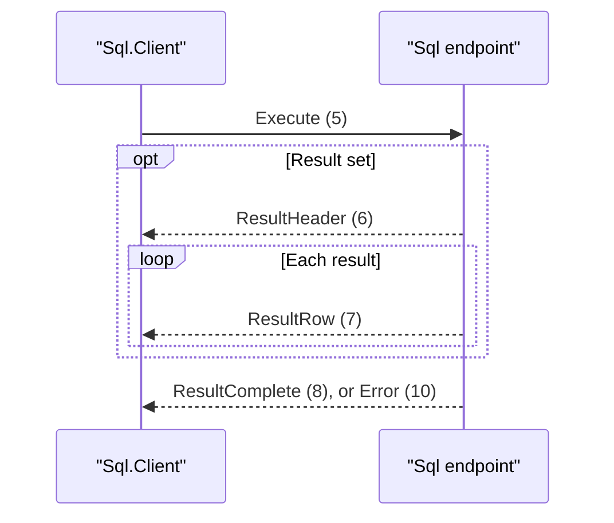

# Sql wire family

## Ownership and compatibility

`SqlProtocol.Family` is fixed when the endpoint accepts a connection. The model
owns `SqlProtocolMessageType`, ProtocolExecuteMessage, ProtocolResultHeaderMessage,
and ProtocolResultCompleteMessage. The frame, startup, error, and lifecycle formats
come from [Database.Protocol](../../Assimalign.Cohesion.Database.Protocol/docs/DESIGN.md).
Protocol version remains **1.0**: identifiers, payload bytes, order, authentication,
and error codes are unchanged for deployed clients. The model's Client package owns
parameter encoding and result materialization; the shared Client only runs exchanges.

For source compatibility, this model exports C# static extension properties on the
core ProtocolMessageType for its legacy identifiers. They live in this assembly,
not the core enum. New code uses the model enum and casts to ProtocolMessageType at
the frame boundary. Code referencing both model namespaces should use qualified
model enum names. No registry can switch the family of an existing channel.

## Exchange

After the shared Startup/Authenticate/AuthenticateResponse/Ready handshake, execute
one statement at a time. Result-bearing statements return a header, zero or more
rows, and completion. Other statements return completion alone. Error ends the
current exchange without completion. ParseFailure and ExecutionFailure leave the
session ready; malformed payloads, unknown messages, and bad ordering close it.
There is no pipelining or multiplexing. Terminate closes; Ping receives Pong while ready.

The model-owned exchange has this order.

## Payload layouts

All fixed integers below are big-endian. A `string` is an i32 nonnegative UTF-8 byte
length followed by that many bytes. The outer envelope is u32 payload length, u8
type, then payload; no payload exceeds 16,777,216 bytes. Counts are signed i32 and
must be nonnegative. Writers emit exactly the fields below with no padding.

| Byte | Direction | Payload |
| --- | --- | --- |
| 5 Execute | Client to server | string statement, i32 parameterCount, repeated (string name, i32 encodedLength, encoded scalar component) |
| 6 ResultHeader | Server to client | i32 columnCount, repeated (string name, u8 DatabaseType) |
| 7 ResultRow | Server to client | Concatenated self-describing scalar components, in column order; no count prefix |
| 8 ResultComplete | Server to client | i64 affectedCount; -1 means not applicable |
| 9 Transaction | Reserved model identifier | No implemented payload; send transaction commands through Execute where supported |

Parameter names are unique and values contain exactly one component. Returned rows
contain one component per header column; null carries its own type tag. SQL query completion uses -1; writes report their affected count. Explicit BEGIN/COMMIT/ROLLBACK are statement text on Execute, not type 9.

## Scalar component encoding

Each component begins with one u8 DatabaseType tag. Its payload follows immediately.
Fixed-width values have no length prefix. `signed(N)` below means the two's-complement
N-bit integer with its sign bit XORed, emitted most-significant byte first; reverse
that sign-bit XOR to decode. `escaped` replaces each 00 byte with 00 FF and appends
00 00. Strings on this wire use binary collation id 0 and exact UTF-8 bytes.

| Tag | Type | Payload after tag |
| --- | --- | --- |
| 0 | Null | Empty |
| 1 | Boolean | u8 0=false, 1=true |
| 2 | Int8 | signed(8) |
| 3 | Int16 | signed(16) |
| 4 | Int32 | signed(32) |
| 5 | Int64 | signed(64) |
| 6 | Float32 | Folded IEEE-754 32-bit bits, big-endian |
| 7 | Float64 | Folded IEEE-754 64-bit bits, big-endian |
| 8 | Decimal | Sign byte; normalized exponent and decimal digits as described below |
| 9 | String | u8 collation=0, escaped UTF-8 |
| 10 | Binary | escaped bytes |
| 11 | Date | signed(32) day number since 0001-01-01 (day zero) |
| 12 | Time | signed(64) ticks since midnight (100 ns/tick) |
| 13 | DateTime | signed(64) ticks since 0001-01-01, then u8 kind (0 unspecified, 1 UTC, 2 local) |
| 14 | DateTimeOffset | signed(64) UTC ticks since 0001-01-01, then signed(16) offset minutes |
| 15 | TimeSpan | signed(64) duration ticks |
| 16 | Guid | 16 RFC 4122 big-endian bytes |

Tags 17 and 18 are JSON identities in DatabaseType, but are not scalar components
supported by this family. Nested documents use their own family. Unknown tags reject.

For floats, canonicalize NaN to positive quiet NaN (7FC00000 / 7FF8000000000000),
then complement all bits for a negative IEEE bit pattern or set the high bit for a
nonnegative pattern. Decode by clearing a set high bit, otherwise complementing.
This preserves negative zero and infinities.

Decimal zero is the single sign byte 1. Nonzero values use sign 0 (negative) or 2
(positive), followed by u8 (base-10 exponent + 64), normalized significant digits
(each digit encoded as digit+1), and terminator 00. Remove leading/trailing zero
digits; the value is d1.d2... times 10^exponent. For negatives, complement every
byte after the sign, including the terminator (FF). This is System.Decimal's
96-bit coefficient / scale 0–28 value domain, not an IEEE floating-point decimal.

Golden payload examples (hex): Execute("X", no parameters) =
`00 00 00 01 58 00 00 00 00`; one header column ("id", Int64) =
`00 00 00 01 00 00 00 02 69 64 05`; completion(42) =
`00 00 00 00 00 00 00 2A`. The existing server tests exercise the 1.0 wire unchanged;
ProtocolMessageTests additionally fixes these payload bytes.
