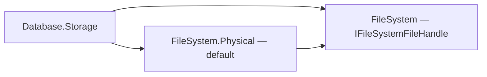

# Assimalign.Cohesion.Database.Storage — Design

The physical layer of the Data Platform kernel (area architecture:
[resources/Database/DESIGN.md](../../../../docs/resources/Database/DESIGN.md) §3.2). This document records the design
decisions that shape the storage model; the program-level requirements it satisfies are
R1 (ACID), R3 (shared kernel), and R6 (NativeAOT) in the area design.

## Design intent

One model-agnostic physical substrate: fixed-size pages, a pin-counted buffer pool, a
slotted-page record layout, and a write-ahead journal. Model engines bring *layouts*
(what bytes mean inside a page body) but never their own paging, caching, or logging.
The guardrails that keep this layer trustworthy are structural: every page load is
checksum-verified, every write-back is checksum-stamped, and durability flows through
the journal only — there are no side files.

## The page model

- **8 KiB pages, 96-byte header.** The header layout (`Page.Header`) is an explicit
  struct persisted on disk, so field offsets are a wire contract: id (0), LSN (8),
  checksum (16), flags (20), type (21), slot count (22), free-data end (24), overflow
  size (28), reserved nonce/MAC space for encryption at rest (32–63), then the
  owner tag (64) driving per-owner record chains (72–95 reserved).
- **`PageType.Free` is zero — deliberately.** A zero-initialized page reads as free,
  and `FreePage` re-stamps freed pages with `Free`, which is what lets the free-space
  map be *reconstructed from page headers* on open instead of being persisted as a
  separate structure that could drift from reality. The trade-off: a page freed but not
  yet flushed at process exit reappears as allocated after reopen — a safe leak, never
  corruption. (A bitmap FSM page type is reserved for when file sizes make the open-time
  scan matter.)
- **Page LSN.** Every page carries the LSN of the journal record that last modified it.
  This is the hook for the write-ahead rule (a page may not be written to the data
  stream until the journal is durable up to its LSN) and for idempotent recovery replay
  (apply a record only if it is newer than the page). The storage layer stores the
  field; the journal build-out (#160) enforces the rule.
- **Checksums on every read path.** CRC-32C over the full page with the checksum field
  zeroed (storage format 2, "Checksums" below). Stamped centrally in the buffer pool's
  write-back (the only path to the data stream), verified centrally in the buffer pool's
  load (the only path from it). A stored checksum of zero means "never stamped" and skips
  verification — accepted because the alternative (a validity bit elsewhere) buys nothing
  against the ~2⁻³² false-negative rate this already carries.

### Page 0: the identity block and two alternating header slots

`StorageFileHeader` sits in the **body** of page 0, after the standard 96-byte page header,
not at file offset 0. An earlier draft overlaid it on the page header, which made page 0
un-checksummable and un-typed. Storage format 2 (#1251) splits what page 0 holds by how
often it changes:

```
Page 0 (8 KiB)
┌──────────────┬──────────────────────┬──────────┬────────────┬──────────┬────────────┐
│ page header  │ StorageFileHeader    │ reserved │ header     │ reserved │ header     │
│ 0..96        │ 96..352 (identity)   │ ..512    │ slot 0     │ ..4608   │ slot 1     │
│              │                      │          │ 512..4096  │          │ 4608..8192 │
└──────────────┴──────────────────────┴──────────┴────────────┴──────────┴────────────┘
```

- **The identity block** (magic, format version, page size, model, storage id, creation
  time, name, and its own CRC-32C) is written when the file is created. Magic and format
  version stay at page offsets 96 and 100 in every format, which is what lets the format
  fence read them before anything is verified ("Storage format 2 and the format fence").
- **Two header slots** carry everything that changes: the generation counter, the LSN floor,
  the transaction sequence floor, page counts, the modification time and the checkpoint
  anchor, plus a copy of the identity block, each slot under its own CRC-32C. Each slot is
  3,584 bytes, seven 512-byte sectors that share no sector with the other slot or the
  identity block, and each lies inside one 4 KiB block.
- **A header write goes to the slot that does not hold the newest generation**, as
  generation + 1, rewriting only that slot's bytes (a positional write, not the page). It is
  made durable before it counts: only once the data flush after it returns does the storage
  treat the slot as the newest, so the next write goes to the other one. A crash at any
  point leaves at least one slot whole, and open picks the newest slot whose checksum
  verifies. A slot whose write tore fails its checksum — unless every sector that differed
  landed, in which case it is the complete new slot.
- **The sector assumption, and why each slot copies the identity block.** The torn-write
  model is old-or-new per 512-byte sector: that is what the slots' sector alignment rests on.
  The identity block shares slot 0's 4 KiB block, though, and a drive with 4 KiB physical
  sectors that emulates 512-byte ones (512e) turns a slot-0 write into a read-modify-write
  of that whole physical sector; power lost during it can leave the sector unreadable or
  garbage — page header, identity block, magic and format version included — while slot 1
  is intact. So each slot carries a copy of the identity block, the way each of Voron's
  header files is self-contained and restored from the other when it does not verify
  (`HeaderAccessor.cs:71-86`). When page 0's identity block fails its magic or its checksum,
  open takes the identity from the newest valid slot, and the next write to slot 0 rewrites
  page 0's whole leading 4 KiB block (page header, identity block, slot 0) in one write. The
  repair waits for a slot-0 write because writing the identity block beside a slot-1 write
  would put the newest slot, slot 0, at risk of the very loss the copy guards against. A
  page 0 with neither a verified identity block nor a valid slot is refused: as not a
  storage file when its magic is wrong, as corruption otherwise.
- **Page 0 never enters the buffer pool**, and its page-level checksum is zero ("never
  stamped"): a slot write changes only the slot, so a page checksum would be stale after
  every header write. The identity block and the slots carry their own checksums instead.
  The page manager enforces it: it reserves page 0 in the free-space map and refuses to pin,
  overwrite-pin or free it (`StorageIOException`), so a damaged page reference — a B-tree root
  id, a graph record — cannot reach the file header through `GetPage` or
  `IStorage.OpenPageForWrite`, and recovery never replays a journal image onto page 0. A
  pooled copy would be stale after the next header write, and a write-back or replay of it
  would roll both slots back.
- **Tested by tearing.** The test crash simulation (`CrashSimulationStream` with a shared
  `CrashPoint`) loses power at a chosen write and keeps a durable prefix of k 512-byte
  sectors of it. `StorageFormatTests` tears a slot write after 0, 1, 3 and 6 of its seven
  sectors and opens from the previous generation each time (and from the new one when all
  seven landed); with both slots damaged the open fails as corruption. It also destroys
  page 0's leading 4 KiB block (zeros, then random bytes) and opens from slot 1, and checks
  that the identity block is rewritten with slot 0 and never with slot 1.
  `StorageHeaderPageAccessTests` covers each page-0 guard.

Page 0 used to be one page rewritten in place at every checkpoint and checksum-verified at
open, so a torn 8 KiB write (an 8 KiB page is sixteen 512-byte sectors, and power loss can
leave some written and others not) made the file set unopenable — and since #1226 page 0
carries checkpoint state the journal cannot replace. RavenDB's Voron alternates its header
files the same way: `Initialize` reads `headers.one` and `headers.two`, keeps the valid
ones and takes the higher `HeaderRevision`, and `Modify` writes `HeaderFileNames[_revision & 1]`
(`src/Voron/Impl/FileHeaders/HeaderAccessor.cs:44-99, 177-196`). PostgreSQL instead keeps its
single `pg_control` copy within one 512-byte sector so that one write is atomic
(`PG_CONTROL_MAX_SAFE_SIZE`, `src/include/catalog/pg_control.h:284-290`); the checkpoint
anchor is far larger than a sector, so Cohesion double-buffers.

## Storage format 2 and the format fence (#1251)

`StorageFileHeader.CurrentFormatVersion` is 2, and it covers every on-disk change of #1251
at once: CRC-32C page, slot and journal checksums, journal frame version 3, the identity
block and alternating header slots of page 0, the persisted LSN floor, and the
writers-only, chained checkpoint anchor. Nothing has shipped, so there is no upgrade path
and no compatibility shim (owner decision, #1152): a file set of another format is refused,
never misread.

- **The fence reads the raw bytes first.** Open reads magic (page offset 96) and format
  version (100) from the raw page-0 bytes before it verifies any checksum. With the magic in
  place, any version but the current one is refused with `StorageFormatException`, whose
  message leads with `COHDBS001`, names the version found and the version supported, and
  points at #1152 (export with the engine that wrote the file, or open it with the newer
  engine). Only then are the slots' and the identity block's checksums verified. A wrong
  magic is "not a storage file" (`StorageIOException`) unless a header slot verifies, in
  which case page 0's leading block was destroyed and the slot's copy of the identity block
  stands in for it (its own format version fenced the same way; "Page 0" above). The order
  matters because the checksum algorithm is itself part of the format: a format-1 file fails
  every CRC-32C, and checking that first would report a version mismatch as corruption.
  PostgreSQL's `ReadControlFile` does the same — "complaining about wrong version will
  probably be more enlightening than complaining about wrong CRC" — checking
  `pg_control_version` before the CRC (`src/backend/access/transam/xlog.c:4507-4544`).
  `StorageFileHeader.IsValid()` is exact (magic and exactly the current version) where it used
  to accept any positive version.
- **Engines name the database.** Every model engine catches the refusal around its storage
  open and rethrows it with the database's name, as it already does for an index-format
  refusal: "Database 'x' cannot be opened. COHDBS001: …". The SQL and key-value engines open
  two file sets per database and name the one refused ("its catalog file set 'x.catalog' was
  refused"); SQL carries it in its format exception, which its server forwards to the client.
- **Journal frames are fenced too.** A frame whose length, magic and CRC-32C verify but whose
  version byte is not 3 was written whole by another engine; the read refuses it with
  `StorageFormatException` (naming the frame's position) instead of stopping there as if it
  were a torn tail, which would silently drop it and every record after it, commit records
  included. A frame whose checksum fails is still a torn tail. Frames of format 1 (version 2,
  IEEE CRC) fail their CRC-32C, so they read as a torn tail; the data file's fence refuses
  such a file set before its journal is read, which makes the page-0 fence the one that
  covers the polynomial change, and the frame version the one for later bumps that keep it.

### Checksums

Pages, journal frames, the identity block and the header slots use CRC-32C (Castagnoli,
reflected polynomial `0x82F63B78`, initial value and final XOR `0xFFFFFFFF`) through
`System.Numerics.BitOperations.Crc32C`, eight bytes per step: the CRC32C instruction on x64
(SSE4.2) and ARM64 (the CRC32 extension), a software table elsewhere, all NativeAOT- and
trimming-safe with no package. Each word is read little-endian, so a checksum is the same on
every host. The byte-at-a-time IEEE table it replaced spent 27–30 µs on an 8 KiB page, most of
a page touch's CPU cost (#1236); PostgreSQL uses CRC-32C for its WAL records
(`xl_crc`, `src/include/access/xlogrecord.h:49`) and its control file
(`src/include/catalog/pg_control.h:281`), with SSE4.2 and ARMv8 paths
(`src/include/port/pg_crc32c.h:44, 117`). A page checksum folds the page's own four checksum
bytes as zeros (`Crc32C.AppendZeros`) rather than copying the page; `Crc32CTests` pins that
path to the CRC of the page with its field zeroed, the RFC 3720 B.4 vectors and the
`123456789` check value, and every length from 0 to 9,000 bytes at all 8 alignments against
a bitwise reference (run incrementally, one byte at a time, so every prefix costs one pass).

## File handles, positional I/O, and durability

Storage file opening accepts an `IFileSystem`; omitting it selects the physical
file system. Data, backup, and journal files are opened with `OpenHandle`, which
returns the explicit `IFileSystemFileHandle` contract. The buffer pool and recovery
pass page offsets to its positional reads and writes through `StorageStream`.
Their I/O does not depend on a shared stream cursor; the pool's existing locking,
page layout, and write-ahead ordering remain unchanged.

Durability follows the handle through composition: the storage journal retains
the `StorageStream` durability contract and forwards a durable request to
`IFileSystemFileHandle.Flush(durable: true)`. Capability comes from
`SupportsDurableFlush`, never a runtime stream type. This fixes **#1018**: wrapping
a physical handle cannot silently turn the journal's durable flush into an
ordinary buffered flush. The physical handle implements that request with
`RandomAccess.FlushToDisk`.

The dependency direction keeps the physical implementation as the default behind
the file-system contract:



**Durability follows the storage.** `Storage.SupportsDurableFlush` requires both
data and journal handles to support durable flushing: checkpointing cannot safely
discard a durable journal before its data pages are durable. Backups are separate
from the commit/checkpoint path. `ConfigureCommitDurability` derives an unset choice
as `Synchronous` for capable storage and `None` otherwise. An explicit `Synchronous`
or `Grouped` choice on unsupported storage fails at engine open, naming the storage
and the setting. Model factories resolve the default before initialization and
recovery; engines validate their explicit options before serving the database.

Low-level durable journal operations still throw `NotSupportedException` on
unsupported handles, rather than silently downgrading the request. Reading existing
journal bytes does not advance `DurableLsn`: only a completed explicit durable flush
does. Reopening live memory or an operating-system cache is not durability evidence.

Constructors accepting an ordinary `Stream` explicitly provide **no durability**,
even if that stream happens to wrap a physical file. Such callers must use the
handle overload to carry the contract. `StorageStream.FromInMemory()` is likewise
non-durable. Tests of recovery ordering use explicit simulated durable handles;
that fixture contract models persistence across their simulated crash rather
than claiming that production memory is durable.

The regression gate observes the durable flag on a recording handle around the
real physical handle used by the composed storage journal. A reopen or simulated
crash assertion alone cannot prove this request: operating-system buffering can
preserve bytes even when no durable flush was issued.

## The buffer pool

Pin-counting with RAII handles (`IStoragePageHandle`): a page cannot be evicted while
pinned, dirty pages are written back (checksum-stamped) before eviction, and handles
release their pin on dispose. Contrast with a `Memory<byte>`-pooling design: pages are
*pinned* buffers exposing raw pointers because the slotted-page and header structs
are `unsafe` overlays — the pool guarantees pointer stability for the handle's lifetime.

- **Buffers live on the pinned object heap** (`GC.AllocateArray(..., pinned: true)`),
  not behind `GCHandle`s. A pinned-heap array never moves and stays valid while anything
  references it — the entry, and through it every handle — so no code path can release
  a pin out from under a live pointer. Disposing the pool drops its bookkeeping and
  nothing else; a handle that outlives its pool still points at live memory. (With
  `GCHandle`s, disposing the storage while an iterator held a page freed the pin, after
  which the GC was free to move the buffer under the iterator's pointer.)
- **A handle releases the pin it took.** Disposing a handle unpins its own entry, not
  whatever is resident under the page id, and disposal is idempotent across threads.
- **Content changes only under a pin.** Readers and writers take pins; the pool takes
  no part in content access. The write-back rules below rest on that.

- **Eviction is least-recently-used** over unpinned entries: pins and cache hits move a
  page to the MRU end; capacity overflow evicts from the LRU end, skipping pinned
  pages, and fails loudly (`StorageIOException`) when every resident page is pinned —
  the pool never silently exceeds its memory budget. LRU (not clock/2Q) because the
  pool is fully lock-serialized anyway, so the precise policy costs nothing extra and
  is trivially testable.
- **Buffers are reused**: evicted entries return their pinned 8 KiB buffers to a
  recycle stack, so steady-state page churn performs zero allocations — fresh pages
  are zeroed on reuse so recycled buffers never leak prior content.
- **Failed loads never poison the cache**: a page that fails checksum verification is
  not cached; its buffer goes straight back to the recycle stack and the exception
  propagates. The same holds for a page whose header claims an overflow area that does
  not fit the 8 KiB buffer (`StorageCorruptionException`): `Page.AsSpan()` and
  `AsBodySpan()` size their spans from that header, nothing writes overflow pages yet,
  and an unstamped page (checksum zero) is never verified, so the header alone would
  otherwise hand the B-tree a writable span past the buffer.
- **Extension runs under the pool lock.** Allocating a page past the end of the data
  stream grows the stream through `EnsureLength`, under the same lock every page read
  and write-back holds, and only ever grows it. An in-memory stream copies its array
  into a new one when it grows; a write-back that landed in the old array after its
  region was copied was lost while the pool recorded the page clean, so a later eviction
  dropped the change and the reload was stale or all zeros (#1157 review). The
  `StorageStream` adapter over a plain `Stream` also routes `Length` and `SetLength`
  through the gate that serializes its page reads and writes, so the stream is safe on
  its own, not only under the pool.
- **One lock.** All pool state is guarded by a single monitor. Page *content* access is
  the caller's concern (a handle hands out a raw pointer); the transaction layer above
  provides content-level isolation. Sharding the lock is a measured-need optimization,
  not a default.
- **Write-back writes a private copy.** A pinned writer can change a page while the pool
  writes it back — `FlushAll` and `FlushPage` write pinned pages, and until #1157 the
  paced page writer did too. Write-back therefore copies the page first, stamps the
  checksum on the copy, and writes the copy: the bytes on the stream always verify. The
  write-ahead
  LSN is read from the copy as well — a writer stamps the page LSN before changing the
  bytes that record covers, so the copy's LSN covers every change in it.
- **Dirty state is a version, not a flag.** `MarkDirty` advances the entry's
  modification version; a write-back records the entry clean only up to the version it
  observed before copying. A change made during the write keeps the page dirty. With a
  boolean, a writer's `MarkDirty` could land between the write and the write-back's
  "clean", the page was later evicted without being written, and the reload either lost
  the change or failed its checksum — the storage concurrency suite reproduces exactly
  that against the old pool.
- **Paced write-back skips pinned pages.** An unpinned page is quiescent, so the page
  writer only ever writes complete images; a pinned dirty page waits for a later pass,
  an eviction, or the checkpoint (which runs with no transaction active).
- **Invariants.** The structural check (`CheckInvariants`) verifies, under the lock,
  that every resident entry has a non-negative pin count, is not on the recycle stack,
  and owns exactly one node of the LRU list keyed by its page; that the LRU list holds
  nothing else; and that recycled entries are unpinned and detached. It is compiled
  into every configuration. Debug builds also run it wherever the pool's structure
  changes — a pin miss (which may evict and recycle), an explicit eviction, a flush —
  and, on a pin hit, a `TryGet` hit or an unpin, which change one entry's pin count and
  LRU position, check just that frame: resident under its page, owning its node of the
  access list, not recycled, with a non-negative pin count (#1240). They add
  per-operation checks too: a handle never releases a pin on an entry that is no longer
  resident, a page is never unpinned more often than it was pinned, and a handle's page
  is never read after the handle was disposed. Release builds skip the per-operation
  checks and ignore an over-release. CI runs the suites in Release, so the explicit
  check, the injected-violation tests and the per-phase checks of the concurrency suites
  run there too; the per-operation checks run in local Debug runs. The walk used to run
  after every pool operation: it is O(resident pages), and 99.7% of its calls in the
  Debug 100,000-row cascade test came from hits and unpins, about 80% of that test's time
  (63–70 s against 13 s, "Measurements").
- **Allocation does not read the page it allocates.** `AllocatePage` clears every byte
  of the page it hands out, so it pins through `PinForOverwrite`, which takes a resident
  entry as it is and gives a non-resident page a zeroed buffer instead of reading and
  verifying the free page's old bytes. Besides the wasted read, verification refused the
  allocation of a free page whose last write a crash tore — recovery repairs torn pages
  from journal images, and an unjournaled checkpoint anchor page has none.

### Capacity (#1254)

The pool holds `Storage.DefaultBufferPoolCapacity` pages, 4,096 (32 MiB), unless the
constructor is given another count; every engine exposes the size as a `BufferPoolCapacity`
option in bytes, 32 MiB by default, validated by `Storage.GetBufferPoolPageCount` (a whole
number of 8 KiB pages, at least `MinimumBufferPoolBytes`, 1 MiB) and applied through the
settable `Storage.BufferPoolCapacity` right after the storage is created or opened. Until #1254
every engine ran with a hard-coded 128 pages (1 MiB), which cannot keep a 4 MiB index resident:
the #1236 random-reference benchmark stole and reloaded a page on almost every touch and ran at a
third of the 4,096-page rate ("Measurements").

- **Why 32 MiB.** PostgreSQL's default `shared_buffers` is 128 MB, 16,384 8 KiB buffers
  (`NBuffers = 16384`, `src/backend/utils/init/globals.c:144`), shared by every database of a
  cluster. A Cohesion pool belongs to one database, and a host commonly opens several, so the
  default is a quarter of that: enough to keep the #1236 working set (a 4 MiB index plus the
  table) resident with room for the catalog, small enough that ten open databases cost about
  what one PostgreSQL cluster does.
- **What it costs.** Page buffers are allocated on first load and recycled, never preallocated,
  so a database pays for the pages it has touched, up to the capacity. At capacity the pool
  holds 32 MiB of pinned-heap buffers plus about 160 bytes of bookkeeping per resident page
  (entry, dictionary slot, LRU node: 0.6 MiB at 4,096 pages). The SQL and key-value engines open
  a second, catalog file set per database whose pool stays at 128 pages (1 MiB): the catalog is
  small and hot. So an open database costs up to about 33 MiB (34 MiB for SQL and key-value) of
  pool memory; an in-memory database also holds its data and its journal in memory. The journal
  is bounded by the checkpoint size ("Checkpoint triggers"), but its buffer is a `MemoryStream`'s,
  which doubles as it grows: when the journal passes 256 MiB the buffer becomes 512 MiB until the
  checkpoint truncates it. Truncating an in-memory stream to zero releases its buffer
  (`StreamFileHandle.SetLength`); before the #1254 review a `MemoryStream` kept it, so an
  in-memory database held up to twice the checkpoint size for its lifetime once its journal first
  reached it.
- **Resizing.** Growing takes effect at once. Shrinking evicts least-recently-used unpinned
  pages, writing dirty ones back through the write-ahead gate, until the resident set fits; if
  more pages than the new capacity are pinned, the resize throws `StorageIOException` and the
  pool keeps its capacity.

## The record layer

`SlottedPage` implements the classic slotted layout: records grow forward from the
header, the slot directory grows backward from the page end, deletion marks a slot
(length 0) and `Compact` defragments. All four models share this because their unit of
storage — row, document, KV entry, node/edge record — is "a variable-length byte
sequence addressed by (page, slot)". Records above `SlottedPage.MaxRecordSize` are
rejected at the API boundary; multi-page records ride overflow pages (a later feature —
the flags and page type are reserved).

**No offset taken from a page is trusted.** The page is native memory, so an offset
past its end is a write into whatever the runtime placed next to the buffer — that is
how #1157 killed the process (below). Every `SlottedPage` operation checks the geometry
it is about to use and fails with `StorageCorruptionException` (carrying the page id)
instead of dereferencing it:

- **Writes** (`InsertSlot`, `UpdateSlot`, `Compact`) run on a page their transaction
  owns, so they hold the page to its full invariant: the slot directory fits the body,
  the free-data end lies between the body start and the slot directory, and the slot
  being changed addresses bytes inside the record area.
- **Reads** (`ReadSlot`, `GetSlotLength`) can run beside the page's single writer — a
  scan takes a pin, not a latch — so they enforce only what holds in every state a
  well-formed page passes through: the slot index lies inside a directory a page can
  hold, and the record lies inside the page body. That is what keeps a read inside the
  buffer. A read racing a change can still see a torn record — stale bytes, or a
  corruption error if it catches a rollback's page restore half-way, where it used to
  read past the buffer — which is the content-isolation question page latches would
  answer; the layers above own it today.
- **Relocation needs the whole record.** An update that outgrows its slot appends the
  record at the free-data end and leaves the old bytes as dead space, so it requires
  the record's full length in free space and leaves the page untouched when it does
  not fit (the caller relocates to another page — the catalogs' delete-and-insert).
- **`Compact` moves records in offset order.** A relocated record can sit above a
  record with a higher slot index; compacting in slot order overwrote it. Overlapping
  records are corruption and fail before any byte moves. Nothing calls `Compact` yet:
  dead space from relocations is not reclaimed in place (see the #1157 follow-up below).
- **Clears span the buffer, not the header.** Freeing and allocating a page clear a
  fixed `Page.Size` (or body) span; `Page.AsSpan()` honors the reserved overflow size in
  the header, and a header is page content that a corrupt page controls. The pool refuses
  to load a page whose overflow header does not fit its buffer (above), so a span taken
  from a pooled page stays inside it.

### Per-owner record chains

Data pages carry an 8-byte **owner tag** in the page header (offset 64, taken from
the reserved area; zero = the shared, untagged space, which is also what pre-tag
files read — no format flag needed). The tag is model-agnostic: storage never
interprets it beyond grouping. `InsertRecord(transaction, ownerId, data)` lands the
record on the owner's current write page (allocating and tagging a new page when
needed), `GetUnitIterator(ownerId)` iterates only the owner's pages, and
`GetOwnerPages(ownerId)` exposes the chain. This is what turns a model's
"scan one object" from O(storage) into O(object) — the SQL engine passes table
object ids, so a table scan stops decoding the whole database.

- **The directory is in-memory only, page headers are the truth.** The per-owner
  page directory is rebuilt on open by the same header scan that rebuilds the
  free-space map (no extra I/O) and maintained at allocation/free time. A persisted
  directory could drift from reality; headers cannot (the FSM precedent).
- **Owner tags are WAL-covered like all page bytes.** A fresh chain page is tagged
  *before* its first-touch before-image is captured, so a rolled-back allocation
  restores an empty page still belonging to the chain — a safe leak the owner's
  next insert reuses.
- **Chain release (`FreeOwnerPages`) is transactional with commit-deferred
  reuse.** Each page is retyped `Free` under the transaction (before-image
  covered — rollback and crash recovery restore the chain bytes), but the pages
  re-enter the free-space map and leave the directory only when the transaction
  **commits**. Freeing eagerly would let the allocator hand a page to a new owner
  while the release could still roll back — the rollback's before-image would then
  resurrect old content over live data. Deferral makes that impossible.
- **A page on the free list is never write-locked.** Commit releases the bracket's
  page write locks and then returns its freed pages to the free-space map, in one hold
  of the transaction lock that every page lock is taken under. Another transaction may
  allocate a freed page the instant it is on the list; its first touch waits for that
  lock and finds the page unlocked. The frees used to run first, under the owner lock
  only, and an allocation that took a page between them failed with "Page N is
  write-locked by transaction T" (the concurrency suite on CI runners). A page
  one transaction releases twice (its last record deleted, then its chain released) is
  freed once: a second free could return it to the list after another allocation took
  it, and hand it to a second owner. PostgreSQL guards the same edge from the
  allocating side, using a page the FSM reports only if its buffer lock is free
  (`_bt_allocbuf`, `src/backend/access/nbtree/nbtpage.c`).
- **Why release is O(pages), not O(1).** Full-page-image logging prices a
  transactional free at one page touch per page (before-image + after-image in the
  journal). A directory-level O(1) release needs a persisted allocation structure
  (the reserved bitmap-FSM page type) so freeing can be a metadata write; until
  that lands, chains keep releases proportional to the object, which is already
  incomparably better than the previous permanent leak.

## The journal (write-ahead log)

`IStorageJournal` is the durability mechanism — the *only* one. Frames are length-prefixed,
magic-tagged, versioned (frame version 3) and CRC-32C-protected; a torn or corrupted tail
terminates the read scan and is ignored — it belongs to work that was never acknowledged —
and the first append after a reopen cuts it off ("Failed appends" below), while a verified
frame of another version is a format error ("Storage format 2 and the format fence"). LSNs never restart: a reopened journal resumes above both its last record
and the LSN floor of the newest header generation ("Checkpoints"). Records are typed and
binary (begin / commit / rollback / checkpoint / before-image / after-image / opaque
logical operation); transaction identity at this level is a compact monotonic `long`
sequence — GUID identity belongs to the transaction layer above.

### Write ordering rules (steal / no-force, full page images)

1. **Before-image at first touch.** A transaction's first modification of a page
   appends the page's full prior image and stamps the pooled page's LSN with that
   record — mutations then apply in the buffer pool only.
2. **The write-ahead gate.** The buffer pool may steal (evict) a dirty page at any
   time, but its write-back first forces the journal durable up to the page's LSN —
   so any uncommitted content that reaches the data file is always undoable from a
   durable before-image. A page written outside the journal (a checkpoint anchor page)
   carries the journal's last LSN at the time its page was allocated, so the gate holds
   for it too ("Checkpoints").
3. **Commit = after-images + commit record + fsync.** Commit appends the after-image
   of every touched page (stamping each page's LSN with its record), then the commit
   record, and acknowledges only after `EnsureDurable(commitLsn)`. Data pages are
   *not* forced — recovery redoes them (no-force).
4. **Rollback restores in memory.** Before-images are kept per transaction and copied
   back into the pooled pages, so rollback is complete without I/O; a rollback record
   marks the outcome.
5. **Page-level single-writer.** A page touched by an active transaction is
   write-locked to it (conflicts throw rather than wait). Record-level concurrency is
   `Database.Transactions`' job above this layer; full-image logging is only correct
   because two transactions can never interleave on one page. This division is
   permanent in the MVCC integration design (area DESIGN.md §3.8): storage
   transactions remain the **physical WAL bracket** — the MVCC manager layers
   row-grain snapshots/locks *above* them (paired per transaction via
   `IStorageTransactionSource`), and page locks stop being the user-visible
   conflict surface without ever weakening the invariant that makes page-image
   logging correct.

### Failed appends (#1226)

A journal append that fails must not leave the journal or the storage in a state that
outlives the failure:

- **A partial frame is cut back off.** A write that fails part way can leave the start
  of its frame at the end of the stream, and the read scan stops at the first frame that
  does not verify, so every frame appended after it, commit records included, would be
  invisible to recovery. `StreamJournal` therefore truncates the stream back to where
  the failed frame began before the failure propagates. When that truncation fails too,
  the journal refuses every later append with `JournalException` until a checkpoint's
  truncation removes the partial frame or the storage is reopened: a record that could
  not reach recovery is never acknowledged. Flushing stays allowed, because everything
  before the partial frame still reads. PostgreSQL stops the server on any failed WAL
  write (`ereport(PANIC, "could not write to log file ...")`,
  `src/backend/access/transam/xlog.c:2529-2531`, commit `85f55534e80`); this journal
  stops only its appends.
- **Appends resume after the last verified frame (#1251 review).** A crash can leave a torn
  frame at the end of the journal; the read scan stops there, and so recovery ignores it. The
  next append, though, used to go to the physical end of the stream, behind those bytes, and
  an engine's open appends before it truncates: its recovery scrub runs before the deferred
  open-time checkpoint. A second crash in that window left the scrub's brackets unreadable,
  their stolen page writes neither undoable nor redoable — and a journal holding only the
  torn start of a checkpoint record was never truncated at all, so every later commit sat
  behind it. `StreamJournal` therefore remembers where the last verified frame ended when a
  read scan runs to the end of the verified frames (every journal's initialization does), and
  its first append cuts the stream back to that offset. PostgreSQL resumes WAL insertion at
  the end of the last valid record the same way (`EndOfLog`,
  `src/backend/access/transam/xlog.c:6711-6718`). An open that appends nothing leaves the
  journal byte-identical. Every later append goes to the offset the previous one ended at,
  so the journal asks its file for the length once after a scan instead of once per append
  ("Measurements").
- **A page whose before image fails is not locked.** A first touch takes the page's
  write lock, then appends the before image. When that append fails the page is still
  unmodified and the transaction holds no before image of it, and commit and rollback
  release page locks by before image, so the touch releases the lock itself before the
  failure propagates. Otherwise the page would stay locked to a finished transaction,
  and every later transaction touching it, the retry of a failed undo included, would be
  refused until a restart.
- **A bracket whose begin record fails is not counted.** `BeginTransaction` counts the
  bracket as active before it appends the begin record (under the lock checkpoints
  take), and returns the count when the append fails, since no scope exists for the
  caller to complete. Otherwise every later checkpoint would refuse to run until a
  restart.
- **A rollback ends its bracket even when its rollback record fails.** The record is
  advisory: recovery undoes every bracket without a commit record. Once the pages are
  restored from their before images, the bracket's page write locks and its place in
  the active count are released, and the scope is completed in the same step, before
  the append failure propagates; disposing the scope afterwards does not roll it back
  a second time. A failure while restoring the pages leaves the bracket active, so the
  caller can retry it.

### A failed durable flush takes the storage offline (#1243)

A failed append is recoverable because the journal knows exactly what it holds afterwards. A
failed fsync is not: the operating system may have kept the bytes it was asked to make durable,
or dropped them and marked its cache pages clean, and a second fsync can then report success
for writes that never reached the device. That is PostgreSQL's 2018 "fsyncgate", and PostgreSQL
answers it by never retrying: a WAL fsync failure is `PANIC` (`issue_xlog_fsync`,
`src/backend/access/transam/xlog.c:9877-9937`), a failure inside the commit critical section is
`PANIC` (`RecordTransactionCommit` runs the commit record's insert and `XLogFlush` between
`START_CRIT_SECTION` and `END_CRIT_SECTION`, `src/backend/access/transam/xact.c:1470-1583`), and
with `data_sync_retry` off, its default, a data-file fsync failure is `PANIC` too
(`data_sync_elevel`, `src/backend/storage/file/fd.c:3966-3987`). Recovery from the WAL on the
media then decides what survived.

The storage does the same without stopping the process. When a durable flush of the journal
(`EnsureDurable`, `FlushPendingCommits`, any `Flush(forceDurable: true)`) or of the data file
(the checkpoint's and the header write's data flush) throws, the storage goes **offline**:

- **The failing call throws `StorageOfflineException`** (`COHDBS002`), carrying the I/O
  failure as its inner exception. The journal latches the error under its append lock, so no
  append can slip in behind the failed flush; a data-file failure latches the journal too.
  `Storage.OfflineError` and `IsOffline` report it for the life of the instance.
- **Nothing more is written to either file.** Every later journal append, flush, durable
  wait and checkpoint, every page write-back, eviction of a dirty page, file extension and
  `FlushAll` (the buffer pool's write guard), every header write, every new storage
  transaction and every record change throws `StorageOfflineException` (`StorageOfflineException.Refusal`,
  same code and cause). Closing writes nothing: `ShutdownFlush` returns at once. Reads of
  resident and on-disk pages still work; the engines refuse every operation of an offline
  database before it reaches the storage, with the area root's `DatabaseOfflineException`
  (`Database` DESIGN.md, "Error model"; each engine's DESIGN.md, "Storage operations").
- **A commit whose record was appended ends committed in memory.** `CommitTransaction`
  appends the commit record, then waits for durability; when that wait fails the bracket is
  completed as committed (its page locks and active count released, its pages left as
  written) before the exception propagates. The bracket cannot be rolled back — its commit
  record may already be on the media, and a rollback record could not be written anyway — and
  leaving it active would block the close. Whether it committed is decided by the reopen's
  recovery: if the record's bytes reached the media it is redone, otherwise its pages are undone.
  The transaction layer reports it as committed-unconfirmed (`Database.Transactions` DESIGN.md).
  The exception a bracket's own durable commit throws here says so:
  `StorageOfflineException.CommitRecordWritten` is set (a refusal never sets it), so an engine
  reports a self-committing statement whose bracket this was (a catalog write, an index build)
  as unconfirmed, never as refused. Before the #1243 review SQL DDL whose effect survived the
  reopen was reported as `DatabaseOfflineException`, which reads as "nothing happened".
- **Group-commit waiters are released.** Going offline abandons the group-commit gate: every
  commit waiting on it wakes at once instead of waiting out its window for a flush that will
  never come, and its own durability request then gets the offline refusal, unless its LSN was
  already durable before the failure.
- **Several file sets of one database go offline together.** `Storage.OnOffline` is raised
  exactly once, with the error, by the call that took the storage offline, before that call
  returns or throws; `Storage.TakeOffline(error)` takes another storage offline. An engine whose
  database spans two storages (SQL and key-value: data and catalog) wires each storage's hook to
  the other's `TakeOffline`, so the second file set goes offline in the same moment and no file
  of the database changes after the failure. The hook runs outside the journal's lock and the
  group-commit lock, which is what lets the two handlers run at once without deadlock: neither
  storage waits on the other's journal (a test runs another thread through the failing journal's
  lock from inside the hook). It may run under the failing storage's header, transaction or pool
  lock, so a handler takes other storages offline and does nothing else. Before the #1243 review
  the engines spread the state only when something next read it, and in between the page
  write-back and journal-flush workers, which visit storages directly, kept writing the other
  file set (a probe saw the catalog's data file rewritten within one write-back interval of a
  data-journal fsync failure).
- **Only a reopen brings it back.** Disposing an offline storage writes nothing; opening the file
  set again runs recovery over the journal as the media holds it. Every engine lists an offline
  database in `IDatabaseEngine.OfflineDatabases`, and `Database.Hosting` reports the application
  unhealthy while one is listed, so an operator, or an orchestrator that restarts an unhealthy
  process, learns of it.

Before #1243 a failed journal fsync surfaced as a plain `IOException` from the commit, and the
next commit's flush could succeed and acknowledge work whose earlier records had been dropped. A
failed data fsync in a header write let a retried checkpoint truncate the journal over pages the
operating system may have discarded. `StorageOfflineTests` covers both files, the refusals, the
quiet close and the reopen; every engine has an offline test that fails a journal fsync through
a fault-injecting storage strategy and reopens with and without the unconfirmed record's bytes.

### The physical/logical bracket interplay (MVCC layering rules)

The MVCC session binding (area DESIGN.md §3.8, first delivered by the SQL
engine) added three storage-side rules that keep the logical layer sound:

- **One sequence namespace.** `IStorage.ReserveTransactionSequence()` +
  `IStorage.BeginTransaction(long sequence)` let an engine's transaction manager
  allocate from the storage's own counter and pair each logical transaction with
  a bracket that *adopts the same sequence*. The bracket's commit record then
  proves the logical transaction at recovery — there is no window in which page
  images are committed under one sequence while the logical outcome hangs on
  another, and internally sequenced brackets (catalog self-commits, auto-commit
  record operations) can never collide with manager-assigned sequences. An
  adopted bracket appends **no begin record** — the reserving caller's
  transaction log owns lifecycle records; the bracket contributes page images
  and its commit/rollback record.
- **The sequence floor.** Every header generation persists the storage's high-water
  transaction sequence (the slot's sequence floor, written with every header
  write). On open, sequence assignment resumes above `max(journal-max, floor)`:
  a checkpoint truncates the journal — the only other sequence witness — while
  MVCC row stamps persist in data pages, so a recycled sequence would corrupt
  snapshot visibility.
- **Checkpoints carry logical writers; the open-time checkpoint is deferrable.**
  `Checkpoint(ReadOnlySpan<long>)` embeds the in-flight *logical* sequences it is given
  in the truncating checkpoint record and, first, in the header's checkpoint anchor
  (their begin records are being destroyed; `TransactionRecovery.Analyze` reads them
  back so an unproven sequence still classifies as aborted, even when the record itself
  was lost; see "Checkpoints"). The transaction layer passes only its writers: a reader
  stamps nothing. Storage-level brackets must still be quiescent — the
  active-count interlock is unchanged, and logical actives are the caller's to
  supply because storage cannot see above its own layer. Symmetrically,
  `OpenExisting(checkpointOnOpen: false)` lets an engine analyze the recovered
  journal *before* the truncation destroys the records classification reads.
- **Inner brackets may commit non-durably.** `Commit(awaitDurability: false)`
  appends the same records (after images + commit record) without the durable
  flush — for per-statement physical brackets whose durability is owned by the
  outer logical transaction's commit record: the journal is ordered, so
  flushing the later record makes the earlier ones durable first, and a crash
  before that leaves the bracket unproven — its pages undone by recovery —
  which is exactly the outer transaction's abort semantics. The write-ahead
  gate protects stolen pages regardless of the flag; the flag never weakens
  the rule that an *acknowledged* commit is durable, because acknowledgment
  belongs to the outer commit. Such a bracket's frees return its pages to the
  allocator once its commit record is appended, before the record is durable, so a
  page written outside the journal must not reuse one first: a header write makes the
  journal durable through its last record before it writes an anchor page ("Checkpoints").

Full page images (8 KiB per touch) were chosen over byte-range deltas deliberately:
they make recovery a pure idempotent overwrite with no operation replay logic, which
is the property the crash suites verify. Deltas are a measured-need optimization that
can ride the same record types later.

### Recovery replay rules

Because images are full pages and pages are single-writer, the desired final state of
a page is the image of the **last** journal record on it among *committed
after-images* and *uncommitted before-images* — redo and undo collapse into one
last-record-wins pass. Replay is idempotent by exact-LSN match: an after-image stamps
its record LSN, a before-image restores the pre-transaction LSN embedded in the
captured bytes, and an image is skipped only when the on-disk page already verifies
(checksum) at exactly the target LSN. Recovery runs on open, writes directly to the
data stream (bypassing the pool — a corrupt page must be overwritable), and finishes
with a checkpoint.

The exact-LSN skip is only sound because LSNs never repeat: if a new image could carry the
LSN a stale page already holds, recovery would take it for applied. The LSN floor
("Checkpoints") guarantees it. A torn data page — a write that a crash left with some of its
sixteen sectors new and the rest old — fails its checksum, so it is never skipped and the
winning image rewrites it; every page a checkpoint or the steal path writes was changed by a
transaction whose images are still in the journal, which is truncated only after the data
flush.

Recovery never replays onto the pages of the checkpoint anchor chain the newest header
generation reads. Those pages are written outside the journal, while no transaction can touch
them, so any image of one in the journal is from the page's earlier life, which ended with the
free that returned the page to the allocator. That free is durable before the chain page is
written — the header write flushes the journal through it first, and the chain page's LSN
makes the write-ahead gate enforce the same order ("Checkpoints") — so the free is committed in
the journal recovery reads, and replaying an image of the page's earlier life would only
overwrite the anchor open has just read (the next open would then refuse the file as
corrupt). Open reads page 0 and the chain before recovery and passes the chain's pages to it.
Recovery never replays onto page 0 either: nothing journals it, so an image of it is damage.

### Checkpoints

`Checkpoint()` durably flushes all page state and **truncates** the journal, writing a
fresh checkpoint record whose LSN continues the sequence (LSNs never restart — page
LSN comparisons depend on monotonicity across truncation). Checkpointing requires no
active transactions — truncating live before-images would orphan stolen writes; fuzzy
checkpoints are a later feature (the record already carries the active-transaction
set). Clean shutdown checkpoints, so a clean reopen recovers instantly.

A checkpoint runs in PostgreSQL's order — data flush, then WAL flush of the checkpoint
record, then control file, then WAL recycling (`CreateCheckPoint` in
`src/backend/access/transam/xlog.c`: `CheckPointGuts` at 8016, `XLogFlush` of the checkpoint
record at 8055, the control-file update at 8088-8140, `RemoveOldXlogFiles` at 8200) — with the
header carrying what the journal is about to lose:

1. The anchor's overflow pages of the slot being written (allocated, then written in the
   pool, each carrying the journal's last LSN), then the journal made durable through that
   LSN, then every dirty page, then a durable data flush.
2. A new header generation into the other slot of page 0 — the sequence floor, the LSN floor,
   the anchor — then a durable data flush. Only now is that slot the newest.
3. The journal truncation and its checkpoint record, flushed.

A crash before step 2 completes leaves the previous generation and the untruncated journal,
which together describe everything; a crash after it leaves the new generation, which names
what the truncation destroys. `StorageFormatTests` cuts power at every write a checkpoint
issues — anchor pages, data pages, the slot, the truncation, the checkpoint record — each torn
at 0, 1, 7 and 15 sectors, with the inline capacity plus 40 logical writers in flight (an
anchor that needs a chain page), and checks after each that the file opens, the writers are
still named by the journal or the anchor, LSNs keep increasing and the committed data reads
back. `Database.Transactions`' `TransactionCoordinatorCheckpointCrashTests` repeats it through
the transaction coordinator and checks that every in-flight writer's version is scrubbed after
each crash.

**The write-ahead rule for anchor pages (#1251 review).** The anchor's overflow pages are the
only pages written outside the journal, and allocation can hand them a page whose free is
still in a journal tail that is not durable: a bracket committed with
`Commit(awaitDurability: false)` — a statement bracket, an undo batch, `DROP TABLE`'s release —
returns its pages to the allocator as soon as its commit record is appended. An anchor page
written over such a page, and made durable, before that commit record is durable destroyed the
page's committed content while the bracket that freed it could still vanish in a crash, with
nothing left to restore either. So once the chain's pages are allocated, the header write reads
the journal's last LSN — every free that returned one of those pages appended its commit
record before it did — stamps each chain page with it, and makes the journal durable through
it before the data flush. The stamp makes the buffer pool's write-ahead gate enforce the same
order on any write-back of a chain page that comes first (an eviction by a concurrent reader,
or the page writer), which the explicit flush alone would not cover. PostgreSQL applies the
rule before every data write (`FlushBuffer` → `XLogFlush(recptr)`,
`src/backend/storage/buffer/bufmgr.c:4567-4585`). `StorageCheckpointAnchorTests` reproduces
the loss with a flush-gated journal — a checkpoint and a non-checkpoint header write each reuse
the page a non-durable bracket freed, and power is lost before the truncation or the slot write
— and fails on both without the rule. The flush costs an fsync only when the journal has a
tail that is not yet durable; a checkpoint with any dirty data page flushed it through the
gate before.

**A header write that fails after its slot write was issued stops header writes.** A failed
fsync after the slot write leaves that slot either the previous generation or, already on the
media, the newest one pointing at this generation's chain. Retrying used to target the same
slot at the same generation and rewrite that chain in place, and a crash during the retry left
the newest valid slot pointing at pages that do not verify (an unopenable file) or at a chain
mixing two generations. Every later header write — a checkpoint, `Flush`, the non-idle close —
now throws `StorageIOException` until the storage is reopened, and the close flushes only the
journal; the reopen finds a whole generation either way, and the untruncated journal describes
everything since. A failure before the slot write is issued leaves the target slot older than
the newest, so its chain may still be rewritten and the retry is allowed. PostgreSQL stops on a
failed control-file write or fsync (`src/common/controldata_utils.c:245-265`; data-file fsync
failures are PANIC unless `data_sync_retry`, `src/backend/storage/file/fd.c:3984-3987`);
Voron never rewrites a header revision (`HeaderAccessor.cs:186-191`). Since #1243 a failed
*durable flush* of the data file — the one before the slot write, or the one after it — goes
further and takes the whole storage offline ("A failed durable flush takes the storage
offline"): the write-backs that flush covered may have been dropped while the pool recorded
the pages clean, so even the retry that a failure before the slot write allows could truncate
the journal over pages that never reached the media. A failed slot *write* (an I/O error, not
an fsync) still only stops header writes. `StorageFormatTests` covers the four cases: a
failed write before and after the slot write, and a failed data flush before and after it.

**The LSN floor (#1242).** Every header generation persists the journal's last LSN, and open
raises the journal to `max(last record, floor)` before anything appends. A checkpoint
truncates the journal before it appends its own record, and when that record is lost — a
failed append (the failed frame is cut back off, "Failed appends" above) or a crash between
the truncation and the record's flush — the journal alone would restart LSNs at 1 while the
data pages keep theirs. The next transaction's after-image of a page could then carry the LSN
the stale page already holds, recovery's exact-LSN skip would take it for applied, and a
committed update would be lost; `StorageFormatTests` reproduces exactly that loss with the
floor disabled. The field (`LastCheckpointLsn`) existed in format 1 but nothing ever wrote it.
Voron seeds its transaction counter the same way, from the journal's last transaction or,
when the journal has none, from the file header (`src/Voron/StorageEnvironment.cs:324`).

**The checkpoint anchor (#1226 integration review, #1242).** `Checkpoint(ReadOnlySpan<long>)`
also writes the logical sequences it is given into the new header generation, before the
journal is truncated. The journal's checkpoint record carries the same list, but it is
appended after the truncation, so a lost record would leave nothing to name the logical
transactions whose begin records the truncation destroyed while their row versions sit in
durable data pages, and the transaction layer would read those versions as committed. With
the anchor, `Storage.CheckpointActiveTransactions` returns the list at the next open and
`TransactionRecovery.Analyze` classifies it like a checkpoint record's list
(`Database.Transactions` DESIGN.md, "Recovery and checkpoint interlock").

- **Writers only.** The transaction coordinator passes the transactions that applied a
  statement (including a rolled-back writer whose undo is deferred): only they can have
  stamped row versions. A reader that becomes a writer after a checkpoint is announced again
  with a begin record before its first statement bracket.
- **No capacity limit.** A slot holds the first 406 sequences itself (after its fields and
  its copy of the identity block); the rest go on a chain of `PageType.CheckpointAnchor` pages
  (1,008 sequences each: generation, slot, count, next page and chain position, then the
  sequences, under the ordinary page checksum, the page LSN set as above). Each slot
  owns its own chain, so writing one slot never touches the pages the other slot's generation
  reads; the chain grows from and shrinks back to the free-space map, and open frees any
  anchor page the newest generation does not chain. The anchor used to live in page 0 alone,
  980 sequences readers included, and a checkpoint above that was refused as busy while the
  journal kept growing.
- Every checkpoint replaces the anchor; the non-idle shutdown path and `Flush`, which do not
  truncate, write a new generation that carries the anchor the last checkpoint wrote, so it
  always matches the journal's truncation point. PostgreSQL keeps the equivalent outside its
  WAL too (`pg_control` holds the checkpoint location that survives WAL recycling).

**Except when nothing was written since open.** An opened file set whose journal
position and sequence counter are unchanged at shutdown (no transaction, no
reservation, no checkpoint since recovery finished) closes without writing: the
shutdown checkpoint would only restamp the header's modification time and rewrite
the journal's checkpoint record, and under a deferred open-time checkpoint it would
truncate records the owner never analyzed. Skipping it is crash-equivalent (as if
the process stopped right after recovery, which the next open already handles), and
it is what lets an engine refuse a database at open — the SQL engine's data-storage
format gate — without writing on the way out: a cleanly closed file set stays
byte-identical, and a crashed one keeps the journal the engine that wrote it needs.
The open itself still runs recovery, so a crashed file set's data pages do receive
the format-agnostic physical redo/undo before the owner can decide to refuse it.

With a background checkpointer (#902) checkpoints race live transactions, so the
emptiness check hardened from "no page write locks" to an **active-transaction count**
taken in `BeginTransaction` under the transaction lock and released exactly once per
commit/rollback: a begun-but-untouched transaction holds no page lock yet has already
appended its begin record, and the whole checkpoint now runs *under* the transaction
lock, so no transaction can slip between the emptiness check and the truncation.
(Lock order is transaction lock → buffer pool → journal; no path takes them in
reverse.) A checkpoint attempted while transactions are active still throws
`StorageTransactionException` — background checkpointers treat that as "busy, retry
next pass".

### Checkpoint triggers (#1254)

Until #1254 every engine checkpointed on a fixed 30-second timer and nothing else, so the
journal — and with it recovery time, disk use, and for an in-memory database memory — grew
with the write rate, without bound. Two triggers now decide when a storage is due, the two
PostgreSQL uses:

- **Size.** `Storage.CheckpointJournalSize` (zero, the storage-level default, disables it)
  is compared with `JournalLength`, the bytes the journal holds since its last truncation
  (counted as frames are appended, and from the verified frames when a journal is opened). The
  first append that reaches the size invokes `OnCheckpointNeeded`, outside every storage lock
  and once per checkpoint cycle; an engine sets the signal its checkpoint worker waits on. This
  is PostgreSQL's `XLogWrite` requesting a checkpoint once the WAL written since the last one
  passes its share of `max_wal_size` (`XLogCheckpointNeeded` and
  `RequestCheckpoint(CHECKPOINT_CAUSE_XLOG)`, `src/backend/access/transam/xlog.c:2358-2367`,
  `2579-2584`).
- **Time, as a backstop.** `Storage.IsCheckpointDue(interval)` is also true once `interval` has
  passed since the last checkpoint (or the open) *and* the journal received a record since then.
  An idle storage is not checkpointed by time, as PostgreSQL skips a checkpoint when no important
  WAL was written since the last one (`CreateCheckPoint`,
  `src/backend/access/transam/xlog.c:7759-7775`); its timer is `checkpoint_timeout`
  (`CheckpointerMain`, `src/backend/postmaster/checkpointer.c:405-412`). An offline storage is
  never due.

Each engine's checkpoint worker waits on its signal for at most a second, then checkpoints every
database whose storage `IsCheckpointDue(CheckpointInterval)`. The time-only worker had a second
defect the size trigger exposed: under a sustained statement load some statement bracket was
always active, every checkpoint was refused as busy, and the journal grew without bound no
matter how often the worker tried. A data storage's checkpoint therefore runs under the
transaction coordinator's statement apply gate (`Database.Transactions` DESIGN.md, "Recovery
and checkpoint interlock"), between two statements.

One worker visits every database of an engine in turn, so it must not wait for any one
database's gate: a long statement there (an index build, an `INSERT ... SELECT`, a large upload
bracket) would stop every other database's checkpoints, and the #1254 review measured a second
database's journal at 130 times a 4 MiB size after six seconds of that. The worker calls
`TransactionCoordinator.TryCheckpoint(TimeSpan.Zero, …)`: when the gate is free it checkpoints at
once; when a statement holds it, the coordinator defers the checkpoint to that statement, which
runs it as it ends, before it releases the gate, and the worker moves on. A bounded wait would
trade the busy database against the others (a short one rarely catches the end of a long
statement, a long one lets the others overshoot); the deferral needs no trade.

**A checkpoint stalls its database.** While it runs, every statement waits for the apply gate,
and every reader and writer that appends a lifecycle record waits for the coordinator's log gate,
which the checkpoint holds across its whole flush; `FlushAll` also holds the pool's lock across
every write-back. The stall is the checkpoint's duration, which grows with the dirty part of the
pool: the #1254 review's probe (physical files, 30,000 rows of 900 bytes, the size trigger off)
measured the longest point `SELECT` during a checkpoint at 241–267 ms with the 32 MiB pool and
166–184 ms with a 1 MiB pool, against a 0.38–0.42 ms median. The gate predates #1254; the larger
pool lengthens the stall, and size-triggered checkpoints make it recur every 256 MiB of journal
under load. Letting read-only transactions begin without the log gate, and writing back outside
the pool lock in batches, would shorten it (a follow-up).

**The defaults** are engine options (every engine has the same three): `CheckpointJournalSize`
256 MiB, `CheckpointInterval` 5 minutes (was 30 seconds), `BufferPoolCapacity` 32 MiB. The
reference is PostgreSQL's `max_wal_size` of 1 GB (`max_wal_size_mb = 1024`,
`src/backend/access/transam/xlog.c:121`) and `checkpoint_timeout` of 5 minutes, beside its
128 MB `shared_buffers`:

- PostgreSQL's WAL bound is eight times its buffer pool. The engines keep that ratio to their
  32 MiB pool, which gives 256 MiB.
- PostgreSQL's checkpoints are spread (`checkpoint_completion_target`, 0.9) and keep the
  previous cycle's WAL until the next checkpoint completes, so it requests a checkpoint at about
  `max_wal_size / (1 + checkpoint_completion_target)` of WAL (`CalculateCheckpointSegments`,
  `src/backend/access/transam/xlog.c:2245-2275`) and lets the total float up to the full size.
  A checkpoint here is sharp: it flushes and truncates at once, so the size is close to the
  journal's bound, not a fraction of it. Writes that land while the worker wakes, while the
  statement holding the gate finishes, and while the checkpoint runs overshoot it; the engines'
  sustained-write tests hold the peak under four times a 4 MiB size, also while another database
  of the engine holds its gate, and at the default the overshoot is a small fraction
  ("Measurements"). It is not a hard bound: a single statement journals all of its bracket
  before the checkpoint can run, so one statement that writes more than the size (a large index
  build or `INSERT ... SELECT`, a large upload) overshoots it by that much.
- Recovery replays about 20 ms per MB of journal from a warm file cache (the #1251 table below:
  a 50.2 MB journal in 0.9–1.2 s), so the bound caps a crash recovery at about five seconds;
  PostgreSQL's 1 GB allows minutes, and its `checkpoint_timeout` is the time bound for slow
  writers, which Cohesion adopts unchanged.
- An in-memory database (no root path) keeps its journal in memory too, so the size is also a
  memory bound for it: up to 256 MiB beside its data, and briefly up to 512 MiB, because the
  in-memory buffer doubles when the journal passes 256 MiB; the checkpoint's truncation releases
  the buffer ("Capacity").

### Commit durability modes (group commit)

`Storage.CommitDurability` controls how journal records reach stable storage:

- **`Synchronous` (default):** commit calls `EnsureDurable(commitLsn)` inline — one
  fsync per commit, simplest latency profile.
- **`Grouped`:** commit registers its LSN on the internal group-commit gate, wakes
  the engine's flush worker through the `OnCommitPending` hook, and waits. The worker
  calls `IStorage.FlushPendingCommits()` — one durable flush covering the highest
  pending LSN — and wakes every covered committer, so concurrent commits share one
  fsync. **Self-help invariant:** a committer not woken within `GroupCommitWindow`
  flushes inline itself; a missing, stalled, or misconfigured worker costs bounded
  latency, never durability. A commit is acknowledged only after its records are
  durable in either mode.
- **`None`:** commits do not flush to durable storage because the backing store
  cannot provide it. The same before images, after images, and commit records are
  appended. Page write-back keeps ordinary journal-before-page flush ordering;
  recovery, checkpoints, explicit flushes, and shutdown perform ordinary flushes
  without advancing the durable LSN or publishing durable group-commit progress.

`Synchronous = 0` and `Grouped = 1` retain their shipped enum values; `None = 2` is
additive. The low-level `Storage` property retains its synchronous default for
callers explicitly managing composition. Engine defaults are derived from the
backing handles, and the resolved value is visible through `CommitDurability`.
The policy is applied after the commit record exists; `EnsureCommitDurable` also
lets an outer logical transaction apply the same policy to its later commit
record. MVCC visibility, joins, and constraint enforcement do not read this setting.

The gate lives in storage (not the engine) because commit blocks inside
`CommitTransaction`; the engine contributes only the worker loop and the wake signal.
Page write locks release after the durability wait, exactly as in synchronous mode.

### Paced page write-back

`IStorage.WriteBackDirtyPages(maxPages)` writes back a bounded batch of dirty
buffered pages without evicting them — the page-writer worker's pass between
checkpoints, so a checkpoint's `FlushAll` does not spike. Every write-back path (this
one, eviction, `FlushAll`) funnels through the buffer pool's single write-back
routine, so the write-ahead gate (journal durable ≥ page LSN) holds for stolen pages
here exactly as everywhere else.

### What is deliberately unlogged

Page 0 (the file header) carries its identity, recomputable bookkeeping, and the LSN and
sequence floors and checkpoint anchor, which are not recomputable but need no journal: every
checkpoint writes them into a new header generation and makes it durable before it
truncates the journal ("Checkpoints"), and the alternating slots keep a torn write from
destroying the previous generation. Page 0 and the anchor's overflow pages are flushed but
never journaled; the overflow pages still follow the write-ahead rule, because they can reuse
a page whose free is in the journal ("Checkpoints"). Page allocation is likewise
not undone on rollback — a page allocated by an aborted transaction is restored to
its empty initialized image and leaks safely until reused.

## Empty pages and streaming journal recovery

Deleting the last live record in a data page retypes it as `Free` inside the
physical bracket and registers a pending free, exactly as an owner-chain release
does. The allocator and owner directory change only after commit. Rollback restores
the original page image and keeps its owner membership. Inserts check page type
and owner before reusing a current-write-page hint, including a hint to a page
pending release in the same bracket. Iterators release a pin before skipping a
page that was freed during a scan.

`StorageJournal.ReadSequential` holds the synchronous append lock for the lifetime
of an enumeration and yields one validated frame at a time. Callers consume it on
one thread without awaiting or mutating the journal; early disposal restores the
underlying stream position and releases the lock. `ReadAll` preserves its existing
materialized API. Journal initialization also uses streaming enumeration.

Physical recovery uses three streaming passes: classify committed sequences,
retain the winning relevant LSN per page, then replay only those images. The winner
remains the last committed after-image or uncommitted before-image in WAL order,
preserving existing undo/redo semantics and torn-tail handling. The replay memory
cost is transaction/page identities plus one page image, not the journal payload
size. This permits Blob journals larger than available memory to reopen.

## #1157: the access violation under concurrent ALTER TABLE

**Symptom.** Concurrent `ALTER TABLE ... ADD/DROP COLUMN` (or `ADD/DROP CONSTRAINT`)
beside `INSERT` writers ended the process with `AccessViolationException` in
`LinkedList.Remove` ← `StorageBufferPool.Touch` ← `Pin` ← `StoragePageManager.GetPage`
← `Storage.CommitTransaction` ← `DefaultSqlCatalog.ReplaceTable`. `Pin` and `Touch`
already ran under the pool lock, so the list was not raced: something had overwritten
managed memory.

**How it was found.** A diagnostic build moved every page buffer into native memory
flanked by large no-access reservations, so a write outside a page faults at the
writing instruction instead of corrupting a neighbour. The fault moved to
`SlottedPage.UpdateSlot`, inside the catalog's `UpsertRecord`. A single-threaded loop of
`ADD COLUMN` / `DROP COLUMN` with no writers at all then crashed between cycle 50 and
100: concurrency only changed the timing.

**Root cause.** `UpdateSlot` relocates a record that outgrows its slot by appending it
at the free-data end, leaving the old bytes behind as dead space — but it checked only
the record's *growth* (`new length - old length`) against the free space. Each ALTER
rewrites the table's catalog record: `DROP COLUMN` shrinks it in place, the next `ADD
COLUMN` grows it and relocates it, so every cycle consumed one record's worth of the
catalog page. Once less than a full record was free — 92 bytes free, a 200-byte
record, 20 bytes of growth — the append ran through the slot directory and 104 bytes
past the end of the page, and the header's free-data end became 8296. The pool
allocated each `BufferEntry` immediately after its 8 KiB buffer (measured: the object
starts 8 bytes after the buffer's last byte, its LRU-node reference about 24 bytes
after), so the overflow overwrote the entry's `Node` reference; the very next `Pin` of
that page — the commit's after-image capture — handed the garbage reference to
`LinkedList.Remove`. Neither a missing lock nor state shared between the catalog and
data storages was involved, and the pin/unpin/recycle lifecycle was intact.

**The fix** removes the cause and the class: relocation requires the whole record in
free space and leaves the page untouched otherwise (the catalog then relocates the
record to another page, as it already did for `SlottedPageException`), and every
slotted-page operation checks the geometry it uses before it dereferences an offset
(the record-layer rules above).

**Found by the same tests, fixed with it.** The storage-level concurrency suite written
for #1157 failed on three further defects, each independent of the ALTER crash:

- *Write-back raced pinned writers* — a torn checksum and a lost dirty bit, so a page
  could be evicted clean and reloaded stale or failing verification ("Page N failed
  checksum verification"). The SQL engine's page writer runs beside its writers, so
  this was reachable in production. Fixed by the private write-back copy, the dirty
  version, and the pinned-page skip (buffer-pool rules above).
- *The free-space map was unsynchronized.* Allocation, commit-time frees and scans'
  allocation checks run on different threads; an unsynchronized allocator can hand one
  page to two transactions, and a `HashSet` read during a write can throw or answer
  wrongly. Every member now takes the map's lock.
- *Extending the data stream raced page I/O.* Two allocations extending the stream at
  once could set the shorter length last and cut the other page off. Worse, extension
  ran outside both the pool lock and the gate that serializes the stream's page reads
  and writes (`StorageStream.SetLength` went straight to the inner stream). When an
  in-memory stream grows past its capacity it copies its array into a new one; a
  write-back that landed in the old array after its region was copied was lost while
  the pool recorded the page clean, so a later eviction dropped the change and the
  reload was stale or all zeros. This was the in-memory engines' default path, and the
  SQL engine lost index entries for committed rows under a fast page writer. Extension
  now only grows, through `EnsureLength` under the pool lock, and `StorageStream` routes
  `Length` and `SetLength` through its handle's gate (buffer-pool rules above). File
  handles were not affected by the array copy, but share the grow-only, locked path.

The pinned-object-heap buffers close the remaining lifecycle hazard (a disposed pool
freeing pins under live pointers), and the invariant check keeps the pool's structure
verified under every test.

The review also closed two neighbouring holes in the same class: the pool refuses a
page whose overflow header does not fit its buffer (otherwise `Page.AsSpan()` would size
a span past the buffer from page content), and the SQL catalog refuses a table, index or
registration definition that encodes past `SlottedPage.MaxRecordSize` with a
`SqlCatalogException` before touching storage, where it used to fail half-way through a
relocation with a raw `SlottedPageException`.

**Tests.** `SlottedPageTests` reproduce the overflow deterministically between guard
regions and cover each geometry check; `StorageBufferPoolConcurrencyTests` and
`StorageConcurrencyTests` pin, unpin, evict, write back and commit from several threads
against pools of six and eight pages, verifying contents, checksums, the pool
invariants and a reopen after every phase. `StorageStreamTests` grow an in-memory
stream across eight capacity doublings while another thread writes pages, and
`StorageConcurrencyTests` updates records in place over the production in-memory stream
while inserts extend it and the page writer runs, re-reading every row before each
update and at the end; both failed in each of six runs against the old extension path.
`SqlConcurrentDdlStressTests` (in `Database.Sql`) run the issue's reproducer — in memory
and file backed, columns, constraints and both, several seeds — for two seconds per case
in CI, or as long as `COHESION_SQL_STRESS_SECONDS` says locally (60 or more for the long
mode), and check that every committed row reads back, again after a reopen. Their table
carries a padding CHECK that makes its catalog record about 4.4 KiB, more than half a
page body, so no page can hold two images of it and every successful ADD meets the
state the old relocation overflowed from; each case runs until at least three ADDs
succeeded. Every one of these cases crashes the test host with the old `UpdateSlot`
within seconds, as do the deterministic `ADD/DROP COLUMN` and `ADD/DROP CONSTRAINT`
loops.

**Open follow-ups.** Dead space left by relocations and deletes is not reclaimed in
place: `Compact` is correct now, but compacting moves other records, and scans read
pages under a pin without a latch, so in-place compaction waits for page latches.
Under heavy ALTER churn a catalog page fills with dead record images, the record moves
to another page, and the dead space stays until its page holds no live record.
Separately, the SQL index seek and the version store treat any
`StorageException` from a record read as "reclaimed" and skip the record; that now
includes `StorageCorruptionException`, which deserves to surface rather than hide a row.
Overflow pages themselves remain unimplemented: until they are, `Page.AsSpan()` trusts
the header only because the pool refuses an oversized one at load, and a `Page` built
over caller memory carries no such check. Each follow-up needs its own work item.

## Measurements (#1251, 2026-10-04)

Release builds on one developer machine (win-arm64, 12 logical cores shared with other
workloads at about 50% load, .NET 10.0.12). Before is the integration branch at `3f379cca`
(storage format 1), after is storage format 2. A probe outside the repository ran each build
in its own process on four reserved cores at high priority, alternating builds three times;
each cell gives the three runs' medians. Storage harnesses use durable in-memory handles
unless noted, so the figures are CPU cost, not I/O.

| Workload | Before | After |
|---|---|---|
| Checksum of an 8 KiB page (table IEEE CRC-32 vs CRC-32C through `BitOperations.Crc32C`), reserved cores; unreserved best case | 19.1 µs; 26.8 µs | 3.8 µs; 1.0 µs |
| Page touch, 500 random pages per bracket, 4,096-page pool: first touch / commit after-image, per page | 24–50 / 25–52 µs | 15–19 / 13–17 µs |
| the same with a 128-page pool (the steal path reloads and writes back pages, each checksummed) | 54–110 / 60–110 µs | 11–12 / 14–20 µs |
| #1236 benchmark: 100,000 index inserts over 10 INT keys, 1,000 per transaction, random references, 128-page pool | 11.6k–14.0k inserts/s | 77.7k–80.6k inserts/s |
| the same, 4,096-page pool | 34.5k–38.4k inserts/s | 109.6k–114.8k inserts/s |
| the same, references in insertion order / ascending in shuffled 200-reference blocks, 128-page pool | 105k–127k / 115k–128k | 135k–146k / 200k–261k |
| the same, 4,096-page pool | 194k–239k / 113k–166k | 348k–408k / 380k–450k |
| Reopen after a crash with a 50.2 MB journal (31 transactions of 100 page touches, 7.8 MB data file), in memory | 968–1,066 ms | 101–138 ms |
| the same over physical files (operating-system cache warm) | 1,943–2,146 ms | 1,064–1,223 ms |

The machine's load moved absolute numbers by up to 2× between alternations (the before page
touch ran at 24 µs in one and 50 µs in another), which is why each build ran three times
in alternation; the ratios held in every alternation. The random-reference row is still
bound by the full 8 KiB before- and after-image each touched leaf costs per bracket (#1236
steps 2 and 3, #1252 and #1253); at the 128-page pool it reaches 55–59% of the insertion-order
rate, at 4,096 pages 27–32%.

**Debug invariant cost (#1240).** The in-process 100,000-row cascade test
(`Database.Sql`'s `SqlCascadeDeleteDepthTests`, Debug, whole test, three builds alternating
twice): format 1 with the walk on every pool access 63–70 s; format 2 with the walk still on
every access 63–67 s; format 2 with the walk only at structural changes 13 s. The walk was about
80% of the test, as the #1240 measurement predicted (77%), and the checksum change alone does not
move this test. The whole Debug suites, one run each: `Database.Sql` (1,048 tests) 3 min 41 s
before, 4 min 6 s with format 2 and the walk on every access, 1 min 2 s after; `Database.Indexing`
(74 tests, two runs each) 25–26 s with the walk on every access, 14 s after.

**The review fixes (#1251 review).** Same machine and probe, base = format 2 as first written
(`bbd42475`), review = with the write-ahead rule for anchor pages, the slot-fault latch, the
identity copy in each slot, the page-0 guards and the torn-tail cut; builds alternating three
times on four reserved cores, each cell the range of the three medians. The machine's load had
changed since the table above, so compare the columns, not the table:

| Workload | Base | Review |
|---|---|---|
| Page touch, 4,096-page pool: first touch / commit after-image, per page | 12.4–16.1 / 9.9–15.2 µs | 14.3–16.0 / 12.8–15.3 µs |
| the same, 128-page pool | 8.3–11.2 / 11.5–12.4 µs | 9.2–10.6 / 12.7–13.5 µs |
| #1236 benchmark, random references, 128 / 4,096-page pool | 93.1k–99.5k / 104.0k–150.0k inserts/s | 100.3k–106.2k / 130.5k–142.7k inserts/s |
| Reopen after a crash with a 50.2 MB journal, in memory / physical files | 90–107 / 1,054–1,089 ms | 99–128 / 853–1,067 ms |
| One-page committed bracket over physical files, durability `None` | 87–99 µs | 66–82 µs |
| Durable journal flushes per checkpoint: idle / after lifecycle records only / after a non-durable free | 1 / 1 / 2 | 1 / 2 / 2 |

Page touch, the index benchmark and recovery move within the noise. The physical-file commit
is faster because the journal no longer asks the file for its length on every append: it
appends at the offset its last append ended, and checks the length only once after a read scan
(the torn-tail cut). The write-ahead rule adds a durable journal flush to a checkpoint only when
the journal holds records past its durable point and no dirty data page's write-back flushed
it first — lifecycle records alone, here; after any page change the gate already flushed it.

## Measurements (#1254, 2026-10-04)

Release builds of this change on the same machine (win-arm64, 12 logical cores, .NET 10), from a
probe outside the repository; three runs of each row, in alternation where two configurations
are compared. The index rows ran on four reserved cores at high priority, each cell the range of
the runs' medians of three; the others ran unpinned.

| Workload | Before (#1254 default or behavior) | After |
|---|---|---|
| #1236 benchmark, random references: 100,000 index inserts over 10 INT keys, 1,000 per transaction, 128-page pool vs the new 4,096-page default | 94k–101k inserts/s | 136k–139k inserts/s |
| the same, references in insertion order / ascending in shuffled 200-reference blocks | 591k–606k / 422k–437k | 545k–581k / 417k–477k |
| Sustained SQL writes over physical files, synchronous durability: two writers, 1,000-row transactions of ~800-byte rows, until 1.5 GiB of journal was written; time-only 30-second trigger vs the 256 MiB / 5-minute defaults | peak journal 1,463–1,536 MiB, 0–1 checkpoints, 25.4k–28.8k rows/s | peak journal 256.4 MiB (1.00 × the size) in every run, 5 checkpoints, 26.2k–31.0k rows/s |
| Recovery of a 257.5 MiB journal (1,000 pages, brackets of 100 page touches), physical files with a warm cache / in memory | — | 5.07–5.12 s (19.7 ms per MiB) / 0.40–0.46 s |
| Managed memory per open SQL database over physical files after ~48 MiB of rows, 1 MiB vs 32 MiB `BufferPoolCapacity` | 1.4–1.5 MiB | 32.8–33.1 MiB |

The random-reference row gains 1.4× from the larger pool: its working set is a 4 MiB index that
the 128-page pool kept evicting. It is still bound by the full before- and after-image each touched
leaf costs per bracket (#1236 steps 2 and 3, #1252 and #1253). Insertion-order inserts touch a few
hot pages either way and run within about 10% of each other (the larger pool slightly slower in
two of three runs); block order is unchanged within the noise. Under sustained load the size
trigger holds the journal at its configured size: the checkpoint worker wakes on the storage's
signal and the checkpoint waits for one statement at the apply gate, so the overshoot past
256 MiB is a few hundred kilobytes. Throughput moves within the noise of the time-only runs, so
checkpointing every 256 MiB costs no measurable write rate here. The time-only trigger let the
journal grow by the write rate, about 50 MB a second, for 30 seconds — and before the
coordinator took the apply gate, a sustained load could starve that checkpoint indefinitely.
Recovery at the bound takes about five seconds, as the 20 ms per MB of the #1251 table predicted.
The memory row is the pool at capacity: 31.0 MiB of the 31.6 MiB difference is the 3,968
additional 8 KiB buffers, and the rest, about 150 bytes per page, is pool bookkeeping and noise.

### After the #1254 review (2026-10-04)

The same machine, Release builds, from probes outside the repository (the review's SQL probe and
the #1254 bench, rebuilt against this change and, for the "before" columns marked so, against the
reviewed commit's binaries).

| Workload | Before | After |
|---|---|---|
| Two in-memory SQL databases in one engine, 4 MiB `CheckpointJournalSize`, four writers on B; A holds its apply gate for about six seconds (the review's probe P7) | B's peak journal 519.1 MiB (130 × the size) in 5.9 s, 2 of 2 runs (the review's measurement); 1.1–1.4 × when A holds nothing | 4.1 MiB (1.0 ×) in 3 of 3 runs; 4.1–4.5 MiB (1.0–1.1 ×) when A holds nothing |
| Sustained SQL writes over physical files, two writers, until 1.5 GiB of journal, at the 256 MiB default | peak 256.4 MiB, 26.2k–31.0k rows/s (the #1254 table above) | peak 256.2 MiB (1.00 ×), 5 checkpoints, 28.2k–29.4k rows/s, 3 of 3 runs |
| 50,000 single-row auto-commit `INSERT`s on one session, in memory: the statement apply path, which now marks its flow (`AsyncLocal`) and looks for a deferred checkpoint, alternating builds | 21.96k–23.28k statements/s (reviewed build) | 21.52k–23.43k statements/s |
| An in-memory SQL database whose journal grew to 260 MiB (size trigger off), then one checkpoint: managed heap before → after | 291.6 → 291.5 MiB (reviewed build) | 291.6 → 29.6 MiB |
| A rollback's undo while every journal write fails for 10 s, then the fault clears (probe P8) | engine `Faulted` for good after the waiting `DROP` completed (the review's measurement) | `DROP` completed 1,759 ms after the fault cleared; engine `Running` |

The deferred checkpoint keeps a second database's journal at its size while another database's
statement holds its gate: the worker no longer waits on that gate, and the held database is
checkpointed by its statement as the statement ends. The single-database bound and the write rate
are unchanged, and the per-statement cost of the reentrancy mark and the deferral check is within
the noise of the statement rate.

## Error model

`StorageException` is the area root for this library. `StorageIOException` (stream and
allocation failures), `SlottedPageException` (record layout violations),
`StorageCorruptionException` (checksum/header integrity failures — carries the
`PageId`), `StorageFormatException` (a file set in another on-disk format, coded
`COHDBS001`, carrying the found and supported versions), `StorageOfflineException` (a
durable flush of the journal or the data file failed and the storage writes nothing more
until it is reopened, coded `COHDBS002`, carrying the I/O failure; `Find` locates one in an
inner-exception or aggregate chain, and `CommitRecordWritten` says the throwing bracket's commit
record was appended before the flush failed), and `JournalException` (journal framing/state
violations) all derive from it, so consumers can catch the family or the specific failure.
Engines translate `StorageOfflineException` into the area root's `DatabaseOfflineException`
with their own code, or into `DatabaseTransactionCommitUnconfirmedException` when
`CommitRecordWritten` is set.

## AOT posture

No reflection, no runtime codegen. Header structs are explicit-layout overlays read
through pointers; encodings are hand-written span code. Checksums use the in-box
`BitOperations.Crc32C` intrinsic, which NativeAOT compiles to the hardware instruction
where the target has it. `AllowUnsafeBlocks` is enabled
for the pointer overlays — the unsafe surface is confined to `Units/` and the buffer
pool's pinned buffers. Pinned-object-heap allocation (`GC.AllocateArray(..., pinned:
true)`) is supported by NativeAOT; the pool's per-operation invariant checks are
compiled out of release builds (`[Conditional("DEBUG")]`), while the structural check
they share stays in every build for tests to call.

## Non-goals

- **No model semantics.** Nothing here knows what a row or document is.
- **No distributed I/O.** One storage instance = one file set on one machine.
  Replication rides the journal from `Database.Replication`, not this layer.
- **No encryption yet.** The header reserves nonce/MAC space and `PageFlags.Encrypted`;
  the encryption-at-rest feature (#861) implements it beneath the buffer pool.
