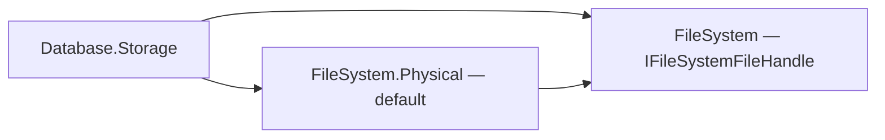

# Assimalign.Cohesion.Database.Storage — Design

The physical layer of the Data Platform kernel (area architecture:
[resources/Database/DESIGN.md](../../../../docs/resources/Database/DESIGN.md) §3.2). This document records the design
decisions that shape the storage model; the program-level requirements it satisfies are
R1 (ACID), R3 (shared kernel), and R6 (NativeAOT) in the area design.

## Design intent

One model-agnostic physical substrate: fixed-size pages, a pin-counted buffer pool, a
slotted-page record layout, and a write-ahead journal. Model engines bring *layouts*
(what bytes mean inside a page body) but never their own paging, caching, or logging.
The guardrails that keep this layer trustworthy are structural: every page load is
checksum-verified, every write-back is checksum-stamped, and durability flows through
the journal only — there are no side files.

## Type shape: one abstract base, sealed everything else (#1257, #1258)

The area is concrete-first (`.claude/rules/database-area.md`). The project declares no
interface: phase 1 of the concrete-types program
(`docs/programs/DATABASE_CONCRETE_TYPES_PLAN.md`) deleted `IStorage` and `IStorageJournal`,
and phase 2 replaced the remaining six with sealed types.

- **`Storage`** is the one abstract base, and a variant set: its five leaves (`SqlStorage`,
  `KeyValueStorage`, `GraphStorage`, `DocumentStorage`, `BlobStorage`) live in the model
  storage assemblies, so the constructor stays `protected` and the type carries the deviation
  marker. Its public members are non-virtual, and none is abstract: `Model` is fixed per
  storage, so the leaf passes it to the constructor and the getter reads a field (rule 6).
- **`StorageJournal` is one sealed type.** It had one leaf, `StreamJournal`, in this assembly,
  and no test or other assembly derived from it, so the audit phase 2 owed it (after #1236's
  journal format settled) found no second variant to justify a base. The leaf was folded in:
  the medium operations (frame writes, flushes, the read scan, truncation, the positional read
  of a spilled pre-image) are private members. Its deviation marker went with the base. It has
  **no public constructor** (rule 1, owner decision 27 of 2026-10-06): the former leaf's three
  constructors became `StorageJournal.Create` overloads over a `Stream`, a `StorageStream` or an
  `IFileSystemFileHandle`, each refusing a null medium and a stream it cannot read, write and
  seek, and the file factories keep their `StorageJournal.FromFile` name, which says what they
  open, as `StorageStream.FromFile` does. `Storage` builds its own journal through
  `Create(Journal, leaveOpen: true)`.
- **The sub-components a public `Storage` member returns are sealed public types** with
  internal constructors: `StoragePageManager` (`Storage.PageManager`), `StorageFreeSpaceMap`
  (`Storage.FreeSpaceMap`), `StorageUnitIterator` (`Storage.GetUnitIterator`) and the
  `StorageUnit` struct it yields unboxed, `StorageTransaction` (`Storage.BeginTransaction`) and
  `StoragePageHandle`. Indexing, the model catalogs and stores, Transactions and Sql call
  through them in other assemblies, so they cannot be internal, and every call on the per-page
  and per-record paths is now direct. The page manager is not disposable: the storage owns
  it, and its former `Dispose` did nothing.
- **The buffer pool is internal.** `Storage.BufferPool` returns the internal
  `StorageBufferPool`; only the storage and its own tests read it.
- **The unused `IStorageBackupManager` and `IStorageRecoveryManager` placeholders were
  deleted**: neither had an implementer or a caller. Backup and recovery are members of
  `Storage` itself (open-time recovery, checkpoints), not separate managers.

A test that used to intercept a non-virtual member by re-implementing `IStorage` or
decorating `IStorageJournal` now uses a hook on the type that makes the call (the
transaction coordinator's internal test hooks), never protected surface on `Storage`.

## The page model

- **8 KiB pages, 96-byte header.** The header layout (`Page.Header`) is an explicit
  struct persisted on disk, so field offsets are a wire contract: id (0), LSN (8),
  checksum (16), flags (20), type (21), slot count (22), free-data end (24), overflow
  size (28), reserved nonce/MAC space for encryption at rest (32–63), then the
  owner tag (64) driving per-owner record chains (72–95 reserved).
- **`PageType.Free` is zero — deliberately.** A zero-initialized page reads as free,
  and `FreePage` re-stamps freed pages with `Free`, which is what lets the free-space
  map be *reconstructed from page headers* on open instead of being persisted as a
  separate structure that could drift from reality. The trade-off: a page freed but not
  yet flushed at process exit reappears as allocated after reopen — a safe leak, never
  corruption. (A bitmap FSM page type is reserved for when file sizes make the open-time
  scan matter.)
- **Page LSN.** Every page carries the LSN of the journal record that last modified it
  (since storage format 3: its full page image or its last committed delta, a bracket's
  uncommitted changes carrying none). This is the hook for the write-ahead rule (a page may
  not be written to the data stream until the journal is durable up to its LSN), for rule F
  (a page at or below the last checkpoint's LSN is imaged on its next change), and for
  ordered recovery (a delta names the LSN it applies on top of, "Recovery replay rules").
- **Checksums on every read path.** CRC-32C over the full page with the checksum field
  zeroed (storage format 2, "Checksums" below). Stamped centrally in the buffer pool's
  write-back (the only path to the data stream), verified centrally in the buffer pool's
  load (the only path from it). A stored checksum of zero means "never stamped" and skips
  verification — accepted because the alternative (a validity bit elsewhere) buys nothing
  against the ~2⁻³² false-negative rate this already carries.

### Page 0: the identity block and two alternating header slots

`StorageFileHeader` sits in the **body** of page 0, after the standard 96-byte page header,
not at file offset 0. An earlier draft overlaid it on the page header, which made page 0
un-checksummable and un-typed. Storage format 2 (#1251) splits what page 0 holds by how
often it changes:

```
Page 0 (8 KiB)
┌──────────────┬──────────────────────┬──────────┬────────────┬──────────┬────────────┐
│ page header  │ StorageFileHeader    │ reserved │ header     │ reserved │ header     │
│ 0..96        │ 96..352 (identity)   │ ..512    │ slot 0     │ ..4608   │ slot 1     │
│              │                      │          │ 512..4096  │          │ 4608..8192 │
└──────────────┴──────────────────────┴──────────┴────────────┴──────────┴────────────┘
```

- **The identity block** (magic, format version, page size, model, storage id, creation
  time, name, and its own CRC-32C) is written when the file is created. Magic and format
  version stay at page offsets 96 and 100 in every format, which is what lets the format
  fence read them before anything is verified ("Storage format 2 and the format fence").
- **Two header slots** carry everything that changes: the generation counter, the LSN floor,
  the transaction sequence floor, page counts, the modification time and the checkpoint
  anchor, plus a copy of the identity block, each slot under its own CRC-32C. Each slot is
  3,584 bytes, seven 512-byte sectors that share no sector with the other slot or the
  identity block, and each lies inside one 4 KiB block.
- **A header write goes to the slot that does not hold the newest generation**, as
  generation + 1, rewriting only that slot's bytes (a positional write, not the page). It is
  made durable before it counts: only once the data flush after it returns does the storage
  treat the slot as the newest, so the next write goes to the other one. A crash at any
  point leaves at least one slot whole, and open picks the newest slot whose checksum
  verifies. A slot whose write tore fails its checksum — unless every sector that differed
  landed, in which case it is the complete new slot.
- **The sector assumption, and why each slot copies the identity block.** The torn-write
  model is old-or-new per 512-byte sector: that is what the slots' sector alignment rests on.
  The identity block shares slot 0's 4 KiB block, though, and a drive with 4 KiB physical
  sectors that emulates 512-byte ones (512e) turns a slot-0 write into a read-modify-write
  of that whole physical sector; power lost during it can leave the sector unreadable or
  garbage — page header, identity block, magic and format version included — while slot 1
  is intact. So each slot carries a copy of the identity block, the way each of Voron's
  header files is self-contained and restored from the other when it does not verify
  (`HeaderAccessor.cs:71-86`). When page 0's identity block fails its magic or its checksum,
  open takes the identity from the newest valid slot, and the next write to slot 0 rewrites
  page 0's whole leading 4 KiB block (page header, identity block, slot 0) in one write. The
  repair waits for a slot-0 write because writing the identity block beside a slot-1 write
  would put the newest slot, slot 0, at risk of the very loss the copy guards against. A
  page 0 with neither a verified identity block nor a valid slot is refused: as not a
  storage file when its magic is wrong, as corruption otherwise.
- **Page 0 never enters the buffer pool**, and its page-level checksum is zero ("never
  stamped"): a slot write changes only the slot, so a page checksum would be stale after
  every header write. The identity block and the slots carry their own checksums instead.
  The page manager enforces it: it reserves page 0 in the free-space map and refuses to pin,
  overwrite-pin or free it (`StorageIOException`), so a damaged page reference — a B-tree root
  id, a graph record — cannot reach the file header through `GetPage` or
  `Storage.OpenPageForWrite`, and recovery never replays a journal image onto page 0. A
  pooled copy would be stale after the next header write, and a write-back or replay of it
  would roll both slots back.
- **Tested by tearing.** The test crash simulation (`CrashSimulationStream` with a shared
  `CrashPoint`) loses power at a chosen write and keeps a durable prefix of k 512-byte
  sectors of it. `StorageFormatTests` tears a slot write after 0, 1, 3 and 6 of its seven
  sectors and opens from the previous generation each time (and from the new one when all
  seven landed); with both slots damaged the open fails as corruption. It also destroys
  page 0's leading 4 KiB block (zeros, then random bytes) and opens from slot 1, and checks
  that the identity block is rewritten with slot 0 and never with slot 1.
  `StorageHeaderPageAccessTests` covers each page-0 guard.

Page 0 used to be one page rewritten in place at every checkpoint and checksum-verified at
open, so a torn 8 KiB write (an 8 KiB page is sixteen 512-byte sectors, and power loss can
leave some written and others not) made the file set unopenable — and since #1226 page 0
carries checkpoint state the journal cannot replace. RavenDB's Voron alternates its header
files the same way: `Initialize` reads `headers.one` and `headers.two`, keeps the valid
ones and takes the higher `HeaderRevision`, and `Modify` writes `HeaderFileNames[_revision & 1]`
(`src/Voron/Impl/FileHeaders/HeaderAccessor.cs:44-99, 177-196`). PostgreSQL instead keeps its
single `pg_control` copy within one 512-byte sector so that one write is atomic
(`PG_CONTROL_MAX_SAFE_SIZE`, `src/include/catalog/pg_control.h:284-290`); the checkpoint
anchor is far larger than a sector, so Cohesion double-buffers.

## Storage format 2 and the format fence (#1251)

`StorageFileHeader.CurrentFormatVersion` is 2, and it covers every on-disk change of #1251
at once: CRC-32C page, slot and journal checksums, journal frame version 3, the identity
block and alternating header slots of page 0, the persisted LSN floor, and the
writers-only, chained checkpoint anchor. Nothing has shipped, so there is no upgrade path
and no compatibility shim (owner decision, #1152): a file set of another format is refused,
never misread.

- **The fence reads the raw bytes first.** Open reads magic (page offset 96) and format
  version (100) from the raw page-0 bytes before it verifies any checksum. With the magic in
  place, any version but the current one is refused with `StorageFormatException`, whose
  message leads with `COHDBS001`, names the version found and the version supported, and
  points at #1152 (export with the engine that wrote the file, or open it with the newer
  engine). Only then are the slots' and the identity block's checksums verified. A wrong
  magic is "not a storage file" (`StorageIOException`) unless a header slot verifies, in
  which case page 0's leading block was destroyed and the slot's copy of the identity block
  stands in for it (its own format version fenced the same way; "Page 0" above). The order
  matters because the checksum algorithm is itself part of the format: a format-1 file fails
  every CRC-32C, and checking that first would report a version mismatch as corruption.
  PostgreSQL's `ReadControlFile` does the same — "complaining about wrong version will
  probably be more enlightening than complaining about wrong CRC" — checking
  `pg_control_version` before the CRC (`src/backend/access/transam/xlog.c:4507-4544`).
  `StorageFileHeader.IsValid()` is exact (magic and exactly the current version) where it used
  to accept any positive version.
- **Engines name the database.** Every model engine catches the refusal around its storage
  open and rethrows it with the database's name, as it already does for an index-format
  refusal: "Database 'x' cannot be opened. COHDBS001: …". The SQL and key-value engines open
  two file sets per database and name the one refused ("its catalog file set 'x.catalog' was
  refused"); SQL carries it in its format exception, which its server forwards to the client.
- **Journal frames are fenced too.** A frame whose length, magic and CRC-32C verify but whose
  version byte is not 3 was written whole by another engine; the read refuses it with
  `StorageFormatException` (naming the frame's position) instead of stopping there as if it
  were a torn tail, which would silently drop it and every record after it, commit records
  included. A frame whose checksum fails is still a torn tail. Frames of format 1 (version 2,
  IEEE CRC) fail their CRC-32C, so they read as a torn tail; the data file's fence refuses
  such a file set before its journal is read, which makes the page-0 fence the one that
  covers the polynomial change, and the frame version the one for later bumps that keep it.

### Storage format 3 (#1253)

`StorageFileHeader.CurrentFormatVersion` is 3 since #1253, which changed what the journal's page
records mean: a full page image once per checkpoint interval and byte-range deltas at commit,
replayed in order ("Write ordering rules", "Page records", "Recovery replay rules"). The page and
page-0 layouts are format 2's. Journal frames are version 4. The bump goes through #1251's fence
unchanged: a format-2 data file names version 2 at page offset 100 and is refused with `COHDBS001`
before any checksum is verified and before its journal is read, so the open writes nothing and the
file set stays byte-identical for the engine that wrote it (`StorageFormatTests`, "a format-2 file
set is refused"). A format-2 journal frame (version 3) keeps the CRC-32C its format 3 successor
uses, so it verifies and is refused by the frame-version check rather than read as a torn tail.
Values 6 and 7 of `JournalRecordType` (format 2's before- and after-images) are retired; a format-3
reader never meets them, because the data file's fence refuses a format-2 file set first.

### Checksums

Pages, journal frames, the identity block and the header slots use CRC-32C (Castagnoli,
reflected polynomial `0x82F63B78`, initial value and final XOR `0xFFFFFFFF`) through
`System.Numerics.BitOperations.Crc32C`, eight bytes per step: the CRC32C instruction on x64
(SSE4.2) and ARM64 (the CRC32 extension), a software table elsewhere, all NativeAOT- and
trimming-safe with no package. Each word is read little-endian, so a checksum is the same on
every host. The byte-at-a-time IEEE table it replaced spent 27–30 µs on an 8 KiB page, most of
a page touch's CPU cost (#1236); PostgreSQL uses CRC-32C for its WAL records
(`xl_crc`, `src/include/access/xlogrecord.h:49`) and its control file
(`src/include/catalog/pg_control.h:281`), with SSE4.2 and ARMv8 paths
(`src/include/port/pg_crc32c.h:44, 117`). A page checksum folds the page's own four checksum
bytes as zeros (`Crc32C.AppendZeros`) rather than copying the page; `Crc32CTests` pins that
path to the CRC of the page with its field zeroed, the RFC 3720 B.4 vectors and the
`123456789` check value, and every length from 0 to 9,000 bytes at all 8 alignments against
a bitwise reference (run incrementally, one byte at a time, so every prefix costs one pass).

## File handles, positional I/O, and durability

Storage file opening accepts an `IFileSystem`; omitting it selects the physical
file system. Data, backup, and journal files are opened with `OpenHandle`, which
returns the explicit `IFileSystemFileHandle` contract. The buffer pool and recovery
pass page offsets to its positional reads and writes through `StorageStream`.
Their I/O does not depend on a shared stream cursor; the pool's existing locking,
page layout, and write-ahead ordering remain unchanged.

Durability follows the handle through composition: the storage journal retains
the `StorageStream` durability contract and forwards a durable request to
`IFileSystemFileHandle.Flush(durable: true)`. Capability comes from
`SupportsDurableFlush`, never a runtime stream type. This fixes **#1018**: wrapping
a physical handle cannot silently turn the journal's durable flush into an
ordinary buffered flush. The physical handle implements that request with
`RandomAccess.FlushToDisk`.

The dependency direction keeps the physical implementation as the default behind
the file-system contract:



**Durability follows the storage.** `Storage.SupportsDurableFlush` requires both
data and journal handles to support durable flushing: checkpointing cannot safely
discard a durable journal before its data pages are durable. Backups are separate
from the commit/checkpoint path. `ConfigureCommitDurability` derives an unset choice
as `Synchronous` for capable storage and `None` otherwise. An explicit `Synchronous`
or `Grouped` choice on unsupported storage fails at engine open, naming the storage
and the setting. Model factories resolve the default before initialization and
recovery; engines validate their explicit options before serving the database.

Low-level durable journal operations still throw `NotSupportedException` on
unsupported handles, rather than silently downgrading the request. Reading existing
journal bytes does not advance `DurableLsn`: only a completed explicit durable flush
does. Reopening live memory or an operating-system cache is not durability evidence.

Constructors accepting an ordinary `Stream` explicitly provide **no durability**,
even if that stream happens to wrap a physical file. Such callers must use the
handle overload to carry the contract. `StorageStream.FromInMemory()` is likewise
non-durable. Tests of recovery ordering use explicit simulated durable handles;
that fixture contract models persistence across their simulated crash rather
than claiming that production memory is durable.

The regression gate observes the durable flag on a recording handle around the
real physical handle used by the composed storage journal. A reopen or simulated
crash assertion alone cannot prove this request: operating-system buffering can
preserve bytes even when no durable flush was issued.

## The buffer pool

Pin-counting with RAII handles (`StoragePageHandle`): a page cannot be evicted while
pinned, dirty pages are written back (checksum-stamped) before eviction, and handles
release their pin on dispose. Contrast with a `Memory<byte>`-pooling design: pages are
*pinned* buffers exposing raw pointers because the slotted-page and header structs
are `unsafe` overlays — the pool guarantees pointer stability for the handle's lifetime.

- **Buffers live on the pinned object heap** (`GC.AllocateArray(..., pinned: true)`),
  not behind `GCHandle`s. A pinned-heap array never moves and stays valid while anything
  references it — the entry, and through it every handle — so no code path can release
  a pin out from under a live pointer. Disposing the pool drops its bookkeeping and
  nothing else; a handle that outlives its pool still points at live memory. (With
  `GCHandle`s, disposing the storage while an iterator held a page freed the pin, after
  which the GC was free to move the buffer under the iterator's pointer.)
- **A handle releases the pin it took.** Disposing a handle unpins its own entry, not
  whatever is resident under the page id, and disposal is idempotent across threads.
- **Content changes only under a pin.** Readers and writers take pins; the pool takes
  no part in content access. The write-back rules below rest on that.

- **Eviction is least-recently-used** over unpinned entries: pins and cache hits move a
  page to the MRU end; capacity overflow evicts from the LRU end, skipping pinned
  pages, and fails loudly (`StorageIOException`) when every resident page is pinned —
  the pool never silently exceeds its memory budget. LRU (not clock/2Q) because the
  pool is fully lock-serialized anyway, so the precise policy costs nothing extra and
  is trivially testable.
- **Buffers are reused**: evicted entries return their pinned 8 KiB buffers to a
  recycle stack, so steady-state page churn performs zero allocations — fresh pages
  are zeroed on reuse so recycled buffers never leak prior content.
- **Failed loads never poison the cache**: a page that fails checksum verification is
  not cached; its buffer goes straight back to the recycle stack and the exception
  propagates. The same holds for a page whose header claims an overflow area that does
  not fit the 8 KiB buffer (`StorageCorruptionException`): `Page.AsSpan()` and
  `AsBodySpan()` size their spans from that header, nothing writes overflow pages yet,
  and an unstamped page (checksum zero) is never verified, so the header alone would
  otherwise hand the B-tree a writable span past the buffer.
- **Extension runs under the pool lock.** Allocating a page past the end of the data
  stream grows the stream through `EnsureLength`, under the same lock every page read
  and write-back holds, and only ever grows it. An in-memory stream copies its array
  into a new one when it grows; a write-back that landed in the old array after its
  region was copied was lost while the pool recorded the page clean, so a later eviction
  dropped the change and the reload was stale or all zeros (#1157 review). The
  `StorageStream` adapter over a plain `Stream` also routes `Length` and `SetLength`
  through the gate that serializes its page reads and writes, so the stream is safe on
  its own, not only under the pool.
- **One lock.** All pool state is guarded by a single monitor. Page *content* access is
  the caller's concern (a handle hands out a raw pointer); the transaction layer above
  provides content-level isolation. Sharding the lock is a measured-need optimization,
  not a default.
- **Write-back writes a private copy.** A pinned writer can change a page while the pool
  writes it back — `FlushAll` and `FlushPage` write pinned pages, and until #1157 the
  paced page writer did too. Write-back therefore copies the page first, stamps the
  checksum on the copy, and writes the copy: the bytes on the stream always verify. The
  write-ahead
  LSN is read from the copy as well. Since storage format 3 a bracket's changes are journaled
  only at commit, so the copy's LSN does not cover an uncommitted change in it; it covers the
  page's full image since the checkpoint (invariant P, "Recovery replay rules"), which is what
  recovery rebuilds the page from, overwriting the uncommitted bytes.
- **Dirty state is a version, not a flag.** `MarkDirty` advances the entry's
  modification version; a write-back records the entry clean only up to the version it
  observed before copying. A change made during the write keeps the page dirty. With a
  boolean, a writer's `MarkDirty` could land between the write and the write-back's
  "clean", the page was later evicted without being written, and the reload either lost
  the change or failed its checksum — the storage concurrency suite reproduces exactly
  that against the old pool.
- **Paced write-back skips pinned pages.** An unpinned page is quiescent, so the page
  writer only ever writes complete images; a pinned dirty page waits for a later pass,
  an eviction, or the checkpoint (which runs with no transaction active).
- **Invariants.** The structural check (`CheckInvariants`) verifies, under the lock,
  that every resident entry has a non-negative pin count, is not on the recycle stack,
  and owns exactly one node of the LRU list keyed by its page; that the LRU list holds
  nothing else; and that recycled entries are unpinned and detached. It is compiled
  into every configuration. Debug builds also run it wherever the pool's structure
  changes — a pin miss (which may evict and recycle), an explicit eviction, a flush —
  and, on a pin hit, a `TryGet` hit or an unpin, which change one entry's pin count and
  LRU position, check just that frame: resident under its page, owning its node of the
  access list, not recycled, with a non-negative pin count (#1240). They add
  per-operation checks too: a handle never releases a pin on an entry that is no longer
  resident, a page is never unpinned more often than it was pinned, and a handle's page
  is never read after the handle was disposed. Release builds skip the per-operation
  checks and ignore an over-release. CI runs the suites in Release, so the explicit
  check, the injected-violation tests and the per-phase checks of the concurrency suites
  run there too; the per-operation checks run in local Debug runs. The walk used to run
  after every pool operation: it is O(resident pages), and 99.7% of its calls in the
  Debug 100,000-row cascade test came from hits and unpins, about 80% of that test's time
  (63–70 s against 13 s, "Measurements").
- **Allocation does not read the page it allocates.** `AllocatePage` clears every byte
  of the page it hands out, so it pins through `PinForOverwrite`, which takes a resident
  entry as it is and gives a non-resident page a zeroed buffer instead of reading and
  verifying the free page's old bytes. Besides the wasted read, verification refused the
  allocation of a free page whose last write a crash tore — recovery repairs torn pages
  from journal images, and an unjournaled checkpoint anchor page has none. The clear zeroes
  the page LSN too, which storage format 3 relies on (invariant A, "Write ordering rules").

### Capacity (#1254)

The pool holds `Storage.DefaultBufferPoolCapacity` pages, 4,096 (32 MiB), unless the
constructor is given another count; every engine exposes the size as a `BufferPoolCapacity`
option in bytes, 32 MiB by default, validated by `Storage.GetBufferPoolPageCount` (a whole
number of 8 KiB pages, at least `MinimumBufferPoolBytes`, 1 MiB) and applied through the
settable `Storage.BufferPoolCapacity` right after the storage is created or opened. Until #1254
every engine ran with a hard-coded 128 pages (1 MiB), which cannot keep a 4 MiB index resident:
the #1236 random-reference benchmark stole and reloaded a page on almost every touch and ran at a
third of the 4,096-page rate ("Measurements").

- **Why 32 MiB.** PostgreSQL's default `shared_buffers` is 128 MB, 16,384 8 KiB buffers
  (`NBuffers = 16384`, `src/backend/utils/init/globals.c:144`), shared by every database of a
  cluster. A Cohesion pool belongs to one database, and a host commonly opens several, so the
  default is a quarter of that: enough to keep the #1236 working set (a 4 MiB index plus the
  table) resident with room for the catalog, small enough that ten open databases cost about
  what one PostgreSQL cluster does.
- **What it costs.** Page buffers are allocated on first load and recycled, never preallocated,
  so a database pays for the pages it has touched, up to the capacity. At capacity the pool
  holds 32 MiB of pinned-heap buffers plus about 160 bytes of bookkeeping per resident page
  (entry, dictionary slot, LRU node: 0.6 MiB at 4,096 pages). The SQL and key-value engines open
  a second, catalog file set per database whose pool stays at 128 pages (1 MiB): the catalog is
  small and hot. So an open database costs up to about 33 MiB (34 MiB for SQL and key-value) of
  pool memory, plus each file set's journal append buffer, 64 KiB to 1 MiB (#1252, "The append
  buffer"); an in-memory database also holds its data and its journal in memory. The journal
  is bounded by the checkpoint size ("Checkpoint triggers"), but its buffer is a `MemoryStream`'s,
  which doubles as it grows: when the journal passes 256 MiB the buffer becomes 512 MiB until the
  checkpoint truncates it. Truncating an in-memory stream to zero releases its buffer
  (`StreamFileHandle.SetLength`); before the #1254 review a `MemoryStream` kept it, so an
  in-memory database held up to twice the checkpoint size for its lifetime once its journal first
  reached it.
- **Resizing.** Growing takes effect at once. Shrinking evicts least-recently-used unpinned
  pages, writing dirty ones back through the write-ahead gate, until the resident set fits; if
  more pages than the new capacity are pinned, the resize throws `StorageIOException` and the
  pool keeps its capacity.

## The record layer

`SlottedPage` implements the classic slotted layout: records grow forward from the
header, the slot directory grows backward from the page end, deletion marks a slot
(length 0) and `Compact` defragments. All four models share this because their unit of
storage — row, document, KV entry, node/edge record — is "a variable-length byte
sequence addressed by (page, slot)". Records above `SlottedPage.MaxRecordSize` are
rejected at the API boundary; multi-page records ride overflow pages (a later feature —
the flags and page type are reserved).

**No offset taken from a page is trusted.** The page is native memory, so an offset
past its end is a write into whatever the runtime placed next to the buffer — that is
how #1157 killed the process (below). Every `SlottedPage` operation checks the geometry
it is about to use and fails with `StorageCorruptionException` (carrying the page id)
instead of dereferencing it:

- **Writes** (`InsertSlot`, `UpdateSlot`, `Compact`) run on a page their transaction
  owns, so they hold the page to its full invariant: the slot directory fits the body,
  the free-data end lies between the body start and the slot directory, and the slot
  being changed addresses bytes inside the record area.
- **Reads** (`ReadSlot`, `GetSlotLength`) can run beside the page's single writer — a
  scan takes a pin, not a latch — so they enforce only what holds in every state a
  well-formed page passes through: the slot index lies inside a directory a page can
  hold, and the record lies inside the page body. That is what keeps a read inside the
  buffer. A read racing a change can still see a torn record — stale bytes, or a
  corruption error if it catches a rollback's page restore half-way, where it used to
  read past the buffer — which is the content-isolation question page latches would
  answer; the layers above own it today.
- **Relocation needs the whole record.** An update that outgrows its slot appends the
  record at the free-data end and leaves the old bytes as dead space, so it requires
  the record's full length in free space and leaves the page untouched when it does
  not fit (the caller relocates to another page — the catalogs' delete-and-insert).
- **`Compact` moves records in offset order.** A relocated record can sit above a
  record with a higher slot index; compacting in slot order overwrote it. Overlapping
  records are corruption and fail before any byte moves. Nothing calls `Compact` yet:
  dead space from relocations is not reclaimed in place (see the #1157 follow-up below).
- **Clears span the buffer, not the header.** Freeing and allocating a page clear a
  fixed `Page.Size` (or body) span; `Page.AsSpan()` honors the reserved overflow size in
  the header, and a header is page content that a corrupt page controls. The pool refuses
  to load a page whose overflow header does not fit its buffer (above), so a span taken
  from a pooled page stays inside it.

### Per-owner record chains

Data pages carry an 8-byte **owner tag** in the page header (offset 64, taken from
the reserved area; zero = the shared, untagged space, which is also what pre-tag
files read — no format flag needed). The tag is model-agnostic: storage never
interprets it beyond grouping. `InsertRecord(transaction, ownerId, data)` lands the
record on the owner's current write page (allocating and tagging a new page when
needed), `GetUnitIterator(ownerId)` iterates only the owner's pages, and
`GetOwnerPages(ownerId)` exposes the chain. This is what turns a model's
"scan one object" from O(storage) into O(object) — the SQL engine passes table
object ids, so a table scan stops decoding the whole database.

- **An owner is a long-lived object, never a transaction.** Each owner has one current
  write page, and the free-space map holds only whole free pages, so a record shares a page
  only with earlier records of its own owner. An owner per transaction therefore gives every
  transaction a page of its own. The document and blob engines tagged content chunks
  `writer | 1 << 63` until a 180-byte document took a whole 8 KiB page (1.009 pages per
  auto-commit put) and a six-second pace test grew an in-memory data file past 2 GiB on a fast
  runner; they now share one content owner. PostgreSQL keeps its insert target per relation
  and tries the last page before extending, "to avoid one-tuple-per-page syndrome"
  (`src/backend/access/heap/hio.c:571-596`, `RelationGetBufferForTuple`), and RavenDB puts
  small values in the table's shared active section (`src/Voron/Data/Tables/Table.cs:725-747`,
  `Insert`). Owners are tables, key spaces, graph stores and content spaces. Visibility is per
  record, so logical transactions share a page freely as long as their physical brackets do not
  overlap on it: a bracket that touches a page another open bracket holds fails with a
  write-lock error, and the coordinator's apply gate runs a database's brackets one at a time.
  A record that does not fit the current write page moves the owner to a fresh page, and
  the page it leaves is not revisited: reusing partly free pages needs a free-space map that
  records free bytes per page, as PostgreSQL's does (`GetPageWithFreeSpace`,
  `src/backend/storage/freespace/freespace.c`).
- **The directory is in-memory only, page headers are the truth.** The per-owner
  page directory is rebuilt on open by the same header scan that rebuilds the
  free-space map (no extra I/O) and maintained at allocation/free time. A persisted
  directory could drift from reality; headers cannot (the FSM precedent).
- **Owner tags are WAL-covered like all page bytes.** A fresh chain page is tagged
  *before* its first-touch pre-image (and full page image) is captured, so a rolled-back allocation
  restores an empty page still belonging to the chain — a safe leak the owner's
  next insert reuses.
- **Chain release (`FreeOwnerPages`) is transactional with commit-deferred
  reuse.** Each page is retyped `Free` under the transaction (a rollback restores the chain
  bytes from the pre-image, and recovery redoes the release only once it committed), but the pages
  re-enter the free-space map and leave the directory only when the transaction
  **commits**. Freeing eagerly would let the allocator hand a page to a new owner
  while the release could still roll back — the rollback's pre-image would then
  resurrect old content over live data. Deferral makes that impossible.
- **A page on the free list is never write-locked.** Commit releases the bracket's
  page write locks and then returns its freed pages to the free-space map, in one hold
  of the transaction lock that every page lock is taken under. Another transaction may
  allocate a freed page the instant it is on the list; its first touch waits for that
  lock and finds the page unlocked. The frees used to run first, under the owner lock
  only, and an allocation that took a page between them failed with "Page N is
  write-locked by transaction T" (the concurrency suite on CI runners). A page
  one transaction releases twice (its last record deleted, then its chain released) is
  freed once: a second free could return it to the list after another allocation took
  it, and hand it to a second owner. PostgreSQL guards the same edge from the
  allocating side, using a page the FSM reports only if its buffer lock is free
  (`_bt_allocbuf`, `src/backend/access/nbtree/nbtpage.c`).
- **Why release is O(pages), not O(1).** Page logging prices a transactional free at one
  page touch per page: the page's full image when it is its first change since the checkpoint,
  then a committed image of little more than its header (storage format 3; two 8 KiB images per
  page before it). A directory-level O(1) release needs a persisted allocation structure
  (the reserved bitmap-FSM page type) so freeing can be a metadata write; until
  that lands, chains keep releases proportional to the object, which is already
  incomparably better than the previous permanent leak.

## The journal (write-ahead log)

`StorageJournal` is the durability mechanism — the *only* one. Frames are length-prefixed,
magic-tagged, versioned (frame version 3) and CRC-32C-protected; a torn or corrupted tail
terminates the read scan and is ignored — it belongs to work that was never acknowledged —
and the first write after a reopen cuts it off ("Failed appends" below), while a verified
frame of another version is a format error ("Storage format 2 and the format fence"). LSNs never restart: a reopened journal resumes above both its last record
and the LSN floor of the newest header generation ("Checkpoints"). Records are typed and
binary (begin / commit / rollback / checkpoint / full page image / page delta / committed
page image / opaque logical operation, "Page records" below); transaction identity at this
level is a compact monotonic `long` sequence — GUID identity belongs to the transaction layer
above. Appends go to a user-space buffer and reach the file when it drains ("The append
buffer" below).

### The append buffer (#1252)

Until #1252 every append was a positional write of its own frame into a freshly allocated
array: a one-row statement paid a system call for its begin record, each before image, each
after image and its commit record, about 5 µs for a 38-byte record and 14 µs for an 8 KiB image on
the overlapped handle ("Measurements (#1252)"), and that cost would dominate once #1253 makes
the records small. The journal now works like PostgreSQL's WAL buffers: `XLogInsertRecord`
copies a record into shared buffers (`CopyXLogRecordToWAL`, `src/backend/access/transam/xlog.c:1323`),
`AdvanceXLInsertBuffer` writes the oldest buffer out when an insert needs its space
(`xlog.c:2083-2157`), and `XLogWrite`/`XLogFlush` write the buffers in as few `pg_pwrite` calls
as their layout allows and then fsync (`xlog.c:2382`, `2480-2532`, `2861`), keeping the written
and flushed positions apart (`XLogwrtResult`, `xlog.c:332-336`). Neo4j buffers its transaction
log the same way (`PhysicalFlushableChannel`, `community/io/src/main/java/org/neo4j/io/fs/PhysicalFlushableChannel.java:76-95`,
`218-224`; `TransactionLogFile.force` drains under the lock and forces outside it,
`community/kernel/src/main/java/org/neo4j/wal/files/TransactionLogFile.java:1194-1214`), and
Voron writes each transaction's pages to its journal in one call (`WriteAheadJournal.WriteToJournal`,
`src/Voron/Impl/Journal/WriteAheadJournal.cs:1700-1760`, `JournalWriter.Write`,
`src/Voron/Impl/Journal/JournalWriter.cs:51-57`). Citations are to PostgreSQL `85f55534e80`,
Neo4j `54a7dcf7c25` and RavenDB `83399cb8bc8`.

- **Frames are built in place.** An append reserves its frame at the end of the buffer under the
  append lock, writes the prefix, the body header and the payload there, computes the CRC-32C
  over the body in place, assigns the LSN, and issues no system call. Nothing is allocated per
  frame: a test appends 200 frames after warm-up and allocates under 1 KiB in all (each append
  used to allocate its frame, 8 KiB for a page image). A checkpoint record's active list is
  encoded straight into its frame too. Since #1253 a page record's payload (a full page image,
  a page delta) is encoded into a pooled scratch buffer and copied into its frame; the
  transaction's pre-image of each page it touches is the one allocation left on the write path,
  kept as its encoded runs because rollback and the commit's delta both need it ("The memory
  bound of pre-images").
- **Three positions.** `LastLsn` is the last LSN assigned, `WrittenLsn` the last one that left
  the buffer (the file holds it, or a checkpoint truncated it), and `DurableLsn` the last one a
  durable flush confirmed — PostgreSQL's insert, write and flush positions.
- **Size.** The buffer starts at 64 KiB, allocated by the first append (PostgreSQL's smallest
  `wal_buffers`, eight 8 KiB pages, `XLOGChooseNumBuffers`, `xlog.c:5244-5255`), which holds a
  statement's page images; when the records between two drains do not fit, it doubles up to
  1 MiB, the 1/32 of the default 32 MiB pool that PostgreSQL gives its WAL buffers
  (`NBuffers / 32`, `xlog.c:5248`; Neo4j's `db.tx_log.buffer.size` is 512 KiB to 4 MiB,
  `community/configuration/src/main/java/org/neo4j/configuration/GraphDatabaseSettings.java:679-684`).
  It never shrinks: at most 1 MiB per open journal, two for the SQL and key-value engines' data
  and catalog file sets. A full buffer is written out in
  one call before the next frame is encoded. A frame larger than 1 MiB (an operation record of
  that size; no page image is) is written directly after the buffered frames, from a pooled array.
- **The drain rule.** The buffer drains to the operating system before:
  - **every commit is acknowledged, in every durability mode.** `Synchronous` and `Grouped` drain
    in the durable flush they already made (`EnsureDurable`); `None`, which used to return at once,
    now drains through the commit record (`StorageJournal.EnsureWritten`, internal, through
    `Storage.EnsureCommitDurable`), without a durable flush. So a process crash loses no
    acknowledged commit that survived it when every append was a write; a power loss under `None`
    may lose it, as before. PostgreSQL's `synchronous_commit = off` acknowledges a commit while its
    record is still in the WAL buffers (`RecordTransactionCommit`, `src/backend/access/transam/xact.c:1553-1565`);
    this journal does not. A storage bracket committed with `awaitDurability: false` (a statement
    bracket, an undo batch) is not acknowledged and stays buffered until the outer commit drains it,
    which is exactly the window in which it was always unproven.
  - **every reader.** `ReadAll` and `ReadSequential` drain under the lock they read under, so
    `StorageRecovery`, `TransactionRecovery.Analyze` and every test reading the journal see every
    appended record. An offline journal is read as the file holds it.
  - **the write-ahead gate** lets a page reach the data file: `EnsureDurable(pageLsn)` when the
    storage flushes durably, `EnsureWritten(pageLsn)` under `None`, so the full page image a
    stolen page is rebuilt from is never still in the process when the page is on the file.
  - **a checkpoint truncates**: the buffer is written before the truncation, so nothing appended is
    discarded unwritten and a drain failure stops the checkpoint before it truncates anything; the
    checkpoint record itself is then drained with the checkpoint's flush.
  - **`Flush` and disposal.** A clean close drains; an offline one writes nothing. Disposal marks
    the journal disposed under the append lock, and every append, flush, read and checkpoint
    checks that flag again under the same lock, so a call that raced the close cannot buffer a
    record after the final drain and return an LSN that is never written (#1252 review).
- **`LastLsn` consumers** read an assignment counter, not a file position, and none of them reads
  the file on its strength: the header write's LSN floor is `LastLsn`, and the header write drains
  and flushes through it before it writes the slot; `IsCheckpointDue` and the close's "nothing
  written since open" test compare counters. Code that reads the file reads it through the
  journal's readers, which drain.
- **A failed drain takes the storage offline (#1243's rule).** A drain carries records that pages
  in the buffer pool already describe, full page images included, so it can neither be dropped nor
  retried safely; the failing call throws `StorageOfflineException`, nothing more is written, and
  the reopen's recovery reads what the file holds, as after a failed fsync. PostgreSQL raises
  `PANIC` on any failed WAL write (`xlog.c:2514-2532`). An append can therefore fail with
  `StorageOfflineException` when it has to drain a full buffer.
- **Concurrency is unchanged.** Appends, drains and flushes are serialized by the journal's lock,
  which a durable flush still holds across its fsync. Releasing it during the fsync, as Neo4j's
  `force` does, would let appenders fill the buffer meanwhile; that is a separate change.

**The handle keeps `FileOptions.Asynchronous | FileOptions.RandomAccess`.** The physical file
system opens every handle overlapped with the random-access hint (`PhysicalFileSystemFile.OpenHandle`),
and a synchronous `RandomAccess.Write` on an overlapped Windows handle waits on an event: measured
here at +4–6 µs for a 64-byte or 8 KiB extending write (7.4–9.3 µs against 2.3–4.4 µs for 64 bytes,
13.5–14.1 against 7.2–8.2 µs for 8 KiB), and within the noise from 64 KiB up and under any fsync
(~300 µs on this machine). The buffer turns that per-record cost into a per-drain one: one write
per acknowledged statement instead of four or more. The end-to-end A/B below ("Measurements
(#1252)") puts what is left at up to 5 µs per `None`-mode commit (a one-page bracket at 26–28 µs
against 22–27 µs on a synchronous handle) and at nothing measurable under an fsync. Dropping the
flag would need a per-handle option on the shared `IFileSystemFile.OpenHandle` contract and would
apply equally to the data file, whose 8 KiB page reads and writes pay the same overhead, so it is
recorded as a follow-up for the FileSystem library rather than a journal-only special case.
`RandomAccess` disables read-ahead, which only the open-time recovery scan of the journal would use.

### Write ordering rules (steal / no-force, an image per checkpoint, deltas at commit)

Until storage format 3 every page a transaction touched journaled two full 8 KiB images: a
before-image at its first touch and an after-image at commit. A one-row SQL `INSERT` (its heap
page and one index leaf, in a statement bracket) wrote 33,072 bytes. Format 3 (#1253) journals
a page's full image once per checkpoint interval and, at commit, only the bytes that changed.
Every rule below is stated for a storage transaction (a *bracket*):

1. **Rule F: a full page image on the first change since the checkpoint.** A bracket's first
   touch of a page whose LSN is at or below the *redo point* — the LSN of the checkpoint the
   journal starts at ("Checkpoints") — appends a `FullPageImage` of the page as it stands, then
   stamps the pooled page with that record's LSN (and marks it dirty, so the stamp is never lost
   to a clean eviction). A page above the redo point already has its image in the journal
   (invariant P, "Recovery replay rules"); its first touch journals nothing and leaves its LSN
   alone. PostgreSQL makes the same decision per registered buffer: `needs_backup = (page_lsn <=
   RedoRecPtr)` (`XLogRecordAssemble`, `src/backend/access/transam/xloginsert.c:684-699`). Its
   image is taken after the change and carries it; here the image is the page *before* the
   bracket's change, so it is committed content whatever becomes of the bracket.
2. **Every first touch keeps a pre-image in memory.** The page as the bracket found it, encoded
   as its non-zero byte runs, with the LSN of the page's last record (its *base LSN*). Rollback
   restores it, and commit diffs against it ("The memory bound of pre-images" bounds them).
3. **The write-ahead gate.** The buffer pool may steal (evict) a dirty page at any time, but
   its write-back first forces the journal durable up to the page's LSN, which is at or above
   the LSN of the page's full image since the checkpoint (invariant P) — so any uncommitted
   content that reaches the data file has a durable image to be rebuilt from. The force drains
   the append buffer through that LSN first (#1252); under `CommitDurability.None` the gate
   drains without a durable flush (`EnsureWritten`). A warm first touch stamps no new LSN, so a
   page stolen in the middle of a bracket usually finds its LSN durable already and costs no
   fsync. A page written outside the journal (a checkpoint anchor page) carries the journal's
   last LSN at the time its page was allocated, so the gate holds for it too ("Checkpoints").
4. **Commit = deltas + commit record + drain + fsync.** For every page the bracket touched,
   commit encodes the byte runs in which the page differs from its pre-image and appends a
   `PageDelta` naming the base LSN, then stamps the page with the delta's LSN. A page whose
   delta passes half a page (a rewritten Blob page, a page a delete cleared) journals a
   `CommittedPageImage` instead when that is hardly longer; a page touched and left unchanged
   journals nothing. Then the commit record, acknowledged only after `EnsureDurable(commitLsn)`,
   which drains the append buffer and flushes durably; under `CommitDurability.None` the commit
   is acknowledged once the drain wrote the record (#1252). Data pages are *not* forced —
   recovery redoes them (no-force).
5. **Rollback restores in memory.** Each pre-image is decoded back into its pooled page, with
   its base LSN, so rollback is complete without I/O (a spilled pre-image is read back from its
   full page image, "The memory bound of pre-images"); a rollback record marks the outcome. A
   page whose image the rolled-back bracket journaled keeps that image's LSN: the image is
   committed content, so the next bracket chains its delta onto it instead of imaging again.
6. **Invariant A: allocation zeroes the page LSN.** `AllocatePage` clears every byte of the page
   it hands out, the LSN included, before the caller initializes it (type, owner tag, slotted or
   B-tree header) and touches it. Zero is at or below the redo point, so the allocating bracket's
   touch images the page, initialization included. Without it, a page freed and reallocated in one
   checkpoint interval would keep the LSN of its free, its next delta would chain onto the freed
   page, and the initialization made before the touch would be in no record — recovery would
   rebuild a page that never existed (`StorageRedoTests`, "freed and reallocated").
7. **Page-level single-writer.** A page touched by an active transaction is
   write-locked to it (conflicts throw rather than wait). Record-level concurrency is
   `Database.Transactions`' job above this layer; a delta computed against a private pre-image
   is only correct because two transactions can never interleave on one page. This division is
   permanent in the MVCC integration design (area DESIGN.md §3.8): storage
   transactions remain the **physical WAL bracket** — the MVCC manager layers
   row-grain snapshots/locks *above* them (paired per statement through
   the index manager's `TransactionSource` resolver), and page locks stop being the user-visible
   conflict surface without ever weakening the invariant that makes page logging correct.
8. **Nothing changes a pooled page outside a bracket's touch.** A change made outside one is in
   no delta and would be lost, or corrupt the page, at the next recovery; on a page not imaged
   since the checkpoint, the next image would even make it committed content. The storage's own
   exceptions are page 0 (never in the pool), allocation's clear (the allocating bracket images
   the page at its touch, invariant A), the checkpoint anchor pages (written only by header
   writes, never replayed onto, "Checkpoints"), and the page manager's raw `AllocatePage` and
   `FreePage` (no production caller; a raw free is lost to a crash before the next checkpoint).
   The debug consistency check audits the rule on every page, whether or not it was imaged
   since the checkpoint ("The debug consistency check").

### Page records (storage format 3, #1253)

| Record | Payload | Recovery applies it |
|---|---|---|
| `FullPageImage` (8) | the page's non-zero byte runs | always, whatever became of its bracket |
| `PageDelta` (9) | base LSN, then the runs that differ from the pre-image | only with its bracket's commit record, on a page rebuilt at exactly the base LSN |
| `CommittedPageImage` (10) | base LSN, then the page's non-zero byte runs | the same as a delta |

Values 6 and 7 (format 2's before- and after-images) are retired and never reused. A run is
`[u16 offset][u16 length][bytes]`; runs ascend, never overlap, and never cover the page LSN and
checksum (bytes 8-19), which recovery and the write-back stamp themselves. The codec
(`PageImageCodec`) skips equal stretches with a vectorized compare, then grows a run block by
32-byte block until an aligned block compares equal and trims its trailing equal bytes, so a
B-tree insert's directory shift, whose adjacent two-byte offsets often share a high byte, stays
one run; RavenDB's Voron diffs in the same 32-byte blocks (`DiffPages.ComputeDiff`,
`src/Sparrow.Server/Utils/DiffPages.cs:23-105`) and encodes a new page against zeros
(`ComputeNew`, `:107-178`).

- **Two kinds of full image, never confused.** A `FullPageImage` is a *pre-image*: the page
  before the bracket changed it, committed content, safe to restore unconditionally. A
  `CommittedPageImage` is a *post-image*: the page after a committed bracket's changes, and
  applied unconditionally it would redo a bracket whose commit record a crash lost (the commit
  record is appended after every page record). It is therefore a record kind of its own, gated
  like a delta (`StorageRedoTests`, "a committed full image whose commit record was lost").
  It replaces a delta that passes half a page (`CommittedImageThreshold`) unless it is longer by
  more than 64 bytes (`CommittedImageSlack`, the header fields an image carries and a rewrite's
  delta does not); a page a delete cleared then journals a few dozen bytes instead of the 7 KiB
  its delta would carry.
- **Hole elision without a layout contract.** An image is encoded against an all-zero page, so
  every all-zero block is dropped: the free gap of a slotted page (between its records and its
  slot directory) and of a B-tree node (between its entry directory and its entry data). The gap
  starts zero and mostly stays so: allocation clears the page; the storage clears a slotted
  page's body before it reinitializes one (`SlottedPage.Initialize` itself only resets the
  header); `BTreeNode.Initialize` clears the node's body, and a split or a compaction rebuilds the
  node through it; a B-tree entry removal clears the directory slot it vacates (#1253 review). A
  slotted page's `Compact` leaves the old bytes between its new and its previous free-data end
  in the gap until the page is reinitialized. So storage needs no `pd_lower`/`pd_upper`
  contract. PostgreSQL elides the gap between `pd_lower` and `pd_upper`
  of a standard page (`src/backend/access/transam/xloginsert.c:731-756`) and zero-fills it on
  restore (`RestoreBlockImage`, `src/backend/access/transam/xlogreader.c:2213-2224`); a gap that is
  not zero costs bytes here, never correctness. A slotted page holding 3,000 bytes of records
  encodes in under 3,300 (`PageImageCodecTests`), a freshly initialized page as its few header
  fields, and the #1236 benchmark's B-tree leaves, 76% full, average 6,131 bytes of 8,192.
- **No compression (decision).** PostgreSQL's `wal_compression` compresses full-page images only,
  with pglz, LZ4 or zstd, and defaults to `off` (`doc/src/sgml/config.sgml:3668-3699`). The BCL
  offers only Deflate and Brotli. Measured on the #1236 leaves after hole elision (Release, 549
  leaves, three runs per build): Deflate at `CompressionLevel.Fastest` makes a 6,131-byte image
  1,732 bytes (72% smaller) in 100–144 µs, Brotli at quality 1 makes it 1,319 bytes (78% smaller)
  in 26–59 µs. A first touch that journals an image costs 2.3–3.4 µs in steady state (encoding,
  pre-image, append) and its commit 1.3–2.2 µs (the touch rows of "Measurements (#1253)", as
  re-measured in the review), so Brotli would cost 8 to 25 times the cold first touch, 5 to 16
  times the touch and its commit together. The bytes it saves matter only where images dominate the
  journal: under a warm workload deltas do (154 bytes per insert in the #1236 benchmark, 662 per
  SQL statement), and in the cold workload with a checkpoint every 5,000 inserts images are nearly
  all of its 2,888 bytes per insert (the same inserts journal about 150 bytes of deltas when warm).
  Rejected for now; revisit when a cold workload is journal-bandwidth bound or the BCL gains LZ4.
  An encoding of its own would need a format bump, the fence for it.

### The memory bound of pre-images (#1253)

A bracket keeps the pre-image of every page it touches until it completes: rollback restores
from it (rule 5), and since format 3 the commit's deltas are computed against it. Format 2 kept
an 8 KiB copy per page, so a bracket's memory was 8 KiB × the pages it touched, whatever the
pool's size; a `CREATE INDEX` runs in one durable bracket and held a copy of every page it built.
Two measures bound it now:

- **Compact pre-images.** A pre-image is kept as its full image encoding, the page's non-zero
  byte runs. A page the bracket allocated is a freshly initialized page, a dozen bytes or so, and
  a page with a large free gap costs only its used bytes. An index build — almost every page it
  touches is one it allocated — therefore holds a few dozen bytes per page with the bookkeeping
  (`StoragePreImageTests`: a bracket allocating ten times a 128-page pool and filling each page
  half-way peaks well under 2% of the 10 MiB of full copies, and spills nothing). A SQL
  `CREATE INDEX` building 3,508 pages over a 1 MiB pool raised the managed heap by 4.4–5.1 MiB
  at its peak, against 31.8–33.4 MiB in format 2 ("Measurements (#1253)"). The Sql suite guards
  it (`SqlCreateIndexMemoryTests`, #1253 review): a file-backed `CREATE INDEX` builds 1,446
  pages, eleven times a 1 MiB pool, in one bracket, and the heap a full collection keeps alive
  at the bracket's peak — inside its commit, with every pre-image held — grows by 1.1 MiB, a
  tenth of the index's bytes. The test allows a quarter; keeping a full 8 KiB copy per
  pre-image made it 12.5 MiB, 1.1 times the index.
- **The spill past a budget.** Each bracket may keep `PreImageBudget` bytes of pre-images, half
  the buffer pool's capacity and at least 16 MiB (16 MiB for the default 32 MiB pool and for the
  1 MiB minimum, about 2,700 pre-images of three-quarters-full pages). The floor is generous on
  purpose: a spilled page costs its full image in the journal, so a budget that a common bracket
  outgrows turns warm deltas back into images. The #1236 benchmark's 1,000-insert brackets keep up
  to 455 leaf pre-images, about 2.7 MB, and a quarter of a 1 MiB pool (the first budget tried) made
  them journal an image per leaf. Past the budget, a first touch journals the page's full image
  even when rule F does not ask for one,
  stamps the page with it, and keeps only where its frame lies; the commit reads the
  image back to compute its delta, and a rollback reads it back to restore the page. The frame
  is still in the append buffer or already on the journal file, and a checkpoint cannot truncate
  it while the bracket is active. A spill image is an ordinary full page image, so recovery and
  invariant P need nothing new: it is committed content, redundant at worst. The journal is the
  spill area because it already holds the images rule F wrote and needs no file of its own; the
  cost is an image per spilled page (`StoragePreImageTests`: with a 1 MiB budget, a bracket
  rewriting ten times a 128-page pool of 7 KB records never holds more than the budget, and
  commits or rolls back correctly, also after a crash).

So a bracket's pre-image memory is at most its budget plus the bookkeeping of each spilled page:
its entry in the bracket's pre-image dictionary, a page id, the frame's location and base LSN,
about 60 bytes, and up to twice that while the dictionary grows. The bookkeeping is not counted
against the budget (#1253 review: a 75×-pool `UPDATE` spilled 5,456 pre-images and held its
counted pre-images at exactly the 16 MiB budget), so a bracket touching a million pages beyond
the budget holds about 60–120 MB of it; the pages themselves are in the journal. A cap
(refusing brackets past a size) was rejected: it would fail exactly the large DDL and
`INSERT ... SELECT` statements that need one bracket. Voron bounds its equivalent, the scratch
pages of a write transaction, with scratch files (`MaxScratchBufferSize`, 256 MiB,
`src/Voron/StorageEnvironmentOptions.cs:272`), because its transactions are no-steal; a steal
pool with a journal of images makes the journal the natural spill target.

### The debug consistency check (#1253)

Format 3's correctness rests on rule 8: nothing changes a pooled page outside a bracket's touch.
A change made outside one is invisible to every later delta, so a full image used to mask it and
format 3 would not. The check is PostgreSQL's `wal_consistency_checking` moved into the writing
process: PostgreSQL logs a full-page image with every record of the chosen resource managers
(`src/backend/access/transam/xloginsert.c:653-654`, `717-720`) and, after replaying the record,
compares the replayed page with it, failing with "inconsistent page found"
(`verifyBackupPageConsistency`, `src/backend/access/transam/xlogrecovery.c:2452-2551`).

`StorageConsistencyCheck` replays every page record the storage journals onto a shadow copy of
the page, exactly as recovery would (the same decoder, the same base-LSN check), and compares the
shadow with the pooled page, outside the LSN and checksum fields:

- after every commit, each page the commit journaled a delta or image for, and each page it
  touched and left unchanged; a commit's shadows take effect only with its commit record, as
  recovery's do;
- after every rollback, each page it restored;
- at every first touch that journals no image: the pre-image a delta will be computed against
  must be exactly what recovery rebuilds at the page's LSN;
- at every checkpoint, every shadowed page, before the truncation discards the records.

Those compares cover the pages with a record since the redo point. **The audit of rule 8** covers
every other page too (#1253 review). A page at or below the redo point has no shadow, but only a
bracket's touch may change it, and that touch first journals an image and stamps the page above
the redo point. So:

- **a write-back of a dirty page at or below the redo point is refused** (the buffer pool's
  `WriteBackAudit` hook): a checkpoint, a steal or the page writer would otherwise put a change
  no record describes into the data file;
- **the touch that images such a page first compares the pool's copy with the data file's**: the
  image would otherwise journal the change as committed content. The compare also catches a
  change that was never marked dirty.

Before the review only a page imaged since the checkpoint was checked: a byte flipped through a
pinned handle right after a checkpoint went unreported whether a checkpoint wrote it out or the
next bracket's image absorbed it (the review's probes A1 and A2, now `StorageConsistencyCheckTests`
cases). The pages the storage writes outside the journal on purpose — allocation's clear (the
allocating bracket images the page at its touch, invariant A), a new file set's first page, the
checkpoint anchor pages, the page manager's raw `AllocatePage` and `FreePage` — are reported to
the check and exempt from those two audits until the next checkpoint has written them; page 0
never enters the pool. What remains unchecked is a change never marked dirty to a page that is
neither touched nor written back again: readers see it until the page leaves the pool, and
neither the data file nor the journal ever held it.

A page above the redo point whose image this process did not journal (an open that recovered it
and deferred its checkpoint) gets its shadow by replaying its records from the journal itself,
which also checks invariant P: such a page must have an image there. The check is off unless the
`COHESION_STORAGE_CONSISTENCY_CHECKS` environment variable is `1` or `true` (every storage of the
process) or a test calls `EnableConsistencyChecks`; it costs a page copy per page imaged since the
checkpoint, a compare per record, and a read of the data file's copy per imaging touch.

With the variable set, the Debug suites of the Database area (Storage, Transactions, Indexing,
the Sql, Graph, Documents, Blob and KeyValuePair engines with their Storage, Catalog and Client
projects, Hosting, Embedded and the area root, 2,993 tests after the #1253 review) pass except
for two test cases, each failing for a known reason. The two Blob tests that stream 128 or
256 MiB under a 64 MiB GC heap cap (`BlobProcessTests`, which also turns checkpoints off to keep
a journal larger than the blob, and Blob.Client's wire-streaming test) run out of memory: the
check keeps a shadow of every page imaged since the last checkpoint, and of every page a bracket
changes until its commit record, so its memory is bounded by the checkpoint and the largest
bracket, never by a heap cap. Before the review the two `FileSystemDurabilityTests` cases of
#1018 failed too: they rolled back a bracket whose commit record the journal already held, which
a commit now never leaves behind (below). The audit of pages at or below the redo point added by
the review reports nothing in those suites. The seeded crash fuzz ran 60 seeds, 11,415 crash
points, with it on.

A rollback of a bracket whose commit record is in the journal is refused in every mode since the
#1253 review, not only by the check: recovery would redo what the rollback undid in memory, and
the page's next delta would name a base the journal moved past ("Commit durability modes").

### Failed appends (#1226)

A journal append that fails must not leave the journal or the storage in a state that
outlives the failure. Since #1252 an append writes nothing, so it fails only when it has to
drain a full buffer (or write a frame larger than the buffer) and that write fails, which takes
the storage offline ("The append buffer" above; "A failed durable flush takes the storage
offline" below). The bookkeeping below still holds for every failed append, offline or not:

- **A partial frame is left to recovery.** A write that fails part way can leave the start
  of a frame at the end of the file, and the read scan stops at the first frame that does
  not verify, so a frame written after it would be invisible to recovery. The failed write
  takes the storage offline, so nothing is written behind those bytes; the reopen's read scan
  stops at them and its first write cuts them off (next item). PostgreSQL stops the server on
  any failed WAL write (`ereport(PANIC, "could not write to log file ...")`,
  `src/backend/access/transam/xlog.c:2529-2532`). Until #1252 every append was its own write:
  a failed one cut its partial frame back off and the journal kept appending, refusing appends
  with `JournalException` only when the cut failed too. A buffered journal cannot do that
  safely — the frames a failed drain carried are already described by pages in the buffer pool,
  full page images included — so the cut and the refusal are gone.
- **Appends resume after the last verified frame (#1251 review).** A crash can leave a torn
  frame at the end of the journal; the read scan stops there, and so recovery ignores it. The
  next append, though, used to go to the physical end of the stream, behind those bytes, and
  an engine's open appends before it truncates: its recovery scrub runs before the deferred
  open-time checkpoint. A second crash in that window left the scrub's brackets unreadable,
  their stolen page writes with nothing to be rebuilt from — and a journal holding only the
  torn start of a checkpoint record was never truncated at all, so every later commit sat
  behind it. The journal therefore remembers where the last verified frame ended when a
  read scan runs to the end of the verified frames (every journal's initialization does), and
  its first write cuts the stream back to that offset. PostgreSQL resumes WAL insertion at
  the end of the last valid record the same way (`EndOfLog`,
  `src/backend/access/transam/xlog.c:6711-6718`). An open that appends nothing leaves the
  journal byte-identical. Every later write goes to the offset the previous one ended at,
  so the journal asks its file for the length once after a scan instead of once per write
  ("Measurements").
- **A page whose full page image fails is not locked.** A first touch takes the page's
  write lock, then appends the page's full image when rule F asks for one. When that append
  fails the page is still unmodified and the transaction holds no pre-image of it, and commit
  and rollback release page locks by pre-image, so the touch releases the lock itself before the
  failure propagates. Otherwise the page would stay locked to a finished transaction,
  and every later transaction touching it, the retry of a failed undo included, would be
  refused until a restart.
- **A bracket whose begin record fails is not counted.** `BeginTransaction` counts the
  bracket as active before it appends the begin record (under the lock checkpoints
  take), and returns the count when the append fails, since no scope exists for the
  caller to complete. Otherwise every later checkpoint would refuse to run until a
  restart.
- **A rollback ends its bracket even when its rollback record fails.** The record is
  advisory: recovery redoes no change of a bracket without a commit record. Once the pages
  are restored from their pre-images, the bracket's page write locks and its place in
  the active count are released, and the scope is completed in the same step, before
  the append failure propagates; disposing the scope afterwards does not roll it back
  a second time. A failure while restoring the pages leaves the bracket active, so the
  caller can retry it.

### A failed durable flush takes the storage offline (#1243)

A failed fsync leaves the storage unable to know what the media holds: the operating system
may have kept the bytes it was asked to make durable, or dropped them and marked its cache
pages clean, and a second fsync can then report success
for writes that never reached the device. That is PostgreSQL's 2018 "fsyncgate", and PostgreSQL
answers it by never retrying: a WAL fsync failure is `PANIC` (`issue_xlog_fsync`,
`src/backend/access/transam/xlog.c:9877-9937`), a failure inside the commit critical section is
`PANIC` (`RecordTransactionCommit` runs the commit record's insert and `XLogFlush` between
`START_CRIT_SECTION` and `END_CRIT_SECTION`, `src/backend/access/transam/xact.c:1470-1583`), and
with `data_sync_retry` off, its default, a data-file fsync failure is `PANIC` too
(`data_sync_elevel`, `src/backend/storage/file/fd.c:3966-3987`). Recovery from the WAL on the
media then decides what survived.

The storage does the same without stopping the process. When a durable flush of the journal
(`EnsureDurable`, `FlushPendingCommits`, any `Flush(forceDurable: true)`), a write of the
journal's append buffer (a drain, #1252: "The append buffer"), or a durable flush of the data
file (the checkpoint's and the header write's data flush) throws, or a header slot write fails
once it was issued (#1268, "A header write that fails after its slot write was issued" below),
the storage goes **offline**. `StorageOfflineException.Cause` (`StorageOfflineCause`) names which
of the three files' operations failed: `JournalFlush` for any failure to get the journal onto its
file, a drain as much as an fsync, since either leaves the journal's tail on the media unknown
(the storage's own message names the operation: "a write of the journal" or "a durable flush of
the journal"); `DataFlush`; or `HeaderWrite`. The engines' coded refusals word it ("a write or
flush of the journal", "a durable flush of the data file", "a write of the file header"); a
caller that tells the causes apart reads the enum, never the message:

- **The failing call throws `StorageOfflineException`** (`COHDBS002`), carrying the I/O
  failure as its inner exception. The journal latches the error under its append lock, so no
  append can slip in behind the failed flush; a data-file or header failure, and
  `TakeOffline`, latch the journal too. The journal's latch is the storage's only one: it keeps
  the first error, and `Storage.OfflineError` and `IsOffline` read it, so they report for the
  life of the instance the error `OnOffline` was raised with. A failure that loses a race to it
  (a header slot write or data flush in flight when a drain on another thread fails) throws the
  refusal of that first error, not its own. Before the #1268 review the storage kept a latch of
  its own beside the journal's and read it first, so such a failure replaced the reported error
  after `OnOffline` had run, and an engine's refusals named the header write while the journal's
  refusals and the abandoned lock waits named the drain (`StorageOfflineTests`, "a header write
  failing after a drain took the storage offline keeps the drain's error").
- **Nothing more is written to either file.** Every later journal append, flush, durable
  wait and checkpoint, every page write-back, eviction of a dirty page, file extension and
  `FlushAll` (the buffer pool's write guard), every header write, every new storage
  transaction and every record change throws `StorageOfflineException` (`StorageOfflineException.Refusal`,
  same code and cause). Closing writes nothing: `ShutdownFlush` returns at once. Reads of
  resident and on-disk pages still work; the engines refuse every operation of an offline
  database before it reaches the storage, with the area root's `DatabaseOfflineException`
  (`Database` DESIGN.md, "Error model"; each engine's DESIGN.md, "Storage operations").
- **A commit whose record was appended ends committed in memory.** `CommitTransaction`
  appends the commit record, then waits for durability; when that wait fails the bracket is
  completed as committed (its page locks and active count released, its pages left as
  written) before the exception propagates. The bracket cannot be rolled back — its commit
  record may already be on the media, and a rollback record could not be written anyway — and
  leaving it active would block the close. Whether it committed is decided by the reopen's
  recovery: if the record's bytes reached the media it is redone, otherwise none of its changes is.
  The transaction layer reports it as committed-unconfirmed (`Database.Transactions` DESIGN.md).
  The exception a bracket's own durable commit throws here says so:
  `StorageOfflineException.CommitRecordWritten` is set (a refusal never sets it), so an engine
  reports a self-committing statement whose bracket this was (a catalog write, an index build)
  as unconfirmed, never as refused. Before the #1243 review SQL DDL whose effect survived the
  reopen was reported as `DatabaseOfflineException`, which reads as "nothing happened".
- **Group-commit waiters are released.** Going offline abandons the group-commit gate: every
  commit waiting on it wakes at once instead of waiting out its window for a flush that will
  never come, and its own durability request then gets the offline refusal, unless its LSN was
  already durable before the failure.
- **Several file sets of one database go offline together.** `Storage.OnOffline` is raised
  exactly once, with the error, by the call that took the storage offline, before that call
  returns or throws; `Storage.TakeOffline(error)` takes another storage offline. An engine whose
  database spans two storages (SQL and key-value: data and catalog) wires each storage's hook to
  the other's `TakeOffline`, so the second file set goes offline in the same moment and no file
  of the database changes after the failure. The hook runs outside the journal's lock and the
  group-commit lock, which is what lets the two handlers run at once without deadlock: neither
  storage waits on the other's journal (a test runs another thread through the failing journal's
  lock from inside the hook). It may run under the failing storage's header, transaction or pool
  lock, so a handler takes other storages offline and ends the database's lock waits
  (`TransactionCoordinator.AbandonLockWaits`, #1268, which does no lock-table work on the calling
  thread), and does nothing else. Every path to offline raises it, a failed drain of the append
  buffer (#1252) and a failed header slot write (#1268) included. Before the #1243 review
  the engines spread the state only when something next read it, and in between the page
  write-back and journal-flush workers, which visit storages directly, kept writing the other
  file set (a probe saw the catalog's data file rewritten within one write-back interval of a
  data-journal fsync failure).
- **Only a reopen brings it back.** Disposing an offline storage writes nothing; opening the file
  set again runs recovery over the journal as the media holds it. Every engine lists an offline
  database in `DatabaseEngine.OfflineDatabases`, and `Database.Hosting` reports the application
  unhealthy while one is listed, so an operator, or an orchestrator that restarts an unhealthy
  process, learns of it; a running hosted application reopens it by itself with backoff (owner
  decision 22).

Before #1243 a failed journal fsync surfaced as a plain `IOException` from the commit, and the
next commit's flush could succeed and acknowledge work whose earlier records had been dropped. A
failed data fsync in a header write let a retried checkpoint truncate the journal over pages the
operating system may have discarded. `StorageOfflineTests` covers both files, the refusals, the
quiet close and the reopen; every engine has an offline test that fails a journal fsync through
a fault-injecting storage strategy and reopens with and without the unconfirmed record's bytes.

### An engine gives up on a storage (owner decision 25 of 2026-10-06)

The storage takes itself offline only for its own device failures. Its engine takes it offline
too, through the same latch, when it gives up on the database: one of its background workers
kept failing on the database for the engine's window across its minimum of failed passes (owner
decision 42 of 2026-10-07), or the journal reached the engine's hard cap while its checkpoints
kept failing (the root's `DESIGN.md`, "A failure that persists takes its database offline").
`Storage.TakeOffline(StorageOfflineCause, string,
Exception)` is that entry point:

- **Five causes are the engine's.** `CheckpointFailures`, `PageWriteBackFailures`,
  `WriteAheadFlushFailures` and `VersionPurgeFailures` name the worker whose work kept failing;
  `JournalSizeLimit` names the cap. `StorageOfflineException.Cause` reads them like the three
  device causes, and an engine's refusal words them ("its checkpoints kept failing and its engine
  gave up on it"). A device cause passed here is refused with `ArgumentOutOfRangeException`: only
  the storage reports its own device failures, so a cause never claims an fsync that did not fail.
- **The message names the worker; the inner exception is its last failure.** The engine passes
  the reason ("the engine's checkpoint worker 'orders/checkpoint' failed on database 'orders' on
  101 passes in a row over 100 s, at least the engine's window of 100 s"), and the storage's
  `COHDBS002` message reads "The
  storage is offline: {reason} (last failure: {message}). Its engine stopped retrying, …".
- **Everything else is the offline storage of #1243.** The journal latches the error under its
  lock, the group-commit waiters are released, `OnOffline` is raised once (so a second file set
  goes offline and the database's lock waits end), nothing more is written to either file,
  closing included, and only a reopen, whose recovery reads the journal, brings the file set
  back. Nothing about the media is unknown here, unlike after a failed fsync, so the reopen's
  recovery replays an intact journal; the latch is the same so that no engine path can write to a
  database it gave up on. A storage already offline returns `false` and keeps its first error.
- **The engine calls it on a thread of its own, never a background worker's.** The latch is
  taken under the journal's lock, which a durable flush holds through its fsync, so the call
  waits for a flush in progress. Called on a worker's thread it would hold back every other
  database the worker serves for as long as one database's fsync hangs, the stall #1268's
  checkpoint lanes isolate; the root engine base queues it to the thread pool instead (owner
  decision 25 review).

Neo4j gives up the same way, through its database's `DatabaseHealth.panic`, once its checkpoint
failed ten times in a row (`community/kernel/src/main/java/org/neo4j/wal/checkpoint/CheckPointScheduler.java:41-75`);
PostgreSQL's checkpointer retries a failing checkpoint every second for as long as it runs
(`src/backend/postmaster/checkpointer.c:286-345`) and stops only when the full device fails a WAL
write (`src/backend/access/transam/xlog.c:2529-2532`). `StorageOfflineTests` covers each engine
cause (offline once, refusals with the cause, nothing written, the first error kept) and the
refusal of a device cause.

### The physical/logical bracket interplay (MVCC layering rules)

The MVCC session binding (area DESIGN.md §3.8, first delivered by the SQL
engine) added three storage-side rules that keep the logical layer sound:

- **One sequence namespace.** `Storage.ReserveTransactionSequence()` +
  `Storage.BeginTransaction(long sequence)` let an engine's transaction manager
  allocate from the storage's own counter and pair each logical transaction with
  a bracket that *adopts the same sequence*. The bracket's commit record then
  proves the logical transaction at recovery — there is no window in which page
  images are committed under one sequence while the logical outcome hangs on
  another, and internally sequenced brackets (catalog self-commits, auto-commit
  record operations) can never collide with manager-assigned sequences. An
  adopted bracket appends **no begin record** — the reserving caller's
  transaction log owns lifecycle records; the bracket contributes page images
  and its commit/rollback record.
- **The sequence floor.** Every header generation persists the storage's high-water
  transaction sequence (the slot's sequence floor, written with every header
  write). On open, sequence assignment resumes above `max(journal-max, floor)`:
  a checkpoint truncates the journal — the only other sequence witness — while
  MVCC row stamps persist in data pages, so a recycled sequence would corrupt
  snapshot visibility.
- **Checkpoints carry logical writers; the open-time checkpoint is deferrable.**
  `Checkpoint(ReadOnlySpan<long>)` embeds the in-flight *logical* sequences it is given
  in the truncating checkpoint record and, first, in the header's checkpoint anchor
  (their begin records are being destroyed; `TransactionRecovery.Analyze` reads them
  back so an unproven sequence still classifies as aborted, even when the record itself
  was lost; see "Checkpoints"). The transaction layer passes only its writers: a reader
  stamps nothing. Storage-level brackets must still be quiescent — the
  active-count interlock is unchanged, and logical actives are the caller's to
  supply because storage cannot see above its own layer. Symmetrically,
  `OpenExisting(checkpointOnOpen: false)` lets an engine analyze the recovered
  journal *before* the truncation destroys the records classification reads.
- **Inner brackets may commit non-durably.** `Commit(awaitDurability: false)`
  appends the same records (page deltas + commit record) without the durable
  flush — for per-statement physical brackets whose durability is owned by the
  outer logical transaction's commit record: the journal is ordered, so
  flushing the later record makes the earlier ones durable first, and a crash
  before that leaves the bracket unproven — recovery redoes none of its changes —
  which is exactly the outer transaction's abort semantics. The write-ahead
  gate protects stolen pages regardless of the flag; the flag never weakens
  the rule that an *acknowledged* commit is durable, because acknowledgment
  belongs to the outer commit. Such a bracket's frees return its pages to the
  allocator once its commit record is appended, before the record is durable, so a
  page written outside the journal must not reuse one first: a header write makes the
  journal durable through its last record before it writes an anchor page ("Checkpoints").

Until storage format 3 the journal carried two full 8 KiB images per page per bracket, chosen
so that recovery was a pure last-record-wins overwrite. The cost (33 KB per one-row SQL
statement, #1236) made byte-range deltas a measured need; format 3 (#1253) keeps recovery
model-agnostic — deltas are byte runs, not per-model operations — at the price of ordered redo
("Recovery replay rules").

### Recovery replay rules

Recovery is ordered, redo-only replay from the checkpoint the journal starts at
(`StorageRecovery`, storage format 3):

- **A full page image is restored unconditionally**, whatever became of the bracket that
  journaled it: it is the page before that bracket changed it, committed content.
- **A delta or committed image applies only with its bracket's commit record**, and only to a
  page rebuilt at exactly the base LSN it names. A delta of a bracket without a commit record is
  ignored (a crash between a bracket's last delta and its commit record leaves such deltas).
- **Any other LSN is a gap in the page's chain** — a lost record, a page changed outside a
  bracket — and fails the open with `StorageCorruptionException` naming the page and both LSNs,
  rather than rebuilding a page that never existed. So does a committed delta with no image
  before it.
- **Each rebuilt page is written with the LSN of the last record applied to it**, which is the
  base the next bracket's delta names. An engine's open defers its checkpoint and scrubs first
  (`Database.Transactions` DESIGN.md, "Recovery and checkpoint interlock"), so the journal grows
  past the recovered records before it is truncated; the scrub's deltas name the recovered LSNs,
  and a crash during the scrub recovers through the same chain
  (`TransactionCoordinatorScrubCrashTests`).
- **No undo.** Rollback is in memory (rule 5 above), and an uncommitted bracket's stolen bytes on
  disk are overwritten by the page's image and the committed changes after it. That also repairs a
  torn data page — a write a crash left with some of its sixteen sectors new and the rest old —
  because recovery never reads a page that has an image in the journal: every page a checkpoint or
  the steal path wrote since the checkpoint was changed by a bracket, so it has one (invariant P).
  PostgreSQL restores a full-page image whenever its `BKPIMAGE_APPLY` flag is set, whatever the
  page's LSN, and applies a record's own changes only to a page whose LSN is below the record's
  (`XLogReadBufferForRedoExtended`, `src/backend/access/transam/xlogutils.c:395-447`); its images
  are post-images of logged changes and it never undoes a page, so it needs no commit gate. The
  combination here — pre-image images, commit-gated deltas — rests on invariant P, not on that
  precedent.
- **The page LSN on disk no longer decides anything.** Format 2 skipped an image when the page on
  disk verified at exactly the target LSN. A warm first touch stamps no new LSN, so a stolen
  uncommitted write carries the LSN of the last committed record before it, and the LSN on disk does
  not identify its content: recovery rewrites every page that has a record in the journal. That is
  the trade-off against fewer bytes to read ("Measurements (#1253)").
- **A page past the end of the data file** that only images of uncommitted brackets describe is
  not written: its extension never reached the file, so nothing was stolen there. Format 2 skipped
  a before-image past the end for the same reason.

**Invariant P.** *If a page's LSN is above the redo point C, the journal holds a full page image
of the page at an LSN no higher than the page's.* Recovery replays the journal from its first
record, so it rebuilds such a page from that image. C is the rule-F threshold, a conservative
one: every record the journal no longer holds has an LSN at or below C, but C may lie above
records the journal still holds (step 1), which only makes rule F image a page sooner. (Before
the #1253 review P placed the image in (C, page LSN], which a non-checkpoint header write makes
false; recovery never relied on it.) Proof, by induction over every change of C and of a page's
LSN:

1. *Where C is set.* Only a checkpoint and an open set C, and each leaves every page at or below
   it, or rebuilt from an image in the journal.
   - *A checkpoint* runs with no bracket active and flushes every page first, and every LSN a page
     carries came from a record appended before the checkpoint record, whose LSN becomes C. Every
     page is at or below C, and P holds vacuously.
   - *An open* sets C to the highest of three LSNs. The journal's checkpoint record. The LSN floor
     of the newest header generation: a checkpoint truncates the journal before it appends its
     record, and a crash between the two loses the record (#1242); without the floor C fell to
     zero, every page was above it, no page was imaged again, and the next delta of a page had
     nothing to chain onto (`StorageFormatTests`, "a journal lost after the truncation"). Every
     header generation persists the floor, a non-checkpoint one too (`Flush`, a non-idle
     shutdown), which truncates nothing: C then lies above images still in the journal, which is
     why P places the image only below the page's LSN. And the LSN of every page recovery did not
     rebuild, read by the open's page scan from a page whose stamped checksum verifies (#1253 review): such a page
     has no record in the journal, yet its LSN can be above the other two when the journal lost
     the records that stamped it — under `CommitDurability.None` the write-ahead gate drains the
     journal without an fsync, so a power loss can keep a stolen page and lose the journal's tail;
     a journal file lost, or restored from an older copy, does the same. The open raises the
     journal's next LSN above that page too, so LSNs never fall below one a page carries
     (`StorageRedoTests`, "a page that outlived its journal records" and "a data file newer than
     its journal"). Every page recovery rebuilt starts at an image in the journal (step 5); every
     other page is at or below C.
2. *Rule F*, or a spill past the pre-image budget, stamps a page with the LSN of an image it
   just appended: P holds.
3. *A commit* stamps only pages its bracket touched, each with a delta's LSN, which is above the
   LSN the page carried after its touch (LSNs only grow, step 1): P's image (from step 2, or from
   before the bracket) is in the journal below it. Only a bracket whose commit record is appended
   stamps for good: once the record is in the journal the bracket ends committed whatever its
   durable wait does, and a commit asking for durability the journal's handle cannot provide is
   refused before anything is journaled (#1018, #1253 review; "Commit durability modes").
4. *A rollback* restores the base LSN the touch left — the image's when step 2 ran, otherwise the
   LSN the page already carried — together with that LSN's content.
5. *Recovery* stamps each page it rebuilt with the LSN of the last record it applied; replay starts
   every such page at its image, so P holds for every rebuilt page.
6. *Allocation* zeroes the LSN (invariant A): at or below C, P holds vacuously.
7. *Checkpoint anchor pages* carry the journal's last LSN, written outside the journal: they are
   never touched by a bracket while they belong to a chain, and freeing one clears it (LSN zero).
8. *Nothing else* stamps a page LSN (rule 8 above); the debug consistency check verifies it on
   every page.

Two consequences follow. Every record recovery applies to a page is preceded, in the journal, by
the page's image, so replay rebuilds a page from the journal alone and never reads the data file
for it. And the write-ahead gate, which makes the journal durable through a page's LSN before the
page is written, has made that image durable before any stolen write of the page reached the file.

**Memory.** Three streaming passes, as before: the committed brackets (and the checkpoint the
journal starts at); the pages the journal rebuilds, each with the LSN of the last record that
applies to it; the ordered replay. A page is cached from its image to its last record and written
then. When more pages are open at once than the cache holds (the buffer pool's capacity), the least
recently used is written early, checksum-stamped, and read back — checksum- and LSN-verified — by
its next record. Memory follows page identities plus the cache, not the journal's size.

Recovery runs on open, writes directly to the data stream (bypassing the pool — a corrupt page
must be overwritable), and finishes with a checkpoint unless the caller defers it.

Recovery never replays onto the pages of the checkpoint anchor chain the newest header
generation reads. Those pages are written outside the journal, while no transaction can touch
them, so any image of one in the journal is from the page's earlier life, which ended with the
free that returned the page to the allocator. That free is durable before the chain page is
written — the header write flushes the journal through it first, and the chain page's LSN
makes the write-ahead gate enforce the same order ("Checkpoints") — so the free is committed in
the journal recovery reads, and replaying an image of the page's earlier life would only
overwrite the anchor open has just read (the next open would then refuse the file as
corrupt). Open reads page 0 and the chain before recovery and passes the chain's pages to it.
Recovery never replays onto page 0 either: nothing journals it, so an image of it is damage.

### Checkpoints

`Checkpoint()` durably flushes all page state and **truncates** the journal, writing a
fresh checkpoint record whose LSN continues the sequence (LSNs never restart — page
LSN comparisons depend on monotonicity across truncation). Checkpointing requires no
active transactions — truncating the full page images a live bracket's stolen writes are
rebuilt from would leave them unrecoverable, and the bracket's deltas would chain onto
nothing; fuzzy checkpoints are a later feature (the record already carries the
active-transaction set). Clean shutdown checkpoints, so a clean reopen recovers instantly.

**The redo point (#1253).** The checkpoint record's LSN becomes the storage's redo point C,
set under the transaction lock with no bracket active, so no bracket sees it move: every page
now carries a lower LSN, the journal holds no record of any page, and each page's next first
touch journals its full image again (rule F, "Write ordering rules"). An open sets C to the
highest of the journal's checkpoint record, the header's LSN floor, and the LSN of any page
recovery did not rebuild ("Recovery replay rules", invariant P).

**What the images cost.** Rule F re-images every page a workload touches once per checkpoint
interval, so image bytes per row are about `image size × distinct pages first touched in the
interval / rows written in it`. A workload that keeps returning to the same pages (a growing
table's last page, a hot index range, the #1236 benchmark's 540 leaves) pays the image once and
then only deltas; a *cold* workload, which touches more distinct pages per interval than it
writes rows to each (random inserts into an index far larger than the pool, with checkpoints
between), pays close to one image per row and gains mainly the hole elision. "Measurements
(#1253)" reports both. PostgreSQL's full-page-write volume scales with checkpoint frequency the
same way (`doc/src/sgml/wal.sgml:737-743`); the size trigger below ("Checkpoint triggers", 256 MiB
by default) rather than the time backstop decides how often a write-heavy storage pays it.

A checkpoint runs in PostgreSQL's order — data flush, then WAL flush of the checkpoint
record, then control file, then WAL recycling (`CreateCheckPoint` in
`src/backend/access/transam/xlog.c`: `CheckPointGuts` at 8016, `XLogFlush` of the checkpoint
record at 8055, the control-file update at 8088-8140, `RemoveOldXlogFiles` at 8200) — with the
header carrying what the journal is about to lose:

1. The anchor's overflow pages of the slot being written (allocated, then written in the
   pool, each carrying the journal's last LSN), then the journal made durable through that
   LSN, then every dirty page, then a durable data flush.
2. A new header generation into the other slot of page 0 — the sequence floor, the LSN floor,
   the anchor — then a durable data flush. Only now is that slot the newest.
3. The journal truncation and its checkpoint record, flushed.

A crash before step 2 completes leaves the previous generation and the untruncated journal,
which together describe everything; a crash after it leaves the new generation, which names
what the truncation destroys. `StorageFormatTests` cuts power at every write a checkpoint
issues — anchor pages, data pages, the slot, the truncation, the checkpoint record — each torn
at 0, 1, 7 and 15 sectors, with the inline capacity plus 40 logical writers in flight (an
anchor that needs a chain page), and checks after each that the file opens, the writers are
still named by the journal or the anchor, LSNs keep increasing and the committed data reads
back. `Database.Transactions`' `TransactionCoordinatorCheckpointCrashTests` repeats it through
the transaction coordinator and checks that every in-flight writer's version is scrubbed after
each crash.

**The write-ahead rule for anchor pages (#1251 review).** The anchor's overflow pages are the
only pages written outside the journal, and allocation can hand them a page whose free is
still in a journal tail that is not durable: a bracket committed with
`Commit(awaitDurability: false)` — a statement bracket, an undo batch, `DROP TABLE`'s release —
returns its pages to the allocator as soon as its commit record is appended. An anchor page
written over such a page, and made durable, before that commit record is durable destroyed the
page's committed content while the bracket that freed it could still vanish in a crash, with
nothing left to restore either. So once the chain's pages are allocated, the header write reads
the journal's last LSN — every free that returned one of those pages appended its commit
record before it did — stamps each chain page with it, and makes the journal durable through
it before the data flush. The stamp makes the buffer pool's write-ahead gate enforce the same
order on any write-back of a chain page that comes first (an eviction by a concurrent reader,
or the page writer), which the explicit flush alone would not cover. PostgreSQL applies the
rule before every data write (`FlushBuffer` → `XLogFlush(recptr)`,
`src/backend/storage/buffer/bufmgr.c:4567-4585`). `StorageCheckpointAnchorTests` reproduces
the loss with a flush-gated journal — a checkpoint and a non-checkpoint header write each reuse
the page a non-durable bracket freed, and power is lost before the truncation or the slot write
— and fails on both without the rule. The flush costs an fsync only when the journal has a
tail that is not yet durable; a checkpoint with any dirty data page flushed it through the
gate before.

**A header write that fails after its slot write was issued takes the storage offline
(#1268).** A failed write or fsync after the slot write leaves that slot either the previous
generation or, already on the media, the newest one pointing at this generation's chain.
Retrying used to target the same slot at the same generation and rewrite that chain in place,
and a crash during the retry left the newest valid slot pointing at pages that do not verify
(an unopenable file) or at a chain mixing two generations. So no header write may run again in
this process, and without one no checkpoint can truncate the journal. #1251 first answered this
by refusing every later header write with `StorageIOException` while everything else went on,
which left the database accepting commits into a journal nothing could truncate: the #1268
reproduction committed 200 rows after the fault and grew the journal from 16,688 to 3,339,088
bytes, and the engines' checkpoint workers died on the refusal. Now the failing header write
takes the storage offline exactly as a failed durable flush does ("A failed durable flush takes
the storage offline"): it throws `StorageOfflineException` (`Cause` is `HeaderWrite`, the slot write's
failure the inner exception), raises `OnOffline`, and every
later write is refused, the close included, until the storage is reopened. When something else
took the storage offline while the slot write was in flight (a drain on another thread), the
header write throws the refusal of that first error instead, which stays the storage's (#1268
review, "The failing call throws" above). The reopen finds a
whole generation either way, and the untruncated journal describes everything before the
failure. `Storage.HeaderFaulted` (internal) still records that the offline state came from a
failure after the slot write. A failure before the slot write is issued leaves the target slot
older than the newest, so its chain may still be rewritten and the retry is allowed, unless it
was a failed durable flush. PostgreSQL stops on a failed control-file write or fsync
(`src/common/controldata_utils.c:245-265`; data-file fsync failures are PANIC unless
`data_sync_retry`, `src/backend/storage/file/fd.c:3984-3987`); Voron never rewrites a header
revision (`HeaderAccessor.cs:186-191`) and marks its environment catastrophically failed on a
failed data-file flush or sync, refusing every later transaction
(`src/Voron/GlobalFlushingBehavior.cs:174-181`, `246-254`; `StorageEnvironmentOptions.cs:302-343`).
Since #1243 a failed *durable flush* of the data file — the one before the slot write, or the one
after it — takes the storage offline too: the write-backs that flush covered may have been
dropped while the pool recorded the pages clean, so even the retry that a failure before the slot
write allows could truncate the journal over pages that never reached the media.
`StorageFormatTests` covers the four cases: a failed write before and after the slot write, and a
failed data flush before and after it; the crash tests take a power loss at the slot write either
as itself or as the cause of the offline error (`SimulatedPowerLossException.ShouldBeThrownBy`).

**The LSN floor (#1242).** Every header generation persists the journal's last LSN, and open
raises the journal to `max(last record, floor)` before anything appends. A checkpoint
truncates the journal before it appends its own record, and when that record is lost — a
failed write of it, which takes the storage offline and leaves the torn frame to the reopen's
scan ("Failed appends" above), or a crash between the truncation and the record's flush — the
journal alone would restart LSNs at 1 while the
data pages keep theirs. In format 2 the next transaction's after-image of a page could then
carry the LSN the stale page already held, recovery's exact-LSN skip took it for applied, and a
committed update was lost; `StorageFormatTests` reproduced exactly that loss with the floor
disabled. Format 3 rests on the floor differently: it is the redo point after a lost checkpoint
record, without which no page would be imaged again and the next delta of a page would have no
image to chain onto (invariant P, "Recovery replay rules"). The field (`LastCheckpointLsn`)
existed in format 1 but nothing ever wrote it.
Voron seeds its transaction counter the same way, from the journal's last transaction or,
when the journal has none, from the file header (`src/Voron/StorageEnvironment.cs:324`).

The floor bounds only the LSNs a header generation saw. A data page can carry a higher one when
the journal lost the records that stamped it after the page was written — a power loss under
`CommitDurability.None`, whose write-ahead gate drains the journal without an fsync, or a journal
file lost or restored from an older copy. So the open's scan of every page header, which rebuilds
the free-space map, also reads the LSN of each allocated page recovery did not rebuild; when one
is above the redo point and the page's stamped checksum verifies, the open raises the journal's
next LSN above it and moves the redo point to it (#1253 review). Without that, LSNs restarted
below the page's, the page journaled no image (it was above the redo point), its next delta named
a base no record produced, and the next open refused the file set as a chain gap; in format 2 the
same case lost the later commit silently. A page that does not verify moves nothing (it fails its
checksum when it is read), and neither does one whose checksum field reads zero, which no
write-back leaves and nothing verifies (`StorageRedoTests`, "a damaged page's header LSN").

**The checkpoint anchor (#1226 integration review, #1242).** `Checkpoint(ReadOnlySpan<long>)`
also writes the logical sequences it is given into the new header generation, before the
journal is truncated. The journal's checkpoint record carries the same list, but it is
appended after the truncation, so a lost record would leave nothing to name the logical
transactions whose begin records the truncation destroyed while their row versions sit in
durable data pages, and the transaction layer would read those versions as committed. With
the anchor, `Storage.CheckpointActiveTransactions` returns the list at the next open and
`TransactionRecovery.Analyze` classifies it like a checkpoint record's list
(`Database.Transactions` DESIGN.md, "Recovery and checkpoint interlock").

- **Writers only.** The transaction coordinator passes the transactions that applied a
  statement (including a rolled-back writer whose undo is deferred): only they can have
  stamped row versions. A reader that becomes a writer after a checkpoint is announced again
  with a begin record before its first statement bracket.
- **No capacity limit.** A slot holds the first 406 sequences itself (after its fields and
  its copy of the identity block); the rest go on a chain of `PageType.CheckpointAnchor` pages
  (1,008 sequences each: generation, slot, count, next page and chain position, then the
  sequences, under the ordinary page checksum, the page LSN set as above). Each slot
  owns its own chain, so writing one slot never touches the pages the other slot's generation
  reads; the chain grows from and shrinks back to the free-space map, and open frees any
  anchor page the newest generation does not chain. The anchor used to live in page 0 alone,
  980 sequences readers included, and a checkpoint above that was refused as busy while the
  journal kept growing.
- Every checkpoint replaces the anchor; the non-idle shutdown path and `Flush`, which do not
  truncate, write a new generation that carries the anchor the last checkpoint wrote, so it
  always matches the journal's truncation point. PostgreSQL keeps the equivalent outside its
  WAL too (`pg_control` holds the checkpoint location that survives WAL recycling).

**Except when nothing was written since open.** An opened file set whose journal
position and sequence counter are unchanged at shutdown (no transaction, no
reservation, no checkpoint since recovery finished) closes without writing: the
shutdown checkpoint would only restamp the header's modification time and rewrite
the journal's checkpoint record, and under a deferred open-time checkpoint it would
truncate records the owner never analyzed. Skipping it is crash-equivalent (as if
the process stopped right after recovery, which the next open already handles), and
it is what lets an engine refuse a database at open — the SQL engine's data-storage
format gate — without writing on the way out: a cleanly closed file set stays
byte-identical, and a crashed one keeps the journal the engine that wrote it needs.
The open itself still runs recovery, so a crashed file set's data pages do receive
the format-agnostic physical redo before the owner can decide to refuse it.

With a background checkpointer (#902) checkpoints race live transactions, so the
emptiness check hardened from "no page write locks" to an **active-transaction count**
taken in `BeginTransaction` under the transaction lock and released exactly once per
commit/rollback: a begun-but-untouched transaction holds no page lock yet has already
appended its begin record, and the whole checkpoint now runs *under* the transaction
lock, so no transaction can slip between the emptiness check and the truncation.
(Lock order is transaction lock → buffer pool → journal; no path takes them in
reverse.) A checkpoint attempted while transactions are active still throws
`StorageTransactionException` — background checkpointers treat that as "busy, retry
next pass".

### Checkpoint triggers (#1254)

Until #1254 every engine checkpointed on a fixed 30-second timer and nothing else, so the
journal — and with it recovery time, disk use, and for an in-memory database memory — grew
with the write rate, without bound. Two triggers now decide when a storage is due, the two
PostgreSQL uses:

- **Size.** `Storage.CheckpointJournalSize` (zero, the storage-level default, disables it)
  is compared with `JournalLength`, the bytes the journal holds since its last truncation
  (counted as frames are appended, records still in the append buffer included since #1252,
  and from the verified frames when a journal is opened). The
  first append that reaches the size invokes `OnCheckpointNeeded`, outside every storage lock
  and once per checkpoint cycle; an engine sets the signal its checkpoint worker waits on. This
  is PostgreSQL's `XLogWrite` requesting a checkpoint once the WAL written since the last one
  passes its share of `max_wal_size` (`XLogCheckpointNeeded` and
  `RequestCheckpoint(CHECKPOINT_CAUSE_XLOG)`, `src/backend/access/transam/xlog.c:2358-2367`,
  `2579-2584`).
- **Time, as a backstop.** `Storage.IsCheckpointDue(interval)` is also true once `interval` has
  passed since the last checkpoint (or the open) *and* the journal received a record since then.
  An idle storage is not checkpointed by time, as PostgreSQL skips a checkpoint when no important
  WAL was written since the last one (`CreateCheckPoint`,
  `src/backend/access/transam/xlog.c:7759-7775`); its timer is `checkpoint_timeout`
  (`CheckpointerMain`, `src/backend/postmaster/checkpointer.c:405-412`). An offline storage is
  never due.

Each engine's checkpoint worker waits on its signal for at most a second, then checkpoints every
database whose storage `IsCheckpointDue(CheckpointInterval)`. The time-only worker had a second
defect the size trigger exposed: under a sustained statement load some statement bracket was
always active, every checkpoint was refused as busy, and the journal grew without bound no
matter how often the worker tried. A data storage's checkpoint therefore runs under the
transaction coordinator's statement apply gate (`Database.Transactions` DESIGN.md, "Recovery
and checkpoint interlock"), between two statements.

One worker visits every database of an engine in turn (each checkpoint then runs on a lane of
its own, so a device that hangs holds back its database only; `Database` DESIGN.md), so it must
not wait for any one database's gate: a long statement there (an index build, an `INSERT ... SELECT`, a large upload
bracket) would stop every other database's checkpoints, and the #1254 review measured a second
database's journal at 130 times a 4 MiB size after six seconds of that. The worker calls
`TransactionCoordinator.TryCheckpoint(TimeSpan.Zero, …)`: when the gate is free it checkpoints at
once; when a statement holds it, the coordinator defers the checkpoint to that statement, which
runs it as it ends, before it releases the gate, and the worker moves on. A bounded wait would
trade the busy database against the others (a short one rarely catches the end of a long
statement, a long one lets the others overshoot); the deferral needs no trade.

**A checkpoint stalls its database.** While it runs, every statement waits for the apply gate,
and every reader and writer that appends a lifecycle record waits for the coordinator's log gate,
which the checkpoint holds across its whole flush; `FlushAll` also holds the pool's lock across
every write-back. The stall is the checkpoint's duration, which grows with the dirty part of the
pool: the #1254 review's probe (physical files, 30,000 rows of 900 bytes, the size trigger off)
measured the longest point `SELECT` during a checkpoint at 241–267 ms with the 32 MiB pool and
166–184 ms with a 1 MiB pool, against a 0.38–0.42 ms median. The gate predates #1254; the larger
pool lengthens the stall, and size-triggered checkpoints make it recur every 256 MiB of journal
under load. Letting read-only transactions begin without the log gate, and writing back outside
the pool lock in batches, would shorten it (a follow-up).

**The defaults** are engine options (every engine has the same three): `CheckpointJournalSize`
256 MiB, `CheckpointInterval` 5 minutes (was 30 seconds), `BufferPoolCapacity` 32 MiB. The
reference is PostgreSQL's `max_wal_size` of 1 GB (`max_wal_size_mb = 1024`,
`src/backend/access/transam/xlog.c:121`) and `checkpoint_timeout` of 5 minutes, beside its
128 MB `shared_buffers`:

- PostgreSQL's WAL bound is eight times its buffer pool. The engines keep that ratio to their
  32 MiB pool, which gives 256 MiB.
- PostgreSQL's checkpoints are spread (`checkpoint_completion_target`, 0.9) and keep the
  previous cycle's WAL until the next checkpoint completes, so it requests a checkpoint at about
  `max_wal_size / (1 + checkpoint_completion_target)` of WAL (`CalculateCheckpointSegments`,
  `src/backend/access/transam/xlog.c:2245-2275`) and lets the total float up to the full size.
  A checkpoint here is sharp: it flushes and truncates at once, so the size is close to the
  journal's bound, not a fraction of it. Writes that land while the worker wakes, while the
  statement holding the gate finishes, and while the checkpoint runs overshoot it; the engines'
  sustained-write tests require a checkpoint to truncate the journal on average before it holds
  four times a 4 MiB size, also while another database of the engine holds its gate, and at the
  default the overshoot is a small fraction ("Measurements"). How far one cycle overshoots is the
  scheduler's, so the tests report the peak without bounding it: in format 3, on three cores
  beside another engine's suite, one late checkpoint took a peak to 4.4 sizes while the journal
  written per truncation stayed between 0.89 and 1.06 sizes (in format 2 a peak reached almost
  ten). It is not a hard bound: a single statement journals all of its bracket before the
  checkpoint can run, so one statement that writes more than the size (a large index build or
  `INSERT ... SELECT`, a large upload) overshoots it by that much.
- Recovery replayed about 20 ms per MB of journal from a warm file cache in format 2 (the #1251
  table below: a 50.2 MB journal in 0.9–1.2 s), so the bound capped a crash recovery at about five
  seconds. Format 3 (#1253) replays 5–8 ms per MB from a file, a journal of small deltas or of
  images alike ("Measurements (#1253)"), so the same bound now caps it nearer two seconds, and the
  same work fills it far more slowly. PostgreSQL's 1 GB allows minutes, and its
  `checkpoint_timeout` is the time bound for slow writers, which Cohesion adopts unchanged.
- An in-memory database (no root path) keeps its journal in memory too, so the size is also a
  memory bound for it: up to 256 MiB beside its data, and briefly up to 512 MiB, because the
  in-memory buffer doubles when the journal passes 256 MiB; the checkpoint's truncation releases
  the buffer ("Capacity").

### Commit durability modes (group commit)

`Storage.CommitDurability` controls how journal records reach stable storage:

- **`Synchronous` (default):** commit calls `EnsureDurable(commitLsn)` inline — one
  fsync per commit, simplest latency profile.
- **`Grouped`:** commit registers its LSN on the internal group-commit gate, wakes
  the engine's flush worker through the `OnCommitPending` hook, and waits. The worker
  calls `Storage.FlushPendingCommits()` — one durable flush covering the highest
  pending LSN — and wakes every covered committer, so concurrent commits share one
  fsync. **Self-help invariant:** a committer not woken within `GroupCommitWindow`
  flushes inline itself; a missing, stalled, or misconfigured worker costs bounded
  latency, never durability. A commit is acknowledged only after its records are
  durable in either mode.
- **`None`:** commits do not flush to durable storage because the backing store
  cannot provide it. The same page images, page deltas, and commit records are
  appended, and a commit is acknowledged only once the journal's append buffer drained
  through its record to the operating system (`EnsureWritten`, #1252), so a process crash
  loses no acknowledged commit; a power loss can. Page write-back keeps ordinary
  journal-before-page ordering through the same drain;
  recovery, checkpoints, explicit flushes, and shutdown perform ordinary flushes
  without advancing the durable LSN or publishing durable group-commit progress.

In `Synchronous` and `Grouped` the durable flush drains the append buffer first, so a group
flush writes every buffered record of every waiting committer in one write and one fsync.

`Synchronous = 0` and `Grouped = 1` retain their shipped enum values; `None = 2` is
additive. The low-level `Storage` property retains its synchronous default for
callers explicitly managing composition. Engine defaults are derived from the
backing handles, and the resolved value is visible through `CommitDurability`.
The policy is applied after the commit record exists; `EnsureCommitDurable` also
lets an outer logical transaction apply the same policy to its later commit
record. MVCC visibility, joins, and constraint enforcement do not read this setting.

**Changing the setting (owner decision 26 of 2026-10-06).** Each model storage's
`Create`/`Open` resolves the setting through `ConfigureCommitDurability` before it initializes
the storage. The Sql and KeyValuePair engines apply the same option again to the initialized
storage in `ConfigureStorage`; that second call never changes the value, so the `None` refusal
below cannot fire on it. The public setter is the low-level path, and it is validated:

- **An undefined value is refused.** `CommitDurability` throws `ArgumentOutOfRangeException`
  (parameter `value`) for anything but the three modes and keeps the setting, as
  `ConfigureCommitDurability` already did (parameter `durability`). `GroupCommitWindow` throws it
  for a negative window or one past `Storage.MaximumGroupCommitWindow` (`int.MaxValue`
  milliseconds, the longest `Monitor.Wait` timeout): a longer window used to fail the waiting
  commit inside the gate after its record was journaled, leaving it unconfirmed. Zero is allowed
  (every grouped commit flushes inline). All five engines refuse a non-positive window, or one
  past `Storage.MaximumGroupCommitWindow`, at engine `Create`, before any file is touched: the
  window is also their flush worker's wake cadence. Before the kernel review the Sql and
  KeyValuePair engines did not check it, so an out-of-range window failed every database create
  or open from this setter, with the parameter name `value`, and left the created file set on
  disk (`SqlEngineGroupCommitWindowTests`, `KeyValueEngineGroupCommitWindowTests`).
- **Between the two durable modes, a change while transactions are active is allowed**, as
  PostgreSQL allows `synchronous_commit` to change at any time (`PGC_USERSET`,
  `src/backend/utils/misc/guc_parameters.dat:2973`): "the behavior for any one transaction is
  determined by the setting in effect when it commits" (`doc/src/sgml/config.sgml:3458-3460`;
  `RecordTransactionCommit` reads it once, `src/backend/access/transam/xact.c:1540-1542`).
  `Synchronous` and `Grouped` flush the data file and the journal alike and differ only in who
  issues a commit's fsync, so every checkpoint stays durable whichever is set, and a committer
  waiting in the gate when the mode leaves `Grouped` still flushes itself within its window. The
  storage could not refuse on the ground of active transactions anyway: a logical transaction's
  statement brackets end between statements, so the storage sees no active transaction while one
  is open.
- **A commit reads one value.** `CommitTransaction` reads the setting once, when the bracket
  starts to commit, and uses it for both the #1018 check and the wait after the commit record;
  `EnsureCommitDurable` reads it once for a logical commit's later record. A change made while a
  commit journals applies from the next commit (`StorageCommitDurabilitySettingTests`).
- **A checkpoint reads one value.** The setter takes the transaction lock, which a checkpoint
  holds from its header write to its journal truncation, so a change waits for a running
  checkpoint, and the header's data flushes, its page write-backs and the truncation's flush all
  see the same mode. The checkpoint still reads the value once for its truncation and its
  publication to the gate.
- **`None` is fixed once the storage is initialized.** A change into it or out of it throws
  `InvalidOperationException`, also through `ConfigureCommitDurability`; setting the current value
  again is allowed. `None` is PostgreSQL's `fsync = off`, not `synchronous_commit = off`: unlike
  the latter, which "does not create any risk of database inconsistency"
  (`config.sgml:3412-3418`), a checkpoint under `None` truncates the journal without flushing the
  data file durably, so the truncation can reach the media ahead of the pages it stands for.
  - *Entering it* exposes every commit acknowledged durable before the change to that
    truncation, and a logical commit already waiting in the gate under `Grouped` (the
    `TransactionCoordinator` path, whose statement brackets committed without waiting and so
    left the storage free to checkpoint) makes the truncation durable with its own self-help
    fsync while the pages stay volatile. The kernel review reproduced it: after a switch to
    `None` and a checkpoint during that wait, a power loss lost both the waiting commit, which had
    been acknowledged, and an earlier commit acknowledged under `Synchronous`.
  - *Leaving it*, the first durable journal flush does the same to a truncation made under
    `None`.

  PostgreSQL changes `fsync` only through its configuration file (`PGC_SIGHUP`,
  `guc_parameters.dat:1117`; `config.sgml:3375-3376`), warns that turning it off risks
  "unrecoverable data corruption" (`config.sgml:3339-3341`), and forces all modified buffers to
  durable storage before it is turned back on (`config.sgml:3360-3365`). The equivalent here is a
  reopen with the new mode configured before the open; a durable open's recovery checkpoint
  flushes the data file durably before it truncates the journal. With `None` fixed, every
  checkpoint a durable wait can meet flushed the data file durably first, which is what the
  wait's self-help fsync and `TransactionCoordinator.AppendCommitAsync` rely on
  (`StorageCommitDurabilitySettingTests`, the switch-to-`None` case).
- **The setter does not check the backing store.** A durable mode on a journal that cannot flush
  durably is still refused at commit, before anything is journaled (below).

**A bracket whose commit record is in the journal ends committed (#1018, #1253 review).**
Recovery redoes a bracket whenever its commit record reaches the media, so the bracket's pages
must never return to their pre-images in memory once the record is appended: the page's next
delta would name a base the journal has moved past, and the next open would refuse the file set
with a chain gap (in format 2 the same rollback was merely redone by recovery). Two rules hold
it. A commit that awaits durability on a journal whose handle cannot flush durably
(`SupportsDurableFlush` false — engines never reach this, because `ConfigureCommitDurability`
refuses a durable mode on such a store first, but the public `CommitDurability` setter does not
check, and a handle's capability can change under the storage) is refused with
`NotSupportedException` before any page record is journaled: the bracket stays active and the
caller's rollback agrees with recovery. And a durable wait that fails after the commit record
was appended ends the bracket committed before the failure propagates, whatever the failure:
a failed flush that takes the storage offline (as before, reported as unconfirmed), or anything
else. A rollback of a bracket with a commit record is refused as a defect in every mode.
`StorageRedoTests` covers both, each followed by another commit on the same page and a reopen.

The gate lives in storage (not the engine) because commit blocks inside
`CommitTransaction`; the engine contributes only the worker loop and the wake signal.
Page write locks release after the durability wait, exactly as in synchronous mode.

### Paced page write-back

`Storage.WriteBackDirtyPages(maxPages)` writes back a bounded batch of dirty
buffered pages without evicting them — the page-writer worker's pass between
checkpoints, so a checkpoint's `FlushAll` does not spike. Every write-back path (this
one, eviction, `FlushAll`) funnels through the buffer pool's single write-back
routine, so the write-ahead gate (journal durable ≥ page LSN) holds for stolen pages
here exactly as everywhere else.

### What is deliberately unlogged

Page 0 (the file header) carries its identity, recomputable bookkeeping, and the LSN and
sequence floors and checkpoint anchor, which are not recomputable but need no journal: every
checkpoint writes them into a new header generation and makes it durable before it
truncates the journal ("Checkpoints"), and the alternating slots keep a torn write from
destroying the previous generation. Page 0 and the anchor's overflow pages are flushed but
never journaled; the overflow pages still follow the write-ahead rule, because they can reuse
a page whose free is in the journal ("Checkpoints"). Page allocation is likewise
not undone on rollback — a page allocated by an aborted transaction is restored to
its empty initialized image and leaks safely until reused.

## Empty pages and streaming journal recovery

Deleting the last live record in a data page retypes it as `Free` inside the
physical bracket and registers a pending free, exactly as an owner-chain release
does. The allocator and owner directory change only after commit. Rollback restores
the original page image and keeps its owner membership. Inserts check page type
and owner before reusing a current-write-page hint, including a hint to a page
pending release in the same bracket. Iterators release a pin before skipping a
page that was freed during a scan.

`StorageJournal.ReadSequential` holds the synchronous append lock for the lifetime
of an enumeration and yields one validated frame at a time. Callers consume it on
one thread without awaiting or mutating the journal; early disposal restores the
underlying stream position and releases the lock. `ReadAll` preserves its existing
materialized API. Journal initialization also uses streaming enumeration. Both readers
drain the append buffer under the same lock before they read (#1252), so they return every
appended record; an offline journal is read as the file holds it.

Physical recovery uses three streaming passes: classify committed sequences, find the
last record that applies to each page, then replay in order through a bounded page cache
("Recovery replay rules"). The replay memory cost is transaction/page identities plus the
cache, not the journal payload size. This permits Blob journals larger than available
memory to reopen.

## #1157: the access violation under concurrent ALTER TABLE

**Symptom.** Concurrent `ALTER TABLE ... ADD/DROP COLUMN` (or `ADD/DROP CONSTRAINT`)
beside `INSERT` writers ended the process with `AccessViolationException` in
`LinkedList.Remove` ← `StorageBufferPool.Touch` ← `Pin` ← `StoragePageManager.GetPage`
← `Storage.CommitTransaction` ← `SqlCatalog.ReplaceTable`. `Pin` and `Touch`
already ran under the pool lock, so the list was not raced: something had overwritten
managed memory.

**How it was found.** A diagnostic build moved every page buffer into native memory
flanked by large no-access reservations, so a write outside a page faults at the
writing instruction instead of corrupting a neighbour. The fault moved to
`SlottedPage.UpdateSlot`, inside the catalog's `UpsertRecord`. A single-threaded loop of
`ADD COLUMN` / `DROP COLUMN` with no writers at all then crashed between cycle 50 and
100: concurrency only changed the timing.

**Root cause.** `UpdateSlot` relocates a record that outgrows its slot by appending it
at the free-data end, leaving the old bytes behind as dead space — but it checked only
the record's *growth* (`new length - old length`) against the free space. Each ALTER
rewrites the table's catalog record: `DROP COLUMN` shrinks it in place, the next `ADD
COLUMN` grows it and relocates it, so every cycle consumed one record's worth of the
catalog page. Once less than a full record was free — 92 bytes free, a 200-byte
record, 20 bytes of growth — the append ran through the slot directory and 104 bytes
past the end of the page, and the header's free-data end became 8296. The pool
allocated each `BufferEntry` immediately after its 8 KiB buffer (measured: the object
starts 8 bytes after the buffer's last byte, its LRU-node reference about 24 bytes
after), so the overflow overwrote the entry's `Node` reference; the very next `Pin` of
that page — the commit's after-image capture — handed the garbage reference to
`LinkedList.Remove`. Neither a missing lock nor state shared between the catalog and
data storages was involved, and the pin/unpin/recycle lifecycle was intact.

**The fix** removes the cause and the class: relocation requires the whole record in
free space and leaves the page untouched otherwise (the catalog then relocates the
record to another page, as it already did for `SlottedPageException`), and every
slotted-page operation checks the geometry it uses before it dereferences an offset
(the record-layer rules above).

**Found by the same tests, fixed with it.** The storage-level concurrency suite written
for #1157 failed on three further defects, each independent of the ALTER crash:

- *Write-back raced pinned writers* — a torn checksum and a lost dirty bit, so a page
  could be evicted clean and reloaded stale or failing verification ("Page N failed
  checksum verification"). The SQL engine's page writer runs beside its writers, so
  this was reachable in production. Fixed by the private write-back copy, the dirty
  version, and the pinned-page skip (buffer-pool rules above).
- *The free-space map was unsynchronized.* Allocation, commit-time frees and scans'
  allocation checks run on different threads; an unsynchronized allocator can hand one
  page to two transactions, and a `HashSet` read during a write can throw or answer
  wrongly. Every member now takes the map's lock.
- *Extending the data stream raced page I/O.* Two allocations extending the stream at
  once could set the shorter length last and cut the other page off. Worse, extension
  ran outside both the pool lock and the gate that serializes the stream's page reads
  and writes (`StorageStream.SetLength` went straight to the inner stream). When an
  in-memory stream grows past its capacity it copies its array into a new one; a
  write-back that landed in the old array after its region was copied was lost while
  the pool recorded the page clean, so a later eviction dropped the change and the
  reload was stale or all zeros. This was the in-memory engines' default path, and the
  SQL engine lost index entries for committed rows under a fast page writer. Extension
  now only grows, through `EnsureLength` under the pool lock, and `StorageStream` routes
  `Length` and `SetLength` through its handle's gate (buffer-pool rules above). File
  handles were not affected by the array copy, but share the grow-only, locked path.

The pinned-object-heap buffers close the remaining lifecycle hazard (a disposed pool
freeing pins under live pointers), and the invariant check keeps the pool's structure
verified under every test.

The review also closed two neighbouring holes in the same class: the pool refuses a
page whose overflow header does not fit its buffer (otherwise `Page.AsSpan()` would size
a span past the buffer from page content), and the SQL catalog refuses a table, index or
registration definition that encodes past `SlottedPage.MaxRecordSize` with a
`SqlCatalogException` before touching storage, where it used to fail half-way through a
relocation with a raw `SlottedPageException`.

**Tests.** `SlottedPageTests` reproduce the overflow deterministically between guard
regions and cover each geometry check; `StorageBufferPoolConcurrencyTests` and
`StorageConcurrencyTests` pin, unpin, evict, write back and commit from several threads
against pools of six and eight pages, verifying contents, checksums, the pool
invariants and a reopen after every phase. `StorageStreamTests` grow an in-memory
stream across eight capacity doublings while another thread writes pages, and
`StorageConcurrencyTests` updates records in place over the production in-memory stream
while inserts extend it and the page writer runs, re-reading every row before each
update and at the end; both failed in each of six runs against the old extension path.
`SqlConcurrentDdlStressTests` (in `Database.Sql`) run the issue's reproducer — in memory
and file backed, columns, constraints and both, several seeds — for two seconds per case
in CI, or as long as `COHESION_SQL_STRESS_SECONDS` says locally (60 or more for the long
mode), and check that every committed row reads back, again after a reopen. Their table
carries a padding CHECK that makes its catalog record about 4.4 KiB, more than half a
page body, so no page can hold two images of it and every successful ADD meets the
state the old relocation overflowed from; each case runs until at least three ADDs
succeeded. Every one of these cases crashes the test host with the old `UpdateSlot`
within seconds, as do the deterministic `ADD/DROP COLUMN` and `ADD/DROP CONSTRAINT`
loops.

**Open follow-ups.** Dead space left by relocations and deletes is not reclaimed in
place: `Compact` is correct now, but compacting moves other records, and scans read
pages under a pin without a latch, so in-place compaction waits for page latches.
Under heavy ALTER churn a catalog page fills with dead record images, the record moves
to another page, and the dead space stays until its page holds no live record.
Separately, the SQL index seek and the version store treat any
`StorageException` from a record read as "reclaimed" and skip the record; that now
includes `StorageCorruptionException`, which deserves to surface rather than hide a row.
Overflow pages themselves remain unimplemented: until they are, `Page.AsSpan()` trusts
the header only because the pool refuses an oversized one at load, and a `Page` built
over caller memory carries no such check. Each follow-up needs its own work item.

## Measurements (#1251, 2026-10-04)

Release builds on one developer machine (win-arm64, 12 logical cores shared with other
workloads at about 50% load, .NET 10.0.12). Before is the integration branch at `3f379cca`
(storage format 1), after is storage format 2. A probe outside the repository ran each build
in its own process on four reserved cores at high priority, alternating builds three times;
each cell gives the three runs' medians. Storage harnesses use durable in-memory handles
unless noted, so the figures are CPU cost, not I/O.

| Workload | Before | After |
|---|---|---|
| Checksum of an 8 KiB page (table IEEE CRC-32 vs CRC-32C through `BitOperations.Crc32C`), reserved cores; unreserved best case | 19.1 µs; 26.8 µs | 3.8 µs; 1.0 µs |
| Page touch, 500 random pages per bracket, 4,096-page pool: first touch / commit after-image, per page | 24–50 / 25–52 µs | 15–19 / 13–17 µs |
| the same with a 128-page pool (the steal path reloads and writes back pages, each checksummed) | 54–110 / 60–110 µs | 11–12 / 14–20 µs |
| #1236 benchmark: 100,000 index inserts over 10 INT keys, 1,000 per transaction, random references, 128-page pool | 11.6k–14.0k inserts/s | 77.7k–80.6k inserts/s |
| the same, 4,096-page pool | 34.5k–38.4k inserts/s | 109.6k–114.8k inserts/s |
| the same, references in insertion order / ascending in shuffled 200-reference blocks, 128-page pool | 105k–127k / 115k–128k | 135k–146k / 200k–261k |
| the same, 4,096-page pool | 194k–239k / 113k–166k | 348k–408k / 380k–450k |
| Reopen after a crash with a 50.2 MB journal (31 transactions of 100 page touches, 7.8 MB data file), in memory | 968–1,066 ms | 101–138 ms |
| the same over physical files (operating-system cache warm) | 1,943–2,146 ms | 1,064–1,223 ms |

The machine's load moved absolute numbers by up to 2× between alternations (the before page
touch ran at 24 µs in one and 50 µs in another), which is why each build ran three times
in alternation; the ratios held in every alternation. The random-reference row is still
bound by the full 8 KiB before- and after-image each touched leaf costs per bracket (#1236
steps 2 and 3, #1252 and #1253); at the 128-page pool it reaches 55–59% of the insertion-order
rate, at 4,096 pages 27–32%.

**Debug invariant cost (#1240).** The in-process 100,000-row cascade test
(`Database.Sql`'s `SqlCascadeDeleteDepthTests`, Debug, whole test, three builds alternating
twice): format 1 with the walk on every pool access 63–70 s; format 2 with the walk still on
every access 63–67 s; format 2 with the walk only at structural changes 13 s. The walk was about
80% of the test, as the #1240 measurement predicted (77%), and the checksum change alone does not
move this test. The whole Debug suites, one run each: `Database.Sql` (1,048 tests) 3 min 41 s
before, 4 min 6 s with format 2 and the walk on every access, 1 min 2 s after; `Database.Indexing`
(74 tests, two runs each) 25–26 s with the walk on every access, 14 s after.

**The review fixes (#1251 review).** Same machine and probe, base = format 2 as first written
(`bbd42475`), review = with the write-ahead rule for anchor pages, the slot-fault latch, the
identity copy in each slot, the page-0 guards and the torn-tail cut; builds alternating three
times on four reserved cores, each cell the range of the three medians. The machine's load had
changed since the table above, so compare the columns, not the table:

| Workload | Base | Review |
|---|---|---|
| Page touch, 4,096-page pool: first touch / commit after-image, per page | 12.4–16.1 / 9.9–15.2 µs | 14.3–16.0 / 12.8–15.3 µs |
| the same, 128-page pool | 8.3–11.2 / 11.5–12.4 µs | 9.2–10.6 / 12.7–13.5 µs |
| #1236 benchmark, random references, 128 / 4,096-page pool | 93.1k–99.5k / 104.0k–150.0k inserts/s | 100.3k–106.2k / 130.5k–142.7k inserts/s |
| Reopen after a crash with a 50.2 MB journal, in memory / physical files | 90–107 / 1,054–1,089 ms | 99–128 / 853–1,067 ms |
| One-page committed bracket over physical files, durability `None` | 87–99 µs | 66–82 µs |
| Durable journal flushes per checkpoint: idle / after lifecycle records only / after a non-durable free | 1 / 1 / 2 | 1 / 2 / 2 |

Page touch, the index benchmark and recovery move within the noise. The physical-file commit
is faster because the journal no longer asks the file for its length on every append: it
appends at the offset its last append ended, and checks the length only once after a read scan
(the torn-tail cut). The write-ahead rule adds a durable journal flush to a checkpoint only when
the journal holds records past its durable point and no dirty data page's write-back flushed
it first — lifecycle records alone, here; after any page change the gate already flushed it.

## Measurements (#1254, 2026-10-04)

Release builds of this change on the same machine (win-arm64, 12 logical cores, .NET 10), from a
probe outside the repository; three runs of each row, in alternation where two configurations
are compared. The index rows ran on four reserved cores at high priority, each cell the range of
the runs' medians of three; the others ran unpinned.

| Workload | Before (#1254 default or behavior) | After |
|---|---|---|
| #1236 benchmark, random references: 100,000 index inserts over 10 INT keys, 1,000 per transaction, 128-page pool vs the new 4,096-page default | 94k–101k inserts/s | 136k–139k inserts/s |
| the same, references in insertion order / ascending in shuffled 200-reference blocks | 591k–606k / 422k–437k | 545k–581k / 417k–477k |
| Sustained SQL writes over physical files, synchronous durability: two writers, 1,000-row transactions of ~800-byte rows, until 1.5 GiB of journal was written; time-only 30-second trigger vs the 256 MiB / 5-minute defaults | peak journal 1,463–1,536 MiB, 0–1 checkpoints, 25.4k–28.8k rows/s | peak journal 256.4 MiB (1.00 × the size) in every run, 5 checkpoints, 26.2k–31.0k rows/s |
| Recovery of a 257.5 MiB journal (1,000 pages, brackets of 100 page touches), physical files with a warm cache / in memory | — | 5.07–5.12 s (19.7 ms per MiB) / 0.40–0.46 s |
| Managed memory per open SQL database over physical files after ~48 MiB of rows, 1 MiB vs 32 MiB `BufferPoolCapacity` | 1.4–1.5 MiB | 32.8–33.1 MiB |

The random-reference row gains 1.4× from the larger pool: its working set is a 4 MiB index that
the 128-page pool kept evicting. It is still bound by the full before- and after-image each touched
leaf costs per bracket (#1236 steps 2 and 3, #1252 and #1253). Insertion-order inserts touch a few
hot pages either way and run within about 10% of each other (the larger pool slightly slower in
two of three runs); block order is unchanged within the noise. Under sustained load the size
trigger holds the journal at its configured size: the checkpoint worker wakes on the storage's
signal and the checkpoint waits for one statement at the apply gate, so the overshoot past
256 MiB is a few hundred kilobytes. Throughput moves within the noise of the time-only runs, so
checkpointing every 256 MiB costs no measurable write rate here. The time-only trigger let the
journal grow by the write rate, about 50 MB a second, for 30 seconds — and before the
coordinator took the apply gate, a sustained load could starve that checkpoint indefinitely.
Recovery at the bound takes about five seconds, as the 20 ms per MB of the #1251 table predicted.
The memory row is the pool at capacity: 31.0 MiB of the 31.6 MiB difference is the 3,968
additional 8 KiB buffers, and the rest, about 150 bytes per page, is pool bookkeeping and noise.

### After the #1254 review (2026-10-04)

The same machine, Release builds, from probes outside the repository (the review's SQL probe and
the #1254 bench, rebuilt against this change and, for the "before" columns marked so, against the
reviewed commit's binaries).

| Workload | Before | After |
|---|---|---|
| Two in-memory SQL databases in one engine, 4 MiB `CheckpointJournalSize`, four writers on B; A holds its apply gate for about six seconds (the review's probe P7) | B's peak journal 519.1 MiB (130 × the size) in 5.9 s, 2 of 2 runs (the review's measurement); 1.1–1.4 × when A holds nothing | 4.1 MiB (1.0 ×) in 3 of 3 runs; 4.1–4.5 MiB (1.0–1.1 ×) when A holds nothing |
| Sustained SQL writes over physical files, two writers, until 1.5 GiB of journal, at the 256 MiB default | peak 256.4 MiB, 26.2k–31.0k rows/s (the #1254 table above) | peak 256.2 MiB (1.00 ×), 5 checkpoints, 28.2k–29.4k rows/s, 3 of 3 runs |
| 50,000 single-row auto-commit `INSERT`s on one session, in memory: the statement apply path, which now marks its flow (`AsyncLocal`) and looks for a deferred checkpoint, alternating builds | 21.96k–23.28k statements/s (reviewed build) | 21.52k–23.43k statements/s |
| An in-memory SQL database whose journal grew to 260 MiB (size trigger off), then one checkpoint: managed heap before → after | 291.6 → 291.5 MiB (reviewed build) | 291.6 → 29.6 MiB |
| A rollback's undo while every journal write fails for 10 s, then the fault clears (probe P8) | engine `Faulted` for good after the waiting `DROP` completed (the review's measurement) | `DROP` completed 1,759 ms after the fault cleared; engine `Running` |

The deferred checkpoint keeps a second database's journal at its size while another database's
statement holds its gate: the worker no longer waits on that gate, and the held database is
checkpointed by its statement as the statement ends. The single-database bound and the write rate
are unchanged, and the per-statement cost of the reentrancy mark and the deferral check is within
the noise of the statement rate.

## Measurements (#1252, 2026-10-04)

Release builds on the same machine (win-arm64, 12 logical cores, .NET 10.0.12), physical files on
the local volume. Before is the integration branch at `cf3b17b1`, after is this change; a probe
outside the repository ran each configuration in its own process on four reserved cores at high
priority, alternating the builds in three rounds. Each cell is the range of the three rounds'
medians. "Synchronous handle" replaces the journal's handle with one opened without
`FileOptions.Asynchronous`, for the decision in "The append buffer".

| Workload | Before | After |
|---|---|---|
| Journal throughput, 38-byte commit records appended then one flush, physical handle | 206k–215k records/s (7.5–7.8 MiB/s) | 8.9M–9.4M records/s (322–340 MiB/s) |
| the same, synchronous handle | 540k–590k records/s | 7.8M–9.8M records/s |
| Journal throughput, 8 KiB page images, physical handle | 66k–73k records/s (517–569 MiB/s) | 143k–154k records/s (1,124–1,210 MiB/s) |
| the same, synchronous handle | 105k–109k records/s | 127k–156k records/s |
| One-page committed bracket, durability `None` (begin, before image, after image, commit) | 46.3–47.9 µs | 26.3–27.8 µs |
| the same, synchronous handle | 31.3–42.2 µs | 22.2–26.5 µs |
| One-page committed bracket, durability `Synchronous` | 352–447 µs | 381–425 µs |
| SQL single-row `INSERT` per statement (auto-commit, `INT PRIMARY KEY`, 3,000 rows), durability `None` | 137–143 µs | 79–106 µs |
| the same, durability `Synchronous` (1,000 rows) | 465–557 µs | 476–521 µs |
| the same, in memory, durability `None` | 64–78 µs | 58–82 µs |

Every acknowledged commit now costs one write instead of one per record: a `None`-mode statement
on physical files is 27–45% cheaper, and raw append throughput rises 43-fold for small records,
the shape #1253's delta records will have. Under `Synchronous` the fsync (about 300 µs here)
dominates both builds and the difference is within the noise; an in-memory journal neither gains
nor loses, because a write to a `MemoryStream` was already a copy. The synchronous-handle rows
measure the `FileOptions.Asynchronous` cost that remains: up to 5 µs per `None`-mode commit, nothing
under an fsync.

## Measurements (#1253, 2026-10-04)

Release builds on the same machine (win-arm64, 12 logical cores shared with other workloads,
.NET 10). Before is the integration branch at `749f84b4` (storage format 2: a full before- and
after-image per touched page per bracket); after is storage format 3. A probe outside the
repository ran each configuration in its own process on four reserved cores at high priority,
alternating the builds; each cell is the range over six runs (three for the rows marked †).
Storage harnesses use in-memory handles unless noted, so the times are CPU cost; the machine's
other load moved absolute rates by up to 2× between runs, and the journal bytes are exact. The
rows marked ‡ were re-measured in the #1253 review with the performance review's probe: three warm-up
brackets discarded, twenty measured, each cell the range of the medians of four alternating runs.
The first measurement timed four brackets with no warm-up, so tier-0 JIT code made its touch
costs three to four times these, in both builds.

| Workload | Before | After |
|---|---|---|
| Touch, 500 random pages of 1,000 per bracket (6 KB of data each), 4,096-page pool, cold (a checkpoint before each bracket, so every first touch journals an image): first touch / commit per page; journal per page ‡ | 2.25–2.62 / 1.52–1.75 µs; 16,460 B | 2.32–3.42 / 1.28–2.18 µs; 6,104 B |
| the same, warm (every page imaged since the checkpoint) ‡ | 2.26–4.06 / 1.98–3.76 µs; 16,460 B | 1.07–1.63 / 1.24–1.84 µs; 51 B |
| the same, cold / warm, 128-page pool (every bracket steals and reloads) ‡ | 8.2–18.7 / 5.9–16.5 µs; 6.3–7.7 / 5.4–6.9 µs | 6.2–7.9 / 4.5–6.7 µs; 4.3–5.7 / 4.3–5.5 µs |
| #1236 benchmark: 100,000 index inserts over 10 INT keys, 1,000 per transaction, random references, 128 / 4,096-page pool | 105k–161k / 194k–265k inserts/s | 137k–245k / 315k–658k inserts/s |
| the same, references in insertion order | 164k–258k / 511k–928k | 148k–260k / 651k–1,386k |
| the same, ascending in shuffled 200-reference blocks | 215k–380k / 510k–954k | 196k–411k / 483k–1,303k |
| Journal bytes per insert in that benchmark: insertion order / blocks / random | 447 / 912 / 4,491 | 80 / 89 / 154 |
| Cold: 100,000 random inserts of 40-byte keys into an index of 3,654 pages (28× a 128-page pool), one checkpoint mid-run | 41k–65k inserts/s; 14,402 B per insert | 60k–92k inserts/s; 512 B per insert |
| the same, a checkpoint every 5,000 inserts (about 0.5 images per insert) † | 52k–80k; 14,402 B | 71k–86k; 2,888 B |
| SQL one-row auto-commit `INSERT` into a table with an `INT PRIMARY KEY` and a secondary index (three pages), physical files, durability `None`: journal per statement, warm / the first after the open's checkpoint; time per statement | 50,201 / 49,532 B; 139–177 µs | 662 / 13,823 B; 86–138 µs |
| Reopen after a crash with a ~50 MB journal of 100-page brackets changing 64 bytes per page, in memory / physical files (warm cache) | 50.2 MB, 32 brackets: 146–217 / 707–1,232 ms | 50.0 MB, 4,565 brackets (456,500 deltas): 151–316 / 247–333 ms |
| the same work as format 2's 32 brackets (31 brackets) | 48.7 MB: 49–101 / 650–1,191 ms | 0.4 MB: 6–16 / 33–45 ms |
| Reopen after a crash with a ~50 MB journal of first touches (8,000 pages of 7 KB, 100 per bracket) † | 50.2 MB: 77–81 / 840–961 ms | 50.0 MB, 180 brackets: 119–148 / 338–374 ms |
| `CREATE INDEX` over 60,000 rows, 3,508 index pages (27× a 1 MiB pool) in one bracket: managed heap peak above the baseline; allocated; time | 31.8–33.4 MiB; 226 MiB; 602–1,326 ms | 4.4–5.1 MiB; 198 MiB; 493–886 ms |

What the rows show:

- **Warm workloads journal 29–76× less.** A page touched again in the checkpoint interval costs
  its delta: 51 bytes for a one-byte change, 154 bytes per random-reference insert (4,491 before),
  662 bytes for a three-page SQL statement (50,201 before). A warm commit's per-page cost falls by
  about half, and a warm first touch costs an encode of the pre-image (no append, no LSN, no gate
  fsync on a steal), about half of format 2's too.
- **Cold workloads still gain.** A first touch since the checkpoint journals the page's image, so
  the cold touch costs about what format 2's did, and its image is the page's used bytes (6,104 of
  8,192 here). The critic's case — an index far larger than the pool, checkpointed often enough
  that most inserts first-touch their leaf — journals 2,888 bytes per insert against 14,402: images
  are not amortized there, and the gain is the one image instead of two, the elided gap, and no
  after-image.
- **The #1236 random-reference row**, as a fraction of insertion order in the same run, is now
  0.42–0.65 at 4,096 pages (0.26–0.46 before) and 0.68–1.11 at 128 pages (0.52–0.86 before). Its
  remaining cost is the B-tree's own work on up to 455 leaves per transaction and, at 128 pages,
  the steal and reload of every leaf; #1236's "within 2× of ascending" holds at 128 pages and in
  three of six runs at 4,096.
- **Recovery reads less and applies more.** A journal of deltas is far smaller for the same work
  (0.4 MB instead of 48.7 MB), and reopens in 6–45 ms instead of 49–1,191 ms. Byte for byte, a
  journal of small deltas costs more to apply in memory (a 50 MB journal holds 456,500 deltas
  against 3,200 images), and from a file it now reads faster because the read scan reads 256 KiB
  chunks instead of making three reads per frame (`ReadFrames`, then on `StreamJournal`, now on `StorageJournal`): the first version
  of format 3 reopened that journal from a file in 37 s. Recovery always rewrites every page with
  a record in the journal; it no longer skips one already at its target LSN ("Recovery replay
  rules").
- **A large bracket's memory is bounded.** The `CREATE INDEX` build held a full copy of every page
  it allocated (32 MiB of pre-images for a 27 MiB index); it now holds their encodings, a few dozen
  bytes each.

### After the #1253 review (2026-10-05)

Three reviews re-ran the change with their own probes; their journal bytes matched the rows above
exactly wherever the workloads were the same (50,201 → 662 bytes per SQL statement, 16,460 →
6,104 bytes per cold image, 51 per warm delta). What they changed or added:

- **Touch costs** are the steady-state rows marked ‡ above; the first measurement's tier-0 JIT
  time had tripled them.
- **The #1236 ratio at 4,096 pages** was 0.39–0.76 in the performance review's five runs, at or
  above one half in one of them, against three of six here; at 128 pages it was 0.67–0.81, five of
  five. So #1236's "within 2× of ascending" holds at a 128-page pool and is still partial at the
  32 MiB default; the review also measured unique-key inserts in eight configurations, none slower
  than format 2 (+3% to +46% on the median).
- **Recovery from a physical file** replayed format 3's 50 MB journal at 3.7–4.6 ms per MB in the
  performance review (183–231 ms) against about 13 ms per MB for format 2, consistent with the
  5–8 ms per MB above; the engines' `CheckpointJournalSize` documentation now states it.
- **Peak memory of a large bracket** is a suite test: `SqlCreateIndexMemoryTests` ("The memory
  bound of pre-images") builds 1,446 index pages over a 1 MiB pool and keeps 1.1 MiB on the heap
  at the bracket's peak. The performance review measured a 75×-pool `UPDATE` that spilled 5,456
  pre-images, held its counted pre-images at exactly the 16 MiB budget, and ran no slower than
  format 2's.
- **The review's fixes cost nothing measurable on the paths above**: a commit reads one more flag,
  the open's page scan reads one more header field per page (and the whole page only for a page
  above the redo point that recovery did not rebuild), and the consistency check's new audits run
  only when it is on.

## Error model

`StorageException` is the area root for this library. `StorageIOException` (stream and
allocation failures), `SlottedPageException` (record layout violations),
`StorageCorruptionException` (checksum/header integrity failures, and since #1253 a gap
in a page's chain of journal records found by recovery, naming both LSNs — carries the
`PageId`), `StorageFormatException` (a file set in another on-disk format, coded
`COHDBS001`, carrying the found and supported versions), `StorageOfflineException` (a
durable flush of the journal or the data file, a write of the journal's append buffer or a
header slot write failed, or the engine gave up on the storage (owner decision 25), and the
storage writes nothing more until it is reopened, coded `COHDBS002`, carrying the I/O failure
or the engine worker's last failure; `Cause` names which; `Find` locates one in an
inner-exception or aggregate chain, and
`CommitRecordWritten` says the throwing bracket's commit record was appended before the flush
failed), and `JournalException` (journal framing violations: a record whose frame would exceed
2 GiB; since #1252 a failed append no longer raises it) all derive from it, so consumers can
catch the family or the specific failure.
Engines translate `StorageOfflineException` into the area root's `DatabaseOfflineException`
with their own code, or into `DatabaseTransactionCommitUnconfirmedException` when
`CommitRecordWritten` is set.

## AOT posture

No reflection, no runtime codegen. Header structs are explicit-layout overlays read
through pointers; encodings are hand-written span code. Checksums use the in-box
`BitOperations.Crc32C` intrinsic, which NativeAOT compiles to the hardware instruction
where the target has it. The page-record codec (#1253) compares blocks with
`Unsafe.ReadUnaligned` over span references and skips equal stretches with the BCL's
vectorized `CommonPrefixLength`, all of which NativeAOT compiles statically; its scratch buffers
come from `ArrayPool<byte>.Shared`. `AllowUnsafeBlocks` is enabled
for the pointer overlays — the unsafe surface is confined to `Units/` and the buffer
pool's pinned buffers. Pinned-object-heap allocation (`GC.AllocateArray(..., pinned:
true)`) is supported by NativeAOT; the pool's per-operation invariant checks are
compiled out of release builds (`[Conditional("DEBUG")]`), while the structural check
they share stays in every build for tests to call.

## Non-goals

- **No model semantics.** Nothing here knows what a row or document is.
- **No distributed I/O.** One storage instance = one file set on one machine.
  Replication, when it is built, rides the journal from above this layer.
- **No encryption yet.** The header reserves nonce/MAC space and `PageFlags.Encrypted`;
  the encryption-at-rest feature (#861) implements it beneath the buffer pool.
