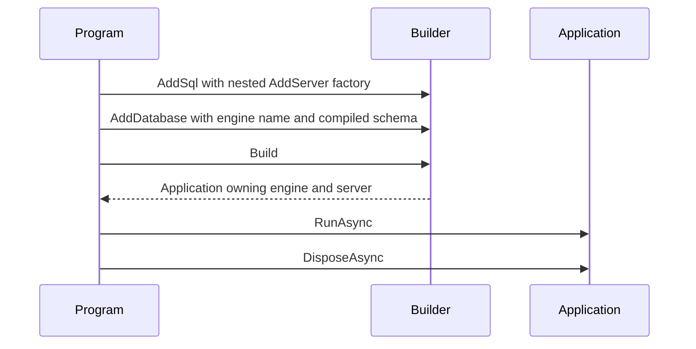

# Database sample host fixture

This non-packable acceptance fixture composes the SQL engine and server in its
ordinary `Program.cs`. `SqlSchema.Compile` supplies the same SQL declaration to SDK
build-time analysis and runtime compilation in one call. Hosting
receives the resulting model-agnostic `CompiledSchema` through `AddDatabase` and
provisions it before the server accepts connections.

The fixture is owned by `Database.Testing`; its tests exercise the generated
resource manifest, control plane, SQL round trips, and restart durability.

Phase 29 captures SQL intent through `AddSql((context, engine) => ...)`, nests the server's deferred factory on that engine builder, and registers the existing compiled schema by engine name. Build creates and owns the engine/server; the application's `await using` lifetime stops the host and disposes them. The fixture's pre-existing generated resource behavior remains unchanged; no ApplicationModel feature is added by this migration.

