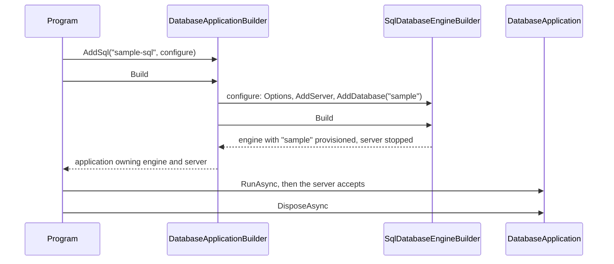

# Database sample host fixture

This non-packable acceptance fixture composes the SQL engine, its server and its one database in
its ordinary `Program.cs`, through the three composition levels of the engine extensibility design
(B1, owner decisions 49 to 59 of 2026-10-09): the application builder registers the engine
`sample-sql` with `AddSql`, the engine builder sets its options, adds its TCP server with
`AddServer(server => server.Listen(...))` and declares the database `sample`, and the database
builder declares its schema inline with `database.Schema(...)`.

That inline declaration is the one schema source. At build time the `Sdk.Database` compiler reads
it as an anchor and writes `obj/<configuration>/<framework>/cohesion/database/sample.schema.json`
and `sample.schema.sha256`. At run time the engine's build, inside application `Build()`, compiles
the same declaration, then creates or opens `sample` and provisions it before the server is
attached to a running host, so the server never accepts a connection ahead of the schema.

The fixture is owned by `Database.Testing`; its tests exercise the generated resource manifest,
control plane, SQL round trips, restart durability, and the parity of the SDK hash with the hash
the running host recorded.

The sequence below shows the build and run of the fixture.

```mermaid
sequenceDiagram
    participant Program
    participant Builder as DatabaseApplicationBuilder
    participant Sql as SqlDatabaseEngineBuilder
    participant Application as DatabaseApplication
    Program->>Builder: AddSql("sample-sql", configure)
    Program->>Builder: Build
    Builder->>Sql: configure: Options, AddServer, AddDatabase("sample")
    Builder->>Sql: Build
    Sql-->>Builder: engine with "sample" provisioned, server stopped
    Builder-->>Program: application owning engine and server
    Program->>Application: RunAsync, then the server accepts
    Program->>Application: DisposeAsync
```
