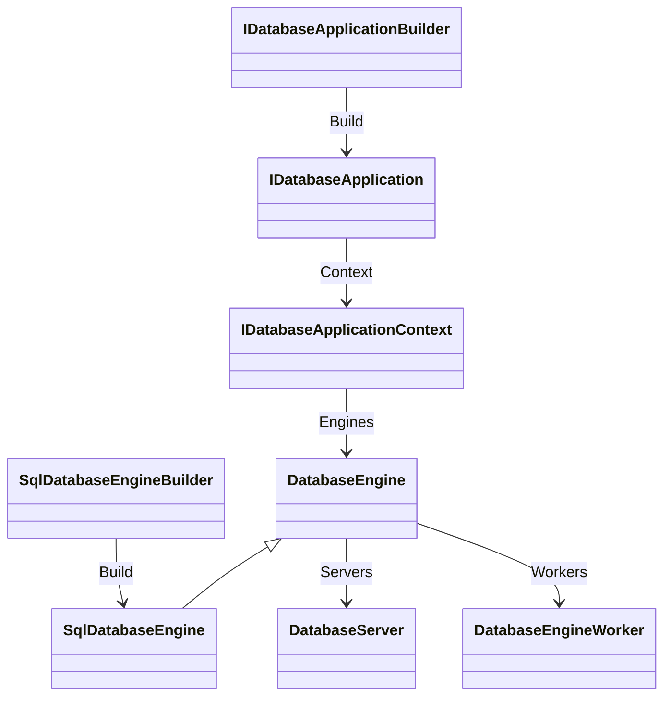

# Assimalign.Cohesion.Database — Design

The area root (architecture: [resources/Database/DESIGN.md](../../../../docs/resources/Database/DESIGN.md)).
Everything here must be true for *all five* data models — anything model-specific
belongs in a model package. The root's job is to make engines substitutable at the
seams the platform builds on: the server serves any engine, the hosting layer
composes any engine, a client result looks the same regardless of the engine that
produced it.

The root is also the area's **rollup**: it references every child root — the
independently consumable base components a database is made of (`Database.Types`,
`Database.Language`, `Database.Storage`, `Database.Transactions`,
`Database.Execution`, `Database.Indexing`, `Database.Protocol`,
`Database.Security`) — so one reference to the root delivers the whole base
surface. Child roots never reference the root.

## Phase 29 composition contract (current)

The approved [hosting composition](../../../../docs/programs/DATABASE_HOSTING_DESIGN.md) supersedes the historical builder/worker descriptions below. `IDatabaseApplicationBuilder` exposes exactly borrowed `AddEngine(DatabaseEngine)`, owned and named `AddEngine(string name, Func<IDatabaseApplicationContext, DatabaseEngine>)`, and one-shot `Build()`. The owned overload names the engine as its first argument, so the hosting layer reserves the name, and refuses a duplicate, when a model verb registers the engine, before any factory runs (owner decision 52 of 2026-10-09): a model's factory can open and provision databases, which a duplicate engine must never reach. The nameless factory overload is deleted. There is no builder engine enumeration, application-level AddServer, or Use stage. `IDatabaseApplication` inherits `IAsyncDisposable`; its context observes every engine (`IReadOnlyList<DatabaseEngine> Engines`), nested servers (`IReadOnlyList<DatabaseServer> Servers`), and ordinal `GetEngine(name)` lookup, which returns the root base; the static extension `GetEngine<TEngine>(name) where TEngine : DatabaseEngine` (`Extensions/DatabaseApplicationContextExtensions.cs`) returns a model's engine typed, refusing an engine of another type with `InvalidOperationException`. These three are three of the area's five kept interfaces (`database-area.md`); since phase 6 of the concrete-types plan (#1262) they name the root bases, and every other root interface is deleted. All four named engine operations use the existing `DatabaseName` value object; its implicit string conversions preserve straightforward callers while implementations use the typed contract.

Each model ships a sealed engine builder (`SqlDatabaseEngineBuilder` and its siblings) with typed `AddWorker(Func<TEngine, DatabaseEngineWorker>)` and `AddServer(Func<TEngine, DatabaseServer>)`; the former root `IDatabaseEngineBuilder` they implemented is deleted (row 6 of the plan). Shared construction/rollback source is owned in this project's `shared/` (`DatabaseEngineBuilderState<TEngine>`) and compiled by each model through `CohesionSharedSource`. No separate generic application composition algorithm consumes arbitrary model options. The 2026-10-02 ruling that omitted typed worker/server factory overloads is superseded (D5): since step P4.0 the shared build state is typed over each model's engine, and since phase 4 each model's sealed builder offers typed `AddWorker` and `AddServer` ("Root bases", below).

Workers remain scheduled and quiesced by their engine. Every worker derives from `DatabaseEngineWorker`, whose non-virtual `Run(CancellationToken)` is the pump the engine runs on the thread it owns. `DatabaseEngine.Servers` enables hosting to discover nested servers. Engines own factory-produced workers and servers; hosting snapshots servers for lifecycle only. Application-created engines are disposed by the application; instance-registered engines remain caller-owned.

## Root bases (concrete-types plan, phases 3 and 6, #1259 and #1262)

The area's concrete-first rule (`.claude/rules/database-area.md`, owner decision O34a) replaces
the root's engine-model interfaces with abstract bases whose public members are non-virtual and
call protected cores (the ADO.NET shape). Phase 3 of
[the plan](../../../../docs/programs/DATABASE_CONCRETE_TYPES_PLAN.md) added the bases **beside**
the interfaces, each implementing its old interface (explicitly where the base retyped a member),
so `Database.Hosting`, `Database.Embedded` and every model kept compiling against the interfaces.
Each model moved its leaves onto them in its own phase-4 PR (#1260), KeyValuePair first, Graph
second, Documents third, Blob fourth and Sql last. Phase 6 (#1262) retyped the hosting layer,
`Database.Embedded` and the kept composition seams onto the bases and deleted the ten root
interfaces, the bridges' explicit implementations and the server context (`IDatabaseServerContext`,
the four model context classes and the test doubles' contexts): the bases are the API, and
the root keeps only `IDatabaseApplication`, `IDatabaseApplicationBuilder` and
`IDatabaseApplicationContext`. Every base carries the deviation marker.

| Base | Replaced (deleted in phase 6) | The leaf supplies | The base owns |
|---|---|---|---|
| `DatabaseEngine` | `IDatabaseEngine` | the database cores (create, open, drop, list, try-get), forgetting a database a holder closed (`ForgetClosedDatabaseCore`), `OfflineDatabases`, an offline database's storage error (`GetOfflineErrorCore`), taking a database offline it gave up on (`TakeDatabaseOfflineCore`, owner decision 25), and closing its databases (`DisposeAsyncCore`) | name and model, the worker failure window, its minimum of passes and the clock that measures it (owner decision 42), the worker and server inventories, attach and its freeze, the worker pump, the state fold and its per-database part (`HasFailingWorker`, `HasEngineWideFailure`, owner decision 42), the disposal order, the open's wait for a holder's close, giving up on a database for its workers |
| `DatabaseInstance` | `IDatabase`, `IDatabaseSchemaProvisioner` | the session core and disposal cores | name, engine, the disposed flag, the close's completion and the engine notice it sends (no capability member since owner decision 50 of 2026-10-09) |
| `DatabaseSession` | `IDatabaseSession` | the begin and execute cores, and ending its running operations | state, the session's transaction, the one "already active" check, the operation hold, the teardown order |
| `DatabaseTransaction` | `IDatabaseTransaction` | the kernel state, commit and rollback cores with their own exception translation, the offline refusal, the coded aborted error | identity and isolation level, the end gate and the whole end state machine |
| `DatabaseServer` | `IDatabaseServer`, `IDatabaseServerContext` | start and stop cores, and `Sessions` | the engine (the context's `Engine`), the lifecycle state machine |
| `DatabaseServerSession` | `IDatabaseServerSession` | the engine session and disposal | the identity, the negotiated version, the authenticated principal |
| `DatabaseEngineWorker` | `IDatabaseEngineWorker` | the per-pass work and, when signal-driven, the trigger wait | name, kind and interval (since phase 3), the pump loop and failure record (#1268), the escalation to the owning engine once a database's failures last its window across its minimum of passes (owner decisions 25 and 42) |

The engine builders' `IDatabaseEngineBuilder` went in phase 6 too; each model's sealed builder
replaced it in phase 4 (row 6). Each base lists the BCL disposal interfaces the deleted interface
carried: `DatabaseEngine` and `DatabaseInstance` are `IAsyncDisposable` and `IDisposable`;
`DatabaseSession`, `DatabaseTransaction`, `DatabaseServer` and `DatabaseServerSession` are
`IAsyncDisposable`; `DatabaseEngineWorker` is neither (its release belongs to its engine, below).

- **NVI and typed accessors.** Public members validate arguments, check disposal, take the
  cancellation fast path and run the state machine, then call a `protected abstract …Core` member.
  The only abstract public members are getters for state the leaf computes or owns
  (`DatabaseEngine.OfflineDatabases`, `DatabaseServer.Sessions`,
  `DatabaseServerSession.DatabaseSession`). References fixed at construction (an instance's
  engine, a session's database, a server's engine) are base fields; a leaf re-exposes them typed
  with `new` over a typed field of its own, and re-exposes a typed async factory with a `new`
  member that awaits the base's public member, never its core. The only `protected virtual`
  members are lifecycle hooks, one of the cases rule 4 allows (the session's and transaction's
  empty `DisposeAsyncCore`, the worker's `WaitForTrigger` and its empty `DisposeAsyncCore`). The
  optional-capability case is unused: `DatabaseInstance` had one capability, schema provisioning
  (`SupportsSchemaProvisioning` over a virtual `ApplySchemaCoreAsync`), which owner decision 50 of
  2026-10-09 deleted with the root's schema types.
- **Engine composition is attached, then frozen** (§6.5 of the plan). A leaf's constructor attaches
  its built-in workers and its build path attaches the composed workers and servers through the
  protected, non-virtual `AttachWorker` and `AttachServer`, then calls `CompleteComposition()`;
  an attach after that throws `InvalidOperationException` (`ObjectDisposedException` after
  disposal). An attached worker starts pumping at once on a dedicated thread, worker names are
  unique within the engine, no product is attached twice, and a server must front its engine.
  The pump frame and the state fold are the ones every model compiled from
  `shared/DatabaseEngineWorkerPump.cs` since #1268's review. Every model engine derives from the
  base since phase 4, so the last model's PR (Sql) deleted that shared copy and the
  `COHESION_DATABASE_ENGINE_PUMP_IN_BASE` constant the adopted models defined to compile it to
  nothing.
- **The shared build state composes through the leaf** (plan step P4.0, §6.5). Every model's
  builder compiles `shared/DatabaseEngineBuilderState<TEngine> where TEngine : DatabaseEngine`
  (phase 6 collapsed its former `<TEngine, TWorker, TServer>` and fixed the products to the
  bases), which runs typed factories (`Func<TEngine, DatabaseEngineWorker>`,
  `Func<TEngine, DatabaseServer>`) and hands their products to the
  leaf's internal compose method as lazy sequences, one factory per product requested, so a
  factory still sees the products attached before it. The leaf attaches each product through
  `AttachWorker` and `AttachServer` and then calls `CompleteComposition()`. The state makes none of
  the attach checks: it refuses a null product, and when the compose method fails it disposes the
  product being attached unless the engine already owns it (the base refuses a repeated product
  like any other, and the engine disposes what it owns), then disposes the engine. That disposal
  rests on the compose method's contract (each sequence read once and to the end, workers before
  servers, each product attached before the next is requested), so the state checks it as the
  compose method reads and fails the build with `InvalidOperationException`, the unattached
  product disposed, when a compose method breaks it, instead of leaking products or dropping
  factories. A rejected server or engine is disposed through its public disposal; a rejected
  worker, which has none, is released through the release the leaf hands `Complete` beside its
  compose method (below), and one an engine owns is left to that engine. Until a model's engine
  derived from the base, its builder composed through a bridge overload that adapted the
  engine's own two attach members; each model's phase-4 PR moved its builder to the compose
  method (KeyValuePair's `KeyValueDatabaseEngine.Compose` first, then Graph's, Documents', Blob's
  and Sql's, each state then typed `<…DatabaseEngine, DatabaseEngineWorker, DatabaseServer>`), and
  the last one (Sql) deleted the bridge. Phase 6 fixed the products to the bases and constrained
  the engine to `DatabaseEngine`: a rejected worker goes to the leaf's release, a rejected server
  or engine to its public `DisposeAsync`, with no type test left.
- **Engine disposal has one order:** the servers (last attached first), then every worker pump is
  stopped and joined, then the workers (last attached first, each through its release hook: the
  checkpointer ends the work it left on its lanes), then the leaf closes its databases
  (`DisposeAsyncCore`). Every step runs whatever an earlier one threw, and the failures are
  reported together in one `AggregateException`.
- **A worker belongs to one engine and is released once, by its owner** (plan row 7, landed with
  the last model's phase-4 PR). `DatabaseEngineWorker` has a `protected virtual DisposeAsyncCore`
  release hook with an empty default, the second lifecycle hook beside `WaitForTrigger`, and no
  public disposal: it is neither `IAsyncDisposable` nor `IDisposable`. `AttachWorker` claims the
  worker before it starts the pump and refuses one that is not free (another engine owns it, or
  it was released), so no worker is pumped by two engines or after its release. The owning
  engine runs the hook through the worker's internal entry point once it stopped the pump. A
  worker no engine owns, a product a builder refused, is released through the base's
  `protected static ReleaseUnownedWorkerAsync`, which does nothing on a worker an engine owns;
  the shared builder state, compiled into the model assemblies, cannot reach the root's
  internals, so each model engine re-exposes it as an internal `ReleaseRefusedWorkerAsync` and
  its builder passes that to `Complete` beside its compose method. Outside code holding
  `DatabaseEngine.Workers` cannot release a worker at all. The hook runs once whichever path
  reaches it. It replaced the engines' `IAsyncDisposable`/`IDisposable` type tests; the shared
  `DatabaseCheckpointWorker`'s `Dispose` (its lanes) became its override. As first landed the
  worker was `IAsyncDisposable` with a public, ownership-guarded `DisposeAsync`, on the reading
  that only an internal entry could keep it off the public surface; the review applied the
  protected-static shape instead, which needs no grant.
- **The explicit-transaction state machine lives once, in `DatabaseTransaction`** (§6.4 of the
  plan; #1188, #1225, #1226). Graph, Documents, Blob and KeyValuePair each carried a copy. One end
  gate serializes commit, rollback, disposal, an abort for a failed operation (`AbortAsync`) and
  the session's teardown (`CloseAsync`). `AbortAsync` is `protected`: no root type calls it, and a
  model session reaches it through its own leaf either way. `IsOpen`, `IsUsable`, `CreateRefusal`
  and `CloseAsync` are `protected internal`, because the root's `DatabaseSession` reads or calls
  them. A token is observed only before an end starts; the cores take none, because a started
  rollback must end the transaction and a canceled commit could only abort work the caller asked
  to keep (PostgreSQL holds interrupts through `AbortTransaction`). A
  transaction that did not commit accepts any number of rollbacks; a commit ends it whatever its
  outcome, and one after an abort completes the rollback and fails with the model's coded error
  (`COHDBG007`, `COHDBD001`, `COHDBB001`, `COHDBK001` in the models' vocabularies; SQL, which
  never aborts, refuses work on a transaction the kernel ended with `COHSQLT005`). `State`
  reports `Faulted` while an operation's failure or the kernel ended the transaction under its
  caller, until the caller ends it. A commit is refused while an operation of the transaction
  runs (`TryBeginOperation`/`EndOperation`). An offline database (#1243) refuses a commit and a
  rollback before they start, and the teardown, an abort and disposal touch nothing on it. Which
  failures abort stays per model: Graph, Documents and Blob abort on a failed statement; SQL and
  key-value statements are statement-atomic and never call `AbortAsync`.
- **One "already active" check, with one message** ("A transaction or operation is already active
  on this session."), in `DatabaseSession`. Five sessions carried it with three messages. BEGIN is
  refused while the session's transaction is usable, while another BEGIN runs, or while the leaf
  holds the session for an operation (`TryEnterOperation`, for models whose sessions run one
  operation at a time); while the session's transaction refuses work, BEGIN gets that
  transaction's coded refusal instead, as in PostgreSQL's failed transaction block. Disposal
  closes the session, lets the leaf end its running operations, then ends the open transaction as
  the teardown ("The session closed before the transaction ended." is the cause a later commit
  names). Both steps run whatever the first threw, and any failure is reported in one
  `AggregateException` ("The session failed to close."), as the engine reports its own.
- **A database closed outside its engine is forgotten** (owner decision 33 of 2026-10-06, #1289;
  rule 8: one mechanism in the bases, not five copies). Until it, a database a holder disposed
  stayed registered until it was dropped, and every later open handed back the disposed instance
  or refused it. Now `DatabaseInstance` disposal completes a close task once its core ends and
  then tells its engine, which calls the leaf's `protected abstract ForgetClosedDatabaseCore`;
  the five leaves implement it through the shared `shared/DatabaseRegistry.Forget`, so the next
  `OpenDatabaseAsync` opens the database again from its files. The rules that make it race-free:
  - **The leaf keeps tracking the database until its close ends**, so every worker's closed-database
    skip (the `IsClosed` guards) still covers the window between the close and the forget.
  - **Nothing reuses the files under a running close.** The base's `OpenDatabaseAsync` loops: when
    the open core returns an instance whose close has started, it awaits that close (honoring its
    token) and calls the core again, and it throws `InvalidOperationException` if the same
    instance comes back, a leaf that never forgets, rather than spinning. `TryGetDatabase` does not
    report a closing database. A second `Dispose` or `DisposeAsync` waits for the close in flight
    instead of returning early, so a drop, an offline reopen and the engine's disposal, which
    dispose the database, wait for a close a holder started.
  - **The forget never blocks on the leaf's lock.** Those engine paths remove the database from
    the leaf's lock-free instance snapshot and then dispose it while holding the leaf's lock, so a
    forget that waited for that lock would deadlock with them. The forget reads the snapshot
    first and returns at once when the database is not in it; otherwise it takes the lock through
    a bounded `Monitor.TryEnter` loop (10 ms attempts) and rereads the snapshot between attempts,
    and under the lock it removes the database only if the registry still holds that same
    instance.
  - **The close chain never captures a synchronization context.** A second `Dispose` blocks on
    the close in flight, and the engines' drop and offline reopen call `Dispose` under the leaf's
    lock, so every await from a leaf's `DisposeAsyncCore` down to the storage streams uses
    `ConfigureAwait(false)` (`Storage.DisposeAsync` and `StorageStream.DisposeAsync` included).
    One continuation posted to a UI context (Studio is MAUI) would deadlock a drop made on that
    thread while a holder's close runs.
  - **A stalled close stalls the engine's registry.** A drop and an offline reopen wait for a
    holder's close while holding the leaf's lock, as the drop's own close always did. A close that
    stalls (a data fsync that does not answer) therefore blocks every registry operation of that
    engine until it ends: create, open, drop, a lookup that takes the lock, enumeration, a wire
    server's handshake and the engine's disposal. The drop's cancellation token is not observed
    during that wait. Moving the wait out of the lock (a `_dropping` set that open and create
    refuse, the close awaited with the token, the files deleted under the lock again) is the
    remedy if the stall matters; it is not done, because the exposure predates decision 33.
  - **Engine-initiated closes are unchanged**: a drop, an offline reopen and the engine's disposal
    remove the database first, so its forget finds nothing to do.

  In-memory databases reopen with their data too (#1272): `shared/DatabaseMemoryFiles` keeps each
  in-memory file set's streams until it is dropped or the engine is disposed (the disposal
  releases every file set, so a disposed engine still referenced holds none of its databases), and
  an open copies the closed streams' bytes into new streams outside its lock, each allocated once
  at its final size (a `MemoryStream` keeps its buffer after it closes), and runs the same
  recovery a file reopen runs; it refuses a file set whose storage still has a stream open. The
  root suite pins the base's part with a test leaf (`TestEngine`) whose close a gate holds: an
  open, a canceled open, a drop and the engine's disposal during a holder's close, the refusal
  of a leaf that never forgets, and a second disposal that waits.
- **The server lifecycle Sql, KeyValuePair and Graph carried** lives in `DatabaseServer`: a server
  is created inert, starts once, and a failed start or any stop is terminal (a start after it
  throws `ObjectDisposedException`); stop is idempotent and runs for a server that never started,
  so the leaf releases its listener either way; disposal stops. One gate serializes start and
  stop. Blob's server differed on one path until its phase-4 PR moved it onto the base (below).
- **Departures from the plan's rows, as landed.** The plan's `DatabaseServerSession` constructor
  took the protocol version and principal; a server session exists from accept, before either is
  known, so the base generates the identity and takes the two values through protected one-shot
  setters. Rule 6 of `database-area.md` still lists the protocol version and principal among the
  values fixed at construction; amending it is an owner decision, open at the phase-3 merge (plan
  §7). The plan's `Abort(Exception)` is `AbortAsync`, because the abort rolls back under the end
  gate, and the teardown's `CloseAsync` (Documents, Blob and KeyValuePair carried it) joined it.
  `OfflineDatabases` arrived on the former `IDatabaseEngine` after the plan (#1243) and is the
  engine's one abstract public member.
- **What moves in phase 4, per model.** Adopting the bases changes a model's behavior only where
  the base consolidates; §6.4 of the plan lists each change, and each model's PR updates the
  assertions it moves:
  - the messages above, the session-disposal shape (always an `AggregateException` named "The
    session failed to close.": Graph, Documents and Blob change only the message, while SQL and
    KeyValuePair, whose teardown let the transaction's failure out unwrapped, gain the wrapper) and
    the engine-disposal message ("One or more components of engine '{name}' failed to close.");
  - the order of BEGIN's refusals: every model refused an unsupported isolation level and an
    offline database before its "already active" check, and the base runs that check first;
  - the engine's guards: `GetDatabasesAsync` checks disposal and the token when called, not at
    the first `MoveNextAsync`; the guards run name, disposal, token in that order; and the
    constructor rejects a blank engine name, which every model's options accept today;
  - the transaction state machine for SQL, which gains the end gate, the repeatable rollback and
    a coded aborted error, observes a commit's token only before the commit starts, reports
    `Faulted` for a transaction the kernel ended under its caller, and ends the open transaction
    at session disposal with the teardown cause;
  - Blob's server, whose start refused while its engine is not running left the server inert (a
    later start could retry, and a later stop disposed the listener): under the base that start is
    terminal, so its start core disposes the listener before it rethrows (landed with Blob's
    phase-4 PR; the terminal refusal is pending owner confirmation, plan §7);
  - the worker-name uniqueness check for the models that did not check it, and the engine disposal
    order for SQL and KeyValuePair (all workers last attached first, instead of the checkpointer
    first);
  - engine composition through the compose method (plan step P4.0): SQL's and KeyValuePair's
    attach-time refusal of a blank worker name is gone, because the worker's constructor rejects
    the name inside the factory, and the pump threads are named for their workers, where Graph,
    Documents and Blob named them `{engine}/{kind}`.

  Each model's PR runs its #1188, #1225 and #1226 suites in process and over the wire.

## Why-this-not-that decisions

- **Child roots roll up under the root; they never reference it** (owner
  decision, 2026-07-13 — inverts the earlier Protocol→root and Transactions→root
  references). Unlike the Web area, a database has a vast base-component surface;
  the child roots exist to break it out for separation of concerns and
  testability, and each must stay *independently consumable* — a tool that only
  speaks the wire protocol, or a storage engine experiment, should not drag the
  area contracts in. That is only true if the dependency arrow points root →
  child. The rejected alternative — child roots referencing the root for shared
  vocabulary (`DatabaseException` ancestry, `TransactionId`, `ProtocolVersion`) —
  made two children (`Protocol`, `Transactions`) unaggregatable and forced the
  hosting module into a COHRES002 exemption for the server's own machinery. With
  the inversion, vocabulary lives with its owning child (`ProtocolVersion` in
  `Protocol`, `TransactionId`/`TransactionState` in `Transactions`), the root
  consumes it through its child-root references, and consumers reach it
  transitively through the root. `Database.Indexing` joined the child
  roots on 2026-07-13 (owner direction): its only root coupling was exception
  ancestry, re-rooted onto its own `IndexException` — index infrastructure is a
  base component like storage and transactions.

- **Engine → database → session → transaction as four contracts**, not one god
  interface. Each has a distinct lifetime and threading model: engines are
  process-long and thread-safe; databases are shared handles; sessions are
  cheap, single-threaded execution scopes; transactions are explicit ACID
  brackets inside a session. Collapsing them (an `ExecuteAsync` on the engine,
  say) would smuggle session state into a shared object.
- **Engines are data machines — create → use → dispose, no lifecycle members**
  (owner decision, 2026-07-13 — **reverses the #903 decision** that put
  `StartAsync`/`StopAsync` on the root engine contract, and supersedes the
  short-lived `IDatabaseEngineLifecycle` segregation from earlier the same day,
  which was deleted before it ever shipped in a release). The new information
  that changed the calculus: once servers became per-model (below), "running"
  had an owner — the server fronts the engine on the network and is the thing
  that starts and stops — and the engine's start/stop ceremony was revealed as
  accidental service-shape, not data-machine substance. An engine is fully
  operational from creation (its background workers spawn with it) and disposal
  is its one transition: quiesce workers → durable flush → close databases.
  What #903 actually needed — a host that can *align* engine durability with
  its own lifecycle — is satisfied by disposal alone: the composition root that
  created the engine disposes it, and committed work is durable when
  `DisposeAsync` completes. The rejected alternative (keeping idempotent
  start/stop for restartability) bought a restartable engine object nobody
  needed — a "restart" is creating a fresh engine over the same storage root,
  which the recovery path already makes correct — at the cost of a
  four-state machine on every engine and a start-order protocol between host
  and composition root.
- **A minimal observational `State` stays on the engine** (judgment call,
  recorded): the approved data-machine contract needs no state machine, but
  worker-fault reporting needs *somewhere* to surface — the old contract threw
  the recorded fault from `StopAsync`, and with stop gone the only alternatives
  were throwing from `DisposeAsync` (hostile to `await using`, masks in-flight
  exceptions) or silence. `EngineState` therefore shrank from a six-state
  lifecycle enum to three observational conditions: `Running` (from creation),
  `Faulted` (a background-worker fault was recorded; the engine keeps serving —
  grouped commits self-help, checkpoints just stop truncating — but the owner
  should learn it runs degraded), `Disposed`. The default control-plane health
  aggregate delivered by #973 reads this surface; nothing drives transitions
  from outside. Since #1268 `Faulted` means a worker *holds a failure it has not
  worked off*: the guided base keeps a failure record per database
  (`DatabaseEngineWorker.Fault`, `ConsecutiveFailures`, `FailureCount`), and a
  database's record ends with the first pass that finishes that database's work, so a
  transient fault does not leave the engine `Faulted` for good, and one database's
  deferred or busy work never keeps another database's resolved failure reported. Every
  worker derives from the base since phase 6 deleted `IDatabaseEngineWorker`, whose
  implementations could let their loop end early; the engine's pump still records a `Run`
  that throws or returns before its engine stopped it, and reports `Faulted` until disposal,
  but the base's loop lets nothing escape, so no worker reaches that frame (the hosting
  health description no longer names the case).
- **A worker failure never ends a worker, and one database's failure slows no other
  (#1268 and its review).** `DatabaseEngineWorker.Run` is a non-virtual loop over the
  non-virtual pass `RunIteration` and the protected `void RunIterationCore`. A pass
  visits the engine's databases one by one: it asks `BeginDatabase(name)` first, and
  catches and reports a database's failure (`ReportFailure(name, exception)`) before
  going on to the next database. A database whose failure was reported is skipped by
  later passes until `DatabaseEngineWorker.FailureBackoff` (one second) has passed,
  while every other database keeps the worker's full pace; work a pass leaves for later
  without failing (a busy storage, a checkpoint deferred to a running statement, an undo
  still deferred) is reported with `ReportUnfinished(name)`, which keeps an earlier
  failure of that database recorded until the work is done. A database a pass does not
  begin (dropped, closed, offline) has its record forgotten. Only a pass that fails as a
  whole (its work threw, or its trigger wait did) makes the loop sleep the backoff, so it
  cannot spin. The version-purge workers report an undo failure with no extra backoff
  (`ReportFailure(name, exception, TimeSpan.Zero)`): the coordinator already paces each
  retry, about 100 ms after the deferral and then doubling (#1226). Passes never
  overlap; a test that calls `RunIteration` beside the worker's thread waits for the
  running pass. Only cancellation and `OutOfMemoryException` leave the loop. The
  engine's pump (the `DatabaseEngine` base's since phase 3; every model's since phase 4, when
  the last model deleted the shared copy, `shared/DatabaseEngineWorkerPump.cs`) also runs a
  worker's `Run` again after the backoff if it ever throws or returns early. A worker's name,
  kind and cadence are fixed by its constructor since phase 3 (#1259): they used to be abstract
  getters, so the cadence of the
  built-in workers was read from the engine's options object on every trigger wait, and a change
  to that object after the engine was created changed it; now the value the engine was created
  with holds for the worker's life. This is PostgreSQL's recovery for its background
  writer, checkpointer and WAL writer, which catch an error per cycle, report it,
  release what the cycle held and sleep a second before the loop continues ("A write
  error is likely to be repeated", `src/backend/postmaster/bgwriter.c:154-205`,
  `checkpointer.c:286-346`, `walwriter.c:147-193`); Neo4j's checkpoint scheduler
  likewise counts consecutive failures and clears them on the next success
  (`community/kernel/src/main/java/org/neo4j/wal/checkpoint/CheckPointScheduler.java:51-84`).
  A PostgreSQL checkpointer serves one cluster, so its sleep holds back no other
  database; a worker here serves every database of its engine, which is why the
  backoff is per database. Before the review the backoff was the worker's: while one
  database kept failing, every other database got at most one checkpoint a second (a
  probe measured 6 truncations in 6 s instead of 458, and a journal peak of 700-884
  times the size trigger).
  A failure the worker cannot recover from is not the worker's: a failed durable flush
  (#1243), drain of the journal's append buffer (#1252) or header slot write (#1268) takes
  the database offline, the workers skip it, and `OfflineDatabases` reports it. A drain
  fails on whichever thread needs the records on the file, a worker's group flush,
  checkpoint or page write-back included, and its cause is `StorageOfflineCause.JournalFlush`
  like the fsync's. Before #1268 the engines' pumps caught outside
  `Run`'s loop, so one unexpected exception (a page write the checkpoint could not
  make) ended a checkpoint, write-back or flush worker for the life of the engine.
- **A checkpoint that hangs or crawls holds back its own database only.** The per-database
  backoff above bounds how often a failing database is tried, not how long one try takes:
  the checkpoint worker used to run every database's checkpoint on its own thread, so a
  device that took seconds to answer an fsync, or to fail a write, stopped every other
  database's journal truncation for as long (a hung data-file fsync in one database left
  the other with no checkpoint at all in five seconds of writes). The engines' checkpointer
  is now one shared copy, `shared/DatabaseCheckpointWorker.cs`, that runs each database's
  checkpoint on a lane (`shared/DatabaseCheckpointLanes.cs`): a dedicated lane thread,
  at most one checkpoint per database at a time. The pass waits for the lane while no
  other database needs the worker, so a checkpoint that ends is settled by the pass that
  started it, as before. Once another database's journal reaches its size (the engine's
  checkpoint signal), or the poll interval passes, the pass leaves the checkpoint running
  alone; later passes skip that database, keeping a failure recorded for it, until the
  checkpoint ends, and the pass that finds it ended settles it. Engine disposal waits for
  a checkpoint left running before it closes the storages. This is the isolation Neo4j
  gets from one checkpoint job per database, each rescheduled only after its run ended
  (`community/kernel/src/main/java/org/neo4j/kernel/database/Database.java:1155-1157`,
  `community/kernel/src/main/java/org/neo4j/wal/checkpoint/CheckPointScheduler.java:51-84`),
  and PostgreSQL from one checkpointer per cluster and WAL
  (`src/backend/postmaster/checkpointer.c:5`). The page write-back, flush and purge
  workers still visit their databases on their own thread (follow-up).
- **A failure that persists takes its database offline (owner decision 25 of 2026-10-06).**
  Until the decision a page write the checkpoint could never make was retried every second
  for as long as the process ran, its database's journal grew until the fault cleared or the
  disk filled, and the engine stayed `Faulted`. That is PostgreSQL's behavior: its
  checkpointer keeps retrying (`src/backend/postmaster/checkpointer.c:286-345`), its
  `max_wal_size` is a soft limit (`doc/src/sgml/config.sgml:4010-4014`), and it stops only
  when a WAL write fails on the full device (`src/backend/access/transam/xlog.c:2529-2532`).
  The engines now escalate the way Neo4j does, which panics a database through its
  `DatabaseHealth` once its checkpoint failed ten times in a row
  (`community/kernel/src/main/java/org/neo4j/wal/checkpoint/CheckPointScheduler.java:41-75`,
  `community/monitoring/src/main/java/org/neo4j/monitoring/DatabaseHealth.java:74-85`), but per
  database and through the #1243 offline machinery instead of a process-wide panic:
  - *The failure window (owner decision 42 of 2026-10-07).* A database's failures are a streak
    in the worker base's failure record, from the first failed pass to the pass that finishes
    its work; the record counts the streak's failed passes (several reports in one pass, one
    per file set, count once) and times it from its first failed pass on the owning engine's
    clock. When a checkpoint, page write-back, write-ahead flush or version-purge worker's
    streak on one database has lasted the engine's `WorkerFailureWindow` and spans at least its
    `WorkerFailureMinimumPasses` failed passes (engine options; `DatabaseEngine.DefaultWorkerFailureWindow`
    = 100 s, positive and at most `MaximumWorkerFailureWindow`, `int.MaxValue` milliseconds;
    `DefaultWorkerFailureMinimumPasses` = 3, at least one), the base asks the owning engine to
    give up on it (internal `DatabaseEngine.GiveUpOnDatabase`, then the leaf's
    `protected abstract TakeDatabaseOfflineCore`). The leaf finds the database in its
    lock-free published snapshot, never waiting for its registry lock, and takes its data
    storage offline with `Storage.TakeOffline(StorageOfflineCause, string, Exception)`;
    the storage's `OnOffline` hook takes a second file set offline and ends the database's
    lock waits, exactly as after a failed fsync. The cause names the worker:
    `CheckpointFailures`, `PageWriteBackFailures`, `WriteAheadFlushFailures` or
    `VersionPurgeFailures`, and the storage's message names the worker instance, the passes and
    how long they lasted ("… on 3 passes in a row over 100 s, at least the engine's window of
    100 s"). Index-maintenance workers never escalate: their work costs space, not durability.
    The window is Neo4j's: Neo4j panics after ten failed checkpoints (`failure_tolerance`,
    `community/kernel/src/main/java/org/neo4j/wal/checkpoint/CheckPointScheduler.java:41-42`)
    and checks for a checkpoint every ten seconds by default (`DEFAULT_CHECKING_FREQUENCY_MILLIS`,
    `community/kernel/src/main/java/org/neo4j/wal/checkpoint/CheckPointThreshold.java:40`), so
    its ten failures span about a hundred seconds. A device that stops answering for less than
    that (a storage path failover) leaves its databases online; one that stays silent longer
    takes them offline, and a hosted application reopens each once the device answers. An
    engine that must ride out longer outages widens its window, and one that must give up
    sooner narrows it.
  - *Why time, not a count.* Decision 25 landed a count of failed passes (ten, Neo4j's count),
    and owner decision 35 of 2026-10-07 raised it to a hundred to keep Neo4j's window at the
    one-second worker backoff. A count is a window only at one worker's pace: a version purge's
    full pass, once per `MaintenanceInterval`, took about a hundred minutes to give up, and a
    rolled-back writer's deferred undo, retried at its coordinator's 100 ms doubling up to that
    interval (#1226), about 92 minutes while the writer kept its locks (the P6 review). Decision
    42 measures the window instead, so every worker gives up about the window after its first
    failure. The minimum of passes is for the slow ones: a worker that visits a failing
    database seldom, or whose one attempt outlasted the window (a checkpoint that hung on its
    lane), would otherwise give up after one or two failures; three mean the failure was
    retried twice. A busy, deferred or still-running pass neither ends the streak nor stops its
    clock: a pass that reports the database's work unfinished without a failure (a storage busy
    with a transaction, a checkpoint deferred to a running statement or still on its lane) keeps
    the record, and the window runs from the streak's first failed pass, so one failure, a long
    busy stretch and two more failures give up on the third, where decision 35 needed a hundred
    (`ReportUnfinished_BetweenFailures_ShouldKeepTheStreaksClockRunning`; the decision 42 review
    kept it and recorded it for owner review). A version purge's full pass keeps its streak across
    the deferred-undo retries between full passes: those passes do not redo the full pass's work,
    so each model's purge worker reports a database whose last full pass failed unfinished until
    a full pass completes it (before the review such a retry ended the streak as recovered, so a
    full pass that kept failing never reached the window while another database deferred an
    undo). Since owner decision 46 of 2026-10-08 a failed full pass is retried for its database
    alone a `FailureBackoff` after the failure, not at the next `MaintenanceInterval`, so a full
    pass that keeps failing gives up at about the window like every other worker (101 s, where
    waiting for the next interval took 120 s), and one whose fault cleared ends its record, and
    Blob's refusal of its database, within a backoff instead of an interval. The purge workers
    schedule full passes and their retries on the engine's clock, the one the window is timed on;
    a retry runs the coordinator's whole pass, deferred undo included, so while a full pass keeps
    failing its database's deferred undo is retried at least once a backoff. At the defaults:

    | Worker | Visits a failing database | Gives up (decisions 42 and 46) | Was (decision 35, 100 passes) |
    |---|---|---|---|
    | Checkpoint | every poll, once a second, after the one-second backoff | at about 100 s, on about its 101st failed pass | about 100 s, more when each attempt took time |
    | Page write-back | every `PageWriteBackInterval` (1 s) after the backoff | at about 100 s | about 100 s |
    | Write-ahead flush | when a commit wakes it or its window (the group-commit window, else 1 s) passes, after the backoff | at about 100 s while commits stay pending | about 100 s while commits stay pending |
    | Version purge, full pass | once per `MaintenanceInterval` (60 s); after a failure, a backoff later (decision 46) | at about 101 s, on about its 101st failed pass (120 s, its third, before decision 46) | about 100 minutes |
    | Version purge, deferred undo (#1226) | at its coordinator's retry, 100 ms doubling up to `MaintenanceInterval` | at 102.2 s, its tenth retry | about 92 minutes |

    The measured clock is a `System.TimeProvider` the engine owns: `TimeProvider.System` unless
    the leaf passes one to the protected constructor. The model engines pass their options'
    internal `TimeProvider`, which only each model's own test assembly sets, so the tests cross
    the window on a clock they move by hand and never wait for it (`DatabaseWorkerFailureWindowTests`
    and each model's `*WorkerResilienceTests`). The worker's backoff between retries stays on
    the monotonic clock: it paces the work, not the give-up. The worker's `Fault` is set from the
    first failure, so the engine is `Faulted`, Hosting's health is `Degraded` and names the
    worker, and every failure is written to the event source for the whole window; Blob's
    server refuses only the failing database meanwhile ("A failing worker refuses its database
    alone", below).
  - *The journal cap.* A checkpoint that fails for the second pass or more in a row while one
    of the database's journals holds the engine's `JournalSizeLimit` (an engine option; zero,
    the default, resolves to four times `CheckpointJournalSize`, 1 GiB at its default and
    PostgreSQL's `max_wal_size` default, or to 1 GiB with the size trigger off;
    `shared/DatabaseWorkerLimits.cs`) takes the database offline with
    `StorageOfflineCause.JournalSizeLimit`, through the worker base's
    `protected TakeDatabaseOffline`: under load the journal would fill the device long before
    the failure window passes. One failure is not enough (owner decision 41), because a journal
    reaches the cap with no
    failure at all: a checkpoint deferred to a running statement or refused by a busy storage
    (#1283), or a write burst, never takes a database offline by itself, however long its
    journal grows, and a single transient failure of such a journal is retried like any
    other. The second failure in a row, a backoff later, is what says the checkpoints keep
    failing (`ReportFailure` returns the database's count of failed passes in a row; the
    shared checkpointer's `JournalSizeLimitFailures` is two). The cap is not held back by the
    window or its minimum of three passes: it is a count of two, whatever the clock says.
    PostgreSQL's `max_wal_size` is a soft limit the WAL may pass under heavy load
    (`doc/src/sgml/config.sgml:4010-4014`).
  - *The give-up never runs on a worker's thread.* Taking a storage offline latches its
    journal under the journal's lock, which a durable flush holds through its fsync. A worker
    that gave up on its own thread would wait out a hung fsync of that database, and so would
    every other database the worker serves, the stall the checkpoint lanes isolate (#1268).
    `GiveUpOnDatabase` therefore queues the leaf's `TakeDatabaseOfflineCore` to the thread pool,
    at most one per database at a time, and the pass goes on; until the database is offline the
    worker's record of it still backs it off. A failure of the leaf's core is recorded on the
    worker (`Fault`, until its next pass runs to its end) as that database's failure, not the
    worker's own: the database's record stays and names it, `HasEngineWideFailure` does not read
    it (owner decision 42 review), and the database's next failure asks again. The engine's
    disposal waits for a give-up still running before the leaf closes its databases.
  - *What does not count.* A failure of a database already offline or closed (the workers
    skip both, and the leaf refuses them), a worker no engine owns, and an engine whose
    disposal started. Only the failing database goes offline; the workers keep serving the
    engine's other databases. Once the leaf took the database offline the engine ends every
    worker's failure record of it (internal `DatabaseEngineWorker.ForgetDatabase`), and it does
    the same whenever a database of the engine closes (`ForgetClosedDatabase`, whoever closed
    it: a holder, a drop, a reopen after going offline, the engine's disposal). The engine
    reports `Running` again at once, and a reopened database starts a new streak, with a new
    window: before the review a record outlived the reopen, so the engine stayed `Faulted`
    (hosted health `Degraded`) after a successful reopen, and the reopened database went offline
    on its first transient failure. A record a pass no longer visits still ends with that pass.
    Each give-up is written to the event source (event 3, "Diagnostics" below).
  - *A failing worker refuses its database alone (owner decision 42 of 2026-10-07).* A worker
    failure is one database's (its record, and a give-up of it the leaf could not complete) or
    the worker's own (a pass that failed before it settled its databases, a trigger wait that
    failed). The engine reports the two apart, beside the `Faulted` state that folds them:
    `DatabaseEngine.HasFailingWorker(name)` is true while a worker whose failures can take a
    database offline (not an index-maintenance worker, whose failures cost space only and would
    otherwise refuse a database for as long as they lasted) holds a record of that database, and
    `HasEngineWideFailure` while a worker holds a failure of its own or a worker's loop escaped.
    Both are non-virtual reads over the workers' records (internal
    `DatabaseEngineWorker.HoldsFailure`, `TakesDatabasesOffline` and `HoldsOwnFailure`; a worker
    holding no database record answers without its lock), and neither checks disposal, so a
    server's gate can read them beside the state. A record ends at once when the engine gives up
    on the database or the database closes; a database a failure of its own storage took
    offline keeps it until the worker's next pass, so a gate checks that the database is online
    first and the offline refusal wins. Blob's server, the one model server that gated on the
    engine's state, refused every start, connection, handshake and exchange while the engine was
    not `Running`, so one database's failing checkpoint made the whole server unavailable for
    the window; it now refuses a database's handshakes and exchanges with `Unavailable` and
    `COHDBB003` while that database has a failing worker, serves the others, and refuses
    everything only while the engine is disposed or has an engine-wide failure (Blob
    `DESIGN.md`). The Sql, KeyValuePair and Graph servers never gated on the engine's state (a
    session limit, shutdown, an idle timeout and an offline database's refusal are their only
    refusals), and Documents has no server, so they needed no change.
  - *Each worker reports under the database's name in the engine.* The Blob, Documents and
    Graph write-back and flush workers visited the engine's storages and reported under the
    storage's name, which a storage reads from its file header: a database opened from a copied
    file set carries the original's, so its persistent failures took the original offline. They
    visit the engine's open databases now, as the Sql and KeyValuePair workers do.
  - *The way back.* `OpenDatabaseAsync` reopens the database, whose recovery reads its
    journal. A hosted engine's database is reopened by `Database.Hosting` with backoff (owner
    decision 22; Hosting `DESIGN.md`, "Reopening offline databases").
- **An offline database is reported beside the state, not in it** (#1243 review).
  A database whose fsync (#1243), drain of a journal's append buffer (#1252) or header slot
  write (#1268) failed refuses every request while its engine keeps
  serving the others, so `EngineState` does not change; `DatabaseEngine.OfflineDatabases`
  lists the open databases that are offline, and the hosting health aggregate
  reports the application unhealthy while the list is not empty. Before this an
  offline database left health `Healthy`, so neither an operator nor an
  orchestrator acting on health learned of it. `DatabaseEngine.GetOfflineError(name)` (NVI over
  `protected abstract GetOfflineErrorCore`, owner decision 22) returns the storage error that
  took an open database offline, so health names the `StorageOfflineCause` beside each offline
  database without parsing a message.
- **The application exposes its composition through `IDatabaseApplicationContext`,
  and the context is plural** (owner direction, 2026-07-13 — the Database
  instance of the Web area's `IWebApplicationContext` pattern, converged with
  Web's shape). The context carries `Servers` (registration order — plural
  because servers are per-model, so one application may front SQL and Documents
  engines through two servers) and `Engines` (the server-less, embedded
  registrations; an engine fronted by a server is reachable through that
  server's `Engine`). `IDatabaseApplication` is the Web shape exactly: `Context`
  plus `StartAsync`/`StopAsync` (the loose `Engines` member it briefly carried
  is gone). Deferred composition callbacks on the builder receive the context —
  `AddServer(Func<IDatabaseApplicationContext, IDatabaseServer>)`, mirroring
  Web — replacing the earlier engine-list-receiving factory: the context view
  lets a factory observe servers registered ahead of it, not just engines, and
  keeps the callback signature stable as the context grows. An earlier cut of
  this contract (same day, superseded before merge) exposed a single nullable
  `Server`; per-model servers made plurality structural, not optional.
- **Two execute seams on `DatabaseSession`.** The typed seam
  (`ExecuteAsync(QueryRequest)`) is for in-process consumers that already speak a
  model's language objects (`SqlQueryRequest`). The **text seam**
  (`ExecuteAsync(string, parameters)`) exists for the wire protocol: the server
  receives statement *text* plus decoded parameter values and must stay
  model-agnostic — so the session, which knows its model, owns parsing. The
  alternative — the server referencing model language packages to build typed
  requests — would couple the one shared network front-end to every model and
  violate the area's composition rules. Each model implements the text seam with
  its own parser (`SqlDatabaseSession` → `SqlQueryRequest.FromSql`).
- **The isolation-level seam consumes the Transactions child's enum directly**
  (2026-07-13, with the MVCC-integration design — area DESIGN.md §3.8).
  `DatabaseSession.BeginTransactionAsync(IsolationLevel, …)` and
  `DatabaseTransaction.IsolationLevel` speak `Database.Transactions`'
  `IsolationLevel` — the same pattern as `TransactionId`/`TransactionState`:
  post-inversion, the root consumes child vocabulary rather than duplicating
  it. The rejected alternative — a root-owned isolation enum mapped onto the
  child's — would create two vocabularies for one concept and a translation
  layer with no owner. The contract deliberately allows engines to run
  *stronger* than requested (the SQL engine's page-grain serialization today),
  never weaker, so the seam could land ahead of the MVCC session binding
  without lying about semantics. No speculative MVCC contracts were added to
  the root: the manager's contracts already live in the Transactions child
  root, and the binding is a model-engine concern (the design doc explains the
  placement).
- **`DatabaseParseException` as a first-class error category.** Parse failures
  and execution failures have different wire error codes (`ParseFailure` vs
  `ExecutionFailure`) and different caller responses (fix the text vs inspect
  the data). A subtype of `DatabaseException` keeps existing `catch` blocks
  working while giving the server an exact mapping — better than string-matching
  messages or per-model exception knowledge in the server.
- **`QueryRequest`/`QueryResult` live in `Database.Execution`, not here.** The
  root aggregates the execution family rather than owning it: execution is its
  own child root with pipeline/context machinery the contract root has no
  business carrying. The same holds for the other child-root vocabularies the
  root's contracts speak: `TransactionId`/`TransactionState` live in
  `Database.Transactions` (`DatabaseTransaction` consumes them), and
  `ProtocolVersion` lives in `Database.Protocol` (`DatabaseServerSession`
  consumes it).
- **Background workers are engine-owned, unconditionally — the claim handshake
  is gone** (owner decision, 2026-07-13; supersedes the #902 claim model). The
  engine spawns its worker loops at creation — the latency-critical flusher and
  write-back loops on dedicated threads the engine itself owns, satisfying the
  Lane-H dedicated-thread guardrail with no host involvement — and quiesces
  them on dispose. `IDatabaseEngineWorker` shrank to an **observational**
  contract (name, kind, cadence — what a diagnostics or health surface needs);
  the pump machinery (`Run`/`RunIteration`/`WaitForTrigger`) lives on the
  guided base `DatabaseEngineWorker` for the owning engine's internal use only.
  Phase 6 of the concrete-types plan deleted the interface: the observational
  members are the base's non-virtual `Name`, `Kind` and `Interval`.
  The rejected (previous) design — `TryClaim`/`Release` plus host worker slots
  mapping claimed workers onto the hosting execution menu — existed to let a
  host own worker scheduling; per R10 the engine had to own the *work* anyway,
  so the handshake bought configurability nobody used at the price of a
  two-owner protocol whose failure modes (claim races, disabled slots,
  half-claimed inventories) all had to be designed away. One owner, no
  handshake: a worker can never run twice because exactly one engine-internal
  scheduler exists. Workers remain synchronous by design — every body is
  storage I/O (fsync, page writes, checkpoint), which has no async fast path.
- **Server *contracts* live here — and they are the only area-wide server
  requirement; servers are per-model, each model package carrying its own copy
  of the server machinery** (owner decision 2026-07-14, settled on review of
  the second model server's extraction evidence). A server fronts exactly
  **one** engine — `DatabaseServer.Engine` is singular — so
  model-specific wire behavior has a home. Each model ships its own
  `DatabaseServer` and `DatabaseServerSession` leaves (the
  `IDatabaseServer`/`IDatabaseServerContext`/`IDatabaseServerSession` implementations until
  phase 6 of the concrete-types plan) in its model package (`SqlDatabaseServer` in `Database.Sql`,
  `KeyValueDatabaseServer` in `Database.KeyValuePair`), with the machinery
  (accept loop, session state machine and frame pump, guardrails, two-phase
  drain) internal to that package. The placement history is deliberate
  evidence discipline: the shared base that briefly existed at n=1 was folded
  into `Database.Sql` with an extraction trigger recorded; the second model
  server fired it and the proven core was extracted into a shared
  `Database.Server` — and the owner then reviewed that evidence and chose
  per-model duplication anyway (model independence over shared code; drift
  cost accepted; wire parity held by the protocol contract and per-model E2Es —
  the preserved prediction-vs-evidence table lives in the area DESIGN §3.10).
  The contracts stay here for the same COHRES001 reason as before: feature
  libraries (quotas #167, health, `Database.Testing`) must be
  able to name the server without referencing any runtime. The server's
  observational members (`Engine` and `Sessions`, the server context the interfaces carried
  until phase 6) sit beside its lifecycle (`StartAsync`/`StopAsync`) on the one base.
- **The application builder is a root seam; the implementation is not** (owner
  direction, 2026-07-13). `IDatabaseApplicationBuilder`/`IDatabaseApplication`
  live here so **model packages register their engines and servers without
  knowing the hosting implementation**: `Database.Sql` ships `AddSqlDatabase(...)` and
  `AddSqlServer(...)` as `extension(IDatabaseApplicationBuilder)` members and
  never references `Database.Hosting` (COHRES001 intact); the hosting module
  ships the implementation (`DatabaseApplicationBuilder`) and the creation
  entry point (`DatabaseApplication.CreateBuilder()`). The concrete
  `DatabaseApplicationBuilder.AddService` in `Database.Hosting` accepts plain Hosting
  service instances and context factories; those services start before servers and
  stop after them in reverse order. The root references no hosting library and
  exposes no service-registration verb (O34). Multiple `AddServer` registrations are
  allowed — servers are per-model. This mirrors the Web area exactly
  (`IWebApplicationBuilder` in the `Web` root, `WebApplication.CreateBuilder()`
  in `Web.Hosting`, `AddAuthentication` in `Web.Authentication`) — and the
  pattern is the **cross-area expectation**: every area root provides
  `I<Area>ApplicationBuilder`, and feature/model registration verbs ship with
  their feature package (see `.claude/rules/resource-areas.md`). The rejected
  alternative — a builder type in the hosting module — would force every model
  package that wants a registration verb to reference the composition surface,
  which is precisely what the hosting-isolation rule forbids.
- **Schemas and their provisioning belong to the model** (owner decisions 49 to 51 of
  2026-10-09, B1 of `docs/programs/DATABASE_ENGINE_EXTENSIBILITY_DESIGN.md`). The root holds no
  schema type. It used to carry a model-agnostic `CompiledSchema` identity (format, name, engine
  model, canonical document and its hash), a `SchemaMigrationResult` value, and a
  `DatabaseInstance` capability (`SupportsSchemaProvisioning`, `ApplySchemaAsync`) that a hosting
  service called before servers accepted. Only the SQL model ever provisioned, so the capability
  was a SQL seam wearing a root name. Now `Database.Sql.Schema` owns the declaration, its
  compilation, the canonical document and hash, the migration planner and
  `SqlSchemaMigrationResult`; `Database.Sql` owns applying them, through the databases its engine
  builder declares (provisioned before the engine's build returns) and the typed
  `SqlDatabase.ApplySchemaAsync`. Another model that provisions declares its own shape in its own
  family; it does not belong in this root.
- **Object ownership separates code-first provisioning from ad-hoc statements.**
  `DatabaseObjectOwner.Adhoc` objects remain fully mutable through session
  statements. `DatabaseObjectOwner.Schema` objects can change only through schema
  apply; a session attempting to alter or drop one receives
  `DatabaseObjectLockedException` identifying the object, its compiled
  `OwningSchema`, and the operation. `OwningSchema` is provisioning identity,
  distinct from any model-specific namespace such as a SQL table's `Schema`.
  Model catalogs persist ownership and model engines enforce it. Neither the
  ownership contract nor the exception requires a relational object shape, and four model
  catalogs (Blob, Documents, Graph, Sql) persist it, which is shared behavior the root keeps
  (owner decision 51): `DatabaseObjectOwner` sits in the `src` root (moved out of
  `Provisioning/`, namespace unchanged) beside `DatabaseObjectLockedException`. A second
  constructor takes the message, for an owner that is not a compiled schema and a remedy the
  standard "alter the schema" text would get wrong: the SQL engine's declared database, which its
  builder's declaration owns (owner decision 56), uses it for `DROP DATABASE` and `APPLY SCHEMA`.
- **`ProtocolVersion` lives in `Database.Protocol`, and the root consumes it.**
  The struct is wire vocabulary, so it lives with the wire implementation —
  `ProtocolVersion.Current` ("the version this assembly implements") is a plain
  static property on the struct, with the claim and the implementation that
  makes it true in one assembly. The struct spent a period in the root with
  `Current` grafted on from `Protocol` as a C# 14 static extension member — an
  arrangement that existed *only* because `Protocol` referenced the root, which
  made root → `Protocol` impossible. The child-root inversion removed that
  constraint, so the split was collapsed back into the protocol package.

## Error model

`DatabaseException` (inherits `Exception` per the area-scoped exception rule) is
the root for **the contract root and everything built *above* it**: the model
engines and their satellites (`SqlCatalogException`, engine-thrown
`DatabaseException`s), the client core (`DatabaseClientException`,
`SqlClientException`), the server, and `Database.Embedded`.
The root defines semantic subtypes, each because the distinction is part
of a public contract: `DatabaseNotFoundException` is the exact absence signal
from `DatabaseEngine.OpenDatabaseAsync` (so provisioning and server binding do
not confuse an operational failure with a missing database),
`DatabaseParseException` distinguishes fix-the-text from fix-the-data failures
(the wire's `ParseFailure`), and the retryable-abort pair
`DatabaseTransactionAbortedException` / `DatabaseTransactionDeadlockException`
(the model-boundary surface of the transaction kernel's aborts: a write-write
conflict or deadlock victim is retryable by construction, and in-process
consumers deserve to catch that kind precisely rather than parse messages; on
the wire both remain `ExecutionFailure` with a precise message).
`DatabaseTransactionCommitUnconfirmedException` is the non-retryable outcome of a
commit whose record was written but whose fsync failed: the work may have committed,
so retrying it could apply it twice. `DatabaseOfflineException` (#1243) is what every
operation gets after such a failure, or after any failed fsync of a database's journal
or data files: the storage stopped writing (the storage's `StorageOfflineException`,
`COHDBS002`, is its inner exception), and the database refuses everything until
`DatabaseEngine.OpenDatabaseAsync` reopens it and recovery decides the unconfirmed
commit — PostgreSQL's `PANIC` on a failed WAL fsync, scoped to one database instead of
the process. Its `Code` leads the message and names the model: `COHSQLT004`,
`COHDBK002`, `COHDBD002`, `COHDBG012`, `COHDBB002`. Every wire server reports it as
`Unavailable`. `DatabaseOfflineException.Create` builds it from the storage error, and its
message names what failed from the storage's typed `StorageOfflineException.Cause`
(`JournalFlush`, `DataFlush`, `HeaderWrite` for a device operation; `CheckpointFailures`,
`PageWriteBackFailures`, `WriteAheadFlushFailures`, `VersionPurgeFailures` and
`JournalSizeLimit` when the engine gave up on the database, owner decision 25: "its
checkpoints kept failing and its engine gave up on it (…)"; the root words each cause itself,
so callers tell the causes apart by the enum, never by the text). An
operation that committed by itself (a self-committing statement such as SQL DDL that committed a
durable bracket of its own, or any storage bracket whose commit record was written before the
flush failed, `StorageOfflineException.CommitRecordWritten`) is never reported as refused,
because its work can survive the reopen; one that committed nothing is refused (#1272: SQL
records each durable self-commit per statement, so the classification is exact).
`DatabaseTransactionCommitUnconfirmedException` has two factories, and every unconfirmed commit
in every model goes through one of them, so its message always leads with the model's code
(owner decision 24 of 2026-10-06, #1272): `Create(code, database, StorageOfflineException)` for
an operation that met the offline storage ("… went offline while the operation was committing
…"), and `Create(code, database, TransactionCommitUnconfirmedException)` for a transaction whose
commit record the kernel wrote but could not make durable ("… went offline while a transaction
was committing …"), the explicit commit and an automatic statement's own commit alike, with the
kernel's exception as the inner exception. Until #1272 the kernel path carried the kernel's
message alone, without a code.

**Child roots own independent exception roots** — `StorageException`,
`DatabaseTypeException`, `ProtocolException`,
`TransactionAbortedException` all inherit `Exception` directly. This is the
point of the child-root inversion: a child root must be independently
consumable, so its error surface cannot depend on the area contracts. (Storage
and Types were always shaped this way; Protocol and Transactions joined them when
their root references were inverted, 2026-07-13. Execution has no exception root of its
own since its unused pipeline was deleted, #1257.)

The consequence, deliberately accepted: `catch (DatabaseException)` does **not**
catch child-root failures. The layer that owns both vocabularies translates at
its boundary — the server session pump maps `ProtocolException` to
`ProtocolViolation` in a dedicated handler and the client core wraps it in
`DatabaseClientException`. A model engine that surfaces a child-root failure
(storage conflict, transaction abort) through the session contract is
responsible for wrapping it in a `DatabaseException` at the model boundary; a
child-root exception that escapes raw reaches the wire as the `Internal` error
(and closes the session), which is the pre-existing behavior for
`StorageException` — the SQL engine's statement-level failures already surface
as `DatabaseException`, so the inversion changed no live wire mapping.

## Lifecycle pattern

- Engines: **no lifecycle members** (the data-machine decision above). An engine
  is operational from creation — background workers pumping, databases
  creatable — and disposal (`IAsyncDisposable` + `IDisposable`, idempotent) is
  its one transition: quiesce workers → durable flush → close every open
  database. Committed work is durable when `DisposeAsync` completes. `State` is
  observational only (`Running`/`Faulted`/`Disposed`).
- Servers: `StartAsync`/`StopAsync` on `DatabaseServer` — "running" lives on
  the per-model server (and the application composing servers), never on the
  engine. Stop drains gracefully within the server's drain budget; disposal
  stops the server.
- Sessions: disposing rolls back any active transaction (owned by the
  `DatabaseSession` base; sessions must never commit implicitly on dispose).
- Transactions: disposing an uncommitted transaction rolls it back.

## Diagnostics

The root raises its own events through one internal event source, named for the assembly:
`Assimalign.Cohesion.Database` (`src/Internal/EventSource/DatabaseEventSource.cs`; #1268 review,
extended by batch B1 of `docs/programs/DATABASE_EVENT_SOURCES_PLAN.md`). A behavior every model
shares lives once in the root bases (`database-area.md`, rule 8), so its events are written once,
here: every model's engine, worker, server, server session, session and explicit transaction
derives from these bases, and the one source covers all five models (the plan's D1). The model
sources carry only what a model owns (its server's accept loop and sessions, Graph and Documents
index recovery); the kernel children (`Database.Storage`, `Database.Transactions`,
`Database.Indexing`) and the wire and client packages have sources of their own
([`docs/resources/Database/DESIGN.md`](../../../../docs/resources/Database/DESIGN.md), "Diagnostics").

Levels follow `event-source.md` rule 7: `Error` is an operation that failed, `Warning` degraded but
recovered, `Informational` lifecycle, `Verbose` per-operation detail. `Start`/`Stop` pairs are only
for work that begins and ends on one flow (a statement, a worker pass, the engine's disposal);
lifetimes that cross flows use `Created`/`Opened`/`Closed`/`Begun` (rule 8).

**Keywords.** Each family of high-volume `Verbose` events has one, so a tool can take one family
without the rest: `Workers` = `0x1`, `Sessions` = `0x2`, `Statements` = `0x4`, `Transactions` =
`0x8`. Events without a keyword (every `Informational`, `Warning` and `Error` event) are written
whenever the level is enabled. The in-process forwarder enables every keyword of a source it
forwards, so keywords scope out-of-process tools only.

| Id | Event | Level | Keyword | Payload | Written by |
| --- | --- | --- | --- | --- | --- |
| 1 | `WorkerFailed` | Warning | — | `workerName`, `workerKind`, `database` (empty for a failure of the whole pass or of its trigger wait), `exceptionType` (full name), `exceptionMessage`, `consecutiveFailures` | `DatabaseEngineWorker`: a reported failure, a pass or trigger wait that threw, a give-up the leaf failed |
| 2 | `WorkerRecovered` | Informational | — | `workerName`, `workerKind`, `database` (empty for the worker's passes), `failures` | `DatabaseEngineWorker`, the pass that finished the failed work |
| 3 | `DatabaseTakenOffline` | Error | — | `engineName`, `database`, `cause` (the `StorageOfflineCause` name), `workerName`, `workerKind`, `exceptionType` (full name of the worker's last failure), `exceptionMessage` | `DatabaseEngine`, the queued give-up (owner decision 25) |
| 4 | `EngineCreated` | Informational | — | `engineName`, `model`, `workerFailureWindowMilliseconds`, `workerFailureMinimumPasses` | the `DatabaseEngine` constructor every leaf reaches |
| 5 | `EngineComposed` | Informational | — | `engineName`, `model`, `workerCount`, `serverCount` | `CompleteComposition`, its first call |
| 6 | `EngineDisposeStart` | Informational | — | `engineName`, `model` | `DatabaseEngine.DisposeAsync`, after the once-only exchange |
| 7 | `EngineDisposeStop` | Informational | — | `engineName`, `model`, `status` (`Success`; `Error` when a component failed to close, or for an `OutOfMemoryException` no step catches), `failureCount`, `durationMilliseconds` | the same, on every path, from a `finally` |
| 8 | `WorkerLoopFaulted` | Error | — | `engineName`, `workerName`, `workerKind`, `exceptionType`, `exceptionMessage` | the engine's pump, when a worker's `Run` returned before the engine stopped it or threw (the base's loop allows neither; the frame and its event are kept so the pump never ends silently) |
| 9 | `DatabaseCreated` | Informational | — | `engineName`, `model`, `database`, `durationMilliseconds` | `CreateDatabaseAsync`; not yet for `SqlDatabaseEngine.CreateDatabaseAsync(name, collation)`, which bypasses the base member (a follow-up for the Sql engine, batch D); the same holds for event 13 |
| 10 | `DatabaseOpened` | Informational | — | `engineName`, `model`, `database`, `waitedForClose`, `durationMilliseconds` | `OpenDatabaseAsync`, once per instance an open made: an open that returns the instance the leaf already held writes nothing, and concurrent first opens of a closed database, which share one instance, write it once |
| 11 | `DatabaseDropped` | Informational | — | `engineName`, `model`, `database` | `DropDatabaseAsync` |
| 12 | `DatabaseClosed` | Informational | — | `engineName`, `model`, `database` | `ForgetClosedDatabase`, which every first close reaches: a holder's, a drop's, a reopen's after the database went offline, the engine's disposal |
| 13 | `DatabaseOperationFailed` | Error | — | `engineName`, `model`, `database`, `operation` (`Create`, `Open`, `Drop`), `exceptionType`, `exceptionMessage` | the three members above; never for a cancellation, nor for `DatabaseNotFoundException` on open, which a server's database resolution expects |
| 14 | `WorkerPassStart` | Verbose | `Workers` | `workerName`, `workerKind`, `pass` | `DatabaseEngineWorker`, every pass |
| 15 | `WorkerPassStop` | Verbose | `Workers` | `workerName`, `workerKind`, `pass`, `status` (`Success`; `Error` for a pass that threw, reported a failure or escaped; `Cancelled` for a pass the engine's stop cancelled, whether it threw the cancellation or saw the stop and returned, which `SettlePass` reads the same way), `durationMilliseconds` | the same pass, on every path, from a `finally` |
| 16 | `WorkerDatabaseUnfinished` | Verbose | `Workers` | `workerName`, `workerKind`, `database` | `ReportUnfinished`: a busy pass (owner decision 45) |
| 17 | `WorkerGiveUpFailed` | Error | — | `workerName`, `workerKind`, `database`, `exceptionType`, `exceptionMessage` | `RecordGiveUpFailure`: the leaf's `TakeDatabaseOfflineCore` threw (event 1 is written too, as before) |
| 18 | `ServerStarted` | Informational | — | `engineName`, `model`, `serverType` | `DatabaseServer.StartAsync` |
| 19 | `ServerStartFailed` | Error | — | `engineName`, `model`, `serverType`, `exceptionType`, `exceptionMessage` | the terminal failed start: a bind failure, Blob's engine-wide refusal; never for a canceled start, which leaves the server stopped as well |
| 20 | `ServerStopped` | Informational | — | `engineName`, `model`, `serverType`, `durationMilliseconds` | `DatabaseServer.StopAsync` of a server that ran; one that never started stops silently |
| 21 | `ServerSessionNegotiated` | Verbose | `Sessions` | `sessionId`, `protocolVersion` | `DatabaseServerSession.SetNegotiatedVersion` |
| 22 | `ServerSessionAuthenticated` | Informational | — | `sessionId`, `principal` (cut to 256 characters and marked `...`: it is what the peer sent, which an accepting authenticator need not bound, and the servers cut it the same way) | `DatabaseServerSession.SetAuthenticatedPrincipal` |
| 23 | `SessionOpened` | Verbose | `Sessions` | `engineName`, `database`, `sessionNumber` | the `DatabaseSession` constructor |
| 24 | `SessionClosed` | Verbose | `Sessions` | `database`, `sessionNumber`, `failed` | `DatabaseSession.DisposeAsync`, its first call |
| 25 | `StatementStart` | Verbose | `Statements` | `database`, `sessionNumber`, `requestKind` (the request type's name, or `Text`) | `DatabaseSession.ExecuteAsync`, both overloads, outermost call only |
| 26 | `StatementStop` | Verbose | `Statements` | `database`, `sessionNumber`, `status` (`QueryResultStatus` name; `Error` or `Cancelled` for a core that threw), `affectedCount` (`-1` for a core that threw), `durationMilliseconds` | the same, only for a statement whose `StatementStart` was written (`System.Net.Http`'s `RequestStop` shape); events 27 and 28 are written either way |
| 27 | `SlowStatement` | Warning | — | `engineName`, `model`, `database`, `sessionNumber`, `requestKind`, `status`, `durationMilliseconds`, `thresholdMilliseconds` | the same, when the statement ran at least `SlowStatementThresholdMs` |
| 28 | `StatementFailed` | Error | — | `database`, `sessionNumber`, `requestKind`, `code`, `exceptionType`, `durationMilliseconds` | the same: for a failed result, `code` is its first error diagnostic's code (its first diagnostic's when it holds no error; empty when it holds none) and `exceptionType` is empty; for a core that threw, `exceptionType` is the exception's full type name and `code` is an offline refusal's model code (`DatabaseOfflineException.Code`), empty otherwise; never the message, which can quote the statement; never for a cancellation |
| 29 | `TransactionBegun` | Verbose | `Transactions` | `database`, `sessionNumber`, `transactionId`, `isolationLevel` | `DatabaseSession.BeginTransactionAsync`, once the transaction is the session's |
| 30 | `TransactionCommitted` | Verbose | `Transactions` | `transactionId`, `durationMilliseconds` (the commit's own) | `DatabaseTransaction.CommitAsync` |
| 31 | `TransactionRolledBack` | Verbose | `Transactions` | `transactionId`, `cause` (`Rollback`, `Dispose`, `SessionClosed`) | `RollbackAsync`, `DisposeAsync` and the session's teardown, when a kernel rollback ran |
| 32 | `TransactionAborted` | Verbose | `Transactions` | `transactionId`, `exceptionType` (the cause's; not its message, which can quote the statement) | `AbortAsync`, for the failure that aborted the transaction (the statement's own failure is event 28) |
| 33 | `TransactionCommitFailed` | Error | — | `transactionId`, `exceptionType` (never the message: a commit is an operation, and the model's refusal of an aborted transaction's commit repeats the operation's message) | `CommitAsync`: an offline refusal, a refused or aborted commit, a kernel commit that threw; never for a cancellation before the commit started |
| 34 | `EngineDisposeFailed` | Error | — | `engineName`, `model`, `failureCount`, `exceptionType`, `exceptionMessage` (the first failure collected) | `DatabaseEngine.DisposeAsync`, before event 7 |

`consecutiveFailures` counts failed passes of that database since owner decision 25: a pass that
reports several failures of one database (one per file set) counts once, and the count is what
the engine's `WorkerFailureMinimumPasses` is compared with (owner decision 42; the window is
timed, not counted, and is in the give-up's reason).

**Payloads.** Names follow the plan's vocabulary, so one query works across every Database
source: `engineName`, `model` (the `EngineModel` name), `database`, `sessionNumber`,
`transactionId`, `workerName`, `workerKind`, `exceptionType`, `exceptionMessage`,
`durationMilliseconds`. `sessionNumber` is a process-wide sequence the base gives a session the
first time an event needs it (no public surface). No payload carries statement text, parameter
values, keys, values or authentication evidence (rule 11; the plan's D8, owner question Q3): a
statement is located by its session, its request kind, its status and its diagnostic code, and a
principal's name is an identifier (owner question Q4), cut to 256 characters because the peer sent
it. The area's one failure rule
([`docs/resources/Database/DESIGN.md`](../../../../docs/resources/Database/DESIGN.md#diagnostics-one-event-source-per-assembly))
applies: an operation's failure (a statement, an aborted transaction, a commit) is written by its
code and exception type only, never a message, because the message can quote the statement: a
parser quotes the token it stopped at, string literals included (`SqlQueryParser.DescribeToken`,
`OqlQueryParser`), and every model's aborted-transaction refusal repeats the failed operation's
message. So `StatementFailed` writes a diagnostic code and an exception type, `TransactionAborted`
and `TransactionCommitFailed` their exception's type. Lifecycle and infrastructure failures (events
1, 3, 8, 13, 17, 19 and 34) keep the type and the `Message`.

**Endings.** Every `Stop` here carries `status`, a `QueryResultStatus` name, and is written on every
path that leaves its work: `StatementStop` (`Success`, `Error` after `StatementFailed`, or
`Cancelled`), `WorkerPassStop` (`Success`, `Error`, or `Cancelled` for a pass the engine's stop
cancelled) and `EngineDisposeStop` (`Success`, or `Error` after `EngineDisposeFailed`), the last two
from a `finally`.

**Statements and re-entry.** A statement is reported by the root session, once, whatever the model:
Sql, KeyValuePair, Graph and Documents statements all enter through `DatabaseSession.ExecuteAsync`.
Graph and Documents parse a text statement and run the typed request through the root's typed
overload again on the same session, so events 25-28 are written for the outermost call on a
session only, through a private flag the traced call sets; a session runs one operation at a time,
so the flag needs no synchronization. Graph's wire path enters at the typed overload after its
server parsed the statement, so a parse failure there is reported by the Graph model's source.
Blob has no statements: its container operations are reported by the kernel's transaction events
and, on the wire, by its server and client.

**Cost while nobody listens** (rule 9; the plan's D5). Every write is behind
`IsEnabled(level, keywords)`, and every string a payload needs is computed inside that check. The
members that time their work (both `ExecuteAsync` overloads, `CreateDatabaseAsync`,
`OpenDatabaseAsync`, `DropDatabaseAsync`) return their core directly while the source is disabled.
While it is enabled at `Error` or a more verbose level they call the core the same way and enter an
`async` wrapper built with `PoolingAsyncValueTaskMethodBuilder` only for a core that has not
completed successfully, so a core that throws synchronously throws from the call whether or not
anyone listens, and an already faulted or pending core's task carries the same exception
(`event-source.md`, rule 12). The open is asynchronous untraced too, so its traced form is one
pooled wrapper. A failure is captured by an exception filter that catches nothing and written from
the `finally` that follows, after the core's own `finally` blocks released what they held: a filter
runs before them, so writing from it would run every listener and forwarded logger under the leaf's
registry lock or the transaction's lock and end gate. Timestamps are taken only inside an enabled
check. A traced open first reads the leaf's `TryGetDatabaseCore` for the instance it holds; a lookup
that throws reads as none, and the open's core then decides. The instances whose open was reported
sit in a weak table the first traced open creates, so concurrent opens that share an instance write
it once. The allocation checks in `tests/DatabaseEventSourceTests.cs` measure the statement path:
with no listener, the public member allocates exactly what its core does (0 bytes for a
synchronous core); under a `Warning` listener (an application that forwards at `Information`), it
allocates nothing for a synchronous core in an optimized or an unoptimized build.

**Arguments.** `SlowStatementThresholdMs` sets how long a statement runs before event 27 reports it,
in milliseconds; the default is 1000 (the plan's D7, owner question Q2). Each enabling session sets
it, to its argument or, when it passes none or one that is not a finite non-negative number, to the
default, so the last session to enable the source wins. A session that disables the source
restores the default, so a brief tool session's threshold never outlives it; another session that
set its own loses it then too. The in-process forwarder passes no arguments and gets the default:
`dotnet-trace collect --providers "Assimalign.Cohesion.Database:0x4:4:SlowStatementThresholdMs=250"`.

**Counter.** `current-sessions` ("Current Sessions", a gauge): sessions constructed and not yet
closed, process-wide. The `DatabaseSession` constructor counts a session in and its one close
transition counts it out, whether or not anyone listens, so a tool that attaches late reads the exact
value. It is created on the first enable command. No per-statement counter is kept (the plan's D6:
a process-global `Interlocked` on every statement is a contention point); throughput is the kernel's
`transactions-per-second`, since every autocommit statement is one kernel transaction.

A worker's counts are on the worker (`FailureCount`, `ConsecutiveFailures`), and the hosting health
aggregate reports them. The health output names a failing worker and the type of its failure only,
because the health endpoint is unauthenticated and an exception's message can carry file paths; the
event carries the message. An engine that gives up on a database (owner decision 25) writes event 3
once, from the root engine base, on the thread-pool thread that took the database offline: the
worker's failures lasted the engine's window across its minimum of passes, or the checkpointer found
the journal past the cap on a second failed checkpoint in a row. A give-up the leaf fails is written
as event 1 of the worker that asked and as event 17, with the database's name. A database a device
failure took offline is not a root event: the engines report it through
`DatabaseEngine.OfflineDatabases` and health, every refusal carries the failure that took it offline
(`DatabaseOfflineException`'s inner `StorageOfflineException`, its `Cause` and its I/O error), and
the storage that went offline reports it in its own source: Storage's `StorageOffline` (event 10,
Error, with the cause and the device failure's type and message;
[Storage `DESIGN.md`](../../Assimalign.Cohesion.Database.Storage/docs/DESIGN.md#diagnostics)) is the
record of every device-failure offline transition, and the Transactions source's
`LockWaitsAbandoned` follows it from the same hook. The root cannot write that transition without breaking the
event-source convention: an engine model sees it in its storage's `OnOffline` hook, outside the
root, and the root may expose no public entry point into this internal source
(`.claude/rules/event-source.md`, rule 2). The hosting module's source reports the application's
reopen of such a database (`Assimalign.Cohesion.Database.Hosting`, owner decision 22).

Not instrumented here: schema provisioning, which left the root for the SQL model (owner decision
50); its events are the SQL source's (the engine extensibility design's §8).

## AOT posture

Contracts, enums, value objects, and canonical-document hashing only. The root does not inspect
model schemas or discover types dynamically. The event source writes only strings, integers,
doubles, booleans and GUIDs, which bind to the trim-safe `WriteEvent` overloads
(`EventSourcePrimitive`); a request kind or server type is a type's `Name`, read only while the
source is enabled; a NativeAOT application receives its events
only with `<EventSourceSupport>true</EventSourceSupport>`, and nothing depends on delivery. SQL declaration compilation and source-generated
JSON serialization live in `Database.Sql.Schema`.

## Non-goals

- No connection/network concepts (that is the per-model server machinery in
  the model packages — `SqlDatabaseServer` in `Database.Sql` — and
  `Database.Client`).
- No DI, configuration, or `Assimalign.Cohesion.Hosting*` reference. Background-work
  registration and hosting implementation remain in `Database.Hosting` (O34).
- No model-specific request or result types — models subclass the
  `Database.Execution` family in their own packages.
