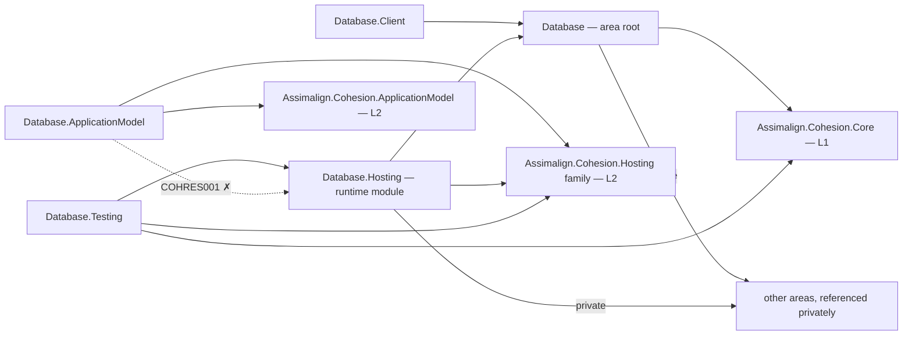

# Cohesion Data Platform (`resources/Database/`)

The multi-model OLTP database engine family for Cohesion: five independent database engines — **SQL**, **Documents**, **Graph**, **Blob**, and **KeyValuePair** — sharing one durable kernel (storage, write-ahead logging, transactions, indexing). A hosted database is an ordinary customer-owned `Sdk.Database` executable whose `Program.cs` composes its engines, code-first schema, servers, and provisioning. See [DESIGN.md](../../docs/resources/Database/DESIGN.md) for the architecture, requirements, and decision log; sequencing lives in [docs/programs/DATABASE_PROGRAM_PLAN.md](../../docs/programs/DATABASE_PROGRAM_PLAN.md).

## Area root, child roots, and model families

`Assimalign.Cohesion.Database` is the **area root**. It holds only what is true of
every model: engine, database, session, and transaction contracts; the provisioning
seam and compiled-schema identity; object ownership; value objects; and exceptions.
It composes the **child roots** `Types`, `Language`, `Storage`, `Transactions`,
`Indexing`, `Execution`, `Protocol`, `Security`, and `Governance`. The dependency
arrow always points **root → child**; a child root never references the area root.

**A project whose name contains a model segment — `*.Sql.*`, `*.Documents.*`,
`*.Graph.*`, `*.Blob.*`, or `*.KeyValuePair.*` — is a model family member. It inherits
the area root and owns its model's vocabulary.** Relational tables, document
collections, graph edges, and blob containers live in their model family, never in
the area root.

The placement test is: *if a different model would need a different shape of it,
it is not root material.* `CompiledSchema` identity is root material;
`CompiledSchemaTable` is not. The root previously carried the relational schema
model; feature A3 in [DATABASE_MVP_FEATURES.md](../../docs/programs/DATABASE_MVP_FEATURES.md)
moved it into `Database.Sql.Schema`. That package supplies SQL declarations,
compilation, canonical serialization, and migration planning, independently of the
SQL engine. The SDK build task consumes this thin package without referencing the
SQL engine or transports.

`DatabaseObjectOwner` distinguishes code-first `Schema` objects from `Adhoc`
objects. SQL persists ownership and refuses session DDL that alters or drops a
schema-owned object; only compiled-schema provisioning may change it. Ad-hoc
objects remain fully mutable through ad-hoc statements.

## Project map

An arrow means "references": `Database.Hosting --> Database` reads
`Database.Hosting` references `Assimalign.Cohesion.Database`.

Solid edges are the references this area permits. The dotted edge is the one `COHRES001`
rejects: **no library in the area may reference its own `Database.Hosting` runtime
module**, and the declarative `.ApplicationModel` package in particular never does — generated
code in an opted-in consumer executable joins the two sides at run time through
`Assimalign.Cohesion.Hosting.Resources.ResourceRuntime` instead. The area root and its feature
libraries likewise reference no `Assimalign.Cohesion.Hosting*` library at all (`COHRES004`).

`Database.Testing → Database.Hosting` is the one solid edge that crosses that line, and it is the
area's **single sanctioned exemption**: the test factory drives the concrete runtime, which cannot
be done through abstractions alone, so the project declares
`CohesionHostingIsolationExemptions` in its own csproj. Nothing else in the area may, and a second
holder needs the deviation protocol in `.claude/rules/deviations.md`.

The diagram is the area's **spine** — the root, the runtime module, the hosting-family
integrations, the declarative plane, and the client and test packages. The area has more
projects than one readable diagram holds; the table below and `docs/DEPENDENCIES.md` carry
them all.

The full reference graph for every Cohesion assembly, including the exact external dependencies
collapsed above, is in [docs/DEPENDENCIES.md](../../docs/DEPENDENCIES.md).

## Layering

In the repo's L1/L2/L3 model (see `docs/programs/DELIVERY_ROADMAP.md`), this area is **L3.2 — Data Platform**: a service platform built on the L1 foundation libraries (`Core`, `Connections`, `Hosting`, `Security`) and the L2 application runtime (`ApplicationModel`). It ships to consumers through the `Assimalign.Cohesion.Sdk.Database` MSBuild SDK and the `Assimalign.Cohesion.App.Database` shared framework.

## Project catalog

### Kernel (shared by every model)

| Project | Role |
|---|---|
| `Assimalign.Cohesion.Database` | Area root: engine/database/session/transaction contracts, exceptions, application composition, model-agnostic `CompiledSchema` identity and provisioning seam, and object ownership — **rolls up the child roots** (`Types`/`Language`/`Storage`/`Transactions`/`Execution`/`Indexing`/`Protocol`/`Security`/`Governance`; child roots never reference the root) |
| `Assimalign.Cohesion.Database.Storage` | Child root — pages, buffer pool, free-space map, journal (WAL), recovery, backup |
| `Assimalign.Cohesion.Database.Transactions` | Child root — MVCC snapshots, isolation levels, lock manager, transaction log seam, `TransactionId`/`TransactionState` |
| `Assimalign.Cohesion.Database.Indexing` | Order-preserving key encoding, B+Tree/hash index contracts, cursors (child root; rolled up by the root) |
| `Assimalign.Cohesion.Database.Types` | Child root — shared scalar type system: identity, comparison/collation, binary encoding |
| `Assimalign.Cohesion.Database.Execution` | Child root — query request/result families, execution pipeline contracts |
| `Assimalign.Cohesion.Database.Language` | Child root — shared lexer/parser/diagnostics infrastructure for the model languages |
| `Assimalign.Cohesion.Database.Memory` | In-memory storage strategy (tests, embedded scenarios) |

### Model engines

Each model follows the same matrix: root (engine + public interface), plus `.Language`*, `.Storage`, `.Catalog`, `.Client`, `.Security`, `.Replication` satellites.

| Model | Root project | Notes |
|---|---|---|
| SQL | `Assimalign.Cohesion.Database.Sql` | Ships the SQL engine, compiled-schema migration renderer/provisioner, the model's wire-protocol server (`SqlDatabaseServer`), the `SqlDatabaseServerOptions.Listen(Uri)` endpoint bridge, and the model builder verbs; declared dialect in `Sql.Language` |
| SQL schema | `Assimalign.Cohesion.Database.Sql.Schema` | Thin SQL schema declarations, compiled relational object shapes, canonical serialization, validation, and migration planning; shared by SQL and SDK Tasks, with direct references only to the area root and `Database.Types` |
| Documents | `Assimalign.Cohesion.Database.Documents` | Session-bound JSON document engine, OQL planning/execution, collection ownership, and transactional index management |
| Documents language | `Assimalign.Cohesion.Database.Documents.Language` | Declared OQL subset, AST, diagnostics, and conformance corpus |
| Documents catalog | `Assimalign.Cohesion.Database.Documents.Catalog` | Versioned collections, document metadata, and eagerly maintained shared B+Tree indexes |
| Documents storage | `Assimalign.Cohesion.Database.Documents.Storage` | UTF-8 JSON serialization and stamped chunk chains over shared storage and transactions |
| Graph | `Assimalign.Cohesion.Database.Graph` | Query standard selection (#193) gates language work |
| Blob | `Assimalign.Cohesion.Database.Blob` | Streaming blob and container API, database-bound sessions, engine lifecycle, and ownership enforcement over the shared kernel; no `.Language` project; wire client remains deferred |
| Blob storage | `Assimalign.Cohesion.Database.Blob.Storage` | Chunk chains backed by shared pages, WAL, recovery, and transactions; incremental stream reads and writes |
| Blob catalog | `Assimalign.Cohesion.Database.Blob.Catalog` | Durable containers, ownership markers, and per-blob metadata for name/prefix listing |
| Blob streaming fixture | `Assimalign.Cohesion.Database.Blob.StreamingFixture` | Non-packable process fixture under `Blob/fixtures/`, exercised by Blob tests to verify bounded-memory streams and crash recovery |
| KeyValuePair | `Assimalign.Cohesion.Database.KeyValuePair` | **Delivered** — ordered key space on the shared kernel (index-primary composition, etag CAS) and the model's wire-protocol server (`KeyValueDatabaseServer`); command grammar in `docs/COMMANDS.md`; no `.Language` project |
| Cache | `Assimalign.Cohesion.Database.Cache` | Post-MVP; deferred behind KeyValuePair |

### Service surface, hosting, orchestration

| Project | Role |
|---|---|
| `Assimalign.Cohesion.Database.Protocol` | Child root — wire protocol frames and message contracts (shared client/server), `ProtocolVersion` |
| `Assimalign.Cohesion.Database.Client` | Shared client core: connection strings, pooling, protocol client, and `DatabaseConnectionSettings.For(Uri)` for generated or ambient endpoints |
| `Assimalign.Cohesion.Database.Security` | Child root — authN/authZ contracts (principals, roles, permissions) |
| `Assimalign.Cohesion.Database.Replication` | Shared replication contracts (WAL log-shipping seam) |
| `Assimalign.Cohesion.Database.Governance` | Child root — quotas, tenancy boundaries, audit events |
| `Assimalign.Cohesion.Database.Hosting` | Host composition (`Host<TContext>`), the area's only DI seam; implements `DatabaseApplication.CreateBuilder(args)`, which honors an enabled executable's ambient `Hosting.Resources` `ResourceContext` and generated default-control-plane registration and stays plain otherwise. Additional services, including `builder.Provision`/`AddDatabase`, start before the per-model servers, so provisioning always precedes accept. The internal admin service privately hosts `Web.Hosting` + `Web.Health` for health, readiness, liveness, endpoint observation, commands, and graceful stop. |
| `Assimalign.Cohesion.Database.ApplicationModel` | Manifest-backed `DatabaseResource : PlannedResource`, `AddDatabase(manifest, options)`, the platform-neutral Database planner (stable identity, sized per-replica volume claims, one headless governing service), and the Database default-control-plane factory registered by generated executable code through `Hosting.Resources` |
| `Assimalign.Cohesion.Database.Testing` | The area's sole hosting-isolation exemption holder; `DatabaseApplicationTestFactory.FromProgram<Program>()` runs the resource's real entry point inside `Hosting.Resources` `ResourceRuntime.CreateScope(...)`, waits on the `admin` control plane, and stops it through the graceful control-plane path |
| `resources/Database/Assimalign.Cohesion.Database.Testing/fixtures/Assimalign.Cohesion.Database.SampleHost` | Non-packable `Sdk.Database` executable with `CohesionApplicationModel=enabled` and build-time schema compilation; composes a SQL table/index schema and the TCP server in `Program.cs`, provisions that compiled schema before accept, and supplies the real-process E2E apphost (`ReferenceOutputAssembly=false`) |
| `Assimalign.Cohesion.Database.Embedded` | In-process consumption facade — how other platform resources embed their data layer |

## Dependencies on other areas

- `libraries/Core` — foundational primitives (everywhere)
- `libraries/Hosting/Assimalign.Cohesion.Hosting` — host lifecycle and the per-service execution
  menu exposed by the concrete `DatabaseApplicationBuilder.AddService` verb in
  `Database.Hosting`. The Database root and feature libraries reference no hosting library (O34).
- `libraries/Hosting/Assimalign.Cohesion.Hosting.Resources` — the opt-in resource runtime,
  context, control-plane, and protected-mount contracts used by enabled executables and
  `Database.ApplicationModel`
- `libraries/Hosting/Assimalign.Cohesion.Hosting.Health` — transport-neutral health contribution
  contracts used by `Database.Hosting` and its default control plane
- `libraries/Connections` — transport drivers for the per-model servers (`Database.Sql`'s `SqlDatabaseServer`, and every future model's server)
- `libraries/ApplicationModel` — orchestration contracts (`Database.ApplicationModel` only)
- `resources/Web` — private implementation details: the root's existing Web dependency plus
  `Web.Hosting`/`Web.Health` in `Database.Hosting` for the `admin` control plane. The coordinated
  `CohesionPrivateProjectReference`/`CohesionFrameworkPrivateAssembly` path keeps that closure in
  the `App.Database` runtime pack and out of its reference surface.

## Building

The area solution is `Assimalign.Cohesion.Database.slnx`. Individual projects build with `dotnet build <project>` (build `build/Tasks` first in a fresh clone/worktree so the custom MSBuild tasks exist).
