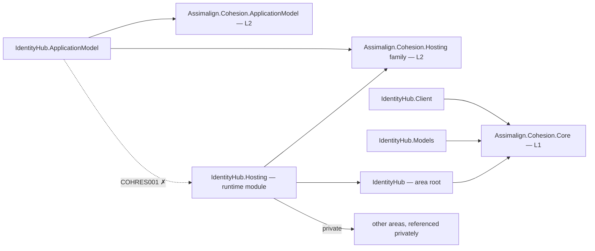

# IdentityHub

IdentityHub is the L3 identity service platform intended to manage tenants, directories, applications, principals, credentials, sessions, token services, federation, and provisioning.

The application builder configures a minimal code-first OpenID Connect issuer with persisted ES256 keys, client credentials, a loopback Local device-authorization flow, and a Cohesion resource control plane. Production HTTPS consumes a gateway-materialized `tls` Secret mount; the self-signed fallback is Local-only.

## Project map

An arrow means "references": `IdentityHub.Hosting --> IdentityHub` reads
`IdentityHub.Hosting` references `Assimalign.Cohesion.IdentityHub`.



Solid edges are the references this area permits. The dotted edge is the one `COHRES001`
rejects: **no library in the area may reference its own `IdentityHub.Hosting` runtime
module**, and the declarative `.ApplicationModel` package in particular never does — generated
code in an opted-in consumer executable joins the two sides at run time through
`Assimalign.Cohesion.Hosting.Resources.ResourceRuntime` instead. The area root and its feature
libraries likewise reference no `Assimalign.Cohesion.Hosting*` library at all (`COHRES004`).

The full reference graph for every Cohesion assembly, including the exact external dependencies
collapsed above, is in [docs/DEPENDENCIES.md](../../docs/DEPENDENCIES.md).

## Projects

- `Assimalign.Cohesion.IdentityHub` defines the public area-root application and builder contracts alongside the existing identity domain contracts.
- `Assimalign.Cohesion.IdentityHub.ApplicationModel` supplies the typed manifest resource, singleton stateful planner, and default control-plane factory used by orchestration-enabled executables.
- `Assimalign.Cohesion.IdentityHub.Hosting` provides the concrete creation entry point, issuer endpoints, key persistence, control-plane integration, and host lifecycle.
- `Assimalign.Cohesion.IdentityHub.Models` retains the existing tenant-directory DTO shapes while linking principals and credentials to the canonical `Assimalign.Cohesion.IdentityModel` contracts.

## Layering and dependencies

As an L3 service platform, IdentityHub composes the L2 `Assimalign.Cohesion.Hosting` runtime, which is built on the L1 `Assimalign.Cohesion.Core` foundation. The root and Models projects consume the L1 `Assimalign.Cohesion.IdentityModel` contracts; Models also retains Core for its generated ULID identifiers. The Hosting project depends only on the area root and shared Hosting runtime. The AOT-safe ApplicationModel project references only shared ApplicationModel and Hosting.Resources seams and is guarded by COHAM001.

The IdentityHub SDK's orchestration defaults describe one private `https` endpoint with readiness and liveness probes, one `data` Volume, and a single-replica `StatefulSet`. The planner also preserves optional non-persistent inputs such as the Hosting convention's `tls` mount. Runtime `AddAudience` and `AddClient` composition ships now; the generated resource control plane advertises identityhub.add-audience and identityhub.add-client for the corresponding declarative verbs.

## Project documentation

- [Root overview](./Assimalign.Cohesion.IdentityHub/docs/OVERVIEW.md)
- [Root design](./Assimalign.Cohesion.IdentityHub/docs/DESIGN.md)
- [ApplicationModel overview](./Assimalign.Cohesion.IdentityHub.ApplicationModel/docs/OVERVIEW.md)
- [ApplicationModel design](./Assimalign.Cohesion.IdentityHub.ApplicationModel/docs/DESIGN.md)
- [Hosting overview](./Assimalign.Cohesion.IdentityHub.Hosting/docs/OVERVIEW.md)
- [Hosting design](./Assimalign.Cohesion.IdentityHub.Hosting/docs/DESIGN.md)
- [Models overview](./Assimalign.Cohesion.IdentityHub.Models/docs/OVERVIEW.md)
- [Models design](./Assimalign.Cohesion.IdentityHub.Models/docs/DESIGN.md)

## Declarative control-plane commands

| Wire kind | Descriptor verb | Ownership key |
|---|---|---|
| `identityhub.add-audience` | `AddAudience` | audience name |
| `identityhub.add-client` | `AddClient` | client id |

The [ApplicationModel](Assimalign.Cohesion.IdentityHub.ApplicationModel/docs/OVERVIEW.md) declares
commands; [Hosting](Assimalign.Cohesion.IdentityHub.Hosting/docs/DESIGN.md) applies them; the Core-only
[Client](Assimalign.Cohesion.IdentityHub.Client/docs/OVERVIEW.md) delivers them for the gateway.
ApplicationModel and Client are standalone NuGet packages.

## Application composition (O34)

The root contracts are hosting-free (O34): `IIdentityHubApplication` exposes `Context`, `StartAsync`, and `StopAsync`; `IIdentityHubApplicationContext` exposes `ContentRootPath`. `IIdentityHubApplicationBuilder` owns area declarations and `Build()`. The root and feature packages reference no `Assimalign.Cohesion.Hosting*` library; COHRES004 enforces the boundary.

`IdentityHubApplication.CreateBuilder(args)` returns the public concrete `IdentityHubApplicationBuilder`; its `Build()` returns the public `IdentityHubApplication : Host<IdentityHubApplicationContext>`. The public `IdentityHubApplicationContext` implements `IIdentityHubApplicationContext`, reading `ContentRootPath` from the host environment. The application explicitly forwards the root lifecycle contract to `IHost`, and consumers use the concrete application for `RunAsync` and `await using`. Runtime options and supporting services remain internal.

```csharp
using Assimalign.Cohesion.IdentityHub.Hosting;

IdentityHubApplicationBuilder builder = IdentityHubApplication.CreateBuilder(args);
// Add area declarations and optional hosting services before Build().
await using IdentityHubApplication application = builder.Build();
await application.RunAsync();
```
