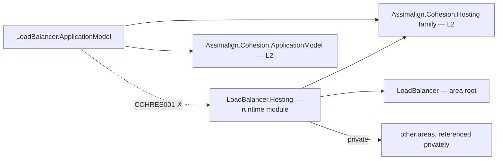

# LoadBalancer

LoadBalancer is the L3 networking service platform intended to manage backend pools, health probes, routing and affinity policy, draining, failover, and load-balancing decisions.

The host supports enabled-resource control planes; domain services remain fillers pending the area program.

## Project map

An arrow means "references": `LoadBalancer.Hosting --> LoadBalancer` reads
`LoadBalancer.Hosting` references `Assimalign.Cohesion.LoadBalancer`.



Solid edges are the references this area permits. The dotted edge is the one `COHRES001`
rejects: **no library in the area may reference its own `LoadBalancer.Hosting` runtime
module**, and the declarative `.ApplicationModel` package in particular never does — generated
code in an opted-in consumer executable joins the two sides at run time through
`Assimalign.Cohesion.Hosting.Resources.ResourceRuntime` instead. The area root and its feature
libraries likewise reference no `Assimalign.Cohesion.Hosting*` library at all (`COHRES004`).

The full reference graph for every Cohesion assembly, including the exact external dependencies
collapsed above, is in [docs/DEPENDENCIES.md](../../docs/DEPENDENCIES.md).

## Projects

- `Assimalign.Cohesion.LoadBalancer` defines the public area-root application and builder contracts.
- `Assimalign.Cohesion.LoadBalancer.Hosting` provides the concrete creation entry point and host lifecycle with explicit `IHostService` registration.

- `Assimalign.Cohesion.LoadBalancer.ApplicationModel` supplies the typed manifest, planner, descriptor, and default control-plane factory as a NuGet-only package.

## Layering and dependencies

As an L3 service platform, LoadBalancer composes the L2 `Assimalign.Cohesion.Hosting` runtime, which is built on the L1 `Assimalign.Cohesion.Core` foundation. The root project also depends on the L1 `Assimalign.Cohesion.Http` library for HTTP-facing primitives; Hosting additionally consumes the resource/health contracts and privately composes the Web control-plane listener.

## Project documentation

- [Root overview](./Assimalign.Cohesion.LoadBalancer/docs/OVERVIEW.md)
- [Root design](./Assimalign.Cohesion.LoadBalancer/docs/DESIGN.md)
- [Hosting overview](./Assimalign.Cohesion.LoadBalancer.Hosting/docs/OVERVIEW.md)
- [Hosting design](./Assimalign.Cohesion.LoadBalancer.Hosting/docs/DESIGN.md)

## Application composition (O34)

The root contracts are hosting-free (O34): `ILoadBalancerApplication` exposes `Context`, `StartAsync`, and `StopAsync`; `ILoadBalancerApplicationContext` exposes `ContentRootPath`. `ILoadBalancerApplicationBuilder` exposes `Build()`; it currently declares no area-specific verbs. The root and feature packages reference no `Assimalign.Cohesion.Hosting*` library; COHRES004 enforces the boundary.

`LoadBalancerApplication.CreateBuilder(args)` returns the public concrete `LoadBalancerApplicationBuilder`; its `Build()` returns the public `LoadBalancerApplication : Host<LoadBalancerApplicationContext>`. The public `LoadBalancerApplicationContext` implements `ILoadBalancerApplicationContext`, reading `ContentRootPath` from the host environment. The application explicitly forwards the root lifecycle contract to `IHost`, and consumers use the concrete application for `RunAsync` and `await using`. Runtime options and supporting services remain internal.

```csharp
using Assimalign.Cohesion.LoadBalancer.Hosting;

LoadBalancerApplicationBuilder builder = LoadBalancerApplication.CreateBuilder(args);
// Add area declarations and optional hosting services before Build().
await using LoadBalancerApplication application = builder.Build();
await application.RunAsync();
```

The unused public `IHostBuilder.AddLoadBalancer()` shim was removed by O34. The ApplicationModel descriptor verb is unchanged.
