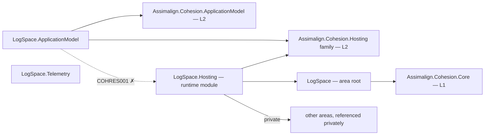

# LogSpace

LogSpace is the L3 observability service platform intended to provide append-only log ingestion, indexing, retention, archival, query, correlation lookup, and export.

The enabled host receives authenticated OTLP/HTTP JSON logs over HTTPS, persists append-only segments under its data mount, and serves bounded authenticated NDJSON queries. Retention, archival and Database.Embedded consumption are deferred.

## Project map

An arrow means "references": `LogSpace.Hosting --> LogSpace` reads
`LogSpace.Hosting` references `Assimalign.Cohesion.LogSpace`.



Solid edges are the references this area permits. The dotted edge is the one `COHRES001`
rejects: **no library in the area may reference its own `LogSpace.Hosting` runtime
module**, and the declarative `.ApplicationModel` package in particular never does — generated
code in an opted-in consumer executable joins the two sides at run time through
`Assimalign.Cohesion.Hosting.Resources.ResourceRuntime` instead. The area root and its feature
libraries likewise reference no `Assimalign.Cohesion.Hosting*` library at all (`COHRES004`).

The full reference graph for every Cohesion assembly, including the exact external dependencies
collapsed above, is in [docs/DEPENDENCIES.md](../../docs/DEPENDENCIES.md).

## Projects

- `Assimalign.Cohesion.LogSpace` defines the public area-root application and builder contracts.
- `Assimalign.Cohesion.LogSpace.Hosting` owns HTTPS ingest/query, scoped-token verification, mounted segments and host lifecycle.
- `libraries/ApplicationModel/Assimalign.Cohesion.ApplicationModel.Gateway/fixtures/Assimalign.Cohesion.LogSpace.SinkHost` is the real executable used by LocalGateway acceptance tests.
- `Assimalign.Cohesion.LogSpace.Telemetry` reserves the area-specific telemetry integration surface and is currently project scaffolding.

- `Assimalign.Cohesion.LogSpace.ApplicationModel` supplies the typed manifest, planner, descriptor, and default control-plane factory as a NuGet-only package.

## Layering and dependencies

As an L3 service platform, LogSpace composes the L2 `Assimalign.Cohesion.Hosting` runtime rather than defining its own host lifecycle. Hosting is built on the L1 `Assimalign.Cohesion.Core` foundation; Hosting privately composes Web.Hosting.Resources, Web.Hosting, HTTP, and TCP for its resource listener.

## Project documentation

- [Root overview](./Assimalign.Cohesion.LogSpace/docs/OVERVIEW.md)
- [Root design](./Assimalign.Cohesion.LogSpace/docs/DESIGN.md)
- [Hosting overview](./Assimalign.Cohesion.LogSpace.Hosting/docs/OVERVIEW.md)
- [Hosting design](./Assimalign.Cohesion.LogSpace.Hosting/docs/DESIGN.md)

## Application composition (O34)

The root contracts are hosting-free (O34): `ILogSpaceApplication` exposes `Context`, `StartAsync`, and `StopAsync`; `ILogSpaceApplicationContext` exposes `ContentRootPath`. `ILogSpaceApplicationBuilder` exposes `Build()`; it currently declares no area-specific verbs. The root and feature packages reference no `Assimalign.Cohesion.Hosting*` library; COHRES004 enforces the boundary.

`LogSpaceApplication.CreateBuilder(args)` returns the public concrete `LogSpaceApplicationBuilder`; its `Build()` returns the public `LogSpaceApplication : Host<LogSpaceApplicationContext>`. The public `LogSpaceApplicationContext` implements `ILogSpaceApplicationContext`, reading `ContentRootPath` from the host environment. The application explicitly forwards the root lifecycle contract to `IHost`, and consumers use the concrete application for `RunAsync` and `await using`. Runtime options and supporting services remain internal.

```csharp
using Assimalign.Cohesion.LogSpace.Hosting;

LogSpaceApplicationBuilder builder = LogSpaceApplication.CreateBuilder(args);
// Add area declarations and optional hosting services before Build().
await using LogSpaceApplication application = builder.Build();
await application.RunAsync();
```

The unused public `IHostBuilder.AddLogSpace()` shim was removed by O34. The ApplicationModel descriptor verb is unchanged.
