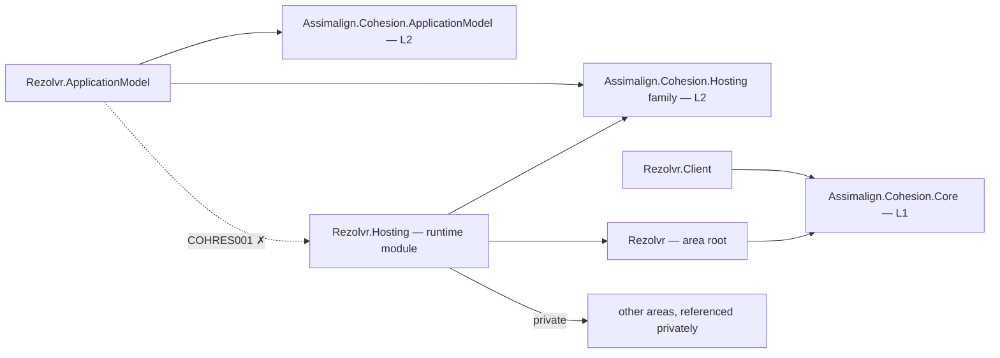

# Rezolvr

Rezolvr is the L3 networking service platform intended to be a standalone DNS server with authoritative zones, forwarding and recursive resolution, caching, transfers, and administration.

Rezolvr is a DNS server product and is never the service-discovery subsystem. Discovery uses observed endpoints, Service DNS, and export documents.

The host supports enabled-resource control planes; domain services remain fillers pending the area program.

## Project map

An arrow means "references": `Rezolvr.Hosting --> Rezolvr` reads
`Rezolvr.Hosting` references `Assimalign.Cohesion.Rezolvr`.



Solid edges are the references this area permits. The dotted edge is the one `COHRES001`
rejects: **no library in the area may reference its own `Rezolvr.Hosting` runtime
module**, and the declarative `.ApplicationModel` package in particular never does — generated
code in an opted-in consumer executable joins the two sides at run time through
`Assimalign.Cohesion.Hosting.Resources.ResourceRuntime` instead. The area root and its feature
libraries likewise reference no `Assimalign.Cohesion.Hosting*` library at all (`COHRES004`).

The full reference graph for every Cohesion assembly, including the exact external dependencies
collapsed above, is in [docs/DEPENDENCIES.md](../../docs/DEPENDENCIES.md).

## Projects

- `Assimalign.Cohesion.Rezolvr` defines the public area-root application and builder contracts for the standalone server product.
- `Assimalign.Cohesion.Rezolvr.Hosting` provides the concrete creation entry point and the caller-configurable host-service lifecycle.

- `Assimalign.Cohesion.Rezolvr.ApplicationModel` supplies the typed manifest, planner, descriptor, and default control-plane factory as a NuGet-only package.

## Layering and dependencies

As an L3 service platform, Rezolvr composes the L2 `Assimalign.Cohesion.Hosting` runtime rather than defining its own host lifecycle. Hosting is built on the L1 `Assimalign.Cohesion.Core` foundation; Hosting privately composes Web.Hosting.Resources, Web.Hosting, HTTP, and TCP for its resource listener.

## Project documentation

- [Root overview](./Assimalign.Cohesion.Rezolvr/docs/OVERVIEW.md)
- [Root design](./Assimalign.Cohesion.Rezolvr/docs/DESIGN.md)
- [Hosting overview](./Assimalign.Cohesion.Rezolvr.Hosting/docs/OVERVIEW.md)
- [Hosting design](./Assimalign.Cohesion.Rezolvr.Hosting/docs/DESIGN.md)

## Declarative control-plane commands

| Wire kind | Descriptor verb | Ownership key |
|---|---|---|
| `rezolvr.add-a-record` | `AddARecord` | record name |
| `rezolvr.add-cname-record` | `AddCnameRecord` | record name |

The [ApplicationModel](Assimalign.Cohesion.Rezolvr.ApplicationModel/docs/OVERVIEW.md) declares
commands; [Hosting](Assimalign.Cohesion.Rezolvr.Hosting/docs/DESIGN.md) applies them; the Core-only
[Client](Assimalign.Cohesion.Rezolvr.Client/docs/OVERVIEW.md) delivers them for the gateway.
ApplicationModel and Client are standalone NuGet packages.

## Application composition (O34)

The root contracts are hosting-free (O34): `IRezolvrApplication` exposes `Context`, `StartAsync`, and `StopAsync`; `IRezolvrApplicationContext` exposes `ContentRootPath`. `IRezolvrApplicationBuilder` exposes `Build()`; it currently declares no area-specific verbs. The root and feature packages reference no `Assimalign.Cohesion.Hosting*` library; COHRES004 enforces the boundary.

`RezolvrApplication.CreateBuilder(args)` returns the public concrete `RezolvrApplicationBuilder`; its `Build()` returns the public `RezolvrApplication : Host<RezolvrApplicationContext>`. The public `RezolvrApplicationContext` implements `IRezolvrApplicationContext`, reading `ContentRootPath` from the host environment. The application explicitly forwards the root lifecycle contract to `IHost`, and consumers use the concrete application for `RunAsync` and `await using`. Runtime options and supporting services remain internal.

```csharp
using Assimalign.Cohesion.Rezolvr.Hosting;

RezolvrApplicationBuilder builder = RezolvrApplication.CreateBuilder(args);
// Add area declarations and optional hosting services before Build().
await using RezolvrApplication application = builder.Build();
await application.RunAsync();
```
