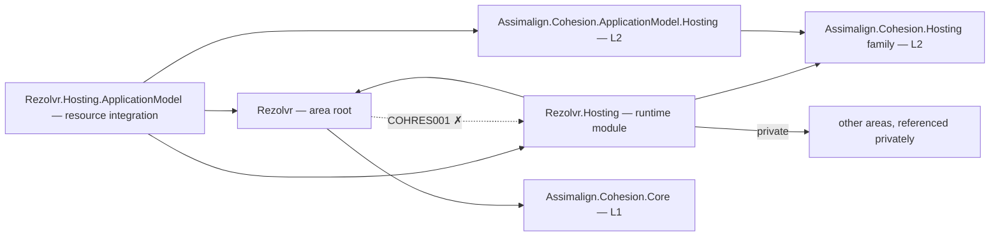

# Rezolvr

Rezolvr is the L3 networking service platform intended to be a standalone DNS server with authoritative zones, forwarding and recursive resolution, caching, transfers, and administration.

Rezolvr is a DNS server product and is never the service-discovery subsystem. Discovery uses observed endpoints, Service DNS, and export documents.

A Rezolvr application becomes a managed resource instance with `Assimalign.Cohesion.Rezolvr.Hosting.ApplicationModel`: `builder.Services.AddResource("resolver", resource => resource.UseInProcess())` joins the gateway that runs it through the platform it opted into. Domain services remain fillers pending the area program.

## Project map

An arrow means "references": `Rezolvr.Hosting --> Rezolvr` reads
`Rezolvr.Hosting` references `Assimalign.Cohesion.Rezolvr`.


```mermaid
flowchart LR
    P0["Rezolvr — area root"]
    P3["Rezolvr.Hosting — runtime module"]
    PAM["Rezolvr.Hosting.ApplicationModel — resource integration"]
    AMH["Assimalign.Cohesion.ApplicationModel.Hosting — L2"]
    CORE["Assimalign.Cohesion.Core — L1"]
    HOSTFAM["Assimalign.Cohesion.Hosting family — L2"]
    PRIV["other areas, referenced privately"]
    P0 --> CORE
    P3 --> HOSTFAM
    P3 --> P0
    P3 -->|"private"| PRIV
    PAM --> P3
    PAM --> P0
    PAM --> AMH
    AMH --> HOSTFAM
    P0 -.->|"COHRES001 ✗"| P3
```

Solid edges are the references this area permits. The dotted edge is the one `COHRES001`
rejects: **no library in the area may reference its own `Rezolvr.Hosting` runtime
module**. The area root and its feature
libraries likewise reference no `Assimalign.Cohesion.Hosting*` library at all (`COHRES004`).

The one exception is the resource integration, `Rezolvr.Hosting.ApplicationModel`, which joins
the runtime module to the application model's hosting; `COHRES001` sanctions that
reference by the integration's exact name, with no exemption property.

The full reference graph for every Cohesion assembly, including the exact external dependencies
collapsed above, is in [docs/DEPENDENCIES.md](../../docs/DEPENDENCIES.md).

## Projects

- `Assimalign.Cohesion.Rezolvr` defines the public area-root application and builder contracts for the standalone server product.
- `Assimalign.Cohesion.Rezolvr.Hosting` provides the concrete creation entry point and the caller-configurable host-service lifecycle.
- `Assimalign.Cohesion.Rezolvr.Hosting.ApplicationModel` registers the application as a managed resource instance (`builder.Services.AddResource(name, ...)`) on the platform its gateway names, with the actions the application adds.

## Layering and dependencies

As an L3 service platform, Rezolvr composes the L2 `Assimalign.Cohesion.Hosting` runtime rather than defining its own host lifecycle. Hosting is built on the L1 `Assimalign.Cohesion.Core` foundation.

## Project documentation

- [Root overview](./Assimalign.Cohesion.Rezolvr/docs/OVERVIEW.md)
- [Root design](./Assimalign.Cohesion.Rezolvr/docs/DESIGN.md)
- [Hosting overview](./Assimalign.Cohesion.Rezolvr.Hosting/docs/OVERVIEW.md)
- [Hosting design](./Assimalign.Cohesion.Rezolvr.Hosting/docs/DESIGN.md)
- [Resource integration overview](./Assimalign.Cohesion.Rezolvr.Hosting.ApplicationModel/docs/OVERVIEW.md)
- [Resource integration design](./Assimalign.Cohesion.Rezolvr.Hosting.ApplicationModel/docs/DESIGN.md)

## Application composition (O34)

The root contracts are hosting-free (O34): `IRezolvrApplication` exposes `Context`, `StartAsync`, and `StopAsync`; `IRezolvrApplicationContext` exposes `ContentRootPath`. `IRezolvrApplicationBuilder` exposes `Build()`; it currently declares no area-specific verbs. The root and feature packages reference no `Assimalign.Cohesion.Hosting*` library; COHRES004 enforces the boundary.

`RezolvrApplication.CreateBuilder(args)` returns the public concrete `RezolvrApplicationBuilder`; its `Build()` returns the public `RezolvrApplication : Host<RezolvrApplicationContext>`. The public `RezolvrApplicationContext` implements `IRezolvrApplicationContext`, reading `ContentRootPath` from the host environment. The application explicitly forwards the root lifecycle contract to `IHost`, and consumers use the concrete application for `RunAsync` and `await using`. Runtime options and supporting services remain internal.

```csharp
using Assimalign.Cohesion.Rezolvr.Hosting;

RezolvrApplicationBuilder builder = RezolvrApplication.CreateBuilder(args);
// Add area declarations and optional hosting services before Build().
await using RezolvrApplication application = builder.Build();
await application.RunAsync();
```
