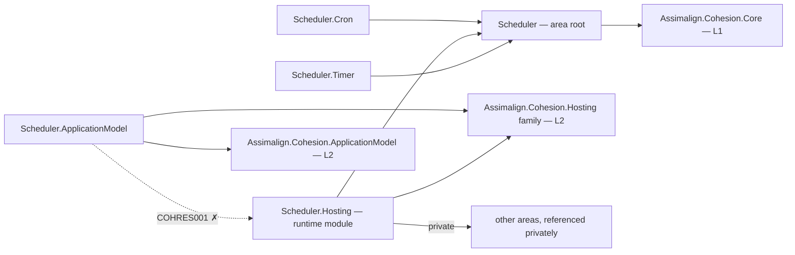

# Scheduler

Scheduler is the L3 Cohesion resource for declaring jobs and binding them to trigger providers. The executable host runs every declared schedule, reports health through the resource control plane, and drains an active occurrence during graceful shutdown.

Jobs are declarations, not one-shot work: AddJob creates a dormant job. AddCronSchedule and AddTimerSchedule bind that job to a provider. An unbound job never executes.

## Project map

An arrow means "references": `Scheduler.Hosting --> Scheduler` reads
`Scheduler.Hosting` references `Assimalign.Cohesion.Scheduler`.



Solid edges are the references this area permits. The dotted edge is the one `COHRES001`
rejects: **no library in the area may reference its own `Scheduler.Hosting` runtime
module**, and the declarative `.ApplicationModel` package in particular never does — generated
code in an opted-in consumer executable joins the two sides at run time through
`Assimalign.Cohesion.Hosting.Resources.ResourceRuntime` instead. The area root and its feature
libraries likewise reference no `Assimalign.Cohesion.Hosting*` library at all (`COHRES004`).

The full reference graph for every Cohesion assembly, including the exact external dependencies
collapsed above, is in [docs/DEPENDENCIES.md](../../docs/DEPENDENCIES.md).

## Projects

- Assimalign.Cohesion.Scheduler contains the public application, job, schedule, provider, and context contracts.
- Assimalign.Cohesion.Scheduler.Hosting contains the public concrete application, builder, and context, plus the internal execution service and http control-plane listener.
- Assimalign.Cohesion.Scheduler.Cron implements exact five-field cron parsing and occurrence evaluation.
- Assimalign.Cohesion.Scheduler.Timer implements fixed-delay timer occurrences.
- Assimalign.Cohesion.Scheduler.ApplicationModel provides the opt-in typed resource and singleton stateless planner.

## Runtime shape

The root is the cross-package composition seam. Feature packages depend on the root and register internal providers through ISchedulerApplicationBuilder. Hosting consumes only root contracts. Enabled resources expose health, readiness, liveness, endpoint discovery, command discovery, and graceful stop routes on the SDK-declared http endpoint.

Scheduler is deliberately singleton until leader election or distributed occurrence coordination is designed. Persistence, retry policy execution, misfire handling, and distributed ownership remain future work.

## Documentation

- [Root design](./Assimalign.Cohesion.Scheduler/docs/DESIGN.md)
- [Hosting design](./Assimalign.Cohesion.Scheduler.Hosting/docs/DESIGN.md)
- [Cron design](./Assimalign.Cohesion.Scheduler.Cron/docs/DESIGN.md)
- [Timer design](./Assimalign.Cohesion.Scheduler.Timer/docs/DESIGN.md)
- [Application-model design](./Assimalign.Cohesion.Scheduler.ApplicationModel/docs/DESIGN.md)

## Application composition (O34)

The root contracts are hosting-free (O34): `ISchedulerApplication` exposes `Context`, `StartAsync`, and `StopAsync`; `ISchedulerApplicationContext` exposes `ContentRootPath` plus the immutable `Jobs` and `ScheduleProviders` snapshots. `ISchedulerApplicationBuilder` owns area declarations and `Build()`. The root and feature packages reference no `Assimalign.Cohesion.Hosting*` library; COHRES004 enforces the boundary.

`SchedulerApplication.CreateBuilder(args)` returns the public concrete `SchedulerApplicationBuilder`; its `Build()` returns the public `SchedulerApplication : Host<SchedulerApplicationContext>`. The public `SchedulerApplicationContext` implements `ISchedulerApplicationContext`, reading `ContentRootPath` from the host environment. The application explicitly forwards the root lifecycle contract to `IHost`, and consumers use the concrete application for `RunAsync` and `await using`. Runtime options and supporting services remain internal.

```csharp
using Assimalign.Cohesion.Scheduler.Hosting;

SchedulerApplicationBuilder builder = SchedulerApplication.CreateBuilder(args);
// Add area declarations and optional hosting services before Build().
await using SchedulerApplication application = builder.Build();
await application.RunAsync();
```
