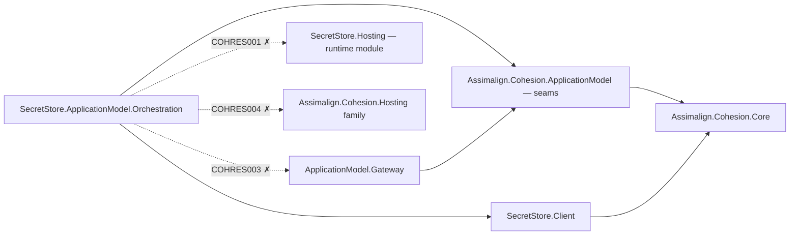
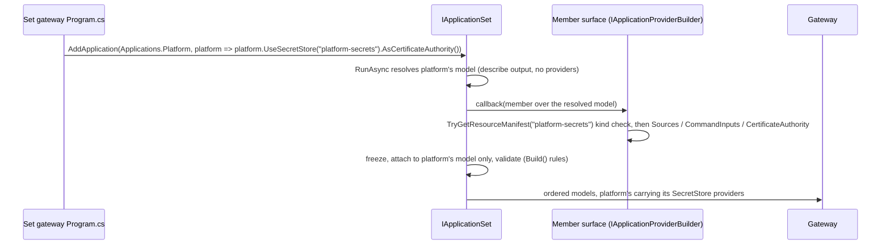
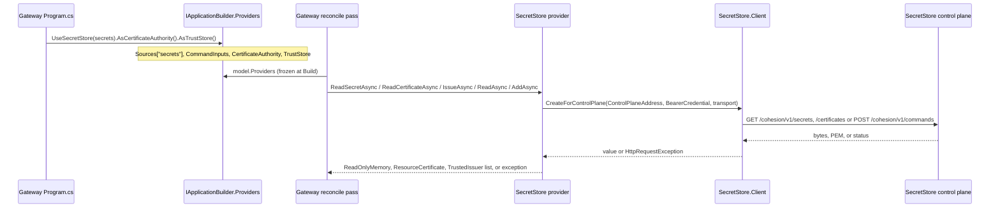

# Assimalign.Cohesion.SecretStore.ApplicationModel.Orchestration Design

## Design intent

Resources consume libraries; libraries never depend on resources. The gateway
(`Assimalign.Cohesion.ApplicationModel.Gateway`) therefore resolves mount sources, TLS leaves,
trusted issuers, and command inputs only through the provider registrations in
`IApplicationModel.Providers`, and it knows nothing about any store's wire protocol. This package
holds the SecretStore half of that knowledge — the routes, reserved names, command kinds, id
derivation, and document formats the gateway used to hard-code — as implementations of the
ApplicationModel seams.

It is opt-in by construction (owner decision 1 of the BYO design, 2026-09-25): a gateway gets
SecretStore behaviour only when its project references this package and its `Program.cs` calls
`builder.UseSecretStore(store)`. Nothing is injected by an SDK or registered by convention.

## Family map and dependency direction

An arrow means "references". Solid edges are the references the package has; dotted edges are the
references it may never have.

| Package | Role | Relationship |
| --- | --- | --- |
| `Assimalign.Cohesion.SecretStore.ApplicationModel.Orchestration` | Gateway-side SecretStore providers and the `UseSecretStore` verb | This package |
| `Assimalign.Cohesion.ApplicationModel` | `ApplicationProviders` and the provider interfaces | Referenced (Core-only) |
| `Assimalign.Cohesion.SecretStore.Client` | Core-only `/cohesion/v1` HTTP client | Referenced (Core-only) |
| `Assimalign.Cohesion.ApplicationModel.Gateway` | Calls the providers it finds in `model.Providers` | Never referenced (`COHRES003`); it references neither this package nor the client |
| `Assimalign.Cohesion.SecretStore.Hosting` | Serves the control plane the providers call | Never referenced (`COHRES001`) |
| `Assimalign.Cohesion.SecretStore.ApplicationModel` | Declares the SecretStore resource | Never referenced: its `Hosting.Resources` reference would put a Hosting library in this package's closure (`COHRES004`) |

In words: the package references exactly `Assimalign.Cohesion.ApplicationModel` and
`Assimalign.Cohesion.SecretStore.Client`, both of which reference only
`Assimalign.Cohesion.Core`. It never references the SecretStore runtime module, any
`Assimalign.Cohesion.Hosting*` library, any `ApplicationModel.Gateway*` library, or the declarative
`SecretStore.ApplicationModel` package. The build guards in `build/Targets/Build.Rules.targets`
enforce the first three. It is NuGet-only and never an `App.SecretStore` framework member, so the
client stays framework-eligible and the store's wire knowledge reaches only gateways that opt in.

The `RootNamespace` is `Assimalign.Cohesion.ApplicationModel`, the namespace the area
ApplicationModel packages share, so a gateway composes every area with one `using`. Public types
carry the `SecretStore` prefix to stay unambiguous in that namespace; internal types live in
`Assimalign.Cohesion.ApplicationModel.Internal`.

## Registration

`UseSecretStore` has two overloads, one per registration surface; both write into that surface's
`ApplicationProviders`, and the optional roles hang off the `SecretStoreProviderBuilder` handle both
return.

- `extension(IApplicationBuilder).UseSecretStore(IApplicationResourceDescriptor store)` — the
  builder form, taking the descriptor the area verb returned. An application built in code uses this
  form; it writes `IApplicationBuilder.Providers`.
- `extension(IApplicationProviderBuilder).UseSecretStore(ResourceName store)` — the by-name form. It
  exists for application-set members: a member's model is imported from its describe output, which
  carries no providers and has no descriptors, so the set gateway registers the member's store by
  name inside `set.AddApplication(Applications.X, member => member.UseSecretStore("secrets"))`. It
  writes `IApplicationProviderBuilder.Providers`.

`IApplicationBuilder` and `IApplicationProviderBuilder` are separate interfaces (owner decision O45,
2026-09-27): the builder does not extend the member surface, so the by-name form is not a builder
verb. The default builder implements both, so code holding it can cast it to
`IApplicationProviderBuilder` and call the by-name form, which is what this package's tests do.

| Call | Writes |
| --- | --- |
| `builder.UseSecretStore(store)` or `member.UseSecretStore("store")` | `Providers.Sources[store name] = new SecretStoreSourceProvider()`; adds one `SecretStoreAddSecretInputResolver` to `Providers.CommandInputs` |
| `.AsCertificateAuthority()` | `Providers.CertificateAuthority = new(store name, new SecretStoreCertificateAuthority())` |
| `.AsTrustStore()` | `Providers.TrustStore = new(store name, new SecretStoreTrustedIssuerStore())` |

The handle's `Providers` is the `ApplicationProviders` of the surface the store was registered on
(`IApplicationBuilder.Providers` for a builder, `IApplicationProviderBuilder.Providers` for a member);
the role methods write only that instance.

- **Idempotent.** Calling a verb again for the same store keeps the existing registration. The
  add-secret resolver is store-agnostic — it resolves through the gateway's
  `IResourceSourceResolver` — so a second store adds a second source, not a second resolver.
- **Never a silent replacement.** A different provider under the store's source name, a resolver
  of another type for `secretstore.add-secret`, or a certificate authority or trust store already
  bound to another provider or resource is an `InvalidOperationException` naming what is
  registered. Every conflict is checked before anything is written, so a refused call leaves
  `Providers` as it found it. An application that wants something else there removes the other
  registration first.
- **Early kind check.** A manifest-backed descriptor whose kind is not `SecretStore` (compared
  case-insensitively, the rule the gateway uses) is an `ArgumentException`. The by-name overload
  applies the same check to the manifest `IApplicationProviderBuilder.TryGetResourceManifest` finds —
  for a set member, the resolved member model's resource — and names the resource's application in
  the message (the lookup also finds another application's external or `--realize` closure resource).
  A descriptor that is not manifest-backed, or a name the surface does not know yet, is accepted; the
  ApplicationModel's provider validation checks every binding against the model — the resource
  exists, belongs to the declaring application, and has the `ResourceKind` the provider declares —
  at `Build()` for a builder and at set start for a member.
- Every provider declares `ResourceKind = "SecretStore"`, so a binding can only ever name a
  SecretStore resource of the application. Cross-application store sources are rejected by that
  validation (owner decision 4), for set members as for builders.
- **The add-secret resolver is required, not optional.** The SecretStore manifest marks
  `secretstore.add-secret` `requiresInputResolver` (owner decision of 2026-09-28), so the same
  validation fails when an application declares `AddSecret` and no resolver for that kind is in its
  `Providers.CommandInputs`. For one of its own stores the error names this package and
  `builder.UseSecretStore(...)`; for a store of another application, which `UseSecretStore` cannot
  bind, it asks for an `IResourceCommandInputResolver` in `Providers.CommandInputs` instead — a
  `SecretStoreAddSecretInputResolver` added there directly satisfies it. The store still refuses an
  unresolved add-secret at delivery, as defense in depth.
- **Per member, never inherited.** On an application set each member's callback gets its own
  surface; a member's roles are exactly what its own `UseSecretStore(...)` chain registered. One
  member's certificate authority or trust store never becomes another member's, and a member whose
  resources read a store it did not register, or that declares `AddSecret` with no add-secret
  resolver registered, fails at set start naming the member and the
  `application.UseSecretStore("<store>")` call to add.

## Call path

At run time the gateway hands each provider a `ResourceProviderConnection` to the bound store — its
control-plane address (observed endpoint plus the manifest control-plane path), the store's
audience-bound bearer credential for the reconcile pass, and the transport-trust validator — and
the provider turns it into one SecretStore client call sequence. The gateway mints that credential
with purpose `ResourceAccess` through the application's registered `IApplicationCredentialIssuer`
(`Providers.CredentialIssuer`), or through the default ES256 application-key issuer when none is
registered or the registered issuer returns `null`. An application that registers its own issuer
must also register a matching `IResourceCredentialVerifier` on the store
(`ResourceRuntime.RegisterCredentialVerifier`), which the store consults before its default ES256
verification.

The add-secret resolver is the exception: it makes no store call of its own. The gateway gives it
the declared command and an `IResourceSourceResolver`, and the resolver asks that resolver for the
declared source before the gateway delivers the rewritten payload to the target store.

## Wire behaviour

`<cp>` is the connection's control-plane address, `https://host:port/cohesion/v1` for every
SecretStore (the SecretStore planner fixes the manifest control-plane path at `/cohesion/v1`).
Every request carries `Authorization: Bearer <credential>`.

| Member | Requests | Result |
| --- | --- | --- |
| `SecretStoreSourceProvider.ReadSecretAsync` | `GET <cp>/secrets?path=<key>` | Response bytes |
| `SecretStoreSourceProvider.ReadCertificateAsync` | `GET <cp>/certificates?name=<key>`, then `GET <cp>/certificates?name=ca/root` | `ResourceCertificate(bundle, root)` |
| `SecretStoreCertificateAuthority.IssueAsync` | `GET <cp>/certificates?name=certs/<leaf>`, then `GET <cp>/certificates?name=ca/root` | `ResourceCertificate(bundle, root)` |
| `SecretStoreTrustedIssuerStore.ReadAsync` | `GET <cp>/secrets?path=trusted-issuers.json` | Parsed issuers; `null` on `404` |
| `SecretStoreTrustedIssuerStore.AddAsync` | `POST <cp>/commands` with a `cohesion.trust.add` envelope | Completes on `2xx` |
| `SecretStoreAddSecretInputResolver.ResolveAsync` | None (resolves through the gateway) | `{"path","source","resolvedValue"}` |

- **Trust grant.** Key = issuer name; owner = the gateway's `model.Owner`; payload = the issuer's
  public JWK exactly as parsed (`JsonElement.GetRawText()`), or
  `{"trustKey":<jwk>,"allowedCommandKinds":[...]}` for a restricted grant (kinds sorted and
  de-duplicated by `TrustedIssuer`); id = `trust-` + lowercase hex SHA-256 of UTF-8
  `owner + "\n" + issuer + "\n"` followed by the payload bytes. An identical grant therefore always
  carries the same id and is idempotent at the store.
- **Trusted-issuers document.** `{"issuers":[{"issuer","trustKey","allowedCommandKinds"?}]}`; the
  store's extra `owner` member is ignored. The parse rules and failure messages are the gateway's
  own reader.
- **Add-secret payload.** Declared `{"path","source"}` becomes
  `{"path":<command key>,"source":<source>,"resolvedValue":<base64>}`. The source must be
  `parameter:<name>` or `<resource>:<key>` (exactly one `:`, both sides nonblank); `literal:`
  (any case) is refused because declarations never carry secret material. The resolved bytes exist
  only in the delivery envelope.

### Equivalence with the gateway's built-in client

Each member reproduces what `ApplicationModel.Gateway` did with its built-in store client before the
provider cutover removed that client, request for request:
the same routes and query escaping, headers, command envelope, trust id, payload bytes, document
parsing, `404` handling, and refusal messages. The package's tests assert the exact requests against
a recording transport and drive every member against a real `SecretStore.Hosting` host. The
differences are deliberate and small:

- **Control-plane path.** The gateway read from the endpoint root plus the client's built-in
  `/cohesion/v1`; the providers use `SecretStoreClient.CreateForControlPlane` with the manifest's
  control-plane path, the way command delivery already did. For every SecretStore manifest the URLs
  are identical, because the path is `/cohesion/v1`.
- **Certificate reads.** The gateway read `ca/root` only after it had validated the leaf bundle;
  the providers read it right after a non-empty leaf and the gateway validates both afterwards. For
  a usable leaf the requests and the outcome are the same; for an unusable one the store sees one
  extra read. Both reads now share one transport per call instead of one each.
- **Add-secret refusals.** Refusals are `InvalidOperationException`s carrying the gateway's
  refusal text, which the gateway records as the rejected command's detail. A payload without a
  string `source` is now refused as "requires a nonblank source" (it previously escaped as a
  `KeyNotFoundException` or carried a `JsonElement` type message). A store source the gateway will
  not resolve — including one refused because its credential would travel in plaintext — is
  reported through the `source '...' is unresolved: <reason>` detail with the resolver's reason.

## Certificate authority and subject alternative names

The store issues a durable leaf on first resolution of `certs/<name>` and returns the same leaf,
renewed near expiry, afterwards; `ca/root` returns its root. The certificate read carries no
subject-alternative-name input, so the store chooses the names itself: the leaf name,
`localhost`, `127.0.0.1`, and `::1`. `ResourceCertificateRequest.SubjectAlternativeNames` is
therefore not forwarded — exactly the behaviour of the gateway's store-issued default
certificates today.

**Follow-up (recorded, not implemented):** honour the requested SANs. The store already accepts
subjects and SANs through the `secretstore.issue-certificate` command, but that is owned,
declarative state — an identity change is refused until the declaration is deleted — so reusing it
for gateway-issued leaves needs a design decision; the alternative is a SAN parameter on the
certificates route. Either is a SecretStore protocol change, not a provider change.

Two related rules stay in the gateway: the authority resource's own endpoint leaf always comes from
the gateway's development authority (it cannot issue its own first certificate; owner decision 3),
and an unbound authority outside Local fails loudly instead of downgrading to the development CA.

## Error model

The package defines no exception types. Its failures are the BCL exceptions the gateway already
classifies:

- `ArgumentNullException` / `ArgumentException` — a missing connection, a connection to a resource
  of another kind, a blank key, leaf name, owner, or credential. Thrown before any I/O.
- `NotSupportedException` — a Configuration mount on the source provider (the default
  `ReadConfigurationAsync` body, and `ReadSecretAsync`/`ReadCertificateAsync` for a non-Secret
  mount kind).
- `HttpRequestException` with `StatusCode` — the store is unreachable or refuses (`401` for an
  unknown signer, `403` for another audience or another owner, `404`, `409` for an issuer another
  owner holds). `SecretStoreTrustedIssuerStore.ReadAsync` turns `404` into `null`.
- `InvalidDataException` — an empty certificate, or a malformed `trusted-issuers.json`.
- `JsonException` — trust-document or declared-payload content that is not JSON.
- `InvalidOperationException` — an add-secret refusal (message = refusal detail), or a
  registration conflict in the verbs.
- `OperationCanceledException` — cancellation propagates unchanged.

## Lifecycle and transport

Providers are stateless; one instance serves any number of stores and concurrent calls. Each
operation creates its own `HttpMessageInvoker` over a `SocketsHttpHandler` with redirects and
cookies disabled and the connection's `ServerCertificateValidator` installed, and disposes it when
the operation ends — the settings of the gateway transport it replaces, so a credential is never
forwarded to another authority. The internal constructors take a transport factory; tests use it to
observe exact requests and the validator hand-off, and it keeps the public surface free of
transport options.

## Why this shape

- **Public sealed providers instead of internal implementations** (a documented deviation from
  the interface-first rule). The design names them so an application can bind one role without
  the verb, for example
  `builder.Providers.CertificateAuthority = new(secrets.Resource.Name, new SecretStoreCertificateAuthority())`.
  The contracts a gateway depends on remain the ApplicationModel interfaces.
- **One verb and a role handle instead of three verbs.** Mount sources are the common case; the
  certificate-authority and trust-store roles are single slots an application assigns to at most
  one store, and chaining them off the store that fills them reads as what it is.
- **Refuse, never replace.** Registrations are explicit application code; overwriting one made
  elsewhere would hide a composition mistake until run time.
- **A private copy of the trusted-issuers parser.** The gateway keeps its own reader for its
  Local-only file store. Sharing one would need either a public ApplicationModel API that serves
  one store format or a source link across the libraries/resources line that the dependency rule
  forbids. The copy is sixty lines; a change to the document format must change both, and the
  tests pin every rule of this one.
- **The control-plane path from the manifest.** Reads and command delivery now address the store
  the same way, from the manifest contract rather than a path the client assumes.

## AOT posture

No reflection, runtime code generation, or reflection-based serialization: documents are read with
`JsonDocument` and written with `Utf8JsonWriter`, and the client serializes its command envelope
through a source-generated context. The package inherits `IsAotCompatible=true`.

## Non-goals

- ConfigurationStore mounts — `Assimalign.Cohesion.ConfigurationStore.ApplicationModel.Orchestration`.
- Minting credentials, choosing transport trust, locating endpoints, or waiting for the store to be
  Running — the gateway supplies the connection.
- Retries and backoff — the gateway's reconcile loop retries unresolved inputs.
- Cross-application store sources (owner decision 4) — rejected at `Build()` until the store
  resources mature.
- Honouring requested certificate SANs — the follow-up above.

## Status

The gateway cutover has landed. `ApplicationModel.Gateway` carries no SecretStore client, kind check,
route, or document format; it resolves mount sources, default certificates, trusted issuers, and
command inputs only through `model.Providers`, so this package is the only SecretStore wire knowledge
a gateway has. The `SecretStore.Hosting` end-to-end gateway test registers it with
`builder.UseSecretStore(store)`.

Each role is opt-in. A Local application reproduces the gateway's former SecretStore behaviour by
registering all three: `builder.UseSecretStore(store).AsCertificateAuthority().AsTrustStore()`. A
role left unregistered falls back to the gateway's Local-only default (its development certificate
authority, its local trusted-issuers file) and, outside Local, fails loudly: a source-free endpoint
certificate throws naming the endpoint, and `cohesion trust add` refuses the grant.

`Build()` — and an application set, for each member — runs the ApplicationModel provider validation
this design relies on: every bound resource exists, belongs to the declaring application, and has the
provider's `ResourceKind`; every `<store>:<key>` mount of the application has a registration;
cross-application sources are rejected; and every declared `secretstore.add-secret` command has a
registered input resolver, because the target's manifest requires one. Without `UseSecretStore`,
an `AddSecret` declaration therefore fails `Build()` instead of reaching the store unresolved; the
store's rejection of such a payload stays as defense in depth. `UseSecretStore`'s early
manifest-kind check and each provider's refusal of a connection whose `ResourceKind` is not
`SecretStore` remain as the first and last checks.

The package's `SecretStoreSetMemberTests` run an application set through a real
`ApplicationModel.Gateway` (a test-project reference; the package references no gateway): two
imported members with equal resource names each register `UseSecretStore("secrets")`, and each
member's Secret mount resolves through the real `SecretStoreSourceProvider` against its own loopback
store double, with an audience-bound bearer credential issued for that member. The roles chained on
one member stay off the other, and a member without the registration fails at set start, named.
