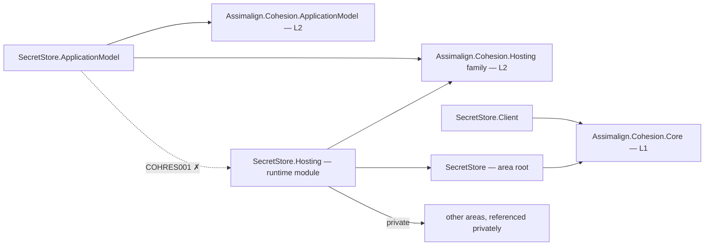

# SecretStore

SecretStore is the L3 operational service platform for protected secret persistence, application trust, and private certificate workflows. The substantive runtime stores protected files on its persistent `data` volume, verifies gateway-issued ES256 bootstrap credentials, and issues durable private-CA leaves on first resolution of `certs/<name>`.

## Project map

An arrow means "references": `SecretStore.Hosting --> SecretStore` reads
`SecretStore.Hosting` references `Assimalign.Cohesion.SecretStore`.



Solid edges are the references this area permits. The dotted edge is the one `COHRES001`
rejects: **no library in the area may reference its own `SecretStore.Hosting` runtime
module**, and the declarative `.ApplicationModel` package in particular never does — generated
code in an opted-in consumer executable joins the two sides at run time through
`Assimalign.Cohesion.Hosting.Resources.ResourceRuntime` instead. The area root and its feature
libraries likewise reference no `Assimalign.Cohesion.Hosting*` library at all (`COHRES004`).

The full reference graph for every Cohesion assembly, including the exact external dependencies
collapsed above, is in [docs/DEPENDENCIES.md](../../docs/DEPENDENCIES.md).

## Projects

- `Assimalign.Cohesion.SecretStore` defines the public area-root application and builder contracts alongside the existing secret-store abstraction.
- `Assimalign.Cohesion.SecretStore.Hosting` provides the concrete creation entry point, protected file store, trust verifier, private CA, and `/cohesion/v1` HTTP protocol host.
- `Assimalign.Cohesion.SecretStore.Client` is the thin, Core-only HTTP protocol client used by gateways to read secret bytes and PEM certificates and to carry generic commands.
- `Assimalign.Cohesion.SecretStore.ApplicationModel` owns the typed resource descriptor, single-replica StatefulSet planner, and default resource control plane injected by `Sdk.SecretStore`.

## Layering and dependencies

As an L3 service platform, SecretStore composes the L2 Hosting runtime rather than defining its own host lifecycle. Only `SecretStore.Hosting` crosses into the Web, IdentityModel, and Security implementations needed to serve HTTP/TLS, verify ES256 credentials, and protect durable files. The area root remains free of those dependencies.

The client package is the narrow O13 orchestration exception: a gateway may reference it for mount-source resolution and command delivery, but the client never references `*.Hosting` and is not delivered through the `App.SecretStore` shared framework. Platform gateways continue to avoid SecretStore ApplicationModel packages. `Sdk.SecretStore` injects that NuGet-only package into enabled resource applications; it is not part of the `App.SecretStore` reference framework.

## Certificate scope

- A store with no Platform authority creates a self-signed development root on first start.
- `certs/<name>` creates a persistent private leaf, renews it near expiration, and returns a PEM bundle containing the leaf, its PKCS#8 key, and its issuer chain.
- The host exposes request, Platform-signing, and completion operations for gateway-mediated intermediate enrollment. Automatic first-start forwarding still requires the gateway-owned signing/target-audience seam described in the Hosting design.
- A `parameter:` certificate source is resolved and mounted by the gateway without alteration; the SecretStore protocol is not called for that source.
- `Certificate="public"` and ACME/public-CA issuance are intentionally deferred to a later design item.

## Project documentation

- [Root overview](./Assimalign.Cohesion.SecretStore/docs/OVERVIEW.md)
- [Root design](./Assimalign.Cohesion.SecretStore/docs/DESIGN.md)
- [Hosting overview](./Assimalign.Cohesion.SecretStore.Hosting/docs/OVERVIEW.md)
- [Hosting design](./Assimalign.Cohesion.SecretStore.Hosting/docs/DESIGN.md)
- [Client overview](./Assimalign.Cohesion.SecretStore.Client/docs/OVERVIEW.md)
- [Client design](./Assimalign.Cohesion.SecretStore.Client/docs/DESIGN.md)
- [ApplicationModel overview](./Assimalign.Cohesion.SecretStore.ApplicationModel/docs/OVERVIEW.md)
- [ApplicationModel design](./Assimalign.Cohesion.SecretStore.ApplicationModel/docs/DESIGN.md)

## Declarative control-plane commands

| Wire kind | Descriptor verb | Ownership key |
|---|---|---|
| `secretstore.add-secret` | `AddSecret` | secret path |
| `secretstore.issue-certificate` | `IssueCertificate` | certificate name |

The [ApplicationModel](Assimalign.Cohesion.SecretStore.ApplicationModel/docs/OVERVIEW.md) declares
commands; [Hosting](Assimalign.Cohesion.SecretStore.Hosting/docs/DESIGN.md) applies them; the Core-only
[Client](Assimalign.Cohesion.SecretStore.Client/docs/OVERVIEW.md) delivers them for the gateway.
ApplicationModel and Client are standalone NuGet packages.

## Application composition (O34)

The root contracts are hosting-free (O34): `ISecretStoreApplication` exposes `Context`, `StartAsync`, and `StopAsync`; `ISecretStoreApplicationContext` exposes `ContentRootPath`. `ISecretStoreApplicationBuilder` owns area declarations and `Build()`. The root and feature packages reference no `Assimalign.Cohesion.Hosting*` library; COHRES004 enforces the boundary.

`SecretStoreApplication.CreateBuilder(args)` returns the public concrete `SecretStoreApplicationBuilder`; its `Build()` returns the public `SecretStoreApplication : Host<SecretStoreApplicationContext>`. The public `SecretStoreApplicationContext` implements `ISecretStoreApplicationContext`, reading `ContentRootPath` from the host environment. The application explicitly forwards the root lifecycle contract to `IHost`, and consumers use the concrete application for `RunAsync` and `await using`. Runtime options and supporting services remain internal.

```csharp
using Assimalign.Cohesion.SecretStore.Hosting;

SecretStoreApplicationBuilder builder = SecretStoreApplication.CreateBuilder(args);
// Add area declarations and optional hosting services before Build().
await using SecretStoreApplication application = builder.Build();
await application.RunAsync();
```
