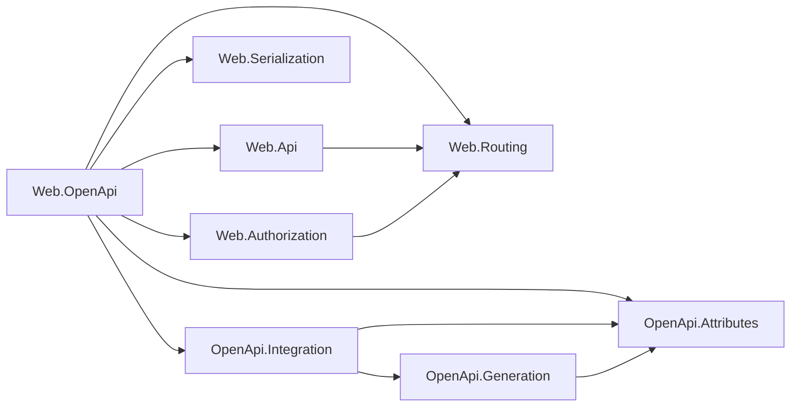

# Assimalign.Cohesion.Web.OpenApi — Design

## Design intent

Serve an OpenAPI description of a Cohesion Web application that is generated from the metadata its
endpoints already carry, never from runtime reflection, so the same document is produced under
NativeAOT. The package is the Web adapter the OpenApi family was built to receive (#152): it implements
`IOpenApiEndpointSource` from `OpenApi.Integration` over the application's route table, lets the
integration's description provider and `OpenApiDocumentGenerator` assemble the document, and serves it
from a route.

Three inputs feed it, all produced elsewhere at build or composition time:

- **Web.Api's endpoint descriptions.** The endpoint-binding source generator attaches an
  `EndpointParameterMetadata` per request input and `EndpointResponseMetadata` per response to every
  typed endpoint (#1059). They carry `typeof(...)` values, not reflected shapes.
- **The application's System.Text.Json contracts.** The `JsonTypeInfo` the registered JSON writer
  serializes a type with comes from the application's source-generated `JsonSerializerContext`;
  `JsonSchemaExporter` turns it into JSON Schema.
- **Policy metadata on the routes.** Tags, summaries, descriptions and exclusion from the Web.Api
  description verbs; security requirements from Web.Authorization's `AuthorizationMetadata`.

## Family position

The package composes Web feature libraries with the OpenApi family. Arrows mean "references".



| Package | Role here |
| --- | --- |
| `Assimalign.Cohesion.Web.Api` | Endpoint descriptions (parameters, responses) and the description verbs (`WithTags`, `WithSummary`, `WithDescription`, `ExcludeFromDescription`) |
| `Assimalign.Cohesion.Web.Routing` | The route table (`IRouterFeature.Router`), route patterns, route names, the convention-builder contract |
| `Assimalign.Cohesion.Web.Serialization` | The registered readers and writers, and `TryGetJsonTypeInfo`, the read-only seam to the JSON writer's contracts |
| `Assimalign.Cohesion.Web.Authorization` / `.Authentication` | `AuthorizationMetadata` for security requirements; the default authenticate scheme |
| `Assimalign.Cohesion.Web.ProblemDetails` | The RFC 9457 type the binding failures are written as |
| `Assimalign.Cohesion.OpenApi.Integration` | `IOpenApiEndpointSource`, the description provider, the JSON/YAML exporter |
| `Assimalign.Cohesion.OpenApi.Attributes` / `OpenApi` | The intermediate metadata records and the document model |

The package is a Web feature library under the hosting-isolation rule: it references neither
`Web.Hosting` nor any `Hosting*` library (COHRES001, COHRES004), and `Web.Hosting` does not reference it.
The OpenApi family never learns that Web exists; the dependency points one way, adapter to both.

## Packaging: a NuGet package, not an App.Web member

`Web.OpenApi` ships as its own package and is **not** listed in the `App.Web` shared framework
(`resources/Web/Assimalign.Cohesion.Web.Runtime/Directory.Build.props`, where OpenApi stays a
commented-out candidate). An application that serves a document references the package; one that
does not carries none of the OpenApi family (the model, serialization with its YAML engine,
validation, versioning, generation), which is about a dozen assemblies an `Sdk.Web` application would
otherwise ship and, under NativeAOT, compile. That is how ASP.NET Core ships its OpenAPI support
(`Microsoft.AspNetCore.OpenApi` is a package, not part of `Microsoft.AspNetCore.App`).

*Rejected: framework membership.* Making the adapter a member would force the whole OpenApi family
into `App.Web`'s closure for every application, documented or not. Nothing in the framework needs the
adapter, and the parts endpoints use to describe themselves are already framework members: the
description carriers and verbs live in `Web.Api` (see below), so a library that maps endpoints can
describe them without depending on this package.

A consequence of the package graph: `OpenApi.Attributes` carries the OpenApi attribute source
generator, so an application that references this package also gets that generator in its
compilation (the OpenApi README, "Source generator delivery"). The generated registry is not composed
into the Web document automatically; `OpenApiOptions.AddEndpointSource` composes it when wanted.

## Which routes are described

A route is described when it has a pattern, names at least one HTTP method with an OpenAPI operation
field, carries no `ExcludeFromDescriptionMetadata`, and is described by someone:

- the source generator described it (`EndpointParameterMetadata` or `EndpointResponseMetadata`), which
  every typed endpoint carries; or
- the application described it (`EndpointTagsMetadata`, `EndpointSummaryMetadata`,
  `EndpointDescriptionMetadata`, or an `EndpointResponseMetadata` of its own).

A raw middleware endpoint (`MapGet(pattern, WebApplicationMiddleware)`) that nobody described stays out:
nothing records its inputs or outputs, and infrastructure routes (the static-file fallback, the document
route itself) are of that kind. Describing it with any verb brings it in, with its path parameters typed
from the template's constraints and a bare `200`. This mirrors ASP.NET Core, whose API explorer skips
plain `RequestDelegate` endpoints.

A route that accepts any method names no operation and is skipped. `CONNECT` and extension methods have
no operation field and are skipped. `QUERY` becomes the 3.2 `query` operation, which generation drops
for earlier lines. The first route registered for a path and method keeps it: routes whose templates
differ only in constraints (`{id:int}` beside `{id}`) or host share one OpenAPI path.

## How each element is derived

| OpenAPI element | Source | Rule |
| --- | --- | --- |
| Path | `IRouterRoute.Pattern` | Literal and separator text as authored; each parameter as `{name}`; constraints, defaults, `?` and catch-all stars dropped (OpenAPI path templating) |
| Operation | `IRouterRoute.Methods` | One per method; `HEAD` only when mapped explicitly (`GET` routes answer it implicitly) |
| `operationId` | `RouteNameMetadata` (`WithName`) | The route name; suffixed `_{method}` when a named route maps several methods |
| `summary`, `description` | `EndpointSummaryMetadata`, `EndpointDescriptionMetadata` | Last wins: a route's replaces its group's |
| `tags` | `EndpointTagsMetadata` | Every item, group first, names listed once; the document's tags are the declared ones (`OpenApiOptions.AddTag`) followed by the undeclared names endpoints use |
| Path parameters | Template parameters | Every template parameter, required (OpenAPI path parameters always are); schema from the handler's declared type when it binds the value (`Route`, or `RouteOrQuery` the template names), otherwise from the inline type constraint (`int`, `long`, `guid`, …), then refined by bounding constraints (`min`, `max`, `range`, `length`, `minlength`, `maxlength`, `alpha`, `regex`) and the template default |
| Query and header parameters | `EndpointParameterMetadata` | `Query`, and `RouteOrQuery` the template does not name, are query parameters; `Header` is a header parameter, except `Accept`, `Content-Type` and `Authorization`, which the OpenAPI Parameter Object says to ignore; `required` is `IsRequired` |
| Parameter schemas | Declared CLR type | A fixed table, not JSON contracts, because the thunk parses these with `IParsable<T>` under the invariant culture: integers and floats with their registry format, `bool`, `string`, `Guid` (`uuid`), dates and times (`date-time`, `date`, `time`), `Uri`, `char`; an enum as a string enum of its names (`Enum.TryParse` accepts them); any other `IParsable<T>` as a string |
| Request body | `EndpointParameterMetadata` (`Body`) | Required; media type of the first registered reader that can read the type (registration order is server preference); schema from the JSON contract |
| Form body | `EndpointParameterMetadata` (`Form`) | `application/x-www-form-urlencoded`, an object with one property per field, `required` listing the required fields |
| Responses | `EndpointResponseMetadata` | One per status, the last item for a status winning (group, generated, then the endpoint's own); description the RFC 9110 reason phrase; no type means no content; a fixed media type as given (`text/plain` strings get `type: string`); a negotiated value under the media type of the first registered writer that can write it |
| Binding outcomes | The thunk's failure semantics | Added unless the endpoint describes the status: `400` problem+json when the endpoint binds any input, `415` problem+json when it reads a body, a bodyless `406` when it writes a negotiated value; a `200` when nothing else is described |
| Schemas | JSON contracts | See the next section |
| Security | `AuthorizationMetadata` | See "Security requirements" |
| Security schemes | `OpenApiOptions.AddSecurityScheme` | As declared |

The binding outcomes are the ones Web.Api's DESIGN leaves to "an adapter … by policy": they are what the
generated thunk actually answers, so a client generated from the document knows the error body shape.

## Schemas from System.Text.Json contracts

A body or response schema is the JSON Schema of the `JsonTypeInfo` the application's JSON writer
serializes the type with, obtained through `TryGetJsonTypeInfo` and exported by `JsonSchemaExporter`.
The exporter reads contract metadata the source-generated context already holds, so no member is
reflected over; property names, nullability, required members, enum converters, number handling and
polymorphism are exactly what the writer uses. `TreatNullObliviousAsNonNullable` makes a root, item, or
non-nullable property non-null; nullable annotations (`Customer?`) make it nullable.

The exporter inlines everything and writes a repeated or recursive shape as a JSON pointer relative to
its own root. A document needs named components instead, so the generator rewrites each node through the
exporter's transform hook as it is produced, children before their parent:

- **Object types become components.** A POCO or record (`JsonTypeInfoKind.Object`) becomes
  `{"$ref": "#/components/schemas/Name"}` at its usage, and its body is exported once, separately, as the
  component. A nullable usage is `anyOf` of the reference and `{"type": "null"}`. Recursion therefore
  resolves to a component reference.
- **Pointers to collections are re-exported inline.** A pointer the exporter wrote for a repeated
  collection or dictionary would point into a schema that is about to be split, so the type is exported
  again in place. A collection that contains itself stops at an unconstrained schema.
- **Polymorphic branches stay inline.** Each derived type in a polymorphic base's `anyOf` is a partial
  schema completed by the base's keywords (`type`, the discriminator in `required`), so the base is the
  component and the branches stay with it. A derived type used directly is a component of its own.
- **Numbers are described as written.** The web defaults read numbers from strings
  (`JsonNumberHandling.AllowReadingFromString`), which the exporter states as
  `["string", "integer"]` plus a pattern. The writer emits JSON numbers, so the description drops the
  string alternative and the pattern, unless the contract writes numbers as strings, and adds the
  registry format (`int32`, `int64`, `double`, `decimal`, …). `byte[]` gains `format: byte` (base64),
  and a string enum without a type gains `type: string`.

**What the contract states is what the writer guarantees.** The exporter lists a property as `required`
when the contract requires it (`required` members, `[JsonRequired]`) and also every constructor
parameter without a default value, and it marks a property non-nullable from its annotations. The
writer always honors both, so response schemas are exact. The reader enforces them only when the
application opts in (`RespectRequiredConstructorParameters` and `RespectNullableAnnotations`, both off in
the web defaults): a request body that omits a positional record's parameter, or sends `null` for a
non-nullable property, is still accepted. The description is then stricter than the reader, which is
safe for clients; an application that wants the two to agree sets both options in the
`AddJsonSerialization` callback. The adapter does not second-guess the contract.

Component names are the type name, `Page<Order>` as `PageOfOrder` and `Order[]` as `OrderArray`,
reduced to `[A-Za-z0-9._-]`, with a numeric suffix when two different types share a name. They are
allocated in the order the route table first meets the types, so they are stable from build to build.
`ProblemDetails` (Web.ProblemDetails' RFC 9457 type) is never exported from a contract: it has no
serialization attributes and the problem writer emits it by hand, so it maps to a fixed RFC 9457
component with the five standard members.

The converter from the exporter's JSON Schema to the model handles the version differences the model
cannot: a nullable reference is `allOf: [{ $ref }]` with `nullable: true` for 3.0, which has no `null`
type; `const` becomes a one-value `enum` for 3.0; and a type list with several non-null entries keeps
one for 3.0. Everything else (type arrays and `nullable`, boolean schemas, the 3.1 vocabulary) the
model's writer already adapts per line. Only the keywords the exporter emits are mapped.

## Why the metadata carries complete schemas

`IOpenApiEndpointSource` speaks the flat intermediate metadata of `OpenApi.Attributes`: parameters with
a scalar type and format, bodies and responses with a component reference, components with flat scalar
properties. That vocabulary cannot say "an array of `Order`", a dictionary, an enum, a nullable
reference, or a nested inline object, which is most of what a JSON contract describes.

The adapter therefore uses one addition to the OpenApi family: an optional `Schema` member on
`OpenApiParameterMetadata`, `OpenApiRequestBodyMetadata`, `OpenApiResponseMetadata` and
`OpenApiSchemaMetadata`. When it is set, `OpenApiDocumentGenerator` places that model schema as it is
instead of building one from the flat fields. The attribute mapper and the source generator never set
it, so their output is unchanged; a producer that already holds a complete schema passes it through.

*Rejected: compose the schemas after generation.* The adapter could leave `Schemas` empty, let the
provider generate a document with bare references, and then patch components and media-type schemas
into the model. That splits document assembly across two packages, contradicts the Integration design
("This project — not Web — knows how to turn that metadata into a document"), and leaves the
contract's `Schemas` member meaningless for its first real implementation.

*Rejected: flatten the exporter's output.* Mapping JSON Schema onto the flat records loses arrays,
dictionaries, enums and nullability. The document would be valid and wrong.

*Rejected: a second, richer source contract.* A separate `IOpenApiSchemaSource` would duplicate the
provider's composition for one producer, where four optional members do the same job.

## The Web.Serialization seam

The adapter needs the very contracts the JSON writer serializes with, or property names (camelCase by
default), nullability and converters drift from the wire. `Web.Serialization` keeps its options
internal, so it gained one public extension member:

```csharp
bool IHttpContentSerializationFeature.TryGetJsonTypeInfo(Type type, out JsonTypeInfo? typeInfo)
```

It resolves the writer the registry selects for `application/json` and, when that is the built-in JSON
writer, returns its contract for the type. The options and the writer stay internal and read-only.

*Rejected: take the `JsonSerializerContext` again.* `AddOpenApi(AppJsonContext.Default)` would let the
two registrations drift apart, and the context alone does not carry the options (`AddJson`'s web
defaults and the application's `configure` callback), so names and number handling could differ from
the wire.

*Rejected: expose the options, or an interface on the writer.* Handing out `JsonSerializerOptions` (even
frozen) widens the seam to everything the options touch; a public interface for the internal writer adds
a type for one consumer. The extension answers exactly the question a describer asks.

## The description verbs live in Web.Api

`WithTags`, `WithSummary`, `WithDescription` and `ExcludeFromDescription`, and their sealed carriers, ship
in `Web.Api` beside the generated parameter and response descriptions, as generic
`extension<TBuilder>(TBuilder builder) where TBuilder : IRouterConventionBuilder` members that work on
routes and groups alike. Web.Api is a framework member and is format-neutral, so any library that maps
endpoints can describe them without referencing this NuGet-only package or the OpenApi family.

*Rejected: verbs in Web.OpenApi.* Describing an endpoint would then require the document generator and
everything under it; a reusable endpoint library would push the OpenApi family onto every consumer.

## The document endpoint

`AddOpenApi(options => ...)` captures the options as a typed application feature; they are read-only
once the callback returns. `MapOpenApi(pattern = "/openapi/v1.json")` maps a `GET` route through
Web.Api's raw `Map` and returns its `IRouterRouteBuilder`, so the document route can carry policies
(`RequireAuthorization`, `RequireCors`). The route is itself marked `ExcludeFromDescription`.

- **Format.** A pattern ending in `.yaml` or `.yml` serves YAML as `application/yaml` (RFC 9512), any
  other JSON as `application/json; charset=utf-8`. YAML is offered because `OpenApi.Serialization`
  already writes it through `Content.Yaml`, and some tools prefer it; it costs a format switch.
- **Line.** The options' `SpecVersion` (default 3.1), or the one `MapOpenApi(pattern, specVersion)`
  names, so a 3.0 rendition can sit beside the 3.1 default for tools that do not read 3.1.
- **Built once.** The route table is closed when the application starts. The endpoint builds and
  serializes its document on the first request and serves those bytes afterwards. A failed build is not
  cached: the exception (an `InvalidOperationException` naming the endpoint that could not be described)
  reaches the pipeline's exception boundary, and the next request tries again.
- **Revalidation.** The representation carries a strong `ETag`, the SHA-256 of its bytes, and
  `If-None-Match`/`If-Match` are evaluated with the `Http` conditional-request primitive (RFC 9110
  §13.2.2): a current client gets `304` with no body. `HEAD` gets the `GET` header section.

A route-table read happens only when a document is built, never at `MapOpenApi`: reading the router
builds it and closes the table, which must not happen while the application is still mapping.

`GetOpenApiDescriptionProvider()` on the application returns the same document as an
`IOpenApiDescriptionProvider`, for tools and tests that want the model. Each call builds a new document,
because the model is mutable and a shared instance would let one caller change what another sees.
`OpenApiOptions.AddDocumentTransformer` edits each built document for what metadata does not carry
(servers, contact, license, extensions); `AddEndpointSource` composes another source after the routes.

## Security requirements

The adapter reads an endpoint's `AuthorizationMetadata` the way `UseAuthorization` does: every item
applies, outer group first, and the most specific `AllowAnonymous` clears the items declared before it.
When requirements remain:

1. The schemes are the union of the items' `AuthenticationSchemes` and their inline policies'
   `AuthenticationSchemes`, in order.
2. With none named, the requirement evaluates `context.User`, which the default authenticate scheme
   establishes, so that scheme is used (`IAuthenticationService.DefaultAuthenticateScheme`); without a
   default, every declared scheme.
3. Each scheme the document declares (`OpenApiOptions.AddSecurityScheme`, matched by name) becomes one
   requirement object with no scopes, the objects being alternatives as the policy's schemes are.

Limits, by design of the inputs: a named policy (`RequireAuthorization("admins")`) and the fallback
policy live in `AuthorizationOptions`, which `Web.Authorization` keeps internal, so their schemes are not
visible, and an endpoint protected only by the fallback policy is described as open. Roles are not
written into the scope arrays: OAS 3.0 requires them empty for non-OAuth schemes, and Web.Authorization's
roles mean "any of", where a requirement's array means "all of". `OpenApiSecuritySchemeMetadata` has no
OAuth2 flows, so an OAuth2 scheme needs a document transformer; OpenID Connect, HTTP and API-key schemes
are declared directly. A scheme an endpoint uses but the document does not declare cannot be referenced
and is left out.

## Error model

Composition errors are `InvalidOperationException`, as elsewhere in the Web area: `MapOpenApi` or
`GetOpenApiDescriptionProvider` without `AddOpenApi`, a document built without `AddRouting`, and an
endpoint that cannot be described. The last names the endpoint (`GET /orders/{id}`) and the type, and
says to add it to the application's `JsonSerializerContext`; it is raised when a body or result type has
no registered reader or writer, which is the same composition error that faults the endpoint itself at
run time. Options mutators throw `InvalidOperationException` once read-only, and argument validation
throws the usual `ArgumentException` family.

## AOT posture

`IsAotCompatible` (inherited), with no trim or AOT analyzer warnings. The schema path is
`JsonSchemaExporter` over source-generated `JsonTypeInfo`; parameter schemas come from a fixed type table
and `Enum.GetNames(Type)`; type names come from `Type.Name` and `Type.GetGenericArguments()`, which need
no reflection metadata beyond the type itself. JSON nodes are built with non-generic `JsonNode` members
only (the generic `JsonArray.Add<T>` is `RequiresDynamicCode`). The document is serialized by
`OpenApi.Serialization`'s explicit writers.

Evidence beyond the analyzers: a `PublishAot` probe application (typed endpoints over route, query
and body inputs, a nullable reference, a recursive type, collections, dictionaries, string and numeric
enums, an authorized endpoint) published for `win-arm64` with ILC's per-assembly trim/AOT
summaries (`IL2104`, `IL3053`) as errors, and the native binary served the 3.0, 3.1 and 3.2 documents,
the YAML rendition and the `304` over real HTTP (2026-10-01). In CI the Web NativeAOT guard
(`resources/Web/Assimalign.Cohesion.Web.Hosting/samples/Assimalign.Cohesion.Web.AotGuard`) is where an
OpenAPI endpoint is exercised under `PublishAot`.

## Non-goals

- **Runtime reflection over handlers or CLR types.** The description comes from metadata the source
  generator and the serialization contracts already hold.
- **XML comments as descriptions.** They are not in the compiled metadata; `WithSummary` and
  `WithDescription` carry text explicitly.
- **Multiple media types per body or status.** The intermediate metadata carries one media type per
  request body and per response status, so a negotiated response lists the default writer's type and a
  form body lists `application/x-www-form-urlencoded` (the form reader also accepts
  `multipart/form-data`).
- **Antiforgery and CORS in the description.** Neither has an OpenAPI representation beyond a parameter
  the application can declare itself.
- **Discriminator objects, examples, and `x-` extensions from contracts.** The exporter does not produce
  them; a document transformer can add them.
- **Several documents per application.** One document per application, rendered per line and format;
  grouping endpoints into separate documents is a later feature.

## Extending

- **A new `EndpointParameterSource`** (file uploads, #1061) is skipped as undescribed until this adapter
  maps it, which Web.Api asks of every consumer. Mapping files means a `multipart/form-data` body with
  `format: binary` parts, and switching a form body that contains one to `multipart/form-data`.
- **A new description carrier** belongs in `Web.Api` with its verb, and counts toward "described" in
  `WebOpenApiEndpointSource.IsDescribed`.
- **A non-JSON format's schemas** would need a seam like `TryGetJsonTypeInfo` on that format's writer;
  today a type only a non-JSON writer covers gets its media type with no schema.
