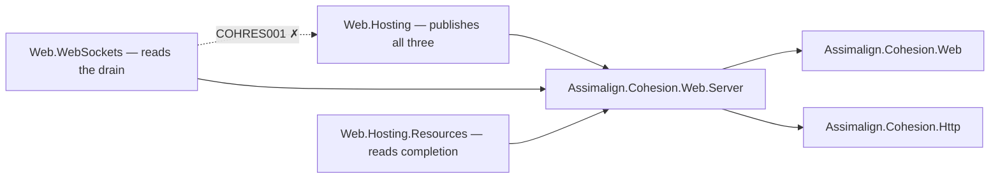

# Assimalign.Cohesion.Web.Server — Design

## Design intent

`Assimalign.Cohesion.Web.Server` holds the per-exchange contracts the Web server publishes:
`IWebRequestIdFeature`, `IWebResponseCompletionFeature` and `IWebServerDrainFeature`. It is a
contracts-only feature package. The default server in `Web.Hosting` implements and installs all
three; feature libraries and applications read them.

The package exists because of two rules that point in opposite directions:

- **The area root holds no feature contracts** (owner decision 33 of 2026-10-09, extending decision
  20's rule for core Http to `Assimalign.Cohesion.Web`; #1379). The three contracts lived in the
  root until then.
- **No feature library may reference the runtime module** (COHRES001). The contracts cannot live in
  `Web.Hosting`, which publishes them, because their readers are feature libraries: `Web.WebSockets`
  reads the drain signal and `Web.Hosting.Resources` the completion callbacks.

A package between the two satisfies both. `Web.Hosting` references it, which decision 32's
relaxation of COHRES002 allows, and every reader references it like any other feature package.

## Family map

The packages that publish, declare and read the contracts, with every arrow meaning "references":

| Package | Role | Reference to `Web.Server` |
|---|---|---|
| `Assimalign.Cohesion.Web.Server` | declares the three contracts | — |
| `Assimalign.Cohesion.Web.Hosting` | runtime module: implements and installs all three on every exchange | project reference (COHRES002, relaxed by decision 32) |
| `Assimalign.Cohesion.Web.WebSockets` | closes open sockets with `1001 Going Away` when `Draining` fires | project reference |
| `Assimalign.Cohesion.Web.Hosting.Resources` | defers a control-plane stop until its `202` is written | project reference |

The dotted edge is the reference COHRES001 rejects: a feature library may never reference the
runtime module, which is why the contracts could not move into `Web.Hosting`. No other Web library
reads these contracts today. `Web.Diagnostics` correlates its logs with the `traceparent` header
rather than the request id.

## Why three contracts in one package

The three have one publisher, the server, and one lifetime, the exchange. A package per contract
would add two packages to every framework that carries `Web.Hosting`, for interfaces of one or two
members each. The owner chose two homes over one shared features package (decision 33): contracts a
feature publishes go with that feature (the endpoint and the path base went to `Web.Routing`), and
contracts the server publishes come here.

## The contracts

**`IWebRequestIdFeature`** is the request-id seam (#1064). Its `RequestId` is a BCL
`ActivityTraceId`: the request id *is* the W3C trace id, so one value finds the request in the
server's span, in logs and in anything returned to the caller. The default server installs it on
every exchange before the pipeline runs. With a server span the id is the span's trace id; without
one it is the trace id of a valid `traceparent`, or else a random id generated on first read, stable
for the exchange. It is a Web contract, not an `Assimalign.Cohesion.Http` one, because a request id
is a server concern and the protocol core models only the wire.

**`IWebResponseCompletionFeature`** is the response-transmission seam. The default server installs
it on every exchange and invokes callbacks in registration order after writing the response to the
transport. Registration after completion throws `InvalidOperationException`. This lets a terminal
defer lifecycle signals until its acknowledgement has been sent: the resource control plane's stop
route answers `202` and stops the application only once the `202` is on the wire.

**`IWebServerDrainFeature`** is the drain seam (decision 16, Http ADR 1). Its `Draining` token is
cancelled when the server begins its lame-duck drain: the server stops accepting and lets the
exchanges in flight finish within the stop's budget. An ordinary exchange finishes on its own; a
long-lived one (a WebSocket, a stream of server-sent events) registers on the token and ends its
own work cleanly. The token is not the exchange's cancellation: the exchange keeps running and its
response is delivered; `RequestCancelled` fires only if it is still running when the budget runs
out. The default server installs one shared instance on every exchange. It is a feature rather
than a member of `IWebApplicationServer` because the consumer is code running inside an exchange,
which sees the exchange's features and not the server.

**Every contract is optional.** A custom `IWebApplicationServer` may omit any of them, so every
reader handles an absent feature: the control plane falls back to a direct stop, and WebSockets has
no drain-time close, so a socket ends by its own close or by the exchange's cancellation.

## Namespace: `Assimalign.Cohesion.Web`

The package pins its `RootNamespace` to the family name, `Assimalign.Cohesion.Web`, and its
contracts declare it. That is the namespace they shipped in, so moving them out of the root changed
their assembly and nothing a call site names. `general-rules.md` sanctions a family pin ("a family
that shares one namespace pins the family name"); `Web.Api`, `Web.Forms` and `Web.ProblemDetails`
pin the same name, as `Http.Cookies` and `Http.Forwarded` pin `Assimalign.Cohesion.Http`.

Binary consumers do break: a library compiled against the root's copies must be rebuilt, because
the types now live in another assembly. Every in-repository reader was rebuilt with the move.

## Framework membership

`App.Web` carries the package publicly, so applications compile against the contracts. Every other
area framework carries `Web.Hosting` privately (the area's control plane runs on it), and so carries
`Web.Server`, with `Web.Routing` and its `Http.Forwarded` dependency, privately too. The App.Runtime
framework-closure tests prove each list covers the project graph.

## AOT posture

Interfaces only: no reflection and no runtime code generation (`IsAotCompatible=true`).
`IWebRequestIdFeature` exposes the BCL `ActivityTraceId` from `System.Diagnostics.DiagnosticSource`,
which the shared framework carries; no package is added.

## Adding a contract

A new per-exchange contract belongs here only when the server publishes it and a feature library
must read it. A contract a feature publishes goes in that feature's package; a contract only the
runtime reads stays internal to `Web.Hosting`. Each addition lands in every framework that carries
`Web.Hosting`, so it stays an interface with no new dependency.

## Non-goals

- **Implementations.** The default implementations are internal to `Web.Hosting`; a custom server
  provides its own.
- **Feature-published contracts.** The endpoint and the path base are `Web.Routing`'s, and a feature
  package owns any contract it publishes.
- **Builder verbs.** The server installs these features itself; there is nothing to register.
