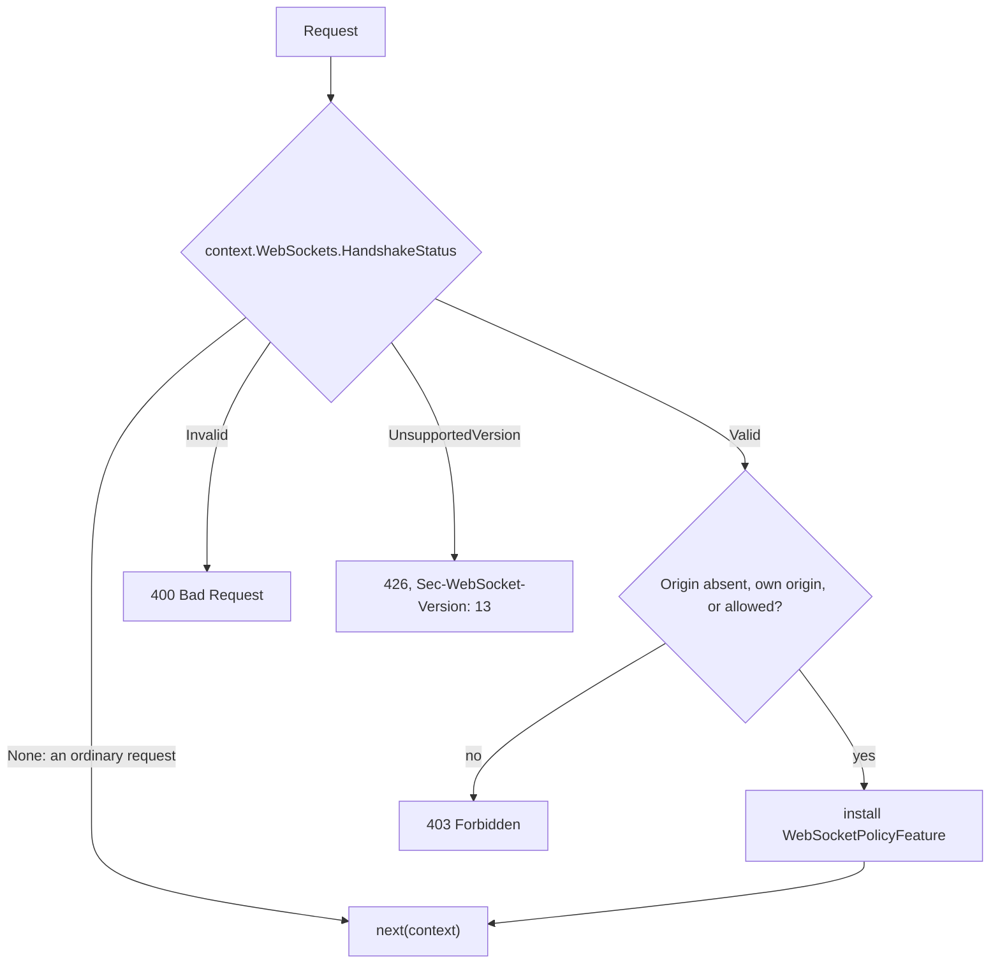
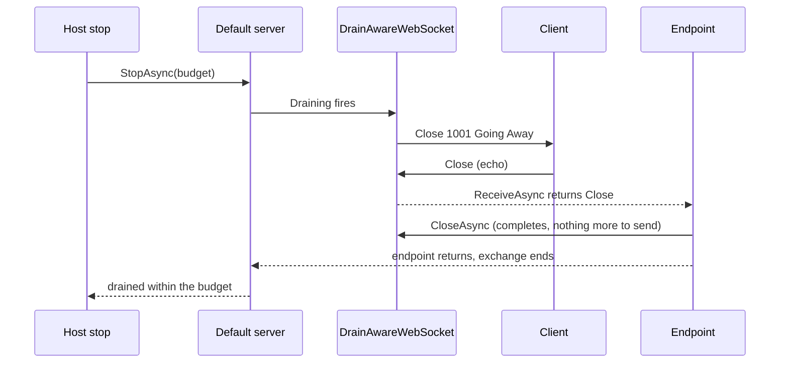

# Assimalign.Cohesion.Web.WebSockets — Design

## Design intent

The WebSocket **policy** of the Web pipeline, as decided by
[Http ADR 1](../../../../docs/libraries/Http/DECISIONS.md#adr-1-server-websockets) (plan §7.4,
decision 16). `Assimalign.Cohesion.Http.WebSockets` owns the protocol: the handshake, its
negotiation, and the BCL framing. A browser-facing server needs more around that accept, and this
package supplies it as one middleware, `UseWebSockets`:

1. **The cross-site WebSocket hijacking defense** (decision 6). A browser sends cookies with a
   WebSocket handshake to any site, and neither the same-origin policy nor CORS applies to it, so
   without a check any page a user visits could open a socket authenticated as that user. A
   handshake whose `Origin` is present and is neither the request's own origin nor an allowed one is
   refused with `403`. A handshake without `Origin` passes: browsers always send it, so its absence
   means the client is not a page.
2. **Defaults for every accept**: the keep-alive interval and timeout, and compression, which stays
   off unless enabled.
3. **The drain close** (decision 7). When the default server begins its lame-duck drain, every open
   socket is closed with `1001 Going Away`, so it ends cleanly within the stop's budget instead of
   being cut off without a close frame when the budget runs out.
4. **RFC 6455's refusals.** A malformed handshake gets `400`; one for another version gets `426` with
   `Sec-WebSocket-Version: 13`.

Unlike ASP.NET Core's `UseWebSockets`, the middleware is not what makes `context.WebSockets` work:
the protocol package does that on its own. The middleware adds the policy, and every accept
downstream of it takes the policy, whether or not it was written with the policy in mind.

## The request flow

An arrow reads "goes to"; the middleware decides on the handshake status the protocol package
computed, then on the origin.

The refusals end the request; `next` does not run. A valid handshake continues with the policy
installed; an endpoint that never accepts it answers as it would any request, and the upgrade is
ignored (RFC 9110 §7.8).

## The origin check

The request's own origin is built from the **effective** scheme and host
(`context.EffectiveScheme`, `context.EffectiveHost`, the `Http.Forwarded` read convention), so
behind a TLS-terminating proxy a page at `https://app.example` matches a request the server sees as
`http://10.0.0.5:8080` once `UseForwardedHeaders` resolved it. Without that middleware the wire
values are used, and the public origin has to be listed in `AllowedOrigins`.

Every origin compared — the handshake's, the request's own, and each configured one — is reduced to
one serialized form, `scheme://host[:port]`: lower case, the scheme's default port dropped, an IPv6
address in canonical form. Two origins are the same when the forms are equal, ordinally. Same
scheme and host on another port is another origin.

| Handshake `Origin` | Result |
| --- | --- |
| absent (or empty) | allowed |
| the request's own origin | allowed |
| one of `AllowedOrigins` | allowed |
| anything else, including another port | `403` |
| `null` (a sandboxed page, a local file, a cross-origin redirect) | `403` |
| malformed, or several `Origin` fields | `403` |
| any, with `AllowAnyOrigin` set | allowed |

Configured origins are validated when `UseWebSockets` runs, and anything that is not an origin fails
there with a message that names the fix: a path (even a trailing `/`), a wildcard, `null`, user
information, or text that is not `scheme://host[:port]`. `null` cannot be allowed by value, because
every sandboxed page sends it; `AllowAnyOrigin` is the deliberate way to accept it.

### Why not reuse Web.Cors

CORS governs which responses a page may read; it is not access control and does not apply to
WebSockets at all (Web.Cors DESIGN, "Non-goals"). Its origin parser is internal to Web.Cors, and
a cross-feature reference for one parsing helper would couple the two packages' release cadence.
This package carries its own small parser with the same normalization rules.

## Accept defaults

`WebSocketPolicyFeature` decorates the exchange's `IHttpWebSocketFeature`. It takes the inner
feature's name, so installing it replaces the inner feature in the exchange's features, and
`context.WebSockets` reads it; the handshake, the subprotocols and the single-shot accept stay the
inner feature's. Its `AcceptWebSocketAsync` fills every setting the accept leaves `null` from the
policy, on a copy (the caller's options are never modified), and forwards:

| Setting | Policy default | An accept overrides it with |
| --- | --- | --- |
| Keep-alive interval | `WebSocket.DefaultKeepAliveInterval`, 30 seconds | `HttpWebSocketAcceptOptions.KeepAliveInterval` |
| Keep-alive timeout | `Timeout.InfiniteTimeSpan` (unsolicited pongs, no timeout) | `KeepAliveTimeout` |
| Compression | off | `DangerousEnableCompression` |

30 seconds is under the 60-second idle timeout common to proxies and load balancers; ASP.NET Core's
two minutes is not. Compression is opt-in at both levels because it opens side channels (CRIME,
BREACH); the per-accept switch exists because whether a socket's messages mix secrets with
attacker-controlled data is a per-endpoint question.

## The drain close

The default server installs `IWebServerDrainFeature` on every exchange (Web root); its token fires
when the stop begins, before anything is cancelled. When the feature is present, the accepted socket
is wrapped in `DrainAwareWebSocket`, which registers on the token and, when it fires, starts the
close handshake with `1001 Going Away`.

The wrapper exists because closing a socket behind the application's back breaks the application's
own close. Once the peer answers the drain's close, the BCL socket is `Closed`, and the
`CloseAsync` or `CloseOutputAsync` that ends a typical receive loop throws for an invalid state.
So the close output is claimed once, by whichever side asks first:

- When the drain claimed it, the application's `CloseOutputAsync` waits for the drain's close frame
  to be sent, and its `CloseAsync` also waits for the peer's answer if it has not arrived. Neither
  throws.
- When the application claimed it first, the drain does nothing.
- A send after the drain's close fails as a send on any closing socket does; a receive returns the
  peer's remaining messages and then its close.

The registration is released when the socket is disposed or aborted, and when the pipeline returns
(the exchange, and its connection, end then). A socket accepted after the drain began is closed at
once. A custom server that omits the drain feature gets the BCL socket unwrapped, and its sockets
end when it ends them.

The drain close runs on the thread that stops the server, inside the token's callback, so it only
starts the close frame's write. A peer that never answers the close is cut off when the budget runs
out, as any exchange is.

## Ordering

Register `UseWebSockets` after `UseForwardedHeaders`, whose effective scheme and host the origin
check reads, and ahead of every endpoint that accepts a socket. The area's
[middleware order](../../../../docs/resources/Web/MIDDLEWARE_ORDER.md) places it last, closest to
the endpoints, so host filtering, authorization and rate limiting apply to a handshake first.

A request-timeout policy (`Web.RequestTimeouts`) cancels a WebSocket endpoint when it fires, as it
does any request, so disable the timeout on WebSocket endpoints (`DisableRequestTimeout()`).

## Dependency rule

A Web feature library: it references the Web root (for `IWebApplicationPipelineBuilder` and
`IWebServerDrainFeature`), `Http`, `Http.WebSockets` and `Http.Forwarded`, and nothing in the hosting
family (COHRES001, COHRES004). The drain signal crosses from `Web.Hosting` through the Web root's
feature contract, which is how the policy reaches the server's lifecycle without referencing it.

## AOT posture

No reflection and no runtime code generation: span parsing for origins, delegate composition for
the middleware, and a `WebSocket` subclass that forwards to the BCL socket. The Web NativeAOT guard
publishes the middleware and runs a WebSocket echo and a refused cross-site handshake.

## Non-goals

- **Per-endpoint origin policies.** One policy per pipeline, like ASP.NET Core's. An endpoint that
  needs more checks `Origin` itself before accepting.
- **A hub or message layer** (SignalR-style). A separate decision (Http ADR 1).
- **Message-size limits.** Recorded as "to revisit" in Http ADR 1.
- **HTTP/2 and HTTP/3.** The policy is protocol-neutral and applies to them unchanged once
  `Http.WebSockets` phase 2 accepts extended CONNECT.
