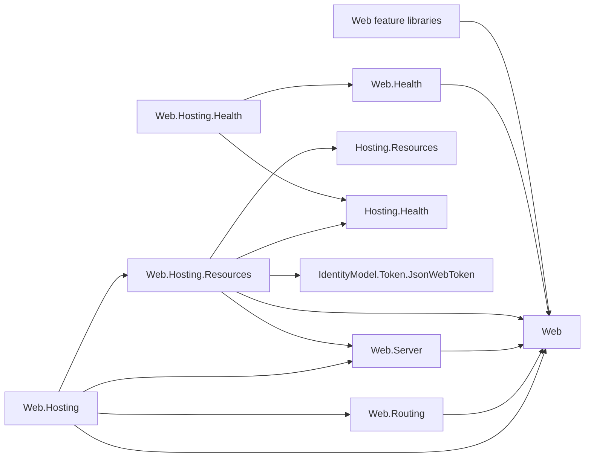

# Web Resource Area

The Web resource (`resources/Web/*`) is Cohesion's L3 web application platform: the composition
abstractions, the request-pipeline feature libraries, and the hosting runtime that together form
what the `Assimalign.Cohesion.Sdk.Web` SDK delivers through the `Assimalign.Cohesion.App.Web`
shared framework.

The area's architecture record lives in
[docs/resources/Web/DESIGN.md](../../docs/resources/Web/DESIGN.md), with the orientation piece in
[docs/resources/Web/OVERVIEW.md](../../docs/resources/Web/OVERVIEW.md); this README is the project
map and the dependency rule. The full reference graph for every Cohesion assembly is in
[docs/DEPENDENCIES.md](../../docs/DEPENDENCIES.md). The order to register the area's middleware in is
[docs/resources/Web/MIDDLEWARE_ORDER.md](../../docs/resources/Web/MIDDLEWARE_ORDER.md). Decisions that span
more than one package (such as how a rewrite changes the request) are in
[docs/resources/Web/DECISIONS.md](../../docs/resources/Web/DECISIONS.md).

## The dependency rule

The hosting family follows O34 (owner decision, 2026-09-15):

> **Roots and feature libraries reference no `Assimalign.Cohesion.Hosting*` library
> (COHRES004) or Web hosting-family integration (COHRES001).**
> `Web.Hosting.Resources` and `Web.Hosting.Health` integrate the shared Hosting libraries.
> They may reference Web features and each other, but never the exact `Web.Hosting`
> runtime module. The module may reference any Web library except `Web.Testing`,
> `Web.ApplicationModel`, the `App.Web` producers, and test, example, sample, and fixture
> projects (COHRES002, relaxed by owner decision 2026-10-09; before that, only the Web root and
> its own hosting family).
> `Web.Testing` exempts `Web.Hosting` and `Web.Hosting.Resources` to drive the runtime and its control plane; `Web.ApplicationModel` retains its
> COHAM001-fenced `Hosting.Resources` reference.

Why the rule exists:

- **Nothing depends on Web.Hosting** because the hosting module composes DI, configuration,
  logging, and transport wiring. A feature library that referenced it would drag that whole
  composition surface into every consumer and push users toward container-driven design — the
  opposite of the repo's dependency-free feature-package philosophy.
- **Web.Hosting references a Web library only when the runtime itself needs it.** Since
  2026-10-09 the rule permits any Web library outside the exclusions above, so runtime machinery
  that belongs in its own package (a router the host drives, a server package) no longer has to
  live in the root. Hosting a feature still needs no reference: the `App.Web` framework (members
  listed in
  [`Assimalign.Cohesion.Web.Runtime/Directory.Build.props`](Assimalign.Cohesion.Web.Runtime/Directory.Build.props))
  delivers the family to applications, so an app using `Sdk.Web` sees every Web assembly without
  any project wiring, and builder verbs ship with their feature (see *Feature registration*
  below). Each reference `Web.Hosting` takes ships its closure in every framework that carries
  `Web.Hosting`: `App.Web` and, privately, all 17 other area frameworks. It takes two (owner
  decision 33, #1379): `Web.Routing`, for the pipeline terminal and the endpoint's route template
  its telemetry reports, and `Web.Server`, for the per-exchange features the server installs.
- **The root holds no feature contracts** (owner decision 33, #1379). An `IHttpFeature` contract
  lives with the package that publishes it: the endpoint and the path base in `Web.Routing`, the
  request id, response completion and drain signal in `Web.Server`. The root keeps the base
  contracts and composition seams (`IWebApplication*`, the pipeline, `Use`/`UseWhen`/`Run`).
- **The exclusions** follow from earlier decisions: `Web.Testing` references `Web.Hosting`, so the
  reverse is a cycle; the realization-plan design keeps the runtime off `Web.ApplicationModel`
  (generated code in the consumer executable joins the two); the `App.Web` producers are packaging
  shells that reference `Web.Hosting`; and harnesses never ship.

**The rule is build-enforced — centrally, for every resource area.** The Web rule is the local
instance of the repo-wide *resource hosting-isolation rule* in
`build/Targets/Build.Rules.targets` (prose: `.claude/rules/resource-areas.md`): each
`resources/<Area>/` ships one `Assimalign.Cohesion.<Area>.Hosting`, no library in the area may
reference it (`COHRES001`, checked against both the project-reference graph and the resolved
assembly closure), and the hosting module may directly reference any same-area library except
the area's `Testing`, `ApplicationModel`, `ApplicationModel.Orchestration`, framework producers,
and harness projects, and may not resolve the two ApplicationModel packages by any route
(`COHRES002`). A project with a sanctioned, user-approved exception opts out
per-assembly via the `CohesionHostingIsolationExemptions` property in its own csproj —
`Web.Testing` declares the standing exemption this way. Test, example, and sample projects are
exempt — the rule constrains shipped libraries, not harnesses — and every Web library builds in
CI (`.github/workflows/resource-web.yml`) so the guard executes on each push. The `App.Web`
framework producers, `Assimalign.Cohesion.Web.Refs` and `Assimalign.Cohesion.Web.Runtime`, are
packaging shells rather than libraries: the Runtime producer references the whole framework,
`Web.Hosting` included, so the guard skips both by exact identity (`COHRES003` still applies), and
`sdk-smoke.yml` packs them.

## Feature registration

Owner decisions 34 and 35 (2026-10-09, #1380) set how a feature reaches an application:

- **Registration verbs are component integrations on `builder.Services`.** Each feature package
  declares `[assembly: ComponentIntegration(...)]` targeting
  `Assimalign.Cohesion.DependencyInjection.IServiceProviderBuilder.AddSingleton` with
  `Contract = typeof(IHttpFeature)`, and the generator projects the verb into the application, so
  neither the package nor `Web.Hosting` takes a reference for it. `Sdk.Web` applications get the
  generator from the App framework; in-repo projects add
  `<CohesionAnalyzerReference Include="Assimalign.Cohesion.SourceGeneration.ComponentModel" />`.
- **Pipeline verbs stay `extension(...)` members** of the feature package: `Use<Feature>` on
  `IWebApplicationPipelineBuilder`, `Map*` on the pipeline and router surfaces.
- **Every `IHttpFeature` registration is a singleton.** `Web.Hosting` rejects a scoped or transient
  one, one registered under a narrower contract, and a disposable instance or implementation type at
  `Build`, and a disposable feature a factory registration produces at the pipeline build, where the
  product first exists; each error names the registration.
- **`IWebApplicationBuilder.AddFeature` stays the raw path**, for features no package ships a verb
  for.

| Package | Verb | Shape |
| --- | --- | --- |
| `Web.Routing` | `AddRouting()` | static factory (`RoutingComponents`) |
| `Web.Authentication` | `AddAuthentication(auth => auth.AddCookie().AddJwtBearer(...))` | builder template (`AuthenticationBuilder`) |
| `Web.Authorization` | `AddAuthorization(options => ...)` | static factory (`AuthorizationComponents`) |
| `Web.Antiforgery` | `AddAntiforgery(...)`, `AddAntiforgery(dataProtectionProvider, ...)` | static factory (`AntiforgeryComponents`) |
| `Web.ErrorHandling` | `AddErrorHandling(errors => errors.OnError(...))` | builder template (`ErrorHandlingBuilder`) |
| `Web.Serialization` | `AddContentSerialization(serialization => ...)`, `AddJsonSerialization(resolver, ...)` | builder template (`ContentSerializationBuilder`); static factory (`SerializationComponents`) |
| `Web.Validation` | `AddValidation(validation => ...)` | static factory (`ValidationComponents`) |
| `Web.OpenApi` | `AddOpenApi(options => ...)` | static factory (`OpenApiComponents`) |

A verb whose callback configures a builder other packages graft onto is a builder template; a verb
called bare, with an optional options callback, or with a value argument is a static factory, so
callers keep `builder.Services.AddRouting()`. The rule set is `.claude/rules/web-area.md`, "Builder
verbs ship with their feature".

```csharp
WebApplicationBuilder builder = WebApplication.CreateBuilder(args);
builder.Services
    .AddRouting()
    .AddJsonSerialization(AppJsonContext.Default)
    .AddAuthentication(auth => auth.AddCookie())
    .AddAuthorization();

await using WebApplication app = builder.Build();
app.UseRouting();
app.UseAuthentication();
app.UseAuthorization();
await app.RunAsync();
```

## Adding a new Web feature library

A new `Assimalign.Cohesion.Web.<Feature>` or `Web.Hosting.<Suffix>` project is not done until all of these are updated
(the working checklist also lives in `.claude/rules/web-area.md`):

1. **csproj** — references per the dependency rule; builder verbs ship in the package itself:
   a `builder.Services.Add<Feature>` registration verb as a component integration (see *Feature
   registration*, plus a call in `build/IntegrationCheck` and a path in `analyzers.yml`), and
   `Use<Feature>` pipeline verbs on `IWebApplicationPipelineBuilder`. Registration stays
   dependency-free (typed features and values — no DI reference, no configuration binding).
2. **Framework membership** — a `CohesionFrameworkAssembly` line in
   [`Assimalign.Cohesion.Web.Runtime/Directory.Build.props`](Assimalign.Cohesion.Web.Runtime/Directory.Build.props),
   plus any new outside-area transitive dependencies App does not carry. Validate by packing
   `resources/Web/Assimalign.Cohesion.Web.Runtime` (hard-fails on unresolvable assemblies). If
   `Web.Hosting` references the new library, add its closure as a private member of the 17 other
   area frameworks that carry `Web.Hosting` privately, too.
3. **Solutions** — `resources/Web/Assimalign.Cohesion.Web.slnx`,
   `resources/Assimalign.Cohesion.Resources.slnx`, and the root
   `Assimalign.Cohesion.slnx`.
4. **CI and inventory** — the matrix in `.github/workflows/resource-web.yml` and
   `installer/scripts/modules/CohesionPackaging.psm1`; both lists include each packable project.
5. **Docs** — `docs/OVERVIEW.md` + `docs/DESIGN.md` (plus `docs/Assembly/` as the public API
   stabilizes), and a row in the project map below.

The runtime consumes the root, its hosting family, and two feature packages, `Web.Routing` and
`Web.Server` (#1379); feature libraries remain rooted in Web. `Web.Hosting.Resources` reads
`Web.Server`'s completion feature. Arrows show references.



## Project map

| Project | Role |
| --- | --- |
| `Assimalign.Cohesion.Web` | The root: pipeline and composition abstractions (`IWebApplication*`, `WebApplicationMiddleware`) and the composition verbs `Use`, `UseWhen` and `Run` every library builds against; no `IHttpFeature` contract (#1379) |
| `Assimalign.Cohesion.Web.Server` | Contracts only: the per-exchange features the server publishes, `IWebRequestIdFeature` (the request's W3C trace id), `IWebResponseCompletionFeature` (callbacks after the response reaches the transport) and `IWebServerDrainFeature` (the lame-duck drain signal). `Web.Hosting` installs all three; namespace `Assimalign.Cohesion.Web`, moved from the root (#1379) |
| `Assimalign.Cohesion.Web.Hosting.Resources` | Single resource control-plane terminal, ES256 bootstrap verification, and deferred stop; consumed by `Web.Hosting`, `Web.Testing`, and every resource area's hosting module that serves its control plane over HTTP (O35) |
| `Assimalign.Cohesion.Web.Hosting` | The runtime module: host, server, concrete-builder `AddService`, builder-time DI/config/logging composition; the server's request spans and HTTP metrics (`ActivitySource` and `Meter` `Assimalign.Cohesion.Web.Hosting`) and the request id (#1064). References `Web.Routing` and `Web.Server` (#1379) |
| `Assimalign.Cohesion.Web.Hosting.Health` | Adapts `Hosting.Health` contributors onto the `Web.Health` builder; consumed privately by `Database.Hosting` |
| `Assimalign.Cohesion.Web.Routing` | Router, route patterns/constraints, endpoint metadata bag, link generation; `UseRouting` selects the endpoint and the pipeline terminal runs it (#1054), so policy middleware registered after `UseRouting` reads the matched endpoint. Owns the endpoint contract (`IWebEndpointFeature`), the standard terminal (`WebApplicationTerminal`) and the branches that end in it (`Map(path)`, `MapWhen`, `IWebPathBaseFeature`), moved from the root (#1379) |
| `Assimalign.Cohesion.Web.Api` | Endpoint mapping over the router: plain `Map`/`MapGet` terminal middleware plus source-generated typed-delegate binding (`(int id, IHttpContext) => ...` — route/query/header/body/form + uploaded files + injections, 400/413/415 outcomes), returned values written with content negotiation (`string` as `text/plain`, `null` as 204), `COHWEB` compile errors for handlers it cannot bind, and neutral endpoint-description metadata (`EndpointParameterMetadata`, `EndpointResponseMetadata`, plus the `WithTags`/`WithSummary`/`WithDescription`/`ExcludeFromDescription` verbs) for documentation adapters; the interceptor generator lives in `analyzers/Assimalign.Cohesion.SourceGeneration.Web` |
| `Assimalign.Cohesion.Web.Serialization` | The content-serialization registry: media-type-keyed request-reader/response-writer halves, `AddJsonSerialization` over a source-generated resolver (AOT), and the `ReadContentAsync`/`WriteContentAsync` call sites |
| `Assimalign.Cohesion.Web.OpenApi` | OpenAPI 3.0/3.1/3.2 documents from endpoint metadata, never runtime reflection (#152): the Web adapter for `OpenApi.Integration`'s `IOpenApiEndpointSource` over the route table (parameters and responses from the source-generated endpoint descriptions, schemas from the application's source-generated System.Text.Json contracts via `JsonSchemaExporter`, tags/summaries/exclusion from the Web.Api description verbs, security requirements from each endpoint's effective authorization policy, fallback and named policies included); `AddOpenApi` + `MapOpenApi` serve the document as JSON or YAML, built once and revalidated by ETag. **NuGet-only**: not an `App.Web` member, so applications that do not document their API carry none of the OpenApi family |
| `Assimalign.Cohesion.Web.Validation` | Request validation over `ObjectValidation` (#1060): `AddValidation` registers a validator per model type (keyed by `typeof(T)`, no reflection) and a global switch; typed endpoints validate their bound body model before the handler runs (the generator emits the call only when the application references this package) and answer an invalid one with 400 problem+json and an `errors` map keyed by member path; `DisableValidation()`/`RequireValidation()` per endpoint or group; `context.ValidateAsync(value)` for hand-bound values. `Web.Api` takes no validation dependency |
| `Assimalign.Cohesion.Web.ProblemDetails` | The RFC 9457 problem+json payload (model + AOT-safe writer + `WriteProblemDetailsAsync`) |
| `Assimalign.Cohesion.Web.ErrorHandling` | The `OnError` fault seam (`builder.Services.AddErrorHandling(errors => errors.OnError(...))` handler chain + terminal problem+json default) and the pipeline exception boundary (`UseErrorHandling` catch → `IHttpExceptionFeature` → chain, no-clobber, developer-detail toggle) + status-code pages (`UseStatusCodePages` upgrades the bodyless 404) — faults only |
| `Assimalign.Cohesion.Web.Query` | RFC 10008 QUERY server rules: request Content-Type validation / Accept-Query negotiation (400/415/406), method-preserving redirect helpers (307/308, 303), conditional QUERY (304/412) |
| `Assimalign.Cohesion.Web.HostFiltering` | Allowed-hosts enforcement (`UseHostFiltering`, register at the front — after `UseForwardedHeaders` behind a proxy): 400s requests whose effective host (forwarded by a trusted proxy, else transport-resolved) misses the allowlist |
| `Assimalign.Cohesion.Web.HttpsPolicy` | HTTPS policy: `UseHttpsRedirection` (307/308 an insecure request to the configured HTTPS port, path+query preserved) and `UseHsts` (RFC 6797 `Strict-Transport-Security` on secure responses only, loopback excluded by default). Security is the effective typed scheme — a trusted TLS-terminating proxy's forwarded scheme, else the transport-derived scheme (#763) — no scheme sniffing |
| `Assimalign.Cohesion.Web.Rewrite` | URL rewriting and redirects (`UseRewrite`, register ahead of `UseStaticFiles` and `UseRouting`, #782): ordered code-first rules — regex (interpreted, `NonBacktracking` or `[GeneratedRegex]`, never `Compiled`), predicate and delegate — that rewrite internally or redirect with `301`/`302`/`307`/`308`. A rewrite hands the rest of the pipeline a request view with the rewritten path and query (Web ADR 1), so routing, static files and the generated binders follow it unchanged; `IWebRewriteFeature` keeps the originals, and inside a `Map` branch the branch's effective path is rewritten. Canonicalization helpers (HTTPS, `www`/non-`www`, trailing slash, lowercase) read the effective scheme and host; captures are percent-encoded per URL part, and rule passes are bounded |
| `Assimalign.Cohesion.Web.SecurityHeaders` | Browser security headers (`UseSecurityHeaders`, register at the front, after `UseHttpLogging`): `nosniff`, `frame-ancestors 'none'` with `X-Frame-Options: DENY`, and `Referrer-Policy: strict-origin-when-cross-origin` by default; opt-in Content Security Policy (validating builder, per-request nonce through `ISecurityHeadersFeature`, report-only), Permissions-Policy and the cross-origin isolation fields. Staged when the response head commits, buffered or streamed, so error pages and static files carry them; never overwrites a field the application set. Endpoints adjust, replace or disable the policy (`WithSecurityHeaders`, `DisableSecurityHeaders`) |
| `Assimalign.Cohesion.Web.RequestTimeouts` | Request-timeout policies over the per-exchange abort primitive: global default + per-endpoint metadata (read from the endpoint `UseRouting` published, so register after it), expiry → cancellation + configurable 504 |
| `Assimalign.Cohesion.Web.RateLimiting` | Inbound rate limiting over the BCL `System.Threading.RateLimiting` engine: `UseRateLimiting` composes a global limiter (acquired up-front, full queueing) plus named policies attached per-endpoint as sealed metadata (acquired asynchronously from the endpoint `UseRouting` published, so register after it), partitioned by forwarded-composing client-address / header / typed selectors; rejection is 429 + `Retry-After` with an `OnRejected` hook |
| `Assimalign.Cohesion.Web.Authentication` / `.Cookie` / `.Bearer` | Scheme model + builder surface, and the handler packages that graft their scheme verbs onto it |
| `Assimalign.Cohesion.Web.Authorization` | Endpoint authorization over the BCL `ClaimsPrincipal`: immutable policies of self-evaluating requirements (authenticated user, roles, claims with allowed values, sync or async assertions, custom) plus the authentication schemes they evaluate; `AddAuthorization` registers the default, fallback and named policies; `RequireAuthorization`/`AllowAnonymous` attach sealed metadata to routes and groups (every item applies; the most specific `AllowAnonymous` clears the requirements declared above it); `UseAuthorization`, after `UseRouting` and `UseAuthentication`, authenticates a policy's own schemes and challenges or forbids through Web.Authentication, and a protected endpoint fails at dispatch without it; the registered options and each endpoint's effective policy are readable from the application context (`TryGetAuthorizationOptions`, `GetEffectivePolicy`) for describers such as Web.OpenApi |
| `Assimalign.Cohesion.Web.ForwardedHeaders` | Front-of-pipeline forwarded-headers middleware (`UseForwardedHeaders`): proxy trust model over the core `Http` parsing primitives, publishing the `Http.Forwarded` effective-identity feature that HttpsPolicy, HostFiltering, Routing (`RequireHost`), Sessions, Cookie auth, Compression, Caching, Diagnostics, and RateLimiting read |
| `Assimalign.Cohesion.Web.Sessions` | Per-request sessions over the async `Http.Sessions` store seam: `UseSessions` establishes a hardened session-id cookie (HttpOnly, SameSite=Lax, Secure on HTTPS, session-scoped), installs a store-backed session lazily on first access, and commits it after `next` (persist-if-modified, else slide); cryptographically random ids + `RegenerateSessionIdAsync` fixation defense; in-memory store default, distributed backends deferred to `IHttpSessionStore` adapters |
| `Assimalign.Cohesion.Web.Forms` | `UseForms()`: parses urlencoded and multipart bodies over `Http.Forms`, and answers a form over a limit `413` and a malformed one `400` as problem+json without running the rest of the pipeline |
| `Assimalign.Cohesion.Web.Antiforgery` | CSRF protection over the `Http.Antiforgery` token engine (#1057): `AddAntiforgery` registers the service (a purpose-bound `Security.DataProtection` protector when given a provider, else a per-process random key for development only), and `UseAntiforgery`, after `UseRouting`, validates unsafe-method requests to endpoints carrying `AntiforgeryMetadata` (`RequireAntiforgery`/`DisableAntiforgery`, and every source-generated `[FromForm]` endpoint) with a 400 problem+json rejection, failing closed at dispatch when it is missing. Its own library rather than part of `Web.Forms`: the header-token flow protects requests that carry no form, and the endpoint-policy shape matches `Web.RateLimiting` |
| `Assimalign.Cohesion.Web.Health` | `/healthz`, `/readyz` and `/livez` endpoints over registered health checks |
| `Assimalign.Cohesion.Web.CookiePolicy` | Cookie-policy enforcement (`UseCookiePolicy`, register early, before anything that writes cookies): replaces the response cookie feature so every cookie appended through `response.Cookies` is judged before it reaches `Set-Cookie` — consent gating for non-essential cookies (`ICookieConsentFeature`), the `Secure` (effective scheme by default), `HttpOnly` and minimum-`SameSite` floors, the RFC 6265bis `__Host-`/`__Secure-` and `SameSite=None`-requires-`Secure` rules (upgrade or reject), and the 400-day lifetime cap at emission; dropped cookies are reported through `OnRejected` |
| `Assimalign.Cohesion.Web.Cors` | Cross-origin resource sharing per the Fetch CORS protocol: `UseCors` answers preflights (`204` with the policy's grant, or with no CORS header) and stamps actual responses (echoed or `*` origin, credentials, exposed headers, `Vary: Origin`). Immutable policies validated at build (serialized origins, no any-origin with credentials), selected per endpoint by sealed metadata (`RequireCors`/`DisableCors`, read from the endpoint `UseRouting` published, so register after it and ahead of anything that can reject a preflight) or a default policy |
| `Assimalign.Cohesion.Web.WebSockets` | WebSocket endpoints and policy over the `Http.WebSockets` handshake (decision 16). `MapWebSocket` maps one endpoint for every handshake shape (`GET` on HTTP/1.1, extended `CONNECT` on HTTP/2 and HTTP/3) on the application or a route group, answers a request that is not a handshake with `400`, and runs its handler over the accepted socket; a `MapGet` socket would fail every browser on an HTTP/2 endpoint (#1336). The policy (`UseWebSockets`, or its defaults on a `MapWebSocket` endpoint without it): refuses a cross-site handshake with `403` unless its `Origin` is the request's own (from the effective, proxy-resolved scheme and host) or an allowed one, refuses a malformed one with `400`/`426`, gives every accept downstream its keep-alive and compression defaults (compression off unless enabled), and closes open sockets with `1001 Going Away` when the default server begins its drain (`IWebServerDrainFeature`). The same policy applies on every protocol: HTTP/1.1 rides the protocol-upgrade interceptor `Web.Hosting` installs by default, and HTTP/2 and HTTP/3 ride the extended CONNECT tunnel, surfaced by the `Http.ExtendedConnect` interceptor `Web.Hosting` also installs by default |
| `Assimalign.Cohesion.Web.StaticFiles` | Static file serving over an `IFileSystem` mount: conditional GET, single byte ranges, default documents, content-type mapping, precompressed `.br`/`.gz` negotiation. The same engine backs the `SendFileAsync`/`WriteStreamAsync` response helpers (#1061), which send a handler's file, mount-confined path, or stream with validators, `304`/`412`, and single-range `206`/`416` |
| `Assimalign.Cohesion.Web.Compression` | On-the-fly body compression both directions: `UseResponseCompression` negotiates gzip/brotli (per-MIME, size threshold, Vary, BREACH-off-for-HTTPS-by-default) by wrapping the response body with a first-write-deferred decision; `UseRequestDecompression` transparently inflates gzip/br/deflate request bodies with a decompressed-size (413) guard and 415 on unsupported codings |
| `Assimalign.Cohesion.Web.Caching` | Server-owned output caching: `UseOutputCache` serves cacheable GET/HEAD responses from an async, tag-aware store without invoking the endpoint (base + named policies, per-endpoint sealed metadata read from the endpoint `UseRouting` published, a cache key that honors the response's own `Vary`, `Age` on hit); cache-or-bypass rides the #755 typed `Cache-Control` primitives (no-store/private/`Set-Cookie`/non-200/authenticated bypass); default in-memory store over `Caching.InMemory` with SizeLimit accounting and tag eviction, distributed backends deferred to `IOutputCacheStore` adapters. Register after `UseRouting` and ahead of `UseResponseCompression`, so endpoint metadata applies and a stored variant is never mis-served across `Accept-Encoding` |
| `Assimalign.Cohesion.Web.Diagnostics` | HTTP request/response logging middleware (field flags, allowlist redaction, bounded body capture) + the W3C/NCSA access-log file provider riding `Assimalign.Cohesion.Logging` |
| `Assimalign.Cohesion.Web.Testing` | In-memory test factory for the runtime (sanctioned Web.Hosting reference) |
| `Assimalign.Cohesion.Web.ApplicationModel` | Declarative Web resource model and the enabled resource's default control-plane factory |
| `Assimalign.Cohesion.Web.Refs` / `.Runtime` | Producers of the `App.Web` shared framework: the `Assimalign.Cohesion.App.Web.Ref` targeting pack and the `Assimalign.Cohesion.App.Web.Runtime.<rid>` runtime packs, built from the member list in the Runtime producer's `Directory.Build.props`, which the Refs producer imports. Assembly and package names keep the `App` segment (`.claude/rules/build-system.md`, "Framework producer projects") |

Layering: L3 platform. Everything here builds on the L1 protocol stack (`libraries/Http`,
`libraries/Connections`, `libraries/Security`). The root and feature libraries reference
no `Assimalign.Cohesion.Hosting*` library. Background work uses the concrete
`WebApplicationBuilder.AddService` verb in `Web.Hosting`. The broader L2 runtime/composition libraries
(`libraries/DependencyInjection`, `libraries/Configuration`, `libraries/Logging`) are consumed
by the hosting module and by the `Web.Testing` harness (which drives the runtime and starts the
default server from its context) — never by feature libraries. Inside the hosting module the
container is the only composition registry: the feature packages' projected
`builder.Services.Add<Feature>` verbs register `IHttpFeature` singletons on it directly, and the
root `IWebApplicationBuilder` verbs (`AddFeature`, `AddServer`) are explicit-interface shims over
`Services.AddSingleton<IHttpFeature>` and `Services.AddSingleton<IWebApplicationServer>`, resolved
once at pipeline build and host start (`resource-areas.md`, "Hosting composition — DI is the
dependency control"). `Web.ApplicationModel` references
only the shared ApplicationModel and
`Hosting.Resources` contracts; that resource-runtime package brings the plain Hosting lifecycle,
the `Hosting.Health` contribution contracts, and the Windows-only ProtectedData BCL facade into
its permitted closure. `Web.Hosting` discovers generated registrations through the
`Hosting.Resources` `ResourceRuntime`.

Per-project documentation lives in each project's `docs/OVERVIEW.md` and `docs/DESIGN.md`.
