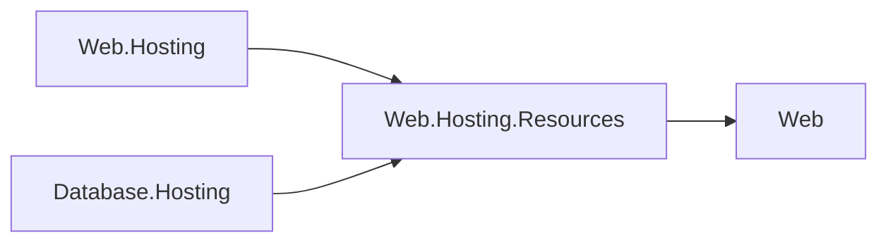

# Web area control-plane integration

Web.Hosting.Resources is a hosting-family integration over the root pipeline seam. It references Hosting.Resources, Hosting.Health, and IdentityModel.Token.JsonWebToken, and never Web.Hosting. COHRES001 prevents roots and features from consuming this integration; O35 lets the exact Web.Hosting module consume its own hosting family under COHRES002. Web.Hosting and Database.Hosting now use this single terminal, with a Web-root response-completion seam for deferred stop. A real Program factory compares the Web wrapper with the direct verb as a composition regression. Web.Testing names both runtime and terminal in its explicit exemption.

The integration is public in App.Web and private in each generic resource framework. Area ApplicationModel packages remain NuGet-only. Cross-area hosting implementation references use the coordinated CohesionPrivateProjectReference / CohesionFrameworkPrivateAssembly pair. The integration owns authentication and AOT-safe JSON; each area host owns its listener, readiness gate, and lifecycle.

Web.Hosting.Health integrates Hosting.Health contributors with the independent Web.Health model.
Database.Hosting consumes it privately for admin health checks, retaining its readiness-only accepting gate.

See [the package design](../Assimalign.Cohesion.Web.Hosting.Resources/docs/DESIGN.md) for the exact protocol and the public response-completion contract.

Both runtimes consume the control-plane integration, and the integration depends on the Web root without a reverse runtime reference.

